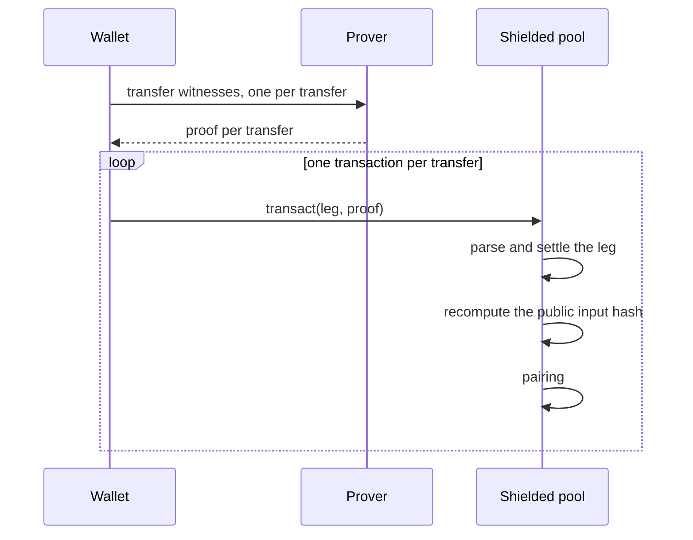
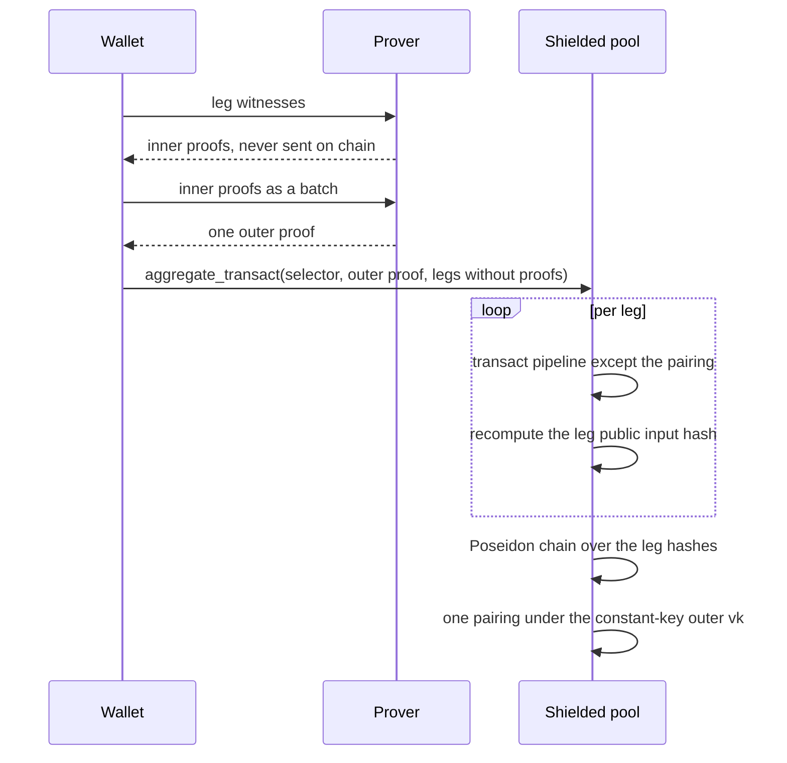
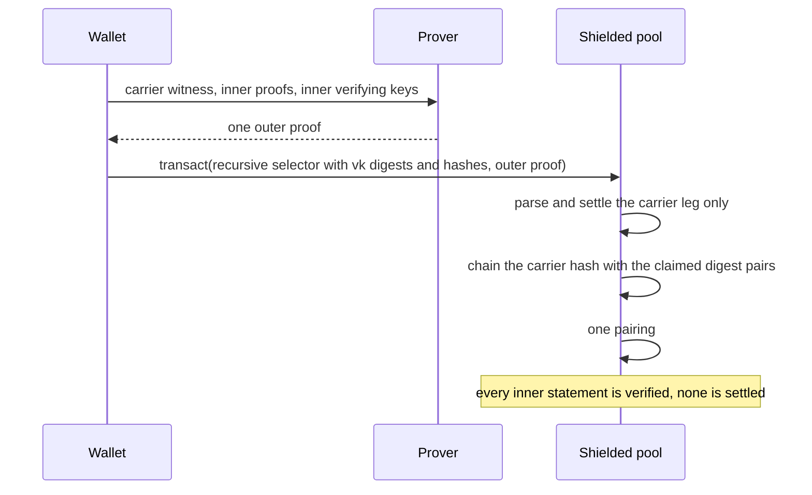

# Recursion through the transact selector

Status: not built. This compares a sketched design against the shipped
recursion path in [RECURSION.md](../RECURSION.md#aggregate-transact).

## The sketch

```rust
enum CircuitId {
    // ...existing rails...
    ConfidentialEddsaRecursive(u8, u8, u8, Bsb22Commitment, Vec<RecursiveProof>),
}

struct RecursiveProof {
    /// Poseidon(vk_commitment, public_inputs_hash)
    commitment: [u8; 32],
    vk_commitment: [u8; 32],
    public_inputs_hash: [u8; 32],
}
```

One `transact` carries everything. Its selector lists, per inner proof, a
Poseidon digest of the verifying key that checked it and the public input hash
it proved. `TransactProofInputs` gains one vector, filled from the selector in
`new`, so the per-proof commitments enter the one chained public input the pool
already verifies. The outer circuit takes each inner verifying key as a
witness, asserts its digest equals `vk_commitment`, and verifies the inner
proof against `public_inputs_hash`.

## The shipped path

`aggregate_transact`, tag 18, puts the batch in its own instruction. Legs are
unchanged `transact` payloads with a zero proof. The program runs the transact
pipeline per leg except the pairing, recomputes each leg's public input hash
from the accounts and data it settles, chains the hashes, and verifies one
outer proof whose inner verifying key is a compile-time constant of the outer
circuit. `CircuitId` is untouched. The batch selector is the separate
`AggregateCircuitId`, which names one outer key and fails closed.

## Flow before recursion



## Flow as shipped



## Flow as sketched



## The sketch fuses two jobs

Read as a batching mechanism, the sketch has a settlement gap. The
`public_inputs_hash` entries are instruction data. The pool proves the inner
proofs existed, but it parses no inner leg, so no nullifier queues, no output
appends, no interface transfer moves, and no event reaches Photon for an inner
statement. Closing that gap means parsing and settling every leg, which is the
shipped processor with a more expensive circuit under it. The vector composes
proofs. It does not batch settlement.

Read as a composition mechanism, where the inner legs are app statements a
policy program checks against the bound commitment rather than pool transfers,
the sketch is the witness-key design analysed in
[recursion_proof_design.md](recursion_proof_design.md). That reading is sound
and is the one place a witnessed key beats a constant, because a constant
cannot name a key this repository does not own. It stays unbuilt for the
reasons that document holds, and an integration today is two proofs and a CPI.

The shipped path splits the jobs. `aggregate_transact` batches settlement with
constants. Composition keeps the CPI answer now and the witness-key design
later, with the [VK registry](../vk_registry.md) as the validating home for
foreign keys.

## Why constants for our own rails

A witnessed key admits one shape, not any circuit. gnark fixes the inner
public input count, the commitment count, and `PublicAndCommitmentCommitted`
when the outer circuit compiles, so `vk_commitment` ranges over keys of one
fixed ABI. Our rails are a closed set the selector already enumerates, so for
them the digest buys generality that cannot be used. It also costs the
fixed-key route the catalogue compiles with, where the public-input MSM runs
over precomputed combs, and it adds a Poseidon digest over emulated key limbs
per leg.

The digest also skips validation a constant gets for free. Registry init runs
`g2_prepare`, which enforces curve and r-order subgroup membership, and
`pairing_map`, which fixes the GT target. An in-circuit witness repeats none of
that, and the registry digests keccak over canonical bytes while a circuit
needs Poseidon over limbs, so one key carries two digests that must agree.

With a constant, the outer verifying key alone names which inner circuit every
leg verified, and a proof under another key fails the pairing. With a digest,
the statement is a proof under some key with digest X, and the program must map
digests to authorized circuits, a data-driven check that can drift from the
key set.

The vector also rides the hot path. `CircuitId` sits in every transact payload
and is `Copy` and statically sized, which keeps borrowed instruction decoding
allocation-free. A `Vec` inside a variant ends both for every solo transact,
paying for a field only batches use. The shipped selector lives in its own
instruction, so tag 6 stays byte for byte what it was.

## What the sketch buys

Fewer ceremonies. The shipped catalogue holds one outer key per rail, shape,
and batch. A witness-key family needs one per batch and commitment class, and
a new inner circuit of the fixed ABI needs a registry entry rather than a new
setup. For a roadmap with many rails and widths that difference is
multiplicative, and it is the pressure point of the shipped design. It is the
right trade only where the key set is open, which for our own rails it is not.

| | sketched selector variant | shipped `aggregate_transact` |
|---|---|---|
| carrier | one `transact`, extended selector | dedicated instruction, tag 18 |
| inner key | witness, bound by Poseidon digest | compile-time constant |
| inner statements | hashes from instruction data | recomputed by settling each leg |
| settlement | carrier leg only | every leg |
| solo transact cost | selector grows a `Vec` | unchanged |
| outer ceremonies | per batch and commitment class | per rail, shape, and batch |
| third-party legs | reachable | unreachable by design, held in [recursion_proof_design.md](recursion_proof_design.md) |
