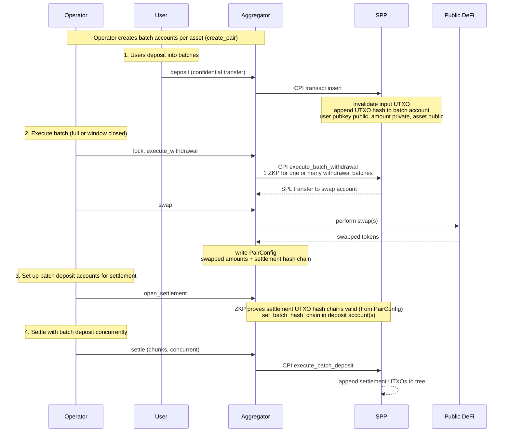

# Batch Aggregator Program

The Batch Aggregator is a confidential DeFi program built on the Solana Privacy Program
(SPP). It batches many users' confidential swaps in one direction into one public DeFi trade:
users deposit `asset_in` (e.g. SOL) into a withdrawal batch, an operator drains the batch,
swaps it for `asset_out` (e.g. USDC) on public DeFi, and settles the proceeds back to
depositors through a deposit batch. Amounts stay private; the assets, the depositor pubkeys,
and the aggregate volume are public. The reverse direction is a separate pair.

It does not configure an SPP zone. It owns SPP [batch accounts](spec.md#batch-accounts) and
drives them by CPI, using one program-wide `authority` PDA as the SPP `owner` of every batch.

## User Flow



## Table of Contents

- [Glossary](#glossary)
- [Accounts](#accounts)
  - [Authority](#authority)
  - [AggregatorConfig](#aggregatorconfig)
  - [OperatorConfig](#operatorconfig)
  - [PairConfig](#pairconfig)
- [Instructions](#instructions)
  - Admin
    - [initialize](#initialize)
    - [update_config](#update_config)
    - [create_operator](#create_operator)
    - [close_operator](#close_operator)
  - Pair lifecycle
    - [create_pair](#create_pair)
    - [close_pair](#close_pair)
  - Deposit
    - [deposit](#deposit)
  - Execute
    - [lock](#lock)
    - [execute_withdrawal](#execute_withdrawal)
    - [swap](#swap)
  - Settle
    - [open_settlement](#open_settlement)
    - [settle](#settle)

## Glossary

Types used in this document. Shared SPP types are defined in [spec.md](spec.md#glossary).

| Type | Encoding | Definition |
| --- | --- | --- |
| `Address` | `[u8; 32]` | Solana account address. |
| `asset_id` | `u64` | Asset identifier in UTXOs; `1` is SOL, each SPL mint `≥ 2`. The mint→`asset_id` map is the SPP `Asset registry` PDA; it is passed into the batch proof instructions so `asset_id` is the proof's asset public input (cheaper than the mint pubkey). See [spec.md](spec.md#glossary). |
| `SppProof` | `[u8; 128]` | Compressed vanilla Groth16 proof (A 32 + B 64 + C 32); the batch circuits add no BSB22 commitment, so there is no 64-byte commitment + PoK. Verified in SPP (batch withdrawal / deposit). |
| `ZkProof` | `[u8; 128]` | Compressed vanilla Groth16 proof verified by the aggregator program itself (the settlement-validity proof). |
| `CompressedShieldedAddress` | `[u8; 65]` | `(owner_hash [u8;32], viewing_pk P256Pubkey[33])`. See [spec.md](spec.md#shielded-address). |
| `TransactIxData` | — | SPP `transact` instruction data. See [spec.md](spec.md#transact). |
| `ExecuteBatchDepositIxData` | — | SPP `execute_batch_deposit` chunk. See [spec.md](spec.md#execute_batch_deposit). |

## Accounts

Layouts of accounts owned by the batch aggregator program, and which instructions create,
write, and close them.

### Authority

Program-wide signer PDA, seeds `[b"authority"]`. It is the SPP `owner` of every batch
account and the owner of the program's token accounts, and signs every SPP CPI and DeFi swap.
Holds no data. Because all batches share this owner, SPP enforces no isolation between
operators or pairs; the program checks each batch belongs to the calling `PairConfig` itself.

### AggregatorConfig

One per program. Holds the protocol authority and the asset allow-list. Operators can only be
created by the protocol authority.

Derivation seed: `[b"config"]`.

Created by `initialize`. `update_config` rotates `authority` or edits the allow-list; setting
`authority` to the default freezes it.

```rust
struct AggregatorConfig {
    /// Account type tag.
    discriminator: u8,
    /// Creates operators and updates this config. The default value freezes it.
    authority: Address,
    /// Protocol fee in basis points; upper-bounds each `PairConfig.fee_bps`.
    max_fee_bps: u16,
    /// Assets the aggregator supports.
    assets: Vec<asset_id>,
}
```

### OperatorConfig

One per operator, created only by the protocol authority. Names the key that signs the
operator's pair and round instructions.

Derivation seed: `[b"operator", id]`.

Created by `create_operator`. `close_operator` reclaims rent.

```rust
struct OperatorConfig {
    /// Account type tag.
    discriminator: u8,
    /// Operator id; PDA seed.
    id: u64,
    /// Signs this operator's create_pair / lock / execute / swap / settle calls.
    authority: Address,
}
```

### PairConfig

A one-directional market `asset_in -> asset_out` under one operator: the single aggregator
account per pair. It holds the swap parameters, the two SPP batch accounts it drives, and the
current round's swap data. Multiple pairs of the same assets are allowed (e.g. both swap
directions, or different windows), disambiguated by `id`.

Derivation seed: `[b"pair", operator, id]`.

Created by `create_pair`, which also creates the SPP withdrawal and deposit batches (owned by
`authority`). `lock`, `execute_withdrawal`, and `swap` advance `state` and fill the round's
swap fields; `open_settlement` and `settle` consume them; the final `settle` resets the round
fields and the batches for the next round; `close_pair` closes everything and reclaims rent.

```rust
struct PairConfig {
    /// Account type tag.
    discriminator: u8,
    /// OperatorConfig this pair belongs to.
    operator: Address,
    /// Disambiguates pairs; PDA seed.
    id: u64,
    /// Deposited asset (swap input).
    asset_in: asset_id,
    /// Settled asset (swap output).
    asset_out: asset_id,
    /// Swap fee in basis points; <= AggregatorConfig.max_fee_bps.
    fee_bps: u16,
    /// SPP batch_size for the withdrawal and deposit batches.
    batch_size: u16,
    /// Inclusive deposit-amount band (asset_in); snapshotted into the withdrawal batch at
    /// create_pair and enforced by the SPP inserting and batch proofs. Bounds the privacy
    /// set: every confidential deposit amount lies in this range.
    min_amount: u64,
    max_amount: u64,
    /// Deposits accepted until lock, or until created_at + window.
    window: i64,
    /// Round counter; advanced by the final settle chunk.
    round: u64,
    /// SPP batch accounts owned by `authority`, reused each round.
    withdrawal: Address,
    deposit: Address,
    /// Current round's swap data, filled across execute_withdrawal -> swap and zeroed by
    /// the final settle chunk. `withdrawal_chain` is read by the settle proof to bind each
    /// settlement output's encryption to the viewing key committed there (see settle); the
    /// settlement chain itself lives in the deposit batch (`current_hash_chain`), not here.
    withdrawal_chain: [u8; 32],
    amount_in: u64,
    amount_out: u64,
    /// Collecting | Locked | Withdrawn | Swapped | Settling.
    state: u8,
}
```

## Instructions

**Admin**

| # | Instruction | Tag | Description | Accounts Read | Accounts Modified | Access control |
|---|-------------|-----|-------------|---------------|-------------------|----------------|
| 1 | [initialize](#initialize) | 0 | Create the `AggregatorConfig`. | — | AggregatorConfig (create) | Protocol authority signs the value it writes |
| 2 | [update_config](#update_config) | 1 | Rotate `authority` or edit the allow-list; default `authority` freezes it. | — | AggregatorConfig | `authority` signs |
| 3 | [create_operator](#create_operator) | 2 | Create an `OperatorConfig`. | AggregatorConfig | OperatorConfig (create) | Protocol `authority` signs |
| 4 | [close_operator](#close_operator) | 3 | Close an operator and reclaim rent. | AggregatorConfig | OperatorConfig (close) | Protocol `authority` signs |

**Swap Pair**

| # | Instruction | Tag | Description | Accounts Read | Accounts Modified | Access control |
|---|-------------|-----|-------------|---------------|-------------------|----------------|
| 5 | [create_pair](#create_pair) | 4 | Open a `PairConfig` and its SPP withdrawal and deposit batches (owned by `authority`). | OperatorConfig | PairConfig (create), BatchWithdrawal (CPI create), BatchDeposit (CPI create) | Operator `authority` signs |
| 6 | [close_pair](#close_pair) | 5 | Close an idle pair: its `PairConfig` and both batches; reclaim rent. | OperatorConfig | PairConfig (close), BatchWithdrawal (CPI close), BatchDeposit (CPI close) | Operator `authority` signs |

**Deposit**

| # | Instruction | Tag | Description | Accounts Read | Accounts Modified | Access control |
|---|-------------|-----|-------------|---------------|-------------------|----------------|
| 7 | [deposit](#deposit) | 6 | Confidential transfer into a pair's withdrawal batch (CPIs SPP `transact`, `authority` co-signs the insert). | PairConfig | BatchWithdrawal (CPI), SPP trees (CPI), SPL interface | Depositor signs |

**Execute**

| # | Instruction | Tag | Description | Accounts Read | Accounts Modified | Access control |
|---|-------------|-----|-------------|---------------|-------------------|----------------|
| 8 | [lock](#lock) | 7 | Close the deposit window; CPIs SPP `lock_batch_withdrawal_account`. | OperatorConfig | PairConfig, BatchWithdrawal (CPI) | Operator `authority` signs |
| 9 | [execute_withdrawal](#execute_withdrawal) | 8 | Drain the withdrawal batch to the `authority` token account; CPIs SPP `execute_batch_withdrawal`. | OperatorConfig | PairConfig, BatchWithdrawal (CPI), vault_in | Operator `authority` signs |
| 10 | [swap](#swap) | 9 | Swap on public DeFi and write the round into the `PairConfig`. | OperatorConfig | PairConfig, vault_in, vault_out | Operator `authority` signs |

**Settle**

| # | Instruction | Tag | Description | Accounts Read | Accounts Modified | Access control |
|---|-------------|-----|-------------|---------------|-------------------|----------------|
| 11 | [open_settlement](#open_settlement) | 10 | Verify the settlement-validity proof, take the fee, escrow `net` into the deposit batch, and `set_batch_hash_chain` the proven settlement chain on it. | OperatorConfig, PairConfig | BatchDeposit (CPI), PairConfig (state), vault_out, spl_interface, fee_recipient | Operator `authority` signs |
| 12 | [settle](#settle) | 11 | Append a settlement chunk; CPIs SPP `execute_batch_deposit`. The final chunk resets the deposit batch and the `PairConfig` for the next round (not closed). | OperatorConfig | PairConfig, BatchDeposit (CPI), SPP tree (CPI) | Operator `authority` signs |

---

### initialize

Creates the program's single [`AggregatorConfig`](#aggregatorconfig) at its derived PDA.

**Accounts**

1. `payer` — pays rent; signer, writable.
2. `config` — created at its derived PDA; writable.
3. `system_program` — read.

**Instruction data**

```rust
struct InitializeIxData {
    authority: Address,
    max_fee_bps: u16,
    assets: Vec<asset_id>,
}
```

---

### update_config

Overwrites the [`AggregatorConfig`](#aggregatorconfig) mutable fields. Setting `authority`
to the default freezes the config.

**Accounts**

1. `authority` — must equal `config.authority`; signer.
2. `config` — updated; writable.

**Instruction data**

```rust
struct UpdateConfigIxData {
    authority: Address,
    max_fee_bps: u16,
    assets: Vec<asset_id>,
}
```

---

### create_operator

Creates an [`OperatorConfig`](#operatorconfig). Only the protocol authority may call it.

**Accounts**

1. `authority` — must equal `config.authority`; signer, writable (pays rent).
2. `config` — read.
3. `operator` — created at `[b"operator", id]`; writable.
4. `system_program` — read.

**Instruction data**

```rust
struct CreateOperatorIxData {
    id: u64,
    /// Signs the operator's pair and round instructions.
    operator_authority: Address,
}
```

---

### close_operator

Closes an [`OperatorConfig`](#operatorconfig) with no open pairs and reclaims rent. Takes no
instruction data.

**Accounts**

1. `authority` — must equal `config.authority`; signer.
2. `config` — read.
3. `operator` — closed; writable.
4. `rent_recipient` — receives the reclaimed rent; writable.

---

### create_pair

Creates a [`PairConfig`](#pairconfig) and the two SPP batch accounts it drives — a
[`BatchWithdrawalAccount`](spec.md#batch-accounts) for `asset_in` and a
[`BatchDepositAccount`](spec.md#batch-accounts) for `asset_out`, both owned by `authority`
(CPIing SPP `create_batch_withdrawal_account` and `create_batch_deposit_account`). Records the
two batch addresses in the config and sets `state = Collecting`. The deposit batch is created
empty; `open_settlement` escrows into it each round. The `[min_amount, max_amount]` band is
snapshotted into the withdrawal batch (it bounds `asset_in` deposit amounts); the deposit batch
is created with a permissive band, since settlement amounts follow the swap and are bound by the
`aggregate == net` check, not a per-output band.

**Accounts**

1. `operator_authority` — must equal `operator.authority`; signer, writable (pays rent).
2. `operator` — read.
3. `pair_config` — created at `[b"pair", operator, id]`; writable.
4. `authority` — program PDA; the SPP `owner` of both batches; signs the SPP CPIs.
5. `withdrawal` — the SPP withdrawal batch, created by CPI; writable.
6. `deposit` — the SPP deposit batch, created by CPI; writable.
7. `spp_program` — SPP program (CPI target).
8. `system_program` — read.

**Instruction data**

```rust
struct CreatePairIxData {
    id: u64,
    asset_in: asset_id,
    asset_out: asset_id,
    fee_bps: u16,
    batch_size: u16,
    /// Inclusive deposit-amount band (asset_in); forwarded to both SPP batches.
    min_amount: u64,
    max_amount: u64,
    window: i64,
}
```

---

### close_pair

Closes a [`PairConfig`](#pairconfig) and its two SPP batch accounts, reclaiming rent. Callable
only when the pair is idle (the last round settled); an idle pair is not closed automatically,
the operator calls this explicitly. Takes no instruction data.

**Accounts**

1. `operator_authority` — must equal `operator.authority`; signer.
2. `operator` — read.
3. `pair_config` — closed; writable.
4. `authority` — program PDA; signs the SPP CPIs.
5. `withdrawal` — closed by CPI; writable.
6. `deposit` — closed by CPI; writable.
7. `spp_program` — SPP program (CPI target).
8. `rent_recipient` — receives the reclaimed rent; writable.

---

### deposit

A user joins a round: a confidential transfer that spends the depositor's `asset_in` UTXO and
routes the output into the pair's withdrawal batch. CPIs SPP [`transact`](spec.md#transact)
with `batch_inserts` set; `authority` co-signs the insert as the batch `owner`. The
depositor's settlement pubkey is public (the operator pays the swapped proceeds back to it);
the amount is private but must lie in the pair's `[min_amount, max_amount]` band (the SPP
inserting proof enforces it); the asset is public. Rejected once the deposit window has closed
(`state != Collecting` or past `window`).

**Accounts**

1. `depositor` — spends the input UTXO; signer, writable (fee payer).
2. `pair_config` — read.
3. `authority` — program PDA; co-signs the SPP insert.
4. `withdrawal` — the pair's withdrawal batch; writable.
5. `spp_program` — SPP program (CPI target).
6. `tree_accounts` — SPP Tree accounts the transfer touches; writable.
7. `spl_interface` — SPL interface account for `asset_in`; writable.

**Instruction data**

```rust
struct DepositIxData {
    /// SPP transact payload (proof, inputs, output hashes, ciphertexts, batch_inserts
    /// routing the output into the pair's withdrawal batch). See spec.md transact.
    transact: TransactIxData,
    /// Recipient shielded address the swapped proceeds settle to. The settlement proof
    /// verifiably encrypts the depositor's `asset_out` output to `viewing_pk`, so the
    /// depositor recovers it without trusting the operator's encryption.
    settlement_address: CompressedShieldedAddress,
}
```

**Viewing-key commitment.** The deposit commits the depositor's settlement `viewing_pk` into
the withdrawal hash chain: the leaf folded for this deposit is `Poseidon(viewing_pk, utxo_hash)`
rather than a bare `utxo_hash`, so the chain is `HashChain(prev, Poseidon(viewing_pk, utxo_hash))`.
The settlement proof witnesses each `viewing_pk` privately and checks it against this leaf, so no
per-depositor viewing key is a public input — the proof cost is independent of the batch size
(see [`settle`](#settle)). `settlement_address` still travels in instruction data, public, so the
operator can build the settlement ciphertexts (depositor pubkeys are a public aggregator
property); the chain commitment is what binds the encryption to the depositor's key. This makes
the aggregator's withdrawal-batch leaf serialization `Poseidon(viewing_pk, utxo_hash)`, which the
SPP `batch_inserts` fold must support.

**Instruction data size.** `1 (tag) + TransactIxData + 65 (settlement_address)`. `TransactIxData`
is the SPP payload for the chosen shape (see the [transact size table](spec.md#transact)) plus
`~6 B` for the single `batch_inserts` entry routing the output. The output is routed at a
recipient position, so the shape needs a recipient slot (`M ≥ 3`); a 3-in 3-out deposit is
`1 + 611 + 6 + 65 ≈ 683 B`.

---

### lock

Closes the deposit window for a [`PairConfig`](#pairconfig): CPIs SPP `lock_batch_withdrawal_account` and
sets `state = Locked`. Callable once the window has elapsed or at the operator's discretion.

**Accounts**

1. `operator_authority` — must equal `operator.authority`; signer.
2. `operator` — read.
3. `pair_config` — `state` updated; writable.
4. `authority` — program PDA; signs the SPP CPI.
5. `withdrawal` — locked by CPI; writable.
6. `spp_program` — SPP program (CPI target).

**Instruction data size.** `1 B` (tag only; no fields).

---

### execute_withdrawal

Drains the withdrawal batch to the program's `asset_in` token account, CPIing SPP
`execute_batch_withdrawal`. Writes the drained `withdrawal_chain` and `amount_in` into the
[`PairConfig`](#pairconfig) for `swap`, and sets `state = Withdrawn`.

**Accounts**

1. `operator_authority` — must equal `operator.authority`; signer, writable (fee payer).
2. `operator` — read.
3. `pair_config` — `state`, `withdrawal_chain`, and `amount_in` written; writable.
4. `authority` — program PDA; SPP `owner`, signs the SPP CPI and receives the payout.
5. `withdrawal` — drained by CPI; writable.
6. `vault_in` — the program's `asset_in` token account (`authority`-owned) receiving the payout; writable.
7. `asset_registry` — SPP `Asset registry` PDA for `asset_in`; supplies `asset_id` as the proof's asset public input; read.
8. `spp_program` — SPP program (CPI target).

**Instruction data**

```rust
struct ExecuteWithdrawalIxData {
    /// See spec.md execute_batch_withdrawal.
    proof: SppProof,
    aggregate_in: u64,
}
```

**Instruction data size.** `1 (tag) + 128 (proof) + 8 (aggregate_in) = 137 B`.

---

### swap

Swaps the drained `asset_in` for `asset_out` against public DeFi (CPI to the AMM, signed by
`authority`) and writes `amount_out` into the [`PairConfig`](#pairconfig) (`amount_in`
and `withdrawal_chain` were written by `execute_withdrawal`). Sets `state = Swapped`.

**Accounts**

1. `operator_authority` — must equal `operator.authority`; signer, writable (fee payer).
2. `operator` — read.
3. `pair_config` — `state` and `amount_out` written; writable.
4. `authority` — program PDA; signs the DeFi swap.
5. `vault_in`, `vault_out` — the program's token accounts; writable.
6. `amm_program`, `amm_accounts` — the DeFi venue (CPI target and its accounts).

**Instruction data**

```rust
struct SwapIxData {
    /// Minimum acceptable asset_out (slippage bound).
    min_out: u64,
}
```

**Instruction data size.** `1 (tag) + 8 (min_out) = 9 B`.

The program writes `amount_out` into the [`PairConfig`](#pairconfig) from the CPI result.

---

### open_settlement

Funds the pair's SPP [`BatchDepositAccount`](spec.md#batch-accounts) from the swap proceeds and
commits its settlement hash chain (CPIing SPP `set_batch_hash_chain`). The swap proceeds sit in
`vault_out`, an `authority`-owned SPL token account holding `amount_out` of `asset_out`. The
operator fee is taken here: `fee = amount_out · fee_bps / 10_000` moves from `vault_out` to the
operator's `fee_recipient`, and the remaining `net = amount_out − fee` moves into the SPP SPL
interface vault for `asset_out` (the escrow backing the deposit batch). There is no external
depositor escrow, so the amount is known only after `swap` and is supplied here, not at
`create_pair`. The deposit batch was created empty by `create_pair`; this funds and chains it
for the round.

The settlement chain arrives in instruction data with a **settlement-validity proof**, verified
before it is committed. Its leaves are `Poseidon(viewing_pk, utxo_hash)`, mirroring the
withdrawal chain. The proof shows:

1. **Correct UTXOs** — the settlement chain consists of the right settlement outputs, one per
   withdrawal depositor.
2. **Correct amounts** — each UTXO's amount is that depositor's `asset_in` deposit re-priced by
   `net / amount_in` (from the swap proceeds and the deposited UTXO).
3. **View keys committed** — each leaf's `viewing_pk` equals the one the depositor committed in
   `withdrawal_chain`, so the settlement chain commits the same view keys.

So the operator cannot misallocate, omit, or redirect any depositor's proceeds. Only after the
proof verifies does `set_batch_hash_chain` commit the chain to the deposit batch (it is not
stored in the `PairConfig`); `settle` then appends the chain's UTXOs and encrypts each to the
`viewing_pk` in its own settlement leaf. Sets `state = Settling`.

Because the escrow is the swap output (an SPL transfer from `vault_out` at settlement) rather
than a depositor transfer at create, the SPP deposit batch must accept funding at
`set_batch_hash_chain` time from its `owner` (`authority`), not only at
`create_batch_deposit_account` — an SPP-side requirement, see [Batch Accounts](spec.md#batch-accounts).

**Accounts**

1. `operator_authority` — must equal `operator.authority`; signer, writable (fee payer).
2. `operator` — read.
3. `pair_config` — `withdrawal_chain`, `amount_in`, `amount_out` read as the proof's public inputs; `state` written; writable.
4. `authority` — program PDA; SPP `owner`, owns `vault_out`, signs the SPP CPIs and the funding transfer.
5. `deposit` — the pair's SPP deposit batch; funded and chained by CPI; writable.
6. `vault_out` — `authority`-owned SPL token account holding the swap proceeds; the funding source; writable.
7. `spl_interface` — SPP SPL interface vault for `asset_out`; the escrow destination; writable.
8. `fee_recipient` — operator token account receiving `fee = amount_out · fee_bps / 10_000`; writable.
9. `spp_program` — SPP program (CPI target).

**Instruction data**

```rust
struct OpenSettlementIxData {
    /// Settlement-validity proof, verified by the aggregator before `set_batch_hash_chain`
    /// commits the chain.
    proof: ZkProof,
    settlement_chain: [u8; 32],
    num_inserts: u16,
}
```

**Instruction data size.** `1 (tag) + 128 (proof) + 32 (settlement_chain) + 2 (num_inserts) = 163 B`.

---

### settle

Appends one chunk of the settlement chain to the SPP UTXO tree, CPIing SPP
`execute_batch_deposit`. Repeated until the chain is fully appended. The final chunk wipes the
SPP deposit batch and the pair's [`PairConfig`](#pairconfig) for the next round — both are
reset (chains and amounts zeroed, `PairConfig.round` advanced, `state` returned to
`Collecting`), not closed — so no separate close instruction is needed. The deposit batch and
`PairConfig` are closed only by `close_pair`.

**Verifiable encryption.** The `execute_batch_deposit` proof verifiably encrypts each settlement
output to its depositor's `viewing_pk`, reusing the SPP [Merge Proof verifiable encryption](spec.md#merge-proof---merge-zk-proof)
scheme (DHKEM(P-256) + Poseidon KDF + AES-256-CTR, integrity from the in-proof `ciphertext_hash`,
no GCM tag). The `viewing_pk` is the one committed in this output's settlement-chain leaf
`Poseidon(viewing_pk, utxo_hash)` — which [`open_settlement`](#open_settlement) already proved
equals the depositor's `withdrawal_chain` commitment. The proof witnesses it privately and binds
the encryption to it, so it is never a public input and the proof cost does not grow with the
depositor count. So a depositor recovers and spends their `asset_out` from the published
ciphertext alone; the operator cannot hand back an output the depositor cannot decrypt.

**Accounts**

1. `operator_authority` — must equal `operator.authority`; signer, writable (fee payer).
2. `operator` — read.
3. `pair_config` — appended round read, then reset on the final chunk; writable.
4. `authority` — program PDA; SPP `owner`, signs the SPP CPI.
5. `deposit` — the SPP deposit batch; appended to, then reset on the final chunk; writable.
6. `asset_registry` — SPP `Asset registry` PDA for `asset_out`; supplies `asset_id` as the proof's asset public input; read.
7. `spp_program` — SPP program (CPI target).
8. `tree_account` — SPP UTXO tree; writable.

**Instruction data**

```rust
struct SettleIxData {
    /// SPP execute_batch_deposit chunk; see spec.md.
    execute: ExecuteBatchDepositIxData,
}
```

**Instruction data size.** `1 (tag) + ExecuteBatchDepositIxData` = `1 + 128 (proof) + 2
(start_index) + 33 (shared tx_viewing_pk) + (1 + 32·c) (output_utxo_hashes) + (1 + c·82)
(output_ciphertexts)` = `166 + 114·c` for a chunk of `c` settlement leaves. Vector counts use a
1-byte `u8` prefix and the ciphertext a 2-byte `u16` length (spec.md encoding), so each
`OutputCiphertext` is `32 (owner tag) + 2 (len) + 48 (ciphertext)` = 82 B: the spec.md
confidential recipient plaintext is 48 B and verifiable encryption is AES-256-CTR with no tag,
so the ciphertext is also 48 B. One ephemeral `tx_viewing_pk` is shared per chunk (ECDH to each
recipient's `viewing_pk`). A 5-leaf chunk is `~736 B`; `c` is bounded by the per-transaction
limit.
