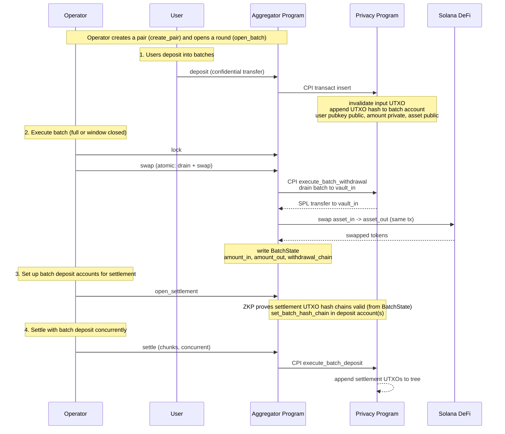

# Batch Aggregator Program

The Batch Aggregator enable confidential balances to use public Solana defi without revealing the users amounts.
User public key and asset are public. The aggregator program batches many users' confidential swaps in one direction into one public DeFi trade:
users deposit `asset_in` (e.g. SOL) into a withdrawal batch, an operator processes the batch,
swaps it for `asset_out` (e.g. USDC) on public DeFi, and settles the proceeds back to
depositors through a deposit batch. Amounts stay private; the assets, the depositor pubkeys,
and the aggregate volume are public. The reverse direction is a separate pair. The batch is encrypted to the operator and is a single point of failure.

It does not configure an SPP zone. It owns SPP [batch accounts](spec.md#batch-accounts) and
drives them by CPI, using one program-wide `authority` PDA as the SPP `owner` of every batch.

## User Flow



## Table of Contents

- [Glossary](#glossary)
- [Accounts](#accounts)
  - [Authority](#authority)
  - [Rent sponsor](#rent-sponsor)
  - [AggregatorConfig](#aggregatorconfig)
  - [OperatorConfig](#operatorconfig)
  - [PairConfig](#pairconfig)
  - [BatchState](#batchstate)
- [Instructions](#instructions)
  - Admin
    - [initialize](#initialize)
    - [update_config](#update_config)
    - [create_operator](#create_operator)
    - [close_operator](#close_operator)
    - [withdraw_rent_sponsor](#withdraw_rent_sponsor)
  - Pair lifecycle
    - [create_pair](#create_pair)
    - [close_pair](#close_pair)
  - Batch
    - [open_batch](#open_batch)
  - Deposit
    - [deposit](#deposit)
  - Execute
    - [lock](#lock)
    - [swap](#swap)
  - Settle
    - [open_settlement](#open_settlement)
    - [settle](#settle)
    - [close_batch](#close_batch)

## Glossary

Types used in this document. Shared SPP types are defined in [spec.md](spec.md#glossary).

| Type | Encoding | Definition |
| --- | --- | --- |
| `Address` | `[u8; 32]` | Solana account address. |
| `asset_id` | `u64` | Asset identifier in UTXOs; `1` is SOL, each SPL mint `≥ 2`. The mint→`asset_id` map is the SPP `Asset registry` PDA; it is passed into the batch proof instructions so `asset_id` is the proof's asset public input (cheaper than the mint pubkey). See [spec.md](spec.md#glossary). |
| `SppProof` | `[u8; 128]` | Compressed vanilla Groth16 proof (A 32 + B 64 + C 32, no BSB22 commitment), used by `execute_batch_withdrawal`. The `execute_batch_deposit` (settlement) proof adds a BSB22 commitment + PoK for its verifiable encryption and is **192 B**. Both verified in SPP. |
| `ZkProof` | `[u8; 128]` | Compressed vanilla Groth16 proof verified by the aggregator program itself (the settlement-validity proof). |
| `CompressedShieldedAddress` | `[u8; 65]` | `(owner_hash [u8;32], viewing_pk P256Pubkey[33])`. See [spec.md](spec.md#shielded-address). |
| `TransactIxData` | — | SPP `transact` instruction data. See [spec.md](spec.md#transact). |
| `ExecuteBatchDepositIxData` | — | SPP `execute_batch_deposit` chunk. See [spec.md](spec.md#execute_batch_deposit). |

## Accounts

Layouts of accounts owned by the batch aggregator program, and which instructions create,
write, and close them.

### Authority

Program-wide signer PDA, seeds `[b"authority"]`. It is the SPP `owner` of every batch
account and the owner of the program's token accounts, and signs every SPP CPI and DeFi swap.
Holds no data. Because all batches share this owner, SPP enforces no isolation between
operators or pairs; the program checks each batch belongs to the calling `PairConfig` itself.

### Rent sponsor

Per-operator signer PDA, seeds `[b"rent_sponsor", operator_authority]`, where `operator_authority`
is the operator's signing key — the same value stored in `BatchState.operator`, so the PDA is
derivable from `batch_state.operator` everywhere. Holds SOL the operator deposits;
the program signs for it to pay each round's batch rents, and every close returns the rent to it.
The operator reclaims the balance via [`withdraw_rent_sponsor`](#withdraw_rent_sponsor). Holds no
data.

### AggregatorConfig

One per program. Holds the protocol authority and the asset allow-list. Operators can only be
created by the protocol authority.

Derivation seed: `[b"config"]`.

Created by `initialize`. `update_config` rotates `authority` or edits the allow-list; setting
`authority` to the default freezes it.

```rust
struct AggregatorConfig {
    /// Account type tag.
    discriminator: u8,
    /// Creates operators and updates this config. The default value freezes it.
    authority: Address,
    /// Protocol fee in basis points; upper-bounds each `PairConfig.fee_bps`.
    max_fee_bps: u16,
    /// Assets the aggregator supports.
    assets: Vec<asset_id>,
}
```

### OperatorConfig

One per operator, created only by the protocol authority. Names the key that signs the
operator's pair and round instructions.

Derivation seed: `[b"operator", id]`.

Created by `create_operator`. `close_operator` reclaims rent.

```rust
struct OperatorConfig {
    /// Account type tag.
    discriminator: u8,
    /// Operator id; PDA seed.
    id: u64,
    /// Signs this operator's create_pair / lock / execute / swap / settle calls.
    authority: Address,
}
```

### PairConfig

A one-directional market `asset_in -> asset_out` under one operator: the persistent, config-only
aggregator account per pair. It holds the swap parameters and the batch counter; all per-round
mutable state lives in the round's [`BatchState`](#batchstate). Multiple pairs of the same
assets are allowed (e.g. both swap directions, or different windows), disambiguated by `id`.

Derivation seed: `[b"pair", operator, id]`.

Created by `create_pair`. `open_batch` advances `batch_count`; `close_pair` closes the pair once
no round is open.

```rust
struct PairConfig {
    /// Account type tag.
    discriminator: u8,
    /// OperatorConfig this pair belongs to.
    operator: Address,
    /// Disambiguates pairs; PDA seed.
    id: u64,
    /// Deposited asset (swap input).
    asset_in: asset_id,
    /// Settled asset (swap output).
    asset_out: asset_id,
    /// Swap fee in basis points; <= AggregatorConfig.max_fee_bps.
    fee_bps: u16,
    /// SPP batch_size for the round's withdrawal and deposit batches.
    batch_size: u16,
    /// Inclusive deposit-amount band (asset_in); snapshotted into the withdrawal batch at
    /// open_batch and enforced by the SPP inserting and batch proofs. Bounds the privacy
    /// set: every confidential deposit amount lies in this range.
    min_amount: u64,
    max_amount: u64,
    /// Deposits accepted until lock, or until the round opened + window.
    window: i64,
    /// Batch counter (rounds opened). The round's BatchState is at `[b"batch", pair, batch_count]`;
    /// the SPP batches use the BatchState address as their 32-byte SPP `id`, so they are unique
    /// per round (the shared `authority` owner makes the SPP seed otherwise collide).
    /// `open_batch` advances it; before opening it confirms the previous round's BatchState
    /// is closed (no round open).
    batch_count: u64,
}
```

### BatchState

The per-round aggregator account: a config snapshot from `PairConfig` (so round instructions
after `open_batch` read only this account) plus the round's mutable `state` and swap data. Created
with the round's SPP batches by `open_batch`, closed with them by `close_batch`.

Derivation seed: `[b"batch", pair, batch_count]`.

Created by [`open_batch`](#open_batch); advanced by `lock` / `swap` / `open_settlement` /
`settle`; closed by [`close_batch`](#close_batch).

```rust
struct BatchState {
    /// Account type tag.
    discriminator: u8,
    /// PairConfig this round belongs to.
    pair: Address,
    /// Round index; PDA seed.
    batch_count: u64,
    /// Operator authority key, snapshotted from OperatorConfig at open_batch; the signer for
    /// this round's operator-gated instructions (so they check the signer against this account).
    operator: Address,
    /// Config snapshot from PairConfig at open_batch, so round instructions need only this account.
    asset_in: asset_id,
    asset_out: asset_id,
    fee_bps: u16,
    min_amount: u64,
    max_amount: u64,
    /// Collecting | Locked | Swapped | Settling | Settled.
    state: u8,
    /// Processed withdrawal chain; the settlement proofs check each settlement output against the
    /// viewing key committed at deposit (the settlement chain lives in the SPP deposit batch).
    withdrawal_chain: [u8; 32],
    /// Aggregate asset_in unshielded into the swap.
    amount_in: u64,
    /// Aggregate asset_out received from the swap.
    amount_out: u64,
}
```

## Instructions

**Admin**

| # | Instruction | Tag | Description | Accounts Read | Accounts Modified | Access control |
|---|-------------|-----|-------------|---------------|-------------------|----------------|
| 1 | [initialize](#initialize) | 0 | Create the `AggregatorConfig`. | — | AggregatorConfig (create) | Protocol authority signs the value it writes |
| 2 | [update_config](#update_config) | 1 | Rotate `authority` or edit the allow-list; default `authority` freezes it. | — | AggregatorConfig | `authority` signs |
| 3 | [create_operator](#create_operator) | 2 | Create an `OperatorConfig`. | AggregatorConfig | OperatorConfig (create) | Protocol `authority` signs |
| 4 | [close_operator](#close_operator) | 3 | Close an operator and reclaim rent. | AggregatorConfig | OperatorConfig (close) | Protocol `authority` signs |
| 5 | [withdraw_rent_sponsor](#withdraw_rent_sponsor) | 4 | Operator withdraws SOL from its `rent_sponsor` PDA. | OperatorConfig | rent_sponsor (lamports) | Operator `authority` signs |

**Pair lifecycle**

| # | Instruction | Tag | Description | Accounts Read | Accounts Modified | Access control |
|---|-------------|-----|-------------|---------------|-------------------|----------------|
| 6 | [create_pair](#create_pair) | 5 | Create a `PairConfig` (config only; per-round batches are created by `open_batch`/`open_settlement`). | OperatorConfig | PairConfig (create) | Operator `authority` signs |
| 7 | [close_pair](#close_pair) | 6 | Close a `PairConfig` with no open round and reclaim rent. | OperatorConfig, BatchState (must be closed) | PairConfig (close) | Operator `authority` signs |

**Batch**

| # | Instruction | Tag | Description | Accounts Read | Accounts Modified | Access control |
|---|-------------|-----|-------------|---------------|-------------------|----------------|
| 8 | [open_batch](#open_batch) | 7 | Start a round: advance `batch_count` and create the round's `BatchState` and both SPP batches (withdrawal + empty deposit; rent from `rent_sponsor`). Only when the previous round's `BatchState` is closed. | OperatorConfig, PairConfig | PairConfig (batch_count), BatchState (create), BatchWithdrawal (CPI create), BatchDeposit (CPI create), rent_sponsor (rent) | Operator `authority` signs |

**Deposit**

| # | Instruction | Tag | Description | Accounts Read | Accounts Modified | Access control |
|---|-------------|-----|-------------|---------------|-------------------|----------------|
| 9 | [deposit](#deposit) | 8 | Confidential transfer into the round's withdrawal batch (CPIs SPP `transact`, `authority` co-signs the insert). | BatchState | BatchWithdrawal (CPI), SPP trees (CPI), SPL interface | Depositor signs |

**Execute**

| # | Instruction | Tag | Description | Accounts Read | Accounts Modified | Access control |
|---|-------------|-----|-------------|---------------|-------------------|----------------|
| 10 | [lock](#lock) | 9 | Close the deposit window; CPIs SPP `lock_batch_withdrawal_account`. | — | BatchState (state), BatchWithdrawal (CPI) | Signer == `batch_state.operator` |
| 11 | [swap](#swap) | 10 | Atomically drain the withdrawal batch (CPIs SPP `execute_batch_withdrawal`) and swap `asset_in` → `asset_out` on public DeFi, so the amount is never exposed between drain and swap. Writes `withdrawal_chain`, `amount_in`, `amount_out` into the `BatchState`. | — | BatchState (state, chain, amount_in, amount_out), BatchWithdrawal (CPI), vault_in, vault_out | Signer == `batch_state.operator` |

**Settle**

| # | Instruction | Tag | Description | Accounts Read | Accounts Modified | Access control |
|---|-------------|-----|-------------|---------------|-------------------|----------------|
| 12 | [open_settlement](#open_settlement) | 11 | Verify the settlement-validity proof, take the fee, escrow `net` into the (already-created) deposit batch, and `set_batch_hash_chain` the proven chain. | — | BatchState (state), BatchDeposit (CPI fund+chain), vault_out, spl_interface, fee_recipient | Signer == `batch_state.operator` |
| 13 | [settle](#settle) | 12 | Append a settlement chunk; CPIs SPP `execute_batch_deposit`. The final chunk leaves the deposit batch `Executed` and sets `BatchState.state = Settled`. | — | BatchState (state), BatchDeposit (CPI), SPP tree (CPI) | Signer == `batch_state.operator` |
| 14 | [close_batch](#close_batch) | 13 | Close all the round's accounts at once — the `BatchState` and both SPP batches — returning rent to `rent_sponsor`. Only from `Settled`. | — | BatchState (close), BatchWithdrawal (CPI close), BatchDeposit (CPI close), rent_sponsor | Signer == `batch_state.operator` |

---

### initialize

Creates the program's single [`AggregatorConfig`](#aggregatorconfig) at its derived PDA.

**Accounts**

1. `payer` — pays rent; signer, writable.
2. `config` — created at its derived PDA; writable.
3. `system_program` — read.

**Instruction data**

```rust
struct InitializeIxData {
    authority: Address,
    max_fee_bps: u16,
    assets: Vec<asset_id>,
}
```

---

### update_config

Overwrites the [`AggregatorConfig`](#aggregatorconfig) mutable fields. Setting `authority`
to the default freezes the config.

**Accounts**

1. `authority` — must equal `config.authority`; signer.
2. `config` — updated; writable.

**Instruction data**

```rust
struct UpdateConfigIxData {
    authority: Address,
    max_fee_bps: u16,
    assets: Vec<asset_id>,
}
```

---

### create_operator

Creates an [`OperatorConfig`](#operatorconfig). Only the protocol authority may call it.

**Accounts**

1. `authority` — must equal `config.authority`; signer, writable (pays rent).
2. `config` — read.
3. `operator` — created at `[b"operator", id]`; writable.
4. `system_program` — read.

**Instruction data**

```rust
struct CreateOperatorIxData {
    id: u64,
    /// Signs the operator's pair and round instructions.
    operator_authority: Address,
}
```

---

### close_operator

Closes an [`OperatorConfig`](#operatorconfig) with no open pairs and reclaims rent. Takes no
instruction data.

**Accounts**

1. `authority` — must equal `config.authority`; signer.
2. `config` — read.
3. `operator` — closed; writable.
4. `rent_recipient` — receives the reclaimed rent; writable.

---

### withdraw_rent_sponsor

The operator withdraws SOL from its [`rent_sponsor`](#rent-sponsor) PDA
(`[b"rent_sponsor", operator_authority]`); the program signs for the PDA and moves the requested lamports
to `recipient`. Lets the operator reclaim the rent float once rounds are settled.

**Accounts**

1. `operator_authority` — must equal `operator.authority`; signer.
2. `operator` — read.
3. `rent_sponsor` — `[b"rent_sponsor", operator_authority]`; lamports debited; writable.
4. `recipient` — receives the withdrawn SOL; writable.

**Instruction data**

```rust
struct WithdrawRentSponsorIxData {
    /// Lamports to withdraw.
    amount: u64,
}
```

---

### create_pair

Creates a [`PairConfig`](#pairconfig) (config only) at `[b"pair", operator, id]` with
`batch_count = 0`. The per-round accounts are created by [`open_batch`](#open_batch) and closed
by [`close_batch`](#close_batch), not here. Records the swap parameters and the
`[min_amount, max_amount]` band, which `open_batch` snapshots into the round's `BatchState`.

**Accounts**

1. `operator_authority` — must equal `operator.authority`; signer, writable (pays rent).
2. `operator` — read.
3. `pair_config` — created at `[b"pair", operator, id]`; writable.
4. `system_program` — read.

**Instruction data**

```rust
struct CreatePairIxData {
    id: u64,
    asset_in: asset_id,
    asset_out: asset_id,
    fee_bps: u16,
    batch_size: u16,
    /// Inclusive deposit-amount band (asset_in); snapshotted into the round's withdrawal batch.
    min_amount: u64,
    max_amount: u64,
    window: i64,
}
```

---

### close_pair

Closes a [`PairConfig`](#pairconfig) with no open round and reclaims its rent. Callable only when
the latest `batch_count`'s [`BatchState`](#batchstate) is closed (no round in progress —
`close_batch` closed it); the operator calls it explicitly. Takes no instruction data.

**Accounts**

1. `operator_authority` — must equal `operator.authority`; signer.
2. `operator` — read.
3. `pair_config` — closed; writable.
4. `batch_state` — derived at the latest `batch_count`; must be closed (no open round); read.
5. `rent_recipient` — receives the reclaimed rent; writable.

---

### open_batch

Starts a round. It first reads the [`BatchState`](#batchstate) at the CURRENT `batch_count` and
requires it closed; THEN advances `batch_count`; THEN creates the round's accounts at the NEW
`[..., pair, batch_count]`:
the `BatchState` (`state = Collecting`, snapshotting the operator key and config from
`OperatorConfig`/`PairConfig`) and both SPP batches owned by `authority`, seeded by the
`BatchState` address as their SPP `id` (CPIing SPP `create_batch_withdrawal_account` /
`create_batch_deposit_account`). The withdrawal batch takes
`asset_in`, `batch_size`, and the band; the deposit batch takes `asset_out` and is created empty
(`open_settlement` escrows `net`) with a permissive band (e.g. `[0, u64::MAX]`), since settlement
amounts are per-depositor proportional shares bound by the aggregate (`== net`), not a per-output
band. The [`rent_sponsor`](#rent-sponsor) PDA pays all the rents.

**Accounts**

1. `operator_authority` — must equal `operator.authority`; signer.
2. `operator` — read.
3. `pair_config` — `batch_count` advanced; supplies the round's config; writable.
4. `batch_state` — created at `[b"batch", pair, batch_count]`, `state = Collecting`; writable.
5. `authority` — program PDA; the SPP `owner` of both batches; signs the SPP CPIs.
6. `withdrawal` — the round's SPP withdrawal batch at `[b"batch_withdrawal", batch_state]`, created by CPI; writable.
7. `deposit` — the round's SPP deposit batch at `[b"batch_deposit", batch_state]`, created empty by CPI; writable.
8. `rent_sponsor` — `[b"rent_sponsor", operator_authority]`; pays all the round's rents; writable.
9. `asset_registry_in` — SPP `Asset registry` PDA for `asset_in` (withdrawal batch); read.
10. `asset_registry_out` — SPP `Asset registry` PDA for `asset_out` (deposit batch); read.
11. `spp_program` — SPP program (CPI target).
12. `system_program` — read.

---

### deposit

A user joins a round: a confidential transfer that spends the depositor's `asset_in` UTXO and
routes the output into the round's withdrawal batch. CPIs SPP [`transact`](spec.md#transact)
with `batch_inserts` set; `authority` co-signs the insert as the batch `owner`. The
depositor's settlement pubkey is public (the operator pays the swapped proceeds back to it);
the amount is private but must lie in the pair's `[min_amount, max_amount]` band (the SPP
inserting proof enforces it); the asset is public. Rejected once the deposit window has closed
(`batch_state.state != Collecting` or past `window`).

**Accounts**

1. `depositor` — spends the input UTXO; signer, writable (fee payer).
2. `batch_state` — read; `state == Collecting`; supplies the band and `asset_in`.
3. `authority` — program PDA; co-signs the SPP insert.
4. `withdrawal` — the round's withdrawal batch; writable.
5. `spp_program` — SPP program (CPI target).
6. `tree_accounts` — SPP Tree accounts the transfer touches; writable.
7. `spl_interface` — SPL interface account for `asset_in`; writable.

**Instruction data**

```rust
struct DepositIxData {
    /// SPP transact payload (proof, inputs, output hashes, ciphertexts, batch_inserts
    /// routing the output into the pair's withdrawal batch). See spec.md transact.
    transact: TransactIxData,
    /// Recipient shielded address the swapped proceeds settle to. The settlement proof
    /// verifiably encrypts the depositor's `asset_out` output to `viewing_pk`, so the
    /// depositor recovers it without trusting the operator's encryption.
    settlement_address: CompressedShieldedAddress,
}
```

**Viewing-key commitment.** The withdrawal-chain leaf for this deposit is
`Poseidon(pk_field(viewing_pk), utxo_hash)`, committing the depositor's settlement `viewing_pk`.
The settlement proofs witness it privately and check it against the leaf, so no viewing key is a
public input. The aggregator's `batch_inserts` fold uses this leaf. All routed outputs share one
`owner` (the SPP batch proof requires owner uniformity); per-depositor identity is only the
committed `viewing_pk`.

**Instruction data size.** `1 (tag) + TransactIxData + 65 (settlement_address)`. The output is
routed at a recipient position, so the shape needs a recipient slot (`M ≥ 3`); a 3-in 3-out
deposit is `1 + 611 + 35 (one batch_inserts entry: u8 + u8 + 33-byte viewing_pk) + 65 ≈ 712 B`
(see the [transact size table](spec.md#transact)).

---

### lock

Closes the deposit window: CPIs SPP `lock_batch_withdrawal_account` and sets
`batch_state.state = Locked`. Callable once the window has elapsed or at the operator's discretion.

**Accounts**

1. `operator_authority` — must equal `batch_state.operator`; signer.
2. `batch_state` — `state` updated; writable.
3. `authority` — program PDA; signs the SPP CPI.
4. `withdrawal` — locked by CPI; writable.
5. `spp_program` — SPP program (CPI target).

**Instruction data size.** `1 B` (tag only; no fields).

---

### swap

Drains the withdrawal batch and swaps its proceeds in one transaction. It CPIs SPP
`execute_batch_withdrawal` (the `asset_in` payout lands in `vault_in`), then immediately CPIs the
AMM to swap `asset_in` for `asset_out` into `vault_out`, both signed by `authority`. Drain and
swap are atomic, so the drained amount is never exposed between them (a separate swap would let
it be front-run). Writes `withdrawal_chain`, `amount_in`, and `amount_out` into the
[`BatchState`](#batchstate) and sets `state = Swapped`.

**Accounts**

1. `operator_authority` — must equal `batch_state.operator`; signer, writable (fee payer).
2. `batch_state` — `state`, `withdrawal_chain`, `amount_in`, `amount_out` written; writable.
3. `authority` — program PDA; SPP `owner`, signs the SPP CPI and the DeFi swap, receives the payout.
4. `withdrawal` — drained by CPI; writable.
5. `vault_in` — the program's `asset_in` token account (`authority`-owned); receives the payout, spent by the swap; writable.
6. `vault_out` — the program's `asset_out` token account; receives the swap output; writable.
7. `asset_registry` — SPP `Asset registry` PDA for `asset_in`; supplies `asset_id` as the proof's asset public input; read.
8. `spp_program` — SPP program (CPI target).
9. `amm_program`, `amm_accounts` — the DeFi venue (CPI target and its accounts).

**Instruction data**

```rust
struct SwapIxData {
    /// SPP execute_batch_withdrawal proof; see spec.md.
    proof: SppProof,
    /// Aggregate asset_in drained (proof public input).
    aggregate_in: u64,
    /// Minimum acceptable asset_out (slippage bound).
    min_out: u64,
}
```

**Instruction data size.** `1 (tag) + 128 (proof) + 8 (aggregate_in) + 8 (min_out) = 145 B`.

---

### open_settlement

Funds the round's deposit batch from the swap output and commits its settlement chain. The fee
`amount_out · fee_bps / 10_000` moves from `vault_out` to `fee_recipient`; the remaining `net`
is escrowed into the deposit batch and committed by `set_batch_hash_chain`. The batch was created
empty by `open_batch`, so SPP must accept funding at `set_batch_hash_chain` time (see
[Batch Accounts](spec.md#batch-accounts)). A **settlement-validity proof** (leaves
`Poseidon(pk_field(viewing_pk), utxo_hash)`) is verified first, proving the chain: (1) has one
output per `withdrawal_chain` depositor; (2) each amount is that depositor's deposit times
`net / amount_in`, where `net = amount_out − amount_out·fee_bps/10_000` is a proof public input
the program computes from `fee_bps`; (3) each leaf's `viewing_pk` matches the depositor's
`withdrawal_chain` commitment — so the operator cannot misallocate. Sets `state = Settling`.

**Accounts**

1. `operator_authority` — must equal `batch_state.operator`; signer, writable (fee payer).
2. `batch_state` — `fee_bps`, `withdrawal_chain`, `amount_in`, `amount_out` read; the program computes `net = amount_out − amount_out·fee_bps/10_000` and passes `withdrawal_chain`, `amount_in`, `amount_out`, `net` as the proof's public inputs; `state` written; writable.
3. `authority` — program PDA; deposit batch `owner`, owns `vault_out`, signs the SPP CPI and the escrow transfer.
4. `deposit` — the round's SPP deposit batch (created empty by `open_batch`); funded and chained by CPI; writable.
5. `vault_out` — `authority`-owned SPL token account holding the swap proceeds; the escrow source; writable.
6. `spl_interface` — SPP SPL interface vault for `asset_out`; the escrow destination; writable.
7. `fee_recipient` — operator token account receiving `fee = amount_out · fee_bps / 10_000`; writable.
8. `spp_program` — SPP program (CPI target).

**Instruction data**

```rust
struct OpenSettlementIxData {
    /// Settlement-validity proof, verified by the aggregator before `set_batch_hash_chain`
    /// commits the chain.
    proof: ZkProof,
    settlement_chain: [u8; 32],
    num_inserts: u16,
}
```

**Instruction data size.** `1 (tag) + 128 (proof) + 32 (settlement_chain) + 2 (num_inserts) = 163 B`.

---

### settle

Appends one chunk of the settlement chain to the SPP UTXO tree, CPIing SPP
`execute_batch_deposit`. Repeated until every chunk is appended; the final chunk sets
`state = Settled`. [`close_batch`](#close_batch) then closes the round.

**Verifiable encryption.** The `execute_batch_deposit` proof encrypts each output to the
`viewing_pk` committed in its settlement leaf (which [`open_settlement`](#open_settlement) proved
matches the depositor's `withdrawal_chain` commitment), reusing the SPP
[Merge Proof](spec.md#merge-proof---merge-zk-proof) scheme (DHKEM(P-256) + Poseidon KDF +
AES-256-CTR, integrity from `ciphertext_hash`). So a depositor decrypts and spends their
`asset_out` without trusting the operator.

**Accounts**

1. `operator_authority` — must equal `batch_state.operator`; signer, writable (fee payer).
2. `batch_state` — read; `state = Settled` on the final chunk; writable.
3. `authority` — program PDA; SPP `owner`, signs the SPP CPI.
4. `deposit` — the SPP deposit batch; appended to (left `Executed` on the final chunk); writable.
5. `asset_registry` — SPP `Asset registry` PDA for `asset_out`; supplies `asset_id` as the proof's asset public input; read.
6. `spp_program` — SPP program (CPI target).
7. `tree_account` — SPP UTXO tree; writable.

**Instruction data**

```rust
struct SettleIxData {
    /// SPP execute_batch_deposit chunk; see spec.md.
    execute: ExecuteBatchDepositIxData,
}
```

**Instruction data size.** `1 (tag) + ExecuteBatchDepositIxData` = `1 + 192 (proof, with the
verifiable-encryption BSB22 commitment) + 2 (start_index) + 33 (shared tx_viewing_pk) +
(1 + 32·c) (output_utxo_hashes) + (1 + c·82) (output_ciphertexts)` = `230 + 114·c` for a chunk of
`c` settlement leaves. Vector counts use a 1-byte `u8` prefix and the ciphertext a 2-byte `u16`
length (spec.md encoding), so each `OutputCiphertext` is `32 (owner tag) + 2 (len) + 48
(ciphertext)` = 82 B: the spec.md confidential recipient plaintext is 48 B and verifiable
encryption is AES-256-CTR with no tag, so the ciphertext is also 48 B. One ephemeral
`tx_viewing_pk` is shared per chunk (ECDH to each recipient's `viewing_pk`). A 5-leaf chunk is
`~800 B`; `c` is bounded by the per-transaction limit (about 7 leaves).

---

### close_batch

Closes the round's [`BatchState`](#batchstate) and both SPP batches (CPIing SPP
`close_batch_withdrawal_account` / `close_batch_deposit_account`), returning all rent to the
[`rent_sponsor`](#rent-sponsor) PDA. Requires `state == Settled`. Takes no instruction data.
`rent_sponsor` is derived from `batch_state.operator` (the authority key), so `close_batch`
needs no `OperatorConfig`/`PairConfig`.

**Accounts**

1. `operator_authority` — must equal `batch_state.operator`; signer.
2. `batch_state` — `state == Settled`; closed; writable.
3. `authority` — program PDA; SPP `owner`, signs the SPP CPIs.
4. `withdrawal` — the round's SPP withdrawal batch; closed by CPI; writable.
5. `deposit` — the round's SPP deposit batch; closed by CPI; writable.
6. `rent_sponsor` — `[b"rent_sponsor", operator_authority]`; receives all the closed accounts' rent; writable.
7. `spp_program` — SPP program (CPI target).
