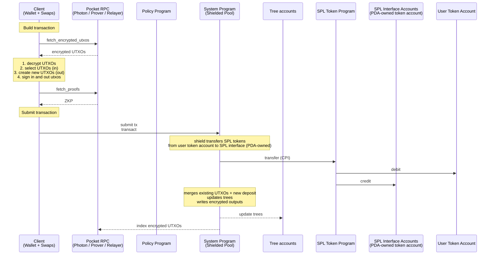
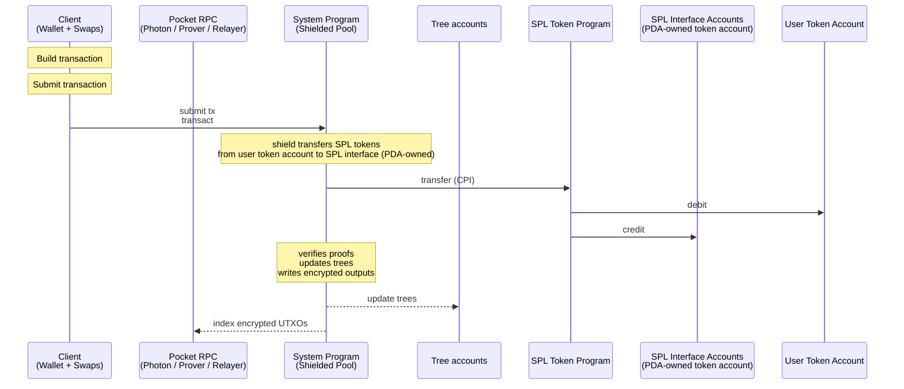
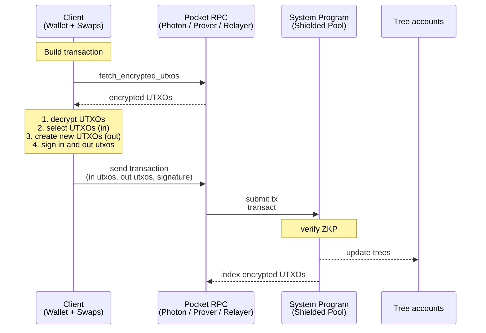
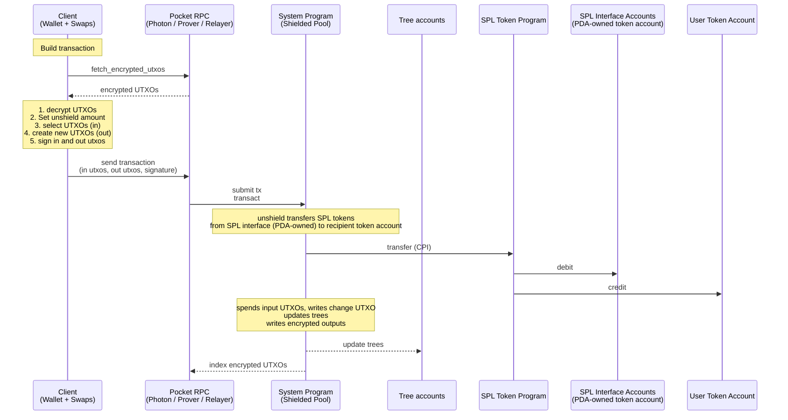
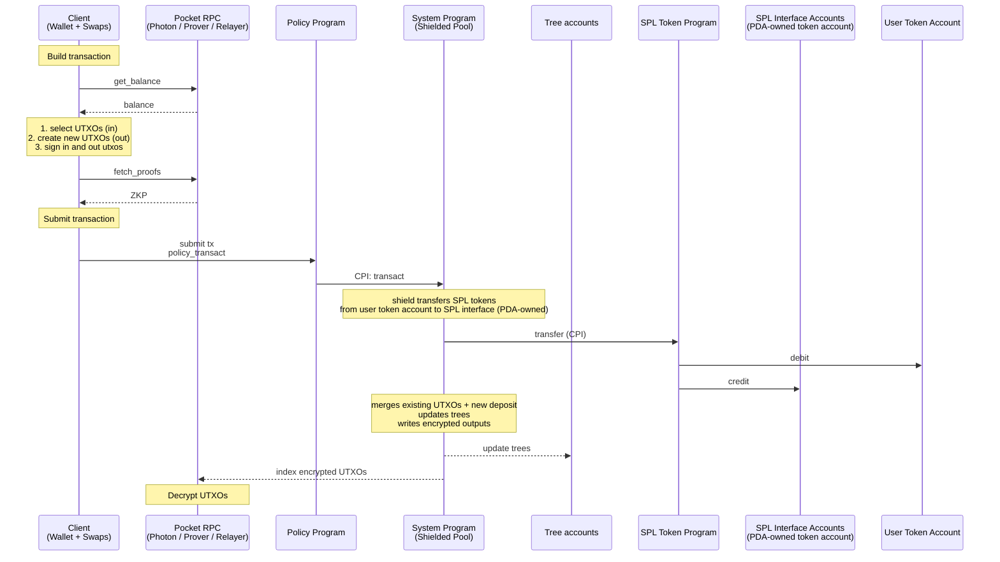
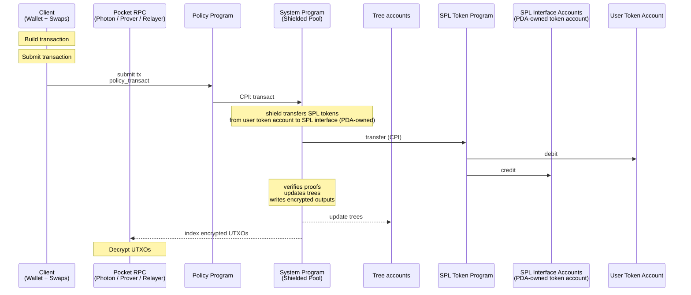
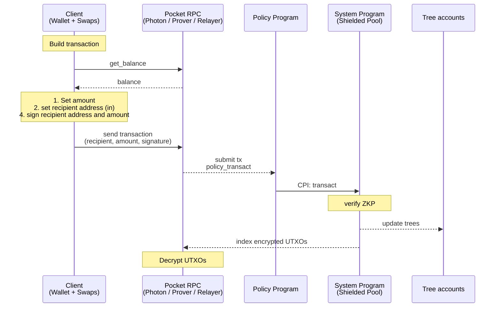
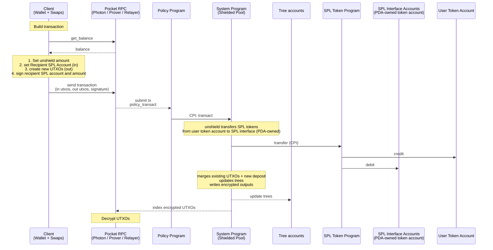

## Default Pocket

The default pocket is similar to zcash and has no policy.
Users invoke the SPP directly.
The merge service is optional and can be used for performance and improved UX.

### Shield with Proof

### Shield without Proof

### Transfer

### Unshield

## Policy Pockets

A logical grouping of UTXOs whose state transitions are checked by a policy program. Each pocket has its own auditor, authorities, and config.

| # | Name | Description |
| --- | --- | --- |
| 1 | Non-Custodial | Pockets are non-custodial. Control remains with user; auditor reads all UTXOs but cannot sign or spend |
| 2 | Extended UTXO schema | Includes state + extension fields (pocket address, ...); extensions is any data that is not part of the standard UTXO schema |
| 3 | Enter Pocket | A pocket can be entered by shield from an SPL token account, the standard shielded pool, or another pocket in a shielded transfer |
| 4 | Exit Pocket | A pocket can be exited by unshield to an SPL token account, the standard shielded pool, or another pocket in a shielded transfer |

### Shield with Proof

### Shield without Proof

### Transfer

### Unshield

### Enter and Exit Pocket

1. Enter, shield or transfer from default pocket
2. Exit, unshield or transfer from policy pocket
