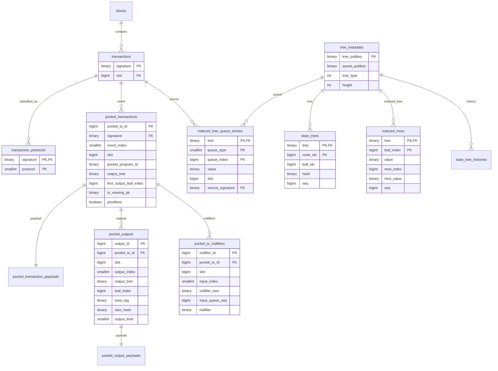

# Photon SPP DB Layout

## Scope

- reuse Photon `transactions`, tree metadata, Merkle node, indexed-tree, history, and queue hash-chain tables
- generalize `address_queues` into a typed indexed-tree queue table
- add SPP wallet/RPC tables
- do not store SPP UTXOs in `accounts`
- do not use `account_transactions` for SPP
- do not create separate SPP Merkle tables

## Tables

Reuse:

- `transactions`
- `tree_metadata`
- `state_trees`
- `indexed_trees`
- `state_tree_histories`
- `queue_hash_chains`

Generalize:

- `address_queues` -> `indexed_tree_queue_entries`

Add:

- `transaction_protocols`
- `pocket_transactions`
- `pocket_transaction_payloads`
- `pocket_outputs`
- `pocket_output_payloads`
- `pocket_tx_nullifiers`

## ERD



## Reused Photon Tables

### `transactions`

Canonical Solana transaction row.

SPP transactions must be retained even if `uses_compression = false`.

Add `transaction_protocols` instead of overloading `uses_compression`.

### `tree_metadata`

One row per real tree pubkey:

- SPP UTXO tree pubkey
- SPP nullifier indexed-tree pubkey

If SPP has a grouping/config account, store it as metadata only. Do not key tree rows by it.

### `state_trees`

Stores hash-tree nodes.

UTXO tree:

```text
tree = output_tree_pubkey
leaf_idx = first_output_leaf_index + output_index
hash = utxo_hash
```

Nullifier indexed tree hash tree:

```text
tree = nullifier_tree_pubkey
leaf_idx = indexed_tree_leaf_index
hash = indexed_leaf_hash
```

### `indexed_trees`

Stores sorted indexed-tree leaves.

SPP nullifier final state:

```text
tree = nullifier_tree_pubkey
value = nullifier
next_index = next sorted leaf index
next_value = next sorted nullifier
```

Nullifier identity is `(nullifier_tree_pubkey, nullifier)`.

### `state_tree_histories`

Root/sequence history for:

- SPP UTXO tree
- SPP nullifier indexed tree

SPP proof RPCs need root metadata. If events do not expose it, read tree accounts or parse maintenance events.

### `queue_hash_chains`

Already typed by:

```text
(tree_pubkey, queue_type, batch_start_index, zkp_batch_index)
```

Reuse for SPP nullifier queue hash chains.

## Generalized Tables

### `transaction_protocols`

```sql
transaction_protocols
  signature binary(64) not null references transactions(signature) on delete cascade
  protocol smallint not null
  primary key (signature, protocol)
  index (protocol, signature)
```

Protocol values:

- `LightCompression`
- `Spp`

Keeps SPP retention separate from `uses_compression`.
Supports transactions that touch multiple protocols.

### `indexed_tree_queue_entries`

Replacement for `address_queues`, not a rename.

Current `address_queues`:

```sql
address_queues
  tree binary not null
  address binary not null
  queue_index bigint not null
  primary key (address)
  unique (tree, address)
```

New generic queue:

```sql
indexed_tree_queue_entries
  tree binary(32) not null
  queue_type smallint not null
  queue_index bigint not null
  value binary(32) not null
  slot bigint not null
  source_signature binary(64) null references transactions(signature) on delete set null
  primary key (tree, queue_type, queue_index)
  unique (tree, queue_type, value)
  index (tree, queue_type, value)
```

`queue_type` values come from `light_compressed_account::QueueType`.
Do not hardcode numeric discriminants in runtime code.

AddressV2:

```text
queue_type = AddressV2
value = address
```

SPP nullifier:

```text
queue_type = SppNullifier
value = nullifier
queue_index = input_queue_seq
```

Batch append:

1. read `(tree, queue_type, queue_index range)`
2. append values into `indexed_trees`
3. persist hash nodes into `state_trees`
4. delete processed rows for that tree/type/range

## Pocket Tables

### `pocket_transactions`

One row per decoded wallet-visible SPP event.

```sql
pocket_transactions
  pocket_tx_id bigint primary key
  signature binary(64) not null references transactions(signature) on delete cascade
  event_index smallint not null
  slot bigint not null
  pocket_program_id binary(32) not null
  source_instruction_tag smallint not null
  output_tree binary(32) not null
  first_output_leaf_index bigint not null
  tx_viewing_pk binary(33) null
  proofless boolean not null
  unique (signature, event_index)
  index (slot, pocket_tx_id)
  index (pocket_program_id, slot, pocket_tx_id)
```

Use `pocket_tx_id` as DB parent.

Do not group parent rows only by Solana signature. One Solana transaction can emit multiple SPP events.

### `pocket_transaction_payloads`

```sql
pocket_transaction_payloads
  pocket_tx_id bigint primary key references pocket_transactions(pocket_tx_id) on delete cascade
  encrypted_utxos bytea null
  raw_event bytea null
  parse_version smallint not null
```

Stores full encrypted transaction blob and raw event bytes.

### `pocket_outputs`

Hot view-tag index.

```sql
pocket_outputs
  output_id bigint primary key
  pocket_tx_id bigint not null references pocket_transactions(pocket_tx_id) on delete cascade
  slot bigint not null
  output_index smallint not null
  output_tree binary(32) not null
  leaf_index bigint not null
  view_tag binary(32) not null
  utxo_hash binary(32) not null
  output_kind smallint not null
  tx_viewing_pk binary(33) null
  unique (pocket_tx_id, output_index)
  unique (output_tree, leaf_index)
  index (view_tag, slot, output_id)
  index (slot, output_id)
```

`output_index` follows UTXO append order inside the SPP event.

### `pocket_output_payloads`

```sql
pocket_output_payloads
  output_id bigint primary key references pocket_outputs(output_id) on delete cascade
  payload bytea not null
```

Split from `pocket_outputs` so tag lookup stays narrow.

### `pocket_tx_nullifiers`

Durable per-transaction nullifier set.

```sql
pocket_tx_nullifiers
  nullifier_id bigint primary key
  pocket_tx_id bigint not null references pocket_transactions(pocket_tx_id) on delete cascade
  slot bigint not null
  input_index smallint not null
  nullifier_tree binary(32) not null
  input_queue_seq bigint not null
  nullifier binary(32) not null
  unique (pocket_tx_id, input_index)
  unique (nullifier_tree, nullifier)
  index (pocket_tx_id, input_index)
  index (slot, nullifier_id)
```

## Ingestion

For each decoded SPP event:

1. upsert `transactions`
2. insert `transaction_protocols(signature, Spp)`
3. insert `pocket_transactions`
4. insert `pocket_transaction_payloads`
5. insert `pocket_outputs`
6. insert `pocket_output_payloads`
7. insert `pocket_tx_nullifiers`
8. insert nullifier queue rows into `indexed_tree_queue_entries`
9. persist UTXO leaves/path nodes into `state_trees`
10. persist root history into `state_tree_histories` when available

For nullifier batch append:

1. read `indexed_tree_queue_entries` by `(tree, queue_type = SppNullifier, queue_index range)`
2. update `indexed_trees`
3. update `state_trees`
4. update `state_tree_histories`
5. delete processed queue rows

## RPC Reads

### `get_encrypted_utxos_by_tags`

1. query `pocket_outputs` by `view_tag`
2. order by `(slot, output_id)`
3. join `pocket_output_payloads`

Cursor:

```text
(slot, signature, event_index, output_index)
```

### `get_shielded_transactions_by_tags`

1. query `pocket_outputs` by `view_tag`
2. collect distinct `pocket_tx_id`
3. fetch `pocket_transactions`
4. fetch all sibling `pocket_outputs`
5. fetch `pocket_output_payloads`
6. fetch `pocket_tx_nullifiers`

Cursor:

```text
(slot, signature, event_index)
```

Client display may group by `signature`. DB grouping is by `pocket_tx_id`.

### `get_merkle_proofs`

Use:

```text
state_trees.tree = output_tree_pubkey
```

### `get_non_inclusion_proofs`

Use:

```text
indexed_trees.tree = nullifier_tree_pubkey
state_trees.tree = nullifier_tree_pubkey
```

## Wallet Sync Requirements

`sdk-libs/transaction/src/wallet.rs` sync needs:

- full encrypted transaction blobs
- view-tag lookup
- per-transaction nullifier sets

Table mapping:

- full transaction blob: `pocket_transaction_payloads`
- tag lookup: `pocket_outputs`
- per-output payload: `pocket_output_payloads`
- spend marking: `pocket_tx_nullifiers`

## Migration

1. add `transaction_protocols`
2. add `indexed_tree_queue_entries`
3. backfill `address_queues` with `queue_type = AddressV2`
4. switch address queue reads/writes to `indexed_tree_queue_entries`
5. drop `address_queues` after callers migrate
6. refactor batch address append into batch indexed-tree queue append
7. add SPP tree types/capabilities to `tree_metadata`
8. add SPP wallet/RPC tables
9. add SPP parser output type
10. persist SPP updates in the same DB transaction as block ingestion
11. make transaction cleanup protocol-aware
