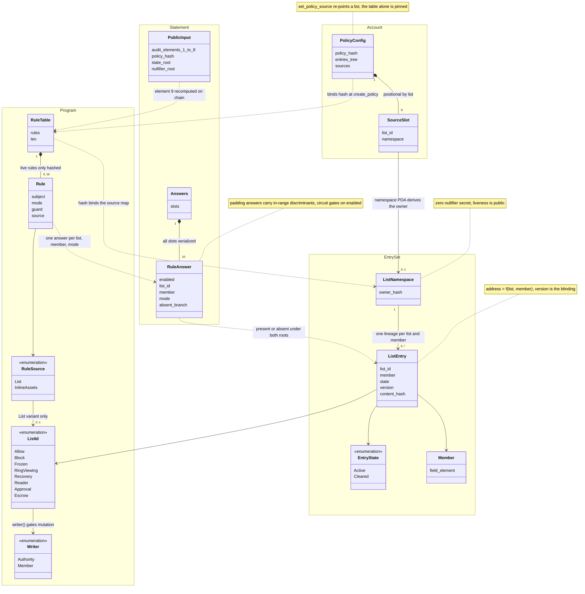

# The Ring Policy Construction

A v3 custom ring guarantees its auditor can decrypt every transfer. It cannot
refuse one. This document explains the plane that adds refusal. The rules ride
the transfer proof the ring already verifies. The chain never learns whom they
screen.

Three parties meet in the construction. A ring operator compiles admission
rules into the ring program binary. A transferring wallet must prove every
rule satisfied against list state it does not control. A **curator** maintains
one list that many rings consume by reference.

One idea underlies the mechanisms. A list entry is a compressed account. A
policy is a proof obligation over the presence or absence of such accounts,
attached to the transfer statement. Everything else binds the proof to the
true list state and the true transaction.

The direct ancestor is the plaintext compressed-account example, commit
`20388c26`. Each mechanism below reuses it exactly or extends it in a named
way. Anchors cite the branch head `0742613e`.

The running example is a blocklist ring. Its compiled table holds one rule,
forbid `OutputOwner` in `Block`. A curator ring serves the `Block` list. The
curator bans Mr. Evil. Mr. Crazy transfers.

## The entry, a keyed compressed account

An **entry** is one list membership fact, an ordinary zero-amount SPP data
UTXO in the shared state tree, owned by the ring's `b"policy_records"` PDA
(`program-libs/ring-policy/src/entry.rs`). A parity test pins its hash
byte-equal to `ProofInputUtxo`, and a vector test pins the same math against
the Go circuit. SPP hosts entries unchanged.

Three ancestor mechanisms carry over exactly:

- The owner is `Poseidon(hash_bytes(pda), Poseidon(0))`, the example's
  `PdaOwner` with the zero nullifier secret. Every entry nullifier is
  publicly computable. Spending stays gated by the PDA signature alone.
- The blinding is the version counter. Create starts at version zero. Update
  spends version `v` and emits `v + 1` in one SPP transact. A re-added member
  never repeats a utxo hash or a nullifier.
- The entry bytes publish as plaintext output data behind a five-byte
  header. Discovery trusts them only after re-deriving `data_hash` and the
  utxo hash and matching the on-chain leaf.

The extension is the address seed. The example claims one address per PDA.
Here the seed is keyed:

```
seed    = Poseidon(POLICY_ADDRESS_DOMAIN, list_id, member)
address = nullifier(address_utxo_hash(seed), seed)
```

One PDA becomes a namespace with exactly one address lineage per
`(list, member)` pair. Creating an entry inserts its address into the
nullifier tree. A second create for the same pair is a double spend the
tree already rejects. There is no address registry and no new tree.
`data_hash` binds the address, list, member, state, version, and
`content_hash` together, so an entry cannot be replayed under another pair or
another namespace PDA.

A **member** is one field element, `Member::owner_tag` over the confidential
view tag (`member.rs`). An ed25519 tag is the raw pubkey. A P256 tag is the
x-coordinate alone. Parity travels in encrypted owner data, a ban therefore
covers both parity points of an x. The same derivation keys assets, ring
programs, and destinations. One member space serves every rule subject
because the circuit already carries these exact field elements in the slot
openings. A party holding both an ed25519 and a P256 identity owns two
distinct members. A curator that bans an address does not ban the party's
P256 identity.

Entries have two states and no delete. `Active` and `Cleared` are both live
UTXOs. Removal spends the `Active` version into a `Cleared` successor at the
same address. The naive alternative spends the entry with no successor.
That leaves removal unprovable. The address stays claimed in the nullifier
tree forever, the never-created branch can never hold again. A removed
member without a live `Cleared` leaf would have no absence proof.
Cleared is not absence. A presence check that stops at "address claimed"
treats every removed member as still listed. The state byte inside
`data_hash` is the discriminator.

## Lists and writers

`ListId` names the eight lists. They are `Allow`, `Block`, `Frozen`,
`RingViewing`, `Recovery`, `Reader`, `Approval`, and `Escrow`. Three
mechanisms reserve list id zero. The enum starts at one, every list carries a
const assert, and the circuit rejects a zero list id on enabled entries. Zero
marks the inline-asset sentinel and the empty source slot.

Who may mutate is one exhaustive const match, `ListId::writer()`.
Authority-written lists require the config authority as fee payer.
Member-written lists require the payer whose owner tag equals the member,
self-service registration with the payer as the identity proof. The circuit proves
membership, never who mutated. Authorization lives in one Rust function and
never crosses the CPI or reaches Go or TypeScript.

The sealed `ListSchema` trait packages the reuse. A new list-backed feature
declares a list with an unused nonzero discriminant, a writer arm, and an
`EntryContent` type choice. It reuses the keying, the 74-byte entry layout,
the membership proofs, the mutation instructions, and the circuit unchanged.
Only a rule that consults the list touches anything else.

## The table, the source map, and one hash

The rule table is a `const` compiled into the ring program.
`RuleTableBuilder` is const-evaluable, an illegal table fails the build of the
consuming program, not a transaction. The builder rejects duplicate rules by
signature, subject plus mode plus source list, guard excluded. The pair
`require(OutputOwner, Allow)` and the same rule guarded above a threshold
reads as a working exemption. The unguarded rule subsumes it. The builder
refuses the pair.

A rule packs into one field element, subject, mode, list, guard tag, and
threshold at fixed byte positions. The hash covers only the packed element.
The circuit witnesses the components, range-checks each, and re-derives the
packed value by weighted sum. Without the range checks a prover could borrow
across byte boundaries and reinterpret a pinned rule as a different one.

A rule's source is `List`, naming a list, `AnyOf`, naming a group, or
`InlineAssets`, an asset allowlist carried by the table itself. The list byte is
a bitmask, bit `i` names list `i + 1`, and the circuit covers the rule by an
answer for any set bit. A single list sets one bit, a group sets several, and
the mode reads the disjunction, `require_any` as a union allowlist and
`forbid_all` as an intersection blocklist. `Rule::allow_only_assets` lists up to
eight asset members, hashed after the rules. The circuit answers an inline
rule by direct member comparison, no entry, no answer, no source slot.
The builder restricts inline members to `Asset` subjects in `Present` mode.
A zero mask marks the inline source.

The **source map** decides where each list's entries live. It is eight
positional slots, slot `i` is empty or serves list `i + 1`. An occupied slot
stores a namespace PDA address. Positional layout makes duplicate lists and
ambiguous encodings unrepresentable, one logical map has exactly one
encoding. A sorted variable-length map admits two encodings of one map and
needs in-circuit sortedness checks the positional form never pays for.

One hash binds table and map together:

```
policy_hash = chain(POLICY_TABLE_DOMAIN, POLICY_VERSION,
                    (list_id_1, owner_1) ... (list_id_8, owner_8),
                    len, rule_1 ... rule_len, inline_members)
```

`chain` is the left fold `acc = Poseidon(acc, next)`. All eight slots enter
unconditionally, empty slots as zeros. Hashing only referenced slots would
let a slot for an unused list be retargeted without moving the hash. The
pin would not cover the full delegation surface. The explicit length
element closes the variable-length tail, a truncated table cannot alias a
longer one. A referenced list with no slot fails closed with
`MissingSource` before the recompute emits any hash. The owner bound into the hash
is not the PDA address but the namespace owner hash. That is the same field
element under which the entry UTXOs are stored. The circuit checks
membership against exactly the value the hash pins.

## The on-chain binding

`create_policy` pins the hash once, gated on the live upgrade authority. The
table is part of the deployed binary, so only its deployer may bind it. The
policy PDA refuses re-initialization, the table is pinned for the life of
the deployment. The instruction demands a bijection between declared sources
and the lists the compiled table references. A stale client fails at create
time, not at spend time.

Curatorship is permissionless. SVM ownership plus shape identify a curator.
The shape is the `b"policy"` PDA of the owning program, the config
discriminator, and the same entries tree. There is no curator registry. The
trust decision is the operator's choice of account. Pin time flattens
delegation. The instruction copies the curator's already resolved namespace
owner, never the curator's identity. A curator re-pointing its own source
moves nothing downstream, and a curator of a curator never chains. Live
chaining would let one captured curator authority rotate every downstream
ring at once, with no downstream signature.

Flattening freezes the map, not the list. A curator mutation to its entries
lands on every subscriber's next transfer, with no downstream signature.
Delegation bounds who writes, never what they write, a subscriber trusts
its curator's writes wholly.

`set_policy_source` re-points one list and is gated on the ring config
authority, an operational act, not a deployment. Before it writes, the
instruction proves the stored hash reproduces from the stored slots under
the currently deployed table. Without that gate, an upgrade that changes
the table plus one routine source edit would re-pin the new table's hash.
The table change would launder past the upgrade-authority ceremony. With
it, a drifted build fails closed on every mutating path. The same recompute
runs before every entry mutation and every transfer.

A list mapped to a curator is locally read-only, the mutation path refuses
with `ForeignSource`. The curator ring is the single writer, a ring
cannot overwrite a curated fact with its own entry. Lists the table does
not reference stay mutable against the ring's own entries.

Entry mutations are ordinary SPP transacts built on-chain. The mutation
loader derives the namespace owner from the verified PDA.
`EntryTransition::into_transact` derives the address, utxo hash, and
entry bytes and computes `private_tx_hash` over them. The caller supplies
only a one-in one-out proof and root indices. The proof can state nothing
but the transition the instruction names. The CPI raises a second signer
identity, `b"policy_records"` beside v3's `b"ring_auth"`, so entry custody
and ring transaction authority cannot exercise each other.

## The circuit

One proof serves audit and policy. The v3 audit statement is an exported
block, and its eight-element hash chain is a strict prefix of the new
statement. The public input is one hash chain over eleven elements:

```
private_tx_hash,
tx_viewing_pk_lo, tx_viewing_pk_hi,
auditor_pk_lo, auditor_pk_hi,
eph_pk_lo, eph_pk_hi,
ct_hash,
policy_hash, state_root, nullifier_root
```

The program recomputes this chain from accounts it trusts and runs one
Groth16 verification. Policy enforcement costs no second proof, and a
wallet cannot satisfy the audit statement while skipping the policy
statement. The whole circuit keeps exactly one BSB22 commitment by reusing
the range checker the audit block instantiates, a shape the on-chain
verifier requires.

The audit-only circuit treats `private_tx_hash` as a pass-through wire.
The policy circuit cannot. It witnesses full slot openings for every input
and output and recomputes `private_tx_hash` from them (`openings.go`). The
recompute is the subject-integrity binding. With a pass-through, a wallet
paying a blocked member would witness the openings of an innocent
transaction. It would satisfy every rule over those and let the real hash
ride through. The policy would never see the real recipient. The recompute
forces the screened owners, assets, and amounts to be the preimage of the
same hash the SPP statement binds.

The **answers** array serves the entry-sourced rules, ten slots, each one
entry fact proven under both roots (`answers.go`). One answer proves one of
three facts:

- Present and current. The entry leaf is included under the state root,
  its state is `Active`, and its nullifier is absent from the nullifier
  tree. The state tree is append-only, so inclusion alone proves nothing
  current. An old `Active` leaf of a since-cleared entry is still
  included. Nullifier absence is what makes present mean now.
- Cleared and current. The `Cleared` leaf is included and its nullifier is
  absent, the clearing is the latest version.
- Never created. The deterministic address is absent from the nullifier
  tree. No state inclusion exists to show.

A single absence check cannot replace the three. An unspent `Active`
entry also has an absent nullifier. Nullifier absence alone would prove a
blocked member clean. The three facts share one indexed-tree range gadget
with a muxed target, address or nullifier. The range check is strict on
both sides and uses the full-field canonical-limb comparison. The cheap
offset comparison is forgeable here because tree values span the whole
field. For a target near the modulus the offset sum wraps, and a false
ordering decomposes cleanly. Amount guards keep the cheap comparison
because the circuit independently range-checks amounts to 64 bits.

Each enabled answer resolves its namespace owner through the source map the
policy hash pins (`sources.go`). The mux asserts exactly one slot matches
the answer's list. The owner is an affine sum of selected slots. Two
matching slots would resolve to the sum of two owners, a fabricated owner
whose entries nobody created. Disabled answers resolve to garbage no
downstream assertion reads.

Coverage closes the plane (`eval.go`). Every live slot instance of every
enabled entry-sourced rule demands an enabled answer with the same list
and mode carrying that member. Coverage answers an inline rule against
the inline member table instead. A rule
guarded above a threshold exempts a subject when the total it receives in the
transaction stays at or below the threshold, a payment split across slots does
not escape it. The quantifier
direction carries the soundness. A wallet paying a blocked member cannot
omit the convicting entry. Omission leaves the instance uncovered, and
once the bound nullifier root absorbs the ban, neither absence branch is
satisfiable. Extra entries answering no rule are harmless.

Screened subjects come from the openings. `OutputOwner` collects every
output that names an owner. Nonzero change is such an output, it names the
sender. A transfer whose inputs exactly cover its outputs emits no change
under the compact layout. Such a sender passes an `OutputOwner` table
untouched, `Sender` rules exist to close that. Public interface legs live
inside `external_data_hash`, an opaque wire. The policy plane covers
shielded slot flows only.

## Roots and revocation

Both roots enter the statement by history index. The wallet sends two
indices. The program resolves them against a dedicated entries-tree
account, its address checked equal to the ring's entries tree. The SPP
money input and output trees are independent and may be any registered
tree, so an old-tree note spends into the active tree. A fabricated root
cannot enter the statement, every admissible root is one the tree produced.

Freshness is asymmetric on purpose. Any live state root is admissible.
Inclusion is monotone, an old root can only miss new leaves. The nullifier
root must sit within `NULLIFIER_ROOT_WINDOW = 8` entries of the live
cursor. Absence is the one thing that rots. An old nullifier root still
shows a freshly banned member as absent.

Revocation has two latencies, and the window bounds only the second. A
entry mutation inserts its nullifiers into a queue. The indexed tree
learns them when the forester applies a batch and rotates the root. Until
that rotation, a fresh ban is invisible under every admissible root, and
the absence branches still verify. After it, proofs against roots up to
eight rotations old still miss the ban until the window slides past. The
cursor moves once per forester rotation, and each rotation absorbs a batch
of queued insertions from all tree traffic. Requiring the exact current
root would make every transfer race the forester's rotations instead.

## The wallet cycle

1. The wallet proves the SPP ring transfer, yielding `private_tx_hash`.
2. It reads `PolicyConfig` and resolves each list through the stored
   source map.
3. It reads both root indices from the tree account, not from the indexer.
   The statement binds what on-chain resolution reproduces.
4. It discovers entries for every screened subject. A published entry
   counts only after its recomputed hashes match the indexed leaf. Two
   live versions of one pair raise `AmbiguousEntry`. A lying indexer
   stalls proving but cannot steer the answer.
5. It builds the answers array. A `Present` rule with a missing or `Cleared`
   entry, or an `Absent` rule with an `Active` entry, refuses
   client-side with `PolicyRuleUnsatisfied`. The chain never learns of
   the refused transfer. The SPP proof from step 1 is wasted.
6. It proves the ring statement, one request carrying audit and policy.
7. It sends transact. The instruction carries the proof and two root
   indices, no member, no list, no answer.

## Rejected designs

Each alternative below buys something and loses to one concrete input.

**A sidecar list tree or account.** It buys independence from SPP's trees.
A blocklist needs provable absence. Absence needs an indexed tree with its
own forester, root history, and rollover, plus a second root pair in the
circuit. An account-based list is worse, the processor reads the recipient
in clear. The shared trees already run all of it.

**A second policy proof beside the audit proof.** It buys circuit
independence. Two verifications with commitment handling per transact,
plus program logic binding both statements to one `private_tx_hash`. The
prefix construction gets the cross-binding for free.

**An authority-mutable rule table in the account.** It buys rule agility.
A compromised ring authority drops the blocklist without a deploy. Rules
define what the ring is, they ride program identity and upgrade-authority
governance. Each ring is already its own deployment in the v3 model, the
table costs no extra ceremony.

**Secret nullifier keys for entries.** It buys spent-ness privacy. Mr.
Crazy must prove Mr. Evil's entry state without Mr. Evil's cooperation.
`update_entry` computes the nullifier on-chain, a secret would have to
appear in instruction data. Public liveness is what discovery and
third-party proving require.

**Encrypted entries.** It buys list privacy. Every prover must open
foreign entries to build answer witnesses, encryption would restrict proving
to key holders and force the operator to co-prove every transfer. The
table names its lists and the tree is public, the secrecy would be hollow.

**Members as raw addresses.** It buys human-readable lists. The circuit
sees an owner only as the opening's owner field element. A raw address
costs an extra in-circuit preimage per rule and slot pair. A P256 owner
has no address.

**Caller-supplied entry versions.** It buys nothing but generality. A
repeated version reproduces an old utxo hash and nullifier and forks the
lineage. The derived successor, `v + 1` from the proven spent entry,
makes reuse inexpressible.

## Limits

- Revocation waits on the forester. One batch rotation must land, and up
  to eight admissible rotations follow, unbounded in time on a quiet tree.
- One entries tree per ring. The circuit binds one root pair, the entries
  tree's. Entries and curator entries share that one tree instance, pinned
  at `create_policy` and unrecoverable without a fresh deployment. The
  ring's spendable UTXOs are not confined to it and may live in any
  registered tree.
- The shape is fixed at five inputs, four outputs, ten answers, sixteen
  rules, eight sources, eight inline assets. The answers array is the
  per-transfer screening budget, larger transfers must split.
- The builder rejects any table carrying `ExitDestination`.
- A rule-less ring still resolves and windows roots. Its clients fetch
  fresh indices.
- Version overflow freezes a lineage in its last state forever. The
  address cannot be re-claimed.

## Class diagram


