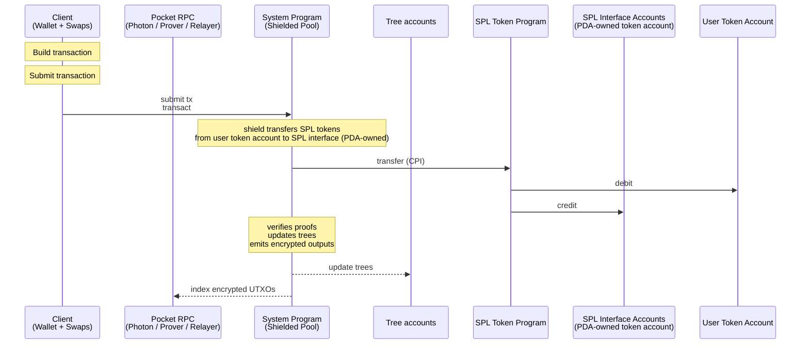
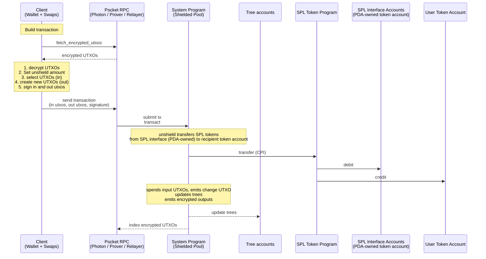
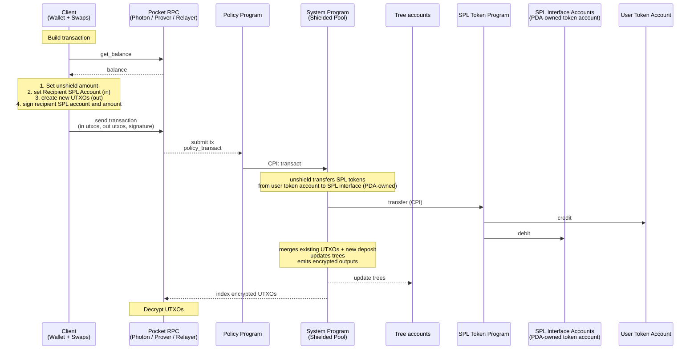
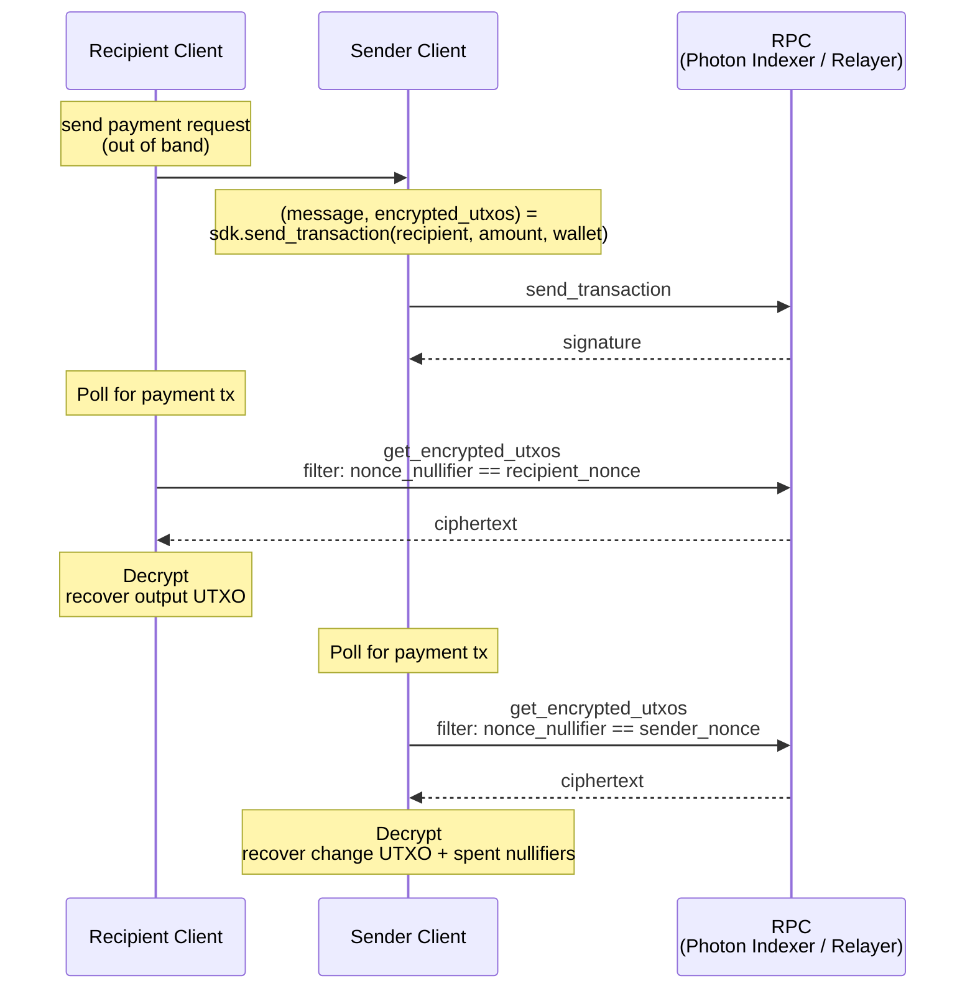

# Spec

## Table of Contents

- [Abstract](#abstract)
- [Architecture](#architecture)
  - [Operations](#operations)
    - [User](#user)
    - [Protocol](#protocol)
  - [Concurrency](#concurrency)
  - [Wallet](#wallet)
    - [request_transfer](#request_transfer)
    - [Transaction Viewing Key](#transaction-viewing-key)
  - [Client SDK](#client-sdk)
    - [create_payment_request](#create_payment_request)
    - [send_transaction](#send_transaction)
  - [Default Pocket](#default-pocket)
    - [Shield with Proof](#shield-with-proof)
    - [Shield without Proof](#shield-without-proof)
    - [Transfer](#transfer)
    - [Unshield](#unshield)
  - [Policy Pockets](#policy-pockets)
    - [Shield with Proof](#shield-with-proof-1)
    - [Shield without Proof](#shield-without-proof-1)
    - [Transfer](#transfer-1)
    - [Unshield](#unshield-1)
    - [Enter and Exit Pocket](#enter-and-exit-pocket)
- [SPP Proof - Shielded Pool ZK Proof](#spp-proof---shielded-pool-zk-proof)
- [Encryption](#encryption)
  - [Cleartext Shield](#cleartext-shield)
  - [Transfer](#transfer-2)
  - [UTXO Split Encryption](#utxo-split-encryption)
- [SPP - Shielded Pool Program](#spp---shielded-pool-program)
  - [Accounts](#accounts)
  - [Instructions](#instructions)
    - [transact](#transact)
- [Policy Program Interface](#policy-program-interface)
- [RPC](#rpc)
  - [Photon Indexer](#photon-indexer)
  - [Pocket RPC](#pocket-rpc)
  - [Decryption Service](#decryption-service)
  - [Merge Service](#merge-service)
- [Notes](#notes)
- [Request Payment Flow Default Pocket](#request-payment-flow-default-pocket)

## Abstract

A Solana program for shielded transfers. Users retain custody and can disclose
per-transaction viewing keys on request. UTXOs can enter pockets; each pocket has
auditors, authorities, and a config (freeze authority, co-signer, permanent
delegate).

# Architecture


Source: [`diagrams/architecture.dot`](diagrams/architecture.dot). Regenerate with `just render-diagrams`.

1. Users — own wallets, build encrypted transactions, sign with P256.
2. Photon Indexer — indexes trees + encrypted UTXOs; default-pocket users fetch ciphertexts here.
3. Pocket RPC (with auditor) — RPC with auditor keys; decrypts and serves UTXOs to policy-pocket users.
4. Prover — generates Groth16 proofs. Users can generate client side proofs as well.
5. Relayer — fee-payer; submits transactions to SPP (default pocket) or to a Policy program (policy pocket).
6. Forester — drains the nullifier queue into the nullifier tree.
7. SPP (Shielded Pool Program) — verifies proofs, updates trees, moves SPL to and from the vaults.
8. Policy Programs (1..N) — config programs; verify policy proofs and CPI into SPP.
9. SPL interface vaults — per-mint SPL / Token-22 vaults holding all shielded tokens.
10. Tree accounts — co-located UTXO tree, nullifier tree, and nullifier queue.

Per-flow sequence diagrams are in the [User Flows](#user-flows) section below.


## Operations

### User

| # | Name | Description | Privacy |
| --- | --- | --- | --- |
| 1 | shield | Deposit SPL tokens into the shielded pool; existing UTXOs can be merged in the same transaction. | sender + amount visible; recipient hidden |
| 2 | proofless_shield | Public deposit without a proof. Allows shielding dynamic amounts, for example for the flow unshield, swap, shield. | fully public |
| 3 | unshield | Withdraw SPL tokens from the shielded pool to a public account. | sender hidden (relayer); recipient + amount visible |
| 4 | shielded transfer | Transfer value between shielded balances. | fully shielded (sender, recipient, amount) |

### Protocol

| # | Name | Description |
| --- | --- | --- |
| 1 | create_spl_interface | Initialize SPL/Token-22 pool escrow per token mint |
| 2 | create_tree | Initialize new Tree account (nullifier tree + queue and UTXO tree, co-located) |
| 3 | create_protocol_config | Initialize protocol config (pause authority) |
| 4 | update_protocol_config | Rotate protocol config authority |
| 5 | pause_tree | Freeze writes to a Tree account |


## Concurrency

1. A balance can be used concurrently when it is split up between a number of utxos.
2. To keep the balance spendable in one transaction we split it in up to X utxos

## Wallet

Signs transactions (P256 signature verified inside the SPP proof) and decrypts UTXOs encrypted to the user's pubkey.

Sender nonces are used to prevent replay of signed transactions with server prover and efficient fetching from the indexer.
Recipient nonces are used to index requested utxos from requested transfers efficiently.

**Seed secret derivations:**

`wallet_seed` is the BIP-39 mnemonic seed: `PBKDF2-HMAC-SHA512(mnemonic, "mnemonic" || passphrase, c=2048, dkLen=64)`.

1. P256 Keypair — derived from `wallet_seed` via BIP-32-style hierarchical derivation on the P-256 curve.
2. Nullifier Secret: `HKDF-SHA256(salt=∅, IKM=wallet_seed, info="zolana/nullifier", L=32)`
3. Sender Nonce Secret: `HKDF-SHA256(salt=∅, IKM=wallet_seed, info="zolana/sender_nonce", L=32)`
4. Recipient Nonce Secret: `HKDF-SHA256(salt=∅, IKM=wallet_seed, info="zolana/recipient_nonce", L=32)`
5. Ephemeral Secret: `HKDF-SHA256(salt=∅, IKM=wallet_seed, info="zolana/ephemeral", L=32)`

`get_nonce(tx_count)` and `get_ephemeral_keypair(tx_count)` are indexed by the same per-wallet `TxCount` counter so that one counter advance produces both the scan tag and the ECDH ephemeral keypair for the same outgoing transaction (or payment request, which reserves a future slot in advance).

**Methods:**
1. sign_p256(msg)
2. encrypt
3. decrypt
4. encrypt_poseidon
5. decrypt_poseidon
6. `get_nonce(tx_count) = HKDF-SHA256(salt=∅, IKM=nonce_secret, info="zolana/nonce/" || u64_be(tx_count), L=32)`
7. request_transfer(`asset_mint`, `amount`, `pocket_program_id`, `expiry_unix_ts`, `memo`)
8. `get_ephemeral_keypair(tx_count)`:
    1. `seed64 := HKDF-SHA256(salt=∅, IKM=ephemeral_secret, info="zolana/ephemeral/" || u64_be(tx_count), L=64)`
    2. `ephemeral_sk := int(seed64) mod n` where `n` is the P-256 group order
    3. `ephemeral_pubkey := ephemeral_sk · G` (SEC1-compressed)
    4. `return (ephemeral_sk, ephemeral_pubkey)`
9. sync(`start_timestamp`)
  1. sync default pocket loop: derive 1k sender_nonces, request encrypted utxos based on nonces, repeat until no matches
  2. sync policy pockets loop: for every pocket request balance

**State:**
1. Utxos(optional)
2. TxCount (including requested payments)
3. last synced

### request_transfer

Builds a payment request that a recipient hands to a sender out of band. The sender uses `recipient_nonce` to stamp the recipient's ciphertext so the recipient can pull the payment by exact byte match from the indexer (see [Request Payment Flow](#request-payment-flow)).

**Inputs**

| Field | Type | Notes |
| --- | --- | --- |
| `asset_mint` | `[u8; 32]` | Solana SPL / Token-22 mint pubkey |
| `amount` | `u64` | in units of `asset_mint` |
| `pocket_program_id` | `[u8; 32]` | all-zero = default pocket |
| `expiry_unix_ts` | `u64` | recipient's promise to honor the request until this time |
| `memo` | `String` | application-defined; opaque to the protocol; UTF-8, max 1024 bytes |

**Algorithm**

1. `tx_count := state.TxCount`
2. `recipient_nonce := get_nonce(tx_count)`
3. `state.TxCount += 1`
4. `return PaymentRequest { version=0, recipient_pubkey, recipient_nonce, pocket_program_id, asset_mint, amount, expiry_unix_ts, memo }`

`TxCount` is incremented unconditionally — even if the sender never pays. Reusing a nonce across two outstanding requests would let the indexer link them.

**Output: `PaymentRequest`**

Canonical big-endian byte layout used on the wire.

| Offset | Size | Field | Notes |
| --- | --- | --- | --- |
| 0 | 1 | `version` | currently `0` |
| 1 | 33 | `recipient_pubkey` | P256 SEC1-compressed (1-byte prefix + 32 B X) |
| 34 | 32 | `recipient_nonce` | `[u8; 32]` |
| 66 | 32 | `pocket_program_id` | all-zero = default pocket |
| 98 | 32 | `asset_mint` | Solana SPL / Token-22 mint pubkey |
| 130 | 8 | `amount` | `u64 BE` |
| 138 | 8 | `expiry_unix_ts` | `u64 BE` |
| 146 | 2 | `memo_len` | `u16 BE`; UTF-8 byte length of `memo`; 0 if absent; max 1024 |
| 148 | `memo_len` | `memo` | UTF-8 bytes |

Total: **148 + `memo_len`** bytes (148 with no memo, up to 1172 with the maximum 1024-byte memo).

**Sender-side validation**

Before paying, the sender:

1. Checks `current_unix_ts <= expiry_unix_ts`.
2. Checks `version == 0` (rejects unknown versions).
3. If `pocket_program_id != 0`, ensures the local wallet can build a transaction for that pocket.

**Notes**

1. The request is unauthenticated by design. Out-of-band transport is assumed to be authenticated by the channel (e.g., a QR code shown in person, a signed app message). Sender's protection against a swapped request is the channel, not the request itself.
2. Cancelations are off-chain: a recipient simply stops polling. There is no on-chain revocation.
3. Out-of-band transport (QR, deeplink, NFC, messaging) is application-defined; suggested base64-url encoding of the record.
4. The sender resolves `asset_mint` to the local `asset_id: u64` via the SPP [Asset registry](#accounts) when building the transfer.
5. `memo` is metadata for the request only — for the sender's UI and the recipient's own bookkeeping. It is **not** included in the on-chain UTXO ciphertext and the protocol does not propagate it past the request.

### Transaction Viewing Key

The ephemeral private key from `get_ephemeral_keypair(tx_count)` acts as a per-transaction **viewing key**. Because every ciphertext in a transaction is encrypted under a key derived from `ECDH(ephemeral_sk, owner.pubkey)`, anyone holding `ephemeral_sk` can decrypt every ciphertext in that one transaction — the sender's change bundle plus all recipient bundles — without needing any recipient's private key.

**Properties**

- **Scope**: one transaction. Each `tx_count` produces a fresh keypair, so disclosing one viewing key does not leak any other transaction.
- **Read-only**: viewing keys grant decryption only. Spending still requires the owner's P256 privkey (checked by signature in the SPP proof).
- **Derivable on demand**: the sender does not need to store viewing keys. `get_ephemeral_keypair(tx_count)` recomputes them from `ephemeral_secret`.

**Disclosure**

1. Sender chooses the `tx_count` to disclose (e.g., for an audit, a receipt, or a tax filing).
2. Sender computes `(ephemeral_sk, ephemeral_pubkey) = get_ephemeral_keypair(tx_count)`.
3. Sender shares `ephemeral_sk` (and the transaction signature) with the third party out of band.
4. The third party decrypts every ciphertext in that transaction using `ECDH(ephemeral_sk, owner.pubkey)` for each visible `owner.pubkey`. For the sender's change bundle, `owner.pubkey = sender's pubkey`, also visible in the ciphertext.

## Client SDK

Higher-level methods built on top of [Wallet](#wallet) and [RPC](#rpc). The SDK does not touch the network; it assembles artifacts the caller submits via the RPC layer.

### create_payment_request

Recipient-side helper. Wraps [Wallet.request_transfer](#request_transfer) to produce a `PaymentRequest` for the recipient to share out of band with a prospective sender.

**Inputs**

| Field | Type | Notes |
| --- | --- | --- |
| `asset_mint` | `[u8; 32]` | Solana SPL / Token-22 mint pubkey |
| `amount` | `u64` | in units of `asset_mint` |
| `pocket_program_id` | `Option<[u8; 32]>` | `None` = default pocket |
| `expiry_unix_ts` | `u64` | request validity deadline |
| `memo` | `Option<String>` | application-defined; UTF-8, max 1024 bytes |
| `wallet` | `Wallet` | caller's wallet (see [Wallet](#wallet)) |

**Algorithm**

1. `request := wallet.request_transfer(asset_mint, amount, pocket_program_id.unwrap_or(zero32), expiry_unix_ts, memo.unwrap_or(""))`
2. `return request`

**Output**

| Field | Type | Notes |
| --- | --- | --- |
| `request` | `PaymentRequest` | canonical 148+`memo_len` byte layout, see [request_transfer](#request_transfer) |

**Notes**

1. Thin wrapper for API symmetry with [send_transaction](#send_transaction). The heavy lifting (nonce derivation, `TxCount` advance, byte layout) lives in [Wallet.request_transfer](#request_transfer).
2. The caller serializes the returned `PaymentRequest` to its canonical bytes and ships it OOB (QR, deeplink, NFC, messaging). Suggested base64-url encoding.
3. `wallet.TxCount` is advanced even if the request is never delivered or paid.

### send_transaction

Builds the SPP `transact` instruction data and the `encrypted_utxos` blob for a transfer. Encryption happens client-side; the wallet's `get_ephemeral_keypair` stays private to the SDK.

**Inputs**

| Field | Type | Notes |
| --- | --- | --- |
| `recipient` | `Recipient` | addressing info (see below) |
| `amount` | `u64` | in units of `recipient.asset_mint` |
| `wallet` | `Wallet` | caller's wallet (see [Wallet](#wallet)) |

`Recipient`:

| Field | Type | Notes |
| --- | --- | --- |
| `pubkey` | `[u8; 33]` | recipient's P256 SEC1-compressed or Solana pubkey |
| `asset_mint` | `[u8; 32]` | Solana SPL / Token-22 mint pubkey |
| `recipient_nonce` | `Option<[u8; 32]>` | recipient-supplied `nonce`; `None` for unsolicited transfers we use the pubkey instead the recipient is confidential |
| `pocket_program_id` | `Option<[u8; 32]>` | `None` = default pocket |

**Algorithm**
0. check wallet is synced.
1. `asset_id := AssetRegistry[recipient.asset_mint]` (via SPP [Asset registry](#accounts)).
2. `tx_count := wallet.TxCount`; `wallet.TxCount += 1`.
3. `sender_nonce := wallet.get_nonce(tx_count)`.
4. `(ephemeral_sk, ephemeral_pubkey) := wallet.get_ephemeral_keypair(tx_count)` (private).
5. Select sender input UTXOs covering `amount` + fees from wallet state; compute `change_amount`.
6. Pick random 31-byte `change_blinding_seed` and `recipient_blinding`.
7. Build the recipient output: `(owner=recipient.pubkey, asset_id, amount, blinding_seed=recipient_blinding_seed)`.
8. Build the sender change output: `(owner=sender_pubkey, asset_id, amount=change_amount, blinding_seed=change_blinding_seed, nullifier_data)`.
9. Encrypt each ciphertext with `AES-GCM(key = KDF(ECDH(ephemeral_sk, owner_pubkey)), plaintext)`; prefix recipient ciphertext with `recipient.nonce` (or zero-bytes if absent) and sender ciphertext with `sender_nonce`. Concatenate per the [Transfer](#transfer-1) layout into `encrypted_utxos`.
10. `recipient_binding := sign_p256(Sha256BE(recipient.nonce || recipient.pubkey || amount || recipient_blinding_seed))` — consumed by the SPP proof.
11. compute zk proof tx hash
12. sign tx hash
13. Fetch the ZK proof (via the prover RPC or client-side prover).
14. Assemble the SPP `transact` instruction (see [transact](#transact)): `expiry_unix_ts`, `sender_nonce`, `proof`, `relayer_fee`, `output_utxo_hashes`, `nullifier_root_index`, `tx_hash`, `msg_hash`, `public_sol_amount`, `public_spl_amount`, `encrypted_utxos`.
15. `return (instruction, encrypted_utxos)`.

**Output**

| Field | Type | Notes |
| --- | --- | --- |
| `instruction` | `Instruction` | Solana Instruction that can be sent to a relayer |
| `encrypted_utxos` | `Vec<u8>` | the ciphertext blob (also embedded in `message`; returned separately for callers that index or preview ciphertexts) |

**Notes**
1. `wallet.TxCount` is advanced once per call regardless of whether the caller ultimately submits. How do eth wallets do it?

## Default Pocket

The default pocket is similar to zcash and has no policy.
Users invoke the SPP directly.
Merge and decryption services are optional and can be used for performance and improved UX.

### Shield with Proof


### Shield without Proof



### Transfer


### Unshield



## Policy Pockets

A logical grouping of UTXOs governed by a policy program. Each pocket has its own auditor, authorities, and config.

| # | Name | Description |
| --- | --- | --- |
| 1 | Non-Custodial | Pockets are non-custodial. Control remains with user; auditor reads all UTXOs but cannot sign or spend |
| 2 | Extended UTXO schema | Includes state + extension fields (pocket address, ...); extensions is any data that is not part of the standard UTXO schema |
| 3 | Enter Pocket | A pocket can be entered by shield from an SPL token account, the standard shielded pool, or another pocket in a shielded transfer |
| 4 | Exit Pocket | A pocket can be exited by unshield to an SPL token account, the standard shielded pool, or another pocket in a shielded transfer |
| 5 | Merge Service | Opt-in backend service that merges a user's UTXOs into fewer larger UTXOs (see [Merge Service](#merge-service) section below). |

**Notes:**

1. The pocket config is a compressed account so it can be used inside the `pocket_transact` UTXO proof without revealing which pocket the user is in. As a PDA it would require an extra public account, making the pocket visible.
    1. by extending the attestation program and adding a verifyingkey upload we can make a generalized policy program.

### Shield with Proof


### Shield without Proof


### Transfer


### Unshield



### Enter and Exit Pocket

1. Enter, shield or transfer from default pocket
2. Exit, unshield or transfer from policy pocket

# SPP Proof - Shielded Pool ZK Proof

**Public Inputs**

| Input | Source |
| --- | --- |
| nullifiers | derived in-circuit from spent input UTXOs |
| output_utxo_hashes | instruction data |
| nullifier_root | resolved from `nullifier_root_index` against on-chain root cache |
| tx_hash | instruction data |
| public_sol_amount | instruction data |
| public_spl_amount | instruction data |
| public_spl_asset_pubkey | derived by SPP from the vault token account's mint |
| ProgramIDHashchain | instruction data |
| SolanaPubkeyHash | `Sha256BE(solana_signer)` derived by SPP from `payer` |
| data_hash | instruction data |
| policy_data | instruction data |

**UTXO Hash**

| # | Name | Description |
| --- | --- | --- |
| 1 | domain |  |
| 2 | owner | Owner pubkey as PoseidonPubkey |
| 3 | asset_id | Sha256BE |
| 4 | asset_amount |  |
| 5 | blinding | 31 random bytes |
| 6 | data_hash | Application data hash unconstrained in SPP proof. |
| 7 | policy_data | Policy data hash unconstrained in SPP proof. |
| 8 | policy_program_id |  |

**Nullifier Hash**

Nullifier hash: `H(utxo_hash, randomized_nullifier_key)`

1. `randomized_nullifier_key = Poseidon(utxo_hash, nullifier_secret)`
2. `nullifier_secret` is the wallet-derived Nullifier Secret (see [Wallet](#wallet)).

**Checks**

| Check | Description |
| --- | --- |
| UTXO Ownership | Spent input UTXOs MUST be authorized by their owner, either with a P256 signature verified in circuit or a Solana signer checked by SPP. The P256 signature binds `sender_nonce` and `expiry_unix_ts` alongside the input UTXOs to prevent prover replay. Pubkeys are encoded as Poseidon(pubkey_low, pubkey_high). |
| Inclusion | Spent input UTXOs MUST exist in the UTXO tree. |
| Nullifier non-inclusion | Input nullifiers MUST NOT exist in the nullifier tree before the transaction. |
| Nullifiers | Public nullifiers MUST be well formed from the spent input UTXOs. |
| Output UTXOs | Output UTXOs MUST be well formed and match the public output commitments. |
| Balance Conservation | For each active asset, inputs plus public deposits MUST equal outputs plus public withdrawals and fees. |
| Transaction hash | Poseidon(input utxo hash chain, output utxo hash chain, external data hash, expiry_unix_ts).<br>Binds SPP, policy, and third-party proofs to the same transaction data, so all circuits prove statements about the same state transition. |
| Program ownership | UTXOs owned by a policy program MUST be authorized by a PDA signer of that program. Policy proofs are checked by the policy program before CPI into SPP. |
| Dummy input or output | ZK circuits are fixed size; dummy UTXOs allow a transaction to use fewer real inputs or outputs. Ownership, inclusion, nullifier non-inclusion, output, and balance checks are skipped for dummy UTXOs. |

**Utxo Ownership Check:**
1. EDDSA signer checked by SPP. User must sign the Solana transaction. 
2. P256 signature over recipient and recipient amount. The prover server can select UTXOs. UTXOs cannot have program data.
3. P256 signature over tx hash (Signs the full transaction.) UTXOs can have program data.

**Circuit Combinations**

| Circuit | Use | Shape |
| --- | --- | --- |
| 1 in 1 out | Shield with merge | 1 existing UTXO in, 1 combined output (existing balance + new deposit) |
| 1 in 2 out | Single-input transfer | 1 sender input UTXO, 1 recipient output, 1 change output; gas fees are sponsored |
| 3 in 3 out | Standard transfer | 1 SOL fee UTXO, 2 sender input UTXOs, 1 recipient output, 1 SPL change output, 1 SOL change output |
| 5 in 3 out | Higher concurrency | 1 SOL fee UTXO, 4 sender input UTXOs, 1 recipient output, 1 SPL change output, 1 SOL change output |
| 1 in 8 out | Split UTXO | Split 1 UTXO into up to 8 equal parts; equal parts reduce encrypted data |

# Encryption

Encrypted data is unchecked in SPP. Users and policies are free to implement custom encryption schemes. This section describes standardized encryption schemes used by the default pocket. Policy pockets define their own encryption separately.

1. Cleartext Shield
2. Transfer
3. UTXO Split Encryption

For schemes that encrypt, AES-GCM keys are derived per recipient via `ECDH(ephemeral_sk, owner.pubkey)`. A single `ephemeral_pubkey` is shared across all recipients in a transaction. The sender derives `(ephemeral_sk, ephemeral_pubkey)` deterministically from `get_ephemeral_keypair(tx_count)` (see [Wallet](#wallet)) using the same `tx_count` that produces `sender_nonce`, so one counter advance yields both. Encryption is always sender-side.

Each encrypted ciphertext slot is prefixed with a 32-byte scan nonce so the indexer can serve byte-filter lookups (see [shielded_utxos](#photon-indexer)). A transfer carries two independent nonces — one from each wallet:

- **Sender's change slot** is prefixed with `sender_nonce` — the sender's own scan tag, derived from their `get_nonce(tx_count)`.
- **Each recipient slot** is prefixed with the `recipient_nonce` from that recipient's payment request (see [request_transfer](#request_transfer)) — derived from the recipient's own `get_nonce` against their `TxCount`. If no payment request is available, the sender picks one of two fallbacks:
    - **Confidential transfer** — prefix with `Sha256BE(recipient_pubkey)`. Amounts and sender stay hidden, but the recipient is publicly linkable across all incoming transactions to that pubkey. The recipient byte-filters the indexer on the same hash. No third party required.
    - **Decryption-service-assisted** — encrypt `recipient_pubkey` to a general-purpose [Decryption Service](#decryption-service)'s public key. The service decrypts every prefix and exposes a `(recipient_pubkey → ciphertext_id)` lookup that any recipient can query without prior enrollment. The indexer sees only the ciphertext and learns nothing about the recipient. Trust shifts from the indexer to the decryption service, which learns the recipient of every assisted transfer (encryption envelope and prefix-slot sizing TBD).

### Cleartext Shield

No encryption. Output UTXO fields are carried in cleartext; `blinding = 0` and is reconstructed at deserialization.

Instruction data layout:

| Offset | Size | Field | Type | Description |
| --- | --- | --- | --- | --- |
| 0 | 1 | type_prefix | u8 | discriminator (shield) |
| 1 | 34 | owner.pubkey | 1-byte prefix + P256 (SEC1-compressed) | output UTXO owner |
| 35 | 8 | asset_id | u64 |  |
| 43 | 8 | asset_amount | u64 |  |

Total: **51 bytes**.

### Transfer

One ciphertext per output UTXO (M total). Each is encrypted to its own owner; the sender's change ciphertext additionally carries `nullifier_data` so the sender's wallet can recover the spent inputs.

A standard transfer creates a bundle of outputs per recipient (e.g. 1 SOL + 1 SPL). One ciphertext encodes the whole bundle; per-output blindings are derived from a single 31-byte `blinding_seed`:

```
blinding_i = Sha256BE(blinding_seed || u8(position_i))
```

where `position_i` is the index of the output within the bundle.

Plain text layout (per recipient bundle, AES-GCM plaintext):

| Offset | Size | Field | Type | Description |
| --- | --- | --- | --- | --- |
| 0 | 34 | owner.pubkey | 1-byte prefix + P256 (SEC1-compressed) | shared owner of this bundle |
| 34 | 8 | spl_asset_id | u64 | from per-mint [Asset registry](#accounts); `0` if no SPL output in the bundle |
| 42 | 8 | spl_amount | u64 | `0` if no SPL output in the bundle |
| 50 | 8 | sol_amount | u64 | `0` if no SOL output in the bundle |
| 58 | 31 | blinding_seed | `[u8; 31]` | derives per-output blindings via `Sha256BE(seed \|\| position)` |

Plain text size: **89 bytes** per recipient ciphertext (→ **105 bytes** ciphertext after the 16-byte GCM tag). The sender's change ciphertext appends `nullifier_data: [u8;32] × N` (one full nullifier per spent input), bringing it to `89 + 32·N` bytes plaintext / `105 + 32·N` bytes ciphertext.

Instruction data layout (on-chain in `encrypted_utxos`):

| Offset | Size | Field | Description |
| --- | --- | --- | --- |
| 0 | 1 | type_prefix | discriminator (transfer) |
| 1 | 34 | ephemeral_pubkey | shared P256 pubkey for ECDH key derivation |
| 35 | 1 | num_recipients | u8; number of recipient slots `R` that follow the sender's slot |
| 36 | 105 + 32·N | ciphertext_sender | sender's change bundle: `89 + 32·N` plaintext + 16-byte GCM tag. The sender's scan tag is `sender_nonce` from the [transact](#transact) instruction data; it is not repeated here. |
| varies | per-slot | recipient slots × R | each slot carries scan prefix, optional envelope, and ciphertext (see below) |

Recipient slot layout (one per recipient bundle):

| Offset | Size | Field | Description |
| --- | --- | --- | --- |
| 0 | 32 | scan_prefix | `recipient_nonce` (from payment request) OR `Sha256BE(recipient_pubkey)` (confidential transfer) OR scan hint (decryption-service-assisted) — see [Encryption](#encryption) intro |
| 32 | 2 | envelope_len | u16 BE; `0` if no decryption-service envelope |
| 34 | `envelope_len` | envelope | encrypted `recipient_pubkey` to the decryption service's pubkey; present only when `envelope_len > 0` |
| 34 + `envelope_len` | 105 | ciphertext | 89-byte plaintext + 16-byte GCM tag |

Per-slot size: `139 + envelope_len` bytes (139 with no envelope).

Total: `36 + 105 + 32·N + Σᵢ (139 + envelope_lenᵢ)` bytes. Standard single-recipient transfer with no envelope: `R = 1, envelope_len = 0`, total `36 + 105 + 32·N + 139 = 280 + 32·N`.

**Per-recipient routing cost**

| Routing | scan_prefix | envelope_len | envelope | ciphertext | per-slot (B) |
| --- | --- | --- | --- | --- | --- |
| `recipient_nonce` (payment request) | 32 | 2 | 0 | 105 | **139** |
| `Sha256BE(recipient_pubkey)` (confidential transfer) | 32 | 2 | 0 | 105 | **139** |
| Decryption-service envelope\* | 32 | 2 | 49 | 105 | **188** |

\* `envelope = AES-GCM_encrypt(key = KDF(ECDH(ephemeral_sk, decryption_service_pubkey)), plaintext = recipient_pubkey)` — 33-byte pubkey + 16-byte GCM tag = 49 bytes. Reuses the transaction's existing `ephemeral_pubkey`, so no per-slot ephemeral is needed.

**`encrypted_utxos` blob size by recipient count** (single-input transfer, `N = 1`; total = `173 + R × per-slot`)

| R | All `recipient_nonce` / confidential (139 B/slot) | All decryption-service (188 B/slot) |
| --- | --- | --- |
| 1 | 312 | 361 |
| 2 | 451 | 549 |
| 4 | 729 | 925 |
| 8 | 1285 | 1677 |

For mixed routing across recipients, sum the per-slot sizes individually: e.g., 1 nonce + 1 dec-service at `N = 1` gives `173 + 139 + 188 = 500` B.

### UTXO Split Encryption

All M outputs share the same owner, amount, blinding, and asset, so a single ciphertext encodes them.

Plain text layout (AES-GCM plaintext):

| Offset | Size | Field | Type | Description |
| --- | --- | --- | --- | --- |
| 0 | 34 | owner.pubkey | 1-byte prefix + P256 (SEC1-compressed) | shared owner of all M outputs |
| 34 | 1 | num_outputs | u8 | M |
| 35 | 8 | asset_id | u64 | from per-mint [Asset registry](#accounts) |
| 43 | 8 | asset_amount | u64 | shared across all M outputs |
| 51 | 31 | blinding | `[u8; 31]` | shared across all M outputs |

Plain text size: **82 bytes** (→ **98 bytes** ciphertext after the 16-byte GCM tag).

Instruction data layout:

| Offset | Size | Field | Description |
| --- | --- | --- | --- |
| 0 | 1 | type_prefix | discriminator (split) |
| 1 | 34 | ephemeral_pubkey |  |
| 35 | 98 | ciphertext | 82-byte plaintext + 16-byte GCM tag. The owner-side scan tag is `sender_nonce` from the [transact](#transact) instruction data (all M outputs share the sender as owner). |

Total: **133 bytes**.

# SPP - Shielded Pool Program

## Accounts

| Account | Description |
| --- | --- |
| Tree account | Contains the nullifier tree (`light-batched-merkle-tree`, H=40), nullifier queue, and UTXO tree (sparse Merkle tree, H=26). |
| SPL interface vault | Per-mint SPL / Token-22 vault holding all shielded SPL tokens. |
| Asset registry | PDA derived from the mint, set at `create_spl_interface` time. Stores the `asset_id: u64` assigned to that mint (used as the compact asset identifier inside UTXOs and ciphertexts). |
| Asset counter | Singleton account holding the monotonic `next_asset_id: u64`. Incremented on each `create_spl_interface`. |
| Protocol config | Singleton account; pause authority and protocol-wide settings. |

## Instructions

| Instruction | Description |
| --- | --- |
| transact | Tag 0; carries shield/unshield/shielded transfer; verifies proofs, updates trees |
| proofless_shield | Tag 1; public deposit; hashes UTXO and inserts into UTXO tree |
| pocket_transact | Tag 2; carries shield/unshield/shielded transfer; verifies proofs, updates trees; verifies encrypted UTXOs are properly encrypted to pocket auditor + recipients |
| pocket_authority_transact | Tag 3; proves correctness of a state transition by a pocket authority (freeze, thaw, transaction with permanent delegate, ...) |
| create_spl_interface | Tag 6; admin; reads + bumps the `Asset counter`, creates the per-mint SPL interface vault and writes the assigned `asset_id` into the per-mint `Asset registry` PDA. |
| create_tree | Tag 7; admin; initializes the shared Tree account (nullifier tree + queue, UTXO tree) |
| create_protocol_config | Tag 9; admin |
| update_protocol_config | Tag 10; admin |
| pause_tree | Tag 11; admin can pause and unpause trees |
| create_pocket_config | Tag 12; creates a new pocket config; fields: owner, pocket_authority_transact_is_enabled |
| update_pocket_config_owner | Tag 13; transfers ownership of a pocket config; only callable by current owner. TBD: spec out semantics. |
| update_pocket_config | Tag 14; toggles whether pocket_authority_transact_is_enabled is enabled. If disabled and the config owner is burned, the policy program cannot rug the user (no permanent delegate). |

### `transact`

**Discriminator:** 0

**Description.** Implements shield, unshield, or shielded transfer. Verifies the proof, nullifies input UTXOs by inserting nullifiers into the nullifier queue, and appends output UTXOs to the UTXO tree.

**Accounts**

| # | Name | W | S | Notes |
| --- | --- | --- | --- | --- |
| 1 | tree_account | x |   | nullifier queue + nullifier tree + UTXO tree |
| 2 | payer |   | x | relayer (transfer/unshield) or user (shield) |

**Instruction data**

| Field | Type | Size | Notes |
| --- | --- | --- | --- |
| expiry_unix_ts | u64 | 8 | Unix timestamp in seconds |
| sender_nonce | [u8;32] | 32 | scan tag from sender's `get_nonce(tx_count)` (see [Wallet](#wallet)); signed alongside the input UTXOs (prover-replay protection) and inserted into the nullifier tree (reuse protection) |
| proof | Compressed Groth16 proof | 192 |  |
| relayer_fee | u16 | 2 | zero on shield (payer = user) |
| output_utxo_hashes | [u8;32] × M | 32·M | one per output; appended to [UTXO tree](#accounts) |
| nullifier_root_index | u16 × N | 2·N | ref into nullifier-tree root cache |
| tx_hash | Option\<[u8;32]\> | 1 or 33 |  |
| msg_hash | Option\<[u8;32]\> | 1 or 33 | Required for P256 sig verification, Program hashes Sha256(msg_hash) because thats expensive in the zk proof. We either sign the msg hash or tx hash. If msg hash is Some we use it as public input regardless whether the tx hash is set. |
| public_sol_amount | Option\<u64\> | 1 or 9 | `Some` for shield/unshield SOL, `None` for shielded transfer |
| public_spl_amount | Option\<u64\> | 1 or 9 | `Some` for shield/unshield SPL, `None` for shielded transfer |
| encrypted_utxos | Vec\<u8\> | variable | opaque ciphertext blob; any length, not checked by the program |

Size by circuit shape (total tx size, ciphertext included)\*:

| Circuit | N (nullifiers) | M (output utxo hashes) | ciphertext (B) | tx overhead (B)\*\* | shield / unshield (B) | transfer (B) |
| --- | --- | --- | --- | --- | --- | --- |
| 1 in 1 out | 1 | 1 | 51 | 206 | 643 | — |
| 1 in 2 out | 1 | 2 | 312 | 206 | 936 | 854 |
| 3 in 3 out | 3 | 3 | 376 | 206 | 1036 | 954 |
| 5 in 3 out | 5 | 3 | 440 | 206 | 1104 | 1022 |
| 1 in 8 out | 1 | 8 | 133 | 206 | 949 | 867 |

\* assumes `msg_hash = Some` (33 B; sender signs over the recipient binding) and `tx_hash = None` (1 B). Transfer ciphertext sizes assume a requested transfer: `R = 1` recipient using a `recipient_nonce` prefix (no decryption-service envelope), per the [Encryption](#encryption) layout. Add 139 B per extra recipient, or 188 B per recipient that uses the decryption-service envelope variant.
\*\* assumes ALT for `tree_account`, `payer` and `program_id` inline; overhead = 64 (signature) + 3 (message header) + 65 (inline account keys: compact-u16 count + 2 × 32-byte pubkeys for `payer` and `program_id`) + 32 (recent blockhash) + 36 (ALT section: compact-u16 count + 32-byte ALT pubkey + writable count + writable index + readonly count) + 6 (instruction body: program_id_index + account_indices + data_len_varint). Shield/unshield totals add 66 B (`+64` for inline `user_spl_token_account` and `vault_spl_token_account` pubkeys, `+2` for their indices in the instruction body) because these accounts vary per transaction and cannot be served from the ALT.

**Checks**

1. `current_unix_ts <= expiry_unix_ts` (Solana `Clock.unix_timestamp`)
2. Each `nullifier_root_index` references a non-stale root.
3. `tree_account` is not paused.
4. Proof verifies against public inputs.
5. Append each `output_utxo_hashes[i]` to the UTXO sparse Merkle tree.
6. Insert each nullifier into the nullifier queue.
7. Insert `sender_nonce` into the nullifier queue. Rejects on duplicate, which guarantees each sender `tx_count` slot is used at most once on-chain. The wallet is trusted to use the same value to prefix the sender's change ciphertext in `encrypted_utxos`; SPP does not check the ciphertext.
8. If `public_sol_amount` is `Some`, transfer `public_sol_amount + relayer_fee` lamports of SOL between `payer` and the pool (shield: payer → pool; unshield: pool → recipient). The `relayer_fee` portion compensates the relayer.
9. If `public_spl_amount` is `Some`, CPI the token program to transfer SPL between the user and the vault token account (shield: user → vault; unshield: vault → recipient).

# Policy Program Interface

**Accounts**

Accounts can be Solana or compressed accounts.

| # | Name | Description |
| --- | --- | --- |
| 1 | Pocket config | Configures authorities and features of a pocket |
| 2 | User config | Configures a shared encryption key |

**Instructions**

A policy program is free to implement the following instructions and more. Tags are local to each policy program.

| Instruction | Description |
| --- | --- |
| transact | Tag 0; verify policy proof, CPI SPP `pocket_transact` |
| proofless_shield | Tag 1; public deposit; no encryption; CPI SPP `proofless_shield` |
| authority_transact | Tag 3; proves correctness of a state transition by a pocket authority (freeze, thaw, transaction with permanent delegate, ...). Merge UTXOs on behalf of the user. Pocket authority has full access to all UTXOs owned by the pocket. The access is constrained by the policy program implementation. CPI SPP `pocket_authority_transact` |
| create_pocket_config | Tag 4; admin: creates account for a pocket; the config is public, sets auditor P256 key, pocket authority, freeze authority, permanent authority, co-signer |
| update_pocket_config | Tag 5; admin: pocket authority updates the pocket config |

**Notes:**

1. If the recipient does not have a config account the output UTXO is encrypted to the recipient.

# RPC

All RPC services can be run independently. RPC providers can offer the endpoints of the services in a bundled API.

## Photon Indexer

The rpc or pocket rpc have two purposes providing balance information and sending transactions.

**Methods:**

1. get_encrypted_utxos
2. get_proof
3. send_transaction
    
    Modes:
    
    1. server built proof inputs
        1. msg_hash(recipient + amount)
        The user does not care which utxos are used.
        Self-custody is guaranteed by the zkp.
    2. client built proof inputs
        1. msg_hash(TX_HASH)
        TX_HASH includes all in and out utxos public amounts etc
        The user sets all proof parameters and which UTXOs are used.

**Storage: `shielded_utxos`**

One row per ciphertext (recipient slot) parsed from the `encrypted_utxos` blob of a
`transact` / `pocket_transact` instruction. Spend state is intentionally absent:
UTXOs are private and the indexer cannot link nullifier insertions back to UTXOs.
Users derive their own spent set client-side after decrypting (sender change
ciphertexts carry `nullifier_data: [u8;32] × N`).

UTXO tree leaves and Merkle witnesses live in the existing `state_trees` table
and are joined back from `shielded_utxos.leaf_indices`.

| Column | Type | Notes |
| --- | --- | --- |
| `id` | `BIGSERIAL PK` | monotonic |
| `slot` | `BIGINT NOT NULL` | from Blocks |
| `tx_signature` | `BYTEA(64) NOT NULL` |  |
| `tx_index` | `INT NOT NULL` | within slot |
| `ciphertext_index` | `SMALLINT NOT NULL` | which ciphertext within the blob (0 = sender bundle for transfers) |
| `scheme` | `SMALLINT NOT NULL` | `type_prefix`: 0=cleartext_shield, 1=transfer, 2=split |
| `tree` | `BYTEA(32) NOT NULL` | Tree account pubkey |
| `pocket_program_id` | `BYTEA(32) NULL` | NULL = default pocket |
| `leaf_indices` | `BIGINT[] NOT NULL` | UTXO tree leaves this ciphertext describes |
| `cleartext_owner` | `BYTEA(34) NULL` | scheme=0 only |
| `ephemeral_pubkey` | `BYTEA(34) NULL` | scheme=1/2 |
| `nonce_nullifier` | `BYTEA(32) NULL` | per-tx scan tag from `get_nonce(tx_count)` (see [Wallet](#wallet)); required for byte-filter lookups on schemes 1 and 2 |
| `ciphertext` | `BYTEA NOT NULL` | raw bytes incl. GCM tag |

**Indexes**

| Index | Definition | Use |
| --- | --- | --- |
| `pk_shielded_utxos` | `PRIMARY KEY (id)` | row identity |
| `shielded_utxos_cursor_idx` | `UNIQUE (slot, tx_signature, ciphertext_index)` | pagination cursor + dedup on replay |
| `shielded_utxos_cleartext_owner_idx` | `(cleartext_owner) WHERE scheme = 0` | cleartext shield lookup |
| `shielded_utxos_nonce_nullifier_idx` | `(nonce_nullifier) WHERE nonce_nullifier IS NOT NULL` | primary byte-filter lookup |
| `shielded_utxos_tree_idx` | `(tree, id)` | tree-scoped scans |
| `shielded_utxos_pocket_idx` | `(pocket_program_id, id) WHERE pocket_program_id IS NOT NULL` | pocket-scoped scans |

`get_encrypted_utxos(filters: [(offset, bytes)], cursor, limit)` maps each byte
filter to an indexed column above based on `(scheme, offset)`. Filters on
unindexed offsets MAY be rejected.

## Pocket RPC

**Methods:**

1. get_decrypted_utxos
2. get_balance
3. get_instruction (for shield the user must sign directly)

## Decryption Service

**Idea:** An opt-in service that can be independent from an RPC that can index and decrypt a users UTXOs. With a merge service wallet integration is easier wallets just need to do api calls.

1. User decryption service handshake, similar to TLS, to establish a shared secret

## Merge Service

The shielded pool program has merge service registry accounts. Users can whitelist one or more merge service accounts (opt-in).

**Enable merge service,** a user creates a nullifier H(user_pubkey, merge_service_pda) in a dedicated merge service tree.

**Merge UTXOs,** a merge service proves that a nullifier exists and that the user utxos are merged and encrypted correctly.

**Disable merge service**, user removes nullifier from merge service tree.

**Caveats:**

1. The merge service needs to be able to decrypt user UTXOs.

**Questions:**

1. How is merge service paid?
(You don't want to pay based on tx that creates weird incentives.)

# Notes

1. policy pockets can only be entered and exited from and to the default pocket
2. by default every pocket that is deployed creates a new program, later we can deploy a standard pocket program that has a set of extensions.
3. **We need to expose nullifier data with the encrypted utxos so that the RPC knows which utxos were spent based on decrypted outputs**
4. By publishing the cleartext output utxo data we would essentially do compressed token transfers.

# Request Payment Flow Default Pocket

Recipient-pull flow. The recipient supplies a one-time `nonce_nullifier` that the sender stamps onto the recipient's ciphertext, so the recipient can pull the payment by exact byte-match instead of grinding every transfer.



Notes:

1. The payment request is transferred out of band (QR code, deeplink, message). Zolana does not standardize this channel.
2. The sender's `nonce_nullifier` is independent from the recipient's — they come from different `nonce_secret`s.
3. Without a payment request, the recipient has no `nonce_nullifier` to filter on and would have to fetch every transfer ciphertext since their cursor. Unsolicited transfers in this scheme are unsupported.
4. Payment requests advance the tx counter without sending a tx which could result in a conflict, maybe we should add separate domains for user tx and requested tx.
