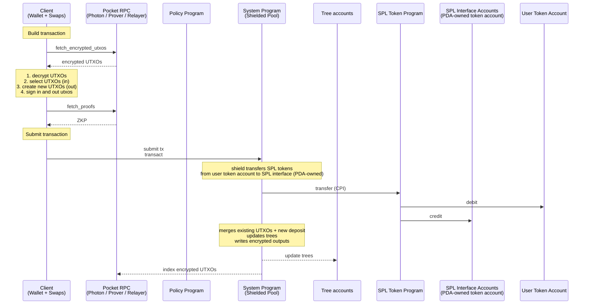
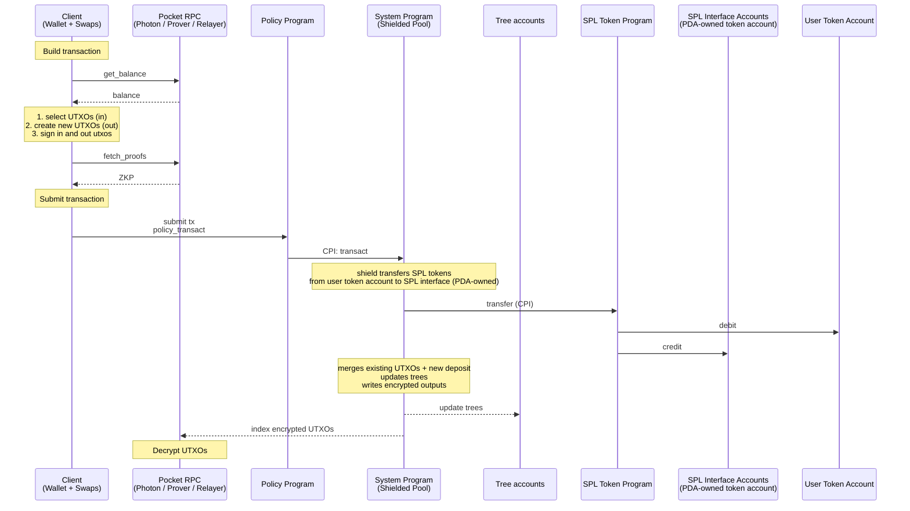
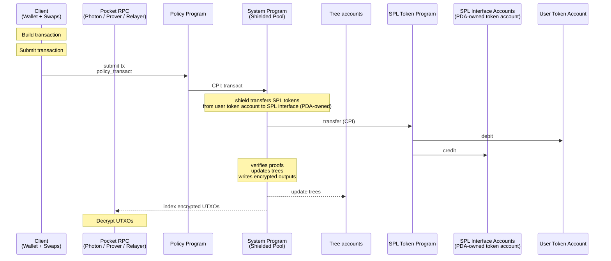
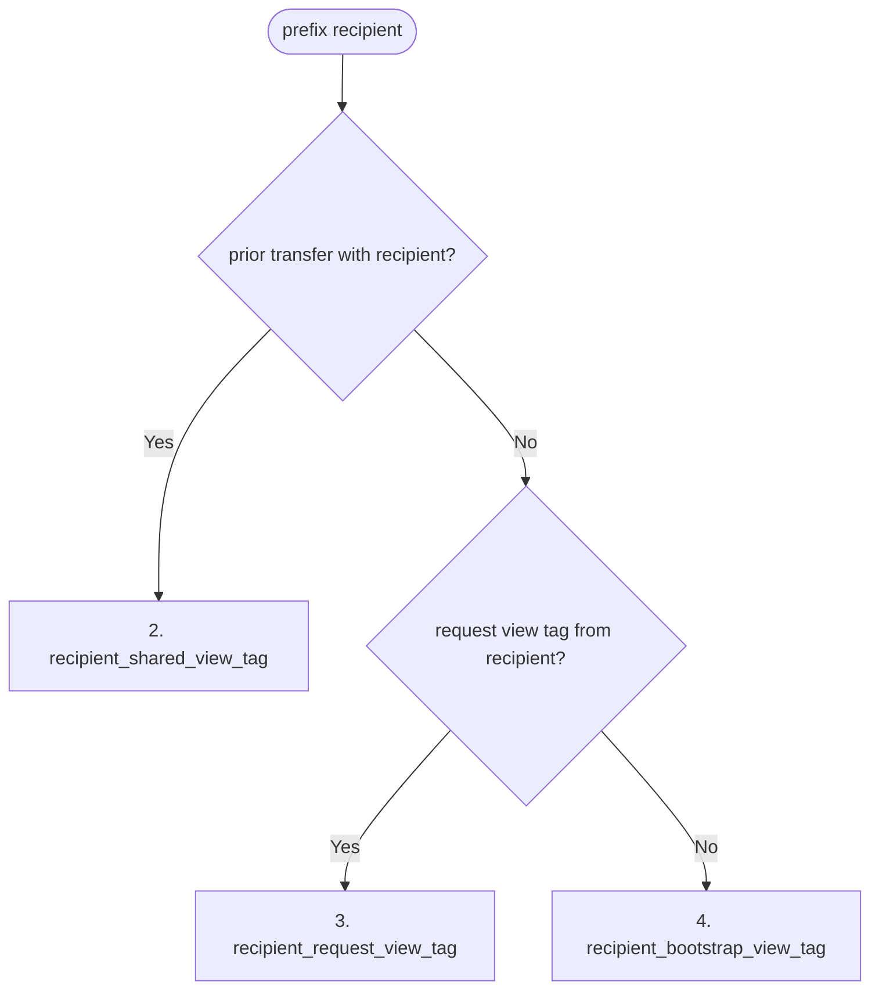
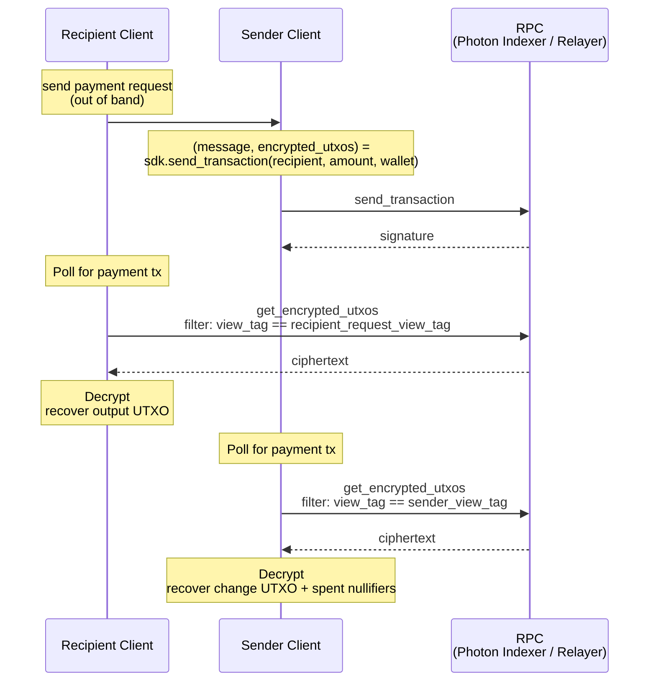
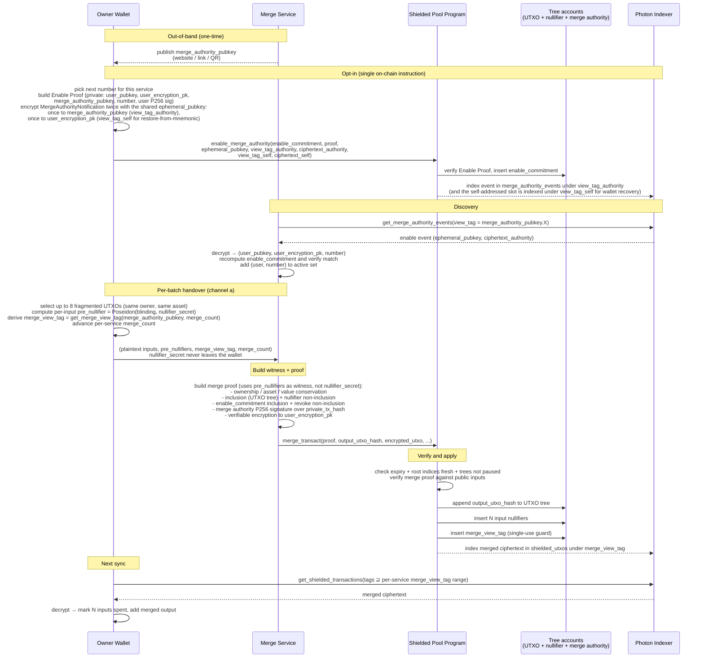

# Spec

## Table of Contents

- [Abstract](#abstract)
- [Architecture](#architecture)
  - [Operations](#operations)
    - [User](#user)
    - [Protocol](#protocol)
  - [Concurrency](#concurrency)
  - [Wallet](#wallet)
    - [Methods](#methods)
    - [State](#state)
    - [request_transfer](#request_transfer)
  - [Client SDK](#client-sdk)
    - [create_payment_request](#create_payment_request)
    - [send_transaction](#send_transaction)
  - [Default Pocket](#default-pocket)
    - [Shield with Proof](#shield-with-proof)
    - [Shield without Proof](#shield-without-proof)
    - [Transfer](#transfer)
    - [Unshield](#unshield)
  - [Policy Pockets](#policy-pockets)
    - [Shield with Proof](#shield-with-proof-1)
    - [Shield without Proof](#shield-without-proof-1)
    - [Transfer](#transfer-1)
    - [Unshield](#unshield-1)
    - [Enter and Exit Pocket](#enter-and-exit-pocket)
- [SPP Proof - Shielded Pool ZK Proof](#spp-proof---shielded-pool-zk-proof)
- [Merge Proof - Merge ZK Proof](#merge-proof---merge-zk-proof)
- [Enable Proof - Merge Authority Opt-in Proof](#enable-proof---merge-authority-opt-in-proof)
- [Revoke Proof - Merge Authority Opt-out Proof](#revoke-proof---merge-authority-opt-out-proof)
- [View Tags](#view-tags)
  - [Sender View Tag](#sender-view-tag)
  - [Recipient view tag](#recipient-view-tag)
  - [Merge view tag](#merge-view-tag)
  - [Derivations](#derivations)
- [Output UTXO Serialization](#output-utxo-serialization)
  - [Program Data](#program-data)
  - [Transfer](#transfer-2)
    - [Plaintext Layout](#plaintext-layout)
    - [Instruction Data Layout](#instruction-data-layout)
  - [UTXO Split](#utxo-split)
    - [Plaintext Layout](#plaintext-layout-1)
    - [Instruction Data Layout](#instruction-data-layout-1)
  - [Merge](#merge)
    - [Plaintext Layout](#plaintext-layout-2)
    - [Instruction Data Layout](#instruction-data-layout-2)
  - [Shield with Merge](#shield-with-merge)
- [Transaction Viewing Key](#transaction-viewing-key)
- [SPP - Shielded Pool Program](#spp---shielded-pool-program)
  - [Accounts](#accounts)
  - [Instructions](#instructions)
    - [transact](#transact)
    - [merge_transact](#merge_transact)
    - [merge_pocket](#merge_pocket)
    - [enable_merge_authority](#enable_merge_authority)
    - [disable_merge_authority](#disable_merge_authority)
- [Policy Program Interface](#policy-program-interface)
- [RPC](#rpc)
  - [Photon Indexer](#photon-indexer)
  - [Pocket RPC](#pocket-rpc)
  - [Merge Service](#merge-service)
  - [Registry](#registry)
  - [Sync Delegate](#sync-delegate)
- [Notes](#notes)
- [User Flows](#user-flows)
  - [Request Payment Flow Default Pocket](#request-payment-flow-default-pocket)
  - [First Time Sync Wallet](#first-time-sync-wallet)
  - [Merge Flow](#merge-flow)

## Abstract

A Solana program for shielded transfers. Users retain custody and can disclose
per-transaction viewing keys on request. UTXOs can enter pockets; each pocket has
auditors, authorities, and a config (freeze authority, co-signer, permanent
delegate).

# Architecture


Source: [`diagrams/architecture.dot`](diagrams/architecture.dot). Regenerate with `just render-diagrams`.

1. Users — own wallets, build encrypted transactions, sign with P256.
2. Photon Indexer — indexes trees + encrypted UTXOs; default-pocket users fetch ciphertexts here.
3. Pocket RPC (with auditor) — RPC with auditor keys; decrypts and serves UTXOs to policy-pocket users.
4. Prover — generates Groth16 proofs. Users can generate client side proofs as well.
5. Relayer — fee-payer; submits transactions to SPP (default pocket), to the ZK Swap program, or to a Policy program (policy pocket).
6. Forester — processes the nullifier queue into the nullifier tree.
7. SPP (Shielded Pool Program) — verifies proofs, updates trees, moves SPL to and from the vaults.
8. ZK Swap Program — settles a swap by CPI into a Policy program or directly into SPP.
9. Policy Programs (1..N) — config programs; verify policy proofs and CPI into SPP.
10. SPL interface vaults — per-mint SPL / Token-22 vaults holding all shielded tokens.
11. Tree accounts — co-located UTXO tree, nullifier tree, and nullifier queue.

Per-flow sequence diagrams are in the [User Flows](#user-flows) section below.


## Operations

### User

| # | Name | Description | Privacy |
| --- | --- | --- | --- |
| 1 | shield | Deposit SPL tokens into the shielded pool; existing UTXOs can be merged in the same transaction. | sender + amount visible; recipient hidden |
| 2 | proofless_shield | Public deposit without a proof. Allows shielding dynamic amounts, for example for the flow unshield, swap, shield. | fully public |
| 3 | unshield | Withdraw SPL tokens from the shielded pool to a public account. | sender hidden (relayer); recipient + amount visible |
| 4 | shielded transfer | Transfer value between shielded balances. | fully shielded (sender, recipient, amount) |

### Protocol

| # | Name | Description |
| --- | --- | --- |
| 1 | create_spl_interface | Initialize SPL/Token-22 pool escrow per token mint |
| 2 | create_tree | Initialize new Tree account (nullifier tree + queue and UTXO tree, co-located) |
| 3 | create_protocol_config | Initialize protocol config (pause authority) |
| 4 | update_protocol_config | Rotate protocol config authority |
| 5 | pause_tree | Freeze writes to a Tree account |


## Concurrency

1. A balance can be used concurrently when it is split up between a number of utxos.
2. To keep the balance spendable in one transaction we split it in up to X utxos.
3. Fragmented balances are reconsolidated by a whitelisted [merge service](#merge_transact). The merge proof enforces conservation of owner, asset, and total amount.

## Wallet

Signs transactions (P256 signature verified inside the SPP proof) and decrypts UTXOs encrypted to the user's pubkey.

Sender view tags index the sender's own change ciphertexts for sync and are inserted into the nullifier tree to guarantee single-use per `TxCount` slot. Recipient request view tags index incoming ciphertexts from payment requests and are not guaranteed single use.

**ShieldedPubkey.** A wallet identity is a pair `ShieldedPubkey = (signing_pk, encryption_pk)`:

- `(owner_sk, signing_pk)` — P-256 keypair verified in-circuit by the SPP. Owns UTXOs (controls spend), signs transactions. Synonym in older prose: `(owner_sk, owner_pubkey)`.
- `(encryption_sk, encryption_pk)` — P-256 keypair used for every sender→recipient ECDH: [View Tags](#view-tags) derivation and [Output UTXO Serialization](#output-utxo-serialization) AES-GCM key derivation. The wallet decrypts incoming ciphertexts with `encryption_sk`; senders encrypt to `encryption_pk`.

The wallet publishes `ShieldedPubkey` via the [Registry](#registry); senders translate a Solana address into `ShieldedPubkey` by registry lookup (see [Wallet Transfer User Flows](#wallet-transfer-user-flows)).

**Seed secret derivations:**

`wallet_seed` is the BIP-39 mnemonic seed: `PBKDF2-HMAC-SHA512(mnemonic, "mnemonic" || passphrase, c=2048, dkLen=64)`.

1. Owner P256 Keypair `(owner_sk, signing_pk)` — derived from `wallet_seed` via BIP-32-style hierarchical derivation on the P-256 curve.
2. Nullifier Secret: `HKDF-SHA256(salt=∅, IKM=owner_sk, info="zolana/nullifier", L=32)`. Master input to the nullifier chain `pre_nullifier = Poseidon(blinding, nullifier_secret)` and `nullifier = Poseidon(utxo_hash, pre_nullifier)`. `nullifier_secret` never appears as a proof witness — the wallet shares per-UTXO `pre_nullifier` values with provers instead, which keeps the prover scoped to specific UTXOs. Sharing `nullifier_secret` with the sync delegate (see [Sync Delegate](#sync-delegate)) lets the delegate derive `pre_nullifier` autonomously for any UTXO it has decrypted; a wallet operating without a delegate keeps `nullifier_secret` local.
3. Ephemeral Secret: `HKDF-SHA256(salt=∅, IKM=wallet_seed, info="zolana/ephemeral", L=32)`. Used by the sender to derive `(ephemeral_sk, ephemeral_pubkey)` on each outgoing transaction.
4. Encryption P256 Keypair `(encryption_sk, encryption_pk)` — `encryption_sk := owner_sk`, `encryption_pk := signing_pk`. The `ShieldedPubkey` has two slots; for now both are set to the owner key.
5. View tag secrets — see [View Tags § Derivations](#view-tags). Both `sender_view_tag_secret` and `recipient_view_tag_secret` derive from `encryption_sk`.

Counter sources for view-tag derivations:

- `get_sender_view_tag(tx_count)` — `TxCount`, advanced on every outgoing transaction.
- `get_recipient_request_view_tag(request_count)` — `RequestCount`, advanced on every `request_transfer`.
- `send_shared_view_tag(recipient_pubkey, i)` — `known_recipients[recipient_pubkey]`, advanced on every send to that recipient that uses this tag.
- `derive_shared_view_tag(sender_pubkey, i)` — `known_senders[sender_pubkey]`, advanced as the wallet's incoming scan for that sender consumes successive `i` values.

`get_ephemeral_keypair(first_nullifier)` is *not* counter-indexed; it is bound to the first nullifier of the transaction's spent inputs, so the keypair is deterministic given the input UTXO set and unique per Solana transaction (nullifier uniqueness implies keypair uniqueness).

### Methods:

**Signing:**

1. `sign_p256(msg) -> P256Signature` — P256 ECDSA over `msg` with `owner_sk`; SHA-256 digest per ECDSA-P256. All in-circuit-verified signatures sign `private_tx_hash`, which covers every input, every output, the external-data hash, and `expiry_unix_ts`.
2. `build_transact_witness(inputs, outputs, expiry_unix_ts, sender_view_tag, external_data_hash) -> ProverWitness` — assembles every private value the prover needs (input UTXO openings with blindings, per-input `pre_nullifier`, output commitments, the P256 signature over `private_tx_hash`).

**Encryption:**

3. `begin_tx(first_nullifier) -> TxHandle` — derives `(ephemeral_sk, ephemeral_pubkey)` from `HKDF(salt=first_nullifier, IKM=ephemeral_secret, info="zolana/ephemeral")` and returns an opaque handle plus the public `ephemeral_pubkey`. The `ephemeral_sk` is held inside the handle and reused across all recipients of the same transaction.
4. `encrypt_to_recipient(handle, recipient_encryption_pk, plaintext) -> Ciphertext` — AES-GCM seal with key `KDF(ECDH(handle.ephemeral_sk, recipient_encryption_pk))`.
5. `decrypt(ciphertext, ephemeral_pubkey, key_index) -> Result<Plaintext>` — AES-GCM open with key `KDF(ECDH(encryption_sk_{key_index}, ephemeral_pubkey))`. `key_index` selects the registry entry's encryption key for historic decryption; default = current.

**Nullifier fingerprinting:**

6. `pre_nullifier(utxo) -> [u8; 32]` — `Poseidon(utxo.blinding, nullifier_secret)`. The per-UTXO value the wallet shares with provers.
7. `pre_nullifiers(utxos: &[Utxo]) -> Vec<[u8; 32]>` — batch variant.
8. `nullifier(utxo) -> [u8; 32]` — `Poseidon(utxo.hash, pre_nullifier(utxo))`. Used in sync to match against on-chain nullifiers.

**View tags:**

Each method takes `key_index` (defaults to the current encryption key) and returns the 32-byte tag value.

9. `get_sender_view_tag(key_index, tx_count)` — see [View Tags § Derivations](#view-tags).
10. `get_recipient_request_view_tag(key_index, request_count)` — see [View Tags § Derivations](#view-tags).
11. `send_shared_view_tag(key_index, counterparty_pubkey, i)` — sender-side `recipient_shared_view_tag`.
12. `derive_shared_view_tag(key_index, counterparty_pubkey, i)` — recipient-side `recipient_shared_view_tag`.
13. `get_merge_view_tag(key_index, merge_authority_pubkey, merge_count)` — owner-side `merge_view_tag`; per-service stream so concurrent merge services do not share a counter namespace. The merge service derives the same value when it holds `encryption_sk` (as sync delegate or via wallet handover). See [View Tags § Derivations](#view-tags).
14. `view_tag_range(kind, key_index, range, counterparty_pubkey: Option<P256Pubkey>) -> Vec<[u8; 32]>` — batch variant for sync queries; `kind` selects the underlying method above.

**Payment requests & sync:**

15. `request_transfer(asset_mint, amount, pocket_program_id, expiry_unix_ts, memo) -> PaymentRequest` — see [request_transfer](#request_transfer).
16. `sync(start_timestamp)`:
    1. sync default pocket loop: derive sender_view_tags, request encrypted utxos based on tags, repeat until no matches
    2. sync policy pockets loop: for every pocket request balance
    3. sync merge outputs: for each known service in `merge_services`, derive `merge_view_tag(merge_authority_pubkey, ...)` for the range `[merge_count, ...)` and pull matching ciphertexts; advance the per-service `merge_count` past the highest observed value.

**Merge service:**

17. `build_enable_merge_authority(user_encryption_pk, merge_authority_pubkey, number) -> Instruction` — assembles an [`enable_merge_authority`](#enable_merge_authority) instruction. Builds the [Enable Proof](#enable-proof---merge-authority-opt-in-proof) (signature pre-image `Sha256BE(ENABLE_TAG || user_encryption_pk || merge_authority_pubkey || u64_be(number))`) and the AES-256-GCM ciphertext addressed to `merge_authority_pubkey`.
18. `build_disable_merge_authority(user_encryption_pk, merge_authority_pubkey, number) -> Instruction` — assembles a [`disable_merge_authority`](#disable_merge_authority) instruction. Builds the [Revoke Proof](#revoke-proof---merge-authority-opt-out-proof) (signature pre-image `Sha256BE(REVOKE_TAG || user_encryption_pk || merge_authority_pubkey || u64_be(number))`) and the AES-256-GCM ciphertext addressed to `merge_authority_pubkey`.

One ephemeral keypair is shared across all recipients of a transaction (see [Output UTXO Serialization](#output-utxo-serialization)); `begin_tx` returns one handle per transaction. A shared-account variant MAY substitute a shared secret for `ephemeral_secret`; `first_nullifier` is unchanged.

### State:
1. `Utxos: Vec<Utxo>` (optional cache; can be rebuilt from sync).
2. `TxCount: u64` — outgoing transaction counter under the current encryption key; indexes `get_sender_view_tag`. Resets to 0 on encryption-key rotation; [First Time Sync](#first-time-sync-wallet) rebuilds per-key history.
3. `RequestCount: u64` — `request_transfer` counter under the current encryption key; indexes `get_recipient_request_view_tag`. Resets to 0 on encryption-key rotation.
4. `last_synced: Timestamp`
5. `known_senders: map<sender_pubkey → received_counter: u64>` — next index to scan in `derive_shared_view_tag(sender_pubkey, i)` under the current encryption key. Populated lazily on first receipt from a new sender. Resets on encryption-key rotation; [First Time Sync](#first-time-sync-wallet) rebuilds per-key history.
6. `known_recipients: map<recipient_pubkey → sent_counter: u64>` — next index to use in `send_shared_view_tag(recipient_pubkey, i)` under the current encryption key. Populated lazily on first send to a new recipient. Resets on encryption-key rotation.
7. `merge_services: map<merge_authority_pubkey → (user_encryption_pk, number, merge_count): (P256Pubkey, u64, u64)>` — local cache of enabled merge services. `number` is the active enable slot for this service; `merge_count` is the per-service counter that indexes `get_merge_view_tag(merge_authority_pubkey, ...)`. `merge_count` is set to `max(observed) + 1` during sync per service. Resets to 0 on encryption-key rotation. The enable slot is rebuildable from the merge authority tree (probe `enable_commitment(n)` for `n = 0, 1, ...` and check absence of the matching `revoke_commitment(n)`).

### request_transfer

Builds a payment request that a recipient hands to a sender out of band. The sender writes `recipient_request_view_tag` into the recipient's ciphertext slot so the recipient can pull the payment by exact byte match from the indexer (see [Request Payment Flow](#request-payment-flow)).

**Inputs**

```rust
fn request_transfer(
    /// Solana SPL / Token-22 mint pubkey.
    asset_mint: [u8; 32],
    /// In units of `asset_mint`.
    amount: u64,
    /// All-zero = default pocket.
    pocket_program_id: [u8; 32],
    /// Unix seconds after which the recipient considers the request expired.
    expiry_unix_ts: u64,
    /// Application-defined; not parsed by SPP; UTF-8, max 1024 bytes.
    memo: String,
) -> PaymentRequest
```

**Algorithm**

1. `request_count := state.RequestCount`
2. `recipient_request_view_tag := get_recipient_request_view_tag(request_count)`
3. `state.RequestCount += 1`
4. `return PaymentRequest { version=0, recipient_pubkey, recipient_request_view_tag, pocket_program_id, asset_mint, amount, expiry_unix_ts, memo }`

`RequestCount` is incremented unconditionally — even if the sender never pays. Reusing a nonce across two outstanding requests would let the indexer link them.

**Output: `PaymentRequest`**

Canonical big-endian byte layout. Packed, no length prefixes (`memo_len` precedes the variable-length `memo` tail).

```rust
/// 148 + memo.len() bytes total. Multi-byte integers are big-endian.
/// Wire format prefixes `memo` with its u16 BE byte length (0 if absent, max 1024).
struct PaymentRequest {
    /// Currently `0`.
    version: u8,
    /// P256 SEC1-compressed (1-byte prefix + 32 B X).
    recipient_pubkey: Address,
    recipient_request_view_tag: [u8; 32],
    /// All-zero = default pocket.
    pocket_program_id: Option<[u8; 32]>,
    /// Solana SPL / Token-22 mint pubkey.
    mint: Address,
    /// In units of `asset_mint`.
    amount: u64,
    expiry_unix_ts: u64,
    /// UTF-8; max 1024 bytes.
    memo: String,
}
```

### send_transaction

Builds the SPP `transact` instruction data and the `encrypted_utxos` blob for a transfer. Encryption happens client-side; the wallet's `get_ephemeral_keypair` stays private to the SDK.

**Inputs**

```rust
fn send_transaction(
    /// Addressing info (see Recipient below).
    recipient: Recipient,
    /// In units of `recipient.asset_mint`.
    amount: u64,
    /// Caller's wallet (see Wallet).
    wallet: &mut Wallet,
) -> (Instruction, Vec<u8>)

struct Recipient {
    /// Recipient's P256 SEC1-compressed or Solana pubkey.
    pubkey: [u8; 33],
    /// Solana SPL / Token-22 mint pubkey.
    asset_mint: [u8; 32],
    /// Recipient-supplied view tag from a payment request; `None` triggers
    /// the unsolicited path (bootstrap or shared view tag — see View Tags).
    recipient_request_view_tag: Option<[u8; 32]>,
    /// `None` = default pocket.
    pocket_program_id: Option<[u8; 32]>,
}
```

**Algorithm**
0. check wallet is synced.
1. `asset_id := AssetRegistry[recipient.asset_mint]` (via SPP [Asset registry](#accounts)).
2. `tx_count := wallet.TxCount`; `wallet.TxCount += 1`.
3. `sender_view_tag := wallet.get_sender_view_tag(current_key, tx_count)`.
4. Select sender input UTXOs covering `amount` + fees from wallet state; compute `change_amount`.
5. Compute `first_nullifier` from the first selected input UTXO (lexicographic input position 0).
6. `(handle, ephemeral_pubkey) := wallet.begin_tx(first_nullifier)`. The handle owns `ephemeral_sk` for the rest of this transaction.
7. Pick random 31-byte `change_blinding_seed` and `recipient_blinding`.
8. Build the recipient output: `(owner=recipient.pubkey, asset_id, amount, blinding_seed=recipient_blinding_seed)`.
9. Build the sender change output: `(owner=sender_pubkey, asset_id, amount=change_amount, blinding_seed=change_blinding_seed)`.
10. For each output, `ciphertext := wallet.encrypt_to_recipient(handle, owner.encryption_pk, plaintext)`. The sender ciphertext's `view_tag` is `sender_view_tag` (included in `transact` instruction data, not repeated in the blob). Each recipient ciphertext's `view_tag` is selected per [View Tags § Recipient view tag selection](#view-tags); updates to `wallet.known_recipients` are applied as specified there. Concatenate per the [Transfer](#transfer-1) layout into `encrypted_utxos`.
11. compute `private_tx_hash = Poseidon(input utxo hash chain, output utxo hash chain, external data hash, expiry_unix_ts)`
12. `signature := wallet.sign_p256(private_tx_hash)`
13. `witness := wallet.build_transact_witness(inputs, outputs, expiry_unix_ts, sender_view_tag, external_data_hash)`. Either run the prover locally on `witness`, or ship `witness` (no secrets) to a prover RPC and receive a `proof` in return.
14. Assemble the SPP `transact` instruction (see [transact](#transact)): `expiry_unix_ts`, `sender_view_tag`, `proof`, `relayer_fee`, `output_utxo_hashes`, `nullifier_root_index`, `private_tx_hash`, `public_sol_amount`, `public_spl_amount`, `encrypted_utxos`.
15. `return (instruction, encrypted_utxos)`.

## Default Pocket

The default pocket is similar to zcash and has no policy.
Users invoke the SPP directly.
The merge service is optional and can be used for performance and improved UX.

### Shield with Proof



### Shield without Proof


### Transfer


### Unshield


## Policy Pockets

A logical grouping of UTXOs whose state transitions are checked by a policy program. Each pocket has its own auditor, authorities, and config.

| # | Name | Description |
| --- | --- | --- |
| 1 | Non-Custodial | Pockets are non-custodial. Control remains with user; auditor reads all UTXOs but cannot sign or spend |
| 2 | Extended UTXO schema | Includes state + extension fields (pocket address, ...); extensions is any data that is not part of the standard UTXO schema |
| 3 | Enter Pocket | A pocket can be entered by shield from an SPL token account, the standard shielded pool, or another pocket in a shielded transfer |
| 4 | Exit Pocket | A pocket can be exited by unshield to an SPL token account, the standard shielded pool, or another pocket in a shielded transfer |
| 5 | Merge Service | Opt-in backend service that merges a user's UTXOs into fewer larger UTXOs (see [Merge Service](#merge-service) section below). |

**Notes:**

1. The pocket config is a compressed account so it can be used inside the `pocket_transact` UTXO proof without revealing which pocket the user is in. As a PDA it would require an extra public account, making the pocket visible.
    1. by extending the attestation program and adding a verifyingkey upload we can make a generalized policy program.

### Shield with Proof



### Shield without Proof



### Transfer


### Unshield


### Enter and Exit Pocket

1. Enter, shield or transfer from default pocket
2. Exit, unshield or transfer from policy pocket

# SPP Proof - Shielded Pool ZK Proof

**Requirement.** The circuit MUST NOT take any wallet secret as a witness input.

**Public Inputs**

| Input | Source |
| --- | --- |
| nullifiers | derived in-circuit from spent input UTXOs |
| output_utxo_hashes | instruction data |
| nullifier_root | resolved from `nullifier_root_index` against the SPP root cache |
| private_tx_hash | instruction data |
| public_sol_amount | instruction data |
| public_spl_amount | instruction data |
| public_spl_asset_pubkey | derived by SPP from the vault token account's mint |
| ProgramIDHashchain | instruction data |
| SolanaPubkeyHash | `Sha256BE(solana_signer)` derived by SPP from `payer` |
| data_hash | instruction data |
| policy_data | instruction data |

**UTXO Hash**

| # | Name | Description |
| --- | --- | --- |
| 1 | domain |  |
| 2 | owner | Owner pubkey as PoseidonPubkey |
| 3 | asset_id | Sha256BE |
| 4 | asset_amount |  |
| 5 | blinding | 31 random bytes. Two roles: (i) hide the UTXO hash's preimage so `(owner, asset_id, asset_amount)` tuples aren't enumerable from public hashes; (ii) act as the per-UTXO entropy source for `pre_nullifier = Poseidon(blinding, nullifier_secret)`. A party who knows `nullifier_secret` still cannot compute a UTXO's `pre_nullifier` (and therefore its nullifier) without also having decrypted the ciphertext that contains its `blinding`. |
| 6 | data_hash | Application data hash unconstrained in SPP proof. |
| 7 | policy_data | Policy data hash unconstrained in SPP proof. |
| 8 | policy_program_id |  |

**Nullifier Hash**

```
pre_nullifier = Poseidon(blinding, nullifier_secret)
nullifier     = Poseidon(utxo_hash, pre_nullifier)
```

`nullifier_secret` is the wallet-derived Nullifier Secret (see [Wallet](#wallet)); `blinding` is the 31-byte field from the spent UTXO's opening.

**Purpose of the two-step construction.** A prover server (a merge service, or any future third-party prover) needs the nullifier in its witness to construct the proof. The two-step construction lets the wallet hand the prover the `pre_nullifier` for each specific UTXO it should consume. `nullifier_secret` stays in the wallet or its appointed sync delegate and never appears in a proof witness.

`pre_nullifier` is per-UTXO scoped: it depends on that UTXO's `blinding` (a 31-byte random value unique to that UTXO), so a `pre_nullifier` for UTXO `i` reveals nothing about the nullifier of any other UTXO. The prover can compute the nullifier for the one UTXO it was authorized to merge. Poseidon's one-wayness prevents the prover from extracting `nullifier_secret` from one or many `pre_nullifier` values.

**external_data_hash**

Hash over the public fields of the `transact` instruction and the Solana token accounts the proof must commit to. Included in `private_tx_hash` so the owner's signature covers the entire transaction.

```
external_data_hash := Sha256BE(
    sender_view_tag                                  ||
    u16_be(relayer_fee)                              ||
    u64_be(public_sol_amount.unwrap_or(0))           ||
    u64_be(public_spl_amount.unwrap_or(0))           ||
    user_spl_token_account.unwrap_or([0; 32])        ||
    spl_token_interface.unwrap_or([0; 32])           ||
    encrypted_utxos
)
```

**Checks**

| Check | Description |
| --- | --- |
| UTXO Ownership | Spent input UTXOs MUST be authorized by their owner, either with a P256 signature verified in circuit or a Solana signer checked by SPP. The P256 signature covers `sender_view_tag`, `expiry_unix_ts`, and the input UTXOs, so a prover cannot replay the proof under different public inputs. Pubkeys are encoded as Poseidon(pubkey_low, pubkey_high). |
| Inclusion | Spent input UTXOs MUST exist in the UTXO tree. |
| Nullifier non-inclusion | Input nullifiers MUST NOT exist in the nullifier tree before the transaction. |
| Nullifiers | Public nullifiers MUST be well formed from the spent input UTXOs. |
| Output UTXOs | Output UTXOs MUST be well formed and match the public output commitments. |
| Balance Conservation | For each active asset, inputs plus public deposits MUST equal outputs plus public withdrawals and fees. |
| Private transaction hash | `private_tx_hash = Poseidon(input utxo hash chain, output utxo hash chain, external data hash, expiry_unix_ts)`.<br>The owner signs this value (see [UTXO Ownership Check](#utxo-ownership-check)). SPP, policy, and third-party proofs all take `private_tx_hash` as a public input, so every circuit proves statements about the same transaction data. |
| Program ownership | UTXOs owned by a policy program MUST be authorized by a PDA signer of that program. Policy proofs are checked by the policy program before CPI into SPP. |
| Dummy input or output | ZK circuits are fixed size; dummy UTXOs allow a transaction to use fewer real inputs or outputs. Ownership, inclusion, nullifier non-inclusion, output, and balance checks are skipped for dummy UTXOs. |

**Utxo Ownership Check:**
1. Ed25519 Solana signer checked by SPP. Used when the input UTXO's owner is the Solana payer (shield path).
2. P256 signature over `private_tx_hash` verified in the SPP proof. The hash covers every input, every output, the external-data hash, and `expiry_unix_ts`, so the proof cannot be replayed with different state.

**Circuit Combinations**

| Circuit | Use | Shape |
| --- | --- | --- |
| 1 in 1 out | Shield with merge | 1 existing UTXO in, 1 combined output (existing balance + new deposit) |
| 1 in 2 out | Single-input transfer | 1 sender input UTXO, 1 recipient output, 1 change output; gas fees are sponsored |
| 3 in 3 out | Standard transfer | 1 SOL fee UTXO, 2 sender input UTXOs, 1 recipient output, 1 SPL change output, 1 SOL change output |
| 5 in 3 out | Higher concurrency | 1 SOL fee UTXO, 4 sender input UTXOs, 1 recipient output, 1 SPL change output, 1 SOL change output |
| 1 in 8 out | Split UTXO | Split 1 UTXO into up to 8 equal parts; equal parts reduce encrypted data |

# Merge Proof - Merge ZK Proof

ZK proof for [`merge_transact`](#merge_transact). Consolidates `N` input UTXOs of a single owner and single asset into one output of the same owner, asset, and total amount. Authorized by a whitelisted merge authority signature.

**Requirement.** The circuit MUST NOT take any wallet secret as a witness input.

**Public Inputs**

| Input | Source |
| --- | --- |
| nullifiers | derived in-circuit from spent input UTXOs |
| output_utxo_hash | instruction data |
| nullifier_root | resolved from `nullifier_root_index` against the SPP root cache |
| merge_authority_root | resolved from `merge_authority_root_index` against the merge authority tree root cache |
| private_tx_hash | instruction data |
| ephemeral_pubkey | instruction data (from the merge ciphertext blob) |
| ciphertext | instruction data (from the merge ciphertext blob) |

**Private Inputs**

| Input | Notes |
| --- | --- |
| input UTXO openings | owner, asset_id, amount, blinding for each input |
| pre_nullifier (per input) | `Poseidon(blinding, nullifier_secret)`. Computed and supplied by the wallet (channel a) or derived locally by the sync delegate from `nullifier_secret` + decrypted blinding (channel b). The proof computes `nullifier = Poseidon(utxo_hash, pre_nullifier)` in-circuit. |
| user_pubkey | shared owner of all inputs and the output (P256 signing pk) |
| user_encryption_pk | owner's P256 encryption pubkey, bound at enable time via `enable_commitment` |
| merge_authority_pubkey | merge authority P256 signing pk |
| number | slot index for the active `(user_pubkey, user_encryption_pk, merge_authority_pubkey)` whitelist; private to keep the count of revocation cycles unobservable |
| merge_authority_signature | P256 signature by `merge_authority_pubkey` over `private_tx_hash` |
| enable_inclusion_path | Merkle path proving `enable_commitment ∈ merge_authority_tree` at `merge_authority_root` |
| revoke_non_inclusion_path | Merkle path proving `revoke_commitment ∉ merge_authority_tree` at `merge_authority_root` |
| output opening | shared owner = `user_pubkey`, asset_id, amount, blinding for the merged output |
| ephemeral_sk | P256 scalar used in ECDH; `ephemeral_pubkey == ephemeral_sk · G_P256` |
| plaintext | the merge bundle (`owner_pubkey`, `asset_id`, `amount`, `blinding`); `Poseidon(plaintext) == output_utxo_hash` |

**Checks**

| Check | Description |
| --- | --- |
| Ownership uniformity | Every input UTXO's `owner` equals `user_pubkey`. |
| Asset uniformity | Every input UTXO's `asset_id` equals the output's `asset_id`. |
| Value conservation | `sum(inputs.amount) == output.amount`. |
| Inclusion | Each input UTXO is a leaf of the UTXO tree at `nullifier_root` (paths checked in-circuit). |
| Nullifier non-inclusion | Each input nullifier is absent from the nullifier tree at `nullifier_root`. |
| Nullifiers | Public nullifiers are well-formed from spent inputs (see [SPP Proof § Nullifier Hash](#spp-proof---shielded-pool-zk-proof)). |
| Input cleanliness — `data_hash` | For each non-dummy input UTXO: `data_hash = 0`. UTXOs with application extension data are not mergeable; the application program that set `data_hash` consumes them through its own `transact`-style flow. Applies to both `merge_transact` and `merge_pocket`. |
| Input cleanliness — pocket fields | For `merge_transact` (default-pocket merge service): each non-dummy input UTXO additionally has `policy_program_id = 0` and `policy_data = 0`. For [`merge_pocket`](#merge_pocket) (policy-CPI merge): the non-dummy inputs share a `policy_program_id` that matches the CPI caller; `policy_data` is constrained by the policy program's own logic, not by SPP. |
| Output well-formed | The output UTXO hash matches the public `output_utxo_hash`; output `owner = user_pubkey`, `data_hash = 0`. For `merge_transact`: `policy_program_id = 0` and `policy_data = 0`. For `merge_pocket`: `policy_program_id` matches the CPI caller and `policy_data` is the value the policy program sets (constrained by its own proof). |
| Whitelist inclusion | `Poseidon(ENABLE_TAG, user_pubkey, user_encryption_pk, merge_authority_pubkey, number)` is a leaf of the merge authority tree at `merge_authority_root`. |
| Revoke non-inclusion | `Poseidon(REVOKE_TAG, user_pubkey, user_encryption_pk, merge_authority_pubkey, number)` is NOT a leaf of the merge authority tree at `merge_authority_root`. Combined with SPP's queue bloom-filter check on `merge_transact`, this catches any revoke that landed after the cached root was taken. |
| Merge authority signature | P256 signature by `merge_authority_pubkey` over `private_tx_hash` verifies. The hash covers every input, the output, the external-data hash, and `expiry_unix_ts`, so the proof cannot be replayed with different state. |
| Private transaction hash | `private_tx_hash = Poseidon(input utxo hash chain, output utxo hash, external data hash, expiry_unix_ts)`. |
| Plaintext binding | `Poseidon(plaintext) == output_utxo_hash`. |
| Keypair consistency | `ephemeral_pubkey == ephemeral_sk · G_P256`. |
| Verifiable encryption | The public `ciphertext` equals `AES-256-GCM(aes_key, nonce, plaintext, AAD = output_utxo_hash)` where `(aes_key, nonce)` are derived by the Poseidon KDF below from `ephemeral_sk` and `user_encryption_pk`. |

**Verifiable encryption: DHKEM(P-256) + Poseidon KDF + AES-256-GCM.** All steps are checked by the merge proof.

```
// 1. Raw ECDH (P-256)
dh = ephemeral_sk · user_encryption_pk          // 32 B (x-coordinate)

// 2. KEM shared secret, binding both pubkeys (HPKE kem_context pattern)
shared_secret = Poseidon(
    DOM_SEP_SHARED_SECRET,
    dh.lo,                 dh.hi,
    ephemeral_pubkey.lo,   ephemeral_pubkey.hi,
    user_encryption_pk.lo, user_encryption_pk.hi,
)

// 3. Info siloing
siloed = Poseidon(DOM_SEP_SILO, shared_secret, info.lo, info.hi)
         where info = "zolana/merge"

// 4. AES-256 key (two Poseidon calls, low 16 bytes from each high half)
key_lo  = Poseidon(DOM_SEP_KEY,     siloed)
key_hi  = Poseidon(DOM_SEP_KEY + 1, siloed)
aes_key = key_hi[16..32] || key_lo[16..32]      // 32 B

// 5. AES-GCM nonce
nonce_raw = Poseidon(DOM_SEP_NONCE, siloed)
nonce     = nonce_raw[20..32]                    // 12 B

// 6. Encrypt
(ciphertext_bytes, tag) = AES-256-GCM(aes_key, nonce, plaintext, aad = output_utxo_hash)
```

`DOM_SEP_*` are 32-bit ASCII tags packed into a field element.

The merged output's hash and ciphertext contain no merge-service-specific fields; the output looks like any other user-owned UTXO. The proof checks `ciphertext` against `plaintext` and `plaintext` against `output_utxo_hash`, so a passing proof means the owner can decrypt and spend the merged UTXO.

**Circuit shape**

| Circuit | Use | Shape |
| --- | --- | --- |
| 8 in 1 out (merge) | Reconsolidate fragmented balance | Up to 8 input UTXOs same owner/asset, 1 combined output. Fewer-than-8 inputs use dummy slots (skip ownership, inclusion, nullifier non-inclusion). |

# Enable Proof - Merge Authority Opt-in Proof

ZK proof for [`enable_merge_authority`](#enable_merge_authority). Hides `user_pubkey`, `user_encryption_pk`, `merge_authority_pubkey`, and `number`; only `enable_commitment` is public, so an external observer cannot link an enable instruction to a user or to a service.

**Public Inputs**

| Input | Source |
| --- | --- |
| enable_commitment | instruction data |

**Private Inputs**

| Input | Notes |
| --- | --- |
| user_pubkey | owner's P256 signing pk |
| user_encryption_pk | owner's P256 encryption pk |
| merge_authority_pubkey | merge authority P256 signing pk |
| number | user-chosen slot index |
| user_signature | P256 signature by `user_pubkey` over `Sha256BE(ENABLE_TAG \|\| user_encryption_pk \|\| merge_authority_pubkey \|\| u64_be(number))` |

**Checks**

| Check | Description |
| --- | --- |
| Commitment | `enable_commitment == Poseidon(ENABLE_TAG, user_pubkey, user_encryption_pk, merge_authority_pubkey, number)` (pubkeys Poseidon-encoded). |
| User signature | P256 signature by `user_pubkey` over the canonical pre-image verifies. Without this check anyone could insert commitments for an arbitrary `user_pubkey`. |

The proof reveals nothing beyond `enable_commitment`. Tree insertion of a duplicate commitment fails at SPP level (uniqueness check on the merge authority tree).

# Revoke Proof - Merge Authority Opt-out Proof

ZK proof for [`disable_merge_authority`](#disable_merge_authority). Symmetric to the Enable Proof; uses `REVOKE_TAG` instead of `ENABLE_TAG`.

**Public Inputs**

| Input | Source |
| --- | --- |
| revoke_commitment | instruction data |

**Private Inputs**

| Input | Notes |
| --- | --- |
| user_pubkey | owner's P256 signing pk |
| user_encryption_pk | matches the encryption pk of the enable being revoked |
| merge_authority_pubkey | merge authority P256 signing pk |
| number | matches the `number` of the enable being revoked |
| user_signature | P256 signature by `user_pubkey` over `Sha256BE(REVOKE_TAG \|\| user_encryption_pk \|\| merge_authority_pubkey \|\| u64_be(number))` |

**Checks**

| Check | Description |
| --- | --- |
| Commitment | `revoke_commitment == Poseidon(REVOKE_TAG, user_pubkey, user_encryption_pk, merge_authority_pubkey, number)`. |
| User signature | P256 signature verifies, same rationale as the Enable Proof. |

Each of the three merge proofs (Merge, Enable, Revoke) has its own Groth16 verifying key.

# View Tags

A view tag is a 32-byte value attached to a ciphertext. Wallets sync by querying the indexer for exact view-tag matches and decrypt only their own transactions. Derivation splits into two cases — tags the sender derives for themselves to discover their own change UTXOs, and tags the sender derives for the recipient to discover incoming transfers.

Throughout this section, `counterparty_pubkey` / `recipient_pubkey` / `sender_pubkey` refer to the counterparty's `encryption_pk` from their [ShieldedPubkey](#wallet); shared view tags and AES-GCM keys are derived from ECDH over the encryption keypair.

**Uniqueness.** View tags are not globally unique across transactions. Only `sender_view_tag` and `merge_view_tag` are enforced single-use by SPP — they are inserted into the nullifier tree on `transact` and `merge_transact` respectively, and duplicates are rejected. The other variants may collide; the indexer returns all ciphertexts matching a tag value, and the recipient decrypts each.

**Stream separation.** Tags are grouped into independent streams. Each stream has its own counter and its own derivation purpose; streams do not share counters. The motivation:

1. *No cross-actor coordination.* The owner, the merge service, and a counterparty bootstrapping a new pair may submit transactions concurrently. Independent counters mean no actor reserves or persists counter state on another's behalf, and a crash in one stream cannot collide with another.
2. *Independent sync paths.* Each stream is queried independently during sync; the wallet attributes matches to the correct source and advances each counter independently.
3. *Independent lifecycle.* A stream can be active, paused, or rotated without affecting the others (e.g., rotating the encryption key resets every stream's counter).

The streams: `sender_view_tag` (owner's own transactions, counter `TxCount`), `merge_view_tag` (per-service stream for each whitelisted merge service, counter `merge_count` keyed by `merge_authority_pubkey`), `recipient_request_view_tag` (one-time tags the owner mints to bootstrap a sender→owner pair, counter `RequestCount`), and `recipient_shared_view_tag` (steady-state shared tags between a sender-recipient pair, counter `i` per counterparty in `known_senders` / `known_recipients`). `recipient_request_view_tag` and `recipient_shared_view_tag` are separated for the same reason `sender_view_tag` and `merge_view_tag` streams are: distinct lifecycles, and a shared counter would require coordination across the boundary. The same principle separates each merge service's stream from every other's, so multiple services can merge concurrently without colliding.

For transfers, view tags need to be shared between the sender and recipient. A wallet cannot pre-derive shared tags for every possible sender, and the wallet needs to know which senders to derive view tags for. The first transfer between a new sender-recipient pair therefore uses a tag the recipient can find without prior knowledge of the sender: either `recipient_request_view_tag` (recipient minted, shared out-of-band) or `recipient_bootstrap_view_tag = recipient_pubkey.X` (publicly linkable, no coordination). This first transfer establishes the pair: on decryption the recipient reads `sender_pubkey` from the ciphertext and derives the shared ECDH key, and subsequent transfers from this sender use `recipient_shared_view_tag` and are found via `scan_view_tags`. `sender → recipient` and `recipient → sender` produce disjoint tags.

### Sender View Tag

1. **`sender_view_tag`**
  - Derived by: the sender, to index her change utxos.
  - Tx sent by: the sender
  - Indexed by: the sender

### Recipient view tag

2. **`recipient_shared_view_tag`**
    - Derived by: the sender and recipient independently. Sender via `send_shared_view_tag` to send the tx, the recipient via `derive_shared_view_tag` to index the tx.
    - Tx sent by: the sender.
    - Indexed by: the recipient.
3. **`recipient_request_view_tag`**
    - Derived by: the recipient. The recipient shares the tag with the sender out-of-band as a `PaymentRequest`.
    - Tx sent by: the sender.
    - Indexed by: the recipient. Once the recipient decrypts this transfer, subsequent transfers from the same sender can be indexed by `recipient_shared_view_tag`.
4. **`recipient_bootstrap_view_tag`**
    - Derived by: anyone — `recipient_pubkey.X` (the 32-byte X-coordinate of the recipient's `encryption_pk`).
    - Tx sent by: the sender.
    - Indexed by: the recipient. Once the recipient decrypts this transfer, subsequent transfers from the same sender can be indexed by `recipient_shared_view_tag`.

### Merge view tag

5. **`merge_view_tag`**
    - Derived by: the owner (wallet) and the whitelisted merge service, independently — both derive from `encryption_sk` (the service has it as the sync delegate or receives plaintext over a separate channel; see [Merge Service](#merge-service)).
    - Tx sent by: the merge service.
    - Indexed by: the owner.
    - Counter: per-service `merge_count` keyed by `merge_authority_pubkey` (`wallet.merge_services[merge_authority_pubkey].merge_count`), advanced on every `merge_transact` for that service. Concurrent merge services therefore have disjoint tag streams.
    - Uniqueness: enforced single-use by SPP — inserted into the nullifier tree on `merge_transact`, same as `sender_view_tag`.

The owner finds merge outputs during sync by scanning each known service's stream: `wallet.view_tag_range(merge, key_index, range, Some(merge_authority_pubkey))`. The merge service uses sequential `merge_count` values; the wallet treats the highest observed value per service as the current count.



"Prior transfer with recipient?" is decided by `recipient_pubkey ∈ wallet.known_recipients`.

**Sender-side updates to `wallet.known_recipients[recipient_pubkey]`:**

- Case 2 (`recipient_shared_view_tag`): use `i = known_recipients[recipient_pubkey]`, then `known_recipients[recipient_pubkey] += 1`.
- Case 3 (`recipient_request_view_tag`): if absent, insert `known_recipients[recipient_pubkey] = 0`. No increment.
- Case 4 (`recipient_bootstrap_view_tag`): if absent, insert `known_recipients[recipient_pubkey] = 0`. No increment.

### Derivations

Tag secrets are derived from `encryption_sk` to enable encryption-key rotation:

```
sender_view_tag_secret    := HKDF-SHA256(salt=∅, IKM=encryption_sk, info="zolana/sender_view_tag",    L=32)
recipient_view_tag_secret := HKDF-SHA256(salt=∅, IKM=encryption_sk, info="zolana/recipient_view_tag", L=32)
merge_view_tag_secret     := HKDF-SHA256(salt=∅, IKM=encryption_sk, info="zolana/merge_view_tag",     L=32)
```

`get_sender_view_tag(tx_count)`:

```
HKDF-SHA256(
    salt = ∅,
    IKM  = sender_view_tag_secret,
    info = "zolana/sender_view_tag/" || u64_be(tx_count),
    L    = 32,
)
```

`get_recipient_request_view_tag(request_count)`:

```
HKDF-SHA256(
    salt = ∅,
    IKM  = recipient_view_tag_secret,
    info = "zolana/recipient_request_view_tag/" || u64_be(request_count),
    L    = 32,
)
```

`get_merge_view_tag(merge_authority_pubkey, merge_count)` — per-service stream:

```
HKDF-SHA256(
    salt = ∅,
    IKM  = merge_view_tag_secret,
    info = "zolana/merge_view_tag/" || merge_authority_pubkey || u64_be(merge_count),
    L    = 32,
)
```

Including `merge_authority_pubkey` in the HKDF info gives each whitelisted service its own counter namespace. Two services merging for the same owner produce unlinkable tags; the wallet tracks `merge_count` per service in `merge_services`.

`recipient_shared_view_tag(counterparty_pubkey, i)` — two chained HKDFs over the ECDH shared secret. Sender computes it as `send_shared_view_tag`; recipient computes the same byte value as `derive_shared_view_tag`:

```
shared := ECDH(self.encryption_sk, counterparty_pubkey)
domain := HKDF-SHA256(salt = ∅, IKM = shared,
                     info = "zolana/pair-domain/" || R_pubkey, L = 32)
return    HKDF-SHA256(salt = ∅, IKM = domain,
                     info = "zolana/pair-hint/"   || u64_be(i), L = 32)
```

`counterparty_pubkey` is the counterparty's `encryption_pk`. `R_pubkey` is the recipient of the direction:

- Sender side (`send_shared_view_tag`): `R_pubkey = counterparty_pubkey`.
- Recipient side (`derive_shared_view_tag`): `R_pubkey = self.encryption_pk`.

ECDH symmetry plus the matched direction label produces the same byte value across the pair.

`recipient_bootstrap_view_tag(recipient_pubkey)`:

```
recipient_pubkey.X    // 32-byte X-coordinate of the recipient's encryption_pk
```

The recipient's `encryption_pk` is SEC1-compressed (1-byte sign prefix + 32 B X); the bootstrap tag drops the sign byte. Two recipients sharing the same X (≈ 2⁻²⁵⁶ collision probability) both observe each other's ciphertexts at the indexer; only the intended recipient can decrypt.


# Output UTXO Serialization

Defines the layout of the `encrypted_utxos` blob included in shielded transactions. SPP does not parse the blob; serialization is a default-pocket convention. Policy pockets define their own.

All schemes apply AES-GCM encryption; keys are derived per recipient via `ECDH(ephemeral_sk, recipient.encryption_pk)`. One `ephemeral_pubkey` is shared across all recipients in a transaction. The producer (sender, splitter, or merge service) derives `(ephemeral_sk, ephemeral_pubkey)` from `get_ephemeral_keypair(first_nullifier)` (see [Wallet](#wallet)) and encrypts. Nullifier uniqueness in the nullifier tree implies a unique ephemeral keypair per transaction. Slot prefixes (`view_tag`) are view tag values; see [View Tags](#view-tags).

Four schemes:

1. Transfer — confidential value movement; per-recipient AES-GCM bundles.
2. UTXO Split — one ciphertext for M equal-amount outputs under the same owner.
3. Merge — one ciphertext for the single merged output, written by the merge service.
4. Shield with Merge — one ciphertext for the self-owned combined output of a 1-in-1-out `transact` (shield-with-merge or unshield-with-change).

## Program Data

Two optional slots appended to each plaintext schema below for program-specific bytes alongside the base UTXO fields. Modeled on the Token-22 type-length-value pattern: each populated slot is `tag: u8 || len: u16_le || bytes: [u8; len]`, omitted when `None` so schemas without extensions add zero bytes. Two slots are reserved:

| Tag | Field | Consumer | UTXO-hash slot |
| --- | --- | --- | --- |
| `0x01` | `pocket_data` | the UTXO's `policy_program_id` | `policy_data` |
| `0x02` | `app_data` | an application program read from the transaction returned by `get_shielded_transactions` (resolved via `tx_signature` against the transaction's instruction set) | `data_hash` |

**Purpose.** The recipient hashes each slot's bytes to recompute the corresponding UTXO-hash slot value (`policy_data` from `pocket_data`, `data_hash` from `app_data`). The hashing function is defined by the consuming program: Sha256, Poseidon, structured field hashing, or whichever scheme the program's circuit committed to when it produced the UTXO. SPP does not constrain the two UTXO-hash slots (see [UTXO Hash](#spp-proof---shielded-pool-zk-proof)); the consuming program checks that the recomputed value matches the value in the UTXO hash.

**Serialization rules.**

- Records appear in ascending tag order (`0x01` before `0x02`).
- Each tag appears at most once.
- An omitted slot adds zero bytes to the plaintext; the corresponding UTXO-hash slot value is `0`.
- The base struct's fixed-size fields end first; the parser walks program-data records from the tail.

**Wallet dispatch.** The wallet routes `pocket_data` to the parser for the UTXO's `policy_program_id`. For `app_data`, the wallet reads the producing program from the transaction returned by `get_shielded_transactions` (resolved via `tx_signature` against Solana or as an indexer-enriched field) and dispatches to that program's client SDK. Wallets without an SDK for that program leave `app_data` unparsed; the base fields are sufficient to spend the UTXO.

**Cross-schema applicability.** Each schema below includes the two `Option<Vec<u8>>` slots, except `MergeBundlePlaintext`: the merge proof constrains its output to `policy_program_id = 0`, `policy_data = 0`, `data_hash = 0`, so the merged output has no extensions. See [Merge Proof](#merge-proof---merge-zk-proof) and [Merge Service](#merge-service) for the input-side rules.

## Transfer

Confidential value transfer. One AES-GCM ciphertext per owner: one for the sender's change, `R` for the recipients. Variables used below: `R` = recipient count, `N` = spent-input count.

The recipient ciphertext includes `sender_pubkey` so the recipient learns the sender's pubkey on first contact and can derive the shared ECDH key used for `recipient_shared_view_tag` on subsequent transfers (see [View Tags](#view-tags)). The wallet (or its sync delegate) computes nullifiers locally for each owned UTXO via `pre_nullifier = Poseidon(blinding, nullifier_secret)`, `nullifier = Poseidon(utxo_hash, pre_nullifier)` and matches them against the on-chain nullifiers exposed by the indexer per transaction.

### Plaintext Layout

Fields packed in declaration order with no length prefixes (the variable-length tail in the sender bundle is sized from `N`, known from the [transact](#transact) instruction).

#### Recipient

```rust
/// 114 B plaintext → 130 B ciphertext (after the 16-byte GCM tag), assuming
/// both program-data slots absent. See [Program Data](#program-data) for the size
/// when slots are populated.
struct TransferRecipientPlaintext {
    /// Recipient `signing_pk` (UTXO owner, controls spend);
    /// 1-byte prefix + P256 SEC1-compressed.
    owner_pubkey: [u8; 34],
    /// Sender's `encryption_pk`; lets the recipient derive the shared ECDH key
    /// used for `recipient_shared_view_tag` on later transfers from this sender.
    sender_pubkey: [u8; 33],
    /// `1` for SOL; SPL via per-mint Asset registry (`asset_id ≥ 2`).
    asset_id: u64,
    /// In units of `asset_id`.
    amount: u64,
    /// Random blinding for the single output.
    blinding: [u8; 31],
    /// Arbitrary data the policy program defines. Consumed by
    /// `policy_program_id`. See [Program Data](#program-data).
    pocket_data: Option<Vec<u8>>,
    /// Arbitrary data the app program defines. The wallet does not parse these
    /// bytes; the application program's client SDK does.
    app_data: Option<Vec<u8>>,
}
```

#### Sender

The sender change bundle encodes two outputs (SPL change + SOL change). Per-output blindings derive from a single seed:

```
blinding_i = Sha256BE(blinding_seed || u8(position_i))
```

with `position = 0` for the SPL output and `position = 1` for the SOL output.

```rust
/// 89 B plaintext → 105 B ciphertext (after the 16-byte GCM tag), assuming
/// both program-data slots absent. See [Program Data](#program-data) for the size
/// when slots are populated.
struct TransferSenderPlaintext {
    /// Sender's `signing_pk` (UTXO owner for the change outputs);
    /// 1-byte prefix + P256 SEC1-compressed.
    owner_pubkey: [u8; 34],
    /// Per-mint Asset registry; `0` if no SPL change.
    spl_asset_id: u64,
    /// `0` if no SPL change.
    spl_amount: u64,
    /// `0` if no SOL change.
    sol_amount: u64,
    /// Seed for the two per-output blindings (formula above).
    blinding_seed: [u8; 31],
    /// Bytes hashed (via the policy program's defined scheme) to recompute the
    /// `policy_data` slot of the SPL change UTXO (position 0). The SOL change
    /// UTXO (position 1) is always bare — `policy_program_id = 0`,
    /// `policy_data = 0`, `data_hash = 0`, no extensions — regardless of this
    /// field. See [Program Data](#program-data).
    pocket_data: Option<Vec<u8>>,
    /// Bytes hashed (via the app program's defined scheme) to recompute the
    /// `data_hash` slot of the SPL change UTXO (position 0).
    app_data: Option<Vec<u8>>,
}
```

### Instruction Data Layout

The bytes the sender writes into the `encrypted_utxos` field of the [transact](#transact) instruction. Fields are packed in declaration order with no length prefixes.

```rust
/// Total size: 141 + 162*R bytes when every plaintext has both program-data slots
/// absent; each populated slot grows its ciphertext (and thus the blob) by
/// `3 + len` bytes. See [Program Data](#program-data).
struct TransferEncryptedUtxos {
    /// Discriminator (TRANSFER).
    type_prefix: u8,
    /// Shared P256 pubkey for ECDH key derivation (1-byte prefix + SEC1-compressed).
    ephemeral_pubkey: [u8; 34],
    /// Number of recipient_slots that follow ciphertext_sender. Equals R.
    num_recipients: u8,
    /// Sender change bundle ciphertext: 89-byte plaintext (when program-data slots are
    /// absent) + 16-byte GCM tag; grows with populated program-data slots.
    /// View tag for this ciphertext is `sender_view_tag` from the transact
    /// instruction data, not included in this blob.
    ciphertext_sender: Vec<u8>,
    /// R recipient slots packed back-to-back.
    recipient_slots: Vec<RecipientSlot>,
}
```

#### Recipient slot

```rust
/// 162 bytes when both program-data slots are absent on the recipient plaintext;
/// populated slots grow `ciphertext` by `3 + len` bytes each (and thus the
/// slot total by the same).
struct RecipientSlot {
    /// View tag value; see View Tags chapter for the four variants and selection rules.
    view_tag: [u8; 32],
    /// Variable-length: 114-byte recipient plaintext + program-data records
    /// (each populated slot adds `3 + len` bytes) + 16-byte GCM tag.
    ciphertext: Vec<u8>,
}
```

#### Sender

The sender ciphertext sits inline at offset 36 with no slot wrapper. Its view tag is `sender_view_tag`, included in the [transact](#transact) instruction data, not in `encrypted_utxos`.

#### Sizes

`R` = number of recipients.

Total: `141 + 162·R` bytes. Standard single-recipient transfer: `R = 1`, total `303`.

Blob size by recipient count:

| R | Bytes |
| --- | --- |
| 1 | 303 |
| 2 | 465 |
| 4 | 789 |
| 8 | 1437 |

Sizes assume `pocket_data = None` and `app_data = None` on every recipient and the sender. Each populated slot adds `3 + len` bytes (1u8 tag + u16_le len + payload) to its plaintext and the same to the AES-GCM ciphertext.

## UTXO Split

All M outputs share owner, amount, and asset, so a single ciphertext encodes them. Each output UTXO derives a unique blinding from the blinding seed:

```
blinding_i = Sha256BE(blinding_seed || u8(i))
```

for `i = 0 .. M-1`.

### Plaintext Layout

```rust
/// 82 B plaintext → 98 B ciphertext (after the 16-byte GCM tag), assuming
/// both program-data slots absent. See [Program Data](#program-data) for the size
/// when slots are populated.
struct SplitBundlePlaintext {
    /// Shared owner of all M outputs (1-byte prefix + P256 SEC1-compressed).
    owner_pubkey: [u8; 34],
    /// M — number of equal-amount outputs.
    num_outputs: u8,
    /// `1` for SOL; SPL via per-mint Asset registry (`asset_id ≥ 2`).
    asset_id: u64,
    /// Shared across all M outputs.
    asset_amount: u64,
    /// Seed for the M per-output blindings (formula above).
    blinding_seed: [u8; 31],
    /// Arbitrary data the policy program defines. Applied uniformly to all M
    /// outputs (they share every other base field). See [Program
    /// Data](#program-data).
    pocket_data: Option<Vec<u8>>,
    /// Arbitrary data the app program defines. Applied uniformly to all M
    /// outputs.
    app_data: Option<Vec<u8>>,
}
```

### Instruction Data Layout

```rust
/// 133 bytes total when both program-data slots are absent on the plaintext; populated
/// slots grow the ciphertext by `3 + len` bytes each. Packed, no length
/// prefixes.
/// Owner-side view tag is `sender_view_tag` from the transact instruction data
/// (all M outputs share the sender as owner).
struct SplitEncryptedUtxos {
    /// Discriminator (SPLIT).
    type_prefix: u8,
    /// Shared P256 pubkey for ECDH key derivation (1-byte prefix + SEC1-compressed).
    ephemeral_pubkey: [u8; 34],
    /// 82-byte plaintext + 16-byte GCM tag.
    ciphertext: [u8; 98],
}
```

## Merge

One ciphertext for the single merged output. The merge service encrypts to the owner's `user_encryption_pk` (the one committed in the active `enable_commitment`) so the owner can decrypt during sync. The [merge proof](#merge-proof---merge-zk-proof) checks the full encryption — DHKEM(P-256) + Poseidon KDF + AES-256-GCM with `aad = output_utxo_hash` — so a passing `merge_transact` means the owner can decrypt.

The merge service derives `(ephemeral_sk, ephemeral_pubkey)` from `get_ephemeral_keypair(first_nullifier)` as a sender would in the transfer flow. `first_nullifier` is the nullifier of the first input UTXO at lexicographic position 0; the merge service derives the keypair from the same input it nullifies, so the owner re-derives it deterministically on sync.

See the [Merge Proof](#merge-proof---merge-zk-proof) section for the exact Poseidon key schedule.

### Plaintext Layout

```rust
/// 65 B plaintext → 81 B ciphertext (after the 16-byte GCM tag).
struct MergeBundlePlaintext {
    /// Owner of the merged output (= owner of all merged inputs);
    /// 1-byte prefix + P256 SEC1-compressed.
    owner_pubkey: [u8; 34],
    /// `1` for SOL; SPL via per-mint Asset registry (`asset_id ≥ 2`).
    asset_id: u64,
    /// Sum of input amounts.
    amount: u64,
    /// Random blinding for the merged output.
    blinding: [u8; 31],
}
```

### Instruction Data Layout

```rust
/// 116 bytes total. Packed, no length prefixes.
/// Owner-side view tag is `merge_view_tag` from the merge_transact
/// instruction data; not repeated in this blob.
struct MergeEncryptedUtxo {
    /// Discriminator (MERGE).
    type_prefix: u8,
    /// P256 pubkey for ECDH key derivation (1-byte prefix + SEC1-compressed).
    ephemeral_pubkey: [u8; 34],
    /// 65-byte plaintext + 16-byte GCM tag.
    ciphertext: [u8; 81],
}
```

## Shield with Merge

One ciphertext for the single combined output of a 1-in-1-out [transact](#transact): the sender merges their existing balance with a new shield deposit (shield-with-merge), or keeps change after a partial withdrawal (unshield-with-change).

### Plaintext Layout

```rust
/// 81 B plaintext → 97 B ciphertext (after the 16-byte GCM tag), assuming
/// both program-data slots absent. See [Program Data](#program-data) for the size
/// when slots are populated.
struct ShieldMergePlaintext {
    /// Output owner (`signing_pk`); 1-byte prefix + P256 SEC1-compressed.
    owner_pubkey: [u8; 34],
    /// `1` for SOL; SPL via per-mint Asset registry (`asset_id ≥ 2`).
    asset_id: u64,
    /// Combined output amount (input balance ± public deposit / unshield).
    amount: u64,
    /// Random blinding for the output.
    blinding: [u8; 31],
    /// Bytes hashed (via the policy program's defined scheme) to recompute the
    /// `policy_data` slot of the single self-owned output. See [Program
    /// Data](#program-data).
    pocket_data: Option<Vec<u8>>,
    /// Bytes hashed (via the app program's defined scheme) to recompute the
    /// `data_hash` slot.
    app_data: Option<Vec<u8>>,
}
```

### Instruction Data Layout

```rust
/// 132 bytes total when both program-data slots are absent on the plaintext; populated
/// slots grow the ciphertext by `3 + len` bytes each. Packed, no length
/// prefixes.
/// Owner-side view tag is `sender_view_tag` from the transact instruction data
/// (single self-owned output); not repeated in this blob.
struct ShieldMergeEncryptedUtxos {
    /// Discriminator (SHIELD_MERGE).
    type_prefix: u8,
    /// Shared P256 pubkey for ECDH key derivation (1-byte prefix + SEC1-compressed).
    ephemeral_pubkey: [u8; 34],
    /// 81-byte plaintext + 16-byte GCM tag.
    ciphertext: [u8; 97],
}
```

# Transaction Viewing Key

Every ciphertext in a transaction is encrypted under a single empheral key so that the secret key of the emphemeral key can decrypt both the senders change and recipient utxos of the transaction.

**Properties**

- **Scope**: one transaction.
- **Read-only**: viewing keys grant decryption only.
- **Derivable on demand**: viewing keys are derived on demand from the shielded transaction with `get_ephemeral_keypair(first_nullifier)`.

# SPP - Shielded Pool Program

## Accounts

| Account | Description |
| --- | --- |
| Tree account | Contains the nullifier tree (`light-batched-merkle-tree`, H=40), nullifier queue, and UTXO tree (sparse Merkle tree, H=26). |
| SPL interface vault | Per-mint SPL / Token-22 vault holding all shielded SPL tokens. |
| Asset registry | PDA derived from the mint, set at `create_spl_interface` time. Stores the `asset_id: u64` assigned to that mint (used as the compact asset identifier inside UTXOs and ciphertexts). `asset_id = 1` is reserved for native SOL and has no `Asset registry` entry; SPL mints get `asset_id ≥ 2`. |
| Asset counter | Singleton account holding the monotonic `next_asset_id: u64`. Initialized to `2` (since `1` is reserved for SOL) and incremented on each `create_spl_interface`. |
| Protocol config | Singleton account; pause authority and protocol-wide settings. |
| Merge authority tree | `light-batched-merkle-tree` (H=40) plus insertion queue (with bloom filter). Holds `enable_commitment` leaves from [`enable_merge_authority`](#enable_merge_authority) and `revoke_commitment` leaves from [`disable_merge_authority`](#disable_merge_authority). The [merge proof](#merge-proof---merge-zk-proof) proves whitelist inclusion and revoke non-inclusion against this tree; the queue's bloom filter rejects fresh duplicate inserts and catches the revoke race window, exactly as the nullifier queue does for double-spend. |

## Instructions

| Instruction | Description |
| --- | --- |
| transact | Tag 0; implements shield/unshield/shielded transfer; verifies proofs, updates trees |
| proofless_shield | Tag 1; public deposit; hashes UTXO and inserts into UTXO tree |
| pocket_transact | Tag 2; implements shield/unshield/shielded transfer; verifies proofs, updates trees; checks that the encrypted UTXOs decrypt under the pocket auditor key and the recipient keys named in the policy proof |
| pocket_authority_transact | Tag 3; proves correctness of a state transition by a pocket authority (freeze, thaw, transaction with permanent delegate, ...) |
| create_spl_interface | Tag 6; admin; reads + bumps the `Asset counter`, creates the per-mint SPL interface vault and writes the assigned `asset_id` into the per-mint `Asset registry` PDA. |
| create_tree | Tag 7; admin; initializes the shared Tree account (nullifier tree + queue, UTXO tree) |
| create_protocol_config | Tag 9; admin |
| update_protocol_config | Tag 10; admin |
| pause_tree | Tag 11; admin can pause and unpause trees |
| create_pocket_config | Tag 12; creates a new pocket config; fields: owner, pocket_authority_transact_is_enabled |
| update_pocket_config_owner | Tag 13; transfers ownership of a pocket config; only callable by current owner. TBD: spec out semantics. |
| update_pocket_config | Tag 14; toggles whether pocket_authority_transact_is_enabled is enabled. If disabled and the config owner is burned, the policy program cannot rug the user (no permanent delegate). |
| merge_transact | Tag 15; consolidates N input UTXOs (same owner, same asset) into one output UTXO. Authorized by a whitelisted merge authority (P256 sig verified in the merge proof). Input and output UTXOs are default-pocket; extension slots are zero. |
| enable_merge_authority | Tag 16; user opts a merge authority in by inserting `enable_commitment` into the merge authority tree. Authorized by an Enable Proof. |
| disable_merge_authority | Tag 17; user revokes a merge authority by inserting `revoke_commitment` into the merge authority tree. Authorized by a Revoke Proof. |
| create_merge_authority_tree | Tag 18; admin; initializes a merge authority tree account. |
| merge_pocket | Tag 19; CPI from a policy program; consolidates N input UTXOs (same owner, same asset, same `policy_program_id`) into one output UTXO that preserves `policy_program_id`. Mirrors `merge_transact` for policy-pocket UTXOs. The policy program runs its own authorization before CPI; the merge proof enforces `data_hash = 0` on inputs and output. |

### `transact`

**Discriminator:** 0

**Description.** Implements shield, unshield, or shielded transfer. Verifies the proof, nullifies input UTXOs by inserting nullifiers into the nullifier queue, and appends output UTXOs to the UTXO tree.

**Accounts**

| # | Name | W | S | Notes |
| --- | --- | --- | --- | --- |
| 1 | tree_account | x |   | nullifier queue + nullifier tree + UTXO tree |
| 2 | payer |   | x | relayer (transfer/unshield) or user (shield) |

**Instruction data**

`M` = number of output UTXOs, `N` = number of spent inputs.

```rust
struct TransactIxData {
    /// Unix timestamp in seconds.
    expiry_unix_ts: u64,
    /// View tag from sender's `get_sender_view_tag(tx_count)` (see Wallet);
    /// signed alongside the input UTXOs (prover-replay protection) and
    /// inserted into the nullifier tree (reuse protection).
    sender_view_tag: [u8; 32],
    /// Compressed Groth16 proof.
    proof: [u8; 192],
    /// Zero on shield (payer = user).
    relayer_fee: u16,
    /// One per output; appended to the UTXO tree. Length M.
    output_utxo_hashes: Vec<[u8; 32]>,
    /// Ref into nullifier-tree root cache. Length N.
    nullifier_root_index: Vec<u16>,
    /// Poseidon(input utxo hash chain, output utxo hash chain,
    /// external data hash, expiry_unix_ts). Public input to the SPP proof;
    /// the owner's P256 signature over this value is verified in-circuit.
    private_tx_hash: [u8; 32],
    /// `Some` for shield/unshield SOL, `None` for shielded transfer.
    public_sol_amount: Option<u64>,
    /// `Some` for shield/unshield SPL, `None` for shielded transfer.
    public_spl_amount: Option<u64>,
    /// Opaque ciphertext blob; not checked by the program.
    /// Layout per Output UTXO Serialization.
    encrypted_utxos: Vec<u8>,
}
```

Size by circuit shape (total tx size, ciphertext included)\*:

| Circuit | N (nullifiers) | M (output utxo hashes) | ciphertext (B) | tx overhead (B)\*\* | shield / unshield (B) | transfer (B) |
| --- | --- | --- | --- | --- | --- | --- |
| 1 in 1 out | 1 | 1 | 132 | 206 | 722 | — |
| 1 in 2 out | 1 | 2 | 303 | 206 | 925 | 843 |
| 3 in 3 out | 3 | 3 | 303 | 206 | 961 | 879 |
| 5 in 3 out | 5 | 3 | 303 | 206 | 965 | 883 |
| 1 in 8 out | 1 | 8 | 133 | 206 | 947 | 865 |

\* `private_tx_hash` is 32 B. Transfer ciphertext sizes assume `R = 1` recipient, per the [Output UTXO Serialization § Transfer](#transfer-2) layout. Add 162 B per extra recipient.
\*\* assumes ALT for `tree_account`, `payer` and `program_id` inline; overhead = 64 (signature) + 3 (message header) + 65 (inline account keys: compact-u16 count + 2 × 32-byte pubkeys for `payer` and `program_id`) + 32 (recent blockhash) + 36 (ALT section: compact-u16 count + 32-byte ALT pubkey + writable count + writable index + readonly count) + 6 (instruction body: program_id_index + account_indices + data_len_varint). Shield/unshield totals add 66 B (`+64` for inline `user_spl_token_account` and `spl_token_interface` pubkeys, `+2` for their indices in the instruction body) because these accounts vary per transaction and cannot be served from the ALT.

**Checks**

1. `current_unix_ts <= expiry_unix_ts` (Solana `Clock.unix_timestamp`)
2. Each `nullifier_root_index` references a non-stale root.
3. `tree_account` is not paused.
4. Proof verifies against public inputs.
5. Append each `output_utxo_hashes[i]` to the UTXO sparse Merkle tree.
6. Insert each nullifier into the nullifier queue.
7. Insert `sender_view_tag` into the nullifier queue. Rejects on duplicate, so each sender `tx_count` slot is used at most once in the nullifier tree. SPP does not check the contents of `encrypted_utxos`; a wallet that writes an inconsistent blob only harms itself (sync will fail to decrypt).
8. If `public_sol_amount` is `Some`, transfer `public_sol_amount + relayer_fee` lamports of SOL between `payer` and the pool (shield: payer → pool; unshield: pool → recipient). The `relayer_fee` portion compensates the relayer.
9. If `public_spl_amount` is `Some`, CPI the token program to transfer SPL between the user and the vault token account (shield: user → vault; unshield: vault → recipient).

### `merge_transact`

**Discriminator:** 15

**Description.** Consolidates `N` input UTXOs of a single owner and a single asset into one output UTXO of the same owner, asset, and total amount. Authorized by a merge authority the owner has whitelisted; the merge service holds the authority key and supplies the P256 signature over `private_tx_hash` verified by the [merge proof](#merge-proof---merge-zk-proof). SPP nullifies the inputs and appends the output to the UTXO tree. The output ciphertext is in the instruction data; the indexer picks it up.

**Accounts**

| # | Name | W | S | Notes |
| --- | --- | --- | --- | --- |
| 1 | tree_account | x |   | nullifier queue + nullifier tree + UTXO tree |
| 2 | merge_authority_tree | x |   | merge authority tree (enable/revoke commitments) |
| 3 | payer |   | x | merge service relayer (Solana account holding the merge authority key); fee payer |

**Instruction data**

`N` = number of input UTXOs.

```rust
struct MergeTransactIxData {
    /// Unix timestamp in seconds.
    expiry_unix_ts: u64,
    /// View tag for the merged output ciphertext (see View Tags § Merge view tag);
    /// inserted into the nullifier tree (reuse protection, same as sender_view_tag).
    merge_view_tag: [u8; 32],
    /// Compressed Groth16 proof.
    proof: [u8; 192],
    /// One output UTXO hash; appended to the UTXO tree.
    output_utxo_hash: [u8; 32],
    /// Refs into the nullifier-tree root cache. Length N.
    nullifier_root_index: Vec<u16>,
    /// Ref into the merge_authority_tree root cache; one root is used for both
    /// `enable_commitment` inclusion and `revoke_commitment` non-inclusion proofs.
    merge_authority_root_index: u16,
    /// Poseidon(input utxo hash chain, output utxo hash, external data hash,
    /// expiry_unix_ts). Public input to the merge proof; the merge proof
    /// checks a P256 signature by the merge authority over this value.
    private_tx_hash: [u8; 32],
    /// Single ciphertext bundle for the merged output. Layout per
    /// [Output UTXO Serialization § Merge](#merge).
    encrypted_utxo: Vec<u8>,
}
```

**Checks**

1. `current_unix_ts <= expiry_unix_ts`.
2. Each `nullifier_root_index` references a non-stale nullifier-tree root.
3. `merge_authority_root_index` references a non-stale merge-service-tree root.
4. Neither `tree_account` nor `merge_authority_tree` is paused.
5. Proof verifies against public inputs.
6. Append `output_utxo_hash` to the UTXO sparse Merkle tree.
7. Insert each input nullifier into the nullifier queue.
8. Insert `merge_view_tag` into the nullifier queue. Rejects on duplicate, so each per-service `(merge_authority_pubkey, merge_count)` slot is used at most once. SPP does not parse `encrypted_utxo`; the [merge proof](#merge-proof---merge-zk-proof) checks the ciphertext via verifiable encryption, so a passing proof means the owner can decrypt the merged output.

### `merge_pocket`

**Discriminator:** 19

**Description.** Policy-pocket analog of [`merge_transact`](#merge_transact), invoked via CPI from a policy program. The relationship to `merge_transact` parallels how [`pocket_authority_transact`](#pocket_authority_transact) relates to [`transact`](#transact). Consolidates `N` input UTXOs sharing the same owner, asset, and `policy_program_id` (matching the CPI caller) into one output UTXO that preserves `policy_program_id`. The policy program runs its own authorization, including any rules over `policy_data`, before CPI. SPP verifies the merge proof, nullifies inputs, and appends the output.

**Accounts**

| # | Name | W | S | Notes |
| --- | --- | --- | --- | --- |
| 1 | tree_account | x |   | nullifier queue + nullifier tree + UTXO tree |
| 2 | merge_authority_tree | x |   | merge authority tree (enable/revoke commitments) |
| 3 | policy_program |   | x | the calling policy program; SPP reads its program id and binds inputs/output `policy_program_id` to it |
| 4 | payer |   | x | fee payer |

**Instruction data**

Identical to [`MergeTransactIxData`](#merge_transact); the merge proof's circuit branch enforces the policy-pocket variant of the cleanliness and output-well-formed rules.

**Checks**

1. CPI caller is the program named in account #3.
2. Same checks 1–4 as `merge_transact`.
3. Proof verifies against public inputs (the policy-pocket variant: inputs share `policy_program_id` = account #3; output preserves it; `data_hash = 0` on every non-dummy input and on the output).
4. Append `output_utxo_hash` to the UTXO sparse Merkle tree.
5. Insert each input nullifier into the nullifier queue.
6. Insert `merge_view_tag` into the nullifier queue. Same single-use guard as `merge_transact`.

### `enable_merge_authority`

**Discriminator:** 16

**Description.** Inserts `enable_commitment` into the merge authority tree, opting `merge_authority_pubkey` in to merge the user's UTXOs at slot `number`. The commitment covers `user_encryption_pk`, so the merge proof's verifiable-encryption check is fixed to the encryption key the user authorized. Authorized by an [Enable Proof](#enable-proof---merge-authority-opt-in-proof); on-chain instruction data reveals only the commitment value and an encrypted notification payload for the merge service.

**Accounts**

| # | Name | W | S | Notes |
| --- | --- | --- | --- | --- |
| 1 | merge_authority_tree | x |   | target tree |
| 2 | payer |   | x | fee payer (any Solana account; not authoritative) |

**Instruction data**

```rust
struct EnableMergeAuthorityIxData {
    /// Value to insert into the merge authority tree.
    /// Public input to the Enable Proof.
    enable_commitment: [u8; 32],
    /// Compressed Groth16 proof against the Enable Proof verifying key.
    proof: [u8; 192],
    /// Ephemeral P256 pubkey for ECDH (1-byte prefix + SEC1-compressed),
    /// shared between the two ciphertext slots.
    ephemeral_pubkey: [u8; 34],
    /// Service-discovery view tag; by convention `merge_authority_pubkey.X`.
    /// SPP does not verify. A wrong value is a self-DoS for the user.
    view_tag_authority: [u8; 32],
    /// AES-256-GCM ciphertext over `MergeAuthorityNotification`, encrypted
    /// to `merge_authority_pubkey` via the Poseidon KDF schedule from the
    /// [Merge Proof](#merge-proof---merge-zk-proof) with
    /// `info = "zolana/merge_authority_notify"`. 74 B plaintext + 16 B GCM tag.
    ciphertext_authority: [u8; 90],
    /// Self-discovery view tag; by convention `user_encryption_pk.X` (the
    /// recipient_bootstrap_view_tag for the wallet itself). Lets the wallet
    /// rediscover its own enables on restore-from-mnemonic by scanning the
    /// same bootstrap stream it already scans for incoming transfers.
    view_tag_self: [u8; 32],
    /// AES-256-GCM ciphertext over `MergeAuthorityNotification`, encrypted
    /// to `user_encryption_pk` using the shared `ephemeral_pubkey` and
    /// `info = "zolana/merge_authority_notify_self"`. Same plaintext layout
    /// as `ciphertext_authority`. 74 B plaintext + 16 B GCM tag.
    ciphertext_self: [u8; 90],
}

/// Payload the service decrypts to learn which (user, slot) just enabled it.
struct MergeAuthorityNotification {
    user_pubkey: P256Pubkey,
    user_encryption_pk: P256Pubkey,
    number: u64,
}
```

**Checks**

1. `merge_authority_tree` is not paused.
2. Verify `proof` against the Enable Proof verifying key with public input `enable_commitment`.
3. Insert `enable_commitment` into the merge authority tree's insertion queue. Tree-level uniqueness rejects duplicate commitments.

`ENABLE_TAG` is a fixed protocol constant distinct from `REVOKE_TAG`; both values are domain separators fixed in the proofs.

The ciphertext is not verified by the proof. A malformed ciphertext is a self-DoS for the user (the service can't learn of the enable, so no merges happen), not an attack on the protocol.

Rotating `user_encryption_pk` (e.g., on sync-delegate appointment) requires a new enable cycle: the wallet revokes the current `number` and enables `number + 1` with the new encryption key.

### `disable_merge_authority`

**Discriminator:** 17

**Description.** Inserts `revoke_commitment` into the merge authority tree, revoking the user's opt-in for the `(user_encryption_pk, merge_authority_pubkey, number)` tuple committed in the corresponding `enable_commitment`. Authorized by a [Revoke Proof](#revoke-proof---merge-authority-opt-out-proof); on-chain instruction data reveals only the commitment value and an encrypted notification payload for the merge service. To re-enable the same service after revocation the user issues a new [`enable_merge_authority`](#enable_merge_authority) with `number := number + 1`.

**Accounts**

| # | Name | W | S | Notes |
| --- | --- | --- | --- | --- |
| 1 | merge_authority_tree | x |   | target tree |
| 2 | payer |   | x | fee payer (any Solana account; not authoritative) |

**Instruction data**

```rust
struct DisableMergeAuthorityIxData {
    /// Value to insert into the merge authority tree.
    /// Public input to the Revoke Proof.
    revoke_commitment: [u8; 32],
    /// Compressed Groth16 proof against the Revoke Proof verifying key.
    proof: [u8; 192],
    /// Ephemeral P256 pubkey for ECDH, shared across both ciphertext slots.
    ephemeral_pubkey: [u8; 34],
    /// Service-discovery view tag; by convention `merge_authority_pubkey.X`.
    /// SPP does not verify. A wrong value is a self-DoS.
    view_tag_authority: [u8; 32],
    /// AES-256-GCM ciphertext over `MergeAuthorityNotification`
    /// (see [`enable_merge_authority`](#enable_merge_authority)), encrypted to
    /// `merge_authority_pubkey` with `info = "zolana/merge_authority_notify"`.
    /// 74 B plaintext + 16 B GCM tag.
    ciphertext_authority: [u8; 90],
    /// Self-discovery view tag; by convention `user_encryption_pk.X`.
    /// Lets the wallet rediscover its own revokes on restore.
    view_tag_self: [u8; 32],
    /// AES-256-GCM ciphertext over `MergeAuthorityNotification`, encrypted
    /// to `user_encryption_pk` with `info = "zolana/merge_authority_notify_self"`.
    /// 74 B plaintext + 16 B GCM tag.
    ciphertext_self: [u8; 90],
}
```

**Checks**

1. `merge_authority_tree` is not paused.
2. Verify `proof` against the Revoke Proof verifying key with public input `revoke_commitment`.
3. Insert `revoke_commitment` into the merge authority tree's insertion queue. The queue's bloom filter also fingerprints the leaf, so an in-flight `merge_transact` proving non-inclusion against a pre-revoke root is rejected at finalization. Same race-protection mechanism as nullifier double-spend.

The ciphertext is not verified by the proof. A malformed ciphertext is a self-DoS for the user (the service can't learn of the revoke and may keep trying merges — which fail because the revoke commitment is in the tree, but burn the service's gas), not an attack on the protocol.

# Policy Program Interface

**Accounts**

Accounts can be Solana or compressed accounts.

| # | Name | Description |
| --- | --- | --- |
| 1 | Pocket config | Configures authorities and features of a pocket |
| 2 | User config | Configures a shared encryption key |

**Instructions**

A policy program is free to implement the following instructions and more. Tags are local to each policy program.

| Instruction | Description |
| --- | --- |
| transact | Tag 0; verify policy proof, CPI SPP `pocket_transact` |
| proofless_shield | Tag 1; public deposit; no encryption; CPI SPP `proofless_shield` |
| authority_transact | Tag 3; proves correctness of a state transition by a pocket authority (freeze, thaw, transaction with permanent delegate, ...). Merge UTXOs on behalf of the user. Pocket authority has full access to all UTXOs owned by the pocket. The access is constrained by the policy program implementation. CPI SPP `pocket_authority_transact` |
| create_pocket_config | Tag 4; admin: creates account for a pocket; the config is public, sets auditor P256 key, pocket authority, freeze authority, permanent authority, co-signer |
| update_pocket_config | Tag 5; admin: pocket authority updates the pocket config |

**Notes:**

1. If the recipient does not have a config account the output UTXO is encrypted to the recipient.

# RPC

All RPC services can be run independently. RPC providers can offer the endpoints of the services in a bundled API.

## Photon Indexer

The rpc or pocket rpc have two purposes providing balance information and sending transactions.

**Methods:**

1. get_encrypted_utxos
2. get_shielded_transactions
3. get_proof
4. send_transaction
5. get_merge_authority_events

    The client selects input UTXOs, computes `private_tx_hash = Poseidon(input utxo hash chain, output utxo hash chain, external data hash, expiry_unix_ts)`, signs it, and either builds the proof locally or ships the witness to a stateless prover. Self-custody is guaranteed by the ZK proof binding `private_tx_hash` to every input, every output, the external-data hash, and `expiry_unix_ts`.

**Storage: `shielded_utxos`**

One row per ciphertext, sourced from either:

- the `encrypted_utxos` blob of a `transact` / `pocket_transact` instruction (one row per recipient slot, plus one for the sender change), or
- the `proofless_shield` instruction (one row per deposited output; `view_tag = NULL`, `ciphertext = NULL`, owner and amount are read from instruction data with `blinding = 0` inferred).

The Photon indexer does not track spend state.

UTXO tree leaves and Merkle witnesses live in the existing `state_trees` table
and are joined back from `shielded_utxos.leaf_indices`.

```sql
CREATE TABLE shielded_utxos (
    id                BIGSERIAL PRIMARY KEY,
    slot              BIGINT      NOT NULL,                 -- from Blocks
    tx_signature      BYTEA(64)   NOT NULL,
    tx_index          INT         NOT NULL,                 -- within slot
    ciphertext_index  SMALLINT    NOT NULL,                 -- 0 = sender bundle for transfers
    scheme            SMALLINT    NOT NULL,                 -- 0=transfer, 1=split, 2=proofless_shield, 3=merge
    tree              BYTEA(32)   NOT NULL,                 -- Tree account pubkey
    pocket_program_id BYTEA(32),                            -- NULL = default pocket
    leaf_indices      BIGINT[]    NOT NULL,                 -- UTXO tree leaves this ciphertext describes
    ephemeral_pubkey  BYTEA(34),                            -- schemes 0, 1, 3 only
    view_tag          BYTEA(32),                            -- see View Tags chapter
    ciphertext        BYTEA,                                -- NULL for proofless_shield
    nullifiers        BYTEA(32)[]                           -- public nullifiers of the transaction; NULL for proofless_shield
);
```

`get_encrypted_utxos(filters: [(offset, values: Vec<bytes>)], cursor, limit)`
maps each byte filter to an indexed column above based on `(scheme, offset)`.
`values` is a non-empty list — the column matches if it equals **any** of the
listed values (SQL `IN`). Multiple filters on **different** columns are
intersected (AND). Filters on unindexed offsets MAY be rejected. Servers MUST
accept at least 10 000 values per filter on `view_tag`; larger
batches MAY be rejected with a documented limit.

`get_shielded_transactions(tags: Vec<[u8; 32]>) -> GetShieldedTransactionsResponse` returns, for every transaction with at least one ciphertext whose `view_tag` matches one of `tags`, the transaction's ciphertext rows and its on-chain nullifier set. Servers MUST accept at least 10 000 tags per call.

```rust
struct GetShieldedTransactionsResponse {
    transactions: Vec<ShieldedTransaction>,
}

struct ShieldedTransaction {
    /// Solana transaction signature.
    tx_signature: [u8; 64],
    /// Slot the transaction landed in.
    slot: u64,
    /// Public nullifiers of this transaction's transact / merge_transact /
    /// pocket_transact proof. Empty for proofless_shield.
    nullifiers: Vec<[u8; 32]>,
    /// One row per ciphertext in this transaction, ordered by ciphertext_index.
    rows: Vec<ShieldedUtxoRow>,
}

struct ShieldedUtxoRow {
    ciphertext_index: u16,            // 0 = sender bundle for transfers
    scheme: u8,                       // 0=transfer, 1=split, 2=proofless_shield, 3=merge
    tree: [u8; 32],
    pocket_program_id: Option<[u8; 32]>,
    leaf_indices: Vec<u64>,
    ephemeral_pubkey: Option<[u8; 34]>,
    view_tag: Option<[u8; 32]>,
    ciphertext: Option<Vec<u8>>,
}
```

Sync uses this in place of `get_encrypted_utxos` so a single round trip returns the matched ciphertext, every sibling recipient slot of the transaction, and the transaction's nullifier set. The wallet derives `ephemeral_sk` from spent inputs to decrypt siblings, and intersects `transactions[i].nullifiers` against its locally-computed owned-UTXO nullifier hashmap to determine spent state.

**Storage: `merge_authority_events`**

One row per `enable_merge_authority` / `disable_merge_authority` instruction. Sourced from the instruction data of those two SPP instructions. The view tag is the value supplied in instruction data — by convention `merge_authority_pubkey.X`, but SPP does not enforce this. The indexer just stores whatever was provided; the merge service scans for its own X-coordinate and ignores anything else (a mismatched commitment after decryption is discarded).

```sql
CREATE TABLE merge_authority_events (
    id                BIGSERIAL PRIMARY KEY,
    slot              BIGINT     NOT NULL,
    tx_signature      BYTEA(64)  NOT NULL,
    tx_index          INT        NOT NULL,                  -- within slot
    event_type        SMALLINT   NOT NULL,                  -- 0 = enable, 1 = revoke
    tree              BYTEA(32)  NOT NULL,                  -- merge_authority_tree pubkey
    leaf_index        BIGINT     NOT NULL,                  -- position in the merge authority tree
    commitment        BYTEA(32)  NOT NULL,                  -- enable_commitment or revoke_commitment
    view_tag          BYTEA(32)  NOT NULL,                  -- merge_authority_pubkey.X
    ephemeral_pubkey  BYTEA(34)  NOT NULL,                  -- for service to derive ECDH shared secret
    ciphertext        BYTEA(90)  NOT NULL                   -- MergeAuthorityNotification, AES-256-GCM
);

CREATE INDEX merge_authority_events_view_tag_idx
    ON merge_authority_events (view_tag, slot);
```

`get_merge_authority_events(view_tag: [u8; 32], cursor, limit)` returns events with the matching `view_tag` ordered by `(slot, tx_signature, tx_index)`. The merge service polls with `view_tag = merge_authority_pubkey.X`, decrypts each `ciphertext` to recover `(user_pubkey, user_encryption_pk, number)`, recomputes the expected commitment, and confirms it matches the indexed `commitment`. The `event_type` tells the service whether to add the `(user, number)` to or remove it from its active-user set.

## Pocket RPC

**Methods:**

1. get_decrypted_utxos
2. get_balance
3. get_instruction (for shield the user must sign directly)

## Merge Service

Operator service that consolidates a user's fragmented UTXOs into fewer larger ones by submitting [`merge_transact`](#merge_transact) instructions on the user's behalf. The protocol surface — opt-in commitments, the merge proof, the merge authority tree — lives in [SPP](#spp---shielded-pool-program); this section describes the operator's responsibilities.

**Identity.** A merge service is identified by a P256 `merge_authority_pubkey`. The same `merge_authority_pubkey` can be whitelisted by many users; each (user, service) pair is independent.

**Scope.** The merge service consolidates UTXOs in both default and policy pockets; the submission target differs. For default-pocket UTXOs (`policy_program_id = 0`, `policy_data = 0`) the service submits [`merge_transact`](#merge_transact) directly to SPP. For policy-pocket UTXOs (`policy_program_id ≠ 0`) the service calls the policy program's merge entry point, which runs its authorization over `policy_data` and then CPIs into SPP's [`merge_pocket`](#merge_pocket). The merge proof, `merge_view_tag` derivation, and decryption channels are the same in both cases.

UTXOs with `app_data` (non-zero `data_hash`) are not mergeable. The application program that set the `data_hash` value consumes them through its own `transact`-style flow.

**Lifecycle.**

1. User calls [`enable_merge_authority`](#enable_merge_authority) with `merge_authority_pubkey` and a fresh `number` (next slot for this pair). The user records `number` in `wallet.merge_services`.
2. User starts handing plaintext UTXOs and pre-derived `merge_view_tag(merge_authority_pubkey, merge_count)` values to the service (see Decryption channel below). The service builds and submits [`merge_transact`](#merge_transact) up to once per `merge_count` for this service.
3. User calls [`disable_merge_authority`](#disable_merge_authority) to revoke `(merge_authority_pubkey, number)`. To later re-enable the same service, the user enables `number + 1`.

**Decryption channel.** The service needs plaintext for the UTXOs it consolidates and the per-tx `merge_view_tag`. Either party can supply both; the user picks one channel at opt-in time:

| Channel | Mechanism |
| --- | --- |
| (a) Wallet push | The wallet decrypts its own UTXOs, derives `merge_view_tag` via `wallet.get_merge_view_tag(...)`, computes per-input `pre_nullifier` via `wallet.pre_nullifiers(...)`, and pushes `(plaintext_inputs, pre_nullifiers, merge_view_tag, merge_count)` to the service over an authenticated transport (e.g., TLS). The service uses the supplied `pre_nullifier` values in the Merge Proof witness, signs `private_tx_hash` with its `merge_authority_sk`, and submits `merge_transact`. `nullifier_secret` never reaches the service. |
| (b) Sync delegate | The service is also appointed as the wallet's [sync delegate](#sync-delegate) via [`set_delegate`](#set_delegate). It receives `encryption_sk` (via ECDH) and `nullifier_secret` (via the delegate handover, see [Sync Delegate § Handover](#sync-delegate)). With both, it decrypts incoming UTXOs and constructs nullifiers locally for any UTXO whose `blinding` it has — no per-batch wallet push needed. |

Both channels produce the same effect at SPP; SPP does not observe the choice. Forward secrecy across delegate rotation is preserved by [migrating the UTXO set](#sync-delegate) on rotation — fresh blindings with the new shared key are unknown to the revoked delegate.

**Sync.** After each `merge_transact`, the merged ciphertext is indexed by `merge_view_tag`. The wallet finds it via `view_tag_range(merge, ...)` (see [First Time Sync](#first-time-sync-wallet) — Phase 1 fetches the merge stream alongside `sender_view_tag`).

**Threat model.** The merge service cannot change ownership, encrypt incorrectly, or destroy value; it can only leak private information out-of-protocol or refuse to process a transaction.

## Registry

Out-of-protocol service. For each user's Solana pubkey, the registry publishes their [ShieldedPubkey](#wallet) and current sync delegate.

### Record

```rust
struct Record {
    /// The user's Solana pubkey.
    owner: Address,
    /// Static. Used as the signing key, and as the encryption key while no
    /// delegate is set.
    owner_p256: P256Pubkey,
    /// Solana pubkey of the current sync delegate, or none.
    delegate: Option<Address>,
    /// Append-only list of delegate entries.
    entries: Vec<Entry>,
}

struct Entry {
    /// Delegate's P-256 ECDH pubkey.
    sync_pk: P256Pubkey,
    /// Shared encryption pubkey published to senders for this entry:
    /// `KDF(ECDH(owner_sk, sync_pk)) · G`.
    encryption_pk: P256Pubkey,
    /// Unix seconds; set at the moment the entry is appended.
    created_at: i64,
}
```

Invariants:

- The current delegate is set if and only if `entries` is non-empty.
- `entries` is append-only: never modified or removed.

The current `ShieldedPubkey` projects from the record:

- (owner P-256, latest entry's encryption pubkey) while a delegate is set.
- (owner P-256, owner P-256) while standalone.

### Operations

Writes MUST be authenticated by the named signer. Reads are unauthenticated.

A malformed entry only harms the registrant — senders following it produce ciphertexts no one can decrypt. Wallets MAY warn when their record's published keys disagree with what they expect.

#### `get_record`

Reads the record for a Solana pubkey. Unauthenticated.

```rust
struct GetRecordRequest {
    owner: Address,
}

struct GetRecordResponse {
    record: Option<Record>,
}
```

#### `register`

Creates a record with the given owner P-256 pubkey, no delegate, and no entries. Fails if a record for `owner` already exists.

Authorized signer: `owner`.

```rust
struct RegisterRequest {
    owner_p256: P256Pubkey,
}
```

#### `set_delegate`

Appoints or replaces the current delegate. Appends a new entry. The appointment rotates `encryption_sk`; the wallet resets `TxCount`, `RequestCount`, `known_senders`, and `known_recipients`.

Authorized signer: `owner`.

```rust
struct SetDelegateRequest {
    delegate: Address,
    sync_pk: P256Pubkey,
    encryption_pk: P256Pubkey,
}
```

#### `rotate_delegate_key`

Appends a new entry under the same delegate. The record's `delegate` field is unchanged. Like `set_delegate`, this rotates `encryption_sk` and resets the wallet's per-key counters and `known_*` maps.


Authorized signer: current delegate.

```rust
struct RotateDelegateKeyRequest {
    sync_pk: P256Pubkey,
    encryption_pk: P256Pubkey,
}
```

#### `revoke`

Removes the current delegate. `entries` is not modified. `encryption_sk` reverts to `owner_sk` (standalone); the wallet resets per-key counters and `known_*` maps for the new standalone key.

Authorized signer: `owner` or current delegate.

```rust
struct RevokeRequest {}
```

#### `close`

Removes the record. Fails unless `entries` is empty.

Authorized signer: `owner`.

```rust
struct CloseRequest {}
```

### Lookup and decryption

A sender translating a Solana address to a `ShieldedPubkey` reads the record and uses its current `ShieldedPubkey`. An absent record is a registry miss; the sender falls back to no-registry behaviour ([Wallet Transfer User Flows](#wallet-transfer-user-flows), Scenarios 5–6).

A recipient restoring from mnemonic decrypts ciphertexts entry by entry:

- Ciphertexts received while the record was standalone decrypt with `encryption_sk = owner_sk`.
- Ciphertexts received under a delegate entry decrypt with `encryption_sk = KDF(ECDH(owner_sk, entry.sync_pk))`. The cached `entry.encryption_pk` lets the recipient match a ciphertext to its entry without trying every ECDH.

## Sync Delegate

A sync delegate scans view tags and decrypts ciphertexts on the wallet's behalf and constructs nullifiers for UTXOs it has decrypted. Appointment is via [Registry § `set_delegate`](#set_delegate); the delegate's `sync_sk` and the wallet's `owner_sk` jointly derive the shared `encryption_sk` (see [Wallet](#wallet)).

**Handover on appointment.** The wallet hands the delegate two secrets out-of-band (TLS, e2e-encrypted):

1. `[(key_index, encryption_sk_k)]` for prior entries the delegate should be able to decrypt. Optional per entry; the wallet implementation picks one of two behaviors:
    - **(a) Hand-over.** Ship all prior `encryption_sk_k`. The new delegate can scan the full history.
    - **(b) Forward-only.** No hand-over. The new delegate scans only entries it originated; prior entries remain decryptable by the wallet, which can always derive `encryption_sk_k` from `owner_sk + entries[k].sync_pk`.
2. `nullifier_secret` — the single 32-byte secret feeding `pre_nullifier = Poseidon(blinding, nullifier_secret)`. Combined with each UTXO's `blinding` obtained via decryption, it lets the delegate derive `pre_nullifier` and then `nullifier = Poseidon(utxo_hash, pre_nullifier)` for every UTXO it has decrypted. The delegate cannot derive `pre_nullifier` for UTXOs it has not decrypted, since it lacks their `blinding`. Required for the delegate to build merge proofs autonomously; optional if its role is decrypt-only.

**Rotation: recommended UTXO migration.** On `set_delegate` (replacing a delegate), `rotate_delegate_key`, or `revoke`, the wallet SHOULD migrate its outstanding UTXO set to the new shared encryption key: spend each UTXO via normal `transact` and create a fresh-blinded successor encrypted to the new key. Pre-migration UTXOs remain predictable by the old delegate (it has `nullifier_secret` and the old blindings); post-migration UTXOs use blindings the old delegate never saw, so its nullifier-prediction power expires for new activity. The protocol does not enforce migration; the timing is a wallet decision.

# Notes

1. policy pockets can only be entered and exited from and to the default pocket
2. by default every pocket that is deployed creates a new program, later we can deploy a standard pocket program that has a set of extensions.
3. By publishing the cleartext output utxo data we would essentially do compressed token transfers.

# User Flows

## Request Payment Flow Default Pocket

Recipient-pull flow. The recipient supplies a one-time `view_tag` that the sender writes onto the recipient's ciphertext slot, so the recipient can pull the payment by exact byte-match instead of scanning every transfer.



Notes:

1. The payment request is transferred out of band (QR code, deeplink, message). Zolana does not standardize this channel.
2. The sender's `view_tag` is independent from the recipient's — they come from different per-wallet view-tag secrets.
3. Without a payment request, the recipient has no `view_tag` to filter on and would have to fetch every transfer ciphertext since their cursor. Unsolicited transfers in this scheme are unsupported.


## First Time Sync Wallet

Restores a fresh wallet including fetching and decrypting all user UTXOs from a BIP-39 mnemonic.

1. **Initialize the wallet** from the mnemonic (derives `owner_sk`, `nullifier_secret`, `ephemeral_secret` in-process). Read the [Registry](#registry) record for the wallet's Solana pubkey to enumerate encryption keys: the standalone key (active while `entries` is empty or before the first entry) plus each delegate entry.

2. **For each encryption key `k` in parallel:**
    1. **Phase 1 — scan own view tags (concurrent within `k`).** All derivations run through wallet methods; secrets stay in the wallet.
        1. **Fetch loop** in batches of 10 000 until first empty batch, scoped to `k`'s `[created_at, next.created_at)` window:
            1. `tags := wallet.view_tag_range(sender, k, i..i+10_000) ∪ wallet.view_tag_range(recipient_request, k, i..i+10_000) ∪ ⋃_s wallet.view_tag_range(merge, k, i..i+10_000, Some(s))` (union over every known `merge_authority_pubkey` `s` in `merge_services`). `indexer.get_shielded_transactions(tags)`.
            2. fetch ciphertexts tagged with `recipient_bootstrap_view_tag` (`encryption_pk_k.X`, public — no wallet call needed).
            3. fetch ciphertexts or decrypted UTXOs from every known policy-pocket RPC.
            4. fetch proofless shields cleartext UTXOs.
        2. **Decrypt and store.** For each ciphertext, `plaintext := wallet.decrypt(ciphertext, ephemeral_pubkey, k)`. Store the UTXOs along with the transaction's `nullifiers` array from the `ShieldedTransaction` response.
    2. **Phase 2 — scan known_senders and known_recipients view tags (concurrent within `k`).**
        1. **Fetch loop** in batches of 10 000 until first empty batch:
            1. for each known sender `s`, `tags := wallet.view_tag_range(shared_derive, k, i..i+10_000, Some(s))`; fetch matching ciphertexts.
            2. for each known recipient `r`, `tags := wallet.view_tag_range(shared_send, k, i..i+10_000, Some(r))`; fetch matching ciphertexts.
        2. **Decrypt and store.** Decrypt via `wallet.decrypt(...)` and store UTXOs; repeat the fetch loop for any newly discovered senders.

3. **Merge** UTXOs, observed transaction nullifier sets, `known_senders`, `known_recipients` across encryption keys.

4. **Mark spent utxos.** For each owned UTXO, compute `pre_nullifier = Poseidon(blinding, nullifier_secret)` then `nullifier = Poseidon(utxo_hash, pre_nullifier)` and build the local map `nullifier → utxo`. For every observed transaction nullifier from step 2, look it up; mark matches as spent.

5. **Rebuild `merge_services`.** Scan the wallet's self-addressed enable/revoke notifications via `view_tag_self` on the `merge_authority_events` stream (see [`enable_merge_authority`](#enable_merge_authority)). For each decrypted enable, confirm `enable_commitment` is present in the merge authority tree and `revoke_commitment` is not — this yields the active set of `(merge_authority_pubkey, number)` pairs.

   For each active service, recover its `merge_count` by mapping observed merge view tags back to their indices: scan the indexer for `view_tag` values matching `wallet.get_merge_view_tag(merge_authority_pubkey, n)` for `n = 0, 1, 2, …` until the first empty range. The wallet sets the service's `merge_count` to the highest matched `n` + 1.

6. **Set wallet state**: `Utxos`, `known_senders`, `known_recipients`, per-key counters `TxCount`, `RequestCount` (the current key's `max(observed index) + 1`), `merge_services` (from step 5), `last_synced = current_timestamp()`.

**Sync Time Estimates**

Assumptions:

1. Indexer request size: `10 000` view tags per `view_tag IN (...)` query.
2. Indexer RTT: 100 ms.
3. ECDH P-256 per ciphertext: 100 μs.
4. Per-key scans run concurrently. Within a key, Phase 1 (`sender_view_tag`, `recipient_request_view_tag`, `recipient_bootstrap_view_tag`) runs concurrently, and Phase 2 per-sender / per-recipient scans run concurrently.
5. Each known sender has < 10 000 incoming transfers per key; each known recipient has < 10 000 outgoing transfers per key.

Figures below are **per encryption key**. With `E` keys (1 standalone + delegate entries), sequential totals multiply by `E`; parallel totals add ECDH cost only since RTTs overlap.

| Tx history | Known senders | Phase 1 RTTs | Phase 2 RTTs | Total RTTs | Decrypt (sequential) | Total (sequential) | Total (parallel, ≥10 threads) |
| --- | --- | --- | --- | --- | --- | --- | --- |
| 10 | 1 | 2 | 2 | 4 | < 1 ms | ~400 ms | ~400 ms |
| 1 000 | 100 | 2 | 2 | 4 | ~100 ms | ~500 ms | ~400 ms |
| 10 000 | 1 000 | 2 | 2 | 4 | ~1 s | ~1.4 s | ~500 ms |
| 100 000 | 10 000 | 11 | 2 | 13 | ~10 s | ~11 s | ~1.5 s |
| 1 000 000 | 100 000 | 101 | 2 | 103 | ~100 s | ~110 s | ~12 s |

## Merge Flow

The merge service consolidates the owner's fragmented UTXOs. The opt-in is a single on-chain instruction with no separate API handshake — the merge service discovers the enable by polling the Photon indexer. The diagram below uses the wallet-push decryption channel for the merge loop; the sync-delegate path produces the same effect at SPP.



Revocation mirrors signup: the wallet builds a Revoke Proof, encrypts a `MergeAuthorityNotification` to the same `merge_authority_pubkey`, and submits `disable_merge_authority`. The service learns of the revoke by polling the same `merge_authority_events` stream. Any in-flight `merge_transact` against a pre-revoke root is rejected by the merge authority tree's queue bloom filter at finalization.

## Wallet Transfer User Flows

Scenario X from the single and advanced flows maps to the respective scenario in the privacy guarantee matrix.

**Terminology:**

**Single player** cover user flows that are backwards compatible with any Solana wallets.
**Advanced** cover ideal user flows between private wallets.
**Registry** maps Solana public keys to a shielded pubkey.
**ShieldedPubkey**(signing P256 Pubkey, encryption P256 Pubkey) the signing key and the encryption key can be the same key, for example for a cypherpunk user. A user who has a shared key with an auditor would use different keys, a user owned signing key and a shared encryption key.

**Single Player flows:**

1. **Recipient:**
    1. shares Solana Pubkey
2. **Sender:**
    1. wallet doesn’t support shielded transfers
        1. SPL transfer **(Scenario 1)**
    2. wallet supports shielded transfers
        1. lookup recipient ShieldedPubkey from registry
        2. lookup success:
            1. Sender has shielded funds
                1. is the first transfer to recipient: confidential shielded transfer
                (pubkey public, amount & asset private) **(Scenario 2)**
                2. is not the first transfer to recipient: anonymous shielded transfer **(Scenario 3)**
            2. Sender doesn’t have shielded funds
                1. proofless shield to recipient **(Scenario 4)**
        3. lookup negative:
            1. Sender has shielded funds:
                1. unshield **(Scenario 5)**
            2. Sender doesn’t have shielded funds
                1. SPL transfer **(Scenario 6)**

**Advanced flows:**

Sender and recipient wallets both support shielded transfers.

1. **Recipient:**
    1. shares ShieldedPubkey + handshake decryption hint
2. **Sender:**
    1. Sender has shielded funds
        1. anonymous shielded transfer **(Scenario 7)**
    2. Sender doesn’t have shielded funds
        1. shield to recipient (with proof) **(Scenario 8)**

### Privacy Guarantee Matrix

| # | Scenario | Resulting transfer | Sender identity | Recipient identity | Amount | Asset | Sender ↔ recipient linkable? |
| --- | --- | --- | --- | --- | --- | --- | --- |
| 1 | **Single player** · sender wallet doesn't support shielded | SPL transfer | Public | Public | Public | Public | Yes |
| 2 | **Single player** · sender supports shielded · registry hit · sender has shielded funds · first transfer to recipient | Confidential shielded transfer | Private | Public | Private | Private | No |
| 3 | **Single player** · sender supports shielded · registry hit · sender has shielded funds · not first transfer | Anonymous shielded transfer | Private | Private | Private | Private | No |
| 4 | **Single player** · sender supports shielded · registry hit · sender has no shielded funds | Proofless shield to recipient | Public | Public | Public | Public | Yes |
| 5 | **Single player** · sender supports shielded · registry miss · sender has shielded funds | Unshield to recipient | Private | Public | Public | Public | Partial — recipient visible exiting pool |
| 6 | **Single player** · sender supports shielded · registry miss · sender has no shielded funds | SPL transfer | Public | Public | Public | Public | Yes |
| 7 | **Advanced** · both wallets shielded · sender has shielded funds | Anonymous shielded transfer | Private | Private | Private | Private | No |
| 8 | **Advanced** · both wallets shielded · sender has no shielded funds | Shield to recipient (with proof) | Public | Private | Public | Public | Partial — sender visible entering pool |

# TODO:
4. add swap user flow (unshield, swap, shield)
5. add private zk swap user flow (in particular syncing and decrypting user program state)
6. add keep wallet sync user flow, and add that view tags should only proceeds in trusted execution environments in the indexer rpc as a very brief note.
7. benchmarks of wallet sync flow.
