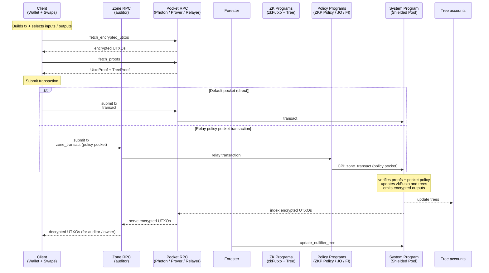
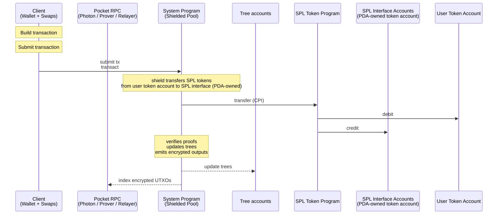
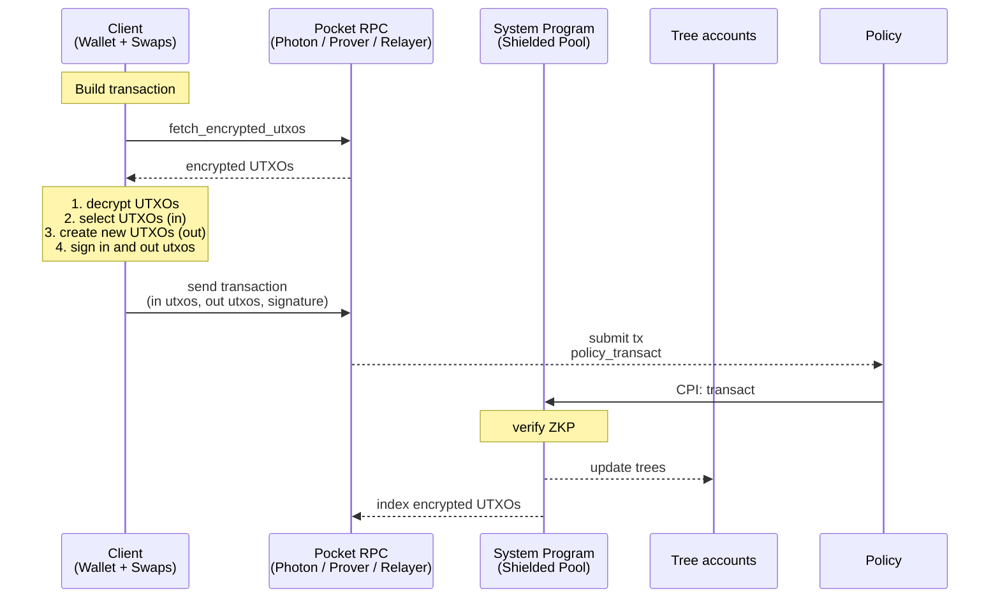
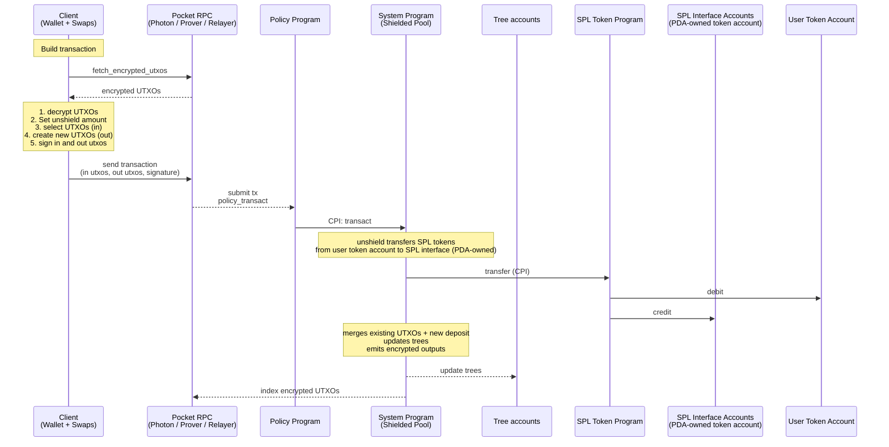
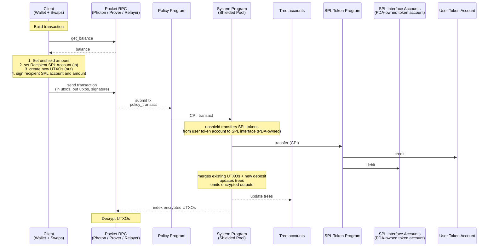

# Spec

A Solana program for shielded transfers. Users retain custody and can disclose
per-transaction viewing keys on request. UTXOs can enter zones; each zone has
auditors, authorities, and a config (freeze authority, co-signer, permanent
delegate).

## Glossary

### Actors

| # | Name | Description |
| --- | --- | --- |
| 1 | User | End-user; owns the Wallet and authorizes transactions |
| 2 | Protocol authority | Signs admin instructions (pause, create_*, rotate config) |
| 3 | Photon Indexer | Indexer for trees and encrypted UTXO records |
| 4 | Prover server | Computes TreeProofs |
| 5 | Relayer | Fee-payer for unshield and transfer; is paid by the user's transaction |
| 6 | Forester | Updates the nullifier tree from the nullifier queue (queue and tree are in the same Solana account) |

### Solana Accounts

| # | Name | Description |
| --- | --- | --- |
| 7 | Nullifier tree | Batched address tree (`light-batched-merkle-tree`, H=40) of spent nullifiers, account includes the nullifier queue |
| 8 | UTXO tree | Append-only Merkle tree (H=26); leaves are UTXO hashes |
| 9 | SPL interface | Per-mint SPL / Token-22 vault holding all shielded SPL tokens |
| 10 | Protocol config | Singleton account; pause authority and protocol-wide settings |

### SPP (Shielded Pool Program) Instructions

| # | Name | Description |
| --- | --- | --- |
| 1 | transact | Tag 0; carries shield/unshield/shielded transfer; verifies proofs, updates trees |
| 2 | proofless_shield | Tag 1; public deposit; hashes UTXO and inserts into UTXO tree |
| 3 | zone_transact | Tag 2; carries shield/unshield/shielded transfer; verifies proofs, updates trees; verifies encrypted UTXOs are properly encrypted to zone auditor + recipients |
| 4 | zone_authority_transact | Tag 3; proves correctness of a state transition by a zone authority (freeze, thaw, transaction with permanent delegate, ...) |
| 5 | create_spl_interface | Tag 6; admin |
| 6 | create_nullifier_tree | Tag 7; admin |
| 7 | create_utxo_tree | Tag 8; admin |
| 8 | create_protocol_config | Tag 9; admin |
| 9 | update_protocol_config | Tag 10; admin |
| 10 | pause_tree | Tag 11; admin can pause and unpause trees |
| 11 | create zone config | Tag 12; creates a new zone config, fields: owner, zone_authority_transact_is_enabled, |
| 12 | update zone config owner |  |
| 13 | update zone config | switch whether zone_authority_transact_is_enabled is enabled or not. If is not enabled and config owner is burned the policy program cannot rug the user. → no permanent delegate. |

### Policy Program Instructions

A policy program is free to implement the following instructions and more.

| # | Name | Description |
| --- | --- | --- |
| 1 | transact | Tag 0;
verify policy proof,
cpi SPP zone_transact |
| 2 | proofless_shield | Tag 1;
public deposit;
  • no encryption
cpi SPP proofless_shield |
| 3 | authority_transact | Tag 3; proves correctness of a state transition by a zone authority (freeze, thaw, transaction with permanent delegate, ...)
Merge utxos on behalf of the user.
Zone authority has full access to all utxos owned by the zone. The access is constrained by the policy program implementation.

cpi SPP zone_authority_transact |
| 4 | create_zone_config | Tag 4; admin: creates account for a zone; the config is public, sets auditor P256 key, zone authority, freeze authority, permanent authority, co-signer |
| 5 | update_zone_config | Tag 5; admin: zone authority updates the zone config |
| 6 |  create_config_account | Create a config PDA storing shared encryption key, recovery keys, and auditor ciphertexts; verifies encryption proof.
Every Solana account can create one config account, enforced by derivation path. This Solana account is the owner of the config.
**Account type:**
  1. Solana account
     (transfers are confidential)
  2. Compressed Account (transfers are anonymous)
 |
| 7 | update_config_account | Only the owner can update the config.
The owner cannot be changed. |
| 8 | migrate_config_account | Migrate a config account's encryption keys with a migration proof up on rotation of the auditor key. |
| 9 | close_config_account |  |
| 10 | toggle config account |  |
| 11 | Clear-Text Withdrawal | Withdraw all funds from a UTXO by computing the UTXO hash in the program. |
| 12 | Create Proposal | Create a proposal buffer PDA containing transfer metadata, recipient, and encrypted ciphertext for deferred execution. |
| 13 | Cancel Proposal | Cancel a proposal. |
| 14 | Execute Proposal | close proposal,
verify policy proof,
cpi SPP zone_transact |

**Notes:**

1. If the recipient does not have a config account the output utxo is encrypted to the recipient.
2. 

### Policy Program Accounts

Accounts can be Solana or compressed accounts.

| # | Name | Description |
| --- | --- | --- |
|  | Zone config | Configures authorities and features of a zone |
|  | User config | Configures a shared encryption key  |

### Protocol

| # | Name | Description |
| --- | --- | --- |
| 24 | Wallet | P256 keypair; signs transactions and decrypts UTXOs |
| 25 | UTXO | Unspent Transaction Output; records how many shielded tokens a keypair owns, one utxo can hold an amount of one SPL token and sol |
| 26 | Encrypted UTXO | Transactions create new UTXOs (outputs); encrypted by the user and stored in the ledger by the transact instruction (shield, unshield, shielded transfer) |
| 27 | Encryption | ECDH + AES-GCM; one ephemeral key per transaction, shared across outputs; in zones the ephemeral key is also encrypted to the Auditor key (#34) |
| 28 | FMD clue | Fuzzy Message Detection tag for efficient encrypted UTXO discovery; prefixed to each encrypted UTXO |
| 29 | UtxoProof | Groth16 proof: proves ownership + balance conservation |
| 30 | TreeProof | Groth16 proof: proves that UTXOs exist in a UTXO tree and nullifiers don't exist yet in a Nullifier tree |
| 31 | Nullifier | Per-UTXO spend marker; inserted at spend time to prevent double-spend |
| 32 | Transaction viewing key | ephemeral_sk + sender/recipient public keys: decrypt all transaction outputs; nullifier keys: enable nullifier derivation to link input UTXOs; discloses a single transaction to a 3rd party |
| 33 | RPC | Server that indexes trees + encrypted UTXOs; generates proofs on demand |
| 34 | Auditor key | P256 keypair held by the Zone RPC; per-transaction ephemeral key is encrypted to it (in addition to sender + recipient); enables decryption of every UTXO |
| 35 | Zone RPC | RPC variant holding the auditor key; decrypts UTXOs, serves them to owners, generates proofs |

### User Operations

| # | Name | Description |
| --- | --- | --- |
| 36 | shield | Transfers SPL/SOL from user to pool, creates UTXO with deposit amount; transact instruction, client signs |
| 37 | unshield | Transfers SPL/SOL from pool to user, spends UTXO with withdraw amount; transact instruction, relayer signs; Privacy: sender hidden (relayer), recipient + amount visible |
| 38 | shielded transfer | Internal shielded transfer: UTXO in, UTXO out; transact instruction, relayer signs; Privacy: fully shielded (sender, recipient, amount) |
| 39 | proofless_shield | Proof-less public deposit (tag 1); emits a UTXO with `blinding = 0` |

### Admin Operations

| # | Name | Description |
| --- | --- | --- |
| 40 | create_spl_interface | Initialize SPL/Token-22 pool escrow per token mint |
| 41 | create_nullifier_tree | Initialize new nullifier address tree |
| 42 | create_utxo_tree | Initialize new UTXO commitment tree |
| 43 | create_protocol_config | Initialize protocol config (pause authority) |
| 44 | update_protocol_config | Rotate protocol config authority |
| 45 | pause_tree | Freeze writes to a UTXO tree |

---

---

## Zone User Flows

### Properties

| # | Name | Description |
| --- | --- | --- |
| 1 | Non-Custodial | Zones are non-custodial. Control remains with user; auditor reads all UTXOs but cannot sign or spend |
| 2 | Extended UTXO schema | Includes state + extension fields (zone address, ...); extensions is any data that is not part of the standard UTXO schema |
| 3 | Enter Zone | A zone can be entered by shield from an SPL token account, the standard shielded pool, or another zone in a shielded transfer |
| 4 | Exit Zone | A zone can be exited by unshield to an SPL token account, the standard shielded pool, or another zone in a shielded transfer |
| 5 | Merge Service |  |

### Notes

1. The zone config is a compressed account so it can be used inside the `zone_transact` UTXO proof without revealing which zone the user is in. As a PDA it would require an extra public account, making the zone visible.
    1. by extending the attestation program and adding a verifyingkey upload we can make a generalized policy program.

## Architecture

#### Design Principles

1. Simplicity
    1. the system program is a basic shielded pool program with minimal functionality.
2. Versatility
    1. utxos can have a program owner
- Architecture whiteboard
    
    
    

### Encryption

Requirements:

1. cipher text must be as small as possible
2. asset should be a u64 ID not a Pubkey
3. ephemeral_pubkey secret derivation KDF(user/shared secret, first nullifier)
4. we should have different encryption schemas:
    1. transfer layout:
        
        
        | Offset | Size | Field | Type | Description |
        | --- | --- | --- | --- | --- |
        | 0 |  | type prefix |  |  |
        |  | X | FMD prefix |  |  |
        | 0 | 33 | ephemeral_pubkey | P256 (SEC1-compressed) | Secret key is deterministically derived from sender. |
        | 33 | 32 | sender.pubkey | `[u8; 32]` |  |
        | 65 | 8 | sender.asset_amount | u64 |  |
        | 73 | 8 | sender.nonce | u64 |  |
        | 81 | 32 | recipient.pubkey | `[u8; 32]` |  |
        | 113 | 8 | recipient.asset_amount | u64 |  |
        | 121 | 31 | recipient.blinding | `[u8; 31]` |  |
        |  | N * 8 | nullifier_data |  |  |
        
        TODO: add nullifier data
        
        Total: **152 bytes**. + 16 bytes gmc tag
        
        1. Blinding Should be derived for the sender we can use a blinding seed (if we have a nonce this is easy to do) 
        2. ephemeral private key should be derived from the sender (if we have a nonce this is easy to do)
    2. not encrypted shield
    3. split utxo

### Transaction Size

**Instruction Data**

What goes on the wire for one `transact` instruction: raw public-input data (so the program can recompute hashes and apply state changes), encrypted output UTXOs, and the Groth16 proof(s).

| Field | Size (bytes) | Notes |
| --- | --- | --- |
| output_commitments | 32 × M | one per output; appended to UTXO tree |
| tx_hash | 32 | BN254 Fr; `ShaTxHash` = SHA-256(BE32(tx_hash))[..31] is derived on-chain |
| seeds_hashchain | 32 | digest folded into PublicInputsHash |
| nullifier_root_index | 1 × N | u8 ref into nullifier-tree root cache |
| expiry_slot | 8 | u64 |
| tree_proof | 128 | Groth16; omit if going with a single combined proof at 192 |
| relayer_fee | 2 | u16; always sent (zero on shield since payer = user) |

**Accounts (AccountMeta list — 32 bytes per address):**

| Account | Notes | Required |
| --- | --- | --- |
| vault_spl_token_account | shielded pool's SPL / Token-22 vault for this mint; the mint read here supplies `public_spl_asset_pubkey` | yes (shield & unshield) |
| nullifier_tree_account | nullifier queue + tree | no (no input utxos) |
| token_program | SPL or Token-22 | yes (shield & unshield) |
| system_program | for SOL transfer in shield / unshield | yes (shield & unshield) |
| utxo_tree_account | append only tree | always |

**Notes:**

1. `public_spl_asset_pubkey`, `ProgramIDHashchain`, and `SolanaPubkeyHash` are *not* in the instruction data — the program derives them from the vault token account's mint, the CPI call stack, and the `payer` account respectively.
2. The P-256 signature is verified in-circuit and stays in the witness; the user's pubkey is bound via the keypair-owner hash and never appears on the wire.

**Total transaction size — Shielded Transfer** (N=3, M=3):

| Section | Size (bytes) | Notes |
| --- | --- | --- |
| Signature | 64 | 1 signer (relayer for unshield / transfer, user for shield) |
| Message header | 3 | num_signers / readonly_signed / readonly |
| ALT reference | 38 | 1 ALT pubkey (32) + 2 writable indices (utxo_tree, nullifier_tree) + 2 readonly indices (token_program, system_program) + compact-u16 counts |
| Recent blockhash | 32 |  |
| Instruction overhead | ~13 | program_id_index + account_indices + data_len_varint |
| Instruction data ((un)shield) | 301 | output_commitments (96) + tx_hash (32) + seeds_hashchain (32) + nullifier_root_index (3) + expiry_slot (8) + tree_proof (128) + relayer_fee |
| Instruction data (shielded transfer) |  |  |
| Encrypted UTXOs | 152 | one combined ciphertext for all 3 outputs (transfer schema) |
| **Total (with ALT)** | **≈ 731** | within Solana's 1232-byte tx limit |
| **Total (without ALT)** | **≈ 821** |  |

**Total transaction size — Shield / Unshield** (N=3, M=3):

| Section | Size (bytes) | Notes |
| --- | --- | --- |
| Signature | 64 | relayer for unshield; user for shield |
| Message header | 3 | num_signers / readonly_signed / readonly |
| Account addresses (per-tx) | 128 | 4 × 32 — payer, vault_spl_token_account, recipient_spl_token_account, user_spl_token_account |
| ALT reference | 38 | 1 ALT pubkey + 2 writable + 2 readonly indices + compact-u16 counts |
| Recent blockhash | 32 |  |
| Instruction overhead | ~13 | program_id_index + account_indices + data_len_varint |
| Instruction data | 317 | common (301) + public_sol_amount (8) + public_spl_amount (8) |
| Encrypted UTXOs | 152 | combined ciphertext for all 3 outputs |
| **Total (with ALT)** | **≈ 747** |  |
| **Total (without ALT)** | **≈ 837** |  |

**Utxo Hash**

| # | Name | Description |
| --- | --- | --- |
| 1 | domain |  |
| 2 | owner | Owner pubkey (25519 EDDSA, P256, Poseidon EDDSA) |
| 3 | asset_id |  |
| 4 | spl_amt |  |
| 5 | blinding |  |
| 6 | data_hash | Application data hash unconstrained in system program circuit. |
| 7 | policy_data | Policy data hash unconstrained in system program circuit. |
| 8 | policy_program_id |  |

**Nullifier Hash**

**Options:**

1. H(utxo_hash, blinding)
    1. pro: no additional data necessary to convey information 
    2. con: 
2. H(utxo_hash, dns)
    1. dns = Poseidon2(utxo_hash, nullifier_secret)
    2. nullifier_secret = KDF(”nullifier”, P256_privkey)

### Concurrency

1. A balance can be used concurrently when it is split up between a number of utxos.
2. To keep the balance spendable in one transaction we split it in up to X utxos

### **Circuit**

**Utxo Ownership:**

1. Solana EDDSA - solana program checks 
Required for squads multisig.
2. In circuit signature verification P256 or Poseidon EDDSA

**Transaction Hash: Poseidon**(Input utxo hash chain, output utxo hash chain, external data hash, expiry slot)

**HashChain**(HashChain,  additional hash)

**25519 EDDSA Pubkey encoding:** Poseidon(pubkey_low, pubkey_high)

**P256 Pubkey encoding:** Poseidon(pubkey_low, pubkey_high)

**Circuit Combinations**

1. 3 in 3 out as STD
    1. 1 sol in and out utxo to pay for fees
    2. 2 sender in utxos
    3. 1 recipient
    4. 1 change utxo
2. 5 in 3 out
You get more concurrency
    1. 1 sol in and out utxo to pay for fees
    2. 4 sender in utxos
    3. 1 recipient
    4. 1 change utxo
3. 1 in 8 out
    1. split 1 utxo into up to 8 equal parts
    2. 
    3. the convention of equal parts reduces the data we need to encrypt drastically

## User Flows

1. default pocket
    1. shield
    2. transfer
    3. unshield 
2. policy pocket
    1. shield
    2. enter from default pocket
    3. exit to default pocket
    4. unshield
3. private defi interaction
    1. policy pocket
    2. default pocket
4. forester
5. RPC
6. Pocket RPC
7. Wallet

### Default Pocket

#### Shield with Proof

#### Shield without Proof

#### Transfer

#### Unshield

### Policy Pocket

#### **Enter and exit Pocket**

1. Enter, shield or transfer from default pocket
2. Exit, unshield or transfer from policy pocket 

#### Shield with Proof

#### Shield without Proof

#### Transfer

#### Unshield

#### RPC

The rpc or zone rpc have two purposes providing balance information and sending transactions.

**Methods:**

1. get_encrypted_utxos
2. get_proof
3. send_transaction
    
    Modes:
    
    1. server built proof inputs
        1. msg_hash(recipient + amount)
        The user does not care which utxos are used.
        Self-custody is guaranteed by the zkp.
    2. client built proof inputs
        1. msg_hash(TX_HASH)
        TX_HASH includes all in and out utxos public amounts etc
        The user sets all proof parameters and which UTXOs are used.

#### **Pocket Rpc:**

**Methods:**

1. get_encrypted_utxos (same as RPC)
2. get_proof (same as RPC)
3. get_decrypted_utxos
4. get_balance
5. get_instruction (for shield the user must sign directly)
6. send_transaction (same as RPC)

#### **Decryption Service:**

**Idea:** An opt-in service that can be independent from an RPC that can index and decrypt a users UTXOs.

1. User decryption service handshake, similar to TLS, to establish a shared asymmetric secret

#### **Merge Service:**

The shielded pool program has merge service registry accounts. Users can whitelist one or more merge service accounts (opt-in).

**Enable merge service,** a user creates a nullifier H(user_pubkey, merge_service_pda) in a dedicated merge service tree.

**Merge UTXOs,** a merge service proves that a nullifier exists and that the user utxos are merged and encrypted correctly.

**Disable merge service**, user removes nullifier from merge service tree.

**Caveats:**

1. The merge service needs to be able to decrypt user UTXOs.

**Questions:**

1. How is merge service paid?
(You don’t want to pay based on tx that creates weird incentives.)

### Notes

1. policy pockets can only be entered and exited from and to the default pocket
2. every pocket that is deployed creates a new program (This does not have to be true we can also deploy a standard zone program that has a set of extensions)
3. Should spl token funds be in separate pools?
    - Tradeoffs
        1. creates friction
        2. creates implementation overhead for the 
        3. makes entering and exiting a zone confidential
        4. we could add this as an option
4. Should spl tokens be owned by the policy programs?
    1. Pro: a bug in the shielded pool could not drain the funds owned by a policy program if the policy somehow protects against the exploit eg with a co-signer who doesn’t approve the attackers transactions. 
    2. Con: entering the pocket reveals the amount and asset
    3. Con: implementation complexity of moving spl tokens
    4. This would separate tokens of utxos subject to a policy completely from the shielded pool.
    5. no support in the shielded pool program is necessary we just force users to unshield to deposit.
5. Should we support multiple signature schemes?
    1. yes, P256, solana keypair as circuit external signer
6. **We need to expose nullifier data with the encrypted utxos so that the RPC knows which utxos were spent based on decrypted outputs**
7. 

## Questions:

1. can the zone authority signature and zone the utxo is in be public?
2. what are critical user flows?
    1. unsolicited transfer
3. Should we use P256 or Poseidon EDDSA as proof of utxo ownership?
    1. tradeoffs:
        1. Proving time: 350ms (m4max) vs 15ms (m4max), 5s (solana seeker) vs 350ms (solana seeker), 1s (TEE aws nitro)
        2. pro (P256):  can be used for both encryption (ECDF) and signature, Passkey signature (wallets already support it)
        3. con (P256): proving time (requires server proofs)
        4. pro (Poseidon eddsa): low proving time
        5. con (Poseidon EDDSA): low ecosystem support
4. Does splitting into two proofs make sense?
    1. pro: we can split proof generation and preserve privacy utxo proof and tree proof
    2. pro: even if we generate both proofs in the server we can parallelize proof generation
    3. con: additional instruction data 128 bytes and 100k CU
5. Tree heights
    1. nullifier tree 40
    2. state tree 40 (we need benchmarks)
6. Own ledger
    1. deposit limits, withdraw limits, 
7. rfq
    1. completely off-chain
    2. just two signatures
8. TODO:
    1. define utxo data structure
    2. encryption of outputs (actual 
    3. shielded escrow (PSP) diagram akin to the 
    4. mapping
    5. **Docs**
        1. you are institution how can you use it
        2. how you can use it
        3. tradeoffs
        4. here is how you can integrate

### TLDR on Design

1. config accounts (live in your own config program)
2. sync and async execution flows
3. protocol config pda - co-signer etc
4. privacy program that has the core logic.
5. 2 proofs instead of 1
6. entering the protocol privately or publicly

**Benefits of this design:**

1. part of the protocol anonymity set
2. interoperable with protocol ecosystem wallets, private swaps etc.
3. we will do more of the backend work if you like
4. you can increase privacy guarantees with a program update if you like.

### Differences to existing squads design

**Concurrency:**

Utxos are inherently concurrent. You have the opposite problem from accounts. The backend will merge utxos based on the account config.

1. async 

**Privacy:**

1. confidentiality with config account pdas
2. anonymity with config accounts stored in Merkle tree

**Timeline**

1. 2 weeks until we can have a working prototype based on the previous level.
2. Crypto internal review, 
3. Total completion 2 Months

**Questions:**

1. Whats your timeline?

**Commercial:**

1. we will need to redo the contract with Helius <> Squads, same terms,
