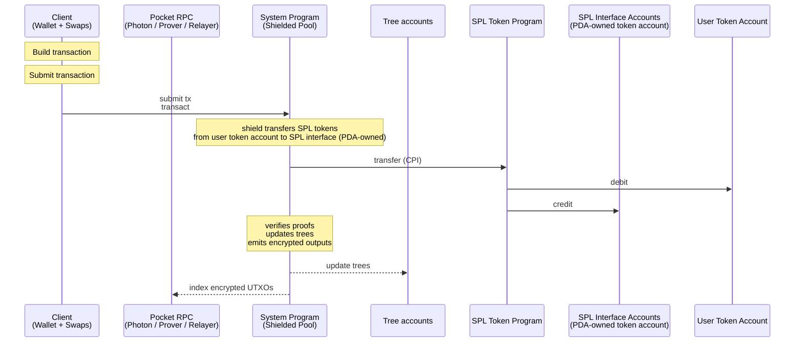
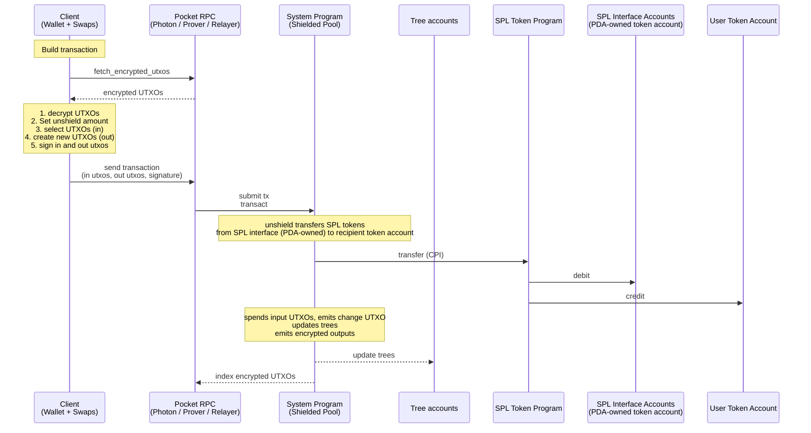
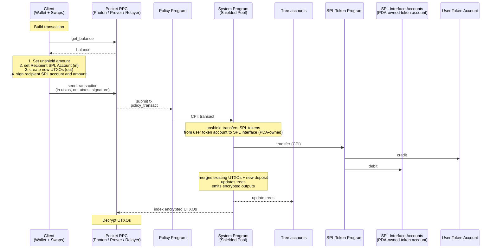

# Spec

A Solana program for shielded transfers. Users retain custody and can disclose
per-transaction viewing keys on request. UTXOs can enter pockets; each pocket has
auditors, authorities, and a config (freeze authority, co-signer, permanent
delegate).

## Glossary

### Actors

| # | Name | Description |
| --- | --- | --- |
| 1 | User | End-user; owns the Wallet and authorizes transactions |
| 2 | Protocol authority | Signs admin instructions (pause, create_*, rotate config) |
| 3 | Photon Indexer | Indexer for trees and encrypted UTXO records |
| 4 | Prover server | Computes TreeProofs |
| 5 | Relayer | Fee-payer for unshield and transfer; is paid by the user's transaction |
| 6 | Forester | Updates the nullifier tree from the nullifier queue (queue and tree are in the same Solana account) |

### Solana Accounts

| # | Name | Description |
| --- | --- | --- |
| 1 | Nullifier tree | Batched address tree (`light-batched-merkle-tree`, H=40) of spent nullifiers; includes the nullifier queue. Stored in the Tree account together with the UTXO tree. |
| 2 | UTXO tree | Append-only Merkle tree (H=26); leaves are UTXO hashes. Stored in the Tree account together with the nullifier tree. |
| 3 | SPL interface | Per-mint SPL / Token-22 vault holding all shielded SPL tokens |
| 4 | Protocol config | Singleton account; pause authority and protocol-wide settings |

The nullifier tree and UTXO tree are two logical structures co-located in a single Solana account ("Tree account"). All references to "nullifier tree" and "UTXO tree" below refer to logical trees inside this shared account.

### SPP (Shielded Pool Program) Instructions

Instruction tags are namespaced per program. SPP tags below are distinct from Policy Program tags in the next section.

| # | Name | Description |
| --- | --- | --- |
| 1 | transact | Tag 0; carries shield/unshield/shielded transfer; verifies proofs, updates trees |
| 2 | proofless_shield | Tag 1; public deposit; hashes UTXO and inserts into UTXO tree |
| 3 | pocket_transact | Tag 2; carries shield/unshield/shielded transfer; verifies proofs, updates trees; verifies encrypted UTXOs are properly encrypted to pocket auditor + recipients |
| 4 | pocket_authority_transact | Tag 3; proves correctness of a state transition by a pocket authority (freeze, thaw, transaction with permanent delegate, ...) |
| 5 | create_spl_interface | Tag 6; admin |
| 6 | create_tree | Tag 7; admin; initializes the shared Tree account (nullifier tree + queue, UTXO tree) |
| 7 | create_protocol_config | Tag 9; admin |
| 8 | update_protocol_config | Tag 10; admin |
| 9 | pause_tree | Tag 11; admin can pause and unpause trees |
| 10 | create_pocket_config | Tag 12; creates a new pocket config; fields: owner, pocket_authority_transact_is_enabled |
| 11 | update_pocket_config_owner | Tag 13; transfers ownership of a pocket config; only callable by current owner. TBD: spec out semantics. |
| 12 | update_pocket_config | Tag 14; toggles whether pocket_authority_transact_is_enabled is enabled. If disabled and the config owner is burned, the policy program cannot rug the user (no permanent delegate). |

### Policy Program Instructions

A policy program is free to implement the following instructions and more. Tags are local to each policy program and do not collide with SPP tags.

| # | Name | Description |
| --- | --- | --- |
| 1 | transact | Tag 0;
verify policy proof,
cpi SPP pocket_transact |
| 2 | proofless_shield | Tag 1;
public deposit;
  • no encryption
cpi SPP proofless_shield |
| 3 | authority_transact | Tag 3; proves correctness of a state transition by a pocket authority (freeze, thaw, transaction with permanent delegate, ...)
Merge utxos on behalf of the user.
Pocket authority has full access to all utxos owned by the pocket. The access is constrained by the policy program implementation.

cpi SPP pocket_authority_transact |
| 4 | create_pocket_config | Tag 4; admin: creates account for a pocket; the config is public, sets auditor P256 key, pocket authority, freeze authority, permanent authority, co-signer |
| 5 | update_pocket_config | Tag 5; admin: pocket authority updates the pocket config |

**Notes:**

1. If the recipient does not have a config account the output utxo is encrypted to the recipient.

### Policy Program Accounts

Accounts can be Solana or compressed accounts.

| # | Name | Description |
| --- | --- | --- |
| 1 | Pocket config | Configures authorities and features of a pocket |
| 2 | User config | Configures a shared encryption key |

### Protocol

| # | Name | Description |
| --- | --- | --- |
| 1 | Wallet | P256 keypair; signs transactions and decrypts UTXOs |
| 2 | UTXO | Unspent Transaction Output; records how many shielded tokens a keypair owns; one UTXO can hold an amount of one SPL token and SOL |
| 3 | Encrypted UTXO | Transactions create new UTXOs (outputs); encrypted by the user and stored in the ledger by the transact instruction (shield, unshield, shielded transfer) |
| 4 | Encryption | ECDH + AES-GCM; one ephemeral key per transaction, shared across outputs; in pockets the ephemeral key is also encrypted to the Auditor key |
| 5 | FMD clue | Fuzzy Message Detection tag for efficient encrypted UTXO discovery; prefixed to each encrypted UTXO |
| 6 | UtxoProof | Groth16 proof: proves ownership + balance conservation |
| 7 | TreeProof | Groth16 proof: proves that UTXOs exist in a UTXO tree and nullifiers don't exist yet in a Nullifier tree |
| 8 | Nullifier | Per-UTXO spend marker; inserted at spend time to prevent double-spend |
| 9 | Transaction viewing key | ephemeral_sk + sender/recipient public keys: decrypt all transaction outputs; nullifier keys: enable nullifier derivation to link input UTXOs; discloses a single transaction to a 3rd party |
| 10 | RPC | Server that indexes trees + encrypted UTXOs; generates proofs on demand |
| 11 | Auditor key | P256 keypair held by the Auditor RPC; per-transaction ephemeral key is encrypted to it (in addition to sender + recipient); enables decryption of every UTXO |
| 12 | Auditor RPC | RPC variant holding the auditor key; decrypts UTXOs, serves them to owners, generates proofs |

### User Operations

| # | Name | Description |
| --- | --- | --- |
| 1 | shield | Transfers SPL/SOL from user to pool, creates UTXO with deposit amount; transact instruction, client signs |
| 2 | unshield | Transfers SPL/SOL from pool to user, spends UTXO with withdraw amount; transact instruction, relayer signs; Privacy: sender hidden (relayer), recipient + amount visible |
| 3 | shielded transfer | Internal shielded transfer: UTXO in, UTXO out; transact instruction, relayer signs; Privacy: fully shielded (sender, recipient, amount) |
| 4 | proofless_shield | Proof-less public deposit (tag 1); emits a UTXO with `blinding = 0` |

### Admin Operations

| # | Name | Description |
| --- | --- | --- |
| 1 | create_spl_interface | Initialize SPL/Token-22 pool escrow per token mint |
| 2 | create_tree | Initialize new Tree account (nullifier tree + queue and UTXO tree, co-located) |
| 3 | create_protocol_config | Initialize protocol config (pause authority) |
| 4 | update_protocol_config | Rotate protocol config authority |
| 5 | pause_tree | Freeze writes to a Tree account |

---

---

## Pocket User Flows

### Properties

| # | Name | Description |
| --- | --- | --- |
| 1 | Non-Custodial | Pockets are non-custodial. Control remains with user; auditor reads all UTXOs but cannot sign or spend |
| 2 | Extended UTXO schema | Includes state + extension fields (pocket address, ...); extensions is any data that is not part of the standard UTXO schema |
| 3 | Enter Pocket | A pocket can be entered by shield from an SPL token account, the standard shielded pool, or another pocket in a shielded transfer |
| 4 | Exit Pocket | A pocket can be exited by unshield to an SPL token account, the standard shielded pool, or another pocket in a shielded transfer |
| 5 | Merge Service | Opt-in backend service that merges a user's UTXOs into fewer larger UTXOs (see Merge Service section below). |

### Notes

1. The pocket config is a compressed account so it can be used inside the `pocket_transact` UTXO proof without revealing which pocket the user is in. As a PDA it would require an extra public account, making the pocket visible.
    1. by extending the attestation program and adding a verifyingkey upload we can make a generalized policy program.

## Architecture

#### Design Principles

1. Simplicity
    1. the system program is a basic shielded pool program with minimal functionality.
2. Versatility
    1. utxos can have a program owner

Source: [`diagrams/architecture.dot`](diagrams/architecture.dot). Regenerate with `just render-diagrams`.

The Client interacts with the RPC tier (Pocket RPC for default pockets, Auditor RPC for policy pockets); the RPC tier submits transactions on-chain — default-pocket flow targets SPP directly, policy-pocket flow targets a Policy program which CPIs into SPP. SPP reads/writes the Tree account and moves SPL through the vault. The Forester drains the nullifier queue inside the Tree account. Per-flow sequence diagrams are in the User Flows section below.

### Encryption

Requirements:

1. cipher text must be as small as possible
2. asset should be a u64 ID not a Pubkey
3. ephemeral_pubkey secret derivation KDF(user/shared secret, first nullifier)
4. we should have different encryption schemas:
    1. transfer layout:

        Envelope (cleartext, prefixed to the AES-GCM ciphertext):

        | Offset | Size | Field | Type | Description |
        | --- | --- | --- | --- | --- |
        | 0 | 1 | type_prefix | u8 | discriminator (transfer / shield / split / ...) |
        | 1 | X | fmd_prefix | bytes | Fuzzy Message Detection clue; size TBD |

        Encrypted payload (AES-GCM plaintext; offsets relative to start of plaintext):

        | Offset | Size | Field | Type | Description |
        | --- | --- | --- | --- | --- |
        | 0 | 33 | ephemeral_pubkey | P256 (SEC1-compressed) | Secret key is deterministically derived from sender. |
        | 33 | 32 | sender.pubkey | `[u8; 32]` |  |
        | 65 | 8 | sender.asset_amount | u64 |  |
        | 73 | 8 | sender.nonce | u64 |  |
        | 81 | 32 | recipient.pubkey | `[u8; 32]` |  |
        | 113 | 8 | recipient.asset_amount | u64 |  |
        | 121 | 31 | recipient.blinding | `[u8; 31]` |  |
        | 152 | N × 8 | nullifier_data | bytes | per-input nullifier hint; size TBD |

        Encrypted payload total: **152 bytes** + N × 8 (nullifier_data) + 16-byte GCM tag.
        
        1. Blinding Should be derived for the sender we can use a blinding seed (if we have a nonce this is easy to do) 
        2. ephemeral private key should be derived from the sender (if we have a nonce this is easy to do)
    2. not encrypted shield
    3. split utxo

### Transaction Size

**Instruction Data**

What goes on the wire for one `transact` instruction: raw public-input data (so the program can recompute hashes and apply state changes), encrypted output UTXOs, and the Groth16 proof(s).

| Field | Size (bytes) | Notes |
| --- | --- | --- |
| output_commitments | 32 × M | one per output; appended to UTXO tree |
| tx_hash | 32 | BN254 Fr; `ShaTxHash` = SHA-256(BE32(tx_hash))[..31] is derived on-chain |
| seeds_hashchain | 32 | digest folded into PublicInputsHash |
| nullifier_root_index | 1 × N | u8 ref into nullifier-tree root cache |
| expiry_slot | 8 | u64 |
| utxo_proof | 128 | Groth16; proves ownership + balance conservation |
| tree_proof | 128 | Groth16; proves UTXO inclusion + nullifier non-inclusion. Replace both proofs with a single combined proof at 192 bytes to save 64 bytes. |
| relayer_fee | 2 | u16; always sent (zero on shield since payer = user) |

With N = M = 3 the common instruction-data total is 96 + 32 + 32 + 3 + 8 + 128 + 128 + 2 = **429 bytes** (split-proof mode).

**Accounts (AccountMeta list — 32 bytes per address):**

| Account | Notes | Required |
| --- | --- | --- |
| vault_spl_token_account | shielded pool's SPL / Token-22 vault for this mint; the mint read here supplies `public_spl_asset_pubkey` | yes (shield & unshield) |
| tree_account | shared account holding the nullifier queue + nullifier tree and the UTXO tree | always |
| token_program | SPL or Token-22 | yes (shield & unshield) |
| system_program | for SOL transfer in shield / unshield | yes (shield & unshield) |

**Notes:**

1. `public_spl_asset_pubkey`, `ProgramIDHashchain`, and `SolanaPubkeyHash` are *not* in the instruction data — the program derives them from the vault token account's mint, the CPI call stack, and the `payer` account respectively.
2. The P-256 signature is verified in-circuit and stays in the witness; the user's pubkey is bound via the keypair-owner hash and never appears on the wire.

**Total transaction size — Shielded Transfer** (N=3, M=3):

| Section | Size (bytes) | Notes |
| --- | --- | --- |
| Signature | 64 | 1 signer (relayer) |
| Message header | 3 | num_signers / readonly_signed / readonly |
| ALT reference | 37 | 1 ALT pubkey (32) + 1 writable index (tree) + 2 readonly indices (token_program, system_program) + compact-u16 counts |
| Recent blockhash | 32 |  |
| Instruction overhead | ~13 | program_id_index + account_indices + data_len_varint |
| Instruction data | 429 | common: output_commitments (96) + tx_hash (32) + seeds_hashchain (32) + nullifier_root_index (3) + expiry_slot (8) + utxo_proof (128) + tree_proof (128) + relayer_fee (2) |
| Encrypted UTXOs | 152 | one combined ciphertext for all 3 outputs (transfer schema) |
| **Total (with ALT)** | **≈ 730** | within Solana's 1232-byte tx limit |
| **Total (without ALT)** | **≈ 789** | +59 bytes: 3 inline 32-byte addresses (96) replace the 37-byte ALT reference |

**Total transaction size — Shield / Unshield** (N=3, M=3):

| Section | Size (bytes) | Notes |
| --- | --- | --- |
| Signature | 64 | relayer for unshield; user for shield |
| Message header | 3 | num_signers / readonly_signed / readonly |
| Account addresses (per-tx) | 128 | 4 × 32 — payer, vault_spl_token_account, recipient_spl_token_account, user_spl_token_account |
| ALT reference | 37 | 1 ALT pubkey + 1 writable index (tree) + 2 readonly indices + compact-u16 counts |
| Recent blockhash | 32 |  |
| Instruction overhead | ~13 | program_id_index + account_indices + data_len_varint |
| Instruction data | 445 | common (429) + public_sol_amount (8) + public_spl_amount (8) |
| Encrypted UTXOs | 152 | combined ciphertext for all 3 outputs |
| **Total (with ALT)** | **≈ 874** | within Solana's 1232-byte tx limit |
| **Total (without ALT)** | **≈ 933** | +59 bytes: 3 inline 32-byte addresses (96) replace the 37-byte ALT reference |

**Utxo Hash**

| # | Name | Description |
| --- | --- | --- |
| 1 | domain |  |
| 2 | owner | Owner pubkey (25519 EDDSA, P256, Poseidon EDDSA) |
| 3 | asset_id |  |
| 4 | spl_amt |  |
| 5 | blinding |  |
| 6 | data_hash | Application data hash unconstrained in system program circuit. |
| 7 | policy_data | Policy data hash unconstrained in system program circuit. |
| 8 | policy_program_id |  |

**Nullifier Hash**

**Options:**

1. H(utxo_hash, blinding)
    1. pro: no additional data necessary to convey information 
    2. con: 
2. H(utxo_hash, dns)
    1. dns = Poseidon2(utxo_hash, nullifier_secret)
    2. nullifier_secret = KDF(”nullifier”, P256_privkey)

### Concurrency

1. A balance can be used concurrently when it is split up between a number of utxos.
2. To keep the balance spendable in one transaction we split it in up to X utxos

### **Circuit**

**Utxo Ownership:**

1. Solana EDDSA - solana program checks 
Required for squads multisig.
2. In circuit signature verification P256 or Poseidon EDDSA

**Transaction Hash: Poseidon**(Input utxo hash chain, output utxo hash chain, external data hash, expiry slot)

**HashChain**(HashChain,  additional hash)

**25519 EDDSA Pubkey encoding:** Poseidon(pubkey_low, pubkey_high)

**P256 Pubkey encoding:** Poseidon(pubkey_low, pubkey_high)

**Circuit Combinations**

1. 3 in 3 out as STD
    1. 1 sol in and out utxo to pay for fees
    2. 2 sender in utxos
    3. 1 recipient
    4. 1 change utxo
2. 5 in 3 out
You get more concurrency
    1. 1 sol in and out utxo to pay for fees
    2. 4 sender in utxos
    3. 1 recipient
    4. 1 change utxo
3. 1 in 8 out
    1. split 1 utxo into up to 8 equal parts
    2. 
    3. the convention of equal parts reduces the data we need to encrypt drastically

## User Flows

1. default pocket
    1. shield
    2. transfer
    3. unshield 
2. policy pocket
    1. shield
    2. enter from default pocket
    3. exit to default pocket
    4. unshield
3. private defi interaction
    1. policy pocket
    2. default pocket
4. forester
5. RPC
6. Pocket RPC
7. Wallet

### Default Pocket

#### Shield with Proof

#### Shield without Proof

#### Transfer

#### Unshield

### Policy Pocket

#### **Enter and exit Pocket**

1. Enter, shield or transfer from default pocket
2. Exit, unshield or transfer from policy pocket 

#### Shield with Proof

#### Shield without Proof

#### Transfer

#### Unshield

#### RPC

The rpc or pocket rpc have two purposes providing balance information and sending transactions.

**Methods:**

1. get_encrypted_utxos
2. get_proof
3. send_transaction
    
    Modes:
    
    1. server built proof inputs
        1. msg_hash(recipient + amount)
        The user does not care which utxos are used.
        Self-custody is guaranteed by the zkp.
    2. client built proof inputs
        1. msg_hash(TX_HASH)
        TX_HASH includes all in and out utxos public amounts etc
        The user sets all proof parameters and which UTXOs are used.

#### **Pocket Rpc:**

**Methods:**

1. get_encrypted_utxos (same as RPC)
2. get_proof (same as RPC)
3. get_decrypted_utxos
4. get_balance
5. get_instruction (for shield the user must sign directly)
6. send_transaction (same as RPC)

#### **Decryption Service:**

**Idea:** An opt-in service that can be independent from an RPC that can index and decrypt a users UTXOs.

1. User decryption service handshake, similar to TLS, to establish a shared asymmetric secret

#### **Merge Service:**

The shielded pool program has merge service registry accounts. Users can whitelist one or more merge service accounts (opt-in).

**Enable merge service,** a user creates a nullifier H(user_pubkey, merge_service_pda) in a dedicated merge service tree.

**Merge UTXOs,** a merge service proves that a nullifier exists and that the user utxos are merged and encrypted correctly.

**Disable merge service**, user removes nullifier from merge service tree.

**Caveats:**

1. The merge service needs to be able to decrypt user UTXOs.

**Questions:**

1. How is merge service paid?
(You don’t want to pay based on tx that creates weird incentives.)

### Notes

1. policy pockets can only be entered and exited from and to the default pocket
2. by default every pocket that is deployed creates a new program, later we can deploy a standard pocket program that has a set of extensions.
3. **We need to expose nullifier data with the encrypted utxos so that the RPC knows which utxos were spent based on decrypted outputs**
4.

### Requirements
1. P256 signature verification in circuit
2. eddsa signature verified by the shielded pool solana program (account info is signer) that is  
2. protocol program structure: many policy programs that are not security relevant beyond the pocket they enforce the policy for, one minimal shielded pool program
3. Shielded pool program is utxo serialiyzation agnostic, we will implement different schemas
4. spl tokens that back utxo balances live in spl interface token accounts owned by the shielded pool program 
5.
