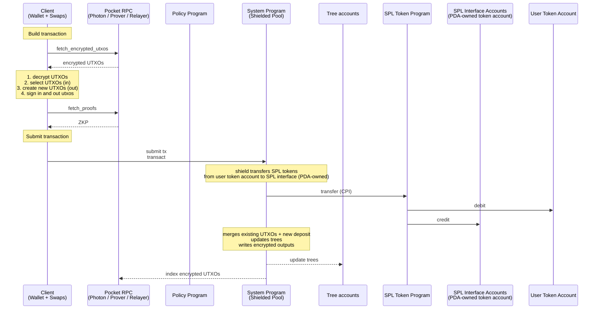
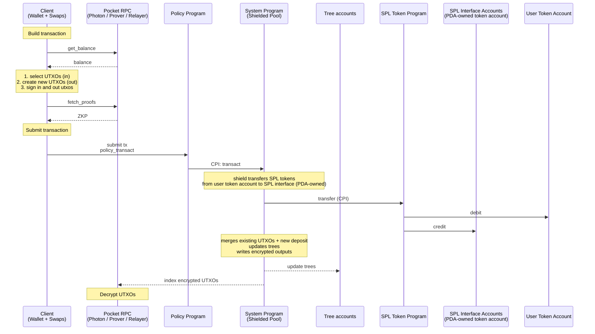
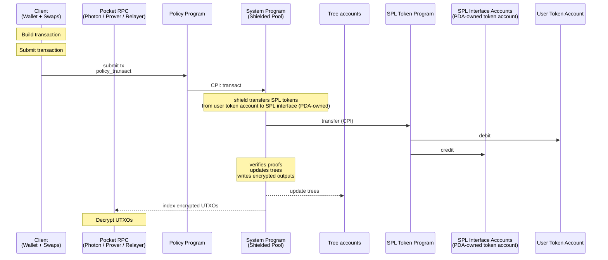
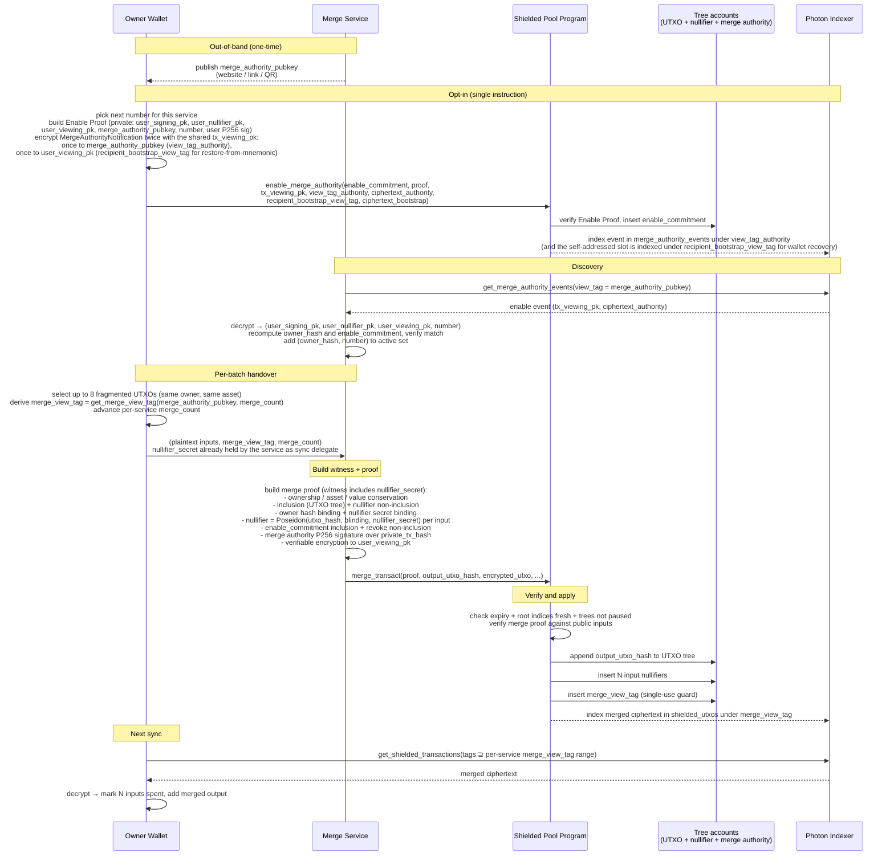

# Spec

## Table of Contents

- [Abstract](#abstract)
- [Architecture](#architecture)
  - [Operations](#operations)
    - [User](#user)
    - [Protocol](#protocol)
    - [Pocket Creator](#pocket-creator)
    - [Merge Service](#merge-service)
  - [Concurrency & Balance Fragmentation](#concurrency--balance-fragmentation)
  - [Default Pocket](#default-pocket)
    - [Shield with Proof](#shield-with-proof)
    - [Shield without Proof](#shield-without-proof)
    - [Transfer](#transfer)
    - [Unshield](#unshield)
  - [Policy Pockets](#policy-pockets)
    - [Shield with Proof](#shield-with-proof-1)
    - [Shield without Proof](#shield-without-proof-1)
    - [Transfer](#transfer-1)
    - [Unshield](#unshield-1)
    - [Enter and Exit Pocket](#enter-and-exit-pocket)
- [Shielded Address](#shielded-address)
- [Signing Key](#signing-key)
- [Nullifier Key](#nullifier-key)
- [ViewingKey](#viewingkey)
  - [Derived secrets](#derived-secrets)
  - [Transaction Viewing Key](#transaction-viewing-key)
  - [View Tags](#view-tags)
    - [Sender View Tag](#sender-view-tag)
    - [Recipient view tag](#recipient-view-tag)
    - [Merge view tag](#merge-view-tag)
  - [Methods](#methods)
- [UTXO](#utxo)
  - [UTXO Hash](#utxo-hash)
  - [Nullifier](#nullifier)
- [SPP Proof - Shielded Pool ZK Proof](#spp-proof---shielded-pool-zk-proof)
- [Merge Proof - Merge ZK Proof](#merge-proof---merge-zk-proof)
- [Enable Proof - Merge Authority Opt-in Proof](#enable-proof---merge-authority-opt-in-proof)
- [Revoke Proof - Merge Authority Opt-out Proof](#revoke-proof---merge-authority-opt-out-proof)
- [Output UTXO Serialization](#output-utxo-serialization)
  - [Program Data](#program-data)
  - [Transfer](#transfer-2)
    - [Plaintext Layout](#plaintext-layout)
    - [Instruction Data Layout](#instruction-data-layout)
  - [UTXO Split](#utxo-split)
    - [Plaintext Layout](#plaintext-layout-1)
    - [Instruction Data Layout](#instruction-data-layout-1)
  - [Merge](#merge)
    - [Plaintext Layout](#plaintext-layout-2)
    - [Instruction Data Layout](#instruction-data-layout-2)
- [SPP - Shielded Pool Program](#spp---shielded-pool-program)
  - [Accounts](#accounts)
    - [Pocket Accounts](#pocket-accounts)
  - [Instructions](#instructions)
    - [transact](#transact)
    - [merge_transact](#merge_transact)
    - [merge_pocket](#merge_pocket)
    - [enable_merge_authority](#enable_merge_authority)
    - [disable_merge_authority](#disable_merge_authority)
- [Policy Program Interface](#policy-program-interface)
- [RPC](#rpc)
  - [Indexer](#indexer)
    - [get_encrypted_utxos_by_tags](#get_encrypted_utxos_by_tags)
    - [get_shielded_transactions_by_tags](#get_shielded_transactions_by_tags)
    - [get_merge_authority_events](#get_merge_authority_events)
    - [subscribe_to_shielded_transactions_by_tags](#subscribe_to_shielded_transactions_by_tags)
    - [get_merkle_proofs](#get_merkle_proofs)
    - [get_non_inclusion_proofs](#get_non_inclusion_proofs)
  - [Pocket RPC](#pocket-rpc)
  - [Merge Service](#merge-service-1)
  - [Registry](#registry)
    - [Record](#record)
    - [Operations](#operations-1)
      - [`get_record`](#get_record)
      - [`register`](#register)
      - [`set_delegate`](#set_delegate)
      - [`rotate_delegate_key`](#rotate_delegate_key)
      - [`revoke`](#revoke)
      - [`close`](#close)
  - [Sync Delegate](#sync-delegate)
- [User Flows](#user-flows)
  - [First Time Sync Wallet](#first-time-sync-wallet)
  - [Merge Flow](#merge-flow)
  - [Transfer User Flows](#transfer-user-flows)
    - [Privacy Guarantee Matrix](#privacy-guarantee-matrix)

## Abstract

A Solana program for shielded transfers. Users retain custody and can disclose
per-transaction viewing keys on request. UTXOs can enter pockets; each pocket has
auditors, authorities, and a config (freeze authority, co-signer, permanent
delegate). Third party zk programs can own, escrow, write state into UTXOs, and execute custom private state transitions in combination with shielded token transfers. Efficient sync of encrypted state with view tags.
Optional features: configurable merge authority that keeps the users balance spendable without user wallet signatures, optional sync delegate to enable light weight integration into wallets. 

# Architecture


Source: [`diagrams/architecture.dot`](diagrams/architecture.dot). Regenerate with `just render-diagrams`.

1. Users — own wallets, build encrypted transactions, sign with P256.
2. Photon Indexer — indexes trees + encrypted UTXOs; default-pocket users fetch ciphertexts here.
3. Pocket RPC (with auditor) — RPC with auditor keys; decrypts and serves UTXOs to policy-pocket users.
4. Prover — generates Groth16 proofs. Users can generate client side proofs as well.
5. Relayer — fee-payer; submits transactions to SPP (default pocket), to the ZK Swap program, or to a Policy program (policy pocket).
6. Forester — processes the nullifier queue into the nullifier tree.
7. SPP (Shielded Pool Program) — verifies proofs, updates trees, moves SPL to and from the vaults.
8. ZK Swap Program — enforces swap logic in a zk proof and settles the swap with a shielded transfer by CPI into a Policy program or directly into SPP.
9. Policy Programs (1..N) — config programs; verify policy proofs and CPI into SPP.
10. SPL interface vaults — per-mint SPL / Token-22 vaults holding all shielded tokens.
11. Tree accounts — co-located UTXO tree, nullifier tree, and nullifier queue.

Per-flow sequence diagrams are in the [User Flows](#user-flows) section below.


## Operations

### User

Operations 1-4 run against the default pocket via [`transact`](#transact) (or `proofless_shield`), or against a policy pocket via the policy program's CPI into `pocket_transact`.

| # | Name | Description | Privacy |
| --- | --- | --- | --- |
| 1 | shield | Deposit SPL tokens into the shielded pool; existing UTXOs can be merged in the same transaction. | sender + amount visible; recipient hidden |
| 2 | proofless_shield | Public deposit without a proof. Allows shielding dynamic amounts, for example for the flow unshield, swap, shield. | fully public |
| 3 | unshield | Withdraw SPL tokens from the shielded pool to a public account. | sender hidden (relayer); recipient + amount visible |
| 4 | shielded transfer | Transfer value between shielded balances. | fully shielded (sender, recipient, amount) |
| 5 | enable_merge_authority | Opt a merge service in by inserting `enable_commitment` into the merge authority tree. | fully shielded (commitment hides user, service, and slot) |
| 6 | disable_merge_authority | Revoke a previously opted-in merge service by inserting `revoke_commitment`. | fully shielded (commitment hides user, service, and slot) |

### Protocol

| # | Name | Description |
| --- | --- | --- |
| 1 | create_spl_interface | Initialize SPL/Token-22 pool escrow per token mint |
| 2 | create_tree | Initialize new Tree account (nullifier tree + queue and UTXO tree, co-located) |
| 3 | create_protocol_config | Initialize protocol config (pause authority) |
| 4 | update_protocol_config | Rotate protocol config authority |
| 5 | pause_tree | Freeze writes to a Tree account |
| 6 | create_merge_authority_tree | Initialize a merge authority tree account (holds `enable_commitment` and `revoke_commitment` leaves) |

### Pocket Creator

Operations performed by the owner of a policy pocket's config.

| # | Name | Description |
| --- | --- | --- |
| 1 | create_pocket_config | Create a new pocket config PDA; sets `owner` and `pocket_authority_transact_is_enabled` |
| 2 | update_pocket_config | Toggle `pocket_authority_transact_is_enabled`. When disabled and the config owner is burned, the policy program cannot perform pocket-authority state transitions |
| 3 | update_pocket_config_owner | Transfer pocket config ownership |
| 4 | pocket_authority_transact | Prove correctness of a state transition by a pocket authority (freeze, thaw, permanent-delegate transfer) |

### Merge Service

Operations performed by a whitelisted merge service that holds a P-256 `merge_authority_pubkey`. See [Merge Service](#merge-service-1) for the operator's responsibilities.

| # | Name | Description |
| --- | --- | --- |
| 1 | merge_transact | Consolidate N input UTXOs of the same owner and asset into one default-pocket output UTXO |
| 2 | merge_pocket | Policy-pocket analog of `merge_transact`; called via CPI from a policy program. Inputs and output share `policy_program_id` |


## Concurrency & Balance Fragmentation

UTXOs are inherently concurrent. Every transaction to a user will fragment the users balance since the transaction amount is a new UTXO.

1. The balance of a keypair can be used concurrently when it is split up between a number of utxos.
2. To keep the balance spendable in one transaction we split it in up to X utxos.
3. Optionally, fragmented balances can be reconsolidated without user interaction by a whitelisted trust minimized [merge service](#merge_transact).


## Default Pocket

The default pocket is similar to zcash and has no policy.
Users invoke the SPP directly.
The merge service is optional and can be used for performance and improved UX.

### Shield with Proof



### Shield without Proof


### Transfer


### Unshield


## Policy Pockets

A logical grouping of UTXOs whose state transitions are checked by a policy program. Each pocket has its own auditor, authorities, and config.

| # | Name | Description |
| --- | --- | --- |
| 1 | Non-Custodial | Pockets are non-custodial. Control remains with user; auditor reads all UTXOs but cannot sign or spend |
| 2 | Extended UTXO schema | Includes state + extension fields (pocket address, ...); extensions is any data that is not part of the standard UTXO schema |
| 3 | Enter Pocket | A pocket can be entered by shield from an SPL token account, the standard shielded pool, or another pocket in a shielded transfer |
| 4 | Exit Pocket | A pocket can be exited by unshield to an SPL token account, the standard shielded pool, or another pocket in a shielded transfer |

### Shield with Proof



### Shield without Proof



### Transfer


### Unshield


### Enter and Exit Pocket

1. Enter, shield or transfer from default pocket
2. Exit, unshield or transfer from policy pocket


# Shielded Address

A shielded address consists of the signing public key, signs to spend UTXOs, the nullifier public key, ties the nullifier to a spent UTXO, and the viewing public key, encrypts the UTXO.
In compressed form the signing and nullifier public keys are compressed in an owner poseidon hash.

`ShieldedAddress = (signing_pk, nullifier_pk, viewing_pk)`
`CompressedShieldedAddress = (owner_hash, viewing_pk)`
`owner_hash = Poseidon(signing_pk_a, signing_pk_b, nullifier_pk)`

# Signing Key

`(signing_sk, signing_pk)` — the spend-authorizing keypair. P256 for shielded users; Ed25519 for Solana-only owners whose ownership rails through SPP's Ed25519 signer check (see [UTXO Ownership Check](#utxo-ownership-check)).

**Coin type.** `ZOLANA_COIN_TYPE = 1445561917'` (placeholder), derived as `SHA-256("luminous.zolana.v1")[0..4] as u32 & 0x7FFF_FFFF`.

**Derivation path.** `m / 44' / ZOLANA_COIN_TYPE' / account' / 0' / 0'`

**Constructors:**

- `SigningKey::from_seed(wallet_seed, account)` — `SLIP-0010-P256(wallet_seed, m/44'/ZOLANA_COIN_TYPE'/account'/0'/0')` on the BIP-39 seed `wallet_seed := PBKDF2-HMAC-SHA512(mnemonic, "mnemonic" || passphrase, c=2048, dkLen=64)`.
- `SigningKey::from_sk(signing_sk)` — direct injection.

**Methods:**

- `sign(msg) -> Signature` — P256 signature for shielded wallets; Ed25519 signature delegated to the host Solana wallet for Solana-only owners. Used to authorize `private_tx_hash` in the SPP proof (P256: verified in circuit; Ed25519: verified by SPP).

# Nullifier Key

Symmetric key to derive nullifiers.

`nullifier_secret := HKDF-SHA256(salt=∅, IKM=signing_sk_bytes, info="zolana/nullifier", L=31)`
`nullifier_pk := Poseidon(nullifier_secret)`

**Methods:**

- `nullifier_pk() -> [u8; 32]` — `Poseidon(nullifier_secret)`.
- `nullifier(utxo) -> [u8; 32]` — `Poseidon(utxo.hash, utxo.blinding, nullifier_secret)`.

# ViewingKey

`(viewing_sk, viewing_pk)` — P-256 Keypair. Used for ECDH-based AES-GCM key derivation and as the input to all view-tag secrets. Viewing keys for one signing key can rotate.

**Constructors:**

- `ViewingKey::from_signing_key(signing_key)` — standalone wallet: aliases `(viewing_sk, viewing_pk) := (signing_key.sk, signing_key.pk)`.
- `ViewingKey::from_sk(viewing_sk)` — shared or independent P256 secret key.

## Derived secrets

- `sender_view_tag_secret    := HKDF-SHA256(salt=∅, IKM=viewing_sk, info="zolana/sender_view_tag",    L=32)`
- `recipient_view_tag_secret := HKDF-SHA256(salt=∅, IKM=viewing_sk, info="zolana/recipient_view_tag", L=32)`
- `merge_view_tag_secret     := HKDF-SHA256(salt=∅, IKM=viewing_sk, info="zolana/merge_view_tag",     L=32)`
- `tx_viewing_secret         := HKDF-SHA256(salt=∅, IKM=viewing_sk, info="zolana/tx_viewing",         L=32)`
  - Purpose: seed to derive transaction viewing keys.

## Transaction Viewing Key

Every ciphertext in a transaction is encrypted under a single empheral key so that the secret key of the emphemeral key can decrypt both the senders change and recipient utxos of the transaction.
TODO: evaluate to adapt derivation so that the viewing key can never repeat.

**Properties**

- **Scope**: one transaction.
- **Read-only**: viewing keys grant decryption only.
- **Derivable on demand**:
  ```
  first_nullifier := nullifier_key.nullifier(inputs[0])              // see [Nullifier](#nullifier)
  (tx_viewing_sk, tx_viewing_pk) := HKDF-SHA256(salt=first_nullifier, IKM=tx_viewing_secret, info="zolana/tx_viewing")
  ```
  `tx_viewing_secret` is defined in [Derived secrets](#derived-secrets). Binding the HKDF salt to `first_nullifier` makes the keypair unique per Solana transaction (nullifier tree uniqueness implies `tx_viewing_pk` uniqueness).

## View Tags

A view tag is a 32-byte value attached to a ciphertext. Wallets sync by querying the indexer for exact view-tag matches and decrypt only their own transactions. Derivation splits into two cases — tags the sender derives for themselves to discover their own change UTXOs, and tags the sender derives for the recipient to discover incoming transfers.

For transfers, view tags need to be shared between the sender and recipient. A wallet cannot pre-derive shared tags for every possible sender, and the wallet needs to know which senders to derive view tags for. The first transfer between a new sender-recipient pair therefore uses a tag the recipient can find without prior knowledge of the sender: either `recipient_request_view_tag` (recipient minted, shared out-of-band) or `recipient_bootstrap_view_tag = recipient.viewing_pk` (publicly linkable, no coordination). This first transfer establishes the pair: on decryption the recipient reads `sender_pubkey` from the ciphertext and derives the shared ECDH key, and subsequent transfers from this sender use `recipient_shared_view_tag` and are found via `scan_view_tags`. `sender → recipient` and `recipient → sender` produce disjoint tags.

**Uniqueness.** View tags are not globally unique across transactions. Only `sender_view_tag` and `merge_view_tag` are enforced single-use by SPP — they are inserted into the nullifier tree on `transact` and `merge_transact` respectively, and duplicates are rejected. The other variants may collide; the indexer returns all ciphertexts matching a tag value, and the recipient decrypts each.


### Sender View Tag

1. **`sender_view_tag`**
  - Derived by: the sender, to index her change utxos.
  - Tx sent by: the sender
  - Indexed by: the sender
  - Derivation: `HKDF-SHA256(salt=∅, IKM=sender_view_tag_secret, info="zolana/sender_view_tag/" || u64_be(tx_count), L=32)`.

### Recipient view tag

2. **`recipient_shared_view_tag`**
    - Derived by: the sender and recipient independently. Sender via `get_send_shared_view_tag` to send the tx, the recipient via `get_shared_view_tag` to index the tx.
    - Tx sent by: the sender.
    - Indexed by: the recipient.
    - Derivation: two chained HKDFs over the ECDH shared secret.

      ```
      shared := ECDH(self.viewing_sk, counterparty_pubkey)
      domain := HKDF-SHA256(salt = ∅, IKM = shared,
                           info = "zolana/pair-domain/" || R_pubkey, L = 32)
      return    HKDF-SHA256(salt = ∅, IKM = domain,
                           info = "zolana/pair-hint/"   || u64_be(i), L = 32)
      ```

      `R_pubkey` is the recipient of the direction: `counterparty_pubkey` on the sender side (`get_send_shared_view_tag`), `self.viewing_pk` on the recipient side (`get_shared_view_tag`). ECDH symmetry plus the matched direction label produces the same byte value across the pair.
3. **`recipient_request_view_tag`**
    - Derived by: the recipient. The recipient shares the tag with the sender out-of-band as a `PaymentRequest`.
    - Tx sent by: the sender.
    - Indexed by: the recipient. Once the recipient decrypts this transfer, subsequent transfers from the same sender can be indexed by `recipient_shared_view_tag`.
    - Derivation: `HKDF-SHA256(salt=∅, IKM=recipient_view_tag_secret, info="zolana/recipient_request_view_tag/" || u64_be(request_count), L=32)`.
4. **`recipient_bootstrap_view_tag`**
    - Derived by: anyone — `recipient.viewing_pk` 32-byte X-coordinate of the SEC1-compressed encoding (the 33-byte form with its 1-byte sign prefix dropped).
    - Tx sent by: the sender.
    - Indexed by: the recipient. Once the recipient decrypts this transfer, subsequent transfers from the same sender can be indexed by `recipient_shared_view_tag`.


### Merge view tag

5. **`merge_view_tag`**
    - Derived by: the owner (wallet) and the whitelisted merge service, independently — both derive from `viewing_sk` (the service has it as the sync delegate or receives plaintext over a separate channel; see [Merge Service](#merge-service-1)).
    - Tx sent by: the merge service.
    - Indexed by: the owner.
    - Counter: per-service `merge_count` keyed by `merge_authority_pubkey` (`wallet.merge_services[merge_authority_pubkey].merge_count`), advanced on every `merge_transact` for that service. Concurrent merge services therefore have disjoint tag streams.
    - Uniqueness: enforced single-use by SPP — inserted into the nullifier tree on `merge_transact`, same as `sender_view_tag`.
    - Derivation: `HKDF-SHA256(salt=∅, IKM=merge_view_tag_secret, info="zolana/merge_view_tag/" || merge_authority_pubkey || u64_be(merge_count), L=32)`. Including `merge_authority_pubkey` in the info gives each whitelisted service its own counter namespace.

### View Tag Selection

```mermaid
flowchart TD
    Start([prefix recipient]) --> Q1{wallet has a prior transfer with the recipient? (recipient_pubkey ∈ wallet.known_recipients)}
    Q1 -->|Yes| Case22[2. recipient_shared_view_tag]
    Q1 -->|No| Q2{request view tag from recipient?}
    Q2 -->|Yes| Case211[3. recipient_request_view_tag]
    Q2 -->|No| Case212[4. recipient_bootstrap_view_tag]
```
The merge service always uses merge view tags.

## Methods

1. `decrypt(ciphertext, tx_viewing_pk) -> Result<Plaintext>` — AES-GCM decryption with key `KDF(ECDH(viewing_sk, tx_viewing_pk))`.
2. `get_sender_view_tag(tx_count)` — used on every outgoing transaction to tag the sender's own change UTXOs.
3. `get_recipient_request_view_tag(request_count)` — used by the recipient to create a view tag for a `PaymentRequest` shared with the sender out-of-band.
4. `get_send_shared_view_tag(counterparty_pubkey, i)` — sender-side `recipient_shared_view_tag`; used for transfers to a recipient the sender has already paired with.
5. `get_shared_view_tag(counterparty_pubkey, i)` — recipient-side `recipient_shared_view_tag`; used during sync to scan transfers from each known sender.
6. `get_merge_view_tag(merge_authority_pubkey, merge_count)` — used by the merge service when submitting `merge_transact` and by the owner during sync to find merged outputs.
7. `get_transaction_viewing_key(first_nullifier: [u8; 32]) -> P256Keypair` — per-transaction P-256 keypair for ECDH encryption to recipients.

# UTXO

A UTXO (unspent transaction output) represents an amount of an asset in the shielded pool that its owner can spend. 
UTXO hashes are appended to the UTXO Merkle tree at creation and nullifiers are inserted into the Nullifier tree when a UTXO is spent to prevent double spending. A nullifier can only be inserted once into the nullifier tree.

Example: Alice transfers 10 USDC to Bob. Alice's starting balance is one 20 USDC UTXO and one 1 SOL UTXO. Relayer fee is 0.0001 SOL.


```rust
struct Utxo {
    /// Constant separating UTXOs from other Poseidon-hashed records.
    domain: u16,
    /// Recipient's `owner_hash` from their [Shielded Address](#shielded-address):
    /// `Poseidon(signing_pk_a, signing_pk_b, nullifier_pk)`. Senders write
    /// this 32-byte value directly; the spender supplies the preimage
    /// components as proof witness.
    owner: [u8; 32],
    /// Asset mint. SOL is encoded as a fixed pseudo-address.
    asset: Address,
    /// Amount in the smallest unit of `asset`.
    amount: u64,
    /// Random bytes ensuring distinct UTXO hashes for equal
    /// `(owner, asset, amount)` triples.
    blinding: [u8; 31],
    /// Arbitrary program data.
    program_data: Option<Vec<u8>>,
    /// Arbitrary policy data.
    policy_data: Option<Vec<u8>>,
    /// The policy program that authorizes spends of this UTXO.
    policy_program_id: Option<Address>,
}
```

**Output side (creating a UTXO).** Senders write `owner` as the recipient's pre-computed `owner_hash`, fetched from the recipient's published address. The sender does not handle `signing_pk` or `nullifier_pk` directly.

**Input side (spending a UTXO).** The spender witnesses the components `(signing_pk_a, signing_pk_b, nullifier_pk)`. The proof recomputes `owner = Poseidon(...)`, matches it against the input UTXO, and verifies the signature check (P256 path or Ed25519 path). The choice of signing scheme is part of the witness, not the public hash.

## UTXO Hash

```
utxo_hash = Poseidon(domain, owner_hash, asset, amount, blinding,
                     program_data_hash, policy_data_hash,
                     policy_program_id)
```

The SPP proof commits to `utxo_hash` for every input and output. `owner_hash` is defined in [Shielded Address](#shielded-address). `policy_program_id` is Poseidon-encoded as `Poseidon(low, high)` before hashing.

## Nullifier

A nullifier deterministically derives from a UTXO and the recipient's [NullifierKey](#nullifierkey). Insertion into the nullifier tree must succeed only once.

```
nullifier    := Poseidon(utxo_hash, utxo_blinding, nullifier_secret)
```

nullifier_secret - must be committed in the owner hash in the utxo_hash.
utxo_blinding - must be committed as blinding in the utxo_hash.

# Output UTXO Serialization

Output UTXO serialization the layout of the `encrypted_utxos` blob included in shielded transactions. SPP does not parse the blob; serialization is a default-pocket convention. Policy pockets can define their own.
UTXOs are encrypted with ECDH AES-GCM. One `tx_viewing_pk` is shared across all ciphertexts in a transaction. Ciphertexts are prefixed with (`view_tags`); see [View Tags](#view-tags).

Schemes:

1. Transfer — one sender and `0<=` recipient ciphertexts.
2. UTXO Split — one ciphertext for M equal-amount outputs under the same owner.
3. Merge — one ciphertext for the single merged output.

TODO: specify how we can get a 100% non repeating deterministically derived nonce even with all.
TODO: add nonce derivation

## Program Data

Program-specific bytes can optionally be appended to the base UTXO fields as type-length-value (TLV) prefixed with `tag: u8 || len: u16_le || bytes: [u8; len]`. TLV is omitted if not set.

| Tag | Field | UTXO field | Description |
| --- | --- | --- | --- |
| `0x01` | `pocket_data` | `policy_data` | store policy utxo data |
| `0x02` | `app_data` | `program_data` | store program utxo data |

## Transfer

One ciphertext for the sender's SOL and SPL change UTXOs, and one ciphertext for each recipient UTXO. Variables used below: `R ≥ 0` = recipient UTXO count, `N` = input UTXO count.

### Plaintext Layout

Fields packed in declaration order with no length prefixes (the variable-length tail in the sender bundle is sized from `N`, known from the [transact](#transact) instruction).

#### Recipient

```rust
/// 114 B plaintext → 130 B ciphertext (after the 16-byte GCM tag), assuming
/// both program-data slots absent. See [Program Data](#program-data) for the size
/// when slots are populated.
struct TransferRecipientPlaintext {
    /// Recipient `signing_pk` (UTXO owner, controls spend);
    /// 1-byte prefix + P256 SEC1-compressed.
    owner_pubkey: [u8; 34],
    /// Sender's `viewing_pk`; lets the recipient derive the shared ECDH key
    /// used for `recipient_shared_view_tag` on later transfers from this sender.
    sender_pubkey: [u8; 33],
    /// `1` for SOL; SPL via per-mint Asset registry (`asset_id ≥ 2`).
    asset_id: u64,
    /// In units of `asset_id`.
    amount: u64,
    /// Random blinding for the single output.
    blinding: [u8; 31],
    /// Arbitrary data the policy program defines. Parsed if the wallet supports the pocket.
    pocket_data: Option<Vec<u8>>,
    /// bytes; the application program's client SDK does.
    /// Arbitrary data the app program defines. The wallet does not parse these
    app_data: Option<Vec<u8>>,
}
```

#### Sender

The sender change bundle encodes two outputs (SPL change + SOL change). Per-output blindings derive from a single seed:

```
blinding_i = Sha256BE(blinding_seed || u8(position_i))
```

with `position = 0` for the SPL output and `position = 1` for the SOL output.

```rust
/// `89 + 33·R` B plaintext → `105 + 33·R` B ciphertext (after the 16-byte GCM
/// tag), where `R = num_recipients` from the outer envelope. Assumes both
/// program-data slots absent. See [Program Data](#program-data) for the size
/// when slots are populated.
struct TransferSenderPlaintext {
    /// Sender's `signing_pk` (UTXO owner for the change outputs);
    /// 1-byte prefix + P256 SEC1-compressed.
    owner_pubkey: [u8; 34],
    /// Per-mint Asset registry; `0` if no SPL change.
    spl_asset_id: u64,
    /// `0` if no SPL change.
    spl_amount: u64,
    /// `0` if no SOL change.
    sol_amount: u64,
    /// Seed for the two per-output blindings (formula above).
    blinding_seed: [u8; 31],
    /// Recipient `viewing_pk`s for the R recipient slots that follow this
    /// bundle, in slot order. Lets the sender re-derive each slot's AES key on
    /// restore (`ECDH(tx_viewing_sk, recipient.viewing_pk)`) to rebuild
    /// `known_recipients`. Length = `num_recipients` from the outer envelope.
    recipient_viewing_pks: [[u8; 33]; R],
    /// Bytes that populate the `policy_data` field of the SPL change UTXO
    /// (position 0). Hashed via the policy program's scheme into the
    /// `policy_data_hash` slot of `utxo_hash`. The SOL change UTXO (position 1)
    /// is always bare — `policy_program_id = 0`, `policy_data = None`,
    /// `program_data = None`, no extensions — regardless of this field. See
    /// [Program Data](#program-data).
    pocket_data: Option<Vec<u8>>,
    /// Bytes that populate the `program_data` field of the SPL change UTXO
    /// (position 0). Hashed via the app program's scheme into the
    /// `program_data_hash` slot of `utxo_hash`.
    app_data: Option<Vec<u8>>,
}
```

### Instruction Data Layout

The bytes the sender writes into the `encrypted_utxos` field of the [transact](#transact) instruction. Fields are packed in declaration order with no length prefixes.

```rust
/// Total size: 141 + 195*R bytes when every plaintext has both program-data slots
/// absent (sender grows by `33·R` from `recipient_viewing_pks`; each recipient slot
/// is 162 B). Each populated program-data slot grows its ciphertext (and thus the
/// blob) by `3 + len` bytes. See [Program Data](#program-data).
struct TransferEncryptedUtxos {
    /// Discriminator (TRANSFER).
    type_prefix: u8,
    /// Shared P256 pubkey for ECDH key derivation (1-byte prefix + SEC1-compressed).
    tx_viewing_pk: [u8; 34],
    /// Number of recipient_slots that follow ciphertext_sender. Equals R.
    num_recipients: u8,
    /// Sender change bundle ciphertext: `89 + 33·R`-byte plaintext (when
    /// program-data slots are absent) + 16-byte GCM tag; grows with populated
    /// program-data slots. View tag for this ciphertext is `sender_view_tag` from
    /// the transact instruction data, not included in this blob.
    ciphertext_sender: Vec<u8>,
    /// R recipient slots packed back-to-back.
    recipient_slots: Vec<RecipientSlot>,
}
```

#### Recipient slot

```rust
/// 162 bytes when both program-data slots are absent on the recipient plaintext;
/// populated slots grow `ciphertext` by `3 + len` bytes each (and thus the
/// slot total by the same).
struct RecipientSlot {
    /// View tag value; see View Tags chapter for the four variants and selection rules.
    view_tag: [u8; 32],
    /// Variable-length: 114-byte recipient plaintext + program-data records
    /// (each populated slot adds `3 + len` bytes) + 16-byte GCM tag.
    ciphertext: Vec<u8>,
}
```

#### Sender

The sender ciphertext sits inline at offset 36 with no slot wrapper. Its view tag is `sender_view_tag`, included in the [transact](#transact) instruction data, not in `encrypted_utxos`.

#### Sizes

`R` = number of recipients.

Total: `141 + 195·R` bytes. Standard single-recipient transfer: `R = 1`, total `336`.

Blob size by recipient count:

| R | Bytes |
| --- | --- |
| 1 | 336 |
| 2 | 531 |
| 4 | 921 |
| 8 | 1701 |

Sizes assume `pocket_data = None` and `app_data = None` on every recipient and the sender. Each populated slot adds `3 + len` bytes (1u8 tag + u16_le len + payload) to its plaintext and the same to the AES-GCM ciphertext.

## UTXO Split

All M outputs share owner, amount, and asset, so a single ciphertext encodes them. Each output UTXO derives a unique blinding from the blinding seed:

```
blinding_i = Sha256BE(blinding_seed || u8(i))
```

for `i = 0 .. M-1`.

### Plaintext Layout

```rust
/// 82 B plaintext → 98 B ciphertext (after the 16-byte GCM tag), assuming
/// both program-data slots absent. See [Program Data](#program-data) for the size
/// when slots are populated.
struct SplitBundlePlaintext {
    /// Shared owner of all M outputs (1-byte prefix + P256 SEC1-compressed).
    owner_pubkey: [u8; 34],
    /// M — number of equal-amount outputs.
    num_outputs: u8,
    /// `1` for SOL; SPL via per-mint Asset registry (`asset_id ≥ 2`).
    asset_id: u64,
    /// Shared across all M outputs.
    asset_amount: u64,
    /// Seed for the M per-output blindings (formula above).
    blinding_seed: [u8; 31],
    /// Arbitrary data the policy program defines. Applied uniformly to all M
    /// outputs (they share every other base field). See [Program
    /// Data](#program-data).
    pocket_data: Option<Vec<u8>>,
    /// Arbitrary data the app program defines. Applied uniformly to all M
    /// outputs.
    app_data: Option<Vec<u8>>,
}
```

### Instruction Data Layout

```rust
/// 133 bytes total when both program-data slots are absent on the plaintext; populated
/// slots grow the ciphertext by `3 + len` bytes each. Packed, no length
/// prefixes.
/// Owner-side view tag is `sender_view_tag` from the transact instruction data
/// (all M outputs share the sender as owner).
struct SplitEncryptedUtxos {
    /// Discriminator (SPLIT).
    type_prefix: u8,
    /// Shared P256 pubkey for ECDH key derivation (1-byte prefix + SEC1-compressed).
    tx_viewing_pk: [u8; 34],
    /// 82-byte plaintext + 16-byte GCM tag.
    ciphertext: [u8; 98],
}
```

## Merge

One ciphertext for the single merged output.

### Plaintext Layout

```rust
/// 65 B plaintext → 81 B ciphertext (after the 16-byte GCM tag).
struct MergeBundlePlaintext {
    /// Owner of the merged output (= owner of all merged inputs);
    /// 1-byte prefix + P256 SEC1-compressed.
    owner_pubkey: [u8; 34],
    /// `1` for SOL; SPL via per-mint Asset registry (`asset_id ≥ 2`).
    asset_id: u64,
    /// Sum of input amounts.
    amount: u64,
    /// Random blinding for the merged output.
    blinding: [u8; 31],
}
```

### Instruction Data Layout

```rust
/// 116 bytes total. Packed, no length prefixes.
/// Owner-side view tag is `merge_view_tag` from the merge_transact
/// instruction data; not repeated in this blob.
struct MergeEncryptedUtxo {
    /// Discriminator (MERGE).
    type_prefix: u8,
    /// P256 pubkey for ECDH key derivation (1-byte prefix + SEC1-compressed).
    tx_viewing_pk: [u8; 34],
    /// 65-byte plaintext + 16-byte GCM tag.
    ciphertext: [u8; 81],
}
```

# SPP Proof - Shielded Pool ZK Proof

**Requirement.** The circuit MUST NOT take any wallet secret as a witness input.

**Public Inputs**

| Input | Source |
| --- | --- |
| nullifiers | derived in-circuit from spent input UTXOs |
| output_utxo_hashes | instruction data |
| utxo_tree_roots (one per input UTXO) | resolved from `utxo_tree_root_index[i]` against the root cache of the input's UTXO tree |
| nullifier_tree_roots (one per input UTXO) | resolved from `nullifier_tree_root_index[i]` against the root cache of the input's nullifier tree |
| private_tx_hash | instruction data |
| public_sol_amount | instruction data |
| public_spl_amount | instruction data |
| public_spl_asset_pubkey | derived by SPP from the vault token account's mint |
| ProgramIDHashchain | instruction data |
| SolanaPubkeyHash | `Sha256BE(solana_signer)` derived by SPP from `payer` |
| program_data_hash | instruction data |
| policy_data_hash | instruction data |
| ed25519_owner_flags (one per input UTXO) | bit per input: `1` if the input's owner uses the Ed25519 signing scheme, `0` for P256. SPP cross-checks each `1` against the transaction's Solana signer set. |

See [UTXO Hash](#utxo-hash) and [Nullifier](#nullifier).

**Private Inputs (per input UTXO)**

| Input | Description |
| --- | --- |
| `(signing_pk_a, signing_pk_b)` | components of the owner's signing pk in the [Shielded Address](#shielded-address) encoding (P256: `(x, y)`; Ed25519: `(low, high)`) |
| `nullifier_pk` | owner's [Shielded Address](#shielded-address) nullifier commitment, a 32-byte field element |
| `blinding`, `asset`, `amount`, `program_data_hash`, `policy_data_hash`, `policy_program_id` | UTXO body fields used to recompute `utxo_hash`; `blinding` also feeds the nullifier formula |
| `utxo_merkle_path` | path proving `utxo_hash` is a leaf of the input's UTXO tree at the corresponding `utxo_tree_root` |
| `owner_signature` | P256 signature by `signing_pk` over `private_tx_hash` (P256 owners only; ignored for Ed25519) |

**Private Inputs (shared across inputs)**

| Input | Description |
| --- | --- |
| `nullifier_secret` | wallet's symmetric nullifier secret; same value across all inputs since they share an owner |

**Private Inputs (per output UTXO)**

| Input | Description |
| --- | --- |
| `owner` | recipient's `owner_hash`; the proof folds it into `output_utxo_hashes[i]` without unpacking the components |
| `asset`, `amount`, `blinding`, `program_data_hash`, `policy_data_hash`, `policy_program_id` | UTXO body fields used to recompute `output_utxo_hashes[i]` |

**external_data_hash**

Hash over the public fields of the `transact` instruction and the Solana token accounts the proof must commit to. Included in `private_tx_hash` so the owner's signature covers the entire transaction.

```
external_data_hash := Sha256BE(
    sender_view_tag                                  ||
    u16_be(relayer_fee)                              ||
    u64_be(public_sol_amount.unwrap_or(0))           ||
    u64_be(public_spl_amount.unwrap_or(0))           ||
    user_sol_account.unwrap_or([0; 32])              ||
    user_spl_token_account.unwrap_or([0; 32])        ||
    spl_token_interface.unwrap_or([0; 32])           ||
    encrypted_utxos
)
```

**Checks**

| Check | Description |
| --- | --- |
| Owner hash binding (per input) | `owner == Poseidon(signing_pk_a, signing_pk_b, nullifier_pk)`. The recomputed `owner` is the value folded into `utxo_hash` for the inclusion check. |
| UTXO Ownership | Spent input UTXOs MUST be authorized by their owner. P256 owners: P256 signature by `signing_pk` over `private_tx_hash`, checked by the proof. Ed25519 owners: the proof skips the signature check and the public `ed25519_owner_flags[i]` bit instructs SPP to verify the corresponding Solana account is a transaction signer. See [UTXO Ownership Check](#utxo-ownership-check). |
| Inclusion | Each spent input UTXO MUST be a leaf of the UTXO tree at its corresponding `utxo_tree_roots[i]`. |
| Nullifier secret binding (per input) | `Poseidon(nullifier_secret) == nullifier_pk` against each input's `nullifier_pk` witness. Implication: all non-dummy inputs share `nullifier_pk`, and therefore the same owner. |
| Nullifiers | Public nullifier per input equals `Poseidon(utxo_hash, blinding, nullifier_secret)`. |
| Nullifier non-inclusion | Each input nullifier MUST NOT exist in the nullifier tree at its corresponding `nullifier_tree_roots[i]` before the transaction. |
| Output UTXOs | Output UTXO hashes MUST be well formed and match `output_utxo_hashes[i]`. The proof folds output `owner` into `output_utxo_hashes[i]` without unpacking it. |
| Balance Conservation | For each active asset, inputs plus public deposits MUST equal outputs plus public withdrawals and fees. |
| Private transaction hash | `private_tx_hash = Poseidon(input utxo hash chain, output utxo hash chain, external data hash, expiry_unix_ts)`.<br>The owner signs this value (see [UTXO Ownership Check](#utxo-ownership-check)). SPP, policy, and third-party proofs all take `private_tx_hash` as a public input, so every circuit proves statements about the same transaction data. |
| Program ownership | UTXOs owned by a policy program MUST be authorized by a PDA signer of that program. Policy proofs are checked by the policy program before CPI into SPP. |
| Dummy input or output | ZK circuits are fixed size; dummy UTXOs allow a transaction to use fewer real inputs or outputs. Ownership, inclusion, nullifier-secret-binding, nullifier, and balance checks are skipped for dummy UTXOs. |

<a id="utxo-ownership-check"></a>
**Utxo Ownership Check:**
1. P256 signature over `private_tx_hash` verified in the SPP proof. The hash covers every input, every output, the external-data hash, and `expiry_unix_ts`, so the proof cannot be replayed with different state.
2. Ed25519 Solana signer checked by SPP. Used when the input UTXO's owner is encoded as Ed25519 (signaled via `ed25519_owner_flags[i] = 1`). SPP verifies the corresponding 32-byte Solana account derived from `(signing_pk_a, signing_pk_b)` is a signer of the transaction. The nullifier-secret binding is still checked by the proof for these inputs.

**Circuit Combinations**

| Circuit | Use | Shape |
| --- | --- | --- |
| 2 in 2 out | Shield with merge | 1 SOL fee UTXO + 1 existing SPL UTXO in; 1 SPL output (existing balance + new deposit), 1 SOL change output |
| 1 in 2 out | Single-input transfer | 1 sender input UTXO, 1 recipient output, 1 change output; gas fees are sponsored |
| 3 in 3 out | Standard transfer | 1 SOL fee UTXO, 2 sender input UTXOs, 1 recipient output, 1 SPL change output, 1 SOL change output |
| 5 in 3 out | Higher concurrency | 1 SOL fee UTXO, 4 sender input UTXOs, 1 recipient output, 1 SPL change output, 1 SOL change output |
| 1 in 8 out | Split UTXO | Split 1 UTXO into up to 8 equal parts; equal parts reduce encrypted data |

# Merge Proof - Merge ZK Proof

ZK proof for [`merge_transact`](#merge_transact). Consolidates `N` input UTXOs of a single owner and single asset into one output of the same owner, asset, and total amount. Authorized by a whitelisted merge authority signature.

**Requirement.** The circuit MUST NOT take any wallet secret as a witness input.

**Public Inputs**

| Input | Source |
| --- | --- |
| nullifiers | derived in-circuit from spent input UTXOs |
| output_utxo_hash | instruction data |
| utxo_tree_roots (one per input UTXO) | resolved from `utxo_tree_root_index[i]` against the root cache of the input's UTXO tree |
| nullifier_tree_roots (one per input UTXO) | resolved from `nullifier_tree_root_index[i]` against the root cache of the input's nullifier tree |
| merge_authority_root | resolved from `merge_authority_root_index` against the merge authority tree root cache |
| private_tx_hash | instruction data |
| tx_viewing_pk | instruction data (from the merge ciphertext blob) |
| ciphertext | instruction data (from the merge ciphertext blob) |

**Private Inputs (per input UTXO)**

| Input | Description |
| --- | --- |
| input UTXO hash | recomputed by the proof from witnessed body fields |
| `blinding` | from the input UTXO body; feeds `utxo_hash` and the nullifier formula |
| `utxo_merkle_path` | path proving the input UTXO hash is a leaf of the UTXO tree at the corresponding `utxo_tree_roots[i]` |

**Private Inputs (shared across inputs)**

| Input | Description |
| --- | --- |
| `(user_signing_pk_a, user_signing_pk_b)` | components of the shared owner's P256 signing pk in the [Shielded Address](#shielded-address) encoding (P256 only — Solana / Ed25519 owners are out of scope for merge services) |
| `user_nullifier_pk` | shared owner's nullifier commitment, a 32-byte field element |
| `nullifier_secret` | wallet's symmetric nullifier secret; held by the sync delegate that operates this merge service |
| `user_viewing_pk` | owner's P256 viewing pubkey, bound at enable time via `enable_commitment` |
| `merge_authority_pubkey` | merge authority P256 signing pk |
| `number` | slot index for the active `(owner_hash, user_viewing_pk, merge_authority_pubkey)` whitelist; private to keep the count of revocation cycles unobservable |
| `merge_authority_signature` | P256 signature by `merge_authority_pubkey` over `private_tx_hash` |
| `enable_inclusion_path` | Merkle path proving `enable_commitment ∈ merge_authority_tree` at `merge_authority_root` |
| `revoke_non_inclusion_path` | Merkle path proving `revoke_commitment ∉ merge_authority_tree` at `merge_authority_root` |
| `tx_viewing_sk` | P256 scalar used in ECDH; `tx_viewing_pk == tx_viewing_sk · G_P256` |

**Private Inputs (output UTXO)**

| Input | Description |
| --- | --- |
| output UTXO hash | shared `owner = user_owner_hash`, asset, amount, blinding for the merged output |
| plaintext | the merge bundle (`owner`, `asset`, `amount`, `blinding`); `Poseidon(plaintext) == output_utxo_hash` |

**Checks**

| Check | Description |
| --- | --- |
| Owner hash binding | `user_owner_hash := Poseidon(user_signing_pk_a, user_signing_pk_b, user_nullifier_pk)`, recomputed by the proof from witness. |
| Ownership uniformity | Every input UTXO's `owner` equals `user_owner_hash`. |
| Asset uniformity | Every input UTXO's `asset` equals the output's `asset`. |
| Value conservation | `sum(inputs.amount) == output.amount`. |
| Inclusion | Each input UTXO MUST be a leaf of the UTXO tree at its corresponding `utxo_tree_roots[i]`. |
| Nullifier secret binding | `Poseidon(nullifier_secret) == user_nullifier_pk`. Together with the Owner hash binding, this pins `nullifier_secret` per UTXO. |
| Nullifier non-inclusion | Each input nullifier MUST NOT exist in the nullifier tree at its corresponding `nullifier_tree_roots[i]` before the transaction. |
| Nullifiers | Public nullifier per input equals `Poseidon(utxo_hash, blinding, nullifier_secret)`. |
| Input cleanliness — `program_data_hash` | For each non-dummy input UTXO: `program_data_hash = 0`. UTXOs with program data are not mergeable; the zk program that set `program_data` consumes them through its own `transact`-style flow. Applies to both `merge_transact` and `merge_pocket`. |
| Input cleanliness — pocket fields | For `merge_transact` (default-pocket merge service): each non-dummy input UTXO additionally has `policy_program_id = 0` and `policy_data_hash = 0`. For [`merge_pocket`](#merge_pocket) (policy-CPI merge): the non-dummy inputs share a `policy_program_id` that matches the CPI caller; `policy_data` is constrained by the policy program's own logic, not by SPP. |
| Output well-formed | The output UTXO hash matches the public `output_utxo_hash`; output `owner = user_owner_hash`, `program_data_hash = 0`. For `merge_transact`: `policy_program_id = 0` and `policy_data_hash = 0`. For `merge_pocket`: `policy_program_id` matches the CPI caller and `policy_data` is the value the policy program sets (constrained by its own proof). |
| Whitelist inclusion | `Poseidon(ENABLE_TAG, user_owner_hash, user_viewing_pk, merge_authority_pubkey, number)` is a leaf of the merge authority tree at `merge_authority_root`. |
| Revoke non-inclusion | `Poseidon(REVOKE_TAG, user_owner_hash, user_viewing_pk, merge_authority_pubkey, number)` is NOT a leaf of the merge authority tree at `merge_authority_root`. Combined with SPP's queue bloom-filter check on `merge_transact`, this catches any revoke that landed after the cached root was taken. |
| Merge authority signature | P256 signature by `merge_authority_pubkey` over `private_tx_hash` verifies. The hash covers every input, the output, the external-data hash, and `expiry_unix_ts`, so the proof cannot be replayed with different state. |
| Private transaction hash | `private_tx_hash = Poseidon(input utxo hash chain, output utxo hash, external data hash, expiry_unix_ts)`. |
| Plaintext binding | `Poseidon(plaintext) == output_utxo_hash`. |
| Keypair consistency | `tx_viewing_pk == tx_viewing_sk · G_P256`. |
| Verifiable encryption | The public `ciphertext` equals `AES-256-GCM(aes_key, nonce, plaintext, AAD = output_utxo_hash)` where `(aes_key, nonce)` are derived by the Poseidon KDF below from `tx_viewing_sk` and `user_viewing_pk`. |

**Verifiable encryption: DHKEM(P-256) + Poseidon KDF + AES-256-GCM.** All steps are checked by the merge proof.

```
// 1. Raw ECDH (P-256)
dh = tx_viewing_sk · user_viewing_pk          // 32 B (x-coordinate)

// 2. KEM shared secret, binding both pubkeys (HPKE kem_context pattern)
shared_secret = Poseidon(
    DOM_SEP_SHARED_SECRET,
    dh.lo,                 dh.hi,
    tx_viewing_pk.lo,   tx_viewing_pk.hi,
    user_viewing_pk.lo, user_viewing_pk.hi,
)

// 3. Info siloing
siloed = Poseidon(DOM_SEP_SILO, shared_secret, info.lo, info.hi)
         where info = "zolana/merge"

// 4. AES-256 key (two Poseidon calls, low 16 bytes from each high half)
key_lo  = Poseidon(DOM_SEP_KEY,     siloed)
key_hi  = Poseidon(DOM_SEP_KEY + 1, siloed)
aes_key = key_hi[16..32] || key_lo[16..32]      // 32 B

// 5. AES-GCM nonce
nonce_raw = Poseidon(DOM_SEP_NONCE, siloed)
nonce     = nonce_raw[20..32]                    // 12 B

// 6. Encrypt
(ciphertext_bytes, tag) = AES-256-GCM(aes_key, nonce, plaintext, aad = output_utxo_hash)
```

`DOM_SEP_*` are 32-bit ASCII tags packed into a field element.

The merged output's hash and ciphertext contain no merge-service-specific fields; the output looks like any other user-owned UTXO. The proof checks `ciphertext` against `plaintext` and `plaintext` against `output_utxo_hash`, so a passing proof means the owner can decrypt and spend the merged UTXO.

**Circuit shape**

| Circuit | Use | Shape |
| --- | --- | --- |
| 8 in 1 out (merge) | Reconsolidate fragmented balance | Up to 8 input UTXOs same owner/asset, 1 combined output. Fewer-than-8 inputs use dummy slots (skip ownership, inclusion, nullifier non-inclusion). |

# Enable Proof - Merge Authority Opt-in Proof

ZK proof for [`enable_merge_authority`](#enable_merge_authority). Hides the owner's `(signing_pk, nullifier_pk)` components, `user_viewing_pk`, `merge_authority_pubkey`, and `number`; only `enable_commitment` is public, so an external observer cannot link an enable instruction to a user or to a service.

**Scope.** P256 owners only. Solana / Ed25519 owners cannot generate this proof since the cheap signature check inside the proof is P256-only.

**Public Inputs**

| Input | Source |
| --- | --- |
| enable_commitment | instruction data |

**Private Inputs**

| Input | Description |
| --- | --- |
| `(user_signing_pk_a, user_signing_pk_b)` | components of owner's P256 signing pk in the [Shielded Address](#shielded-address) encoding |
| `user_nullifier_pk` | owner's nullifier commitment, a 32-byte field element |
| user_viewing_pk | owner's P256 viewing pk |
| merge_authority_pubkey | merge authority P256 signing pk |
| number | user-chosen slot index |
| user_signature | P256 signature by `user_signing_pk` over `Sha256BE(ENABLE_TAG \|\| owner_hash \|\| user_viewing_pk \|\| merge_authority_pubkey \|\| u64_be(number))` |

**Checks**

| Check | Description |
| --- | --- |
| Owner hash binding | `owner_hash == Poseidon(user_signing_pk_a, user_signing_pk_b, user_nullifier_pk)`. |
| Commitment | `enable_commitment == Poseidon(ENABLE_TAG, owner_hash, user_viewing_pk, merge_authority_pubkey, number)`. |
| User signature | P256 signature by `user_signing_pk` over the canonical pre-image verifies. Without this check anyone could insert commitments for an arbitrary owner. |

The proof reveals nothing beyond `enable_commitment`. Tree insertion of a duplicate commitment fails at SPP level (uniqueness check on the merge authority tree).

# Revoke Proof - Merge Authority Opt-out Proof

ZK proof for [`disable_merge_authority`](#disable_merge_authority). Symmetric to the Enable Proof; uses `REVOKE_TAG` instead of `ENABLE_TAG`. P256 owners only.

**Public Inputs**

| Input | Source |
| --- | --- |
| revoke_commitment | instruction data |

**Private Inputs**

| Input | Description |
| --- | --- |
| `(user_signing_pk_a, user_signing_pk_b)` | components of owner's P256 signing pk |
| `user_nullifier_pk` | owner's nullifier commitment, a 32-byte field element |
| user_viewing_pk | matches the viewing pk of the enable being revoked |
| merge_authority_pubkey | merge authority P256 signing pk |
| number | matches the `number` of the enable being revoked |
| user_signature | P256 signature by `user_signing_pk` over `Sha256BE(REVOKE_TAG \|\| owner_hash \|\| user_viewing_pk \|\| merge_authority_pubkey \|\| u64_be(number))` |

**Checks**

| Check | Description |
| --- | --- |
| Owner hash binding | `owner_hash == Poseidon(user_signing_pk_a, user_signing_pk_b, user_nullifier_pk)`. |
| Commitment | `revoke_commitment == Poseidon(REVOKE_TAG, owner_hash, user_viewing_pk, merge_authority_pubkey, number)`. |
| User signature | P256 signature verifies, same rationale as the Enable Proof. |

Each of the three merge proofs (Merge, Enable, Revoke) has its own Groth16 verifying key.

# SPP - Shielded Pool Program

## Accounts

| Account | Description |
| --- | --- |
| Tree account | Contains the nullifier tree (`light-batched-merkle-tree`, H=40), nullifier queue, and UTXO tree (sparse Merkle tree, H=26). |
| SPL interface vault | Per-mint SPL / Token-22 vault holding all shielded SPL tokens. |
| Asset registry | PDA derived from the mint, set at `create_spl_interface` time. Stores the `asset_id: u64` assigned to that mint (used as the compact asset identifier inside UTXOs and ciphertexts). `asset_id = 1` is reserved for native SOL and has no `Asset registry` entry; SPL mints get `asset_id ≥ 2`. |
| Asset counter | Singleton account holding the monotonic `next_asset_id: u64`. Initialized to `2` (since `1` is reserved for SOL) and incremented on each `create_spl_interface`. |
| Protocol config | Singleton account; pause authority and protocol-wide settings. |
| Merge authority tree | `light-batched-merkle-tree` (H=40) plus insertion queue (with bloom filter). Holds `enable_commitment` leaves from [`enable_merge_authority`](#enable_merge_authority) and `revoke_commitment` leaves from [`disable_merge_authority`](#disable_merge_authority). The [merge proof](#merge-proof---merge-zk-proof) proves whitelist inclusion and revoke non-inclusion against this tree; the queue's bloom filter rejects fresh duplicate inserts and catches the revoke race window, exactly as the nullifier queue does for double-spend. |
| `spp_pocket_config` | SPP-owned PDA, one per policy program. Seeds `[b"spp_pocket_config", policy_program_id]`. Gates `pocket_authority_transact`. See [Pocket Accounts](#pocket-accounts). |
| `pocket_auth` | Signer PDA derived under the calling policy program. Seeds `[b"pocket_auth"]`. Passed as a signer on every SPP pocket instruction; SPP re-derives the address from `policy_program_id` + `bump` (both in instruction data) and matches against the signer. One pocket per policy program. See [Pocket Accounts](#pocket-accounts). |

### Pocket Accounts

A policy program hosts exactly one pocket. Two accounts tie SPP to that program:

**`pocket_auth`** — Signer PDA the policy program signs for. Seeds `[b"pocket_auth"]` derived under the policy program. On every SPP pocket instruction (`pocket_transact`, `pocket_authority_transact`, `merge_pocket`), the policy program CPIs into SPP with `pocket_auth` as a signer; SPP recomputes `Pubkey::create_program_address([b"pocket_auth", &[bump]], policy_program_id)` from the `policy_program_id` and `bump` in instruction data and rejects unless it matches the supplied signer. Security relies on the policy program being the signer, so any bump is acceptable.

**`spp_pocket_config`** — SPP-owned PDA. Seeds `[b"spp_pocket_config", policy_program_id]`.

```rust
struct SppPocketConfig {
    /// Permitted to call `update_pocket_config` and `update_pocket_config_owner`.
    /// Set to `Pubkey::default()` to burn the authority.
    authority: Pubkey,
    /// When false, SPP rejects `pocket_authority_transact` for this pocket.
    pocket_authority_transact_is_enabled: bool,
    bump: u8,
}
```

Usage by instruction:

| Instruction | Behavior |
| --- | --- |
| `pocket_transact`, `merge_pocket` | `spp_pocket_config` is not read. Only `pocket_auth` is checked. |
| `pocket_authority_transact` | `spp_pocket_config` is required; must be initialized; `pocket_authority_transact_is_enabled` must be `true`. |
| `create_pocket_config` | `pocket_auth` for `policy_program_id` must sign. Initializes `authority` and `pocket_authority_transact_is_enabled` from instruction data. |
| `update_pocket_config`, `update_pocket_config_owner` | Signer must equal the config's `authority` field (not `pocket_auth`). |

Burning the authority (set `authority := Pubkey::default()`) while `pocket_authority_transact_is_enabled = false` makes the disabled state permanent: no future `update_pocket_config` can re-enable `pocket_authority_transact`.

## Instructions

| Instruction | Description |
| --- | --- |
| transact | Tag 0; implements shield/unshield/shielded transfer; verifies proofs, updates trees |
| proofless_shield | Tag 1; public deposit; hashes UTXO and inserts into UTXO tree. Indexed under the recipient's bootstrap tag. |
| pocket_transact | Tag 2; implements shield/unshield/shielded transfer; verifies proofs, updates trees; checks that the encrypted UTXOs decrypt under the pocket auditor key and the recipient keys named in the policy proof |
| pocket_authority_transact | Tag 3; proves correctness of a state transition by a pocket authority (freeze, thaw, transaction with permanent delegate, ...) |
| create_spl_interface | Tag 6; admin; reads + bumps the `Asset counter`, creates the per-mint SPL interface vault and writes the assigned `asset_id` into the per-mint `Asset registry` PDA. |
| create_tree | Tag 7; admin; initializes the shared Tree account (nullifier tree + queue, UTXO tree) |
| create_protocol_config | Tag 9; admin |
| update_protocol_config | Tag 10; admin |
| pause_tree | Tag 11; admin can pause and unpause trees |
| create_pocket_config | Tag 12; creates the `spp_pocket_config` PDA for a given `policy_program_id`. Requires `pocket_auth` for that program as signer. See [Pocket Accounts](#pocket-accounts). |
| update_pocket_config_owner | Tag 13; rotates `spp_pocket_config.authority`. Signer must equal current `authority`. |
| update_pocket_config | Tag 14; toggles `spp_pocket_config.pocket_authority_transact_is_enabled`. Signer must equal current `authority`. Burning `authority` while disabled freezes `pocket_authority_transact` off permanently. |
| merge_transact | Tag 15; consolidates N input UTXOs (same owner, same asset) into one output UTXO. Authorized by a whitelisted merge authority (P256 sig verified in the merge proof). Input and output UTXOs are default-pocket; extension slots are zero. |
| enable_merge_authority | Tag 16; user opts a merge authority in by inserting `enable_commitment` into the merge authority tree. Authorized by an Enable Proof. |
| disable_merge_authority | Tag 17; user revokes a merge authority by inserting `revoke_commitment` into the merge authority tree. Authorized by a Revoke Proof. |
| create_merge_authority_tree | Tag 18; admin; initializes a merge authority tree account. |
| merge_pocket | Tag 19; CPI from a policy program; consolidates N input UTXOs (same owner, same asset, same `policy_program_id`) into one output UTXO that preserves `policy_program_id`. Mirrors `merge_transact` for policy-pocket UTXOs. The policy program runs its own authorization before CPI; the merge proof enforces `program_data_hash = 0` on inputs and output. |

### `transact`

**Discriminator:** 0

**Description.** Implements shield, unshield, or shielded transfer. Verifies the proof, nullifies input UTXOs by inserting nullifiers into the nullifier queue, and appends output UTXOs to the UTXO tree.

**Accounts**

| # | Name | W | S | Description |
| --- | --- | --- | --- | --- |
| 1 | tree_account | x |   | nullifier queue + nullifier tree + UTXO tree |
| 2 | payer |   | x | relayer (transfer/unshield) or user (shield) |
| 3 | cpi_signer |   | x | invoking program pda, optional |

**Instruction data**

`M` = number of output UTXOs, `N` = number of spent inputs.

```rust
struct TransactIxData {
    /// Unix timestamp in seconds.
    expiry_unix_ts: u64,
    /// View tag from sender's `get_sender_view_tag(tx_count)`;
    /// signed alongside the input UTXOs (prover-replay protection) and
    /// inserted into the nullifier tree (reuse protection).
    sender_view_tag: [u8; 32],
    /// Compressed Groth16 proof.
    proof: [u8; 192],
    /// Zero on shield (payer = user).
    relayer_fee: u16,
    /// One per output; appended to the UTXO tree. Length M.
    output_utxo_hashes: Vec<[u8; 32]>,
    /// Per input UTXO: index into the root cache of that input's UTXO tree. Length N.
    utxo_tree_root_index: Vec<u16>,
    /// Per input UTXO: index into the root cache of that input's nullifier tree. Length N.
    nullifier_tree_root_index: Vec<u16>,
    /// Poseidon(input utxo hash chain, output utxo hash chain,
    /// external data hash, expiry_unix_ts). Public input to the SPP proof;
    /// the owner's P256 signature over this value is verified in-circuit.
    private_tx_hash: [u8; 32],
    /// `Some` for shield/unshield SOL, `None` for shielded transfer.
    public_sol_amount: Option<u64>,
    /// `Some` for shield/unshield SPL, `None` for shielded transfer.
    public_spl_amount: Option<u64>,
    /// Declares that a program is signer, and checks that the pda derivation matches seed ["auth"] with program id and bump. Passes program as signer into the zk proof verification.
    cpi_signer: Option<(program_id, bump)>,
    /// (account index, input utxo index)
    /// Signals that this signer is eddsa signer for input utxo.
    in_utxo_signer_indices: Option<Vec<(u8, u8)>>,
    /// Opaque ciphertext blob; not checked by the program.
    /// Layout per Output UTXO Serialization.
    encrypted_utxos: Vec<u8>,
}
```

Size by circuit shape (total tx size, ciphertext included)\*:

| Circuit | N (nullifiers) | M (output utxo hashes) | ciphertext (B) | tx overhead (B)\*\* | shield / unshield (B) | transfer (B) |
| --- | --- | --- | --- | --- | --- | --- |
| 2 in 2 out | 2 | 2 | 141 | 206 | 767 | — |
| 1 in 2 out | 1 | 2 | 336 | 206 | 958 | 876 |
| 3 in 3 out | 3 | 3 | 336 | 206 | 994 | 912 |
| 5 in 3 out | 5 | 3 | 336 | 206 | 998 | 916 |
| 1 in 8 out | 1 | 8 | 133 | 206 | 947 | 865 |

\* `private_tx_hash` is 32 B. Transfer ciphertext sizes follow the [Output UTXO Serialization § Transfer](#transfer-2) layout: 141 B at `R = 0` (shield-with-merge: 2 sender change outputs, no recipient slot), 336 B at `R = 1`, and `+195 B` per extra recipient (162 B recipient slot + 33 B `recipient_viewing_pks` entry in the sender plaintext).
\*\* assumes ALT for `tree_account`, `payer` and `program_id` inline; overhead = 64 (signature) + 3 (message header) + 65 (inline account keys: compact-u16 count + 2 × 32-byte pubkeys for `payer` and `program_id`) + 32 (recent blockhash) + 36 (ALT section: compact-u16 count + 32-byte ALT pubkey + writable count + writable index + readonly count) + 6 (instruction body: program_id_index + account_indices + data_len_varint). Shield/unshield totals add 66 B (`+64` for inline `user_spl_token_account` and `spl_token_interface` pubkeys, `+2` for their indices in the instruction body) because these accounts vary per transaction and cannot be served from the ALT.

**Checks**

1. `current_unix_ts <= expiry_unix_ts` (Solana `Clock.unix_timestamp`)
2. Each `utxo_tree_root_index[i]` and each `nullifier_tree_root_index[i]` references a non-stale root.
3. `tree_account` is not paused.
4. Proof verifies against public inputs.
5. Append each `output_utxo_hashes[i]` to the UTXO sparse Merkle tree.
6. Insert each nullifier into the nullifier queue.
7. Insert `sender_view_tag` into the nullifier queue. Rejects on duplicate, so each sender `tx_count` slot is used at most once in the nullifier tree. SPP does not check the contents of `encrypted_utxos`; a wallet that writes an inconsistent blob only harms itself (sync will fail to decrypt).
8. If `public_sol_amount` is `Some`, transfer `public_sol_amount + relayer_fee` lamports of SOL between `payer` and the pool (shield: payer → pool; unshield: pool → recipient). The `relayer_fee` portion compensates the relayer.
9. If `public_spl_amount` is `Some`, CPI the token program to transfer SPL between the user and the vault token account (shield: user → vault; unshield: vault → recipient).

### `merge_transact`

**Discriminator:** 15

**Description.** Consolidates `N` input UTXOs of a single owner and a single asset into one output UTXO of the same owner, asset, and total amount. Authorized by a merge authority the owner has whitelisted; the merge service holds the authority key and supplies the P256 signature over `private_tx_hash` verified by the [merge proof](#merge-proof---merge-zk-proof). SPP nullifies the inputs and appends the output to the UTXO tree. The output ciphertext is in the instruction data; the indexer picks it up.

**Accounts**

| # | Name | W | S | Description |
| --- | --- | --- | --- | --- |
| 1 | tree_account | x |   | nullifier queue + nullifier tree + UTXO tree |
| 2 | merge_authority_tree | x |   | merge authority tree (enable/revoke commitments) |
| 3 | payer |   | x | merge service relayer (Solana account holding the merge authority key); fee payer |

**Instruction data**

`N` = number of input UTXOs.

```rust
struct MergeTransactIxData {
    /// Unix timestamp in seconds.
    expiry_unix_ts: u64,
    /// View tag for the merged output ciphertext (see View Tags § Merge view tag);
    /// inserted into the nullifier tree (reuse protection, same as sender_view_tag).
    merge_view_tag: [u8; 32],
    /// Compressed Groth16 proof.
    proof: [u8; 192],
    /// One output UTXO hash; appended to the UTXO tree.
    output_utxo_hash: [u8; 32],
    /// Refs into the UTXO-tree root cache, one per input. Length N.
    utxo_tree_root_index: Vec<u16>,
    /// Refs into the nullifier-tree root cache, one per input. Length N.
    nullifier_tree_root_index: Vec<u16>,
    /// Ref into the merge_authority_tree root cache; one root is used for both
    /// `enable_commitment` inclusion and `revoke_commitment` non-inclusion proofs.
    merge_authority_root_index: u16,
    /// Poseidon(input utxo hash chain, output utxo hash, external data hash,
    /// expiry_unix_ts). Public input to the merge proof; the merge proof
    /// checks a P256 signature by the merge authority over this value.
    private_tx_hash: [u8; 32],
    /// Single ciphertext bundle for the merged output. Layout per
    /// [Output UTXO Serialization § Merge](#merge).
    encrypted_utxo: Vec<u8>,
}
```

**Checks**

1. `current_unix_ts <= expiry_unix_ts`.
2. Each `utxo_tree_root_index[i]` references a non-stale UTXO-tree root, and each `nullifier_tree_root_index[i]` references a non-stale nullifier-tree root.
3. `merge_authority_root_index` references a non-stale merge_authority_tree root.
4. Neither `tree_account` nor `merge_authority_tree` is paused.
5. Proof verifies against public inputs.
6. Append `output_utxo_hash` to the UTXO sparse Merkle tree.
7. Insert each input nullifier into the nullifier queue.
8. Insert `merge_view_tag` into the nullifier queue. Rejects on duplicate, so each per-service `(merge_authority_pubkey, merge_count)` slot is used at most once. SPP does not parse `encrypted_utxo`; the [merge proof](#merge-proof---merge-zk-proof) checks the ciphertext via verifiable encryption, so a passing proof means the owner can decrypt the merged output.

### `merge_pocket`

**Discriminator:** 19

**Description.** Policy-pocket analog of [`merge_transact`](#merge_transact), invoked via CPI from a policy program. The relationship to `merge_transact` parallels how [`pocket_authority_transact`](#pocket_authority_transact) relates to [`transact`](#transact). Consolidates `N` input UTXOs sharing the same owner, asset, and `policy_program_id` (matching the CPI caller) into one output UTXO that preserves `policy_program_id`. The policy program runs its own authorization, including any rules over `policy_data`, before CPI. SPP verifies the merge proof, nullifies inputs, and appends the output.

**Accounts**

| # | Name | W | S | Description |
| --- | --- | --- | --- | --- |
| 1 | tree_account | x |   | nullifier queue + nullifier tree + UTXO tree |
| 2 | merge_authority_tree | x |   | merge authority tree (enable/revoke commitments) |
| 3 | policy_program |   | x | the calling policy program; SPP reads its program id and binds inputs/output `policy_program_id` to it |
| 4 | payer |   | x | fee payer |

**Instruction data**

Identical to [`MergeTransactIxData`](#merge_transact); the merge proof's circuit branch enforces the policy-pocket variant of the cleanliness and output-well-formed rules.

**Checks**

1. CPI caller is the program named in account #3.
2. Same checks 1–4 as `merge_transact`.
3. Proof verifies against public inputs (the policy-pocket variant: inputs share `policy_program_id` = account #3; output preserves it; `program_data_hash = 0` on every non-dummy input and on the output).
4. Append `output_utxo_hash` to the UTXO sparse Merkle tree.
5. Insert each input nullifier into the nullifier queue.
6. Insert `merge_view_tag` into the nullifier queue. Same single-use guard as `merge_transact`.

### `enable_merge_authority`

**Discriminator:** 16

**Description.** Inserts `enable_commitment` into the merge authority tree, opting `merge_authority_pubkey` in to merge the user's UTXOs at slot `number`. The commitment covers `user_viewing_pk`, so the merge proof's verifiable-encryption check is fixed to the viewing key the user authorized. Authorized by an [Enable Proof](#enable-proof---merge-authority-opt-in-proof); on-chain instruction data reveals only the commitment value and an encrypted notification payload for the merge service.

**Accounts**

| # | Name | W | S | Description |
| --- | --- | --- | --- | --- |
| 1 | merge_authority_tree | x |   | target tree |
| 2 | payer |   | x | fee payer (any Solana account; not authoritative) |

**Instruction data**

```rust
struct EnableMergeAuthorityIxData {
    /// Value to insert into the merge authority tree.
    /// Public input to the Enable Proof.
    enable_commitment: [u8; 32],
    /// Compressed Groth16 proof against the Enable Proof verifying key.
    proof: [u8; 192],
    /// Per-transaction viewing P256 pubkey for ECDH (1-byte prefix + SEC1-compressed),
    /// shared between the two ciphertext slots.
    tx_viewing_pk: [u8; 34],
    /// Service-discovery view tag; by convention `merge_authority_pubkey`.
    /// SPP does not verify. A wrong value is a self-DoS for the user.
    view_tag_authority: [u8; 32],
    /// AES-256-GCM ciphertext over `MergeAuthorityNotification`, encrypted
    /// to `merge_authority_pubkey` via the Poseidon KDF schedule from the
    /// [Merge Proof](#merge-proof---merge-zk-proof) with
    /// `info = "zolana/merge_authority_notify"`. 74 B plaintext + 16 B GCM tag.
    ciphertext_authority: [u8; 90],
    /// Wallet self-discovery: `recipient_bootstrap_view_tag = user_viewing_pk`.
    /// Lets the wallet rediscover its own enables on restore-from-mnemonic
    /// by scanning the same bootstrap stream it scans for incoming transfers.
    recipient_bootstrap_view_tag: [u8; 32],
    /// AES-256-GCM ciphertext over `MergeAuthorityNotification`, encrypted
    /// to `user_viewing_pk` using the shared `tx_viewing_pk` and
    /// `info = "zolana/merge_authority_notify_bootstrap"`. Same plaintext layout
    /// as `ciphertext_authority`. 74 B plaintext + 16 B GCM tag.
    ciphertext_bootstrap: [u8; 90],
}

/// Payload the service decrypts to learn which (user, slot) just enabled it.
/// Carries the components of the user's [Shielded Address](#shielded-address)
/// so the merge service can recompute `owner_hash` for the merge proof witness.
struct MergeAuthorityNotification {
    user_signing_pk_a: [u8; 32],
    user_signing_pk_b: [u8; 32],
    user_nullifier_pk: [u8; 32],
    user_viewing_pk: P256Pubkey,
    number: u64,
}
```

**Checks**

1. `merge_authority_tree` is not paused.
2. Verify `proof` against the Enable Proof verifying key with public input `enable_commitment`.
3. Insert `enable_commitment` into the merge authority tree's insertion queue. Tree-level uniqueness rejects duplicate commitments.

`ENABLE_TAG` is a fixed protocol constant distinct from `REVOKE_TAG`; both values are domain separators fixed in the proofs.

The ciphertext is not verified by the proof. A malformed ciphertext is a self-DoS for the user (the service can't learn of the enable, so no merges happen), not an attack on the protocol.

Rotating `user_viewing_pk` (e.g., on sync-delegate appointment) requires a new enable cycle: the wallet revokes the current `number` and enables `number + 1` with the new viewing key.

### `disable_merge_authority`

**Discriminator:** 17

**Description.** Inserts `revoke_commitment` into the merge authority tree, revoking the user's opt-in for the `(user_viewing_pk, merge_authority_pubkey, number)` tuple committed in the corresponding `enable_commitment`. Authorized by a [Revoke Proof](#revoke-proof---merge-authority-opt-out-proof); on-chain instruction data reveals only the commitment value and an encrypted notification payload for the merge service. To re-enable the same service after revocation the user issues a new [`enable_merge_authority`](#enable_merge_authority) with `number := number + 1`.

**Accounts**

| # | Name | W | S | Description |
| --- | --- | --- | --- | --- |
| 1 | merge_authority_tree | x |   | target tree |
| 2 | payer |   | x | fee payer (any Solana account; not authoritative) |

**Instruction data**

```rust
struct DisableMergeAuthorityIxData {
    /// Value to insert into the merge authority tree.
    /// Public input to the Revoke Proof.
    revoke_commitment: [u8; 32],
    /// Compressed Groth16 proof against the Revoke Proof verifying key.
    proof: [u8; 192],
    /// Per-transaction viewing P256 pubkey for ECDH, shared across both ciphertext slots.
    tx_viewing_pk: [u8; 34],
    /// Service-discovery view tag; by convention `merge_authority_pubkey`.
    /// SPP does not verify. A wrong value is a self-DoS.
    view_tag_authority: [u8; 32],
    /// AES-256-GCM ciphertext over `MergeAuthorityNotification`
    /// (see [`enable_merge_authority`](#enable_merge_authority)), encrypted to
    /// `merge_authority_pubkey` with `info = "zolana/merge_authority_notify"`.
    /// 74 B plaintext + 16 B GCM tag.
    ciphertext_authority: [u8; 90],
    /// Wallet self-discovery: `recipient_bootstrap_view_tag = user_viewing_pk`.
    /// Lets the wallet rediscover its own revokes on restore.
    recipient_bootstrap_view_tag: [u8; 32],
    /// AES-256-GCM ciphertext over `MergeAuthorityNotification`, encrypted
    /// to `user_viewing_pk` with `info = "zolana/merge_authority_notify_bootstrap"`.
    /// 74 B plaintext + 16 B GCM tag.
    ciphertext_bootstrap: [u8; 90],
}
```

**Checks**

1. `merge_authority_tree` is not paused.
2. Verify `proof` against the Revoke Proof verifying key with public input `revoke_commitment`.
3. Insert `revoke_commitment` into the merge authority tree's insertion queue. The queue's bloom filter also fingerprints the leaf, so an in-flight `merge_transact` proving non-inclusion against a pre-revoke root is rejected at finalization. Same race-protection mechanism as nullifier double-spend.

The ciphertext is not verified by the proof. A malformed ciphertext is a self-DoS for the user (the service can't learn of the revoke and may keep trying merges — which fail because the revoke commitment is in the tree, but burn the service's gas), not an attack on the protocol.

# Policy Program Interface

**Accounts**

Accounts can be Solana or compressed accounts.

| # | Name | Description |
| --- | --- | --- |
| 1 | Pocket config | Configures authorities and features of a pocket |
| 2 | User config | Configures a shared viewing key |

**Instructions**

A policy program is free to implement the following instructions and more. Tags are local to each policy program.

| Instruction | Description |
| --- | --- |
| transact | Tag 0; verify policy proof, CPI SPP `pocket_transact` |
| proofless_shield | Tag 1; public deposit; no encryption; CPI SPP `proofless_shield` |
| authority_transact | Tag 3; proves correctness of a state transition by a pocket authority (freeze, thaw, transaction with permanent delegate, ...). Merge UTXOs on behalf of the user. Pocket authority has full access to all UTXOs owned by the pocket. The access is constrained by the policy program implementation. CPI SPP `pocket_authority_transact` |
| create_pocket_config | Tag 4; admin: creates account for a pocket; the config is public, sets auditor P256 key, pocket authority, freeze authority, permanent authority, co-signer |
| update_pocket_config | Tag 5; admin: pocket authority updates the pocket config |

**Policy data.**

UTXOs can carry a `policy_data` field interpreted by the policy program, hashed into the `policy_data_hash` slot of [UTXO Hash](#utxo-hash). The policy program defines the schema and the hashing scheme.


# RPC

All RPC services can be run independently. RPC providers can offer the endpoints of the services in a bundled API.

## Indexer

### `get_encrypted_utxos_by_tags`

Returns encrypted UTXO ciphertexts whose view tag matches any of the given values. Lightweight variant of [`get_shielded_transactions_by_tags`](#get_shielded_transactions_by_tags): no sibling slots, no nullifiers.

```rust
struct GetEncryptedUtxosByTagsRequest {
    tags: Vec<[u8; 32]>,
    cursor: Option<Vec<u8>>,
    limit: Option<u32>,
}

struct GetEncryptedUtxosByTagsResponse {
    matches: Vec<EncryptedUtxoMatch>,
    next_cursor: Option<Vec<u8>>,
}

struct EncryptedUtxoMatch {
    slot: u64,
    tx_signature: [u8; 64],
    view_tag: [u8; 32],
    tx_viewing_pk: [u8; 34],
    ciphertext: Vec<u8>,
}
```

### `get_shielded_transactions_by_tags`

Returns full shielded transactions where any output's view tag matches. Includes all sibling output slots and the transaction's nullifier set.

```rust
struct GetShieldedTransactionsByTagsRequest {
    tags: Vec<[u8; 32]>,
    cursor: Option<Vec<u8>>,
    limit: Option<u32>,
}

struct GetShieldedTransactionsByTagsResponse {
    transactions: Vec<ShieldedTransaction>,
    next_cursor: Option<Vec<u8>>,
}

struct ShieldedTransaction {
    slot: u64,
    tx_signature: [u8; 64],
    tx_viewing_pk: [u8; 34],
    /// Output ciphertext slots in UTXO-tree-append order. For `proofless_shield`,
    /// each slot's `payload` is a cleartext UTXO body.
    output_slots: Vec<OutputSlot>,
    /// Public nullifiers consumed by this transaction.
    nullifiers: Vec<[u8; 32]>,
    proofless: bool,
}

struct OutputSlot {
    view_tag: [u8; 32],
    payload: Vec<u8>,
}
```

### `get_merge_authority_events`

Returns merge authority enable/revoke events matching a single view tag (either `view_tag_authority = merge_authority_pubkey` or `recipient_bootstrap_view_tag = user_viewing_pk`).

```rust
struct GetMergeAuthorityEventsRequest {
    view_tag: [u8; 32],
    cursor: Option<Vec<u8>>,
    limit: Option<u32>,
}

struct GetMergeAuthorityEventsResponse {
    events: Vec<MergeAuthorityEvent>,
    next_cursor: Option<Vec<u8>>,
}

struct MergeAuthorityEvent {
    slot: u64,
    tx_signature: [u8; 64],
    event_type: u8,                       // 0 = enable, 1 = revoke
    commitment: [u8; 32],
    leaf_index: u64,
    view_tag_authority: [u8; 32],
    recipient_bootstrap_view_tag: [u8; 32],
    tx_viewing_pk: [u8; 34],
    ciphertext_authority: [u8; 90],
    ciphertext_bootstrap: [u8; 90],
}
```

### `subscribe_to_shielded_transactions_by_tags`

Streaming subscription. Pushes new matches whose view tag is in the subscribed set as transactions land. Long-lived connection (WebSocket / gRPC stream).

```rust
struct SubscribeToTagsRequest {
    tags: Vec<[u8; 32]>,
}

/// Yields one [`ShieldedTransaction`](#get_shielded_transactions_by_tags) per
/// matching transaction (same shape as `get_shielded_transactions_by_tags`).
```

### `get_merkle_proofs`

Returns inclusion proofs for leaves against `tree_account` (UTXO tree, merge authority tree, etc.), plus the root + root_index needed by the consuming instruction.

```rust
struct GetMerkleProofsRequest {
    tree_account: Address,
    leaves: Vec<[u8; 32]>,
}

struct GetMerkleProofsResponse {
    proofs: Vec<MerkleProof>,
}

struct MerkleProof {
    leaf: [u8; 32],
    tree_account: Address,
    /// Sibling hashes; length matches the tree's height.
    path: Vec<[u8; 32]>,
    leaf_index: u64,
    root: [u8; 32],
    /// Matches the corresponding `*_root_index` field on the consuming instruction.
    root_index: u16,
}
```

### `get_non_inclusion_proofs`

Returns non-inclusion proofs for leaves against `tree_account` (nullifier tree, merge authority tree, etc.), plus root + root_index for the consuming instruction.

```rust
struct GetNonInclusionProofsRequest {
    tree_account: Address,
    leaves: Vec<[u8; 32]>,
}

struct GetNonInclusionProofsResponse {
    proofs: Vec<NonInclusionProof>,
}

struct NonInclusionProof {
    leaf: [u8; 32],
    tree_account: Address,
    /// Sibling hashes; length matches the tree's height.
    path: Vec<[u8; 32]>,
    /// Indexed-Merkle-tree adjacency witness: the existing leaf whose value
    /// is the largest less than `leaf`.
    low_element: [u8; 32],
    low_element_index: u64,
    root: [u8; 32],
    /// Matches the corresponding `*_root_index` field on the consuming instruction.
    root_index: u16,
}
```

## Pocket RPC

TBD

## Merge Service

Operator service that consolidates a user's fragmented UTXOs into fewer larger ones by submitting [`merge_transact`](#merge_transact) instructions on the user's behalf. The protocol surface — opt-in commitments, the merge proof, the merge authority tree — lives in [SPP](#spp---shielded-pool-program); this section describes the operator's responsibilities.

A merge service for a user runs as that user's [sync delegate](#sync-delegate): building the merge proof needs `nullifier_secret` in the witness, and `nullifier_secret` is part of the sync-delegate handover.

**Identity.** A merge service is identified by a P256 `merge_authority_pubkey`. The same `merge_authority_pubkey` can be whitelisted by many users; each (user, service) pair is independent.

**Scope.** The merge service consolidates UTXOs in both default and policy pockets. For default-pocket UTXOs (`policy_program_id = 0`, `policy_data = None`) the service submits [`merge_transact`](#merge_transact) directly to SPP. For policy-pocket UTXOs (`policy_program_id ≠ 0`) the service calls the policy program's merge instruction, which runs its authorization over `policy_data` and then CPIs into SPP's [`merge_pocket`](#merge_pocket). The merge proof, `merge_view_tag` derivation, and witness-supply paths are the same in both cases.

UTXOs with `program_data` set (non-zero `program_data_hash`) are not mergeable. The application program that set the `program_data` value consumes them through its own `transact`-style flow.

**Lifecycle.**

1. User calls [`enable_merge_authority`](#enable_merge_authority) with `merge_authority_pubkey` and a fresh `number` (next slot for this pair). The user records `number` in `wallet.merge_services`.
2. User starts handing plaintext UTXOs and pre-derived `merge_view_tag(merge_authority_pubkey, merge_count)` values to the service (see Merging UTXOs below). The service builds and submits [`merge_transact`](#merge_transact) up to once per `merge_count` for this service.
3. User calls [`disable_merge_authority`](#disable_merge_authority) to revoke `(merge_authority_pubkey, number)`. To later re-enable the same service, the user enables `number + 1`.

**Merging UTXOs.** An enabled merge service needs plaintext for the input UTXOs and the per-tx `merge_view_tag`. `nullifier_secret` is already held by the merge service as part of the sync-delegate handover and need not be shipped per batch. The merge service uses it as a witness value when building the merge proof.

**Sync.** After each `merge_transact`, the merged ciphertext is indexed by `merge_view_tag`. The wallet finds it via merge tags (see [First Time Sync Wallet](#first-time-sync-wallet).

**Threat model.** The merge service cannot change ownership, encrypt incorrectly, or destroy value; it can only leak private information out-of-protocol or refuse to process a transaction. As a sync delegate it inherits the surveillance capability described in [Sync Delegate § Rotation considerations](#sync-delegate) over the UTXOs it has decrypted.

## Registry

Out-of-protocol service. For each user's Solana pubkey, the registry publishes their [ShieldedAddress](#shielded-address) and current sync delegate.

### Record

```rust
struct Record {
    /// The user's Solana pubkey.
    owner: Address,
    /// Static. The P256 signing pk for shielded users.
    /// `None` for Solana-only users whose signing key is the Ed25519 key
    /// encoded by `owner`.
    owner_p256: Option<P256Pubkey>,
    /// Static. Poseidon commitment to the wallet's `nullifier_secret`
    /// (see [NullifierKey](#nullifierkey)). Does not rotate.
    nullifier_pk: [u8; 32],
    /// Solana pubkey of the current sync delegate, or none.
    delegate: Option<Address>,
    /// Append-only list of delegate entries.
    entries: Vec<Entry>,
}

struct Entry {
    /// Delegate's P-256 ECDH pubkey.
    sync_pk: P256Pubkey,
    /// Shared viewing pubkey published to senders for this entry:
    /// `KDF(ECDH(signing_sk, sync_pk)) · G`.
    viewing_pk: P256Pubkey,
    /// Unix seconds; set at the moment the entry is appended.
    created_at: i64,
}
```

Invariants:

- The current delegate is set if and only if `entries` is non-empty.
- `entries` is append-only: never modified or removed.
- `nullifier_pk` is wallet-wide and does not rotate. There is no operation to replace it; rotation requires creating a new Record.

Senders construct `owner_hash` themselves by hashing the raw components from the Record (and the appropriate signing pubkey: `owner_p256` for shielded users, or `owner` for Solana-only users):

```
signing_pk_a, signing_pk_b := P256 (x, y) of owner_p256
                            | Ed25519 (low, high) of owner   // when owner_p256 = None
owner_hash := Poseidon(signing_pk_a, signing_pk_b, nullifier_pk)
```

The sender-facing `ShieldedAddress = (owner_hash, viewing_pk)` projects from the record:

- (`owner_hash`, latest entry's `viewing_pk`) while a delegate is set.
- (`owner_hash`, `owner_p256`) while standalone with a P256 signing key.

### Operations

Writes MUST be authenticated by the named signer. Reads are unauthenticated.

A malformed entry only harms the registrant — senders following it produce ciphertexts no one can decrypt. Wallets MAY warn when their record's published keys disagree with what they expect.

#### `get_record`

Reads the record for a Solana pubkey. Unauthenticated.

```rust
struct GetRecordRequest {
    owner: Address,
}

struct GetRecordResponse {
    record: Option<Record>,
}
```

#### `register`

Creates a record with the given owner P-256 pubkey (optional) and nullifier pubkey, no delegate, and no entries. Fails if a record for `owner` already exists. Registry rejects `nullifier_pk` whose top two bits are non-zero.

Authorized signer: `owner`.

```rust
struct RegisterRequest {
    /// Omit for Solana-only users whose signing key is the Ed25519 key
    /// encoded by `owner`.
    owner_p256: Option<P256Pubkey>,
    nullifier_pk: [u8; 32],
}
```

#### `set_delegate`

Appoints or replaces the current delegate. Appends a new entry. The appointment rotates `viewing_sk`; the wallet resets `tx_count`, `request_count`, `known_senders`, and `known_recipients`.

Authorized signer: `owner`.

```rust
struct SetDelegateRequest {
    delegate: Address,
    sync_pk: P256Pubkey,
    viewing_pk: P256Pubkey,
}
```

#### `rotate_delegate_key`

Appends a new entry under the same delegate. The record's `delegate` field is unchanged. Like `set_delegate`, this rotates `viewing_sk` and resets the wallet's per-key counters and `known_*` maps.


Authorized signer: current delegate.

```rust
struct RotateDelegateKeyRequest {
    sync_pk: P256Pubkey,
    viewing_pk: P256Pubkey,
}
```

#### `revoke`

Removes the current delegate. `entries` is not modified. `viewing_sk` reverts to `signing_sk` (standalone); the wallet resets per-key counters and `known_*` maps for the new standalone key.

Authorized signer: `owner` or current delegate.

```rust
struct RevokeRequest {}
```

#### `close`

Removes the record. Fails unless `entries` is empty.

Authorized signer: `owner`.

```rust
struct CloseRequest {}
```

## Sync Delegate

A sync delegate can optionally be set up by a wallet.The sync delegate holds a shared [`ViewingKey`](#viewingkey) and the wallet's nullifier key. Based on those keys it can scans view tags, decrypts ciphertexts, computes nullifiers, marks spent, and builds merge proofs.

**Setup** Appointment is recorded in the [Registry](#registry) via [`set_delegate`](#set_delegate), which appends an `Entry { sync_pk, viewing_pk, created_at }` and rotates the wallet's current `viewing_sk`. Wallet and delegate then share two values:

1. `viewing_sk` for the current entry — derived independently on both sides via `ECDH(signing_sk, delegate.sync_pk)`. The delegate instantiates its current `ViewingKey` via `ViewingKey::from_sk(viewing_sk)`. For prior entries, the wallet may additionally share `[(key_index, viewing_sk_k)]` out-of-band so the delegate can scan history:
    - **(a) Hand-over.** Share all prior `viewing_sk_k`. The new delegate can scan the full history.
    - **(b) Forward-only.** No hand-over. The new delegate scans only entries it originated; prior entries remain decryptable by the wallet, which can derive `viewing_sk_k` from `signing_sk + entries[k].sync_pk`.
2. [NullifierKey](#nullifierkey) sent to the delegate out-of-band.

**Rotation considerations.** `nullifier_pk` is wallet-wide and does not rotate. A former delegate can retain the `nullifier_secret`, but the nullifier formula `Poseidon(utxo_hash, blinding, nullifier_secret)` also requires `blinding`. The delegate only has `blinding` for UTXOs whose ciphertext it decrypted. After `set_delegate` / `rotate_delegate_key` / `revoke` the wallet should migrate existing UTXOs via normal `transact`. For UTXOs that were not migrated to revoked sync delegate can check whether those UTXOs are spent.

# User Flows

## First Time Sync Wallet

Restores a fresh wallet including fetching and decrypting all user UTXOs from a BIP-39 mnemonic.
The flow can be executed by the users wallet or the sync delegate.

**Wallet State**
```
ViewingKeyEntry {
    key:                ViewingKey,
    created_at:         i64,                    // mirrors registry Entry.created_at; standalone uses 0
    tx_count:           u64,
    request_count:      u64,
    known_senders:      map<sender_pubkey    → u64>,
    known_recipients:   map<recipient_pubkey → u64>,
    merge_services:     map<merge_authority_pubkey → (user_viewing_pk, number, merge_count)>,
}

Wallet {
    signing_key:        SigningKey,
    viewing_history:    Vec<ViewingKeyEntry>,   // append-only, chronological (oldest first); the tail is the current entry
    known_pockets:      map<policy_program_id → pocket_rpc_url>,
    Utxos:              Vec<Utxo>,
    last_synced:        Timestamp,
}
```

`viewing_entry` denotes `viewing_history.last()` throughout this section.

1. **Initialize the wallet.**
    1. Obtain a `SigningKey`.
    2. Call `registry.get_record(solana_pubkey)`.
    3. For each registry entry in chronological order, construct a `ViewingKey` (see [ViewingKey](#viewingkey)) and append a fresh `ViewingKeyEntry` to `viewing_history`, copying `created_at` from the registry entry.
    4. If `entries` is empty, append a single standalone `ViewingKeyEntry` whose `ViewingKey` aliases the signing key.

2. **Main sync and merge sync run as independent parallel branches.**

    1. **Main sync — for each viewing key `k` in parallel:**
        1. **Phase 1 — scan own view tags (concurrent within `k`).**
            1. **Fetch loop**, scoped to `k`'s `[created_at, next.created_at)` window. Three parallel streams, each calling `indexer.get_shielded_transactions_by_tags(tags)` in batches of 10 000 tags until its first empty batch:
                - `wallet.get_sender_view_tag(n)` under `k` for `n in [i, i+10_000)`,
                - `wallet.get_recipient_request_view_tag(n)` under `k` for `n in [i, i+10_000)`,
                - the single `recipient_bootstrap_view_tag` for `k` (one call, not a range).
            2. For each `policy_program_id` in `known_pockets`, fetch ciphertexts or decrypted UTXOs from that pocket's RPC.
            3. **Decrypt and store.** Decrypt each ciphertext via the `k`-th viewing key. Store the UTXOs along with the transaction's `nullifiers` array. Track `max(observed index)` per stream.
        2. **Phase 2 — scan `known_senders` and `known_recipients` view tags.** Depends on Phase 1 (the maps are populated from decrypted ciphertexts there).
            1. **Fetch loop** in batches of 10 000 until first empty batch:
                1. for each known sender `s`, derive `wallet.get_shared_view_tag(s, n)` for `n in [i, i+10_000)`; fetch matching ciphertexts.
                2. for each known recipient `r`, derive `wallet.get_send_shared_view_tag(r, n)` for `n in [i, i+10_000)`; fetch matching ciphertexts.
            2. **Decrypt and store.** Decrypt and store UTXOs.

    2. **Merge sync — for each viewing key `k` in parallel.**
        1. Call `indexer.get_merge_authority_events(recipient_bootstrap_view_tag)` with `k`'s bootstrap tag.
        2. For each enable event: `merge_authority_pubkey := event.view_tag_authority`; decrypt `event.ciphertext_bootstrap` with `k` to recover `number`.
        3. Confirm `event.commitment` is present in the merge authority tree and the matching `revoke_commitment = Poseidon(REVOKE_TAG, owner_hash, k.viewing_pk, merge_authority_pubkey, number)` is not, via `indexer.get_merkle_proofs` and `indexer.get_non_inclusion_proofs` against the merge authority tree.
        4. For each active service `s`, fetch loop in batches of 10 000 until first empty batch: derive `wallet.get_merge_view_tag(s, n)` for `n in [i, i+10_000)`; call `indexer.get_shielded_transactions_by_tags(tags)`.
        5. **Decrypt and store.** Decrypt merged-output ciphertexts with `k`; store UTXOs along with the transaction's `nullifiers`. Track `max(observed n)` per service; the per-service `merge_count` is `max(observed n) + 1`.

3. **Merge** UTXOs, observed transaction nullifier sets, `known_senders`, `known_recipients` across viewing keys.

4. **Mark spent utxos.** For each owned UTXO, compute `nullifier = nullifier_key.nullifier(utxo)` using the wallet-wide [NullifierKey](#nullifierkey) (the call uses `utxo.hash` and `utxo.blinding`), and build the local map `nullifier → utxo`. For every observed transaction nullifier from step 2, look it up; mark matches as spent. One sweep across all decrypted UTXOs.

5. **Set wallet state**: `Utxos`, `known_senders`, `known_recipients`, per-key counters `tx_count`, `request_count` (= `max(observed index) + 1`), `merge_services` with each `merge_count` (= `max(observed n) + 1`) from step 2, `last_synced = current_timestamp()`.

**Sync Time Estimates**

Assumptions:

1. Indexer request size: `10 000` view tags per `view_tag IN (...)` query.
2. Indexer RTT: 100 ms.
3. ECDH P-256 per ciphertext: 100 μs.
4. Per-key scans run concurrently. Within a key, Phase 1 (`sender_view_tag`, `recipient_request_view_tag`, `recipient_bootstrap_view_tag`) runs concurrently, and Phase 2 per-sender / per-recipient scans run concurrently.
5. Each known sender has < 10 000 incoming transfers per key; each known recipient has < 10 000 outgoing transfers per key.

Figures below are **per viewing key**. With `E` keys (1 standalone + delegate entries), sequential totals multiply by `E`; parallel totals add ECDH cost only since RTTs overlap.

| Tx history | Known senders | Phase 1 RTTs | Phase 2 RTTs | Total RTTs | Decrypt (sequential) | Total (sequential) | Total (parallel, ≥10 threads) |
| --- | --- | --- | --- | --- | --- | --- | --- |
| 10 | 1 | 2 | 2 | 4 | < 1 ms | ~400 ms | ~400 ms |
| 1 000 | 100 | 2 | 2 | 4 | ~100 ms | ~500 ms | ~400 ms |
| 10 000 | 1 000 | 2 | 2 | 4 | ~1 s | ~1.4 s | ~500 ms |
| 100 000 | 10 000 | 11 | 2 | 13 | ~10 s | ~11 s | ~1.5 s |
| 1 000 000 | 100 000 | 101 | 2 | 103 | ~100 s | ~110 s | ~12 s |

## Merge Flow

The merge service consolidates the owner's fragmented UTXOs. The opt-in is a single instruction; the merge service discovers the enable by polling the Photon indexer. The diagram below shows the per-batch flow once the service is enabled.



Revocation mirrors signup: the wallet builds a Revoke Proof, encrypts a `MergeAuthorityNotification` to the same `merge_authority_pubkey`, and submits `disable_merge_authority`. The service learns of the revoke by polling the same `merge_authority_events` stream. Any in-flight `merge_transact` against a pre-revoke root is rejected by the merge authority tree's queue bloom filter at finalization.

## Transfer User Flows

Scenario X from the single and advanced flows maps to the respective scenario in the privacy guarantee matrix.

**Terminology:**

**Single player** cover user flows that are backwards compatible with any Solana wallets.
**Advanced** cover ideal user flows between private wallets.
**Registry** maps Solana public keys to a shielded pubkey.
**ShieldedAddress**(signing P256 Pubkey, viewing P256 Pubkey) the signing key and the viewing key can be the same key, for example for a cypherpunk user. A user who has a shared key with an auditor would use different keys, a user owned signing key and a shared viewing key.

**Single Player flows:**

1. **Recipient:**
    1. shares Solana Pubkey
2. **Sender:**
    1. wallet doesn’t support shielded transfers
        1. SPL transfer **(Scenario 1)**
    2. wallet supports shielded transfers
        1. lookup recipient ShieldedAddress from registry
        2. lookup success:
            1. Sender has shielded funds
                1. is the first transfer to recipient: confidential shielded transfer
                (pubkey public, amount & asset private) **(Scenario 2)**
                2. is not the first transfer to recipient: anonymous shielded transfer **(Scenario 3)**
            2. Sender doesn’t have shielded funds
                1. proofless shield to recipient **(Scenario 4)**
        3. lookup negative:
            1. Sender has shielded funds:
                1. unshield **(Scenario 5)**
            2. Sender doesn’t have shielded funds
                1. SPL transfer **(Scenario 6)**

**Advanced flows:**

Sender and recipient wallets both support shielded transfers.

1. **Recipient:**
    1. shares ShieldedAddress + handshake decryption hint
2. **Sender:**
    1. Sender has shielded funds
        1. anonymous shielded transfer **(Scenario 7)**
    2. Sender doesn’t have shielded funds
        1. shield to recipient (with proof) **(Scenario 8)**

### Privacy Guarantee Matrix

| # | Scenario | Resulting transfer | Sender identity | Recipient identity | Amount | Asset | Sender ↔ recipient linkable? |
| --- | --- | --- | --- | --- | --- | --- | --- |
| 1 | **Single player** · sender wallet doesn't support shielded | SPL transfer | Public | Public | Public | Public | Yes |
| 2 | **Single player** · sender supports shielded · registry hit · sender has shielded funds · first transfer to recipient | Confidential shielded transfer | Private | Public | Private | Private | No |
| 3 | **Single player** · sender supports shielded · registry hit · sender has shielded funds · not first transfer | Anonymous shielded transfer | Private | Private | Private | Private | No |
| 4 | **Single player** · sender supports shielded · registry hit · sender has no shielded funds | Proofless shield to recipient | Public | Public | Public | Public | Yes |
| 5 | **Single player** · sender supports shielded · registry miss · sender has shielded funds | Unshield to recipient | Private | Public | Public | Public | Partial — recipient visible exiting pool |
| 6 | **Single player** · sender supports shielded · registry miss · sender has no shielded funds | SPL transfer | Public | Public | Public | Public | Yes |
| 7 | **Advanced** · both wallets shielded · sender has shielded funds | Anonymous shielded transfer | Private | Private | Private | Private | No |
| 8 | **Advanced** · both wallets shielded · sender has no shielded funds | Shield to recipient (with proof) | Public | Private | Public | Public | Partial — sender visible entering pool |
