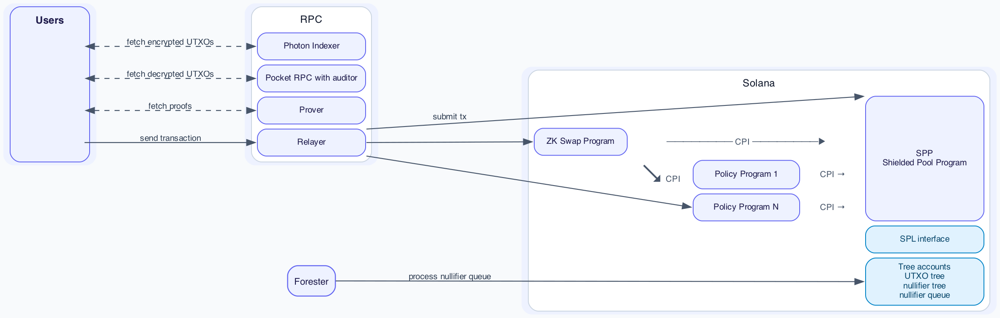
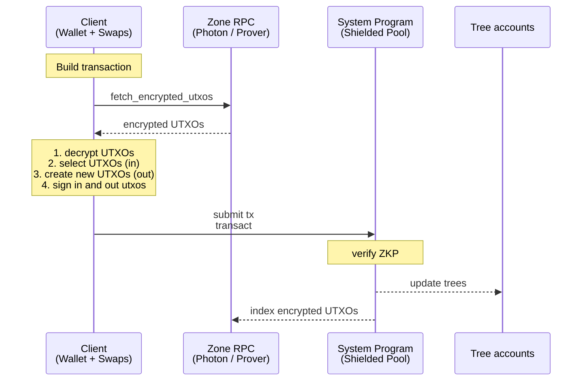
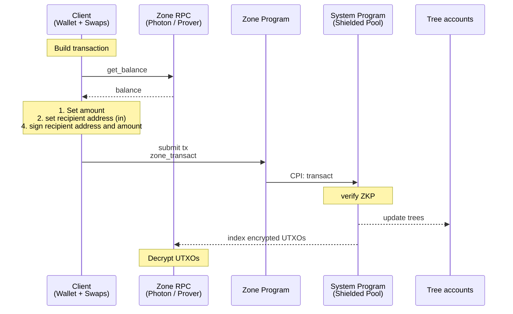
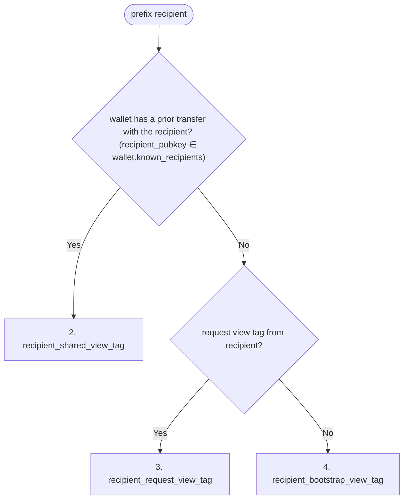
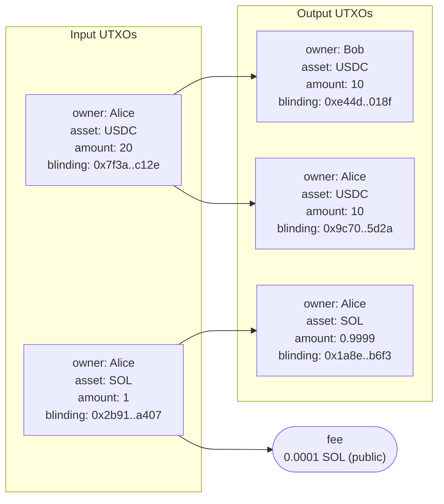

# Spec

## Table of Contents

- [Abstract](#abstract)
- [Architecture](#architecture)
  - [Operations](#operations)
    - [User](#user)
    - [Protocol](#protocol)
    - [Zone Creator](#zone-creator)
    - [Merge Service](#merge-service)
  - [Concurrency & Balance Fragmentation](#concurrency--balance-fragmentation)
  - [Default Zone](#default-zone)
  - [Policy Zones](#policy-zones)
- [Glossary](#glossary)
- [Shielded Address](#shielded-address)
- [Signing Key](#signing-key)
- [Nullifier Key](#nullifier-key)
- [ViewingKey](#viewingkey)
  - [Derived secrets](#derived-secrets)
  - [Transaction Viewing Key](#transaction-viewing-key)
  - [View Tags](#view-tags)
    - [Sender View Tag](#sender-view-tag)
    - [Recipient view tag](#recipient-view-tag)
    - [Merge view tag](#merge-view-tag)
    - [View Tag Selection](#view-tag-selection)
  - [Methods](#methods)
- [UTXO](#utxo)
  - [UTXO Hash](#utxo-hash)
  - [Address Lifecycle](#address-lifecycle)
  - [Nullifier](#nullifier)
- [Output UTXO Serialization](#output-utxo-serialization)
  - [Program Data](#program-data)
  - [Transfer](#transfer-2)
    - [Plaintext Layout](#plaintext-layout)
    - [Instruction Data Layout](#instruction-data-layout)
  - [Plaintext Transfer](#plaintext-transfer)
  - [UTXO Split](#utxo-split)
    - [Plaintext Layout](#plaintext-layout-1)
    - [Instruction Data Layout](#instruction-data-layout-1)
  - [Merge](#merge)
    - [Plaintext Layout](#plaintext-layout-2)
    - [Instruction Data Layout](#instruction-data-layout-2)
- [SPP Proof - Solana Privacy ZK Proof](#spp-proof---solana-privacy-zk-proof)
- [Merge Proof - Merge ZK Proof](#merge-proof---merge-zk-proof)
- [SPP - Solana Privacy Program](#spp---solana-privacy-program)
  - [Accounts](#accounts)
    - [Authority Governance](#authority-governance)
    - [Zone Accounts](#zone-accounts)
  - [Instructions](#instructions)
    - [transact](#transact)
    - [proofless_shield](#proofless_shield)
    - [zone_proofless_shield](#zone_proofless_shield)
    - [merge_transact](#merge_transact)
    - [merge_zone](#merge_zone)
- [Zone Program Interface](#zone-program-interface)
- [ZK Program Interface](#zk-program-interface)
- [RPC](#rpc)
  - [Indexer](#indexer)
    - [get_encrypted_utxos_by_tags](#get_encrypted_utxos_by_tags)
    - [get_shielded_transactions_by_tags](#get_shielded_transactions_by_tags)
    - [subscribe_to_shielded_transactions_by_tags](#subscribe_to_shielded_transactions_by_tags)
    - [get_merkle_proofs](#get_merkle_proofs)
    - [get_non_inclusion_proofs](#get_non_inclusion_proofs)
  - [Prover](#prover)
  - [Relayer](#relayer)
  - [Zone RPC](#zone-rpc)
    - [get_decrypted_utxos_by_owner](#get_decrypted_utxos_by_owner)
    - [get_decrypted_transactions_by_owner](#get_decrypted_transactions_by_owner)
    - [subscribe_to_decrypted_transactions_by_owner](#subscribe_to_decrypted_transactions_by_owner)
  - [Merge Service](#merge-service-1)
  - [Registry](#registry)
    - [Record](#record)
    - [Operations](#operations-1)
      - [`get_record`](#get_record)
      - [`register`](#register)
      - [`set_delegate`](#set_delegate)
      - [`rotate_sync_delegate_key`](#rotate_sync_delegate_key)
      - [`revoke_sync_delegate`](#revoke_sync_delegate)
  - [Sync Delegate](#sync-delegate)
- [User Flows](#user-flows)
  - [First Time Sync Wallet](#first-time-sync-wallet)
  - [Merge Flow](#merge-flow)
  - [Transfer User Flows](#transfer-user-flows)
    - [Privacy Guarantee Matrix](#privacy-guarantee-matrix)

## Abstract

The solana privacy protocol (TSPP) enables programmable, UTXO-based confidential transfers that execute directly on Solana, and supports private DeFi and institutional compliance. UTXO balances are backed by SPL and Token-2022 tokens, viewing keys provide selective disclosure, and owner tagging enables wallet sync at Solana speed. Policy zones add anonymity.

Confidential transfers are performed by a minimal Solana Privacy Program (SPP) that enforces UTXO state transitions with a zero knowledge proof (ZKP). To enable private DeFi, third-party programs can own UTXOs similar to how Solana programs own accounts and implement custom private logic in a separate ZKP to escrow tokens privately. For tailored compliance, institutions can implement zones with custom zone programs, for example with configurable auditors, authorities, freeze authority, co-signer, permanent delegate, and anonymity.

For wallet sync at Solana RPC speed, the owner pubkey prefixes every encrypted UTXO so wallets and indexers locate relevant outputs without trial decryption.

For compatibility with Solana addresses, a registry maps Solana addresses to shielded addresses and delegate keys, so a sender holding only a recipient's Solana address can pay them privately.

Two opt-in services improve user experience. A merge authority consolidates fragmented balances without per-merge wallet signatures. A sync delegate watches owner tags and surfaces relevant transactions to lightweight wallet implementations without local decryption.

The document specifies the key derivation, UTXO layout, SPP accounts and instructions, the zone program interface, the ZK program interface, the ZK circuits, the indexer / prover / relayer / zone RPC / merge service / registry interfaces, and user flows.

# Architecture



Source: [`diagrams/architecture.dot`](diagrams/architecture.dot). Regenerate with `just render-diagrams`.

1. Users — own wallets, build encrypted transactions, sign with P256.
2. Photon Indexer — indexes trees + encrypted UTXOs; default-zone users fetch ciphertexts here.
3. Zone RPC (with auditor) — RPC with auditor keys; decrypts and serves UTXOs to policy-zone users.
4. Prover — generates Groth16 proofs. Users can generate client side proofs as well.
5. Relayer (optional) — fee-payer that submits a transaction on a user's behalf; by default users invoke the programs directly. Targets SPP (default zone), the ZK Swap program, or a Zone program (policy zone).
6. Forester — processes the nullifier queue into the nullifier tree.
7. SPP (Solana Privacy Program) — verifies proofs, updates trees, moves SPL to and from the vaults.
8. ZK Swap Program — enforces swap logic in a zk proof and settles the swap with a shielded transfer by CPI into a Zone program or directly into SPP.
9. Zone Programs (1..N) — config programs; verify policy proofs and CPI into SPP.
10. SPL interface — per-mint SPL / Token-22 holding all shielded tokens.
11. Tree accounts — co-located UTXO tree, nullifier tree, and nullifier queue.

Per-flow sequence diagrams are in the [User Flows](#user-flows) section below.


## Operations

### User

Operations 1-4 run against the default zone via [`transact`](#transact) (or [`proofless_shield`](#proofless_shield)), or against a policy zone via the zone program's CPI into `zone_transact` (or [`zone_proofless_shield`](#zone_proofless_shield) for proofless deposits).

| # | Name | Description | Privacy |
| --- | --- | --- | --- |
| 1 | shield | Deposit SPL tokens into the shielded pool; existing UTXOs can be merged in the same transaction. | sender + amount visible; recipient visible |
| 2 | proofless_shield | Public deposit without a proof. Allows shielding dynamic amounts, for example for the flow unshield, swap, shield. | sender + amount visible; recipient `owner` visible |
| 3 | unshield | Withdraw SPL tokens from the shielded pool to a public account. | sender visible (or hidden via an optional relayer); recipient + amount visible |
| 4 | shielded transfer | Transfer value between shielded balances. | confidential: amount hidden; sender + recipient visible (anonymous in a policy zone) |

### Protocol

| # | Name | Description |
| --- | --- | --- |
| 1 | create_spl_interface | Initialize SPL/Token-22 pool escrow per token mint |
| 2 | create_tree | Initialize new Tree account (nullifier tree + queue and UTXO tree, co-located) |
| 3 | create_protocol_config | Initialize protocol config (role authorities, permissionless flags, `merge_authority`) |
| 4 | update_protocol_config | Rotate the protocol config authority and add or remove merge service authorities |
| 5 | pause_tree | Freeze writes to a Tree account |

### Zone Creator

Operations performed by the owner of a policy zone's config.

| # | Name | Description |
| --- | --- | --- |
| 1 | create_zone_config | Create a new zone config PDA; sets `owner` and `zone_authority_transact_is_enabled` |
| 2 | update_zone_config | Toggle `zone_authority_transact_is_enabled`. When disabled and the config owner is burned, the zone program cannot perform zone-authority state transitions |
| 3 | update_zone_config_owner | Transfer zone config ownership |
| 4 | zone_authority_transact | Prove correctness of a state transition by a zone authority (freeze, thaw, permanent-delegate transfer) |

### Merge Service

Operations performed by a merge service: a Solana account listed in `protocol_config.merge_authorities`. See [Merge Service](#merge-service-1) for the operator's responsibilities.

| # | Name | Description |
| --- | --- | --- |
| 1 | merge_transact | Consolidate N input UTXOs of the same owner and asset into one default-zone output UTXO |
| 2 | merge_zone | Policy-zone analog of `merge_transact`; called via CPI from a zone program. Inputs and output share `zone_program_id` |


## Concurrency & Balance Fragmentation

UTXOs are inherently concurrent. Every transaction to a user will fragment the users balance since the transaction amount is a new UTXO.

1. The balance of a keypair can be used concurrently when it is split up between a number of utxos.
2. To keep the balance spendable in one transaction we split it in up to X utxos.
3. Optionally, fragmented balances can be reconsolidated without user interaction by a whitelisted trust minimized [merge service](#merge_transact).


## Default Zone

The default zone is confidential and has no policy: amounts and assets are private, owners are public. Each output is tagged by its owner pubkey (the Ed25519 signer by default, or a P256 owner), bound to the output UTXO in the SPP proof, so wallets sync by querying the indexer for their own pubkey.
Users invoke the SPP directly.
Optional merge services and sync delegates can be used to improve UX.

### Transfer



## Policy Zones

**Properties:**
1. Fully programmable: the zone creator deploys a zone program that implements custom logic enforcing encryption to auditors, authorities, freeze authority, co-signer, and permanent delegate.
2. Enter Zone: a zone is entered by a shield from an SPL token account, the standard shielded pool, or another zone via a shielded transfer.
3. Exit Zone: a zone is exited by an unshield to an SPL token account, the standard shielded pool, or another zone via a shielded transfer.
4. Transfers: users invoke the zone program, which CPIs into the SPP program.


### Transfer




# Glossary

Type aliases used in the `struct` definitions throughout this spec. Each is defined once here and referenced by name elsewhere.

| Type | Definition | Description |
| --- | --- | --- |
| `PublicKey` | `[u8; 34]` | 1-byte scheme prefix + 33-byte body: a P256 SEC1-compressed point, or an Ed25519 public key. The protocol's scheme-tagged key, used wherever a key may be either curve — UTXO owners (`signing_pk` / `owner_pubkey`). |
| `P256Pubkey` | `[u8; 33]` | P256 public key, SEC1-compressed. No scheme prefix; used where the key is P256 by construction — viewing / ECDH keys (`tx_viewing_pk`, registry `viewing_pk` / `sync_pk`). |
| `P256Keypair` | — | A P256 `(secret, public)` keypair; its public half is a `P256Pubkey`. |
| `Signature` | `[u8; 64]` | A Solana (Ed25519) transaction signature. |
| `ECDSASignature` | `[u8; 64]` | A P256 ECDSA signature (`r‖s`); authenticates an RPC request under the signer's key. |
| `SPPProof` | `[u8; 192]` | Compressed Groth16 proof with commitment. |

Raw fixed-size byte arrays keep their literal types where no alias adds clarity:

- `[u8; 32]` — a 32-byte value: a Poseidon or SHA-256 digest, a BN254 field element, an owner pubkey, or a view tag.
- `[u8; 31]` — a blinding factor (held below the BN254 field modulus).

Hashing conventions:

- `Sha256BE` — SHA-256 over the byte preimage, then `digest[0] = 0`, interpreted as a BN254 field element. Zeroing the most-significant byte holds the result below the BN254 field modulus.

# Shielded Address

A shielded address consists of the signing public key, signs to spend UTXOs, the nullifier public key, ties the nullifier to a spent UTXO, and the viewing public key, encrypts the UTXO.
In compressed form the signing and nullifier public keys are compressed in an owner poseidon hash.

`ShieldedAddress = (signing_pk, nullifier_pk, viewing_pk)`

`CompressedShieldedAddress = (owner_hash, viewing_pk)`

## Pubkey Field Encoding

A pubkey is encoded into a single BN254 field via nested 2-input Poseidon over 128-bit big-endian limbs. This `pk_field(pk)` is the canonical form used wherever a pubkey appears inside a Poseidon hash anywhere in this spec.

```
P256 (33 B SEC1: parity || x_be32):
  x_hash := Poseidon(x_low_128, x_high_128)
  pk_field(pk) := Poseidon(y_is_odd, x_hash)

Solana / Ed25519 (32 B):
  pk_field(pk) := Poseidon(pk_low_128, pk_high_128)
```

P256's extra `y_is_odd` layer means the two encodings cannot collide except via Poseidon preimage collision (~2⁻²⁵⁴); no explicit scheme tag is needed.

## Owner Hash

```
owner_hash := Poseidon(pk_field(signing_pk), nullifier_pk)
```

The proof recomputes `pk_field(signing_pk)` from a witnessed P256 point; for Solana / Ed25519 inputs, SPP supplies it from the verified signer account.

# Signing Key

`(signing_sk, signing_pk)` — the spend-authorizing keypair. P256 for shielded users; Ed25519 for Solana-only owners whose ownership rails through SPP's Ed25519 signer check (see [UTXO Ownership Check](#utxo-ownership-check)).

**Coin type.** `TSPP_COIN_TYPE = 1445561917'` (placeholder), derived as `SHA-256("luminous.TSPP.v1")[0..4] as u32 & 0x7FFF_FFFF`.

**Derivation path.** `m / 44' / TSPP_COIN_TYPE' / account' / 0' / 0'`

**Constructors:**

- `SigningKey::from_seed(wallet_seed, account)` — `SLIP-0010-P256(wallet_seed, m/44'/TSPP_COIN_TYPE'/account'/0'/0')` on the BIP-39 seed `wallet_seed := PBKDF2-HMAC-SHA512(mnemonic, "mnemonic" || passphrase, c=2048, dkLen=64)`.
- `SigningKey::from_sk(signing_sk)` — direct injection.

**Methods:**

- `sign(msg) -> Signature` — P256 signature for shielded wallets; Ed25519 signature delegated to the host Solana wallet for Solana-only owners. Used to authorize `private_tx_hash` in the SPP proof (P256: checked by the proof; Ed25519: verified by SPP).

# Nullifier Key

Symmetric key to derive nullifiers.

`nullifier_secret := HKDF-SHA256(salt=∅, IKM=signing_sk_bytes, info="TSPP/nullifier", L=31)`

`nullifier_pk := Poseidon(nullifier_secret)`

**Methods:**

- `nullifier_pk() -> [u8; 32]` — returns `nullifier_pk` (defined above).
- `nullifier(utxo) -> [u8; 32]` — the UTXO's [nullifier](#nullifier).

# ViewingKey

`(viewing_sk, viewing_pk)` — P-256 keypair, used for HPKE encryption and to derive view-tag secrets. While a sync delegate is set the epoch uses a shared P256 key (see [Sync Delegate](#sync-delegate)). Viewing keys can rotate.

**Constructor:** `ViewingKey::from_seed(wallet_seed, account)` — `SLIP-0010-P256(wallet_seed, m/44'/TSPP_COIN_TYPE'/account'/1'/0')` on the same BIP-39 `wallet_seed` as the [Signing Key](#signing-key); a sibling of the signing path under change index `1'`, recoverable from the mnemonic.

## Derived secrets

Secrets derive from `view_root`, an ECDH-derived root, so the viewing key can stay in an HSM (one `CKM_ECDH1_DERIVE`).

- `P_const   := hash_to_curve_P256(DST="TSPP/view_root/P_const/v1")` — RFC 9380 `P256_XMD:SHA-256_SSWU_RO_`; fixed generator, unknown discrete log relative to `G` (else `ECDH(viewing_sk, P_const) = p·viewing_pk` would be public).
- `view_root := HKDF-Extract(salt=∅, IKM=ECDH(viewing_sk, P_const))` — `ECDH` is the shared point's 32-byte big-endian x-coordinate.
- `sender_view_tag_secret    := HKDF-Expand(view_root, "TSPP/sender_view_tag",    L=32)`
- `recipient_view_tag_secret := HKDF-Expand(view_root, "TSPP/recipient_view_tag", L=32)`
- `merge_view_tag_secret     := HKDF-Expand(view_root, "TSPP/merge_view_tag",     L=32)`
- `tx_viewing_secret         := HKDF-Expand(view_root, "TSPP/tx_viewing",         L=32)` — seeds the transaction viewing keys.

## Transaction Viewing Key

The transaction viewing key is a single use keypair (ephemeral key) that is deterministically derived for every private transaction.
Every ciphertext in a transaction is encrypted with HPKE between the transaction viewing key and the ciphertext owner's viewing key.
This way the transaction viewing key can decrypt both the sender's change and recipient UTXOs of the transaction.

TODO: evaluate to adapt derivation so that the viewing key can never repeat even in edge cases.

**Properties**

- **Scope**: one transaction.
- **Read-only**: viewing keys grant decryption only.
- **Derivable on demand**:
  ```
  first_nullifier := nullifier_key.nullifier(inputs[0])              // see [Nullifier](#nullifier)
  (tx_viewing_sk, tx_viewing_pk) := HKDF-SHA256(salt=first_nullifier, IKM=tx_viewing_secret, info="TSPP/tx_viewing")
  ```
  `tx_viewing_secret` is defined in [Derived secrets](#derived-secrets). Binding the HKDF salt to `first_nullifier` makes the keypair unique per Solana transaction (nullifier tree uniqueness implies `tx_viewing_pk` uniqueness).

## View Tags

The view-tag types in this section (`sender_view_tag`, `recipient_shared_view_tag`, `recipient_request_view_tag`, `recipient_bootstrap_view_tag`, `merge_view_tag`) apply to **anonymous policy zones only**. In the confidential [default zone](#default-zone) every output — sender change, recipients, and the [`merge_transact`](#merge_transact) output — is tagged by its owner pubkey (the owner's signing pubkey: the P256 x-coordinate or the full ed25519 key), so a wallet syncs by querying the indexer for its own owner pubkey.

Policy zones hide the recipient, so a wallet cannot find its outputs by owner pubkey as in the [default zone](#default-zone). Instead a view tag, a 32-byte value attached to a ciphertext, lets wallets sync by querying the indexer for exact view-tag matches and decrypt only their own transactions. Derivation splits into two cases — tags the sender derives for themselves to discover their own change UTXOs, and tags the sender derives for the recipient to discover incoming transfers.

A recipients wallet cannot pre-derive shared tags for every possible sender. Therefore the wallet needs to know which senders to derive view tags for. The first transfer between a new sender-recipient pair uses a tag the recipient can find without prior knowledge of the sender: either `recipient_request_view_tag` (recipient minted, shared out-of-band) or `recipient_bootstrap_view_tag = recipient.viewing_pk` (no coordination required). This first transfer establishes the pair: on decryption the recipient reads `sender_pubkey` from the ciphertext and derives the shared ECDH key, and subsequent transfers from this sender use a shared tag (`recipient_shared_view_tag`) to find transaction. `sender → recipient` and `recipient → sender` produce disjoint tags.

**Uniqueness.** View tags should not be reused. `merge_view_tag` (used only by [`merge_zone`](#merge_zone)) is inserted into the nullifier tree by the SPP. For other view tags the indexer must handle the case that these may be used multiple times erroneously and return all ciphertexts matching a single tag value.

**Encoding.**  all view tags are constant length 32 bytes. Shorter view tags are prefixed with 0s.

### Sender View Tag

1. **`sender_view_tag`**
  - Derived by: the sender, to index her change utxos.
  - Tx sent by: the sender
  - Indexed by: the sender
  - Derivation: `HKDF-SHA256(salt=∅, IKM=sender_view_tag_secret, info="TSPP/sender_view_tag/" || u64_be(tx_count), L=31)`.

### Recipient view tag

2. **`recipient_shared_view_tag`**
    - Derived by: the sender and recipient independently. Sender via `get_send_shared_view_tag` to send the tx, the recipient via `get_recipient_shared_view_tag` to index the tx.
    - Tx sent by: the sender.
    - Indexed by: the recipient.
    - Derivation: two chained HKDFs over the ECDH shared secret.

      ```
      shared := ECDH(self.viewing_sk, counterparty_pubkey)
      domain := HKDF-SHA256(salt = ∅, IKM = shared,
                           info = "TSPP/pair-domain/" || R_pubkey, L = 32)
      return    HKDF-SHA256(salt = ∅, IKM = domain,
                           info = "TSPP/pair-hint/"   || u64_be(i), L = 31)
      ```

      `R_pubkey` is the recipient of the direction: `counterparty_pubkey` on the sender side (`get_send_shared_view_tag`), `self.viewing_pk` on the recipient side (`get_recipient_shared_view_tag`). ECDH symmetry plus the matched direction label produces the same byte value across the pair.
3. **`recipient_request_view_tag`**
    - Derived by: the recipient. The recipient shares the tag with the sender out-of-band as a `PaymentRequest`.
    - Tx sent by: the sender.
    - Indexed by: the recipient. Once the recipient decrypts this transfer, subsequent transfers from the same sender can be indexed by `recipient_shared_view_tag`.
    - Derivation: `HKDF-SHA256(salt=∅, IKM=recipient_view_tag_secret, info="TSPP/recipient_request_view_tag/" || u64_be(request_count), L=31)`.
4. **`recipient_bootstrap_view_tag`**
    - Derived by: anyone — `recipient.viewing_pk` 32-byte X-coordinate of the SEC1-compressed encoding (the 33-byte form with its 1-byte sign prefix dropped).
    - Tx sent by: the sender.
    - Indexed by: the recipient. Once the recipient decrypts this transfer, subsequent transfers from the same sender can be indexed by `recipient_shared_view_tag`.
    - [Plaintext Transfer](#plaintext-transfer): sender bundles and recipient slots are indexed by `owner_pubkey` in place of `viewing_pk` (P256: the X-coordinate as above; Ed25519: the 32-byte key). The slot contains no `sender_pubkey`, so `known_senders` / `known_recipients` are not updated and the next encrypted transfer between the pair is again a first transfer.


### Merge view tag

5. **`merge_view_tag`** — used by [`merge_zone`](#merge_zone) only. `merge_transact` is a confidential [default-zone](#default-zone) operation, so it tags the merged output by the owner's signing pubkey — the same owner-pubkey tag every default-zone output carries (see [recipient slot](#recipient-slot)). The merge proof binds the signing `pk_field` to the output, and replay protection comes from the input nullifiers, so it needs no separate single-use view tag.
    - Derived by: the owner (wallet) and its [sync delegate](#sync-delegate), independently — both derive from `view_root` (see [Derived secrets](#derived-secrets)); the merge service holds no keys and is handed pre-derived values (see [Merge Service](#merge-service-1)).
    - Tx sent by: the zone program (`merge_zone`).
    - Indexed by: the owner.
    - Counter: per-service `merge_count` keyed by the merge service's Solana account `merge_authority` (`wallet.merge_services[merge_authority]`), advanced on every `merge_zone` for that service. Concurrent merge services therefore have disjoint tag streams.
    - Uniqueness: enforced single-use by SPP — inserted into the nullifier tree on `merge_zone`.
    - Derivation: `HKDF-SHA256(salt=∅, IKM=merge_view_tag_secret, info="TSPP/merge_view_tag/" || merge_authority || u64_be(merge_count), L=31)`. Including `merge_authority` in the info gives each service its own counter namespace; secrecy rests on the secret `merge_view_tag_secret`, so the public `merge_authority` value acts only as a domain separator.

### View Tag Selection

In the [default zone](#default-zone) every output is tagged by its recipient owner pubkey, so the selection below applies only to anonymous policy zones. The `merge_zone` service uses merge view tags; `merge_transact`, being confidential, tags by the owner's signing pubkey. Wallets select recipient tags as follows:



## Methods

1. `decrypt(ciphertext, tx_viewing_pk) -> Result<Plaintext>` — AES-CTR decryption with key `KDF(ECDH(viewing_sk, tx_viewing_pk))`.
2. `get_sender_view_tag(tx_count)` — policy-zone anonymous transfers only; tags the sender's own change UTXOs. The default zone tags change by the sender's owner pubkey.
3. `get_recipient_request_view_tag(request_count)` — used by the recipient to create a view tag for a `PaymentRequest` shared with the sender out-of-band.
4. `get_send_shared_view_tag(counterparty_pubkey, i)` — sender-side `recipient_shared_view_tag`; used for transfers to a recipient the sender has already paired with.
5. `get_recipient_shared_view_tag(counterparty_pubkey, i)` — recipient-side `recipient_shared_view_tag`; used during sync to scan transfers from each known sender.
6. `get_merge_view_tag(merge_authority, merge_count)` — used by the merge service when submitting [`merge_zone`](#merge_zone) and by the owner during sync to find those merged outputs. `merge_authority` is the service's Solana account.
7. `get_transaction_viewing_key(first_nullifier: [u8; 32]) -> P256Keypair` — per-transaction P-256 keypair for ECDH encryption to recipients.

# UTXO

A UTXO (unspent transaction output) represents an amount of an asset in the shielded pool that its owner can spend. 
UTXO hashes are appended to the UTXO Merkle tree at creation and nullifiers are inserted into the Nullifier tree when a UTXO is spent to prevent double spending. A nullifier can only be inserted once into the nullifier tree.

Example: Alice transfers 10 USDC to Bob. Alice's starting balance is one 20 USDC UTXO and one 1 SOL UTXO. Fee is 0.0001 SOL.



```rust
struct Utxo {
    /// Constant separating UTXOs from other Poseidon-hashed records.
    domain: u16,
    /// User-owned: the recipient's `owner_hash` from their
    /// [Shielded Address](#shielded-address). Program-owned: the owning program's
    /// `pk_field`. Senders write this 32-byte value directly.
    owner: [u8; 32],
    /// Asset mint. SOL is Address::default().
    asset: Address,
    /// Amount in the smallest unit of `asset`.
    amount: u64,
    /// Random bytes ensuring distinct UTXO hashes for equal
    /// `(owner, asset, amount)` triples.
    blinding: [u8; 31],
    /// Arbitrary program data; only on a program-owned UTXO. The governing
    /// program is the `owner`; the data pairs with `address` in `program_hash`.
    program_data: Option<Vec<u8>>,
    /// Persistent identifier of a program-owned UTXO; see
    /// [Address Lifecycle](#address-lifecycle).
    address: Option<Address>,
    /// Arbitrary zone data.
    zone_data: Option<Vec<u8>>,
    /// The zone program that authorizes spends of this UTXO.
    zone_program_id: Option<Address>,
}
```

## UTXO Hash

```
utxo_hash = Poseidon(domain, asset, amount,
                     program_hash, zone_hash, owner_utxo_hash)

program_hash    = Poseidon(address, program_data_hash)
zone_hash       = Poseidon(zone_data_hash, pk_field(zone_program_id))
owner_utxo_hash = Poseidon(owner, blinding)
```

The SPP proof commits to `utxo_hash` for every input and output. `owner` is the `owner_hash` from [Shielded Address](#shielded-address) for a user-owned UTXO, or `pk_field(program_id)` for a program-owned one. `asset` is Poseidon-encoded as `Poseidon(low, high)` before hashing; `zone_program_id` uses `pk_field` (see [Shielded Address](#shielded-address)). An absent `address` / `zone_program_id` is `0`, so a UTXO with neither set keeps `program_hash` / `zone_hash` over a `0` field.

A UTXO is **program-owned** when its `owner` is a program's `pk_field` (the authenticated CPI caller's `program_id`) rather than a user `owner_hash`; otherwise it is user-owned. Program data lives only on program-owned UTXOs and a user-owned UTXO has none: a non-zero `program_data_hash` requires program ownership and a non-zero `address`, so the data and its persistent identity enter `program_hash` together (see [Address Lifecycle](#address-lifecycle)). `zone_hash` pairs `zone_data_hash` with the authorizing zone program, and a non-zero `zone_data_hash` requires a non-zero `zone_program_id`. `owner_utxo_hash` nests `owner` and `blinding`: it keeps the owner private on the `transact` rails, where the components stay in the proof and ciphertext. A `proofless_shield` deposit instead sends `owner` and `blinding` in the clear and the program recomputes `owner_utxo_hash`, so that rail does not hide the recipient.

## Address Lifecycle

A program-owned UTXO has a persistent `address`: a ZK-compression-style identifier that survives spends and is the UTXO's discovery tag in the [default zone](#default-zone). It enters the commitment through `program_hash` (see [UTXO Hash](#utxo-hash)).

```
address = Poseidon(address_domain, Sha256BE(address_tree_pubkey), program_data_hash)
```

`program_data_hash` is the seed, so distinct accounts of one program get distinct addresses. `Sha256BE(address_tree_pubkey)` domain-separates per tree; it exceeds the BN254 modulus, so it enters the Poseidon as two big-endian 128-bit limbs. (Light derives the analogous value at runtime with Keccak; here it is derived inside the circuit, hence Poseidon.)

Address derivation and [nullifier](#nullifier) derivation are each standalone; non-inclusion against the tree is shared logic that selects which value it proves absent — a `nullifier` (spend) or an `address` (creation) — against the same root and Merkle path, then inserts it. A spend additionally proves the input `utxo_hash` is in the UTXO tree; a creation does not, and its slot is a dummy input that spends nothing.

A reused address is a private witness on a spent program-owned input; the proof recomputes that input's `program_hash` and `utxo_hash` and checks its inclusion, so a wrong address fails inclusion. The address is derived only at creation; reuse does not re-derive, so it survives `program_data_hash` updates. Every program-data UTXO's `address` is therefore either reused from a spent input or created this transaction; each created address contributes its `utxo_hash` to the `private_tx_hash` address chain, so the owner signature covers it.

The address tree is the [nullifier tree](#nullifier); `address_tree_pubkey` is that tree's pubkey, and address non-inclusion shares its root and Merkle path. (Light keeps a separate indexed address tree.)

## Nullifier

A nullifier deterministically derives from a UTXO and the recipient's [NullifierKey](#nullifierkey). Insertion into the nullifier tree must succeed only once.

```
nullifier    := Poseidon(utxo_hash, utxo_blinding, nullifier_secret)
```

nullifier_secret - must be committed in the owner hash, which enters `utxo_hash` via `owner_utxo_hash`.
utxo_blinding - must be committed as the `blinding` in `owner_utxo_hash`.

## Empty UTXO

Fixed-size circuits pad unused output slots with empty UTXOs, most often a
sender's absent SPL or SOL change. Every field is zero except `blinding`:

```
owner = asset = amount = 0
program_data = address = zone_data = zone_program_id = None
blinding = Sha256BE(blinding_seed || u8(position))
```

`owner = 0` leaves the output permanently unspendable: spending it later requires
keys whose `owner_hash` is 0, which no one holds. The per-position `blinding` keeps
each empty change output reconstructible by the owner from the sender bundle's
`blinding_seed` and gives it a distinct `utxo_hash`, so it looks like a real output.
The sender ciphertext also stays fixed-size (amounts are fixed-width), so neither
the output hash nor the ciphertext reveals whether the sender kept change.

`owner = 0` is exactly the dummy-output condition, so an empty change output is a
dummy: it contributes `0` to the output hash chain. Padding slots beyond the
sender's change and recipients are dummies too; they hold no value, so their
`blinding` is freshly random rather than position-derived.

The confidential default zone reveals recipients, so `output_ciphertexts` holds
only the sender bundle and real recipient slots; dummy output slots get no ciphertext.

# Output UTXO Serialization

Output UTXO serialization is the per-output ciphertext layout for shielded
transactions. Each output's ciphertext lives in its own
[`OutputUtxo.data`](#transact) slot; SPP does not parse `data`. Serialization is a
default-zone convention; policy zones can define their own.
UTXOs are encrypted with ECDH AES-256-CTR, except in the Plaintext Transfer scheme.
The shared `tx_viewing_pk` and `salt` are transaction-level fields of the
[transact](#transact) instruction, not part of any per-output payload. Each output
slot is tagged by its `owner` pubkey.

Schemes:

1. Transfer — one sender and `0<=` recipient ciphertexts.
2. UTXO Split — one ciphertext for M equal-amount outputs under the same owner.
3. Merge — one ciphertext for the single merged output.
4. Plaintext Transfer — the Transfer layout with unencrypted payloads.

## AES Key derivation

AES-CTR reuses a `(key, nonce)` pair if the same viewing key is derived twice (e.g. a failed transaction rebuilt with the same first nullifier). The `salt` prevents this. Key and nonce both derive from the single-use transaction viewing key, a per-transaction 16-byte CSPRNG `salt`, and the slot index.

Per ciphertext slot `i` — the index in `output_ciphertexts` (`0` = sender bundle,
`1 + j` = recipient `j`); a dummy slot reuses its own index but is never decrypted:

```
ikm        = ECDH_x(tx_viewing_sk, recipient_viewing_pk) || tx_viewing_pk || recipient_viewing_pk
okm        = HKDF-SHA256(salt = ∅, IKM = ikm,
                         info = "TSPP/hpke/" || "TSPP/tx" || salt || u32_be(i), L = 44)
key        = okm[0..32]
nonce      = okm[32..44]                                    // 12 B, the AES-CTR nonce
ciphertext = AES-256-CTR(key, nonce, plaintext)
```

Integrity is verified by recomputing the UTXO hash from the decrypted plaintext fields and comparing against `output_utxo_hashes[i]`. Those hashes are proof-verified on-chain commitments, so a mismatch — from a wrong decryption key or a corrupted ciphertext — is detected with overwhelming probability.


## Program Data

Each plaintext stores zone- and program-specific bytes in a `data` field of type `Data`: a record count followed by type-length-value records.

```
Data   = count: u8 || records[count]
record = tag: u8 || len: u16_le || bytes: [u8; len]
```

An empty `data` field is the single byte `count = 0`. Each populated record adds `3 + len` bytes to its plaintext and the same to the ciphertext.

| Tag | Record | UTXO field | Description |
| --- | --- | --- | --- |
| `0x01` | `zone_data` | `zone_data` | store zone utxo data |
| `0x02` | `program_data` | `program_data` | store program utxo data |

## Transfer

One ciphertext for the sender's SOL and SPL change UTXOs, and one ciphertext for each recipient UTXO. Variables used below: `R ≥ 0` = recipient UTXO count, `N` = input UTXO count.

### Plaintext Layout

Fields packed in declaration order. Byte vectors are prefixed with a `u16_le` length, every other vector with a `u8` count.

#### Recipient

```rust
/// 48 B plaintext for confidential transfers with an empty `data` field.
/// Anonymous transfers additionally carry `owner_pubkey: PublicKey` (34 B) and
/// `sender_pubkey: P256Pubkey` (33 B) before `asset_id`. Each populated data
/// record adds `3 + len` bytes. See [Program Data](#program-data).
struct TransferRecipientPlaintext {
    /// `1` for SOL; SPL via per-mint Asset registry (`asset_id ≥ 2`).
    asset_id: u64,
    /// In units of `asset_id`.
    amount: u64,
    /// Random blinding for the single output.
    blinding: [u8; 31],
    /// Zone and program records for the output UTXO. The wallet parses
    /// `zone_data` if it supports the zone; `program_data` is parsed by the
    /// application program's client SDK. See [Program Data](#program-data).
    data: Data,
}
```

#### Sender

The sender change bundle encodes two outputs (SPL change + SOL change). Per-output blindings derive from a single seed:

```
blinding_i = Sha256BE(blinding_seed || u8(position_i))
```

with `position = 0` for the SPL output and `position = 1` for the SOL output.

```rust
/// 57 B plaintext for confidential transfers with both `data` fields empty
/// (fixed, independent of recipient count). Anonymous transfers additionally
/// carry `owner_pubkey: PublicKey` (34 B) before `spl_asset_id` and
/// `recipient_viewing_pks: Vec<P256Pubkey>` (1 + 33·R B) after `blinding_seed`.
/// Each populated data record adds `3 + len` bytes. See [Program Data](#program-data).
struct TransferSenderPlaintext {
    /// Per-mint Asset registry; `0` if no SPL change.
    spl_asset_id: u64,
    /// `0` if no SPL change.
    spl_amount: u64,
    /// `0` if no SOL change.
    sol_amount: u64,
    /// Seed for the two per-output blindings (formula above).
    blinding_seed: [u8; 31],
    /// Records for the SPL change UTXO (position 0): `zone_data` hashed via
    /// the zone program's scheme into the `zone_data_hash` slot of
    /// `utxo_hash`, `program_data` via the app program's scheme into the
    /// `program_data_hash` slot. See [Program Data](#program-data).
    spl_data: Data,
    /// Records for the SOL change UTXO (position 1), same scheme as
    /// `spl_data`.
    sol_data: Data,
}
```

### Instruction Data Layout

The sender serializes a `TransferEncryptedUtxos` bundle, then spreads its
ciphertexts across the [transact](#transact) instruction's per-output `data`
slots. `tx_viewing_pk` and `salt` are transaction-level fields of `TransactIxData`,
shared by every slot. Fields are packed in declaration order; byte vectors are
prefixed with a `u16_le` length, every other vector with a `u8` count.

```rust
/// `sender_ciphertext` is a 57-byte plaintext for confidential transfers (when
/// `data` fields are empty). Each populated data record grows its ciphertext by
/// `3 + len` bytes. See [Program Data](#program-data).
struct TransferEncryptedUtxos {
    /// Discriminator (TRANSFER).
    type_prefix: u8,
    tx_viewing_pk: P256Pubkey,
    /// Per-transaction CSPRNG salt.
    salt: [u8; 16],
    /// Sender change bundle ciphertext. Tagged by the sender's `owner` pubkey
    /// in the transact instruction data.
    sender_ciphertext: Vec<u8>,
    /// One per recipient.
    recipient_slots: Vec<RecipientSlot>,
}
```

#### Recipient slot

```rust
/// `ciphertext` is a 48-byte recipient plaintext for confidential transfers
/// (plus `3 + len` per populated data record).
struct RecipientSlot {
    /// Recipient's signing pubkey — the indexing tag. The confidential proof
    /// binds it to the output UTXO; the anonymous proof leaves it free (a view tag).
    owner: [u8; 32],
    ciphertext: Vec<u8>,
}
```

#### Output slot mapping

The output commitments and the ciphertexts travel in two separate transact vectors.
`output_utxo_hashes` holds one `utxo_hash` per output position in tree-append order
(`0` SPL change, `1` SOL change, `2 + i` recipient `i`/dummy). `output_ciphertexts` is
the ciphertext side, length `1 + R` for `R` real recipients. `SENDER_SLOT_COUNT = 2`
is the number of leading change positions the bundle covers (SPL + SOL change), and
`MAX_RECIPIENTS = M - SENDER_SLOT_COUNT` is the number of recipient slots the shape
allows:

- `output_ciphertexts[0]` is `sender_ciphertext` under the sender's `owner` pubkey (AES
  slot index `0`); the bundle covers both change outputs (positions
  `0..SENDER_SLOT_COUNT`), so the SOL change has no ciphertext of its own.
- `output_ciphertexts[1 + i]` is the slot for output position `SENDER_SLOT_COUNT + i`
  (AES slot index `1 + i`; see [AES Nonce derivation](#aes-nonce-derivation)): a real
  recipient ciphertext under its own `owner` pubkey. Dummy output positions get no
  ciphertext, so the vector length is `1 + R` for `R` real recipients.

The logged `GeneralEvent` keeps one entry per output position, pairing
`output_utxo_hashes[i]` with the ciphertext that covers position `i` (the bundle for
`0`, empty for the remaining change positions and for dummy recipient positions,
`output_ciphertexts[1 + (i - SENDER_SLOT_COUNT)]` for a real recipient at
`i >= SENDER_SLOT_COUNT`).

#### Sizes

`R` = number of real recipient slots. An encrypted transfer carries one slot per real
recipient (no dummy padding), so its on-instruction size grows with `R`.
The table below gives the size as a function of the slot count `R`.

Total: `110 + 82·R` bytes. Example with a single recipient slot: `R = 1`, total `192`.

Blob size by slot count:

| R | Bytes |
| --- | --- |
| 1 | 192 |
| 2 | 274 |
| 4 | 438 |
| 8 | 766 |

Sizes assume confidential transfers with every `data` field empty (`count = 0`). Each populated record adds `3 + len` bytes (u8 tag + u16_le len + payload) to its plaintext and the same to the ciphertext.

## Plaintext Transfer

The [Transfer](#transfer-2) layout without encryption: `tx_viewing_pk`, `salt`, and the AES-CTR ciphertext wrapper are absent. Output blindings derive from `blinding_seed` (formula in [Sender](#sender)): position `0` SPL change, `1` SOL change, recipient slot `i` position `2 + i`. The sender bundle and each recipient slot are indexed by their `owner_pubkey`, like the encrypted [Transfer](#transfer-2).

A plaintext transfer differs from the encrypted transfer only in that amounts and asset are public; both reveal recipients and fill `output_ciphertexts` with the real slots only.

```rust
/// Total size: `96 + 51·R` bytes with both change outputs and every `data`
/// field empty; each populated data record adds `3 + len` bytes. See
/// [Program Data](#program-data).
struct TransferPlaintextUtxos {
    /// Discriminator (TRANSFER_PLAINTEXT).
    type_prefix: u8,
    blinding_seed: [u8; 31],
    sender: Option<TransferPlaintextSender>,
    recipient_slots: Vec<TransferPlaintextRecipient>,
}

struct TransferPlaintextSender {
    owner_pubkey: PublicKey,
    /// SPL change `(amount, asset_id)`.
    spl: Option<(u64, u64)>,
    sol_amount: Option<u64>,
    spl_data: Data,
    sol_data: Data,
}

struct TransferPlaintextRecipient {
    owner_pubkey: PublicKey,
    asset_id: u64,
    amount: u64,
    data: Data,
}
```

## UTXO Split

All M outputs share owner, amount, and asset, so a single ciphertext encodes them. Each output UTXO derives a unique blinding from the blinding seed:

```
blinding_i = Sha256BE(blinding_seed || u8(i))
```

for `i = 0 .. M-1`.

### Plaintext Layout

```rust
/// 83 B plaintext → 83 B ciphertext (no tag) with an empty
/// `data` field. See [Program Data](#program-data) for the growth per
/// populated record.
struct SplitBundlePlaintext {
    /// Shared owner of all M outputs.
    owner_pubkey: PublicKey,
    /// M — number of equal-amount outputs.
    num_outputs: u8,
    /// `1` for SOL; SPL via per-mint Asset registry (`asset_id ≥ 2`).
    asset_id: u64,
    /// Shared across all M outputs.
    asset_amount: u64,
    /// Seed for the M per-output blindings (formula above).
    blinding_seed: [u8; 31],
    /// Zone and program records, applied uniformly to all M outputs (they
    /// share every other base field). See [Program Data](#program-data).
    data: Data,
}
```

### Instruction Data Layout

```rust
/// 135 bytes total when the plaintext `data` field is empty; populated
/// records grow the ciphertext by `3 + len` bytes each. Packed; the
/// ciphertext is prefixed with a `u16_le` length.
/// Tagged by the sender's `owner` pubkey in the transact instruction data
/// (all M outputs share the sender as owner).
struct SplitEncryptedUtxos {
    /// Discriminator (SPLIT).
    type_prefix: u8,
    tx_viewing_pk: P256Pubkey,
    /// Per-transaction CSPRNG salt.
    salt: [u8; 16],
    /// 83-byte plaintext (no tag).
    ciphertext: Vec<u8>,
}
```

## Merge

One ciphertext for the single merged output.

### Plaintext Layout

```rust
/// 71 B plaintext, AES-256-CTR (no tag). The owner is not transmitted: it is
/// recovered from the public `pk_field(user_signing_pk)` and the owner's keys.
struct MergeBundlePlaintext {
    /// Sum of input amounts.
    amount: u64,
    /// UTXO asset field (32-byte field element, not the u64 asset_id).
    asset: [u8; 32],
    /// Random blinding for the merged output.
    blinding: [u8; 31],
}
```

### Instruction Data Layout

```rust
/// 105 bytes total. Packed, no length prefixes. The owner-side fetch tag is the
/// owner pubkey (see merge_transact), not carried in this blob.
struct MergeEncryptedUtxo {
    /// Discriminator (MERGE).
    type_prefix: u8,
    /// Ephemeral key; the owner derives the AES key/nonce from it. Fresh per merge
    /// (no salt).
    tx_viewing_pk: P256Pubkey,
    ciphertext: [u8; 71],
}
```

# SPP Proof - Solana Privacy ZK Proof

**Public Inputs**

| Input | Source |
| --- | --- |
| nullifiers | derived by the proof from spent input UTXOs |
| output_utxo_hashes | instruction data |
| utxo_tree_roots (one per input UTXO) | resolved from `utxo_tree_root_index[i]` against the root cache of the input's UTXO tree |
| nullifier_tree_roots (one per input UTXO) | resolved from `nullifier_tree_root_index[i]` against the root cache of the input's nullifier tree |
| private_tx_hash | instruction data |
| private_tx_hash_digest | The full `SHA-256(private_tx_hash)`, recomputed by SPP on-chain from the `private_tx_hash` public input. The ECDSA message digest the proof checks the P256 `owner_signature` against. The 256-bit digest exceeds the BN254 modulus, so it enters the circuit as two big-endian 128-bit limbs (`low`, `high`) and the public-input hash binds `Poseidon(low, high)`. Computing the SHA-256 outside the circuit keeps the costly hash out of the constraint system; the proof performs only the EC arithmetic of ECDSA verification against the reconstructed digest. Both limbs are `0` on the Solana-only variant. |
| external_data_hash | instruction data. SPP recomputes it from the instruction and checks it matches this public input. It is its own public input, not just an input to `private_tx_hash`, because SPP cannot recompute `private_tx_hash`: that hash covers the input UTXO hashes, which are private. Without it a proof could be reused with a different instruction (different `encrypted_utxos`, accounts, or fee). |
| public_sol_amount | instruction data |
| public_spl_amount | instruction data |
| public_spl_asset_pubkey | derived by SPP from the vault token account's mint |
| program_id | single `pk_field` of the program governing the transaction's program-owned UTXOs (their `owner`); `0` when none — set by SPP from the authenticated `cpi_signer` |
| address_tree_pubkey | `Sha256BE(address tree pubkey)` derived by SPP from the address tree (the [nullifier tree](#nullifier)) account; domain-separates program addresses; `0` when the transaction has no program-owned UTXOs |
| zone_program_id | single `pk_field` of the policy zone authorizing the transaction's UTXOs; `0` (non-zone / default transact) — instruction data |
| payer_pubkey_hash | `Sha256BE(payer)` derived by SPP from the `payer` account |
| solana_owner_pk_hashes (one per input UTXO) | `pk_field` (see [Shielded Address](#shielded-address)) of the input's Solana / Ed25519 owner; `0` for a P256-owned input. |

See [UTXO Hash](#utxo-hash) and [Nullifier](#nullifier).

**Private Inputs (per input UTXO)**

| Input | Description |
| --- | --- |
| owner signing key witness | P256 inputs witness canonical `(x, y)` and compressed-key parity, used to recompute `pk_field(signing_pk)` (see [Shielded Address](#shielded-address)). An Ed25519-owned input uses the public `solana_owner_pk_hashes[i]`. |
| `nullifier_secret` | the input owner's secret (see [Nullifier Key](#nullifier-key)); recomputes the input's `nullifier_pk` and [nullifier](#nullifier) |
| `blinding`, `asset`, `amount`, `program_data_hash`, `address`, `zone_data_hash`, `zone_program_id` | UTXO body fields used to recompute `utxo_hash`; `blinding` combines with the recomputed `owner_hash` into `owner_utxo_hash`, and also feeds the nullifier formula. `address` is reused from the input or derived (see [Address Lifecycle](#address-lifecycle)) |
| `utxo_merkle_path` | path proving `utxo_hash` is a leaf of the input's UTXO tree at the corresponding `utxo_tree_root` |
| `owner_signature` | P256 signature by `signing_pk` over `private_tx_hash` (P256 owners only; ignored for Ed25519). The proof checks it against the public `private_tx_hash_digest`; the SHA-256 that produces that digest is computed outside the circuit (see [UTXO Ownership Check](#utxo-ownership-check)). |

**Private Inputs (per output UTXO)**

| Input | Description |
| --- | --- |
| `owner` | recipient's `owner_hash`; combined with `blinding` into `owner_utxo_hash`, which the proof hashes into `output_utxo_hashes[i]` without unpacking the components. The confidential variant additionally witnesses the owner's signing and nullifier pubkeys to recompute `owner_hash` and expose the signing pubkey as the public tag. |
| `asset`, `amount`, `blinding`, `program_data_hash`, `address`, `zone_data_hash`, `zone_program_id` | UTXO body fields used to recompute `output_utxo_hashes[i]` |

**external_data_hash**

Hash over the public fields of the invoking SPP instruction and the Solana token accounts the proof must commit to. Included in `private_tx_hash` so the owner's signature covers the entire transaction and commits the proof to the specific SPP instruction being invoked (`transact`, `zone_transact`, `zone_authority_transact`, …). A proof built for one instruction cannot be replayed against another even when every other field matches.

```
external_data_hash := Sha256BE(
    u8(spp_instruction_discriminator)                ||
    u64_be(expiry_unix_ts)                           ||
    u16_be(relayer_fee)                              ||
    i64_be(public_sol_amount.unwrap_or(0))           ||
    i64_be(public_spl_amount.unwrap_or(0))           ||
    user_sol_account.unwrap_or([0; 32])              ||
    user_spl_token_account.unwrap_or([0; 32])        ||
    spl_token_interface.unwrap_or([0; 32])           ||
    cpi_signer.map_or([0; 33], |s| s.program_id || u8(s.bump)) ||
    program_data_hash.unwrap_or([0; 32])             ||
    zone_data_hash.unwrap_or([0; 32])                ||
    u16_be(output_utxo_hashes.len()) || output_utxo_hashes[0] || output_utxo_hashes[1] || ... ||
    u16_be(output_ciphertexts.len()) || output_ciphertext(output_ciphertexts[0]) || ...
)

output_ciphertext(c) := c.owner || u16_be(c.data.len()) || c.data
```

`spp_instruction_discriminator` is the SPP discriminator byte of the instruction whose handler runs the proof verification (see [Instructions](#instructions)). SPP recomputes this value from the dispatched instruction and checks the proof's `external_data_hash` against it.

`program_data_hash` and `zone_data_hash` are optional transaction-level program- and zone-specific external data from the [`transact`](#transact) instruction data, `None` (`[0; 32]`) for a default-zone `transact`. A zone or application program sets them to a tx-level digest of its inputs. The proof does not interpret them: as with the rest of `external_data_hash` it commits only to the combined hash, which SPP (or the zone program before its CPI) recomputes and checks. They are not standalone public inputs, and are distinct from the per-UTXO `program_data_hash` / `zone_data_hash` in [`utxo_hash`](#utxo-hash). `program_id` stays a standalone public input.

**Checks**

| Check | Description |
| --- | --- |
| Owner hash binding (per input) | The recomputed `owner_hash` (see [Shielded Address](#shielded-address)) must equal the input's `owner`, the value hashed into `utxo_hash` for the inclusion check. |
| UTXO Ownership | Spent input UTXOs must be authorized by their owner. `solana_owner_pk_hashes[i]` selects the input's path: `0` → owner binds to `pk_field(signing_pk)`, authorized by the one P256 signature over `private_tx_hash`; non-zero → owner binds to the entry, and SPP verifies the account named in `in_utxo_signer_indices` is a transaction signer. Ed25519 owners may differ per input; P256-owned inputs share the one witnessed `signing_pk`. The Solana-only [variant](#circuit-variants) forces every real input onto the non-zero path. See [UTXO Ownership Check](#utxo-ownership-check). |
| Inclusion | Each spent input UTXO must be a leaf of the UTXO tree at its corresponding `utxo_tree_roots[i]`. |
| Nullifier secret binding (per input) | The input's `nullifier_pk` (see [Nullifier Key](#nullifier-key)) is recomputed from its `nullifier_secret` witness and enters the input's recomputed [owner hash](#shielded-address). |
| Nullifiers | Public nullifier per input equals the input's [nullifier](#nullifier). |
| Nullifier non-inclusion | Each input nullifier must NOT exist in the nullifier tree at its corresponding `nullifier_tree_roots[i]` before the transaction. |
| Output UTXOs | Output UTXO hashes must be well formed and match `output_utxo_hashes[i]`. The proof hashes output `owner` into `output_utxo_hashes[i]` without unpacking it. |
| Output owner tag (confidential variant) | The confidential variant exposes each output owner's signing pubkey — the ciphertext `owner` tag — as a public input and recomputes the output `owner_hash` from it, so the tag truthfully identifies the owner and a sender cannot mistag a recipient's output. The anonymous variant omits this, leaving `owner` free for a view tag. Instruction data selects the variant. |
| Balance Conservation | For each active asset, inputs plus public deposits must equal outputs plus public withdrawals and fees. |
| Private transaction hash | `private_tx_hash = Poseidon(input utxo hash chain, output utxo hash chain, address utxo hash chain, external data hash)`. Dummy inputs and outputs contribute `0` to the input and output chains, so the hash covers only real state; their real hashes still enter the public `output_utxo_hashes` and nullifier inputs. The address chain contains each created address slot's `utxo_hash` (`0` elsewhere); a reused address is covered through the input UTXO hash chain.<br>The owner signs this value; the ECDSA message digest `SHA-256(private_tx_hash)` is computed outside the circuit and bound by the `private_tx_hash_digest` public input (see [UTXO Ownership Check](#utxo-ownership-check)). SPP, policy, and third-party proofs all take `private_tx_hash` as a public input, so every circuit proves statements about the same transaction data. |
| Program ownership | An input or output is program-owned when `owner == program_id` (the public input SPP sets from the authenticated `cpi_signer`). The proof routes per slot: a user-owned input takes the owner signature path, while a program-owned input skips the owner-hash binding and signature and pins `nullifier_secret = 0` -- authorization is the `cpi_signer` alone (one signer check, no per-input user signer). Only the calling program can spend its own UTXOs: a UTXO owned by another program has `owner != program_id` and falls to the user path, where no signature validates. A user-owned slot may not carry program data; a program-owned slot with `program_data_hash != 0` must have an `address` reused from a spent input or created this transaction (see [Address Lifecycle](#address-lifecycle)). Zone programs additionally authorize spends of their zone (`zone_program_id`) via a PDA signer; policy proofs are checked by the zone program before CPI into SPP. |
| Dummy input or output | ZK circuits are fixed size; dummy UTXOs allow a transaction to use fewer real inputs or outputs. A dummy has `owner = 0` (an input's owner key, an output's `owner_hash`): permanently unspendable, so a real spend never has it. Ownership, inclusion, nullifier-secret-binding, nullifier, and balance checks are skipped for dummy UTXOs. The fixed shape is public — SPP inserts every input nullifier into the nullifier tree and appends every output hash to the UTXO tree — so a dummy's nullifier and `utxo_hash` must be indistinguishable from a real UTXO's and pairwise distinct, hiding the real input and output counts. A dummy output is an [empty UTXO](#empty-utxo) and gets no ciphertext (see [Empty UTXO](#empty-utxo)). A dummy input derives its [nullifier](#nullifier) over a random `blinding` with `nullifier_secret = 0`, the blinding being its sole source of unpredictability.<br>An input dummy with a non-zero `program_data_hash` is instead an **address slot** that creates a program address. It sets `owner = program_id` (the invoking program, set by SPP from the authenticated CPI caller) rather than `0`, pins `amount` and the non-seed fields to `0`, and derives its `address` (see [Address Lifecycle](#address-lifecycle)); the shared non-inclusion path proves the `address` absent against the nullifier-tree root and inserts it, enforcing uniqueness. Unlike a padding dummy, it contributes its `utxo_hash` to the `private_tx_hash` address chain, so the owner signature covers it.<br>A padding dummy input's public `nullifier` and `utxo_tree_root` / `nullifier_tree_root` are **not** covered by the owner signature: the checks above are skipped and it contributes `0` to `private_tx_hash`, so the signed digest `SHA-256(private_tx_hash)` excludes them. The sender fixes them when signing; they are part of the signed transaction, and SPP still inserts the nullifier and reads each root by index. This holds because the sender builds the whole proof witness; no untrusted party sits between signing and proving. A re-prover can at most swap one random dummy nullifier for another (every real input, output, amount, and recipient stays signed); the worst case is a self-reverting duplicate-nullifier insertion, which cannot change real state. |

<a id="utxo-ownership-check"></a>
**Utxo Ownership Check:**
1. P256 signature over `private_tx_hash` verified in the SPP proof; the same point recomputes `pk_field(signing_pk)` (see [Shielded Address](#shielded-address)). The hash covers every input, every output, and the external-data hash, so the proof cannot be replayed with different state. The SHA-256 message digest is computed **outside** the circuit: SPP recomputes `private_tx_hash_digest = SHA-256(private_tx_hash)` on-chain from the `private_tx_hash` public input and feeds it to the proof, which verifies the ECDSA signature against the digest using only EC arithmetic. Binding holds across the public inputs — the proof recomputes `private_tx_hash` from the private input/output hash chains and asserts it equals the `private_tx_hash` public input, SPP asserts `private_tx_hash_digest = SHA-256(private_tx_hash)`, and the proof asserts the signature verifies against `private_tx_hash_digest`.
2. Ed25519 Solana signer checked by SPP. The non-zero entry in the public `solana_pk_hashes` array tells the circuit to skip the P256 signature check on the input and bind the input's owner to the SPP-derived `pk_field`; SPP separately reads `in_utxo_signer_indices` from instruction data and verifies the named 32-byte Solana account is a signer of the transaction. The nullifier-secret binding is still checked by the proof for these inputs.

<a id="circuit-variants"></a>
**Circuit Combinations**

Each circuit is instantiated twice: 1. P256 & Ed25519 (Solana) 2. Ed25519 (Solana) only. The second instance omits the expensive P256 signature verification. The Ed25519 signature verification is always outsourced signature to the SPP. Therfore instance 2 has ~7× fewer constraints.

Each is instantiated again on an owner-tag axis: a confidential variant that exposes each output owner's signing pubkey (the ciphertext `owner` tag) and recomputes the output `owner_hash` from it, and an anonymous variant that leaves `owner` unconstrained so a policy zone can place a view tag there. For a program-owned output the confidential variant places the output's `address` in that same owner-tag public input, and the proof checks it equals the `address` in the committed `program_hash` (its `owner = pk_field(program_id)` is not a signing pubkey), so the address is the discovery tag. Instruction data selects the variant; the default zone always uses the confidential variant.

A third axis selects a zone-capable instantiation at compile time. The non-zone (default) variant pins every UTXO's zone fields to `0`. The zone variant binds each non-dummy input and output UTXO to the public `zone_program_id` when set: a UTXO whose `zone_program_id` is non-zero must equal the public `zone_program_id`, while a UTXO with `zone_program_id = 0` is exempt. Program identity is the `owner`, so program-ownership routing (owner == public `program_id`) and the program-data to `address` create-or-reuse invariant (see [Address Lifecycle](#address-lifecycle)) apply in both variants; only the `zone_program_id` binding and non-zero `zone_data` are gated to the zone variant. Policy zones are anonymous, hiding the recipient behind a view tag, so there is no confidential zone variant: zone pairs only with the anonymous owner-tag variant.

| Circuit | Use | Shape | Variants |
| --- | --- | --- | --- |
| 1 in 1 out | Re-randomize a single UTXO | 1 input UTXO, 1 output UTXO of the same owner, asset, and amount with fresh blinding; transaction fees are paid by the payer | P256, Solana-only |
| 1 in 2 out | Single-input transfer | 1 sender input UTXO, 1 recipient output, 1 change output; transaction fees are paid by the payer | P256, Solana-only |
| 2 in 2 out | Shield with merge | 1 SOL fee UTXO + 1 existing SPL UTXO in; 1 SPL output (existing balance + new deposit), 1 SOL change output | P256, Solana-only |
| 2 in 3 out | Single-input transfer with fee UTXO (currently the only implemented shape) | 1 SOL fee UTXO, 1 sender input UTXO, 1 recipient output, 1 SPL change output, 1 SOL change output | P256, Solana-only |
| 3 in 3 out | Standard transfer | 1 SOL fee UTXO, 2 sender input UTXOs, 1 recipient output, 1 SPL change output, 1 SOL change output | P256, Solana-only |
| 4 in 3 out | Multi-input transfer | 1 SOL fee UTXO, 3 sender input UTXOs, 1 recipient output, 1 SPL change output, 1 SOL change output | P256, Solana-only |
| 4 in 4 out | Multi-input transfer, two recipients | 1 SOL fee UTXO, 3 sender input UTXOs, 2 recipient outputs, 1 SPL change output, 1 SOL change output | P256, Solana-only |
| 5 in 3 out | Higher concurrency | 1 SOL fee UTXO, 4 sender input UTXOs, 1 recipient output, 1 SPL change output, 1 SOL change output | P256, Solana-only |
| 5 in 4 out | Higher concurrency, two recipients | 1 SOL fee UTXO, 4 sender input UTXOs, 2 recipient outputs, 1 SPL change output, 1 SOL change output | P256, Solana-only |
| 1 in 8 out | Split UTXO | Split 1 UTXO into up to 8 equal parts; equal parts reduce encrypted data | P256, Solana-only |

**Zone-authority instantiation.** A separate instantiation proves no owner authorization at all: it is the Solana-only zone variant (no P256 gadget, no in-circuit signature) and keeps every input owner `pk_field` private (omitted from the public input hash). Each input owner is an opaque field element hashed into `owner_hash` exactly like the merge circuit, so both P256- and Ed25519-owned UTXOs can be spent — the prover supplies the owner `pk_field` directly and the proof never checks ownership. The only in-circuit binding is `nullifier_secret` knowledge through `owner_hash`; authorization is the `zone_config` PDA signer plus the zone program's own policy, requiring `zone_authority_transact_is_enabled` set (instruction `zone_authority_transact`). It pairs only with the anonymous owner-tag variant. It may hold program data and create or reuse addresses; authorization, and coverage of the address chain, is the `zone_config` signer plus the zone's policy rather than an owner signature. Because owners do not authorize the spend, value cannot leave the zone here: the public `zone_program_id` is pinned non-zero and **every** non-dummy input *and* output `zone_program_id` must equal it (strict binding, no zero exemption). A default-zone UTXO can neither be spent nor created, so the authority cannot move funds out of the policy zone without an owner-signed path. Supported shapes:

| Circuit | Use | Shape |
| --- | --- | --- |
| 1 in 1 out | Re-randomize a UTXO | 1 input, 1 output of the same owner, asset, and amount with fresh blinding |
| 2 in 2 out | Zone-authority transact | 2 inputs, 2 outputs |
| 3 in 3 out | Zone-authority transact | 3 inputs, 3 outputs |
| 4 in 4 out | Zone-authority transact | 4 inputs, 4 outputs |


# Merge Proof - Merge ZK Proof

ZK proof for [`merge_transact`](#merge_transact). Consolidates `N` input UTXOs of a single owner and single asset into one output of the same owner, asset, and total amount. The proof references no merge authority; the SPP program checks the transaction signer against `protocol_config.merge_authorities` (see [`merge_transact`](#merge_transact)).

**Requirement.** The circuit must NOT take any wallet secret as a witness input.

**Public Inputs**

| Input | Source |
| --- | --- |
| nullifiers | derived by the proof from spent input UTXOs |
| output_utxo_hash | instruction data |
| utxo_tree_roots (one per input UTXO) | resolved from `utxo_tree_root_index[i]` against the root cache of the input's UTXO tree |
| nullifier_tree_roots (one per input UTXO) | resolved from `nullifier_tree_root_index[i]` against the root cache of the input's nullifier tree |
| private_tx_hash | instruction data |
| external_data_hash | instruction data. SPP recomputes it from the `merge_transact` instruction and checks it matches this public input. Its own public input for the same reason as in the [SPP Proof](#spp-proof---solana-privacy-zk-proof): SPP cannot recompute `private_tx_hash` (it covers the private input UTXO hashes), so the proof must expose `external_data_hash` to bind it to the instruction. |
| pk_field(user_signing_pk) | owner identity; derived by SPP from the registry record by the rail the `merge_transact` `eddsa_owner` flag selects: `pk_field(owner_p256)` for a P256 owner, or `pk_field` of the registry account `owner` (the ed25519 signing key) for a Solana owner. The proof computes the same `pk_field` in its public input hash, so it fails unless they match. Stands in for `owner_hash` as the public identifier. |
| pk_field(user_viewing_pk) | derived by SPP from `user_record.viewing_pubkey`. The proof computes the same `pk_field`, so the output is provably encrypted to the owner's registered viewing key. |
| tx_viewing_pk | instruction data (from the merge ciphertext blob) |
| ciphertext_hash | `Poseidon` over the ciphertext, recomputed by SPP from the blob's `ciphertext`. Replaces exposing the raw ciphertext and is the integrity binding in place of a tag. |

**Private Inputs (per input UTXO)**

| Input | Description |
| --- | --- |
| input UTXO hash | recomputed by the proof from witnessed body fields |
| `blinding` | from the input UTXO body; feeds `utxo_hash` and the nullifier formula |
| `utxo_merkle_path` | path proving the input UTXO hash is a leaf of the UTXO tree at the corresponding `utxo_tree_roots[i]` |

**Private Inputs (shared across inputs)**

| Input | Description |
| --- | --- |
| owner signing key witness | Rail-selected, mirroring the [SPP Proof](#spp-proof---solana-privacy-zk-proof) owner rails: a P256 owner witnesses the canonical point `(x, y)` and compressed-key parity and recomputes `pk_field(user_signing_pk)` in-circuit; a Solana (ed25519) owner witnesses the precomputed `pk_field(user_signing_pk)` directly (the P256 point witness is then an unused dummy). Either way it produces the same `pk_field(user_signing_pk)` public input (see [Shielded Address](#shielded-address)). Merge verifies no signature on either rail; ownership rests on the shared `nullifier_secret` and the owner-preserving output. |
| `user_nullifier_pk` | shared owner's nullifier commitment, a 32-byte field element |
| `nullifier_secret` | wallet's symmetric nullifier secret; held by the sync delegate that operates this merge service |
| `user_viewing_pk` | owner's P256 viewing pubkey; the proof recomputes the public `pk_field(user_viewing_pk)` from it, which SPP checks against `UserRecord.viewing_pubkey` |
| `tx_viewing_sk` | ephemeral P256 scalar used in ECDH; `tx_viewing_pk == tx_viewing_sk · G_P256`. Fresh per merge (no salt). |

**Private Inputs (output UTXO)**

| Input | Description |
| --- | --- |
| output UTXO hash | `owner = user_owner_hash`, asset, amount, blinding for the merged output |
| plaintext | the merge bundle (`amount`, `asset`, `blinding`); the proof binds it to the output UTXO hash. The owner is recomputed in-circuit, not carried in the bundle. |

**Checks**

| Check | Description |
| --- | --- |
| Owner hash binding | `user_owner_hash` (see [Shielded Address](#shielded-address)) is recomputed by the proof from the witnessed P256 point; `pk_field(user_signing_pk)` is exposed as a public input for the registry check. |
| Viewing key exposure | `pk_field(user_viewing_pk)` is recomputed from the witnessed viewing key and exposed as a public input, so SPP can bind the encryption to the owner's registered viewing key. |
| Ownership uniformity | Every input UTXO's `owner` equals `user_owner_hash`. |
| Asset uniformity | Every input UTXO's `asset` equals the output's `asset`. |
| Value conservation | `sum(inputs.amount) == output.amount`. |
| Inclusion | Each input UTXO must be a leaf of the UTXO tree at its corresponding `utxo_tree_roots[i]`. |
| Nullifier secret binding | The recomputed `nullifier_pk` (see [Nullifier Key](#nullifier-key)) must equal `user_nullifier_pk`. Together with the Owner hash binding, this pins `nullifier_secret` per UTXO. |
| Nullifier non-inclusion | Each input nullifier must NOT exist in the nullifier tree at its corresponding `nullifier_tree_roots[i]` before the transaction. |
| Nullifiers | Public nullifier per input equals the input's [nullifier](#nullifier). |
| Input cleanliness — `program_data_hash` | For each non-dummy input UTXO: `program_data_hash = 0` (so `address = 0` follows). UTXOs with program data are not mergeable; the zk program that set `program_data` consumes them through its own `transact`-style flow. Applies to both `merge_transact` and `merge_zone`. |
| Input cleanliness — zone fields | For `merge_transact` (default-zone merge service): each non-dummy input UTXO additionally has `zone_program_id = 0` and `zone_data_hash = 0`. For [`merge_zone`](#merge_zone) (policy-CPI merge): the non-dummy inputs share a `zone_program_id` that matches the CPI caller; `zone_data` is constrained by the zone program's own logic, not by SPP. |
| Output well-formed | The output UTXO hash matches the public `output_utxo_hash`; output `owner = user_owner_hash`, `program_data_hash = 0` (so `address = 0`). For `merge_transact`: `zone_program_id = 0` and `zone_data_hash = 0`. For `merge_zone`: `zone_program_id` matches the CPI caller and `zone_data` is the value the zone program sets (constrained by its own proof). |
| Private transaction hash | `private_tx_hash` as defined in [SPP Proof](#spp-proof---solana-privacy-zk-proof). It covers every input, the output, and the external-data hash, so the proof cannot be replayed with different state. |
| Plaintext binding | `Poseidon(plaintext) == output_utxo_hash`. |
| Keypair consistency | `tx_viewing_pk == tx_viewing_sk · G_P256`. |
| Verifiable encryption | The public `ciphertext_hash` equals `Poseidon` over `ciphertext = AES-256-CTR(aes_key, nonce, plaintext)`, where `(aes_key, nonce)` are derived by the Poseidon KDF below from `tx_viewing_sk` and `user_viewing_pk`. There is no tag; integrity comes from `ciphertext_hash` plus the plaintext-to-output binding. |

**Verifiable encryption: DHKEM(P-256) + Poseidon KDF + AES-256-CTR.** All steps are checked by the merge proof.

```
// 1. Raw ECDH (P-256)
dh = tx_viewing_sk · user_viewing_pk          // 32 B (x-coordinate)

// 2. KEM shared secret, binding both pubkeys (HPKE kem_context pattern)
shared_secret = Poseidon(
    DOM_SEP_SHARED_SECRET,
    dh.lo,              dh.hi,
    tx_viewing_pk.lo,   tx_viewing_pk.hi,
    user_viewing_pk.lo, user_viewing_pk.hi,
)

// 3. Key schedule context (HPKE info binding; no salt)
key_schedule_context = Poseidon(DOM_SEP_SILO, shared_secret, info.lo, info.hi)
         where info = "TSPP/merge"

// 4. AES-256 key (two Poseidon calls, low 16 bytes from each high half)
key_lo  = Poseidon(DOM_SEP_KEY,     key_schedule_context)
key_hi  = Poseidon(DOM_SEP_KEY + 1, key_schedule_context)
aes_key = key_hi[16..32] || key_lo[16..32]      // 32 B

// 5. CTR nonce
nonce_raw = Poseidon(DOM_SEP_NONCE, key_schedule_context)
nonce     = nonce_raw[20..32]                    // 12 B

// 6. Encrypt (CTR counter block J0 = nonce || 0x00000001; the first plaintext
//    block uses J0 + 1, i.e. nonce || 0x00000002)
ciphertext      = AES-256-CTR(aes_key, nonce, plaintext)   // 71 B, no tag
ciphertext_hash = Poseidon(pack_be(ciphertext, 16))        // public input
```

`DOM_SEP_*` are 32-bit ASCII tags packed into a field element:
`SHARED_SECRET = "TMSS"`, `SILO = "TMSI"`, `KEY = "TMSK"` (and `KEY + 1`), `NONCE = "TMSN"`.

The merged output's hash and ciphertext carry no merge-service fields; the output looks like any other user-owned UTXO. The proof binds `ciphertext` to `plaintext` and `plaintext` to `output_utxo_hash`, so a passing proof means the owner can decrypt and spend the merged UTXO.

**Circuit shape**

| Circuit | Use | Shape |
| --- | --- | --- |
| 8 in 1 out (merge) | Reconsolidate fragmented balance | Up to 8 input UTXOs same owner/asset, 1 combined output. Fewer-than-8 inputs use dummy slots (skip ownership, inclusion, nullifier non-inclusion). |

# SPP - Solana Privacy Program

## Accounts

| Account | Description |
| --- | --- |
| Tree account | Contains the nullifier tree (`light-batched-merkle-tree`, H=40), nullifier queue, and UTXO tree (sparse Merkle tree, H=26). |
| SPL interface vault | Per-mint SPL / Token-22 vault holding all shielded SPL tokens. |
| Asset registry | PDA derived from the mint, set at `create_spl_interface` time. Stores the `asset_id: u64` assigned to that mint (used as the compact asset identifier inside UTXOs and ciphertexts). `asset_id = 1` is reserved for native SOL and has no `Asset registry` entry; SPL mints get `asset_id ≥ 2`. |
| Asset counter | One global account per program, holding the monotonic `next_asset_id: u64`. Initialized to `2` (since `1` is reserved for SOL) and incremented on each `create_spl_interface`. |
| Protocol config | One global account per program; holds the role authorities, permissionless flags, and the `merge_authority` (see struct below). |
| `zone_config` | SPP-owned account at the zone's `zone_auth` PDA (`[b"zone_auth"]` derived under the zone program), one per zone program. Holds `authority`, the zone `program_id`, and `zone_authority_transact_is_enabled`. The zone program signs for it; SPP authorizes zone instructions by its signature plus an owner + discriminator check, never re-deriving the address. See [Zone Accounts](#zone-accounts). |

**Protocol config**

```rust
struct ProtocolConfig {
    /// Permitted to call `update_protocol_config` and `pause_tree`; rotates every authority.
    protocol_authority: Address,
    /// Permitted to call `create_tree` unless `tree_creation_is_permissionless`.
    tree_creation_authority: Address,
    tree_creation_is_permissionless: bool,
    /// Permitted to call `batch_update_nullifier_tree` (forester maintenance).
    forester_authority: Address,
    /// Permitted to call `create_zone_config` unless `zone_creation_is_permissionless`.
    zone_creation_authority: Address,
    zone_creation_is_permissionless: bool,
    /// Solana account allowed to sign `merge_transact`; see [Merge Service](#merge-service-1).
    merge_authority: Address,
}
```

When a `*_is_permissionless` flag is set, any signer may call the corresponding
creation instruction; otherwise the transaction signer must equal the matching
creation authority.

### Authority Governance

All five authority fields store vault PDAs of [Squads smart accounts](https://github.com/Squads-Protocol/smart-account-program) (program `SMRTzfY6DfH5ik3TKiyLFfXexV8uSG3d2UksSCYdunG`). SPP checks only that the address is a signer; threshold and key membership are validated by the smart account program.

**Hierarchy**

| Config field | Smart account | Kind | Threshold | `settings_authority` |
| --- | --- | --- | --- | --- |
| `protocol_authority` | Protocol authority | autonomous | 2-of-5 | — |
| `forester_authority` | Forester | controlled | 1-of-N | Protocol authority vault |
| `merge_authority` | Merge | controlled | 1-of-N | Protocol authority vault |
| `tree_creation_authority` | Tree creation | controlled | 1-of-N | Protocol authority vault |
| `zone_creation_authority` | Zone creation | controlled | 1-of-N | Protocol authority vault |

**Key management**

Signer changes on any smart account in the hierarchy require a 2-of-5 protocol authority transaction.

**Sync execution**

Operators submit `execute_transaction_sync_v2` with a single key (`threshold = 1`, `time_lock = 0`). The smart account program validates the key and CPIs into SPP with the vault PDA as signer.

### Zone Accounts

A zone program hosts exactly one zone, tied to SPP by a single account.

**`zone_config`** — the zone's `zone_auth` PDA: an SPP-owned account at `[b"zone_auth"]` derived under the zone program, so the zone program (and only it) can sign for it via `invoke_signed(["zone_auth", bump])`. SPP authorizes a zone instruction (`zone_transact`, `zone_authority_transact`, `merge_zone`, `zone_proofless_shield`) by requiring `zone_config` to sign and loading it by owner + discriminator; it does not re-derive the address or take a bump from instruction data. The `program_id` field is the zone program, read as the UTXO `zone_program_id`.

```rust
struct ZoneConfig {
    discriminator: u8,
    /// Permitted to call `update_zone_config` and `update_zone_config_owner`.
    /// Set to `Address::default()` to burn the authority.
    authority: Address,
    /// The zone program; read as the UTXO `zone_program_id`.
    program_id: Address,
    /// When false, SPP rejects `zone_authority_transact` for this zone.
    zone_authority_transact_is_enabled: bool,
    bump: u8,
}
```

The `[b"zone_auth"]` derivation is checked once, at `create_zone_config` (canonical `find_program_address`, storing `bump`); later zone instructions identify it by owner + discriminator only. Security relies on the zone program being the signer.

Usage by instruction:

| Instruction | Behavior |
| --- | --- |
| `zone_transact`, `merge_zone`, `zone_proofless_shield` | `zone_config` must sign. `zone_authority_transact_is_enabled` is not read. |
| `zone_authority_transact` | `zone_config` must sign and `zone_authority_transact_is_enabled` must be `true`. |
| `create_zone_config` | `zone_config` (the `zone_auth` PDA) must sign its own creation; the derivation is checked here. Initializes `authority`, `program_id`, and `zone_authority_transact_is_enabled`. |
| `update_zone_config`, `update_zone_config_owner` | Signer must equal `zone_config.authority`. |

## Instructions

| Instruction | Description |
| --- | --- |
| transact | Tag 0; implements shield/unshield/shielded transfer; verifies proofs, updates trees |
| proofless_shield | Tag 1; public deposit without a proof; the recipient `owner` and `blinding` are sent in the clear. See [`proofless_shield`](#proofless_shield). |
| zone_transact | Tag 2; implements shield/unshield/shielded transfer; verifies proofs, updates trees; checks that the encrypted UTXOs decrypt under the zone auditor key and the recipient keys named in the policy proof |
| zone_proofless_shield | Tag 1; public deposit without a proof; the recipient `owner` and `blinding` are sent in the clear. See [`proofless_shield`](#proofless_shield). |
| zone_authority_transact | Tag 3; checks zone pda is signer, checks state transition only includes zone program owned UTXOs. UTXO owners don't sign zone has full control subject to its policy.  |
| create_spl_interface | Tag 4; gated by `protocol_config.protocol_authority`; reads + bumps the `Asset counter`, creates the per-mint SPL interface vault and writes the assigned `asset_id` into the per-mint `Asset registry` PDA. |
| create_tree | Tag 5; gated by `protocol_config.tree_creation_authority` unless `tree_creation_is_permissionless`; initializes the shared Tree account (nullifier tree + queue, UTXO tree) |
| create_protocol_config | Tag 6; the transaction signer must equal the `protocol_authority` it writes |
| update_protocol_config | Tag 7; gated by `protocol_config.protocol_authority`; rewrites every authority and flag |
| pause_tree | Tag 8; gated by `protocol_config.protocol_authority`; can pause and unpause trees |
| create_zone_config | Tag 9; creates the zone's `zone_config` (the `zone_auth` PDA), which must sign its own creation; the payer must equal `protocol_config.zone_creation_authority` unless `zone_creation_is_permissionless`. See [Zone Accounts](#zone-accounts). |
| update_zone_config_owner | Tag 10; rotates `zone_config.authority`. Signer must equal current `authority`. |
| update_zone_config | Tag 11; toggles `zone_config.zone_authority_transact_is_enabled`. Signer must equal current `authority`. Burning `authority` while disabled freezes `zone_authority_transact` off permanently. |
| merge_transact | Tag 12; consolidates N input UTXOs (same owner, same asset) into one output UTXO. Authorized by a whitelisted Solana signer (`protocol_config.merge_authorities`) plus the owner's per-user opt-in (`merge_service` on their registry record), which binds the merge to the owner's registered signing / viewing keys. Input and output UTXOs are default-zone; extension slots are zero. |
| merge_zone | Tag 13; CPI from a zone program; consolidates N input UTXOs (same owner, same asset, same `zone_program_id`) into one output UTXO that preserves `zone_program_id`. Mirrors `merge_transact` for policy-zone UTXOs. The zone program runs its own authorization before CPI; the merge proof enforces `program_data_hash = 0` on inputs and output. |
| emit_event | Tag 14; no-op carrying event bytes in instruction data; SPP self-CPI only. |
| zone_proofless_shield | Tag 15; policy-zone analog of `proofless_shield`; public deposit creating a zone-owned UTXO, authorized by the zone's `zone_config` signer. See [`zone_proofless_shield`](#zone_proofless_shield). |

### `transact`

**Discriminator:** 0

**Description.** Implements shield, unshield, or shielded transfer. Verifies the proof, nullifies input UTXOs by inserting nullifiers into the nullifier queue, and appends output UTXOs to the UTXO tree.

**Accounts**

| # | Name | W | S | Description |
| --- | --- | --- | --- | --- |
| 1 | payer |   | x | user, or an optional relayer (transfer/unshield) |
| 2 | tree_account | x |   | nullifier queue + nullifier/address tree + UTXO tree |
| 3 | cpi_signer |   | x | invoking program pda, optional |

**Instruction data**

`M` = number of output UTXOs, `N` = number of spent inputs.

```rust
struct InputUtxo {
    /// Nullifier of the spent input; inserted into the nullifier queue.
    nullifier_hash: [u8;32],
    /// Index into the root cache of the input's nullifier tree.
    nullifier_tree_root_index: u16,
    /// Index into the root cache of the input's UTXO tree.
    utxo_tree_root_index: u16,
    /// Account index of the input's tree; 255 means the output tree.
    tree_index: u8,
    /// Account index of the input's Ed25519 signer; 255 when P256-owned.
    eddsa_signer_index: u8,
}

struct OutputCiphertext {
    /// Owner's signing pubkey — the indexing tag. The confidential proof binds
    /// it to the output UTXO; the anonymous proof leaves it free (a view tag).
    owner: [u8;32],
    /// Not parsed by the program. Layout per Output UTXO Serialization,
    /// encrypted or [Plaintext Transfer](#plaintext-transfer).
    data: Vec<u8>,
}

struct TransactIxData {
    proof: SPPProof,
    /// Unix timestamp in seconds.
    expiry_unix_ts: u64,
    /// Zero on shield (payer = user).
    relayer_fee: u16,
    /// Always present. The SPP and any zk co-proof take it as a public input.
    /// SPP cannot recompute it (it covers the private input UTXO hashes), so it
    /// is supplied directly rather than derived on-chain.
    private_tx_hash: [u8; 32],
    inputs: Vec<InputUtxo>,
    /// `Some` for shield/unshield SOL, `None` for shielded transfer.
    public_sol_amount: Option<u64>,
    /// `Some` for shield/unshield SPL, `None` for shielded transfer.
    public_spl_amount: Option<u64>,
    /// Declares that a program is signer, and checks that the pda derivation matches seed ["auth"] with program id and bump. Passes program as signer into the zk proof verification.
    /// The zk program proves over the same top-level `private_tx_hash`.
    cpi_signer: Option<(program_id, bump)>,
    /// `None` for default-zone `transact`; a zone or application program sets a
    /// tx-level digest of its inputs, hashed into `external_data_hash` (see
    /// [external_data_hash](#external_data_hash)). Not the per-UTXO fields of the
    /// same name in [`utxo_hash`](#utxo-hash).
    program_data_hash: Option<[u8; 32]>,
    zone_data_hash: Option<[u8; 32]>,
    /// Shared `tx_viewing_pk` for every output ciphertext. Copied verbatim into
    /// the logged `GeneralEvent` so an indexer need not parse the per-output
    /// `data`. Always present.
    tx_viewing_pk: P256Pubkey,
    /// Shared AES `salt` for every output ciphertext (see [AES Nonce
    /// derivation](#aes-nonce-derivation)). Stored at the transaction level
    /// alongside `tx_viewing_pk` and copied verbatim into the logged
    /// `GeneralEvent`, so a wallet derives the per-slot key/nonce without parsing
    /// the per-output `data`. Always present.
    salt: [u8; 16],
    /// All `M` output UTXO commitments in tree-append order (SPL change, SOL
    /// change, then recipients / dummies). Appended to the UTXO tree and folded
    /// into the proof's output hash chain. Dummy outputs carry a real-looking
    /// hash, so this vector does not reveal the recipient count.
    output_utxo_hashes: Vec<[u8; 32]>,
    /// Length `1 + R` for `R` real recipients. `[0]` is the sender bundle (covers
    /// the change positions `0..SENDER_SLOT_COUNT`); its `owner` is the sender's
    /// signing pubkey, bound to the change outputs by the proof. `[1..]` are the
    /// slots for the real recipients at positions `SENDER_SLOT_COUNT..`, each a
    /// recipient ciphertext under its `owner` pubkey (see [Sender](#sender)).
    output_ciphertexts: Vec<OutputCiphertext>,
}
```

Total transaction size by circuit shape. Computed by `cargo run -p xtask -- tx-size`. Assumes confidential transfers with every `data` field empty (`count = 0`). Each populated record adds `3 + len` bytes to its plaintext and the same to the ciphertext.

| Circuit | N | M | ix data (B) | transfer, no ALT (B) | transfer, ALT (B) | shield / unshield, no ALT (B) | shield / unshield, ALT (B) |
| --- | --- | --- | --- | --- | --- | --- | --- |
| 2 in 2 out | 2 | 2 | 522 | — | — | 867 | 810 |
| 1 in 2 out | 1 | 2 | 484 | — | — | 829 | 772 |
| 3 in 3 out | 3 | 3 | 674 | 879 | 884 | 1019 | 962 |
| 5 in 3 out | 5 | 3 | 750 | 955 | 960 | 1095 | 1038 |
| 1 in 8 out | 1 | 8 | 1168\* | 1373\* | 1378\* | 1513\* | 1456\* |

"no ALT" = Solana legacy transaction (all accounts inline). "ALT" = Solana v0 transaction with one ALT loaded before the transaction containing `tree_account` (writable), and for shield additionally `vault` and `recipient` (writable). The program account (`program_id`) is always inline because Solana requires instruction program IDs in the static account list. A pure transfer with only one writable account moved to the ALT gains 32 B but pays 37 B (1 B v0 version prefix + 36 B ALT section), so v0+ALT is 5 B larger than legacy for transfers. Shield moves three writable accounts and gains 57 B net (3 × 32 B saved − 39 B ALT overhead). — = shape has no recipient slots (R = M − 2 = 0) and is used only for shield / merge, not transfer.

\* The 1-in-8-out row uses [UTXO Split](#utxo-split), which has a distinct ciphertext layout. The sizes shown use the standard transfer ciphertext structure with R = 6 recipients and do not reflect the actual UTXO Split encoding.

**Checks**

1. `current_unix_ts <= expiry_unix_ts` (Solana `Clock.unix_timestamp`)
2. Each input's `utxo_tree_root_index` and `nullifier_tree_root_index` reference a non-stale root.
3. `tree_account` is not paused.
4. Proof verifies against public inputs; SPP resolves `address_tree_pubkey` from `tree_account`.
5. Append each `output_utxo_hashes[i]` (in order) to the UTXO sparse Merkle tree.
6. Insert each input's `nullifier_hash` into the nullifier queue. An address-creation slot is an input whose `nullifier_hash` is the derived `address` (see [Address Lifecycle](#address-lifecycle)), so the same insertion registers the address.
7. The sender bundle needs no nullifier-tree insertion: input nullifiers already prevent replay. SPP does not check the `data` of any `OutputCiphertext`; a wallet that writes an inconsistent blob only harms itself (sync will fail to decrypt). SPP does not constrain `output_ciphertexts.len()`.
8. If `public_sol_amount` is `Some`, transfer `public_sol_amount + relayer_fee` lamports of SOL between `payer` and the pool (shield: payer → pool; unshield: pool → recipient). The `relayer_fee` portion compensates the relayer.
9. If `public_spl_amount` is `Some`, CPI the token program to transfer SPL between the user and the vault token account (shield: user → vault; unshield: vault → recipient).
10. Emit a [`GeneralEvent`](#general-event) via [`emit_event`](#instructions) self-CPI.
11. Only UTXOs owned by the invoking program can hold data. The easiest is probably that only the signer can write to UTXOs it owns and so that all utxos are owned by the pda derived from [b'auth'].

**Event**

The event records the values assigned at execution (input queue sequence numbers, output leaf indices) together with the instruction-data fields an indexer needs. For a transact the [`GeneralEvent`](#general-event) is populated as:

```rust
GeneralEvent {
    inputs: instruction_data
        .inputs
        .iter()
        .zip(input_queue_seqs) // assigned at nullifier queue insert
        .map(|(input, input_queue_seq)| Input {
            // tree_index 255 means the output tree.
            tree: input_tree(input.tree_index),
            input_queue_seq,
            nullifier: input.nullifier_hash,
        })
        .collect(),
    // One `OutputUtxo` per output position, reconstructed from the two
    // instruction vectors (the logged event keeps its per-output shape). The
    // ciphertext for position `i` is: `output_ciphertexts[0]` (the bundle) for
    // `i == 0`; empty for `1 <= i < SENDER_SLOT_COUNT` (sender change covered by
    // the bundle); `output_ciphertexts[1 + (i - SENDER_SLOT_COUNT)]` for
    // `i >= SENDER_SLOT_COUNT`.
    outputs: (0..instruction_data.output_utxo_hashes.len())
        .map(|i| {
            let ct = output_ciphertext_for_position(i, &instruction_data.output_ciphertexts);
            OutputUtxo {
                owner: ct.map_or([0u8; 32], |c| c.owner),
                utxo_hash: instruction_data.output_utxo_hashes[i],
                data: ct.map_or(Vec::new(), |c| c.data.clone()),
            }
        })
        .collect(),
    // Shared across every output ciphertext; supplied in instruction data.
    tx_viewing_pk: Some(instruction_data.tx_viewing_pk),
    first_output_leaf_index,
    output_tree: tree_account,
    // None on shield (payer = user), Some on relayed transfer/unshield.
    relay_fee: (instruction_data.relayer_fee != 0)
        .then_some(instruction_data.relayer_fee as u64),
    // Some for shield/unshield, None for shielded transfer. is_deposit = true
    // when value enters the pool (shield).
    deposit_withdraw: match (
        instruction_data.public_sol_amount,
        instruction_data.public_spl_amount,
    ) {
        (Some(amount), None) => Some(DepositWithdraw { is_deposit, amount, asset: None }),
        (None, Some(amount)) => Some(DepositWithdraw { is_deposit, amount, asset: Some(mint) }),
        (None, None) => None,
        // Checks reject a deposit that is both SOL and SPL.
        (Some(_), Some(_)) => unreachable!(),
    },
}
```

`input_queue_seqs` and `first_output_leaf_index` are assigned when the nullifiers and output hashes are inserted; `input_tree` resolves a `tree_index` to its account (`255` = the output tree); `mint` comes from the SPL accounts; and `is_deposit` is the public-amount direction proven by the proof (`true` for a shield).

### `proofless_shield`

**Discriminator:** 1

**Description.** Public deposit without a proof; shields dynamic amounts and assets, e.g. the output of a swap. The depositor sends the recipient `owner` (its `owner_hash` from [Shielded Address](#shielded-address)) and a fresh `blinding` in the clear, and the program recomputes `owner_utxo_hash` (see [UTXO Hash](#utxo-hash)). The depositor needs only the recipient's public [Shielded Address](#shielded-address), so a third party can shield to a recipient it shares no secret with; the recipient is not hidden on this rail.

**Accounts**

| # | Name | W | S | Description |
| --- | --- | --- | --- | --- |
| 1 | tree_account | x |   | UTXO tree |
| 2 | payer |   | x | depositor |

**Instruction data**

```rust
struct ProoflessShieldIxData {
    /// Recipient's signing pubkey (eddsa: the 32-byte key; P256: the
    /// X-coordinate); the indexing tag for the single output slot.
    owner: [u8; 32],
    /// Recipient `owner_hash`; nested with `blinding` into the UTXO's
    /// `owner_utxo_hash` (see [UTXO Hash](#utxo-hash)).
    owner_hash: [u8; 32],
    /// Fresh CSPRNG per deposit, sent in the clear; the recipient spends it
    /// directly.
    blinding: [u8; 31],
    /// `Some` for a SOL deposit.
    public_sol_amount: Option<u64>,
    /// `Some` for an SPL deposit.
    public_spl_amount: Option<u64>,
}
```

A proofless deposit cannot create an [address](#address-lifecycle), so it has no program data; program-owned UTXOs are created only via [`transact`](#transact).

<a id="blinding-derivation"></a>
**Blinding.** `blinding` is a fresh 31-byte CSPRNG value the depositor sends in
the instruction data. It is not derived; the recipient reads it back from the
[`GeneralEvent`](#general-event) to spend the note.

**Checks**

1. `tree_account` is not paused.
2. Exactly one of `public_sol_amount` / `public_spl_amount` is `Some`.
3. Compute `owner_utxo_hash = Poseidon(owner_hash, blinding)`, then the [UTXO hash](#utxo-hash): `asset` and `amount` from the deposit (`asset` is the mint pubkey, SOL: `Address::default()`); `program_data_hash`, `address`, `zone_program_id`, and `zone_data_hash` are `0`.
4. Append the hash to the UTXO tree.
5. Transfer the deposit: SOL `payer → sol interface account`, or CPI the token program `user_spl_token_account → spl_token_interface`.
6. Emit a [`GeneralEvent`](#general-event) via [`emit_event`](#instructions) self-CPI.

**Event**

The event lets an indexer index the created UTXO: its hash and mint do not
exist in instruction data. For a proofless shield the
[`GeneralEvent`](#general-event) is populated as:

```rust
GeneralEvent {
    // No UTXOs are spent.
    inputs: vec![],
    outputs: vec![OutputUtxo {
        // The recipient's signing pubkey; lets them index the deposit by their
        // own pubkey.
        owner,
        utxo_hash,
        // owner_hash and blinding are public; the recipient spends from them directly.
        // zone_data_hash and zone_data only set by zone_proofless_shield.
        data: serialize(OutputData::Proofless(ProoflessOutput {
            owner_hash,
            blinding,
            asset,
            amount,
            zone_program_id,
            zone_data_hash,
            zone_data,
        })),
    }],
    // No ciphertext: owner and blinding travel in the clear.
    tx_viewing_pk: None,
    first_output_leaf_index,
    output_tree: tree_account,
    // The depositor funds the deposit directly.
    relay_fee: None,
    // asset is the deposited mint (SOL: Address::default()).
    deposit_withdraw: Some(DepositWithdraw { is_deposit: true, amount, asset }),
}
```

`zone_program_id`, `zone_data_hash`, and `zone_data` are set only by
[`zone_proofless_shield`](#zone_proofless_shield), else `None`/`0`. As in
[`merge_zone`](#merge_zone), `zone_data` is constrained by the invoking zone
program, not by SPP; SPP copies the hash and preimage from instruction data into
the event unchecked.


### General Event

The event emitted via [`emit_event`](#instructions) self-CPI by state-changing
instructions. It records the queue sequence numbers and leaf indices assigned at
execution, which are absent from instruction data, so an indexer can reconstruct
nullifier insertions and UTXO appends.

```rust
struct GeneralEvent {
    inputs: Vec<Input>,
    outputs: Vec<OutputUtxo>,
    /// Shared `tx_viewing_pk` for every output ciphertext, so an indexer can
    /// decrypt without parsing the per-output `data`. Always set by `transact`;
    /// `None` for a proofless shield (nothing to decrypt).
    tx_viewing_pk: Option<P256Pubkey>,
    /// Shared AES `salt` for every output ciphertext, copied from the transact
    /// instruction. `None` for a proofless shield (nothing to decrypt).
    salt: Option<[u8; 16]>,
    /// Leaf index of `outputs[0]`; later outputs append sequentially.
    first_output_leaf_index: u64,
    output_tree: Pubkey,
    relay_fee: Option<u64>,
    /// `Some` for shield/unshield, `None` for shielded transfer.
    deposit_withdraw: Option<DepositWithdraw>,
}

/// One spent input. Inputs may originate from different trees.
struct Input {
    tree: Pubkey,
    input_queue_seq: u64,
    nullifier: [u8; 32],
}

struct OutputUtxo {
    /// Fetch tag: the recipient's `owner` pubkey (a policy-zone view tag in an
    /// anonymous zone).
    owner: [u8; 32],
    utxo_hash: [u8; 32],
    /// Serialized `OutputData`. Proofless shield: SPP serializes
    /// `OutputData::Proofless`; otherwise the client serializes.
    data: Vec<u8>,
}

/// Output payload. SPP does not parse it except for proofless shield.
enum OutputData {
    /// Opaque to SPP: a client-serialized [encrypted transfer](#transfer-2) or
    /// [plaintext transfer](#plaintext-transfer) blob.
    Unknown(Vec<u8>),
    Proofless(ProoflessOutput),
}

/// Proofless-shield output. Carries the recipient `owner` and `blinding` in the
/// clear; the recipient spends from them directly.
struct ProoflessOutput {
    /// Recipient `owner_hash`; see [UTXO Hash](#utxo-hash).
    owner_hash: [u8; 32],
    blinding: [u8; 31],
    /// Deposited mint; SOL is `Address::default()`.
    asset: [u8; 32],
    /// Deposited amount.
    amount: u64,
    /// Set only by [`zone_proofless_shield`](#zone_proofless_shield).
    zone_program_id: Option<Address>,
    zone_data_hash: Option<[u8; 32]>,
    zone_data: Option<Vec<u8>>,
}

/// Public token movement accompanying the transaction.
struct DepositWithdraw {
    is_deposit: bool,
    amount: u64,
    /// `None` = native SOL, `Some` = SPL mint.
    asset: Option<Address>,
}
```

### `zone_proofless_shield`

**Discriminator:** 15

**Description.** Policy-zone analog of [`proofless_shield`](#proofless_shield): a public deposit without a proof that creates a UTXO owned by the calling zone program. The zone program CPIs into SPP with its [`zone_config`](#zone-accounts) signer; the UTXO carries the program's `zone_program_id` (read from `zone_config`) and any `zone_data` the program attaches. As a proofless deposit it cannot create an [address](#address-lifecycle), so it has no program data.

**Accounts**

| # | Name | W | S | Description |
| --- | --- | --- | --- | --- |
| 1 | tree_account | x |   | UTXO tree |
| 2 | payer |   | x | depositor |
| 3 | zone_config |   | x | the zone's `zone_auth` PDA; signs. See [Zone Accounts](#zone-accounts) |

**Instruction data**

```rust
struct ZoneProoflessShieldIxData {
    /// Indexing tag for the output slot; a policy-zone view tag in an anonymous
    /// zone, or the recipient `owner` pubkey otherwise.
    view_tag: [u8; 32],
    owner: [u8; 32],
    blinding: [u8; 31],
    public_sol_amount: Option<u64>,
    public_spl_amount: Option<u64>,
    /// Zone-defined data hash. The zone `program_id` is not in instruction data;
    /// it is read from the signing `zone_config` account.
    zone_data_hash: Option<[u8; 32]>,
    /// Preimage of `zone_data_hash`.
    zone_data: Option<Vec<u8>>,
}
```

`blinding` is a fresh CSPRNG value sent in the clear, as in [`proofless_shield`](#blinding-derivation).

**Checks**

1. `tree_account` is not paused.
2. Exactly one of `public_sol_amount` / `public_spl_amount` is `Some`.
3. The `zone_config` account must sign; SPP loads it by owner + discriminator (see [Zone Accounts](#zone-accounts)).
4. Compute the [UTXO hash](#utxo-hash): `asset` and `amount` from the deposit (`asset` is the mint pubkey, SOL: `Address::default()`), `zone_data_hash` from instruction data or `0`, `zone_program_id` from `zone_config.program_id`, `owner_utxo_hash` from instruction data; `program_data_hash` and `address` are `0`.
5. Append the hash to the UTXO tree.
6. Transfer the deposit: SOL `payer → sol interface account`, or CPI the token program `user_spl_token_account → spl_token_interface`.
7. Emit a [`GeneralEvent`](#general-event) via [`emit_event`](#instructions) self-CPI, as in [`proofless_shield`](#proofless_shield) but with the output's `OutputData::Proofless` payload carrying `zone_program_id`, `zone_data_hash`, and `zone_data`.

### `merge_transact`

**Discriminator:** 12

**Description.** Consolidates `N` input UTXOs of a single owner and a single asset into one output UTXO of the same owner, asset, and total amount. Authorized by the transaction signer (`payer`), which SPP checks against `protocol_config.merge_authorities`; the merge proof itself references no authority. SPP nullifies the inputs and appends the output to the UTXO tree. The output ciphertext is in the instruction data; the indexer picks it up.

**Accounts**

| # | Name | W | S | Description |
| --- | --- | --- | --- | --- |
| 1 | tree_account | x |   | nullifier queue + nullifier tree + UTXO tree |
| 2 | protocol_config |   |   | read-only; SPP checks `payer` against its `merge_authorities` whitelist |
| 3 | payer |   | x | merge service; must be a member of `protocol_config.merge_authorities`; fee payer |
| 4 | user_record |   |   | read-only; the owner's [registry](#registry) record. SPP checks `merge_service` is enabled and binds the proof's signing / viewing `pk_field`s to it |

**Instruction data**

`N` = number of input UTXOs.

```rust
struct MergeTransactIxData {
    /// Unix timestamp in seconds.
    expiry_unix_ts: u64,
    proof: SPPProof,
    /// One output UTXO hash; appended to the UTXO tree.
    output_utxo_hash: [u8; 32],
    /// Input nullifiers, length N. Inserted into the nullifier queue and part of
    /// the public input hash.
    nullifiers: Vec<[u8; 32]>,
    /// Refs into the UTXO-tree root cache, one per input. Length N.
    utxo_tree_root_index: Vec<u16>,
    /// Refs into the nullifier-tree root cache, one per input. Length N.
    nullifier_tree_root_index: Vec<u16>,
    /// Public input to the merge proof; defined under
    /// [Merge Proof](#merge-proof---merge-zk-proof).
    private_tx_hash: [u8; 32],
    /// Single ciphertext bundle for the merged output. Layout per
    /// [Output UTXO Serialization § Merge](#merge). SPP recomputes `ciphertext_hash`
    /// from it for the public input hash.
    encrypted_utxo: Vec<u8>,
    /// Selects the owner rail for the `pk_field(user_signing_pk)` public input:
    /// false derives it from `user_record.owner_p256` (P256), true from the
    /// registry account `owner` (ed25519 signing key).
    eddsa_owner: bool,
}
```

**Checks**

1. `current_unix_ts <= expiry_unix_ts`.
2. Each `utxo_tree_root_index[i]` references a non-stale UTXO-tree root, and each `nullifier_tree_root_index[i]` references a non-stale nullifier-tree root.
3. `tree_account` is not paused.
4. `payer` is a member of `protocol_config.merge_authorities`.
5. `user_record` has `merge_service` enabled. SPP derives `pk_field(user_record.viewing_pubkey)` and, by the `eddsa_owner` flag, the signing `pk_field` (from `owner_p256` or the registry account `owner`), and uses them as the proof's owner public inputs, so the proof verifies only if it encrypted the output to the owner's registered viewing key. The merged output is tagged in the [`GeneralEvent`](#general-event) by the owner's signing pubkey — the confidential [default-zone](#default-zone) owner-pubkey tag — so the owner finds it on sync; the proof binds that signing `pk_field` to the output.
6. Proof verifies against public inputs (`ciphertext_hash` recomputed from `encrypted_utxo`).
7. Append `output_utxo_hash` to the UTXO sparse Merkle tree.
8. Insert each input nullifier into the nullifier queue. Duplicates are rejected, so an input cannot be merged twice; this is the replay protection, in place of a single-use view tag. SPP does not parse `encrypted_utxo` beyond hashing it; the [merge proof](#merge-proof---merge-zk-proof) checks the ciphertext via verifiable encryption, so a passing proof means the owner can decrypt the merged output.

Total instruction data: `8 + 256 (proof) + 32 + 32·N + 4·N + 32 + 105` bytes (the
owner `pk_field`s come from `user_record`, not the instruction). At the full `N =
8` shape that is `≈ 721 B`, plus `~206 B` tx overhead (see the `transact` size
table) `≈ 927 B`.

### `merge_zone`

**Discriminator:** 13

**Description.** Policy-zone analog of [`merge_transact`](#merge_transact), invoked via CPI from a zone program. The relationship to `merge_transact` parallels how [`zone_authority_transact`](#zone_authority_transact) relates to [`transact`](#transact). Consolidates `N` input UTXOs sharing the same owner, asset, and `zone_program_id` (matching `zone_config.program_id`) into one output UTXO that preserves `zone_program_id`. The zone program runs its own authorization, including any rules over `zone_data`, before CPI. SPP verifies the merge proof, nullifies inputs, and appends the output. Authorization is delegated to the zone program (the `zone_config` signer); SPP does **not** check `protocol_config.merge_authorities` for `merge_zone`.

**Accounts**

| # | Name | W | S | Description |
| --- | --- | --- | --- | --- |
| 1 | tree_account | x |   | nullifier queue + nullifier tree + UTXO tree |
| 2 | zone_config |   | x | the zone's `zone_auth` PDA; signs. SPP reads its `program_id` and checks inputs/output `zone_program_id` against it. See [Zone Accounts](#zone-accounts) |
| 3 | payer |   | x | fee payer |

**Instruction data**

[`MergeTransactIxData`](#merge_transact) plus a `merge_view_tag: [u8; 32]` field:
`merge_zone` indexes the output by the single-use `merge_view_tag` (the owner-pubkey
fetch tag of `merge_transact` does not apply in a policy zone). The zone program
authorizes the merge, so there is no `user_record` account or registry check; the
owner identity comes from the witnessed signing key as bound by the input UTXOs.
The merge proof's circuit branch enforces the policy-zone variant of the
cleanliness and output-well-formed rules.

**Checks**

1. The `zone_config` account (account #2) must sign; SPP loads it by owner + discriminator and reads its `program_id`.
2. `current_unix_ts <= expiry_unix_ts`; each root index is non-stale; `tree_account` is not paused (`merge_transact` checks 1–3). Authorization is the zone program's responsibility; SPP does not check `protocol_config.merge_authorities` here.
3. Proof verifies against public inputs (the policy-zone variant: inputs share `zone_program_id` = `zone_config.program_id`; output preserves it; `program_data_hash = 0` (so `address = 0`) on every non-dummy input and on the output).
4. Append `output_utxo_hash` to the UTXO sparse Merkle tree.
5. Insert each input nullifier into the nullifier queue.
6. Insert `merge_view_tag` into the nullifier queue, single-use (rejects on duplicate).

# Zone Program Interface

**Accounts**

Accounts can be Solana or compressed accounts.

| # | Name | Description |
| --- | --- | --- |
| 1 | Zone config | Configures authorities and features of a zone |
| 2 | User config | Configures a shared viewing key |

**Instructions**

A zone program is free to implement the following instructions, a subset or superset. SPP instructions that are not exposed via the zone program are not accessible to zone users — e.g. if `merge_transact` is not exposed, merge services cannot merge zone UTXOs. Tags are local to each zone program.

| Instruction | Description |
| --- | --- |
| transact | Tag 0; verify policy proof, CPI SPP `zone_transact` |
| proofless_shield | Tag 1; public deposit; no encryption; CPI SPP `proofless_shield` |
| merge_transact | Tag 2; run policy authorization, CPI SPP `zone_merge_transact` to consolidate the user's zone UTXOs |
| authority_transact | Tag 3; proves correctness of a state transition by a zone authority (freeze, thaw, transaction with permanent delegate, ...). Merge UTXOs on behalf of the user. Zone authority has full access to all UTXOs owned by the zone. The access is constrained by the zone program implementation. CPI SPP `zone_authority_transact` |
| create_zone_config | Tag 4; admin: creates account for a zone; the config is public, sets auditor P256 key, zone authority, freeze authority, permanent authority, co-signer |
| update_zone_config | Tag 5; admin: zone authority updates the zone config |

**Permanent authority.** For a permanent-delegate transfer through `authority_transact`, the zone proof must check that the nullifier secret key spending each input is known to the authority, otherwise the authority can authorize a transfer it cannot nullify. The zone defines how: derive the nullifier secret from a blinding the authority holds, or store it encrypted to the authority in an account the proof reads.

**Policy data.**

UTXOs can include a `zone_data` field interpreted by the zone program, hashed into the `zone_data_hash` slot of [UTXO Hash](#utxo-hash). The zone program defines the schema and the hashing scheme.

# ZK Program Interface

A ZK program is a third-party Solana program that runs a custom ZK circuit over UTXOs it owns and CPIs SPP to settle the state transition. Circuit logic is program-defined; the protocol requires only that the proof commits to the SPP transaction via `private_tx_hash` and that program-owned UTXOs are claimed by a PDA signer.

# RPC

All RPC services can be run independently. RPC providers can offer the endpoints of the services in a bundled API.

## Indexer

Indexes the SPP program instructions to parse encrypted UTXOs, utxo hashes, nullifiers and private transactions.

**Privacy.** Endpoints that take tags as input (default-zone owner pubkeys, or policy-zone view tags), [`get_encrypted_utxos_by_tags`](#get_encrypted_utxos_by_tags), [`get_shielded_transactions_by_tags`](#get_shielded_transactions_by_tags), [`subscribe_to_shielded_transactions_by_tags`](#subscribe_to_shielded_transactions_by_tags), can run inside a TEE (Trusted Execution Environment) to add partial RPC-level privacy. A client's tag set identifies which transactions it cares about; an operator that sees the plaintext request links the client to those UTXOs. A TEE hides the tag set and ciphertext stream from the operator.

Every response is wrapped in a `Context` struct so the client knows the slot the response was assembled at.

```rust
struct Context {
    /// Solana slot at which the indexer assembled this response.
    slot: u64,
}

struct MerkleContext {
    /// Tree kind: UTXO tree, nullifier tree, merge authority tree, etc.
    tree_type: u16,
    /// On-chain tree account.
    tree: Address,
}
```

### `get_encrypted_utxos_by_tags`

Returns encrypted UTXO ciphertexts whose tag matches any of the given values.

```rust
struct GetEncryptedUtxosByTagsRequest {
    tags: Vec<[u8; 32]>,
    cursor: Option<Vec<u8>>,
    limit: Option<u32>,
}

struct GetEncryptedUtxosByTagsResponse {
    context: Context,
    matches: Vec<EncryptedUtxoMatch>,
    next_cursor: Option<Vec<u8>>,
}

struct EncryptedUtxoMatch {
    slot: u64,
    tx_signature: Signature,
    tag: [u8; 32],
    /// `None` when there is nothing to decrypt; see `ShieldedTransaction`.
    tx_viewing_pk: Option<P256Pubkey>,
    /// Plaintext payload bytes when `tx_viewing_pk` is `None`.
    ciphertext: Vec<u8>,
}
```

### `get_shielded_transactions_by_tags`

Returns full shielded transactions where any output's tag matches. Includes all sibling output slots and the transaction's nullifier set.

```rust
struct GetShieldedTransactionsByTagsRequest {
    tags: Vec<[u8; 32]>,
    cursor: Option<Vec<u8>>,
    limit: Option<u32>,
}

struct GetShieldedTransactionsByTagsResponse {
    context: Context,
    transactions: Vec<ShieldedTransaction>,
    next_cursor: Option<Vec<u8>>,
}

struct ShieldedTransaction {
    slot: u64,
    tx_signature: Signature,
    /// `None` when there is nothing to decrypt: `proofless`, or a
    /// [Plaintext Transfer](#plaintext-transfer) blob.
    tx_viewing_pk: Option<P256Pubkey>,
    /// Output slots in UTXO-tree-append order. For `proofless_shield`,
    /// each slot's `payload` is the serialized [`ProoflessOutput`](#general-event)
    /// from the emitted [`GeneralEvent`](#general-event); for
    /// [Plaintext Transfer](#plaintext-transfer), the plaintext bytes.
    output_slots: Vec<OutputSlot>,
    /// Public nullifiers consumed by this transaction.
    nullifiers: Vec<[u8; 32]>,
}

struct OutputSlot {
    tag: [u8; 32],
    hash: [u8;32],
    payload: Vec<u8>,
}
```

### `subscribe_to_shielded_transactions_by_tags`

Streaming subscription. Pushes new matches whose tag is in the subscribed set as transactions land. Long-lived connection (WebSocket / gRPC stream).

```rust
struct SubscribeToTagsRequest {
    tags: Vec<[u8; 32]>,
}

/// Yields one [`ShieldedTransaction`](#get_shielded_transactions_by_tags) per
/// matching transaction (same shape as `get_shielded_transactions_by_tags`).
```

### `get_merkle_proofs`

Returns inclusion proofs for leaves against the given tree (UTXO tree, merge authority tree, etc.), plus the root + `root_seq` needed by the consuming instruction.

```rust
struct GetMerkleProofsRequest {
    tree_account: Address,
    leaves: Vec<[u8; 32]>,
}

struct GetMerkleProofsResponse {
    context: Context,
    proofs: Vec<MerkleProof>,
}

struct MerkleProof {
    leaf: [u8; 32],
    merkle_context: MerkleContext,
    /// Sibling hashes; length matches the tree's height.
    path: Vec<[u8; 32]>,
    leaf_index: u64,
    root: [u8; 32],
    /// Monotonic sequence number of the root. API-only — exposed so the client
    /// can reason about freshness and ordering across requests.
    root_seq: u64,
    /// Position of the root in the circular root cache. Copy this
    /// directly into the corresponding `*_root_index` field on the consuming
    /// instruction.
    root_index: u16,
}
```

### `get_non_inclusion_proofs`

Returns non-inclusion proofs for leaves against the given tree (nullifier tree, merge authority tree, etc.), plus the root + `root_seq` for the consuming instruction.

```rust
struct GetNonInclusionProofsRequest {
    tree_account: Address,
    leaves: Vec<[u8; 32]>,
}

struct GetNonInclusionProofsResponse {
    context: Context,
    proofs: Vec<NonInclusionProof>,
}

struct NonInclusionProof {
    leaf: [u8; 32],
    merkle_context: MerkleContext,
    /// Sibling hashes; length matches the tree's height.
    path: Vec<[u8; 32]>,
    /// Indexed-Merkle-tree adjacency witness: the existing leaf whose value
    /// is the largest less than `leaf`.
    low_element: [u8; 32],
    low_element_index: u64,
    /// Upper bound of the exclusion range (`low_element.next_value`), so the
    /// client can verify non-inclusion without rederiving it.
    high_element: [u8; 32],
    high_element_index: u64,
    root: [u8; 32],
    /// Monotonic sequence number of the root. API-only — exposed so the client
    /// can reason about freshness and ordering across requests.
    root_seq: u64,
    /// Position of the root in the circular root cache. Copy this
    /// directly into the corresponding `*_root_index` field on the consuming
    /// instruction.
    root_index: u16,
}
```

## Prover

Generates SPP proofs server-side for clients that opt into server-side proving instead of building proofs locally.

### `generate_spp_proof`

Builds an [SPP proof](#spp-proof---solana-privacy-zk-proof) from proof inputs; returns the compressed Groth16 proof for the [`transact`](#transact) or [`zone_transact`](#zone_transact) instruction.

```rust
struct GenerateSppProofRequest {
    proof_inputs: SppProofInputs,
}

struct GenerateSppProofResponse {
    proof: SPPProof,
    public_inputs: Vec<[u8; 32]>,
    circuit_id: u16,
}
```

## Relayer

Optional service; by default users submit transactions directly. When used, it signs and submits a Solana transaction on behalf of a user, pays the SOL transaction fee on the Solana payer slot, and is reimbursed plus rewarded out of the `relayer_fee` field included in the shielded instruction (see [`transact`](#transact)). The relayer cannot change the user's shielded transactions: the SPP proof commits to all transaction parameters. The relayer never sees plaintext UTXOs; it only signs as the Solana payer.

### `submit_transaction`

Submits a client-built instruction. The relayer assembles it into a Solana transaction (recent blockhash, fee payer slot), signs as Solana payer, sends the transaction, and returns the transaction signature so the client can poll for confirmation via standard Solana RPC.

```rust
struct SubmitTransactionRequest {
    instruction: Instruction,
    address_lookup_tables: Vec<Address>,
}

struct SubmitTransactionResponse {
    context: Context,
    signature: Signature,
}
```

## Zone RPC

A Zone RPC holds the zone's auditor key, if configured, and serves decrypted analogues of the indexer's ciphertext endpoints. Lookup is by `signing_pk` (recovered from `owner_pubkey` on decryption).

**Authentication.** Every request includes `signing_pk` and a `signature` by that key over the serialized request body. `bound_slot` pins the signature to a slot; the RPC rejects requests where `current_slot > bound_slot + 150`.

### `get_decrypted_utxos_by_owner`

Decrypted analogue of [`get_encrypted_utxos_by_tags`](#get_encrypted_utxos_by_tags). Filters spent UTXOs unless `include_spent`.

```rust
struct GetDecryptedUtxosByOwnerRequest {
    signing_pk: PublicKey,
    bound_slot: u64,
    signature: ECDSASignature,
    include_spent: bool,
    cursor: Option<Vec<u8>>,
    limit: Option<u32>,
}

struct GetDecryptedUtxosByOwnerResponse {
    context: Context,
    utxos: Vec<DecryptedUtxoEntry>,
    next_cursor: Option<Vec<u8>>,
}

struct DecryptedUtxoEntry {
    slot: u64,
    tx_signature: Signature,
    utxo: Utxo,
    /// Nullifier observed in the nullifier tree.
    spent: bool,
}
```

### `get_decrypted_transactions_by_owner`

Decrypted analogue of [`get_shielded_transactions_by_tags`](#get_shielded_transactions_by_tags).

```rust
struct GetDecryptedTransactionsByOwnerRequest {
    signing_pk: PublicKey,
    bound_slot: u64,
    signature: ECDSASignature,
    cursor: Option<Vec<u8>>,
    limit: Option<u32>,
}

struct GetDecryptedTransactionsByOwnerResponse {
    context: Context,
    transactions: Vec<DecryptedTransaction>,
    next_cursor: Option<Vec<u8>>,
}

struct DecryptedTransaction {
    slot: u64,
    tx_signature: Signature,
    output_utxos: Vec<Utxo>,
    nullifiers: Vec<[u8; 32]>,
}
```

### `subscribe_to_decrypted_transactions_by_owner`

Streaming analogue of [`subscribe_to_shielded_transactions_by_tags`](#subscribe_to_shielded_transactions_by_tags). The RPC closes the stream when `current_slot > bound_slot + 150`; the client re-subscribes with a fresh signature.

```rust
struct SubscribeToDecryptedTransactionsByOwnerRequest {
    signing_pk: PublicKey,
    bound_slot: u64,
    signature: ECDSASignature,
}

/// Yields one [`DecryptedTransaction`](#get_decrypted_transactions_by_owner) per matching transaction.
```

## Merge Service

A merge service consolidates a user's fragmented UTXOs into fewer larger ones by submitting [`merge_transact`](#merge_transact) instructions on the user's behalf. The user does not sign merge service transactions.

**Identity.** A merge service is a Solana account (Ed25519). It signs its own `merge_transact` transactions, so the Solana runtime verifies the signature and SPP reads the signer directly.

**Authorization.** A merge service is authorized two ways: globally, by being listed in `protocol_config.merge_authorities` (managed by the protocol authority via [`update_protocol_config`](#instructions)); and per user, by the owner enabling `merge_service` on their [registry record](#registry). `merge_transact` requires both — the signer is whitelisted and the owner has opted in — and binds the merge to the owner's registered `owner_p256` / `viewing_pk`. In a policy zone, [`merge_zone`](#merge_zone) uses the per-service [`merge_view_tag`](#merge-view-tag) namespace keyed by the service's Solana account instead.

**Scope.** The merge service consolidates UTXOs in both default and policy zones if the zone program exposes a merge instruction. In policy zones the zone program authorizes the merge (see [`merge_zone`](#merge_zone)); the global whitelist applies only to default-zone `merge_transact`.
UTXOs with `program_data` set (non-zero `program_data_hash`) cannot be merged since they are subject to program logic.

**Lifecycle.** The owner opts in by enabling `merge_service` on their [registry record](#registry); they can disable it to stop.

1. The user (or its [sync delegate](#sync-delegate)) hands the service decrypted UTXOs and the merge proof inputs (see Merging UTXOs below). The merged output is indexed by the owner pubkey, so no view tag is pre-derived for `merge_transact`.
2. The service builds and submits [`merge_transact`](#merge_transact), signing as a whitelisted `merge_authority`.
3. To stop, the user disables `merge_service` (or stops sharing inputs); the protocol authority can also remove the service via [`update_protocol_config`](#instructions).

**Merging UTXOs.** A merge service needs decrypted UTXOs but does not hold encryption keys. Therefore a wallet or [sync delegate](#sync-delegate) must trigger the merge service and supply the merge proof inputs.

**Sync.** After each `merge_transact`, the merged ciphertext is indexed by the owner pubkey (the public `pk_field(user_signing_pk)`). The wallet finds it by scanning that tag (see [First Time Sync Wallet](#first-time-sync-wallet)).

**Threat model.** The merge service cannot change ownership, encrypt incorrectly, or destroy value; it can leak private information out-of-protocol or refuse to process a transaction. It cannot encrypt incorrectly because `merge_transact` binds the output to the owner's registered `viewing_pk` (see Checks). A merge only reconsolidates the user's own same-owner, same-asset UTXOs into one output owned by that user, and the service cannot decrypt those UTXOs or build the merge proof without the user's viewing and nullifier secrets, which only the user (or its sync delegate) provides. The owner also opts in explicitly via `merge_service`, and a whitelisted service the user never feeds cannot act on that user's UTXOs.

## Registry

Out-of-protocol service. For each user's Solana pubkey, the registry publishes their [ShieldedAddress](#shielded-address) and current sync delegate. Can be implemented as a Solana program or server.

### Record

```rust
struct Record {
    /// The user's Solana pubkey.
    owner: Address,
    /// Static. The P256 signing pk.
    /// `None` for Solana-only signing keys.
    owner_p256: Option<P256Pubkey>,
    nullifier_pk: [u8; 32],
    /// Static. The wallet's ECDH viewing pubkey (see [ViewingKey](#viewingkey)),
    /// published to senders while no delegate is set.
    viewing_pk: P256Pubkey,
    /// Per-user opt-in: when true a merge service may run [`merge_transact`](#merge_transact)
    /// for this owner. SPP requires it and binds the merge to `owner_p256` and
    /// `viewing_pk`, so the merged output is encrypted to the owner's registered key.
    merge_service: bool,
    /// Solana pubkey of the current sync delegate, or none.
    delegate: Option<Address>,
    /// Append-only list of delegate entries.
    entries: Vec<Entry>,
}

struct Entry {
    /// Sync delegate Solana pubkey at the time this entry was appended.
    delegate: Address,
    /// Delegate's P-256 ECDH pubkey.
    sync_pk: P256Pubkey,
    /// Shared viewing pubkey published to senders for this entry:
    /// `KDF(ECDH(signing_sk, sync_pk)) · G`.
    viewing_pk: P256Pubkey,
    /// Unix seconds; set at the moment the entry is appended.
    created_at: i64,
}
```

Invariants:

- While a delegate is active, the current delegate is set if and only if `entries` is non-empty.
- After `revoke_sync_delegate`, the delegate is cleared; historical `entries` remain append-only.
- `entries` is append-only: never modified or removed.
- `nullifier_pk` is wallet-wide and does not rotate. There is no operation to replace it; rotation requires creating a new Record.
- Once created, a record account is permanent: there is no close or delete operation. Rent remains locked for the lifetime of the account.

The sender-facing `ShieldedAddress = (owner_hash, viewing_pk)` projects from the record:

- (`owner_hash`, latest entry's `viewing_pk`) while a delegate is set.
- (`owner_hash`, `viewing_pk`) while no delegate is set.

### Operations

Writes must be authenticated by the named signer. Reads are unauthenticated.

#### `get_record`

Reads the record for a Solana pubkey. Unauthenticated.

```rust
struct GetRecordRequest {
    owner: Address,
}

struct GetRecordResponse {
    record: Option<Record>,
}
```

#### `register`

Creates a record with the given owner P-256 pubkey (optional), nullifier pubkey, and viewing pubkey, no delegate, and no entries. Fails if a record for `owner` already exists. Registry rejects non-canonical `nullifier_pk` values (`>= Fr`).

Authorized signer: `owner`.

```rust
struct RegisterRequest {
    /// Omit for Solana-only users whose signing key is the Ed25519 key
    /// encoded by `owner`.
    owner_p256: Option<P256Pubkey>,
    nullifier_pk: [u8; 32],
    viewing_pk: P256Pubkey,
}
```

#### `set_delegate`

Appoints or replaces the current delegate. Appends a new entry recording the delegate address and keys. The appointment rotates `viewing_sk`; the wallet resets `tx_count`, `request_count`, `known_senders`, and `known_recipients`.

Authorized signer: `owner`.

```rust
struct SetDelegateRequest {
    delegate: Address,
    sync_pk: P256Pubkey,
    viewing_pk: P256Pubkey,
}
```

#### `rotate_sync_delegate_key`

Appends a new entry under the same delegate. The record's `delegate` field is unchanged; the new entry copies the current delegate address. Like `set_delegate`, this rotates `viewing_sk` and resets the wallet's per-key counters and `known_*` maps.


Authorized signer: current delegate.

```rust
struct RotateSyncDelegateKeyRequest {
    sync_pk: P256Pubkey,
    viewing_pk: P256Pubkey,
}
```

#### `revoke_sync_delegate`

Removes the current delegate. `entries` is not modified. `viewing_sk` becomes the wallet's own viewing key (see [ViewingKey](#viewingkey)); the wallet resets per-key counters and `known_*` maps for that key.

Authorized signer: `owner` or current delegate.

```rust
struct RevokeSyncDelegateRequest {}
```

## Sync Delegate

A sync delegate can optionally be set up by a wallet.The sync delegate holds a shared [`ViewingKey`](#viewingkey) and the wallet's nullifier key. Based on those keys it can scans owner tags and view tags, decrypts ciphertexts, computes nullifiers, marks spent, and builds merge proofs.

**Setup** Sync delegate appointment is recorded in the [Registry](#registry) via [`set_delegate`](#set_delegate). Wallet and delegate then share two values out-of-band:

1. The current entry's `viewing_sk` — both sides derive it via `ECDH`. To scan history the wallet may also share prior keys `[(key_index, viewing_sk_k)]` (**hand-over**); otherwise the delegate scans only the current entry and the wallet keeps decrypting earlier ones (**forward-only**). From each shared `viewing_sk` the delegate derives that epoch's `view_root` and its self-rooted secrets (see [Derived secrets](#derived-secrets)).
2. The [NullifierKey](#nullifierkey).

**Rotation considerations.** `nullifier_pk` is wallet-wide and does not rotate. A former delegate can retain the `nullifier_secret`, but computing a [nullifier](#nullifier) also requires `blinding`. The delegate only has `blinding` for UTXOs whose ciphertext it decrypted. After `set_delegate` / `rotate_sync_delegate_key` / `revoke_sync_delegate` the wallet should migrate existing UTXOs via normal `transact`. For UTXOs that were not migrated, the revoked sync delegate can check whether those UTXOs are spent.

# User Flows

## First Time Sync Wallet

Restores a fresh wallet including fetching and decrypting all user UTXOs from a BIP-39 mnemonic.
The flow can be executed by the users wallet or the sync delegate.
The same flow can be used to resync a wallet or poll.

**Wallet State**
```
ViewingKeyEntry {
    key:                ViewingKey,
    created_at:         i64,                    // mirrors registry Entry.created_at; the no-delegate entry uses 0
    tx_count:           u64,
    request_count:      u64,
    known_senders:      map<sender_pubkey    → u64>,
    known_recipients:   map<recipient_pubkey → u64>,
    merge_services:     map<merge_authority → merge_count>,
}

Wallet {
    signing_key:        SigningKey,
    viewing_history:    Vec<ViewingKeyEntry>,   // append-only, chronological (oldest first); the tail is the current entry
    known_zones:        map<zone_program_id → zone_rpc_url>,
    Utxos:              Vec<Utxo>,
    last_synced:        Timestamp,
}
```

`viewing_entry` denotes `viewing_history.last()` throughout this section.

1. **Initialize the wallet.**
    1. Obtain a `SigningKey`.
    2. Call `registry.get_record(solana_pubkey)`.
    3. For each registry entry in chronological order, construct a `ViewingKey` (see [ViewingKey](#viewingkey)) and append a fresh `ViewingKeyEntry` to `viewing_history`, copying `created_at` from the registry entry.
    4. If `entries` is empty, append a single `ViewingKeyEntry` whose `ViewingKey` is the wallet's viewing keypair (see [ViewingKey](#viewingkey)).

2. **Default-zone sync, anonymous-zone sync, and merge sync run as independent parallel branches.**

    1. **Default-zone sync (confidential).** One call: `indexer.get_shielded_transactions_by_tags` with the wallet's `owner_pubkey` tag; matches the wallet's encrypted change bundles, encrypted recipient slots, and [plaintext transfer](#plaintext-transfer) slots. Decrypt each encrypted ciphertext via the current viewing key (plaintext slots need none); store the UTXOs with each transaction's `nullifiers`. The tag derives from the signing key, which does not rotate, so the scan is independent of `viewing_history`.

    2. **Anonymous-zone sync — for each anonymous zone in `known_zones`, for each viewing key `k` in parallel:**
        1. **Phase 1 — scan own view tags (concurrent within `k`).**
            1. **Fetch loop**, scoped to `k`'s `[created_at, next.created_at)` window. Three parallel streams, each calling `indexer.get_shielded_transactions_by_tags(tags)` in batches of 10 000 tags until its first empty batch:
                - `wallet.get_sender_view_tag(n)` under `k` for `n in [i, i+10_000)`,
                - `wallet.get_recipient_request_view_tag(n)` under `k` for `n in [i, i+10_000)`,
                - the single `recipient_bootstrap_view_tag` for `k` (one call, not a range).
            2. For each `zone_program_id` in `known_zones`, fetch ciphertexts or decrypted UTXOs from that zone's RPC.
            3. **Decrypt and store.** Decrypt each ciphertext via the `k`-th viewing key. Store the UTXOs along with the transaction's `nullifiers` array. Track `max(observed index)` per stream.
        2. **Phase 2 — scan `known_senders` and `known_recipients` view tags.** Depends on Phase 1 (the maps are populated from decrypted ciphertexts there).
            1. **Fetch loop** in batches of 10 000 until first empty batch:
                1. for each known sender `s`, derive `wallet.get_recipient_shared_view_tag(s, n)` for `n in [i, i+10_000)`; fetch matching ciphertexts.
                2. for each known recipient `r`, derive `wallet.get_send_shared_view_tag(r, n)` for `n in [i, i+10_000)`; fetch matching ciphertexts.
            2. **Decrypt and store.** Decrypt and store UTXOs.

    3. **Merge sync — for each viewing key `k` in parallel.**
        1. Read `protocol_config.merge_authorities` (the global whitelist of merge service Solana accounts).
        2. For each authority `s`, fetch loop in batches of 10 000 until first empty batch: derive `wallet.get_merge_view_tag(s, n)` for `n in [i, i+10_000)`; call `indexer.get_shielded_transactions_by_tags(tags)`.
        3. **Decrypt and store.** Decrypt merged-output ciphertexts with `k`; store UTXOs along with the transaction's `nullifiers`. Track `max(observed n)` per service; the per-service `merge_count` is `max(observed n) + 1`. Services that never merged for this wallet yield an empty first batch and are skipped.

3. **Merge** UTXOs, observed transaction nullifier sets, `known_senders`, `known_recipients` across viewing keys.

4. **Mark spent utxos.** For each owned UTXO, compute `nullifier = nullifier_key.nullifier(utxo)` using the wallet-wide [NullifierKey](#nullifierkey) (the call uses `utxo.hash` and `utxo.blinding`), and build the local map `nullifier → utxo`. For every observed transaction nullifier from step 2, look it up; mark matches as spent. One sweep across all decrypted UTXOs.

5. **Set wallet state**: `Utxos`, `known_senders`, `known_recipients`, per-key counters `tx_count`, `request_count` (= `max(observed index) + 1`), `merge_services` with each `merge_count` (= `max(observed n) + 1`) from step 2, `last_synced = current_timestamp()`.

**Sync Time Estimates**

Assumptions:

1. Indexer request size: `10 000` view tags per `view_tag IN (...)` query.
2. Indexer RTT: 100 ms.
3. ECDH P-256 per ciphertext: 100 μs.
4. Per-key scans run concurrently. Within a key, Phase 1 (`sender_view_tag`, `recipient_request_view_tag`, `recipient_bootstrap_view_tag`) runs concurrently, and Phase 2 per-sender / per-recipient scans run concurrently.
5. Each known sender has < 10 000 incoming transfers per key; each known recipient has < 10 000 outgoing transfers per key.

Figures below are **per viewing key**. With `E` keys (the wallet's own key plus delegate entries), sequential totals multiply by `E`; parallel totals add ECDH cost only since RTTs overlap.

| Tx history | Known senders | Phase 1 RTTs | Phase 2 RTTs | Total RTTs | Decrypt (sequential) | Total (sequential) | Total (parallel, ≥10 threads) |
| --- | --- | --- | --- | --- | --- | --- | --- |
| 10 | 1 | 2 | 2 | 4 | < 1 ms | ~400 ms | ~400 ms |
| 1 000 | 100 | 2 | 2 | 4 | ~100 ms | ~500 ms | ~400 ms |
| 10 000 | 1 000 | 2 | 2 | 4 | ~1 s | ~1.4 s | ~500 ms |
| 100 000 | 10 000 | 11 | 2 | 13 | ~10 s | ~11 s | ~1.5 s |
| 1 000 000 | 100 000 | 101 | 2 | 103 | ~100 s | ~110 s | ~12 s |

## Merge Flow

The merge service consolidates the owner's fragmented UTXOs. The service is a Solana account listed in `protocol_config.merge_authorities`, and the owner opts in by enabling `merge_service` on their [registry record](#registry), which also pins the keys the merge is bound to. The diagram below shows the per-batch flow.

```mermaid
sequenceDiagram
    participant Wallet as Owner Wallet
    participant Merge as Merge Service
    participant SPP as Solana Privacy Program
    participant Trees as Tree accounts<br/>(UTXO + nullifier)
    participant Indexer as Photon Indexer

    Note over Merge,Wallet: Out-of-band (one-time)
    Merge-->>Wallet: publish merge_authority Solana account<br/>(website / link / QR); it is in protocol_config.merge_authorities

    Note over Wallet,Merge: Per-batch handover
    Wallet->>Wallet: select up to 8 fragmented UTXOs (same owner, same asset)
    Wallet->>Merge: plaintext inputs<br/>nullifier_secret already held by the service as sync delegate

    Note over Merge: Build witness + proof
    Merge->>Merge: build merge proof (witness includes nullifier_secret):<br/>- ownership / asset / value conservation<br/>- inclusion (UTXO tree) + nullifier non-inclusion<br/>- owner hash binding + nullifier secret binding<br/>- nullifier = Poseidon(utxo_hash, blinding, nullifier_secret) per input<br/>- verifiable encryption to user_viewing_pk<br/>(no authority in the proof)
    Merge->>SPP: merge_transact(proof, output_utxo_hash, encrypted_utxo, ...)<br/>signed by merge_authority

    Note over SPP: Verify and apply
    SPP->>SPP: check expiry + root indices fresh + tree not paused<br/>check signer ∈ protocol_config.merge_authorities<br/>check user_record.merge_service + bind signing/viewing pk_field<br/>verify merge proof against public inputs
    SPP->>Trees: append output_utxo_hash to UTXO tree
    SPP->>Trees: insert N input nullifiers
    SPP-->>Indexer: index merged ciphertext in shielded_utxos under the owner pubkey

    Note over Wallet: Next sync
    Wallet->>Indexer: get_shielded_transactions(tags ⊇ owner pubkey)
    Indexer-->>Wallet: merged ciphertext
    Wallet->>Wallet: decrypt → mark N inputs spent, add merged output
```

To stop a service, the user stops handing it inputs; no Solana transaction is required. The protocol authority can also remove a service from `protocol_config.merge_authorities` via [`update_protocol_config`](#instructions), after which its `merge_transact` transactions are rejected.

## Transfer User Flows

Scenario X from the single and advanced flows maps to the respective scenario in the privacy guarantee matrix.

**Terminology:**

**Single player** cover user flows that are backwards compatible with any Solana wallets.
**Advanced** cover ideal user flows between private wallets.
**Registry** maps Solana public keys to a shielded pubkey.
**ShieldedAddress**(signing P256 Pubkey, viewing P256 Pubkey) the signing key and the viewing key can be the same key, for example for a cypherpunk user. A user who has a shared key with an auditor would use different keys, a user owned signing key and a shared viewing key.

**Single Player flows:**

1. **Recipient:**
    1. shares Solana address
2. **Sender:**
    1. wallet doesn’t support shielded transfers
        1. SPL transfer **(Scenario 1)**
    2. wallet supports shielded transfers
        1. lookup recipient ShieldedAddress from registry
        2. lookup success:
            1. Sender has shielded funds
                1. confidential shielded transfer
                (sender & recipient public, amount & asset private) **(Scenario 2)**;
                for anonymity, transfer via a policy zone **(Scenario 3)**
            2. Sender doesn’t have shielded funds
                1. proofless shield to recipient **(Scenario 4)**
        3. lookup negative:
            1. Sender has shielded funds:
                1. unshield **(Scenario 5)**
            2. Sender doesn’t have shielded funds
                1. SPL transfer **(Scenario 6)**

**Advanced flows:**

Sender and recipient wallets both support shielded transfers.

1. **Recipient:**
    1. shares ShieldedAddress + handshake decryption hint
2. **Sender:**
    1. Sender has shielded funds
        1. confidential shielded transfer, or anonymous via a policy zone **(Scenario 7)**
    2. Sender doesn’t have shielded funds
        1. shield to recipient (with proof) **(Scenario 8)**

### Privacy Guarantee Matrix

| # | Scenario | Resulting transfer | Sender identity | Recipient identity | Amount | Asset | Sender ↔ recipient linkable? |
| --- | --- | --- | --- | --- | --- | --- | --- |
| 1 | **Single player** · sender wallet doesn't support shielded | SPL transfer | Public | Public | Public | Public | Yes |
| 2 | **Single player** · sender supports shielded · registry hit · sender has shielded funds | Confidential shielded transfer | Public | Public | Private | Private | Yes |
| 3 | **Single player** · sender supports shielded · registry hit · sender has shielded funds · transfers via a policy zone | Anonymous shielded transfer | Private | Private | Private | Private | No |
| 4 | **Single player** · sender supports shielded · registry hit · sender has no shielded funds | Proofless shield to recipient | Public | Public | Public | Public | Yes |
| 5 | **Single player** · sender supports shielded · registry miss · sender has shielded funds | Unshield to recipient | Private | Public | Public | Public | Partial — recipient visible exiting pool |
| 6 | **Single player** · sender supports shielded · registry miss · sender has no shielded funds | SPL transfer | Public | Public | Public | Public | Yes |
| 7 | **Advanced** · both wallets shielded · sender has shielded funds · transfers via a policy zone | Anonymous shielded transfer | Private | Private | Private | Private | No |
| 8 | **Advanced** · both wallets shielded · sender has no shielded funds | Shield to recipient (with proof) | Public | Private | Public | Public | Partial — sender visible entering pool |
