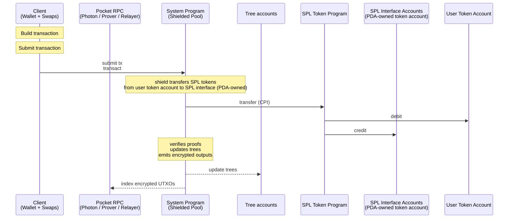
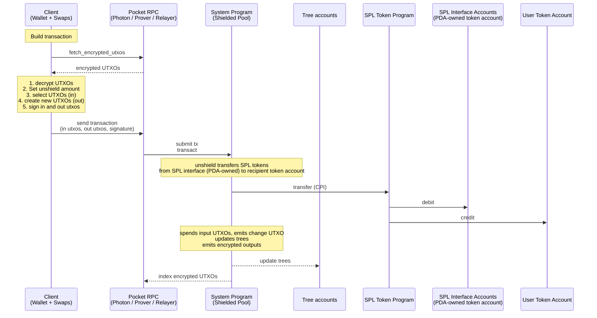
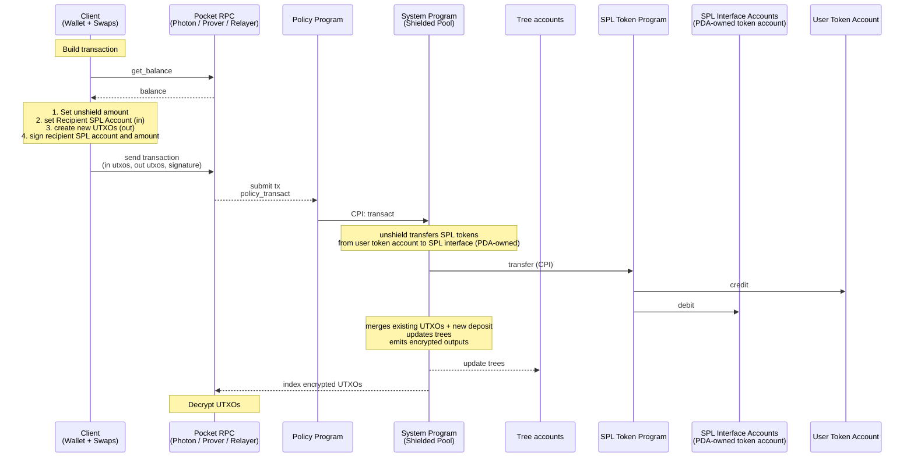
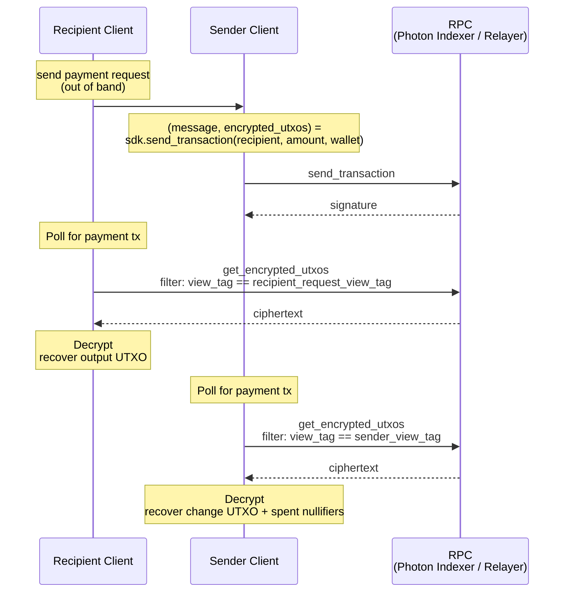

# Spec

## Table of Contents

- [Abstract](#abstract)
- [Architecture](#architecture)
  - [Operations](#operations)
    - [User](#user)
    - [Protocol](#protocol)
  - [Concurrency](#concurrency)
  - [Wallet](#wallet)
    - [Methods](#methods)
    - [State](#state)
    - [request_transfer](#request_transfer)
  - [Client SDK](#client-sdk)
    - [create_payment_request](#create_payment_request)
    - [send_transaction](#send_transaction)
  - [Default Pocket](#default-pocket)
    - [Shield with Proof](#shield-with-proof)
    - [Shield without Proof](#shield-without-proof)
    - [Transfer](#transfer)
    - [Unshield](#unshield)
  - [Policy Pockets](#policy-pockets)
    - [Shield with Proof](#shield-with-proof-1)
    - [Shield without Proof](#shield-without-proof-1)
    - [Transfer](#transfer-1)
    - [Unshield](#unshield-1)
    - [Enter and Exit Pocket](#enter-and-exit-pocket)
- [SPP Proof - Shielded Pool ZK Proof](#spp-proof---shielded-pool-zk-proof)
- [View Tags](#view-tags)
  - [Sender View Tag](#sender-view-tag)
  - [Recipient view tag](#recipient-view-tag)
  - [Derivations](#derivations)
- [Output UTXO Serialization](#output-utxo-serialization)
  - [Transfer](#transfer-2)
    - [Plaintext Layout](#plaintext-layout)
    - [Instruction Data Layout](#instruction-data-layout)
  - [UTXO Split](#utxo-split)
    - [Plaintext Layout](#plaintext-layout-1)
    - [Instruction Data Layout](#instruction-data-layout-1)
- [Transaction Viewing Key](#transaction-viewing-key)
- [SPP - Shielded Pool Program](#spp---shielded-pool-program)
  - [Accounts](#accounts)
  - [Instructions](#instructions)
    - [transact](#transact)
- [Policy Program Interface](#policy-program-interface)
- [RPC](#rpc)
  - [Photon Indexer](#photon-indexer)
  - [Pocket RPC](#pocket-rpc)
  - [Merge Service](#merge-service)
- [Notes](#notes)
- [User Flows](#user-flows)
  - [Request Payment Flow Default Pocket](#request-payment-flow-default-pocket)
  - [First Time Sync Wallet](#first-time-sync-wallet)

## Abstract

A Solana program for shielded transfers. Users retain custody and can disclose
per-transaction viewing keys on request. UTXOs can enter pockets; each pocket has
auditors, authorities, and a config (freeze authority, co-signer, permanent
delegate).

# Architecture


Source: [`diagrams/architecture.dot`](diagrams/architecture.dot). Regenerate with `just render-diagrams`.

1. Users — own wallets, build encrypted transactions, sign with P256.
2. Photon Indexer — indexes trees + encrypted UTXOs; default-pocket users fetch ciphertexts here.
3. Pocket RPC (with auditor) — RPC with auditor keys; decrypts and serves UTXOs to policy-pocket users.
4. Prover — generates Groth16 proofs. Users can generate client side proofs as well.
5. Relayer — fee-payer; submits transactions to SPP (default pocket) or to a Policy program (policy pocket).
6. Forester — drains the nullifier queue into the nullifier tree.
7. SPP (Shielded Pool Program) — verifies proofs, updates trees, moves SPL to and from the vaults.
8. Policy Programs (1..N) — config programs; verify policy proofs and CPI into SPP.
9. SPL interface vaults — per-mint SPL / Token-22 vaults holding all shielded tokens.
10. Tree accounts — co-located UTXO tree, nullifier tree, and nullifier queue.

Per-flow sequence diagrams are in the [User Flows](#user-flows) section below.


## Operations

### User

| # | Name | Description | Privacy |
| --- | --- | --- | --- |
| 1 | shield | Deposit SPL tokens into the shielded pool; existing UTXOs can be merged in the same transaction. | sender + amount visible; recipient hidden |
| 2 | proofless_shield | Public deposit without a proof. Allows shielding dynamic amounts, for example for the flow unshield, swap, shield. | fully public |
| 3 | unshield | Withdraw SPL tokens from the shielded pool to a public account. | sender hidden (relayer); recipient + amount visible |
| 4 | shielded transfer | Transfer value between shielded balances. | fully shielded (sender, recipient, amount) |

### Protocol

| # | Name | Description |
| --- | --- | --- |
| 1 | create_spl_interface | Initialize SPL/Token-22 pool escrow per token mint |
| 2 | create_tree | Initialize new Tree account (nullifier tree + queue and UTXO tree, co-located) |
| 3 | create_protocol_config | Initialize protocol config (pause authority) |
| 4 | update_protocol_config | Rotate protocol config authority |
| 5 | pause_tree | Freeze writes to a Tree account |


## Concurrency

1. A balance can be used concurrently when it is split up between a number of utxos.
2. To keep the balance spendable in one transaction we split it in up to X utxos

## Wallet

Signs transactions (P256 signature verified inside the SPP proof) and decrypts UTXOs encrypted to the user's pubkey.

Sender view tags index the sender's own change ciphertexts for sync and are inserted into the nullifier tree to guarantee single-use per `TxCount` slot. Recipient request view tags index incoming ciphertexts from payment requests and are not guaranteed single use.

**Seed secret derivations:**

`wallet_seed` is the BIP-39 mnemonic seed: `PBKDF2-HMAC-SHA512(mnemonic, "mnemonic" || passphrase, c=2048, dkLen=64)`.

1. P256 Keypair — derived from `wallet_seed` via BIP-32-style hierarchical derivation on the P-256 curve.
2. Nullifier Secret: `HKDF-SHA256(salt=∅, IKM=wallet_seed, info="zolana/nullifier", L=32)`
3. Sender View Tag Secret: `HKDF-SHA256(salt=∅, IKM=wallet_seed, info="zolana/sender_view_tag", L=32)`
4. Recipient View Tag Secret: `HKDF-SHA256(salt=∅, IKM=wallet_seed, info="zolana/recipient_view_tag", L=32)`
5. Ephemeral Secret: `HKDF-SHA256(salt=∅, IKM=wallet_seed, info="zolana/ephemeral", L=32)`

Counter sources for view-tag derivations:

- `get_sender_view_tag(tx_count)` — `TxCount`, advanced on every outgoing transaction.
- `get_recipient_request_view_tag(request_count)` — `RequestCount`, advanced on every `request_transfer`.
- `send_shared_view_tag(recipient_pubkey, i)` — `known_recipients[recipient_pubkey]`, advanced on every send to that recipient that uses this tag.
- `derive_shared_view_tag(sender_pubkey, i)` — `known_senders[sender_pubkey]`, advanced as the wallet's incoming scan for that sender consumes successive `i` values.

`get_ephemeral_keypair(first_nullifier)` is *not* counter-indexed; it is bound to the first nullifier of the transaction's spent inputs, so the keypair is deterministic given the input UTXO set and unique per on-chain transaction (nullifier uniqueness implies keypair uniqueness).

### Methods:
1. `sign_p256(msg)` — P256 ECDSA signature over `msg` with `self.owner_sk`; SHA-256 message digest per the ECDSA-P256 standard.
2. encrypt
3. decrypt
4. encrypt_poseidon
5. decrypt_poseidon
6. `get_sender_view_tag(tx_count)` — see [View Tags § Derivations](#view-tags).
7. `get_recipient_request_view_tag(tx_count)` — see [View Tags § Derivations](#view-tags).
8. `send_shared_view_tag(counterparty_pubkey, i)` — sender-side `recipient_shared_view_tag` derivation; see [View Tags § Derivations](#view-tags).
9. `derive_shared_view_tag(counterparty_pubkey, i)` — recipient-side `recipient_shared_view_tag` derivation; see [View Tags § Derivations](#view-tags).
10. request_transfer(`asset_mint`, `amount`, `pocket_program_id`, `expiry_unix_ts`, `memo`)
11. `get_ephemeral_keypair(first_nullifier)`:
    1. `seed64 := HKDF-SHA256(salt=first_nullifier, IKM=ephemeral_secret, info="zolana/ephemeral", L=64)`
    2. `ephemeral_sk := int(seed64) mod n` where `n` is the P-256 group order
    3. `ephemeral_pubkey := ephemeral_sk · G` (SEC1-compressed)
    4. `return (ephemeral_sk, ephemeral_pubkey)`

    `first_nullifier` is the nullifier of the first spent input UTXO in the transaction (lexicographic position 0 in the circuit's input slots). Schemes that encrypt always have at least one real spent input, so `first_nullifier` is always defined when this function is called. A shared-account variant MAY substitute a shared secret for `ephemeral_secret`; the input parameter (`first_nullifier`) is unchanged.
12. sync(`start_timestamp`)
  1. sync default pocket loop: derive 1k sender_view_tags, request encrypted utxos based on tags, repeat until no matches
  2. sync policy pockets loop: for every pocket request balance

### State:
1. `Utxos: Vec<Utxo>` (optional cache; can be rebuilt from sync).
2. `TxCount: u64` — outgoing transaction counter; indexes `get_sender_view_tag`.
3. `RequestCount: u64` — `request_transfer` counter; indexes `get_recipient_request_view_tag`.
4. `last_synced: Timestamp`
5. `known_senders: map<sender_pubkey → received_counter: u64>` — next index to scan in `derive_shared_view_tag(sender_pubkey, i)`. Populated lazily on first receipt from a new sender.
6. `known_recipients: map<recipient_pubkey → sent_counter: u64>` — next index to use in `send_shared_view_tag(recipient_pubkey, i)`. Populated lazily on first send to a new recipient.

### request_transfer

Builds a payment request that a recipient hands to a sender out of band. The sender uses `recipient_request_view_tag` to stamp the recipient's ciphertext so the recipient can pull the payment by exact byte match from the indexer (see [Request Payment Flow](#request-payment-flow)).

**Inputs**

```rust
fn request_transfer(
    /// Solana SPL / Token-22 mint pubkey.
    asset_mint: [u8; 32],
    /// In units of `asset_mint`.
    amount: u64,
    /// All-zero = default pocket.
    pocket_program_id: [u8; 32],
    /// Recipient's promise to honor the request until this time.
    expiry_unix_ts: u64,
    /// Application-defined; opaque to the protocol; UTF-8, max 1024 bytes.
    memo: String,
) -> PaymentRequest
```

**Algorithm**

1. `tx_count := state.TxCount`
2. `recipient_request_view_tag := get_recipient_request_view_tag(tx_count)`
3. `state.TxCount += 1`
4. `return PaymentRequest { version=0, recipient_pubkey, recipient_request_view_tag, pocket_program_id, asset_mint, amount, expiry_unix_ts, memo }`

`TxCount` is incremented unconditionally — even if the sender never pays. Reusing a nonce across two outstanding requests would let the indexer link them.

**Output: `PaymentRequest`**

Canonical big-endian byte layout. Packed, no length prefixes (`memo_len` precedes the variable-length `memo` tail).

```rust
/// 148 + memo.len() bytes total. Multi-byte integers are big-endian.
/// Wire format prefixes `memo` with its u16 BE byte length (0 if absent, max 1024).
struct PaymentRequest {
    /// Currently `0`.
    version: u8,
    /// P256 SEC1-compressed (1-byte prefix + 32 B X).
    recipient_pubkey: Address,
    recipient_request_view_tag: [u8; 32],
    /// All-zero = default pocket.
    pocket_program_id: Option<[u8; 32]>,
    /// Solana SPL / Token-22 mint pubkey.
    mint: Address,
    /// In units of `asset_mint`.
    amount: u64,
    expiry_unix_ts: u64,
    /// UTF-8; max 1024 bytes.
    memo: String,
}
```

## Client SDK

Higher-level methods built on top of [Wallet](#wallet) and [RPC](#rpc). The SDK does not touch the network; it assembles artifacts the caller submits via the RPC layer.

### create_payment_request

Recipient-side helper. Wraps [Wallet.request_transfer](#request_transfer) to produce a `PaymentRequest` for the recipient to share out of band with a prospective sender.

**Inputs**

```rust
fn create_payment_request(
    /// Solana SPL / Token-22 mint pubkey.
    asset_mint: [u8; 32],
    /// In units of `asset_mint`.
    amount: u64,
    /// `None` = default pocket.
    pocket_program_id: Option<[u8; 32]>,
    /// Request validity deadline.
    expiry_unix_ts: u64,
    /// Application-defined; UTF-8, max 1024 bytes.
    memo: Option<String>,
    /// Caller's wallet (see Wallet).
    wallet: &mut Wallet,
) -> PaymentRequest
```

**Algorithm**

1. `request := wallet.request_transfer(asset_mint, amount, pocket_program_id.unwrap_or(zero32), expiry_unix_ts, memo.unwrap_or(""))`
2. `return request`

**Output**

`PaymentRequest` — canonical 148 + `memo_len` byte layout (see [request_transfer](#request_transfer)).

**Notes**

1. Thin wrapper for API symmetry with [send_transaction](#send_transaction). The heavy lifting (nonce derivation, `TxCount` advance, byte layout) lives in [Wallet.request_transfer](#request_transfer).
2. The caller serializes the returned `PaymentRequest` to its canonical bytes and ships it OOB (QR, deeplink, NFC, messaging). Suggested base64-url encoding.
3. `wallet.TxCount` is advanced even if the request is never delivered or paid.

### send_transaction

Builds the SPP `transact` instruction data and the `encrypted_utxos` blob for a transfer. Encryption happens client-side; the wallet's `get_ephemeral_keypair` stays private to the SDK.

**Inputs**

```rust
fn send_transaction(
    /// Addressing info (see Recipient below).
    recipient: Recipient,
    /// In units of `recipient.asset_mint`.
    amount: u64,
    /// Caller's wallet (see Wallet).
    wallet: &mut Wallet,
) -> (Instruction, Vec<u8>)

struct Recipient {
    /// Recipient's P256 SEC1-compressed or Solana pubkey.
    pubkey: [u8; 33],
    /// Solana SPL / Token-22 mint pubkey.
    asset_mint: [u8; 32],
    /// Recipient-supplied view tag from a payment request; `None` triggers
    /// the unsolicited path (bootstrap or shared view tag — see View Tags).
    recipient_request_view_tag: Option<[u8; 32]>,
    /// `None` = default pocket.
    pocket_program_id: Option<[u8; 32]>,
}
```

**Algorithm**
0. check wallet is synced.
1. `asset_id := AssetRegistry[recipient.asset_mint]` (via SPP [Asset registry](#accounts)).
2. `tx_count := wallet.TxCount`; `wallet.TxCount += 1`.
3. `sender_view_tag := wallet.get_sender_view_tag(tx_count)`.
4. Select sender input UTXOs covering `amount` + fees from wallet state; compute `change_amount`.
5. Compute `first_nullifier` from the first selected input UTXO (lexicographic input position 0).
6. `(ephemeral_sk, ephemeral_pubkey) := wallet.get_ephemeral_keypair(first_nullifier)` (private).
7. Pick random 31-byte `change_blinding_seed` and `recipient_blinding`.
8. Build the recipient output: `(owner=recipient.pubkey, asset_id, amount, blinding_seed=recipient_blinding_seed)`.
9. Build the sender change output: `(owner=sender_pubkey, asset_id, amount=change_amount, blinding_seed=change_blinding_seed, nullifier_data)`.
10. Encrypt each ciphertext with `AES-GCM(key = KDF(ECDH(ephemeral_sk, owner_pubkey)), plaintext)`. The sender ciphertext's `view_tag` is `sender_view_tag` (carried in `transact` ix data, not repeated in the blob). Each recipient ciphertext's `view_tag` is selected per [View Tags § Recipient view tag selection](#view-tags); side effects on `wallet.known_recipients` are applied as specified there. Concatenate per the [Transfer](#transfer-1) layout into `encrypted_utxos`.
11. `recipient_binding := sign_p256(Sha256BE(recipient.nonce || recipient.pubkey || amount || recipient_blinding_seed))` — consumed by the SPP proof.
12. compute `private_tx_hash = Poseidon(input utxo hash chain, output utxo hash chain, external data hash, expiry_unix_ts)`
13. `signature := sign_p256(private_tx_hash)`
14. Fetch the ZK proof (via the prover RPC or client-side prover).
15. Assemble the SPP `transact` instruction (see [transact](#transact)): `expiry_unix_ts`, `sender_view_tag`, `proof`, `relayer_fee`, `output_utxo_hashes`, `nullifier_root_index`, `private_tx_hash`, `public_sol_amount`, `public_spl_amount`, `encrypted_utxos`.
16. `return (instruction, encrypted_utxos)`.

**Output**

| Field | Type | Notes |
| --- | --- | --- |
| `instruction` | `Instruction` | Solana Instruction that can be sent to a relayer |
| `encrypted_utxos` | `Vec<u8>` | the ciphertext blob (also embedded in `message`; returned separately for callers that index or preview ciphertexts) |

**Notes**
1. `wallet.TxCount` is advanced once per call regardless of whether the caller ultimately submits. How do eth wallets do it?

## Default Pocket

The default pocket is similar to zcash and has no policy.
Users invoke the SPP directly.
The merge service is optional and can be used for performance and improved UX.

### Shield with Proof


### Shield without Proof



### Transfer


### Unshield



## Policy Pockets

A logical grouping of UTXOs governed by a policy program. Each pocket has its own auditor, authorities, and config.

| # | Name | Description |
| --- | --- | --- |
| 1 | Non-Custodial | Pockets are non-custodial. Control remains with user; auditor reads all UTXOs but cannot sign or spend |
| 2 | Extended UTXO schema | Includes state + extension fields (pocket address, ...); extensions is any data that is not part of the standard UTXO schema |
| 3 | Enter Pocket | A pocket can be entered by shield from an SPL token account, the standard shielded pool, or another pocket in a shielded transfer |
| 4 | Exit Pocket | A pocket can be exited by unshield to an SPL token account, the standard shielded pool, or another pocket in a shielded transfer |
| 5 | Merge Service | Opt-in backend service that merges a user's UTXOs into fewer larger UTXOs (see [Merge Service](#merge-service) section below). |

**Notes:**

1. The pocket config is a compressed account so it can be used inside the `pocket_transact` UTXO proof without revealing which pocket the user is in. As a PDA it would require an extra public account, making the pocket visible.
    1. by extending the attestation program and adding a verifyingkey upload we can make a generalized policy program.

### Shield with Proof


### Shield without Proof


### Transfer


### Unshield



### Enter and Exit Pocket

1. Enter, shield or transfer from default pocket
2. Exit, unshield or transfer from policy pocket

# SPP Proof - Shielded Pool ZK Proof

**Public Inputs**

| Input | Source |
| --- | --- |
| nullifiers | derived in-circuit from spent input UTXOs |
| output_utxo_hashes | instruction data |
| nullifier_root | resolved from `nullifier_root_index` against on-chain root cache |
| private_tx_hash | instruction data |
| public_sol_amount | instruction data |
| public_spl_amount | instruction data |
| public_spl_asset_pubkey | derived by SPP from the vault token account's mint |
| ProgramIDHashchain | instruction data |
| SolanaPubkeyHash | `Sha256BE(solana_signer)` derived by SPP from `payer` |
| data_hash | instruction data |
| policy_data | instruction data |

**UTXO Hash**

| # | Name | Description |
| --- | --- | --- |
| 1 | domain |  |
| 2 | owner | Owner pubkey as PoseidonPubkey |
| 3 | asset_id | Sha256BE |
| 4 | asset_amount |  |
| 5 | blinding | 31 random bytes |
| 6 | data_hash | Application data hash unconstrained in SPP proof. |
| 7 | policy_data | Policy data hash unconstrained in SPP proof. |
| 8 | policy_program_id |  |

**Nullifier Hash**

Nullifier hash: `H(utxo_hash, randomized_nullifier_key)`

1. `randomized_nullifier_key = Poseidon(utxo_hash, nullifier_secret)`
2. `nullifier_secret` is the wallet-derived Nullifier Secret (see [Wallet](#wallet)).

**Checks**

| Check | Description |
| --- | --- |
| UTXO Ownership | Spent input UTXOs MUST be authorized by their owner, either with a P256 signature verified in circuit or a Solana signer checked by SPP. The P256 signature binds `sender_view_tag` and `expiry_unix_ts` alongside the input UTXOs to prevent prover replay. Pubkeys are encoded as Poseidon(pubkey_low, pubkey_high). |
| Inclusion | Spent input UTXOs MUST exist in the UTXO tree. |
| Nullifier non-inclusion | Input nullifiers MUST NOT exist in the nullifier tree before the transaction. |
| Nullifiers | Public nullifiers MUST be well formed from the spent input UTXOs. |
| Output UTXOs | Output UTXOs MUST be well formed and match the public output commitments. |
| Balance Conservation | For each active asset, inputs plus public deposits MUST equal outputs plus public withdrawals and fees. |
| Private transaction hash | `private_tx_hash = Poseidon(input utxo hash chain, output utxo hash chain, external data hash, expiry_unix_ts)`.<br>The owner signs this value (see [UTXO Ownership Check](#utxo-ownership-check)). Binds SPP, policy, and third-party proofs to the same transaction data, so all circuits prove statements about the same state transition. |
| Program ownership | UTXOs owned by a policy program MUST be authorized by a PDA signer of that program. Policy proofs are checked by the policy program before CPI into SPP. |
| Dummy input or output | ZK circuits are fixed size; dummy UTXOs allow a transaction to use fewer real inputs or outputs. Ownership, inclusion, nullifier non-inclusion, output, and balance checks are skipped for dummy UTXOs. |

**Utxo Ownership Check:**
1. Ed25519 Solana signer checked by SPP. Used when the input UTXO's owner is the Solana payer (shield path).
2. P256 signature over `private_tx_hash` verified in the SPP proof. Binds every input, every output, the external-data hash, and `expiry_unix_ts`, so the proof cannot be replayed with different state.

**Circuit Combinations**

| Circuit | Use | Shape |
| --- | --- | --- |
| 1 in 1 out | Shield with merge | 1 existing UTXO in, 1 combined output (existing balance + new deposit) |
| 1 in 2 out | Single-input transfer | 1 sender input UTXO, 1 recipient output, 1 change output; gas fees are sponsored |
| 3 in 3 out | Standard transfer | 1 SOL fee UTXO, 2 sender input UTXOs, 1 recipient output, 1 SPL change output, 1 SOL change output |
| 5 in 3 out | Higher concurrency | 1 SOL fee UTXO, 4 sender input UTXOs, 1 recipient output, 1 SPL change output, 1 SOL change output |
| 1 in 8 out | Split UTXO | Split 1 UTXO into up to 8 equal parts; equal parts reduce encrypted data |

# View Tags

A view tag is a 32-byte value attached to a ciphertext. Wallets sync by querying the indexer for exact view-tag matches and decrypt only their own transactions. Derivation splits into two cases — tags the sender derives for themselves to discover their own change UTXOs, and tags the sender derives for the recipient to discover incoming transfers.

For transfers, view tags need to be shared between the sender and recipient. A wallet cannot pre-derive shared tags for every possible sender. The wallet needs to know which senders to derive view tags for. The first transfer's tag bootstraps the relationship: either `recipient_request_view_tag` (recipient minted, shared out-of-band) or `recipient_bootstrap_view_tag = Sha256BE(recipient_pubkey)` (publicly linkable, no coordination). On decryption the recipient learns the sender's pubkey and derives the shared ECDH key; subsequent transfers from this sender use `recipient_shared_view_tag` and are found via `scan_view_tags`. `sender → recipient` and `recipient → sender` produce disjoint tags.

### Sender View Tag

1. **`sender_view_tag`**
  - Derived by: the sender, to index her change utxos.
  - Tx sent by: the sender
  - Indexed by: the sender

### Recipient view tag

2. **`recipient_shared_view_tag`**
    - Derived by: the sender and recipient independently. Sender via `send_shared_view_tag` to send the tx, the recipient via `derive_shared_view_tag` to index the tx.
    - Tx sent by: the sender.
    - Indexed by: the recipient.
3. **`recipient_request_view_tag`**
    - Derived by: the recipient. The recipient shares the tag with the sender out-of-band as a `PaymentRequest`.
    - Tx sent by: the sender.
    - Indexed by: the recipient. Once the recipient decrypts this transfer, subsequent transfers from the same sender can be indexed by `recipient_shared_view_tag`.
4. **`recipient_bootstrap_view_tag`**
    - Derived by: anyone — `Sha256BE(recipient_pubkey)`.
    - Tx sent by: the sender.
    - Indexed by: the recipient. Once the recipient decrypts this transfer, subsequent transfers from the same sender can be indexed by `recipient_shared_view_tag`.


"Prior transfer with recipient?" is decided by `recipient_pubkey ∈ wallet.known_recipients`.

**Sender-side side effects on `wallet.known_recipients[recipient_pubkey]`:**

- Case 2 (`recipient_shared_view_tag`): use `i = known_recipients[recipient_pubkey]`, then `known_recipients[recipient_pubkey] += 1`.
- Case 3 (`recipient_request_view_tag`): if absent, insert `known_recipients[recipient_pubkey] = 0`. No increment.
- Case 4 (`recipient_bootstrap_view_tag`): if absent, insert `known_recipients[recipient_pubkey] = 0`. No increment.

### Derivations

`get_sender_view_tag(tx_count)`:

```
HKDF-SHA256(
    salt = ∅,
    IKM  = sender_view_tag_secret,
    info = "zolana/sender_view_tag/" || u64_be(tx_count),
    L    = 32,
)
```

`get_recipient_request_view_tag(tx_count)`:

```
HKDF-SHA256(
    salt = ∅,
    IKM  = recipient_view_tag_secret,
    info = "zolana/recipient_request_view_tag/" || u64_be(tx_count),
    L    = 32,
)
```

`recipient_shared_view_tag(counterparty_pubkey, i)` — two chained HKDFs over the ECDH shared secret. Sender computes it as `send_shared_view_tag`; recipient computes the same byte value as `derive_shared_view_tag`:

```
shared := ECDH(self.owner_sk, counterparty_pubkey)
domain := HKDF-SHA256(salt = ∅, IKM = shared,
                     info = "zolana/pair-domain/" || R_pubkey, L = 32)
return    HKDF-SHA256(salt = ∅, IKM = domain,
                     info = "zolana/pair-hint/"   || u64_be(i), L = 32)
```

`R_pubkey` is the recipient of the direction:

- Sender side (`send_shared_view_tag`): `R_pubkey = counterparty_pubkey`.
- Recipient side (`derive_shared_view_tag`): `R_pubkey = self.owner_pubkey`.

ECDH symmetry plus the matched direction label produces the same byte value across the pair.

`recipient_bootstrap_view_tag(recipient_pubkey)`:

```
Sha256BE(recipient_pubkey)
```

SHA-256 of the recipient's SEC1-compressed P256 pubkey (1-byte prefix + 32 B X).


# Output UTXO Serialization

Defines the layout of the `encrypted_utxos` blob carried by shielded transactions. SPP treats the blob as opaque; serialization is a default-pocket convention. Policy pockets define their own.

Both schemes apply AES-GCM encryption; keys are derived per recipient via `ECDH(ephemeral_sk, owner.pubkey)`. One `ephemeral_pubkey` is shared across all recipients in a transaction. The sender derives `(ephemeral_sk, ephemeral_pubkey)` from `get_ephemeral_keypair(first_nullifier)` (see [Wallet](#wallet)). Nullifier uniqueness on-chain implies a unique ephemeral keypair per transaction. Encryption is always sender-side. Slot prefixes (`view_tag`) are view tag values; see [View Tags](#view-tags).

Two schemes:

1. Transfer — confidential value movement; per-recipient AES-GCM bundles.
2. UTXO Split — one ciphertext for M equal-amount outputs under the same owner.

## Transfer

Confidential value transfer. One AES-GCM ciphertext per owner: one for the sender's change, `R` for the recipients. Variables used below: `R` = recipient count, `N` = spent-input count.

The recipient ciphertext additionally carries `sender_pubkey` so the recipient can bootstrap the [View Tags](#view-tags) pair key exchange. The sender change ciphertext carries `nullifier_data`: one `randomized_nullifier_key` per spent input. The wallet re-derives the same value for each owned utxo and intersects to mark spent utxos during sync; the optional senders indexer uses the field to link spends.

### Plaintext Layout

Fields packed in declaration order with no length prefixes (the variable-length tail in the sender bundle is sized from `N`, known from the [transact](#transact) instruction).

#### Recipient

```rust
/// 114 B plaintext → 130 B ciphertext (after the 16-byte GCM tag).
struct TransferRecipientPlaintext {
    /// Recipient pubkey (1-byte prefix + P256 SEC1-compressed).
    owner_pubkey: [u8; 34],
    /// Sender's owner pubkey; bootstraps the View Tags pair key exchange.
    sender_pubkey: [u8; 33],
    /// `1` for SOL; SPL via per-mint Asset registry (`asset_id ≥ 2`).
    asset_id: u64,
    /// In units of `asset_id`.
    amount: u64,
    /// Random blinding for the single output.
    blinding: [u8; 31],
}
```

#### Sender

The sender change bundle carries two outputs (SPL change + SOL change). Per-output blindings derive from a single seed:

```
blinding_i = Sha256BE(blinding_seed || u8(position_i))
```

with `position = 0` for the SPL output and `position = 1` for the SOL output.

```rust
/// 89 + 32*N B plaintext → 105 + 32*N B ciphertext (after the 16-byte GCM tag).
struct TransferSenderPlaintext {
    /// Sender's owner pubkey (1-byte prefix + P256 SEC1-compressed).
    owner_pubkey: [u8; 34],
    /// Per-mint Asset registry; `0` if no SPL change.
    spl_asset_id: u64,
    /// `0` if no SPL change.
    spl_amount: u64,
    /// `0` if no SOL change.
    sol_amount: u64,
    /// Seed for the two per-output blindings (formula above).
    blinding_seed: [u8; 31],
    /// `randomized_nullifier_key` per spent input.
    nullifier_data: Vec<[u8; 32]>,
}
```

### Instruction Data Layout

The bytes the sender writes into the `encrypted_utxos` field of the [transact](#transact) instruction. Fields are packed in declaration order with no length prefixes.

```rust
/// Total size: 36 + (105 + 32*N) + 162*R bytes.
struct TransferEncryptedUtxos {
    /// Discriminator (TRANSFER).
    type_prefix: u8,
    /// Shared P256 pubkey for ECDH key derivation (1-byte prefix + SEC1-compressed).
    ephemeral_pubkey: [u8; 34],
    /// Number of recipient_slots that follow ciphertext_sender. Equals R.
    num_recipients: u8,
    /// Sender change bundle ciphertext: 89 + 32*N bytes plaintext + 16-byte GCM tag.
    /// View tag for this ciphertext is `sender_view_tag` from the transact
    /// instruction data, not carried in this blob.
    ciphertext_sender: Vec<u8>,
    /// R recipient slots packed back-to-back.
    recipient_slots: Vec<RecipientSlot>,
}
```

#### Recipient slot

```rust
/// 162 bytes total.
struct RecipientSlot {
    /// View tag value; see View Tags chapter for the four variants and selection rules.
    view_tag: [u8; 32],
    /// 114-byte recipient plaintext + 16-byte GCM tag.
    ciphertext: [u8; 130],
}
```

#### Sender

The sender ciphertext sits inline at offset 36 with no slot wrapper. Its view tag is `sender_view_tag`, carried in the [transact](#transact) instruction data — not in `encrypted_utxos`.

#### Sizes

`R` = number of recipients, `N` = number of spent inputs.

Total: `36 + 105 + 32·N + 162·R` bytes. Standard single-recipient transfer: `R = 1`, total `303 + 32·N`.

Blob size by recipient count (single-input transfer, `N = 1`; total = `173 + 162·R`):

| R | Bytes |
| --- | --- |
| 1 | 335 |
| 2 | 497 |
| 4 | 821 |
| 8 | 1469 |

## UTXO Split

All M outputs share owner, amount, and asset, so a single ciphertext encodes them. Each output UTXO derives a unique blinding from the blinding seed:

```
blinding_i = Sha256BE(blinding_seed || u8(i))
```

for `i = 0 .. M-1`.

### Plaintext Layout

```rust
/// 82 B plaintext → 98 B ciphertext (after the 16-byte GCM tag).
struct SplitBundlePlaintext {
    /// Shared owner of all M outputs (1-byte prefix + P256 SEC1-compressed).
    owner_pubkey: [u8; 34],
    /// M — number of equal-amount outputs.
    num_outputs: u8,
    /// `1` for SOL; SPL via per-mint Asset registry (`asset_id ≥ 2`).
    asset_id: u64,
    /// Shared across all M outputs.
    asset_amount: u64,
    /// Seed for the M per-output blindings (formula above).
    blinding_seed: [u8; 31],
}
```

### Instruction Data Layout

```rust
/// 133 bytes total. Packed, no length prefixes.
/// Owner-side view tag is `sender_view_tag` from the transact instruction data
/// (all M outputs share the sender as owner).
struct SplitEncryptedUtxos {
    /// Discriminator (SPLIT).
    type_prefix: u8,
    /// Shared P256 pubkey for ECDH key derivation (1-byte prefix + SEC1-compressed).
    ephemeral_pubkey: [u8; 34],
    /// 82-byte plaintext + 16-byte GCM tag.
    ciphertext: [u8; 98],
}
```

# Transaction Viewing Key

Every ciphertext in a transaction is encrypted under a single empheral key so that the secret key of the emphemeral key can decrypt both the senders change and recipient utxos of the transaction.

**Properties**

- **Scope**: one transaction.
- **Read-only**: viewing keys grant decryption only.
- **Derivable on demand**: viewing keys are derived on demand from the shielded transaction with `get_ephemeral_keypair(first_nullifier)`.

# SPP - Shielded Pool Program

## Accounts

| Account | Description |
| --- | --- |
| Tree account | Contains the nullifier tree (`light-batched-merkle-tree`, H=40), nullifier queue, and UTXO tree (sparse Merkle tree, H=26). |
| SPL interface vault | Per-mint SPL / Token-22 vault holding all shielded SPL tokens. |
| Asset registry | PDA derived from the mint, set at `create_spl_interface` time. Stores the `asset_id: u64` assigned to that mint (used as the compact asset identifier inside UTXOs and ciphertexts). `asset_id = 1` is reserved for native SOL and has no `Asset registry` entry; SPL mints get `asset_id ≥ 2`. |
| Asset counter | Singleton account holding the monotonic `next_asset_id: u64`. Initialized to `2` (since `1` is reserved for SOL) and incremented on each `create_spl_interface`. |
| Protocol config | Singleton account; pause authority and protocol-wide settings. |

## Instructions

| Instruction | Description |
| --- | --- |
| transact | Tag 0; carries shield/unshield/shielded transfer; verifies proofs, updates trees |
| proofless_shield | Tag 1; public deposit; hashes UTXO and inserts into UTXO tree |
| pocket_transact | Tag 2; carries shield/unshield/shielded transfer; verifies proofs, updates trees; verifies encrypted UTXOs are properly encrypted to pocket auditor + recipients |
| pocket_authority_transact | Tag 3; proves correctness of a state transition by a pocket authority (freeze, thaw, transaction with permanent delegate, ...) |
| create_spl_interface | Tag 6; admin; reads + bumps the `Asset counter`, creates the per-mint SPL interface vault and writes the assigned `asset_id` into the per-mint `Asset registry` PDA. |
| create_tree | Tag 7; admin; initializes the shared Tree account (nullifier tree + queue, UTXO tree) |
| create_protocol_config | Tag 9; admin |
| update_protocol_config | Tag 10; admin |
| pause_tree | Tag 11; admin can pause and unpause trees |
| create_pocket_config | Tag 12; creates a new pocket config; fields: owner, pocket_authority_transact_is_enabled |
| update_pocket_config_owner | Tag 13; transfers ownership of a pocket config; only callable by current owner. TBD: spec out semantics. |
| update_pocket_config | Tag 14; toggles whether pocket_authority_transact_is_enabled is enabled. If disabled and the config owner is burned, the policy program cannot rug the user (no permanent delegate). |

### `transact`

**Discriminator:** 0

**Description.** Implements shield, unshield, or shielded transfer. Verifies the proof, nullifies input UTXOs by inserting nullifiers into the nullifier queue, and appends output UTXOs to the UTXO tree.

**Accounts**

| # | Name | W | S | Notes |
| --- | --- | --- | --- | --- |
| 1 | tree_account | x |   | nullifier queue + nullifier tree + UTXO tree |
| 2 | payer |   | x | relayer (transfer/unshield) or user (shield) |

**Instruction data**

`M` = number of output UTXOs, `N` = number of spent inputs.

```rust
struct TransactIxData {
    /// Unix timestamp in seconds.
    expiry_unix_ts: u64,
    /// View tag from sender's `get_sender_view_tag(tx_count)` (see Wallet);
    /// signed alongside the input UTXOs (prover-replay protection) and
    /// inserted into the nullifier tree (reuse protection).
    sender_view_tag: [u8; 32],
    /// Compressed Groth16 proof.
    proof: [u8; 192],
    /// Zero on shield (payer = user).
    relayer_fee: u16,
    /// One per output; appended to the UTXO tree. Length M.
    output_utxo_hashes: Vec<[u8; 32]>,
    /// Ref into nullifier-tree root cache. Length N.
    nullifier_root_index: Vec<u16>,
    /// Poseidon(input utxo hash chain, output utxo hash chain,
    /// external data hash, expiry_unix_ts). Public input to the SPP proof;
    /// the owner's P256 signature over this value is verified in-circuit.
    private_tx_hash: [u8; 32],
    /// `Some` for shield/unshield SOL, `None` for shielded transfer.
    public_sol_amount: Option<u64>,
    /// `Some` for shield/unshield SPL, `None` for shielded transfer.
    public_spl_amount: Option<u64>,
    /// Opaque ciphertext blob; not checked by the program.
    /// Layout per Output UTXO Serialization.
    encrypted_utxos: Vec<u8>,
}
```

Size by circuit shape (total tx size, ciphertext included)\*:

| Circuit | N (nullifiers) | M (output utxo hashes) | ciphertext (B) | tx overhead (B)\*\* | shield / unshield (B) | transfer (B) |
| --- | --- | --- | --- | --- | --- | --- |
| 1 in 1 out | 1 | 1 | 51 | 206 | 641 | — |
| 1 in 2 out | 1 | 2 | 335 | 206 | 957 | 875 |
| 3 in 3 out | 3 | 3 | 399 | 206 | 1057 | 975 |
| 5 in 3 out | 5 | 3 | 463 | 206 | 1125 | 1043 |
| 1 in 8 out | 1 | 8 | 133 | 206 | 947 | 865 |

\* `private_tx_hash` is 32 B. Transfer ciphertext sizes assume `R = 1` recipient, per the [Output UTXO Serialization § Transfer](#transfer-2) layout. Add 162 B per extra recipient.
\*\* assumes ALT for `tree_account`, `payer` and `program_id` inline; overhead = 64 (signature) + 3 (message header) + 65 (inline account keys: compact-u16 count + 2 × 32-byte pubkeys for `payer` and `program_id`) + 32 (recent blockhash) + 36 (ALT section: compact-u16 count + 32-byte ALT pubkey + writable count + writable index + readonly count) + 6 (instruction body: program_id_index + account_indices + data_len_varint). Shield/unshield totals add 66 B (`+64` for inline `user_spl_token_account` and `vault_spl_token_account` pubkeys, `+2` for their indices in the instruction body) because these accounts vary per transaction and cannot be served from the ALT.

**Checks**

1. `current_unix_ts <= expiry_unix_ts` (Solana `Clock.unix_timestamp`)
2. Each `nullifier_root_index` references a non-stale root.
3. `tree_account` is not paused.
4. Proof verifies against public inputs.
5. Append each `output_utxo_hashes[i]` to the UTXO sparse Merkle tree.
6. Insert each nullifier into the nullifier queue.
7. Insert `sender_view_tag` into the nullifier queue. Rejects on duplicate, which guarantees each sender `tx_count` slot is used at most once on-chain. The wallet is trusted to use the same value to prefix the sender's change ciphertext in `encrypted_utxos`; SPP does not check the ciphertext.
8. If `public_sol_amount` is `Some`, transfer `public_sol_amount + relayer_fee` lamports of SOL between `payer` and the pool (shield: payer → pool; unshield: pool → recipient). The `relayer_fee` portion compensates the relayer.
9. If `public_spl_amount` is `Some`, CPI the token program to transfer SPL between the user and the vault token account (shield: user → vault; unshield: vault → recipient).

# Policy Program Interface

**Accounts**

Accounts can be Solana or compressed accounts.

| # | Name | Description |
| --- | --- | --- |
| 1 | Pocket config | Configures authorities and features of a pocket |
| 2 | User config | Configures a shared encryption key |

**Instructions**

A policy program is free to implement the following instructions and more. Tags are local to each policy program.

| Instruction | Description |
| --- | --- |
| transact | Tag 0; verify policy proof, CPI SPP `pocket_transact` |
| proofless_shield | Tag 1; public deposit; no encryption; CPI SPP `proofless_shield` |
| authority_transact | Tag 3; proves correctness of a state transition by a pocket authority (freeze, thaw, transaction with permanent delegate, ...). Merge UTXOs on behalf of the user. Pocket authority has full access to all UTXOs owned by the pocket. The access is constrained by the policy program implementation. CPI SPP `pocket_authority_transact` |
| create_pocket_config | Tag 4; admin: creates account for a pocket; the config is public, sets auditor P256 key, pocket authority, freeze authority, permanent authority, co-signer |
| update_pocket_config | Tag 5; admin: pocket authority updates the pocket config |

**Notes:**

1. If the recipient does not have a config account the output UTXO is encrypted to the recipient.

# RPC

All RPC services can be run independently. RPC providers can offer the endpoints of the services in a bundled API.

## Photon Indexer

The rpc or pocket rpc have two purposes providing balance information and sending transactions.

**Methods:**

1. get_encrypted_utxos
2. get_transaction_ciphertexts
3. get_proof
4. send_transaction

    The client selects input UTXOs, computes `private_tx_hash = Poseidon(input utxo hash chain, output utxo hash chain, external data hash, expiry_unix_ts)`, signs it, and either builds the proof locally or ships the witness to a stateless prover. Self-custody is guaranteed by the ZK proof binding `private_tx_hash` to every input, every output, the external-data hash, and `expiry_unix_ts`.

**Storage: `shielded_utxos`**

One row per ciphertext, sourced from either:

- the `encrypted_utxos` blob of a `transact` / `pocket_transact` instruction (one row per recipient slot, plus one for the sender change), or
- the `proofless_shield` instruction (one row per deposited output; `view_tag = NULL`, `ciphertext = NULL`, owner and amount are read from instruction data with `blinding = 0` inferred).

Spend state is intentionally absent: UTXOs are private and the indexer cannot link nullifier insertions back to UTXOs. Users derive their own spent set client-side after decrypting (sender change ciphertexts carry the `randomized_nullifier_key` of each spent input in `nullifier_data: [u8;32] × N`).

UTXO tree leaves and Merkle witnesses live in the existing `state_trees` table
and are joined back from `shielded_utxos.leaf_indices`.

```sql
CREATE TABLE shielded_utxos (
    id                BIGSERIAL PRIMARY KEY,
    slot              BIGINT     NOT NULL,                  -- from Blocks
    tx_signature      BYTEA(64)  NOT NULL,
    tx_index          INT        NOT NULL,                  -- within slot
    ciphertext_index  SMALLINT   NOT NULL,                  -- 0 = sender bundle for transfers
    scheme            SMALLINT   NOT NULL,                  -- 0=transfer, 1=split, 2=proofless_shield
    tree              BYTEA(32)  NOT NULL,                  -- Tree account pubkey
    pocket_program_id BYTEA(32),                            -- NULL = default pocket
    leaf_indices      BIGINT[]   NOT NULL,                  -- UTXO tree leaves this ciphertext describes
    ephemeral_pubkey  BYTEA(34),                            -- schemes 0 and 1 only
    view_tag          BYTEA(32),                            -- see View Tags chapter
    ciphertext        BYTEA                                  -- NULL for proofless_shield
);
```

`get_encrypted_utxos(filters: [(offset, values: Vec<bytes>)], cursor, limit)`
maps each byte filter to an indexed column above based on `(scheme, offset)`.
`values` is a non-empty list — the column matches if it equals **any** of the
listed values (SQL `IN`). Multiple filters on **different** columns are
intersected (AND). Filters on unindexed offsets MAY be rejected. Servers MUST
accept at least 10 000 values per filter on `view_tag`; larger
batches MAY be rejected with a documented limit.

`get_transaction_ciphertexts(tags: Vec<[u8; 32]>)` returns, for every transaction with at least one ciphertext whose `view_tag` matches one of `tags`, all `shielded_utxos` rows of that transaction ordered by `(tx_signature, ciphertext_index)`. Servers MUST accept at least 10 000 tags per call. Sync uses this in place of `get_encrypted_utxos` so a single round trip returns both the matched ciphertext and its sibling recipient slots — letting the wallet derive `ephemeral_sk` from the spent inputs and decrypt the siblings to discover the recipients of its own outgoing transactions, without a second fetch.

## Pocket RPC

**Methods:**

1. get_decrypted_utxos
2. get_balance
3. get_instruction (for shield the user must sign directly)

## Merge Service

The shielded pool program has merge service registry accounts. Users can whitelist one or more merge service accounts (opt-in).

**Enable merge service,** a user creates a nullifier H(user_pubkey, merge_service_pda) in a dedicated merge service tree.

**Merge UTXOs,** a merge service proves that a nullifier exists and that the user utxos are merged and encrypted correctly.

**Disable merge service**, user removes nullifier from merge service tree.

**Caveats:**

1. The merge service needs to be able to decrypt user UTXOs.

**Questions:**

1. How is merge service paid?
(You don't want to pay based on tx that creates weird incentives.)

# Notes

1. policy pockets can only be entered and exited from and to the default pocket
2. by default every pocket that is deployed creates a new program, later we can deploy a standard pocket program that has a set of extensions.
3. **We need to expose nullifier data with the encrypted utxos so that the RPC knows which utxos were spent based on decrypted outputs**
4. By publishing the cleartext output utxo data we would essentially do compressed token transfers.

# User Flows

## Request Payment Flow Default Pocket

Recipient-pull flow. The recipient supplies a one-time `view_tag` that the sender stamps onto the recipient's ciphertext, so the recipient can pull the payment by exact byte-match instead of grinding every transfer.



Notes:

1. The payment request is transferred out of band (QR code, deeplink, message). Zolana does not standardize this channel.
2. The sender's `view_tag` is independent from the recipient's — they come from different per-wallet view-tag secrets.
3. Without a payment request, the recipient has no `view_tag` to filter on and would have to fetch every transfer ciphertext since their cursor. Unsolicited transfers in this scheme are unsupported.


## First Time Sync Wallet

Restores `Utxos`, `TxCount`, `RequestCount`, `known_senders`, `known_recipients`, and `last_synced` from a BIP-39 mnemonic.

1. **Derive secrets** from the mnemonic: `owner_sk`, `nullifier_secret`, `sender_view_tag_secret`, `recipient_view_tag_secret`, `ephemeral_secret`.

2. **Phase 1 — scan own view tags (concurrent).**
   1. **Fetch loop** concurrently, in batches of 10 000 until first empty batch.
    1. `get_transaction_ciphertexts([sender_view_tag(i), recipient_request_view_tag(i)])` — returns the matched ciphertexts plus their sibling recipient slots in one call.
    2. fetch ciphertexts tagged with `recipient_bootstrap_view_tag`.
    3. fetch ciphertexts or decrypted UTXOs from every known policy-pocket RPC.
    4. fetch proofless shields cleartext UTXOs.
  2. **Decrypt and store.** For each ciphertext, decrypt with tx's ephemeral keypair, store the UTXOs and their `nullifier_data`.

3. **Phase 2 — scan known_senders and known_recipients view tags (concurrent).**
   1. **Fetch loop** concurrently, in batches of 10 000 until first empty batch.
    1. for each known sender `s`, fetch ciphertexts tagged with `derive_shared_view_tag(s, i)`.
    2. for each known recipient `r`, fetch ciphertexts tagged with `send_shared_view_tag(r, i)`.
   2. **Decrypt and store.** Decrypt and store UTXOs, and repeat 3.1.1 for any newly discovered senders.

4. **Mark spent utxos.** Mark each UTXO whose `randomized_nullifier_key` appears in any stored `nullifier_data` as spent.

5. **Set wallet state**: `Utxos`, `known_senders`, `known_recipients`, `TxCount = max(observed sender_view_tag index) + 1`, `RequestCount = max(observed recipient_request_view_tag index) + 1`, `last_synced = current_timestamp()`.

**Sync Time Estimates**

Assumptions:

1. Indexer request size: `10 000` view tags per `view_tag IN (...)` query.
2. Indexer RTT: 100 ms.
3. ECDH P-256 per ciphertext: 100 μs.
4. Phase 1 scans (`sender_view_tag`, `recipient_request_view_tag`, `recipient_bootstrap_view_tag`) run concurrently.
5. Phase 2.1 per-sender scans and Phase 2.2 per-recipient scans run concurrently.
6. Each known sender has < 10 000 incoming transfers (2.1 fits in one batch + one confirm); each known recipient has < 10 000 outgoing transfers (2.2 same).

| Tx history | Known senders | Phase 1 RTTs | Phase 2 RTTs | Total RTTs | Decrypt (sequential) | Total (sequential) | Total (parallel, ≥10 threads) |
| --- | --- | --- | --- | --- | --- | --- | --- |
| 10 | 1 | 2 | 2 | 4 | < 1 ms | ~400 ms | ~400 ms |
| 1 000 | 100 | 2 | 2 | 4 | ~100 ms | ~500 ms | ~400 ms |
| 10 000 | 1 000 | 2 | 2 | 4 | ~1 s | ~1.4 s | ~500 ms |
| 100 000 | 10 000 | 11 | 2 | 13 | ~10 s | ~11 s | ~1.5 s |
| 1 000 000 | 100 000 | 101 | 2 | 103 | ~100 s | ~110 s | ~12 s |


# TODO:
2. add merge delegate to utxo hash, merge circuit, merge user flow.
3. Add PSP to architecture diagram
4. add swap user flow (unshield, swap, shield)
5. add private zk swap user flow
6. add registry docs, registry pda should include a hint whether whats the latest tx count. Updating the pda will leak some information though you can correlate activity. The wallet should store this so that we can fetch backwards.
