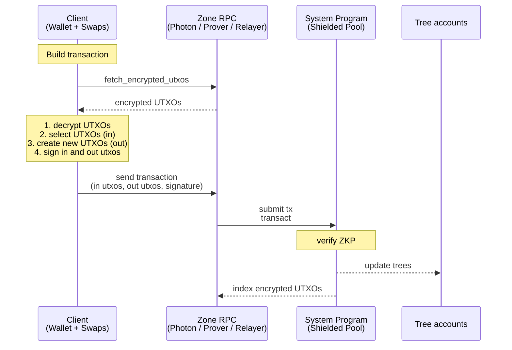
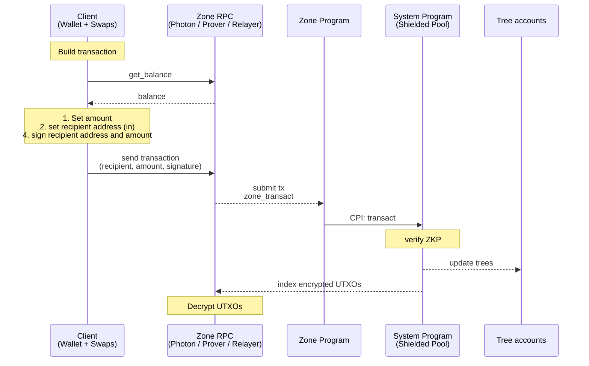
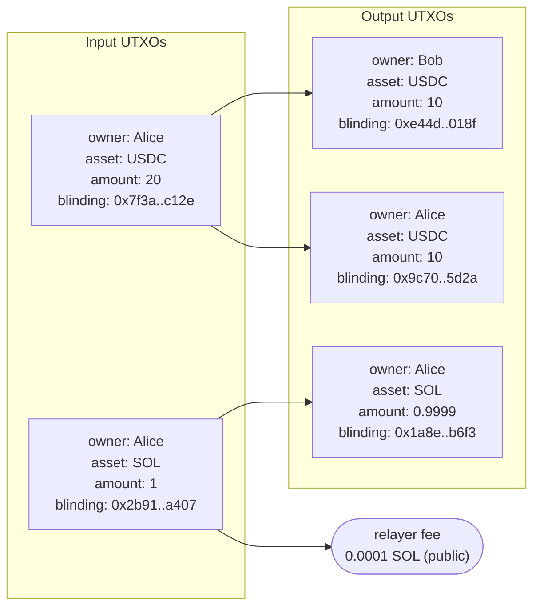

# Spec

## Table of Contents

- [Abstract](#abstract)
- [Architecture](#architecture)
  - [Operations](#operations)
    - [User](#user)
    - [Protocol](#protocol)
    - [Zone Creator](#zone-creator)
    - [Merge Service](#merge-service)
  - [Concurrency & Balance Fragmentation](#concurrency--balance-fragmentation)
  - [Default Zone](#default-zone)
  - [Policy Zones](#policy-zones)
- [Glossary](#glossary)
- [Shielded Address](#shielded-address)
- [Signing Key](#signing-key)
- [Nullifier Key](#nullifier-key)
- [ViewingKey](#viewingkey)
  - [Derived secrets](#derived-secrets)
  - [Transaction Viewing Key](#transaction-viewing-key)
  - [View Tags](#view-tags)
    - [Sender View Tag](#sender-view-tag)
    - [Recipient view tag](#recipient-view-tag)
    - [Merge view tag](#merge-view-tag)
    - [View Tag Selection](#view-tag-selection)
  - [Methods](#methods)
- [UTXO](#utxo)
  - [UTXO Hash](#utxo-hash)
  - [Nullifier](#nullifier)
- [Output UTXO Serialization](#output-utxo-serialization)
  - [Program Data](#program-data)
  - [Transfer](#transfer-2)
    - [Plaintext Layout](#plaintext-layout)
    - [Instruction Data Layout](#instruction-data-layout)
  - [UTXO Split](#utxo-split)
    - [Plaintext Layout](#plaintext-layout-1)
    - [Instruction Data Layout](#instruction-data-layout-1)
  - [Merge](#merge)
    - [Plaintext Layout](#plaintext-layout-2)
    - [Instruction Data Layout](#instruction-data-layout-2)
- [SPP Proof - Solana Privacy ZK Proof](#spp-proof---solana-privacy-zk-proof)
- [Merge Proof - Merge ZK Proof](#merge-proof---merge-zk-proof)
- [SPP - Solana Privacy Program](#spp---solana-privacy-program)
  - [Accounts](#accounts)
    - [Zone Accounts](#zone-accounts)
  - [Instructions](#instructions)
    - [transact](#transact)
    - [merge_transact](#merge_transact)
    - [merge_zone](#merge_zone)
- [Zone Program Interface](#zone-program-interface)
- [ZK Program Interface](#zk-program-interface)
- [RPC](#rpc)
  - [Indexer](#indexer)
    - [get_encrypted_utxos_by_tags](#get_encrypted_utxos_by_tags)
    - [get_shielded_transactions_by_tags](#get_shielded_transactions_by_tags)
    - [subscribe_to_shielded_transactions_by_tags](#subscribe_to_shielded_transactions_by_tags)
    - [get_merkle_proofs](#get_merkle_proofs)
    - [get_non_inclusion_proofs](#get_non_inclusion_proofs)
  - [Prover](#prover)
  - [Relayer](#relayer)
  - [Zone RPC](#zone-rpc)
    - [get_decrypted_utxos_by_owner](#get_decrypted_utxos_by_owner)
    - [get_decrypted_transactions_by_owner](#get_decrypted_transactions_by_owner)
    - [subscribe_to_decrypted_transactions_by_owner](#subscribe_to_decrypted_transactions_by_owner)
  - [Merge Service](#merge-service-1)
  - [Registry](#registry)
    - [Record](#record)
    - [Operations](#operations-1)
      - [`get_record`](#get_record)
      - [`register`](#register)
      - [`set_delegate`](#set_delegate)
      - [`rotate_delegate_key`](#rotate_delegate_key)
      - [`revoke`](#revoke)
      - [`close`](#close)
  - [Sync Delegate](#sync-delegate)
- [User Flows](#user-flows)
  - [First Time Sync Wallet](#first-time-sync-wallet)
  - [Merge Flow](#merge-flow)
  - [Transfer User Flows](#transfer-user-flows)
    - [Privacy Guarantee Matrix](#privacy-guarantee-matrix)

## Abstract

The solana privacy protocol (TSPP) enables programmable, UTXO-based anonymous transfers that execute directly on Solana, and supports private DeFi and institutional compliance. UTXO balances are backed by SPL and Token-2022 tokens, viewing keys provide selective disclosure, and view tags enable wallet sync at Solana speed.

Anonymous transfers are performed by a minimal Solana Privacy Program (SPP) that enforces UTXO state transitions with a zero knowledge proof (ZKP). To enable private DeFi, third-party programs can own UTXOs similar to how Solana programs can own accounts and implement custom private logic in a separate ZKP to escrow funds privately. For tailored compliance, institutions can implement zones with custom zone programs, for example with configurable auditors, authorities, freeze authority, co-signer, and permanent delegate.

For wallet sync at Solana RPC speed, view tags prefix every encrypted UTXO so wallets and indexers locate relevant outputs without trial decryption.

For compatibility with Solana addresses, a registry maps Solana addresses to shielded addresses and delegate keys, so a sender holding only a recipient's Solana address can pay them privately.

Two opt-in services improve user experience. A merge authority consolidates fragmented balances without per-merge wallet signatures. A sync delegate watches view tags and surfaces relevant transactions to lightweight wallet implementations without local decryption.

The document specifies the key derivation, UTXO layout, SPP accounts and instructions, the zone program interface, the ZK program interface, the ZK circuits, the indexer / prover / relayer / zone RPC / merge service / registry interfaces, and user flows.

# Architecture


Source: [`diagrams/architecture.dot`](diagrams/architecture.dot). Regenerate with `just render-diagrams`.

1. Users — own wallets, build encrypted transactions, sign with P256.
2. Photon Indexer — indexes trees + encrypted UTXOs; default-zone users fetch ciphertexts here.
3. Zone RPC (with auditor) — RPC with auditor keys; decrypts and serves UTXOs to policy-zone users.
4. Prover — generates Groth16 proofs. Users can generate client side proofs as well.
5. Relayer — fee-payer; submits transactions to SPP (default zone), to the ZK Swap program, or to a Zone program (policy zone).
6. Forester — processes the nullifier queue into the nullifier tree.
7. SPP (Solana Privacy Program) — verifies proofs, updates trees, moves SPL to and from the vaults.
8. ZK Swap Program — enforces swap logic in a zk proof and settles the swap with a shielded transfer by CPI into a Zone program or directly into SPP.
9. Zone Programs (1..N) — config programs; verify policy proofs and CPI into SPP.
10. SPL interface — per-mint SPL / Token-22 holding all shielded tokens.
11. Tree accounts — co-located UTXO tree, nullifier tree, and nullifier queue.

Per-flow sequence diagrams are in the [User Flows](#user-flows) section below.


## Operations

### User

Operations 1-4 run against the default zone via [`transact`](#transact) (or `proofless_shield`), or against a policy zone via the zone program's CPI into `zone_transact`.

| # | Name | Description | Privacy |
| --- | --- | --- | --- |
| 1 | shield | Deposit SPL tokens into the shielded pool; existing UTXOs can be merged in the same transaction. | sender + amount visible; recipient hidden |
| 2 | proofless_shield | Public deposit without a proof. Allows shielding dynamic amounts, for example for the flow unshield, swap, shield. | fully public |
| 3 | unshield | Withdraw SPL tokens from the shielded pool to a public account. | sender hidden (relayer); recipient + amount visible |
| 4 | shielded transfer | Transfer value between shielded balances. | fully shielded (sender, recipient, amount) |

### Protocol

| # | Name | Description |
| --- | --- | --- |
| 1 | create_spl_interface | Initialize SPL/Token-22 pool escrow per token mint |
| 2 | create_tree | Initialize new Tree account (nullifier tree + queue and UTXO tree, co-located) |
| 3 | create_protocol_config | Initialize protocol config (pause authority, `merge_authorities` whitelist) |
| 4 | update_protocol_config | Rotate the protocol config authority and add or remove merge service authorities |
| 5 | pause_tree | Freeze writes to a Tree account |

### Zone Creator

Operations performed by the owner of a policy zone's config.

| # | Name | Description |
| --- | --- | --- |
| 1 | create_zone_config | Create a new zone config PDA; sets `owner` and `zone_authority_transact_is_enabled` |
| 2 | update_zone_config | Toggle `zone_authority_transact_is_enabled`. When disabled and the config owner is burned, the zone program cannot perform zone-authority state transitions |
| 3 | update_zone_config_owner | Transfer zone config ownership |
| 4 | zone_authority_transact | Prove correctness of a state transition by a zone authority (freeze, thaw, permanent-delegate transfer) |

### Merge Service

Operations performed by a merge service: a Solana account listed in `protocol_config.merge_authorities`. See [Merge Service](#merge-service-1) for the operator's responsibilities.

| # | Name | Description |
| --- | --- | --- |
| 1 | merge_transact | Consolidate N input UTXOs of the same owner and asset into one default-zone output UTXO |
| 2 | merge_zone | Policy-zone analog of `merge_transact`; called via CPI from a zone program. Inputs and output share `zone_program_id` |


## Concurrency & Balance Fragmentation

UTXOs are inherently concurrent. Every transaction to a user will fragment the users balance since the transaction amount is a new UTXO.

1. The balance of a keypair can be used concurrently when it is split up between a number of utxos.
2. To keep the balance spendable in one transaction we split it in up to X utxos.
3. Optionally, fragmented balances can be reconsolidated without user interaction by a whitelisted trust minimized [merge service](#merge_transact).


## Default Zone

The default zone is similar to zcash and has no policy.
Users invoke the SPP directly.
Optional merge services and sync delegates can be used to improve UX.

### Transfer



## Policy Zones

**Properties:**
1. Fully programmable: the zone creator deploys a zone program that implements custom logic enforcing encryption to auditors, authorities, freeze authority, co-signer, and permanent delegate.
2. Enter Zone: a zone is entered by a shield from an SPL token account, the standard shielded pool, or another zone via a shielded transfer.
3. Exit Zone: a zone is exited by an unshield to an SPL token account, the standard shielded pool, or another zone via a shielded transfer.
4. Transfers: users invoke the zone program, which CPIs into the SPP program.


### Transfer




# Glossary

Type aliases used in the `struct` definitions throughout this spec. Each is defined once here and referenced by name elsewhere.

| Type | Definition | Description |
| --- | --- | --- |
| `PublicKey` | `[u8; 34]` | 1-byte scheme prefix + 33-byte body: a P256 SEC1-compressed point, or an Ed25519 public key. The protocol's scheme-tagged key, used wherever a key may be either curve — UTXO owners (`signing_pk` / `owner_pubkey`). |
| `P256Pubkey` | `[u8; 33]` | P256 public key, SEC1-compressed. No scheme prefix; used where the key is P256 by construction — viewing / ECDH keys (`tx_viewing_pk`, registry `viewing_pk` / `sync_pk`). |
| `P256Keypair` | — | A P256 `(secret, public)` keypair; its public half is a `P256Pubkey`. |
| `Signature` | `[u8; 64]` | A Solana (Ed25519) transaction signature. |
| `ECDSASignature` | `[u8; 64]` | A P256 ECDSA signature (`r‖s`); authenticates an RPC request under the signer's key. |
| `SPPProof` | `[u8; 192]` | Compressed Groth16 proof with commitment. |

Raw fixed-size byte arrays keep their literal types where no alias adds clarity:

- `[u8; 32]` — a 32-byte value: a Poseidon or SHA-256 digest, a BN254 field element, or a view tag.
- `[u8; 31]` — a blinding factor (held below the BN254 field modulus).

Hashing conventions:

- `Sha256BE` — SHA-256 over the byte preimage, then `digest[0] = 0`, interpreted as a BN254 field element. Zeroing the most-significant byte holds the result below the BN254 field modulus.

# Shielded Address

A shielded address consists of the signing public key, signs to spend UTXOs, the nullifier public key, ties the nullifier to a spent UTXO, and the viewing public key, encrypts the UTXO.
In compressed form the signing and nullifier public keys are compressed in an owner poseidon hash.

`ShieldedAddress = (signing_pk, nullifier_pk, viewing_pk)`

`CompressedShieldedAddress = (owner_hash, viewing_pk)`

## Pubkey Field Encoding

A pubkey is encoded into a single BN254 field via nested 2-input Poseidon over 128-bit big-endian limbs. This `pk_field(pk)` is the canonical form used wherever a pubkey appears inside a Poseidon hash anywhere in this spec.

```
P256 (33 B SEC1: parity || x_be32):
  x_hash := Poseidon(x_low_128, x_high_128)
  pk_field(pk) := Poseidon(y_is_odd, x_hash)

Solana / Ed25519 (32 B):
  pk_field(pk) := Poseidon(pk_low_128, pk_high_128)
```

P256's extra `y_is_odd` layer means the two encodings cannot collide except via Poseidon preimage collision (~2⁻²⁵⁴); no explicit scheme tag is needed.

## Owner Hash

```
owner_hash := Poseidon(pk_field(signing_pk), nullifier_pk)
```

The proof recomputes `pk_field(signing_pk)` from a witnessed P256 point; for Solana / Ed25519 inputs, SPP supplies it from the verified signer account.

# Signing Key

`(signing_sk, signing_pk)` — the spend-authorizing keypair. P256 for shielded users; Ed25519 for Solana-only owners whose ownership rails through SPP's Ed25519 signer check (see [UTXO Ownership Check](#utxo-ownership-check)).

**Coin type.** `TSPP_COIN_TYPE = 1445561917'` (placeholder), derived as `SHA-256("luminous.TSPP.v1")[0..4] as u32 & 0x7FFF_FFFF`.

**Derivation path.** `m / 44' / TSPP_COIN_TYPE' / account' / 0' / 0'`

**Constructors:**

- `SigningKey::from_seed(wallet_seed, account)` — `SLIP-0010-P256(wallet_seed, m/44'/TSPP_COIN_TYPE'/account'/0'/0')` on the BIP-39 seed `wallet_seed := PBKDF2-HMAC-SHA512(mnemonic, "mnemonic" || passphrase, c=2048, dkLen=64)`.
- `SigningKey::from_sk(signing_sk)` — direct injection.

**Methods:**

- `sign(msg) -> Signature` — P256 signature for shielded wallets; Ed25519 signature delegated to the host Solana wallet for Solana-only owners. Used to authorize `private_tx_hash` in the SPP proof (P256: checked by the proof; Ed25519: verified by SPP).

# Nullifier Key

Symmetric key to derive nullifiers.

`nullifier_secret := HKDF-SHA256(salt=∅, IKM=signing_sk_bytes, info="TSPP/nullifier", L=31)`

`nullifier_pk := Poseidon(nullifier_secret)`

**Methods:**

- `nullifier_pk() -> [u8; 32]` — returns `nullifier_pk` (defined above).
- `nullifier(utxo) -> [u8; 32]` — the UTXO's [nullifier](#nullifier).

# ViewingKey

`(viewing_sk, viewing_pk)` — P-256 keypair, used for HPKE encryption and to derive view-tag secrets. While a sync delegate is set the epoch uses a shared P256 key (see [Sync Delegate](#sync-delegate)). Viewing keys can rotate.

**Constructor:** `ViewingKey::from_seed(wallet_seed, account)` — `SLIP-0010-P256(wallet_seed, m/44'/TSPP_COIN_TYPE'/account'/1'/0')` on the same BIP-39 `wallet_seed` as the [Signing Key](#signing-key); a sibling of the signing path under change index `1'`, recoverable from the mnemonic.

## Derived secrets

- `sender_view_tag_secret    := HKDF-SHA256(salt=∅, IKM=viewing_sk, info="TSPP/sender_view_tag",    L=32)`
- `recipient_view_tag_secret := HKDF-SHA256(salt=∅, IKM=viewing_sk, info="TSPP/recipient_view_tag", L=32)`
- `merge_view_tag_secret     := HKDF-SHA256(salt=∅, IKM=viewing_sk, info="TSPP/merge_view_tag",     L=32)`
- `tx_viewing_secret         := HKDF-SHA256(salt=∅, IKM=viewing_sk, info="TSPP/tx_viewing",         L=32)`
  - Purpose: seed to derive transaction viewing keys.

## Transaction Viewing Key

The transaction viewing key is a single use keypair (ephemeral key) that is deterministically derived for every private transaction.
Every ciphertext in a transaction is encrypted with HPKE between the transaction viewing key and the ciphertext owner's viewing key.
This way the transaction viewing key can decrypt both the sender's change and recipient UTXOs of the transaction.

TODO: evaluate to adapt derivation so that the viewing key can never repeat even in edge cases.

**Properties**

- **Scope**: one transaction.
- **Read-only**: viewing keys grant decryption only.
- **Derivable on demand**:
  ```
  first_nullifier := nullifier_key.nullifier(inputs[0])              // see [Nullifier](#nullifier)
  (tx_viewing_sk, tx_viewing_pk) := HKDF-SHA256(salt=first_nullifier, IKM=tx_viewing_secret, info="TSPP/tx_viewing")
  ```
  `tx_viewing_secret` is defined in [Derived secrets](#derived-secrets). Binding the HKDF salt to `first_nullifier` makes the keypair unique per Solana transaction (nullifier tree uniqueness implies `tx_viewing_pk` uniqueness).

## View Tags

A view tag is a 32-byte value attached to a ciphertext. Wallets sync by querying the indexer for exact view-tag matches and decrypt only their own transactions. Derivation splits into two cases — tags the sender derives for themselves to discover their own change UTXOs, and tags the sender derives for the recipient to discover incoming transfers.

A recipients wallet cannot pre-derive shared tags for every possible sender. Therefore the wallet needs to know which senders to derive view tags for. The first transfer between a new sender-recipient pair uses a tag the recipient can find without prior knowledge of the sender: either `recipient_request_view_tag` (recipient minted, shared out-of-band) or `recipient_bootstrap_view_tag = recipient.viewing_pk` (no coordination required). This first transfer establishes the pair: on decryption the recipient reads `sender_pubkey` from the ciphertext and derives the shared ECDH key, and subsequent transfers from this sender use a shared tag (`recipient_shared_view_tag`) to find transaction. `sender → recipient` and `recipient → sender` produce disjoint tags.

**Uniqueness.** View tags should not be reused. `sender_view_tag` and `merge_view_tag` are inserted into the nullifier tree by the SPP. For other view tags the indexer must handle the case that these may be used multiple times erroneously and return all ciphertexts matching a single tag value.

### Sender View Tag

1. **`sender_view_tag`**
  - Derived by: the sender, to index her change utxos.
  - Tx sent by: the sender
  - Indexed by: the sender
  - Derivation: `HKDF-SHA256(salt=∅, IKM=sender_view_tag_secret, info="TSPP/sender_view_tag/" || u64_be(tx_count), L=32)`.

### Recipient view tag

2. **`recipient_shared_view_tag`**
    - Derived by: the sender and recipient independently. Sender via `get_send_shared_view_tag` to send the tx, the recipient via `get_shared_view_tag` to index the tx.
    - Tx sent by: the sender.
    - Indexed by: the recipient.
    - Derivation: two chained HKDFs over the ECDH shared secret.

      ```
      shared := ECDH(self.viewing_sk, counterparty_pubkey)
      domain := HKDF-SHA256(salt = ∅, IKM = shared,
                           info = "TSPP/pair-domain/" || R_pubkey, L = 32)
      return    HKDF-SHA256(salt = ∅, IKM = domain,
                           info = "TSPP/pair-hint/"   || u64_be(i), L = 32)
      ```

      `R_pubkey` is the recipient of the direction: `counterparty_pubkey` on the sender side (`get_send_shared_view_tag`), `self.viewing_pk` on the recipient side (`get_shared_view_tag`). ECDH symmetry plus the matched direction label produces the same byte value across the pair.
3. **`recipient_request_view_tag`**
    - Derived by: the recipient. The recipient shares the tag with the sender out-of-band as a `PaymentRequest`.
    - Tx sent by: the sender.
    - Indexed by: the recipient. Once the recipient decrypts this transfer, subsequent transfers from the same sender can be indexed by `recipient_shared_view_tag`.
    - Derivation: `HKDF-SHA256(salt=∅, IKM=recipient_view_tag_secret, info="TSPP/recipient_request_view_tag/" || u64_be(request_count), L=32)`.
4. **`recipient_bootstrap_view_tag`**
    - Derived by: anyone — `recipient.viewing_pk` 32-byte X-coordinate of the SEC1-compressed encoding (the 33-byte form with its 1-byte sign prefix dropped).
    - Tx sent by: the sender.
    - Indexed by: the recipient. Once the recipient decrypts this transfer, subsequent transfers from the same sender can be indexed by `recipient_shared_view_tag`.


### Merge view tag

5. **`merge_view_tag`**
    - Derived by: the owner (wallet) and the merge service, independently — both derive from `viewing_sk` (the service has it as the sync delegate or receives plaintext over a separate channel; see [Merge Service](#merge-service-1)).
    - Tx sent by: the merge service.
    - Indexed by: the owner.
    - Counter: per-service `merge_count` keyed by the merge service's Solana account `merge_authority` (`wallet.merge_services[merge_authority]`), advanced on every `merge_transact` for that service. Concurrent merge services therefore have disjoint tag streams.
    - Uniqueness: enforced single-use by SPP — inserted into the nullifier tree on `merge_transact`, same as `sender_view_tag`.
    - Derivation: `HKDF-SHA256(salt=∅, IKM=merge_view_tag_secret, info="TSPP/merge_view_tag/" || merge_authority || u64_be(merge_count), L=32)`. Including `merge_authority` in the info gives each service its own counter namespace; secrecy rests on the secret `merge_view_tag_secret`, so the public `merge_authority` value acts only as a domain separator.

### View Tag Selection

The merge service always uses merge view tags. Wallets select tags as follows:


The merge service always uses merge view tags.

## Methods

1. `decrypt(ciphertext, tx_viewing_pk) -> Result<Plaintext>` — AES-GCM decryption with key `KDF(ECDH(viewing_sk, tx_viewing_pk))`.
2. `get_sender_view_tag(tx_count)` — used on every outgoing transaction to tag the sender's own change UTXOs.
3. `get_recipient_request_view_tag(request_count)` — used by the recipient to create a view tag for a `PaymentRequest` shared with the sender out-of-band.
4. `get_send_shared_view_tag(counterparty_pubkey, i)` — sender-side `recipient_shared_view_tag`; used for transfers to a recipient the sender has already paired with.
5. `get_shared_view_tag(counterparty_pubkey, i)` — recipient-side `recipient_shared_view_tag`; used during sync to scan transfers from each known sender.
6. `get_merge_view_tag(merge_authority, merge_count)` — used by the merge service when submitting `merge_transact` and by the owner during sync to find merged outputs. `merge_authority` is the service's Solana account.
7. `get_transaction_viewing_key(first_nullifier: [u8; 32]) -> P256Keypair` — per-transaction P-256 keypair for ECDH encryption to recipients.

# UTXO

A UTXO (unspent transaction output) represents an amount of an asset in the shielded pool that its owner can spend. 
UTXO hashes are appended to the UTXO Merkle tree at creation and nullifiers are inserted into the Nullifier tree when a UTXO is spent to prevent double spending. A nullifier can only be inserted once into the nullifier tree.

Example: Alice transfers 10 USDC to Bob. Alice's starting balance is one 20 USDC UTXO and one 1 SOL UTXO. Relayer fee is 0.0001 SOL.



```rust
struct Utxo {
    /// Constant separating UTXOs from other Poseidon-hashed records.
    domain: u16,
    /// Recipient's `owner_hash` from their [Shielded Address](#shielded-address).
    /// Senders write this 32-byte value directly.
    owner: [u8; 32],
    /// Asset mint. SOL is Address::default().
    asset: Address,
    /// Amount in the smallest unit of `asset`.
    amount: u64,
    /// Random bytes ensuring distinct UTXO hashes for equal
    /// `(owner, asset, amount)` triples.
    blinding: [u8; 31],
    /// Arbitrary program data.
    program_data: Option<Vec<u8>>,
    /// Arbitrary policy data.
    policy_data: Option<Vec<u8>>,
    /// The zone program that authorizes spends of this UTXO.
    zone_program_id: Option<Address>,
}
```

## UTXO Hash

```
utxo_hash = Poseidon(domain, owner_hash, asset, amount, blinding,
                     program_data_hash, policy_data_hash,
                     zone_program_id)
```

The SPP proof commits to `utxo_hash` for every input and output. `owner_hash` is defined in [Shielded Address](#shielded-address). `zone_program_id` is Poseidon-encoded as `Poseidon(low, high)` before hashing.

## Nullifier

A nullifier deterministically derives from a UTXO and the recipient's [NullifierKey](#nullifierkey). Insertion into the nullifier tree must succeed only once.

```
nullifier    := Poseidon(utxo_hash, utxo_blinding, nullifier_secret)
```

nullifier_secret - must be committed in the owner hash in the utxo_hash.
utxo_blinding - must be committed as blinding in the utxo_hash.

# Output UTXO Serialization

Output UTXO serialization the layout of the `encrypted_utxos` blob included in shielded transactions. SPP does not parse the blob; serialization is a default-zone convention. Policy zones can define their own.
UTXOs are encrypted with ECDH AES-GCM. One `tx_viewing_pk` is shared across all ciphertexts in a transaction. Ciphertexts are prefixed with (`view_tags`); see [View Tags](#view-tags).

Schemes:

1. Transfer — one sender and `0<=` recipient ciphertexts.
2. UTXO Split — one ciphertext for M equal-amount outputs under the same owner.
3. Merge — one ciphertext for the single merged output.

TODO: add nonce derivation

## Program Data

Program-specific bytes can optionally be appended to the base UTXO fields as type-length-value (TLV) prefixed with `tag: u8 || len: u16_le || bytes: [u8; len]`. TLV is omitted if not set.

| Tag | Field | UTXO field | Description |
| --- | --- | --- | --- |
| `0x01` | `zone_data` | `policy_data` | store policy utxo data |
| `0x02` | `app_data` | `program_data` | store program utxo data |

## Transfer

One ciphertext for the sender's SOL and SPL change UTXOs, and one ciphertext for each recipient UTXO. Variables used below: `R ≥ 0` = recipient UTXO count, `N` = input UTXO count.

### Plaintext Layout

Fields packed in declaration order with no length prefixes (the variable-length tail in the sender bundle is sized from `N`, known from the [transact](#transact) instruction).

#### Recipient

```rust
/// 114 B plaintext → 130 B ciphertext (after the 16-byte GCM tag), assuming
/// both program-data slots absent. See [Program Data](#program-data) for the size
/// when slots are populated.
struct TransferRecipientPlaintext {
    /// Recipient `signing_pk` (UTXO owner, controls spend).
    owner_pubkey: PublicKey,
    /// Sender's `viewing_pk`; lets the recipient derive the shared ECDH key
    /// used for `recipient_shared_view_tag` on later transfers from this sender.
    sender_pubkey: P256Pubkey,
    /// `1` for SOL; SPL via per-mint Asset registry (`asset_id ≥ 2`).
    asset_id: u64,
    /// In units of `asset_id`.
    amount: u64,
    /// Random blinding for the single output.
    blinding: [u8; 31],
    /// Arbitrary data the zone program defines. Parsed if the wallet supports the zone.
    zone_data: Option<Vec<u8>>,
    /// bytes; the application program's client SDK does.
    /// Arbitrary data the app program defines. The wallet does not parse these
    app_data: Option<Vec<u8>>,
}
```

#### Sender

The sender change bundle encodes two outputs (SPL change + SOL change). Per-output blindings derive from a single seed:

```
blinding_i = Sha256BE(blinding_seed || u8(position_i))
```

with `position = 0` for the SPL output and `position = 1` for the SOL output.

```rust
/// `89 + 33·R` B plaintext → `105 + 33·R` B ciphertext (after the 16-byte GCM
/// tag), where `R = num_recipients` from the enclosing `TransferEncryptedUtxos`. Assumes both
/// program-data slots absent. See [Program Data](#program-data) for the size
/// when slots are populated.
struct TransferSenderPlaintext {
    /// Sender's `signing_pk` (UTXO owner for the change outputs).
    owner_pubkey: PublicKey,
    /// Per-mint Asset registry; `0` if no SPL change.
    spl_asset_id: u64,
    /// `0` if no SPL change.
    spl_amount: u64,
    /// `0` if no SOL change.
    sol_amount: u64,
    /// Seed for the two per-output blindings (formula above).
    blinding_seed: [u8; 31],
    /// Recipient `viewing_pk`s for the R recipient slots that follow this
    /// bundle, in slot order. Lets the sender re-derive each slot's AES key on
    /// restore (`ECDH(tx_viewing_sk, recipient.viewing_pk)`) to rebuild
    /// `known_recipients`. Length = `num_recipients` from the enclosing `TransferEncryptedUtxos`.
    recipient_viewing_pks: [P256Pubkey; R],
    /// Bytes that populate the `policy_data` field of the SPL change UTXO
    /// (position 0). Hashed via the zone program's scheme into the
    /// `policy_data_hash` slot of `utxo_hash`. The SOL change UTXO (position 1)
    /// is always bare — `zone_program_id = 0`, `policy_data = None`,
    /// `program_data = None`, no extensions — regardless of this field. See
    /// [Program Data](#program-data).
    zone_data: Option<Vec<u8>>,
    /// Bytes that populate the `program_data` field of the SPL change UTXO
    /// (position 0). Hashed via the app program's scheme into the
    /// `program_data_hash` slot of `utxo_hash`.
    app_data: Option<Vec<u8>>,
}
```

### Instruction Data Layout

The bytes the sender writes into the `encrypted_utxos` field of the [transact](#transact) instruction. Fields are packed in declaration order with no length prefixes.

```rust
/// Total size: 140 + 195*R bytes when every plaintext has both program-data slots
/// absent (sender grows by `33·R` from `recipient_viewing_pks`; each recipient slot
/// is 162 B). Each populated program-data slot grows its ciphertext (and thus the
/// blob) by `3 + len` bytes. See [Program Data](#program-data).
struct TransferEncryptedUtxos {
    /// Discriminator (TRANSFER).
    type_prefix: u8,
    tx_viewing_pk: P256Pubkey,
    /// Number of recipient_slots that follow ciphertext_sender. Equals R.
    num_recipients: u8,
    /// Sender change bundle ciphertext: `89 + 33·R`-byte plaintext (when
    /// program-data slots are absent) + 16-byte GCM tag; grows with populated
    /// program-data slots. View tag for this ciphertext is `sender_view_tag` from
    /// the transact instruction data, not included in this blob.
    ciphertext_sender: Vec<u8>,
    /// R recipient slots packed back-to-back.
    recipient_slots: Vec<RecipientSlot>,
}
```

#### Recipient slot

```rust
/// 162 bytes when both program-data slots are absent on the recipient plaintext;
/// populated slots grow `ciphertext` by `3 + len` bytes each (and thus the
/// slot total by the same).
struct RecipientSlot {
    /// View tag value; see View Tags chapter for the four variants and selection rules.
    view_tag: [u8; 32],
    /// Variable-length: 114-byte recipient plaintext + program-data records
    /// (each populated slot adds `3 + len` bytes) + 16-byte GCM tag.
    ciphertext: Vec<u8>,
}
```

#### Sender

The sender ciphertext sits inline at offset 35 with no slot wrapper. Its view tag is `sender_view_tag`, included in the [transact](#transact) instruction data, not in `encrypted_utxos`.

#### Sizes

`R` = number of recipients.

Total: `140 + 195·R` bytes. Standard single-recipient transfer: `R = 1`, total `335`.

Blob size by recipient count:

| R | Bytes |
| --- | --- |
| 1 | 335 |
| 2 | 530 |
| 4 | 920 |
| 8 | 1700 |

Sizes assume `zone_data = None` and `app_data = None` on every recipient and the sender. Each populated slot adds `3 + len` bytes (1u8 tag + u16_le len + payload) to its plaintext and the same to the AES-GCM ciphertext.

## UTXO Split

All M outputs share owner, amount, and asset, so a single ciphertext encodes them. Each output UTXO derives a unique blinding from the blinding seed:

```
blinding_i = Sha256BE(blinding_seed || u8(i))
```

for `i = 0 .. M-1`.

### Plaintext Layout

```rust
/// 82 B plaintext → 98 B ciphertext (after the 16-byte GCM tag), assuming
/// both program-data slots absent. See [Program Data](#program-data) for the size
/// when slots are populated.
struct SplitBundlePlaintext {
    /// Shared owner of all M outputs.
    owner_pubkey: PublicKey,
    /// M — number of equal-amount outputs.
    num_outputs: u8,
    /// `1` for SOL; SPL via per-mint Asset registry (`asset_id ≥ 2`).
    asset_id: u64,
    /// Shared across all M outputs.
    asset_amount: u64,
    /// Seed for the M per-output blindings (formula above).
    blinding_seed: [u8; 31],
    /// Arbitrary data the zone program defines. Applied uniformly to all M
    /// outputs (they share every other base field). See [Program
    /// Data](#program-data).
    zone_data: Option<Vec<u8>>,
    /// Arbitrary data the app program defines. Applied uniformly to all M
    /// outputs.
    app_data: Option<Vec<u8>>,
}
```

### Instruction Data Layout

```rust
/// 132 bytes total when both program-data slots are absent on the plaintext; populated
/// slots grow the ciphertext by `3 + len` bytes each. Packed, no length
/// prefixes.
/// Owner-side view tag is `sender_view_tag` from the transact instruction data
/// (all M outputs share the sender as owner).
struct SplitEncryptedUtxos {
    /// Discriminator (SPLIT).
    type_prefix: u8,
    tx_viewing_pk: P256Pubkey,
    /// 82-byte plaintext + 16-byte GCM tag.
    ciphertext: [u8; 98],
}
```

## Merge

One ciphertext for the single merged output.

### Plaintext Layout

```rust
/// 65 B plaintext → 81 B ciphertext (after the 16-byte GCM tag).
struct MergeBundlePlaintext {
    /// Owner of the merged output (= owner of all merged inputs).
    owner_pubkey: PublicKey,
    /// `1` for SOL; SPL via per-mint Asset registry (`asset_id ≥ 2`).
    asset_id: u64,
    /// Sum of input amounts.
    amount: u64,
    /// Random blinding for the merged output.
    blinding: [u8; 31],
}
```

### Instruction Data Layout

```rust
/// 115 bytes total. Packed, no length prefixes.
/// Owner-side view tag is `merge_view_tag` from the merge_transact
/// instruction data; not repeated in this blob.
struct MergeEncryptedUtxo {
    /// Discriminator (MERGE).
    type_prefix: u8,
    tx_viewing_pk: P256Pubkey,
    /// 65-byte plaintext + 16-byte GCM tag.
    ciphertext: [u8; 81],
}
```

# SPP Proof - Solana Privacy ZK Proof

**Public Inputs**

| Input | Source |
| --- | --- |
| nullifiers | derived by the proof from spent input UTXOs |
| output_utxo_hashes | instruction data |
| utxo_tree_roots (one per input UTXO) | resolved from `utxo_tree_root_index[i]` against the root cache of the input's UTXO tree |
| nullifier_tree_roots (one per input UTXO) | resolved from `nullifier_tree_root_index[i]` against the root cache of the input's nullifier tree |
| private_tx_hash | instruction data |
| public_sol_amount | instruction data |
| public_spl_amount | instruction data |
| public_spl_asset_pubkey | derived by SPP from the vault token account's mint |
| ProgramIDHashchain | instruction data |
| SolanaPubkeyHash | `Sha256BE(solana_signer)` derived by SPP from `payer` |
| program_data_hash | instruction data |
| policy_data_hash | instruction data |
| solana_pk_hashes (one per input UTXO) | `pk_field(solana_signer)` (see [Shielded Address](#shielded-address)) for Solana / Ed25519 inputs; `0` for P256 inputs. SPP derives this from the signer account. |

See [UTXO Hash](#utxo-hash) and [Nullifier](#nullifier).

**Private Inputs (per input UTXO)**

| Input | Description |
| --- | --- |
| owner signing key witness | P256 inputs witness canonical `(x, y)` and compressed-key parity, used to recompute `pk_field(signing_pk)` (see [Shielded Address](#shielded-address)). Solana / Ed25519 inputs use the public `solana_pk_hashes[i]`. |
| `nullifier_pk` | owner's [Shielded Address](#shielded-address) nullifier commitment, a 32-byte field element |
| `blinding`, `asset`, `amount`, `program_data_hash`, `policy_data_hash`, `zone_program_id` | UTXO body fields used to recompute `utxo_hash`; `blinding` also feeds the nullifier formula |
| `utxo_merkle_path` | path proving `utxo_hash` is a leaf of the input's UTXO tree at the corresponding `utxo_tree_root` |
| `owner_signature` | P256 signature by `signing_pk` over `private_tx_hash` (P256 owners only; ignored for Ed25519) |

**Private Inputs (shared across inputs)**

| Input | Description |
| --- | --- |
| `nullifier_secret` | wallet's symmetric nullifier secret; same value across all inputs since they share an owner |

**Private Inputs (per output UTXO)**

| Input | Description |
| --- | --- |
| `owner` | recipient's `owner_hash`; the proof hashes it into `output_utxo_hashes[i]` without unpacking the components |
| `asset`, `amount`, `blinding`, `program_data_hash`, `policy_data_hash`, `zone_program_id` | UTXO body fields used to recompute `output_utxo_hashes[i]` |

**external_data_hash**

Hash over the public fields of the invoking SPP instruction and the Solana token accounts the proof must commit to. Included in `private_tx_hash` so the owner's signature covers the entire transaction and commits the proof to the specific SPP instruction being invoked (`transact`, `zone_transact`, `zone_authority_transact`, …). A proof built for one instruction cannot be replayed against another even when every other field matches.

```
external_data_hash := Sha256BE(
    u8(spp_instruction_discriminator)                ||
    sender_view_tag                                  ||
    u16_be(relayer_fee)                              ||
    u64_be(public_sol_amount.unwrap_or(0))           ||
    u64_be(public_spl_amount.unwrap_or(0))           ||
    user_sol_account.unwrap_or([0; 32])              ||
    user_spl_token_account.unwrap_or([0; 32])        ||
    spl_token_interface.unwrap_or([0; 32])           ||
    encrypted_utxos
)
```

`spp_instruction_discriminator` is the SPP discriminator byte of the instruction whose handler runs the proof verification (see [Instructions](#instructions)). SPP recomputes this value from the dispatched instruction and checks the proof's `external_data_hash` against it.

**Checks**

| Check | Description |
| --- | --- |
| Owner hash binding (per input) | The recomputed `owner_hash` (see [Shielded Address](#shielded-address)) must equal the input's `owner`, the value hashed into `utxo_hash` for the inclusion check. |
| UTXO Ownership | Spent input UTXOs must be authorized by their owner. The per-input `solana_pk_hashes` public input selects the path: `0` → P256 signature by `signing_pk` over `private_tx_hash`, checked by the proof; non-zero → the proof skips the P256 check and binds the input's owner to the signer-derived `pk_field`, while SPP separately reads `in_utxo_signer_indices` and verifies the named Solana account is a transaction signer. See [UTXO Ownership Check](#utxo-ownership-check). |
| Inclusion | Each spent input UTXO must be a leaf of the UTXO tree at its corresponding `utxo_tree_roots[i]`. |
| Nullifier secret binding (per input) | The recomputed `nullifier_pk` (see [Nullifier Key](#nullifier-key)) must equal each input's `nullifier_pk` witness. Implication: all non-dummy inputs share `nullifier_pk`, and therefore the same owner. |
| Nullifiers | Public nullifier per input equals the input's [nullifier](#nullifier). |
| Nullifier non-inclusion | Each input nullifier must NOT exist in the nullifier tree at its corresponding `nullifier_tree_roots[i]` before the transaction. |
| Output UTXOs | Output UTXO hashes must be well formed and match `output_utxo_hashes[i]`. The proof hashes output `owner` into `output_utxo_hashes[i]` without unpacking it. |
| Balance Conservation | For each active asset, inputs plus public deposits must equal outputs plus public withdrawals and fees. |
| Private transaction hash | `private_tx_hash = Poseidon(input utxo hash chain, output utxo hash chain, external data hash, expiry_unix_ts)`.<br>The owner signs this value (see [UTXO Ownership Check](#utxo-ownership-check)). SPP, policy, and third-party proofs all take `private_tx_hash` as a public input, so every circuit proves statements about the same transaction data. |
| Program ownership | UTXOs owned by a zone program must be authorized by a PDA signer of that program. Policy proofs are checked by the zone program before CPI into SPP. |
| Dummy input or output | ZK circuits are fixed size; dummy UTXOs allow a transaction to use fewer real inputs or outputs. Ownership, inclusion, nullifier-secret-binding, nullifier, and balance checks are skipped for dummy UTXOs. |

<a id="utxo-ownership-check"></a>
**Utxo Ownership Check:**
1. P256 signature over `private_tx_hash` verified in the SPP proof; the same point recomputes `pk_field(signing_pk)` (see [Shielded Address](#shielded-address)). The hash covers every input, every output, the external-data hash, and `expiry_unix_ts`, so the proof cannot be replayed with different state.
2. Ed25519 Solana signer checked by SPP. The non-zero entry in the public `solana_pk_hashes` array tells the circuit to skip the P256 signature check on the input and bind the input's owner to the SPP-derived `pk_field`; SPP separately reads `in_utxo_signer_indices` from instruction data and verifies the named 32-byte Solana account is a signer of the transaction. The nullifier-secret binding is still checked by the proof for these inputs.

**Circuit Combinations**

| Circuit | Use | Shape |
| --- | --- | --- |
| 2 in 2 out | Shield with merge | 1 SOL fee UTXO + 1 existing SPL UTXO in; 1 SPL output (existing balance + new deposit), 1 SOL change output |
| 1 in 2 out | Single-input transfer | 1 sender input UTXO, 1 recipient output, 1 change output; transaction fees are paid by the relayer |
| 3 in 3 out | Standard transfer | 1 SOL fee UTXO, 2 sender input UTXOs, 1 recipient output, 1 SPL change output, 1 SOL change output |
| 5 in 3 out | Higher concurrency | 1 SOL fee UTXO, 4 sender input UTXOs, 1 recipient output, 1 SPL change output, 1 SOL change output |
| 1 in 8 out | Split UTXO | Split 1 UTXO into up to 8 equal parts; equal parts reduce encrypted data |

# Merge Proof - Merge ZK Proof

ZK proof for [`merge_transact`](#merge_transact). Consolidates `N` input UTXOs of a single owner and single asset into one output of the same owner, asset, and total amount. The proof references no merge authority; the SPP program checks the transaction signer against `protocol_config.merge_authorities` (see [`merge_transact`](#merge_transact)).

**Requirement.** The circuit must NOT take any wallet secret as a witness input.

**Public Inputs**

| Input | Source |
| --- | --- |
| nullifiers | derived by the proof from spent input UTXOs |
| output_utxo_hash | instruction data |
| utxo_tree_roots (one per input UTXO) | resolved from `utxo_tree_root_index[i]` against the root cache of the input's UTXO tree |
| nullifier_tree_roots (one per input UTXO) | resolved from `nullifier_tree_root_index[i]` against the root cache of the input's nullifier tree |
| private_tx_hash | instruction data |
| tx_viewing_pk | instruction data (from the merge ciphertext blob) |
| ciphertext | instruction data (from the merge ciphertext blob) |

**Private Inputs (per input UTXO)**

| Input | Description |
| --- | --- |
| input UTXO hash | recomputed by the proof from witnessed body fields |
| `blinding` | from the input UTXO body; feeds `utxo_hash` and the nullifier formula |
| `utxo_merkle_path` | path proving the input UTXO hash is a leaf of the UTXO tree at the corresponding `utxo_tree_roots[i]` |

**Private Inputs (shared across inputs)**

| Input | Description |
| --- | --- |
| user P256 signing key witness | Canonical P256 point `(x, y)` and compressed-key parity, used to recompute `pk_field(user_signing_pk)` (see [Shielded Address](#shielded-address)). |
| `user_nullifier_pk` | shared owner's nullifier commitment, a 32-byte field element |
| `nullifier_secret` | wallet's symmetric nullifier secret; held by the sync delegate that operates this merge service |
| `user_viewing_pk` | owner's P256 viewing pubkey, supplied by the prover (the wallet or sync delegate building the merge) |
| `tx_viewing_sk` | P256 scalar used in ECDH; `tx_viewing_pk == tx_viewing_sk · G_P256` |

**Private Inputs (output UTXO)**

| Input | Description |
| --- | --- |
| output UTXO hash | shared `owner = user_owner_hash`, asset, amount, blinding for the merged output |
| plaintext | the merge bundle (`owner`, `asset`, `amount`, `blinding`); `Poseidon(plaintext) == output_utxo_hash` |

**Checks**

| Check | Description |
| --- | --- |
| Owner hash binding | `user_owner_hash` (see [Shielded Address](#shielded-address)) is recomputed by the proof from the witnessed P256 point. |
| Ownership uniformity | Every input UTXO's `owner` equals `user_owner_hash`. |
| Asset uniformity | Every input UTXO's `asset` equals the output's `asset`. |
| Value conservation | `sum(inputs.amount) == output.amount`. |
| Inclusion | Each input UTXO must be a leaf of the UTXO tree at its corresponding `utxo_tree_roots[i]`. |
| Nullifier secret binding | The recomputed `nullifier_pk` (see [Nullifier Key](#nullifier-key)) must equal `user_nullifier_pk`. Together with the Owner hash binding, this pins `nullifier_secret` per UTXO. |
| Nullifier non-inclusion | Each input nullifier must NOT exist in the nullifier tree at its corresponding `nullifier_tree_roots[i]` before the transaction. |
| Nullifiers | Public nullifier per input equals the input's [nullifier](#nullifier). |
| Input cleanliness — `program_data_hash` | For each non-dummy input UTXO: `program_data_hash = 0`. UTXOs with program data are not mergeable; the zk program that set `program_data` consumes them through its own `transact`-style flow. Applies to both `merge_transact` and `merge_zone`. |
| Input cleanliness — zone fields | For `merge_transact` (default-zone merge service): each non-dummy input UTXO additionally has `zone_program_id = 0` and `policy_data_hash = 0`. For [`merge_zone`](#merge_zone) (policy-CPI merge): the non-dummy inputs share a `zone_program_id` that matches the CPI caller; `policy_data` is constrained by the zone program's own logic, not by SPP. |
| Output well-formed | The output UTXO hash matches the public `output_utxo_hash`; output `owner = user_owner_hash`, `program_data_hash = 0`. For `merge_transact`: `zone_program_id = 0` and `policy_data_hash = 0`. For `merge_zone`: `zone_program_id` matches the CPI caller and `policy_data` is the value the zone program sets (constrained by its own proof). |
| Private transaction hash | `private_tx_hash` as defined in [SPP Proof](#spp-proof---solana-privacy-zk-proof). It covers every input, the output, the external-data hash, and `expiry_unix_ts`, so the proof cannot be replayed with different state. |
| Plaintext binding | `Poseidon(plaintext) == output_utxo_hash`. |
| Keypair consistency | `tx_viewing_pk == tx_viewing_sk · G_P256`. |
| Verifiable encryption | The public `ciphertext` equals `AES-256-GCM(aes_key, nonce, plaintext, AAD = output_utxo_hash)` where `(aes_key, nonce)` are derived by the Poseidon KDF below from `tx_viewing_sk` and `user_viewing_pk`. |

**Verifiable encryption: DHKEM(P-256) + Poseidon KDF + AES-256-GCM.** All steps are checked by the merge proof.

```
// 1. Raw ECDH (P-256)
dh = tx_viewing_sk · user_viewing_pk          // 32 B (x-coordinate)

// 2. KEM shared secret, binding both pubkeys (HPKE kem_context pattern)
shared_secret = Poseidon(
    DOM_SEP_SHARED_SECRET,
    dh.lo,                 dh.hi,
    tx_viewing_pk.lo,   tx_viewing_pk.hi,
    user_viewing_pk.lo, user_viewing_pk.hi,
)

// 3. Info siloing
siloed = Poseidon(DOM_SEP_SILO, shared_secret, info.lo, info.hi)
         where info = "TSPP/merge"

// 4. AES-256 key (two Poseidon calls, low 16 bytes from each high half)
key_lo  = Poseidon(DOM_SEP_KEY,     siloed)
key_hi  = Poseidon(DOM_SEP_KEY + 1, siloed)
aes_key = key_hi[16..32] || key_lo[16..32]      // 32 B

// 5. AES-GCM nonce
nonce_raw = Poseidon(DOM_SEP_NONCE, siloed)
nonce     = nonce_raw[20..32]                    // 12 B

// 6. Encrypt
(ciphertext_bytes, tag) = AES-256-GCM(aes_key, nonce, plaintext, aad = output_utxo_hash)
```

`DOM_SEP_*` are 32-bit ASCII tags packed into a field element.

The merged output's hash and ciphertext contain no merge-service-specific fields; the output looks like any other user-owned UTXO. The proof checks `ciphertext` against `plaintext` and `plaintext` against `output_utxo_hash`, so a passing proof means the owner can decrypt and spend the merged UTXO.

**Circuit shape**

| Circuit | Use | Shape |
| --- | --- | --- |
| 8 in 1 out (merge) | Reconsolidate fragmented balance | Up to 8 input UTXOs same owner/asset, 1 combined output. Fewer-than-8 inputs use dummy slots (skip ownership, inclusion, nullifier non-inclusion). |

# SPP - Solana Privacy Program

## Accounts

| Account | Description |
| --- | --- |
| Tree account | Contains the nullifier tree (`light-batched-merkle-tree`, H=40), nullifier queue, and UTXO tree (sparse Merkle tree, H=26). |
| SPL interface vault | Per-mint SPL / Token-22 vault holding all shielded SPL tokens. |
| Asset registry | PDA derived from the mint, set at `create_spl_interface` time. Stores the `asset_id: u64` assigned to that mint (used as the compact asset identifier inside UTXOs and ciphertexts). `asset_id = 1` is reserved for native SOL and has no `Asset registry` entry; SPL mints get `asset_id ≥ 2`. |
| Asset counter | One global account per program, holding the monotonic `next_asset_id: u64`. Initialized to `2` (since `1` is reserved for SOL) and incremented on each `create_spl_interface`. |
| Protocol config | One global account per program; holds the pause authority, protocol-wide settings, and the `merge_authorities` whitelist (see struct below). |
| `spp_zone_config` | SPP-owned PDA, one per zone program. Seeds `[b"spp_zone_config", zone_program_id]`. Gates `zone_authority_transact`. See [Zone Accounts](#zone-accounts). |
| `zone_auth` | Signer PDA derived under the calling zone program. Seeds `[b"zone_auth"]`. Passed as a signer on every SPP zone instruction; SPP re-derives the address from `zone_program_id` + `bump` (both in instruction data) and matches against the signer. One zone per zone program. See [Zone Accounts](#zone-accounts). |

**Protocol config**

```rust
struct ProtocolConfig {
    /// Permitted to call `update_protocol_config` and `pause_tree`.
    authority: Address,
    /// Solana accounts allowed to sign `merge_transact`. A merge service must
    /// be listed here to consolidate default-zone UTXOs; see [Merge Service](#merge-service-1).
    merge_authorities: Vec<Address>,
}
```

### Zone Accounts

A zone program hosts exactly one zone. Two accounts tie SPP to that program:

**`zone_auth`** — Signer PDA the zone program signs for. Seeds `[b"zone_auth"]` derived under the zone program. On every SPP zone instruction (`zone_transact`, `zone_authority_transact`, `merge_zone`), the zone program CPIs into SPP with `zone_auth` as a signer; SPP recomputes `Address::create_program_address([b"zone_auth", &[bump]], zone_program_id)` from the `zone_program_id` and `bump` in instruction data and rejects unless it matches the supplied signer. Security relies on the zone program being the signer, so any bump is acceptable.

**`spp_zone_config`** — SPP-owned PDA. Seeds `[b"spp_zone_config", zone_program_id]`.

```rust
struct SppZoneConfig {
    /// Permitted to call `update_zone_config` and `update_zone_config_owner`.
    /// Set to `Address::default()` to burn the authority.
    authority: Address,
    /// When false, SPP rejects `zone_authority_transact` for this zone.
    zone_authority_transact_is_enabled: bool,
    bump: u8,
}
```

Usage by instruction:

| Instruction | Behavior |
| --- | --- |
| `zone_transact`, `merge_zone` | `spp_zone_config` is not read. `zone_auth` pda must be signer. |
| `zone_authority_transact` | `spp_zone_config` is required; must be initialized; `zone_authority_transact_is_enabled` must be `true`. |
| `create_zone_config` | `zone_auth` for `zone_program_id` must sign. Initializes `authority` and `zone_authority_transact_is_enabled` from instruction data. |
| `update_zone_config`, `update_zone_config_owner` | Signer must equal the config's `authority` field (not `zone_auth`). |

## Instructions

| Instruction | Description |
| --- | --- |
| transact | Tag 0; implements shield/unshield/shielded transfer; verifies proofs, updates trees |
| proofless_shield | Tag 1; public deposit; hashes UTXO and inserts into UTXO tree. Indexed under the recipient's bootstrap tag. |
| zone_transact | Tag 2; implements shield/unshield/shielded transfer; verifies proofs, updates trees; checks that the encrypted UTXOs decrypt under the zone auditor key and the recipient keys named in the policy proof |
| zone_authority_transact | Tag 3; checks zone pda is signer, checks state transition only includes zone program owned UTXOs. UTXO owners don't sign zone has full control subject to its policy.  |
| create_spl_interface | Tag 4; admin; reads + bumps the `Asset counter`, creates the per-mint SPL interface vault and writes the assigned `asset_id` into the per-mint `Asset registry` PDA. |
| create_tree | Tag 5; admin; initializes the shared Tree account (nullifier tree + queue, UTXO tree) |
| create_protocol_config | Tag 6; admin |
| update_protocol_config | Tag 7; admin |
| pause_tree | Tag 8; admin can pause and unpause trees |
| create_zone_config | Tag 9; creates the `spp_zone_config` PDA for a given `zone_program_id`. Requires `zone_auth` for that program as signer. See [Zone Accounts](#zone-accounts). |
| update_zone_config_owner | Tag 10; rotates `spp_zone_config.authority`. Signer must equal current `authority`. |
| update_zone_config | Tag 11; toggles `spp_zone_config.zone_authority_transact_is_enabled`. Signer must equal current `authority`. Burning `authority` while disabled freezes `zone_authority_transact` off permanently. |
| merge_transact | Tag 12; consolidates N input UTXOs (same owner, same asset) into one output UTXO. Authorized by a whitelisted Solana signer; SPP checks the signer against `protocol_config.merge_authorities`. Input and output UTXOs are default-zone; extension slots are zero. |
| zone_merge_transact | Tag 13; CPI from a zone program; consolidates N input UTXOs (same owner, same asset, same `zone_program_id`) into one output UTXO that preserves `zone_program_id`. Mirrors `merge_transact` for policy-zone UTXOs. The zone program runs its own authorization before CPI; the merge proof enforces `program_data_hash = 0` on inputs and output. |

### `transact`

**Discriminator:** 0

**Description.** Implements shield, unshield, or shielded transfer. Verifies the proof, nullifies input UTXOs by inserting nullifiers into the nullifier queue, and appends output UTXOs to the UTXO tree.

**Accounts**

| # | Name | W | S | Description |
| --- | --- | --- | --- | --- |
| 1 | tree_account | x |   | nullifier queue + nullifier tree + UTXO tree |
| 2 | payer |   | x | relayer (transfer/unshield) or user (shield) |
| 3 | cpi_signer |   | x | invoking program pda, optional |

**Instruction data**

`M` = number of output UTXOs, `N` = number of spent inputs.

```rust
struct TransactIxData {
    /// Unix timestamp in seconds.
    expiry_unix_ts: u64,
    /// View tag from sender's `get_sender_view_tag(tx_count)`;
    /// signed alongside the input UTXOs (prover-replay protection) and
    /// inserted into the nullifier tree (reuse protection).
    sender_view_tag: [u8; 32],
    proof: SPPProof,
    /// Zero on shield (payer = user).
    relayer_fee: u16,
    /// One per output; appended to the UTXO tree. Length M.
    output_utxo_hashes: Vec<[u8; 32]>,
    /// Per input UTXO: index into the root cache of that input's UTXO tree. Length N.
    utxo_tree_root_index: Vec<u16>,
    /// Per input UTXO: index into the root cache of that input's nullifier tree. Length N.
    nullifier_tree_root_index: Vec<u16>,
    /// Public input to the SPP proof; defined under
    /// [SPP Proof](#spp-proof---solana-privacy-zk-proof). The proof verifies the
    /// owner's P256 signature over this value.
    private_tx_hash: [u8; 32],
    /// `Some` for shield/unshield SOL, `None` for shielded transfer.
    public_sol_amount: Option<u64>,
    /// `Some` for shield/unshield SPL, `None` for shielded transfer.
    public_spl_amount: Option<u64>,
    /// Declares that a program is signer, and checks that the pda derivation matches seed ["auth"] with program id and bump. Passes program as signer into the zk proof verification.
    cpi_signer: Option<(program_id, bump)>,
    /// (account index, input utxo index)
    /// Signals that this signer is eddsa signer for input utxo.
    in_utxo_signer_indices: Option<Vec<(u8, u8)>>,
    /// Opaque ciphertext blob; not checked by the program.
    /// Layout per Output UTXO Serialization.
    encrypted_utxos: Vec<u8>,
}
```

Size by circuit shape (total tx size, ciphertext included)\*:

| Circuit | N (nullifiers) | M (output utxo hashes) | ciphertext (B) | tx overhead (B)\*\* | shield / unshield (B) | transfer (B) |
| --- | --- | --- | --- | --- | --- | --- |
| 2 in 2 out | 2 | 2 | 140 | 206 | 766 | — |
| 1 in 2 out | 1 | 2 | 335 | 206 | 957 | 875 |
| 3 in 3 out | 3 | 3 | 335 | 206 | 993 | 911 |
| 5 in 3 out | 5 | 3 | 335 | 206 | 997 | 915 |
| 1 in 8 out | 1 | 8 | 132 | 206 | 946 | 864 |

\* `private_tx_hash` is 32 B. Transfer ciphertext sizes follow the [Output UTXO Serialization § Transfer](#transfer-2) layout: 140 B at `R = 0` (shield-with-merge: 2 sender change outputs, no recipient slot), 335 B at `R = 1`, and `+195 B` per extra recipient (162 B recipient slot + 33 B `recipient_viewing_pks` entry in the sender plaintext).
\*\* assumes ALT for `tree_account`, `payer` and `program_id` inline; overhead = 64 (signature) + 3 (message header) + 65 (inline account keys: compact-u16 count + 2 × 32-byte pubkeys for `payer` and `program_id`) + 32 (recent blockhash) + 36 (ALT section: compact-u16 count + 32-byte ALT pubkey + writable count + writable index + readonly count) + 6 (instruction body: program_id_index + account_indices + data_len_varint). Shield/unshield totals add 66 B (`+64` for inline `user_spl_token_account` and `spl_token_interface` pubkeys, `+2` for their indices in the instruction body) because these accounts vary per transaction and cannot be served from the ALT.

**Checks**

1. `current_unix_ts <= expiry_unix_ts` (Solana `Clock.unix_timestamp`)
2. Each `utxo_tree_root_index[i]` and each `nullifier_tree_root_index[i]` references a non-stale root.
3. `tree_account` is not paused.
4. Proof verifies against public inputs.
5. Append each `output_utxo_hashes[i]` to the UTXO sparse Merkle tree.
6. Insert each nullifier into the nullifier queue.
7. Insert `sender_view_tag` into the nullifier queue. Rejects on duplicate, so each sender `tx_count` slot is used at most once in the nullifier tree. SPP does not check the contents of `encrypted_utxos`; a wallet that writes an inconsistent blob only harms itself (sync will fail to decrypt).
8. If `public_sol_amount` is `Some`, transfer `public_sol_amount + relayer_fee` lamports of SOL between `payer` and the pool (shield: payer → pool; unshield: pool → recipient). The `relayer_fee` portion compensates the relayer.
9. If `public_spl_amount` is `Some`, CPI the token program to transfer SPL between the user and the vault token account (shield: user → vault; unshield: vault → recipient).
10. Only UTXOs owned by the invoking program can hold data. The easiest is probably that only the signer can write to UTXOs it owns and so that all utxos are owned by the pda derived from [b'auth'].

### `merge_transact`

**Discriminator:** 12

**Description.** Consolidates `N` input UTXOs of a single owner and a single asset into one output UTXO of the same owner, asset, and total amount. Authorized by the transaction signer (`payer`), which SPP checks against `protocol_config.merge_authorities`; the merge proof itself references no authority. SPP nullifies the inputs and appends the output to the UTXO tree. The output ciphertext is in the instruction data; the indexer picks it up.

**Accounts**

| # | Name | W | S | Description |
| --- | --- | --- | --- | --- |
| 1 | tree_account | x |   | nullifier queue + nullifier tree + UTXO tree |
| 2 | protocol_config |   |   | read-only; SPP checks `payer` against its `merge_authorities` whitelist |
| 3 | payer |   | x | merge service; must be a member of `protocol_config.merge_authorities`; fee payer |

**Instruction data**

`N` = number of input UTXOs.

```rust
struct MergeTransactIxData {
    /// Unix timestamp in seconds.
    expiry_unix_ts: u64,
    /// View tag for the merged output ciphertext (see View Tags § Merge view tag);
    /// inserted into the nullifier tree (reuse protection, same as sender_view_tag).
    merge_view_tag: [u8; 32],
    proof: SPPProof,
    /// One output UTXO hash; appended to the UTXO tree.
    output_utxo_hash: [u8; 32],
    /// Refs into the UTXO-tree root cache, one per input. Length N.
    utxo_tree_root_index: Vec<u16>,
    /// Refs into the nullifier-tree root cache, one per input. Length N.
    nullifier_tree_root_index: Vec<u16>,
    /// Public input to the merge proof; defined under
    /// [Merge Proof](#merge-proof---merge-zk-proof).
    private_tx_hash: [u8; 32],
    /// Single ciphertext bundle for the merged output. Layout per
    /// [Output UTXO Serialization § Merge](#merge).
    encrypted_utxo: Vec<u8>,
}
```

**Checks**

1. `current_unix_ts <= expiry_unix_ts`.
2. Each `utxo_tree_root_index[i]` references a non-stale UTXO-tree root, and each `nullifier_tree_root_index[i]` references a non-stale nullifier-tree root.
3. `tree_account` is not paused.
4. `payer` is a member of `protocol_config.merge_authorities`.
5. Proof verifies against public inputs.
6. Append `output_utxo_hash` to the UTXO sparse Merkle tree.
7. Insert each input nullifier into the nullifier queue.
8. Insert `merge_view_tag` into the nullifier queue. Rejects on duplicate, so each per-service `(merge_authority, merge_count)` slot is used at most once. SPP does not parse `encrypted_utxo`; the [merge proof](#merge-proof---merge-zk-proof) checks the ciphertext via verifiable encryption, so a passing proof means the owner can decrypt the merged output.

### `merge_zone`

**Discriminator:** 13

**Description.** Policy-zone analog of [`merge_transact`](#merge_transact), invoked via CPI from a zone program. The relationship to `merge_transact` parallels how [`zone_authority_transact`](#zone_authority_transact) relates to [`transact`](#transact). Consolidates `N` input UTXOs sharing the same owner, asset, and `zone_program_id` (matching the CPI caller) into one output UTXO that preserves `zone_program_id`. The zone program runs its own authorization, including any rules over `policy_data`, before CPI. SPP verifies the merge proof, nullifies inputs, and appends the output. Authorization is delegated to the zone program (the `zone_auth` signer); SPP does **not** check `protocol_config.merge_authorities` for `merge_zone`.

**Accounts**

| # | Name | W | S | Description |
| --- | --- | --- | --- | --- |
| 1 | tree_account | x |   | nullifier queue + nullifier tree + UTXO tree |
| 2 | zone_program |   | x | the calling zone program; SPP reads its program id and checks inputs/output `zone_program_id` against it |
| 3 | payer |   | x | fee payer |

**Instruction data**

Identical to [`MergeTransactIxData`](#merge_transact); the merge proof's circuit branch enforces the policy-zone variant of the cleanliness and output-well-formed rules.

**Checks**

1. CPI caller is the program named in account #2.
2. `current_unix_ts <= expiry_unix_ts`; each root index is non-stale; `tree_account` is not paused (`merge_transact` checks 1–3). Authorization is the zone program's responsibility; SPP does not check `protocol_config.merge_authorities` here.
3. Proof verifies against public inputs (the policy-zone variant: inputs share `zone_program_id` = account #2; output preserves it; `program_data_hash = 0` on every non-dummy input and on the output).
4. Append `output_utxo_hash` to the UTXO sparse Merkle tree.
5. Insert each input nullifier into the nullifier queue.
6. Insert `merge_view_tag` into the nullifier queue. Same single-use guard as `merge_transact`.

# Zone Program Interface

**Accounts**

Accounts can be Solana or compressed accounts.

| # | Name | Description |
| --- | --- | --- |
| 1 | Zone config | Configures authorities and features of a zone |
| 2 | User config | Configures a shared viewing key |

**Instructions**

A zone program is free to implement the following instructions, a subset or superset. SPP instructions that are not exposed via the zone program are not accessible to zone users — e.g. if `merge_transact` is not exposed, merge services cannot merge zone UTXOs. Tags are local to each zone program.

| Instruction | Description |
| --- | --- |
| transact | Tag 0; verify policy proof, CPI SPP `zone_transact` |
| proofless_shield | Tag 1; public deposit; no encryption; CPI SPP `proofless_shield` |
| merge_transact | Tag 2; run policy authorization, CPI SPP `zone_merge_transact` to consolidate the user's zone UTXOs |
| authority_transact | Tag 3; proves correctness of a state transition by a zone authority (freeze, thaw, transaction with permanent delegate, ...). Merge UTXOs on behalf of the user. Zone authority has full access to all UTXOs owned by the zone. The access is constrained by the zone program implementation. CPI SPP `zone_authority_transact` |
| create_zone_config | Tag 4; admin: creates account for a zone; the config is public, sets auditor P256 key, zone authority, freeze authority, permanent authority, co-signer |
| update_zone_config | Tag 5; admin: zone authority updates the zone config |

**Policy data.**

UTXOs can include a `policy_data` field interpreted by the zone program, hashed into the `policy_data_hash` slot of [UTXO Hash](#utxo-hash). The zone program defines the schema and the hashing scheme.

# ZK Program Interface

A ZK program is a third-party Solana program that runs a custom ZK circuit over UTXOs it owns and CPIs SPP to settle the state transition. Circuit logic is program-defined; the protocol requires only that the proof commits to the SPP transaction via `private_tx_hash` and that program-owned UTXOs are claimed by a PDA signer.

# RPC

All RPC services can be run independently. RPC providers can offer the endpoints of the services in a bundled API.

## Indexer

Indexes the SPP program instructions to parse encrypted UTXOs, utxo hashes, nullifiers and private transactions.

**Privacy.** Endpoints that take view tags as input, [`get_encrypted_utxos_by_tags`](#get_encrypted_utxos_by_tags), [`get_shielded_transactions_by_tags`](#get_shielded_transactions_by_tags), [`subscribe_to_shielded_transactions_by_tags`](#subscribe_to_shielded_transactions_by_tags), can run inside a TEE (Trusted Execution Environment) to add partial RPC-level privacy. A client's tag set identifies which transactions it cares about; an operator that sees the plaintext request links the client to those UTXOs. A TEE hides the tag set and ciphertext stream from the operator.

Every response is wrapped in a `Context` struct so the client knows the slot the response was assembled at.

```rust
struct Context {
    /// Solana slot at which the indexer assembled this response.
    slot: u64,
}

struct MerkleContext {
    /// Tree kind: UTXO tree, nullifier tree, merge authority tree, etc.
    tree_type: u16,
    /// On-chain tree account.
    tree: Address,
}
```

### `get_encrypted_utxos_by_tags`

Returns encrypted UTXO ciphertexts whose view tag matches any of the given values.

```rust
struct GetEncryptedUtxosByTagsRequest {
    tags: Vec<[u8; 32]>,
    cursor: Option<Vec<u8>>,
    limit: Option<u32>,
}

struct GetEncryptedUtxosByTagsResponse {
    context: Context,
    matches: Vec<EncryptedUtxoMatch>,
    next_cursor: Option<Vec<u8>>,
}

struct EncryptedUtxoMatch {
    slot: u64,
    tx_signature: Signature,
    view_tag: [u8; 32],
    tx_viewing_pk: P256Pubkey,
    ciphertext: Vec<u8>,
}
```

### `get_shielded_transactions_by_tags`

Returns full shielded transactions where any output's view tag matches. Includes all sibling output slots and the transaction's nullifier set.

```rust
struct GetShieldedTransactionsByTagsRequest {
    tags: Vec<[u8; 32]>,
    cursor: Option<Vec<u8>>,
    limit: Option<u32>,
}

struct GetShieldedTransactionsByTagsResponse {
    context: Context,
    transactions: Vec<ShieldedTransaction>,
    next_cursor: Option<Vec<u8>>,
}

struct ShieldedTransaction {
    slot: u64,
    tx_signature: Signature,
    tx_viewing_pk: P256Pubkey,
    /// Output ciphertext slots in UTXO-tree-append order. For `proofless_shield`,
    /// each slot's `payload` is a cleartext UTXO body.
    output_slots: Vec<OutputSlot>,
    /// Public nullifiers consumed by this transaction.
    nullifiers: Vec<[u8; 32]>,
    proofless: bool,
}

struct OutputSlot {
    view_tag: [u8; 32],
    payload: Vec<u8>,
}
```

### `subscribe_to_shielded_transactions_by_tags`

Streaming subscription. Pushes new matches whose view tag is in the subscribed set as transactions land. Long-lived connection (WebSocket / gRPC stream).

```rust
struct SubscribeToTagsRequest {
    tags: Vec<[u8; 32]>,
}

/// Yields one [`ShieldedTransaction`](#get_shielded_transactions_by_tags) per
/// matching transaction (same shape as `get_shielded_transactions_by_tags`).
```

### `get_merkle_proofs`

Returns inclusion proofs for leaves against the given tree (UTXO tree, merge authority tree, etc.), plus the root + `root_seq` needed by the consuming instruction.

```rust
struct GetMerkleProofsRequest {
    tree_account: Address,
    leaves: Vec<[u8; 32]>,
}

struct GetMerkleProofsResponse {
    context: Context,
    proofs: Vec<MerkleProof>,
}

struct MerkleProof {
    leaf: [u8; 32],
    merkle_context: MerkleContext,
    /// Sibling hashes; length matches the tree's height.
    path: Vec<[u8; 32]>,
    leaf_index: u64,
    root: [u8; 32],
    /// Monotonic sequence number of the root. API-only — exposed so the client
    /// can reason about freshness and ordering across requests.
    root_seq: u64,
    /// Position of the root in the circular root cache. Copy this
    /// directly into the corresponding `*_root_index` field on the consuming
    /// instruction.
    root_index: u16,
}
```

### `get_non_inclusion_proofs`

Returns non-inclusion proofs for leaves against the given tree (nullifier tree, merge authority tree, etc.), plus the root + `root_seq` for the consuming instruction.

```rust
struct GetNonInclusionProofsRequest {
    tree_account: Address,
    leaves: Vec<[u8; 32]>,
}

struct GetNonInclusionProofsResponse {
    context: Context,
    proofs: Vec<NonInclusionProof>,
}

struct NonInclusionProof {
    leaf: [u8; 32],
    merkle_context: MerkleContext,
    /// Sibling hashes; length matches the tree's height.
    path: Vec<[u8; 32]>,
    /// Indexed-Merkle-tree adjacency witness: the existing leaf whose value
    /// is the largest less than `leaf`.
    low_element: [u8; 32],
    low_element_index: u64,
    /// Upper bound of the exclusion range (`low_element.next_value`), so the
    /// client can verify non-inclusion without rederiving it.
    high_element: [u8; 32],
    high_element_index: u64,
    root: [u8; 32],
    /// Monotonic sequence number of the root. API-only — exposed so the client
    /// can reason about freshness and ordering across requests.
    root_seq: u64,
    /// Position of the root in the circular root cache. Copy this
    /// directly into the corresponding `*_root_index` field on the consuming
    /// instruction.
    root_index: u16,
}
```

## Prover

Generates SPP proofs server-side for clients that opt into server-side proving instead of building proofs locally.

### `generate_spp_proof`

Builds an [SPP proof](#spp-proof---solana-privacy-zk-proof) from proof inputs; returns the compressed Groth16 proof for the [`transact`](#transact) or [`zone_transact`](#zone_transact) instruction.

```rust
struct GenerateSppProofRequest {
    proof_inputs: SppProofInputs,
}

struct GenerateSppProofResponse {
    proof: SPPProof,
    public_inputs: Vec<[u8; 32]>,
    circuit_id: u16,
}
```

## Relayer

Signs and submits a Solana transaction on behalf of a user, pays the SOL transaction fee on the Solana payer slot, and is reimbursed plus rewarded out of the `relayer_fee` field included in the shielded instruction (see [`transact`](#transact)). The relayer cannot change the user's shielded transactions: the SPP proof commits to all transaction parameters. The relayer never sees plaintext UTXOs; it only signs as the Solana payer.

### `submit_transaction`

Submits a client-built instruction. The relayer assembles it into a Solana transaction (recent blockhash, fee payer slot), signs as Solana payer, sends the transaction, and returns the transaction signature so the client can poll for confirmation via standard Solana RPC.

```rust
struct SubmitTransactionRequest {
    instruction: Instruction,
    address_lookup_tables: Vec<Address>,
}

struct SubmitTransactionResponse {
    context: Context,
    signature: Signature,
}
```

## Zone RPC

A Zone RPC holds the zone's auditor key, if configured, and serves decrypted analogues of the indexer's ciphertext endpoints. Lookup is by `signing_pk` (recovered from `owner_pubkey` on decryption).

**Authentication.** Every request includes `signing_pk` and a `signature` by that key over the serialized request body. `bound_slot` pins the signature to a slot; the RPC rejects requests where `current_slot > bound_slot + 150`.

### `get_decrypted_utxos_by_owner`

Decrypted analogue of [`get_encrypted_utxos_by_tags`](#get_encrypted_utxos_by_tags). Filters spent UTXOs unless `include_spent`.

```rust
struct GetDecryptedUtxosByOwnerRequest {
    signing_pk: PublicKey,
    bound_slot: u64,
    signature: ECDSASignature,
    include_spent: bool,
    cursor: Option<Vec<u8>>,
    limit: Option<u32>,
}

struct GetDecryptedUtxosByOwnerResponse {
    context: Context,
    utxos: Vec<DecryptedUtxoEntry>,
    next_cursor: Option<Vec<u8>>,
}

struct DecryptedUtxoEntry {
    slot: u64,
    tx_signature: Signature,
    utxo: Utxo,
    /// Nullifier observed in the nullifier tree.
    spent: bool,
}
```

### `get_decrypted_transactions_by_owner`

Decrypted analogue of [`get_shielded_transactions_by_tags`](#get_shielded_transactions_by_tags).

```rust
struct GetDecryptedTransactionsByOwnerRequest {
    signing_pk: PublicKey,
    bound_slot: u64,
    signature: ECDSASignature,
    cursor: Option<Vec<u8>>,
    limit: Option<u32>,
}

struct GetDecryptedTransactionsByOwnerResponse {
    context: Context,
    transactions: Vec<DecryptedTransaction>,
    next_cursor: Option<Vec<u8>>,
}

struct DecryptedTransaction {
    slot: u64,
    tx_signature: Signature,
    output_utxos: Vec<Utxo>,
    nullifiers: Vec<[u8; 32]>,
}
```

### `subscribe_to_decrypted_transactions_by_owner`

Streaming analogue of [`subscribe_to_shielded_transactions_by_tags`](#subscribe_to_shielded_transactions_by_tags). The RPC closes the stream when `current_slot > bound_slot + 150`; the client re-subscribes with a fresh signature.

```rust
struct SubscribeToDecryptedTransactionsByOwnerRequest {
    signing_pk: PublicKey,
    bound_slot: u64,
    signature: ECDSASignature,
}

/// Yields one [`DecryptedTransaction`](#get_decrypted_transactions_by_owner) per matching transaction.
```

## Merge Service

A merge service consolidates a user's fragmented UTXOs into fewer larger ones by submitting [`merge_transact`](#merge_transact) instructions on the user's behalf. The user does not sign merge service transactions.

**Identity.** A merge service is a Solana account (Ed25519). It signs its own `merge_transact` transactions, so the Solana runtime verifies the signature and SPP reads the signer directly.

**Authorization.** A merge service is authorized by being listed in `protocol_config.merge_authorities`, managed by the protocol authority via [`update_protocol_config`](#instructions). There is no per-user opt-in instruction: `merge_transact` checks the signer against the whitelist, and opt-in is implicit (see Threat model). The merge service's Solana account also keys the per-service [`merge_view_tag`](#merge-view-tag) namespace.

**Scope.** The merge service consolidates UTXOs in both default and policy zones if the zone program exposes a merge instruction. In policy zones the zone program authorizes the merge (see [`merge_zone`](#merge_zone)); the global whitelist applies only to default-zone `merge_transact`.
UTXOs with `program_data` set (non-zero `program_data_hash`) cannot be merged since they are subject to program logic.

**Lifecycle.** Opt-in is implicit; there is no enable/disable instruction.

1. The user (or its [sync delegate](#sync-delegate)) hands the service decrypted UTXOs, the merge proof inputs, and the pre-derived `merge_view_tag(merge_authority, merge_count)` values (see Merging UTXOs below).
2. The service builds and submits [`merge_transact`](#merge_transact), signing as a whitelisted `merge_authority`.
3. To stop, the user stops sharing inputs; the protocol authority can also remove the service via [`update_protocol_config`](#instructions).

**Merging UTXOs.** A merge service needs decrypted UTXOs but does not hold encryption keys. Therefore a wallet or [sync delegate](#sync-delegate) must trigger the merge service and supply the merge proof inputs.

**Sync.** After each `merge_transact`, the merged ciphertext is indexed by `merge_view_tag`. The wallet finds it via merge tags (see [First Time Sync Wallet](#first-time-sync-wallet)).

**Threat model.** The merge service cannot change ownership, encrypt incorrectly, or destroy value; it can leak private information out-of-protocol or refuse to process a transaction. Opt-in is implicit because a merge only reconsolidates the user's own same-owner, same-asset UTXOs into one output owned by that user, and the service cannot decrypt those UTXOs or build the merge proof without the user's viewing and nullifier secrets, which only the user (or its sync delegate) provides. A whitelisted service the user never feeds cannot act on that user's UTXOs.

## Registry

Out-of-protocol service. For each user's Solana pubkey, the registry publishes their [ShieldedAddress](#shielded-address) and current sync delegate. Can be implemented as a Solana program or server.

### Record

```rust
struct Record {
    /// The user's Solana pubkey.
    owner: Address,
    /// Static. The P256 signing pk.
    /// `None` for Solana-only signing keys.
    owner_p256: Option<P256Pubkey>,
    nullifier_pk: [u8; 32],
    /// Static. The wallet's ECDH viewing pubkey (see [ViewingKey](#viewingkey)),
    /// published to senders while no delegate is set.
    viewing_pk: P256Pubkey,
    /// Solana pubkey of the current sync delegate, or none.
    delegate: Option<Address>,
    /// Append-only list of delegate entries.
    entries: Vec<Entry>,
}

struct Entry {
    /// Delegate's P-256 ECDH pubkey.
    sync_pk: P256Pubkey,
    /// Shared viewing pubkey published to senders for this entry:
    /// `KDF(ECDH(signing_sk, sync_pk)) · G`.
    viewing_pk: P256Pubkey,
    /// Unix seconds; set at the moment the entry is appended.
    created_at: i64,
}
```

Invariants:

- The current delegate is set if and only if `entries` is non-empty.
- `entries` is append-only: never modified or removed.
- `nullifier_pk` is wallet-wide and does not rotate. There is no operation to replace it; rotation requires creating a new Record.

The sender-facing `ShieldedAddress = (owner_hash, viewing_pk)` projects from the record:

- (`owner_hash`, latest entry's `viewing_pk`) while a delegate is set.
- (`owner_hash`, `viewing_pk`) while no delegate is set.

### Operations

Writes must be authenticated by the named signer. Reads are unauthenticated.

#### `get_record`

Reads the record for a Solana pubkey. Unauthenticated.

```rust
struct GetRecordRequest {
    owner: Address,
}

struct GetRecordResponse {
    record: Option<Record>,
}
```

#### `register`

Creates a record with the given owner P-256 pubkey (optional), nullifier pubkey, and viewing pubkey, no delegate, and no entries. Fails if a record for `owner` already exists. Registry rejects non-canonical `nullifier_pk` values (`>= Fr`).

Authorized signer: `owner`.

```rust
struct RegisterRequest {
    /// Omit for Solana-only users whose signing key is the Ed25519 key
    /// encoded by `owner`.
    owner_p256: Option<P256Pubkey>,
    nullifier_pk: [u8; 32],
    viewing_pk: P256Pubkey,
}
```

#### `set_delegate`

Appoints or replaces the current delegate. Appends a new entry. The appointment rotates `viewing_sk`; the wallet resets `tx_count`, `request_count`, `known_senders`, and `known_recipients`.

Authorized signer: `owner`.

```rust
struct SetDelegateRequest {
    delegate: Address,
    sync_pk: P256Pubkey,
    viewing_pk: P256Pubkey,
}
```

#### `rotate_delegate_key`

Appends a new entry under the same delegate. The record's `delegate` field is unchanged. Like `set_delegate`, this rotates `viewing_sk` and resets the wallet's per-key counters and `known_*` maps.


Authorized signer: current delegate.

```rust
struct RotateDelegateKeyRequest {
    sync_pk: P256Pubkey,
    viewing_pk: P256Pubkey,
}
```

#### `revoke`

Removes the current delegate. `entries` is not modified. `viewing_sk` becomes the wallet's own viewing key (see [ViewingKey](#viewingkey)); the wallet resets per-key counters and `known_*` maps for that key.

Authorized signer: `owner` or current delegate.

```rust
struct RevokeRequest {}
```

#### `close`

Removes the record. Fails unless `entries` is empty.

Authorized signer: `owner`.

```rust
struct CloseRequest {}
```

## Sync Delegate

A sync delegate can optionally be set up by a wallet.The sync delegate holds a shared [`ViewingKey`](#viewingkey) and the wallet's nullifier key. Based on those keys it can scans view tags, decrypts ciphertexts, computes nullifiers, marks spent, and builds merge proofs.

**Setup** Sync delegate appointment is recorded in the [Registry](#registry) via [`set_delegate`](#set_delegate). Wallet and delegate then share two values out-of-band:

1. The current entry's `viewing_sk` — both sides derive it via `ECDH`. To scan history the wallet may also share prior keys `[(key_index, viewing_sk_k)]` (**hand-over**); otherwise the delegate scans only the current entry and the wallet keeps decrypting earlier ones (**forward-only**).
2. The [NullifierKey](#nullifierkey).

**Rotation considerations.** `nullifier_pk` is wallet-wide and does not rotate. A former delegate can retain the `nullifier_secret`, but computing a [nullifier](#nullifier) also requires `blinding`. The delegate only has `blinding` for UTXOs whose ciphertext it decrypted. After `set_delegate` / `rotate_delegate_key` / `revoke` the wallet should migrate existing UTXOs via normal `transact`. For UTXOs that were not migrated, the revoked sync delegate can check whether those UTXOs are spent.

# User Flows

## First Time Sync Wallet

Restores a fresh wallet including fetching and decrypting all user UTXOs from a BIP-39 mnemonic.
The flow can be executed by the users wallet or the sync delegate.
The same flow can be used to resync a wallet or poll.

**Wallet State**
```
ViewingKeyEntry {
    key:                ViewingKey,
    created_at:         i64,                    // mirrors registry Entry.created_at; the no-delegate entry uses 0
    tx_count:           u64,
    request_count:      u64,
    known_senders:      map<sender_pubkey    → u64>,
    known_recipients:   map<recipient_pubkey → u64>,
    merge_services:     map<merge_authority → merge_count>,
}

Wallet {
    signing_key:        SigningKey,
    viewing_history:    Vec<ViewingKeyEntry>,   // append-only, chronological (oldest first); the tail is the current entry
    known_zones:        map<zone_program_id → zone_rpc_url>,
    Utxos:              Vec<Utxo>,
    last_synced:        Timestamp,
}
```

`viewing_entry` denotes `viewing_history.last()` throughout this section.

1. **Initialize the wallet.**
    1. Obtain a `SigningKey`.
    2. Call `registry.get_record(solana_pubkey)`.
    3. For each registry entry in chronological order, construct a `ViewingKey` (see [ViewingKey](#viewingkey)) and append a fresh `ViewingKeyEntry` to `viewing_history`, copying `created_at` from the registry entry.
    4. If `entries` is empty, append a single `ViewingKeyEntry` whose `ViewingKey` is the wallet's viewing keypair (see [ViewingKey](#viewingkey)).

2. **Main sync and merge sync run as independent parallel branches.**

    1. **Main sync — for each viewing key `k` in parallel:**
        1. **Phase 1 — scan own view tags (concurrent within `k`).**
            1. **Fetch loop**, scoped to `k`'s `[created_at, next.created_at)` window. Three parallel streams, each calling `indexer.get_shielded_transactions_by_tags(tags)` in batches of 10 000 tags until its first empty batch:
                - `wallet.get_sender_view_tag(n)` under `k` for `n in [i, i+10_000)`,
                - `wallet.get_recipient_request_view_tag(n)` under `k` for `n in [i, i+10_000)`,
                - the single `recipient_bootstrap_view_tag` for `k` (one call, not a range).
            2. For each `zone_program_id` in `known_zones`, fetch ciphertexts or decrypted UTXOs from that zone's RPC.
            3. **Decrypt and store.** Decrypt each ciphertext via the `k`-th viewing key. Store the UTXOs along with the transaction's `nullifiers` array. Track `max(observed index)` per stream.
        2. **Phase 2 — scan `known_senders` and `known_recipients` view tags.** Depends on Phase 1 (the maps are populated from decrypted ciphertexts there).
            1. **Fetch loop** in batches of 10 000 until first empty batch:
                1. for each known sender `s`, derive `wallet.get_shared_view_tag(s, n)` for `n in [i, i+10_000)`; fetch matching ciphertexts.
                2. for each known recipient `r`, derive `wallet.get_send_shared_view_tag(r, n)` for `n in [i, i+10_000)`; fetch matching ciphertexts.
            2. **Decrypt and store.** Decrypt and store UTXOs.

    2. **Merge sync — for each viewing key `k` in parallel.**
        1. Read `protocol_config.merge_authorities` (the global whitelist of merge service Solana accounts).
        2. For each authority `s`, fetch loop in batches of 10 000 until first empty batch: derive `wallet.get_merge_view_tag(s, n)` for `n in [i, i+10_000)`; call `indexer.get_shielded_transactions_by_tags(tags)`.
        3. **Decrypt and store.** Decrypt merged-output ciphertexts with `k`; store UTXOs along with the transaction's `nullifiers`. Track `max(observed n)` per service; the per-service `merge_count` is `max(observed n) + 1`. Services that never merged for this wallet yield an empty first batch and are skipped.

3. **Merge** UTXOs, observed transaction nullifier sets, `known_senders`, `known_recipients` across viewing keys.

4. **Mark spent utxos.** For each owned UTXO, compute `nullifier = nullifier_key.nullifier(utxo)` using the wallet-wide [NullifierKey](#nullifierkey) (the call uses `utxo.hash` and `utxo.blinding`), and build the local map `nullifier → utxo`. For every observed transaction nullifier from step 2, look it up; mark matches as spent. One sweep across all decrypted UTXOs.

5. **Set wallet state**: `Utxos`, `known_senders`, `known_recipients`, per-key counters `tx_count`, `request_count` (= `max(observed index) + 1`), `merge_services` with each `merge_count` (= `max(observed n) + 1`) from step 2, `last_synced = current_timestamp()`.

**Sync Time Estimates**

Assumptions:

1. Indexer request size: `10 000` view tags per `view_tag IN (...)` query.
2. Indexer RTT: 100 ms.
3. ECDH P-256 per ciphertext: 100 μs.
4. Per-key scans run concurrently. Within a key, Phase 1 (`sender_view_tag`, `recipient_request_view_tag`, `recipient_bootstrap_view_tag`) runs concurrently, and Phase 2 per-sender / per-recipient scans run concurrently.
5. Each known sender has < 10 000 incoming transfers per key; each known recipient has < 10 000 outgoing transfers per key.

Figures below are **per viewing key**. With `E` keys (the wallet's own key plus delegate entries), sequential totals multiply by `E`; parallel totals add ECDH cost only since RTTs overlap.

| Tx history | Known senders | Phase 1 RTTs | Phase 2 RTTs | Total RTTs | Decrypt (sequential) | Total (sequential) | Total (parallel, ≥10 threads) |
| --- | --- | --- | --- | --- | --- | --- | --- |
| 10 | 1 | 2 | 2 | 4 | < 1 ms | ~400 ms | ~400 ms |
| 1 000 | 100 | 2 | 2 | 4 | ~100 ms | ~500 ms | ~400 ms |
| 10 000 | 1 000 | 2 | 2 | 4 | ~1 s | ~1.4 s | ~500 ms |
| 100 000 | 10 000 | 11 | 2 | 13 | ~10 s | ~11 s | ~1.5 s |
| 1 000 000 | 100 000 | 101 | 2 | 103 | ~100 s | ~110 s | ~12 s |

## Merge Flow

The merge service consolidates the owner's fragmented UTXOs. There is no opt-in instruction: the service is a Solana account listed in `protocol_config.merge_authorities`, and opt-in is implicit in the user handing it the inputs. The diagram below shows the per-batch flow.

```mermaid
sequenceDiagram
    participant Wallet as Owner Wallet
    participant Merge as Merge Service
    participant SPP as Solana Privacy Program
    participant Trees as Tree accounts<br/>(UTXO + nullifier)
    participant Indexer as Photon Indexer

    Note over Merge,Wallet: Out-of-band (one-time)
    Merge-->>Wallet: publish merge_authority Solana account<br/>(website / link / QR); it is in protocol_config.merge_authorities

    Note over Wallet,Merge: Per-batch handover
    Wallet->>Wallet: select up to 8 fragmented UTXOs (same owner, same asset)<br/>derive merge_view_tag = get_merge_view_tag(merge_authority, merge_count)<br/>advance per-service merge_count
    Wallet->>Merge: (plaintext inputs, merge_view_tag, merge_count)<br/>nullifier_secret already held by the service as sync delegate

    Note over Merge: Build witness + proof
    Merge->>Merge: build merge proof (witness includes nullifier_secret):<br/>- ownership / asset / value conservation<br/>- inclusion (UTXO tree) + nullifier non-inclusion<br/>- owner hash binding + nullifier secret binding<br/>- nullifier = Poseidon(utxo_hash, blinding, nullifier_secret) per input<br/>- verifiable encryption to user_viewing_pk<br/>(no authority in the proof)
    Merge->>SPP: merge_transact(proof, output_utxo_hash, encrypted_utxo, ...)<br/>signed by merge_authority

    Note over SPP: Verify and apply
    SPP->>SPP: check expiry + root indices fresh + tree not paused<br/>check signer ∈ protocol_config.merge_authorities<br/>verify merge proof against public inputs
    SPP->>Trees: append output_utxo_hash to UTXO tree
    SPP->>Trees: insert N input nullifiers
    SPP->>Trees: insert merge_view_tag (single-use guard)
    SPP-->>Indexer: index merged ciphertext in shielded_utxos under merge_view_tag

    Note over Wallet: Next sync
    Wallet->>Indexer: get_shielded_transactions(tags ⊇ per-service merge_view_tag range)
    Indexer-->>Wallet: merged ciphertext
    Wallet->>Wallet: decrypt → mark N inputs spent, add merged output
```

To stop a service, the user stops handing it inputs; no Solana transaction is required. The protocol authority can also remove a service from `protocol_config.merge_authorities` via [`update_protocol_config`](#instructions), after which its `merge_transact` transactions are rejected.

## Transfer User Flows

Scenario X from the single and advanced flows maps to the respective scenario in the privacy guarantee matrix.

**Terminology:**

**Single player** cover user flows that are backwards compatible with any Solana wallets.
**Advanced** cover ideal user flows between private wallets.
**Registry** maps Solana public keys to a shielded pubkey.
**ShieldedAddress**(signing P256 Pubkey, viewing P256 Pubkey) the signing key and the viewing key can be the same key, for example for a cypherpunk user. A user who has a shared key with an auditor would use different keys, a user owned signing key and a shared viewing key.

**Single Player flows:**

1. **Recipient:**
    1. shares Solana address
2. **Sender:**
    1. wallet doesn’t support shielded transfers
        1. SPL transfer **(Scenario 1)**
    2. wallet supports shielded transfers
        1. lookup recipient ShieldedAddress from registry
        2. lookup success:
            1. Sender has shielded funds
                1. is the first transfer to recipient: confidential shielded transfer
                (pubkey public, amount & asset private) **(Scenario 2)**
                2. is not the first transfer to recipient: anonymous shielded transfer **(Scenario 3)**
            2. Sender doesn’t have shielded funds
                1. proofless shield to recipient **(Scenario 4)**
        3. lookup negative:
            1. Sender has shielded funds:
                1. unshield **(Scenario 5)**
            2. Sender doesn’t have shielded funds
                1. SPL transfer **(Scenario 6)**

**Advanced flows:**

Sender and recipient wallets both support shielded transfers.

1. **Recipient:**
    1. shares ShieldedAddress + handshake decryption hint
2. **Sender:**
    1. Sender has shielded funds
        1. anonymous shielded transfer **(Scenario 7)**
    2. Sender doesn’t have shielded funds
        1. shield to recipient (with proof) **(Scenario 8)**

### Privacy Guarantee Matrix

| # | Scenario | Resulting transfer | Sender identity | Recipient identity | Amount | Asset | Sender ↔ recipient linkable? |
| --- | --- | --- | --- | --- | --- | --- | --- |
| 1 | **Single player** · sender wallet doesn't support shielded | SPL transfer | Public | Public | Public | Public | Yes |
| 2 | **Single player** · sender supports shielded · registry hit · sender has shielded funds · first transfer to recipient | Confidential shielded transfer | Private | Public | Private | Private | No |
| 3 | **Single player** · sender supports shielded · registry hit · sender has shielded funds · not first transfer | Anonymous shielded transfer | Private | Private | Private | Private | No |
| 4 | **Single player** · sender supports shielded · registry hit · sender has no shielded funds | Proofless shield to recipient | Public | Public | Public | Public | Yes |
| 5 | **Single player** · sender supports shielded · registry miss · sender has shielded funds | Unshield to recipient | Private | Public | Public | Public | Partial — recipient visible exiting pool |
| 6 | **Single player** · sender supports shielded · registry miss · sender has no shielded funds | SPL transfer | Public | Public | Public | Public | Yes |
| 7 | **Advanced** · both wallets shielded · sender has shielded funds | Anonymous shielded transfer | Private | Private | Private | Private | No |
| 8 | **Advanced** · both wallets shielded · sender has no shielded funds | Shield to recipient (with proof) | Public | Private | Public | Public | Partial — sender visible entering pool |
