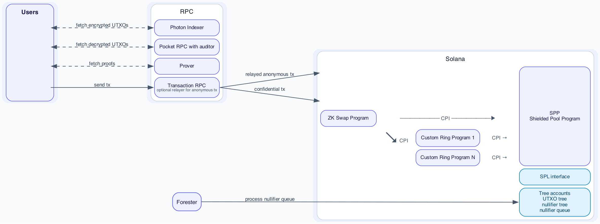
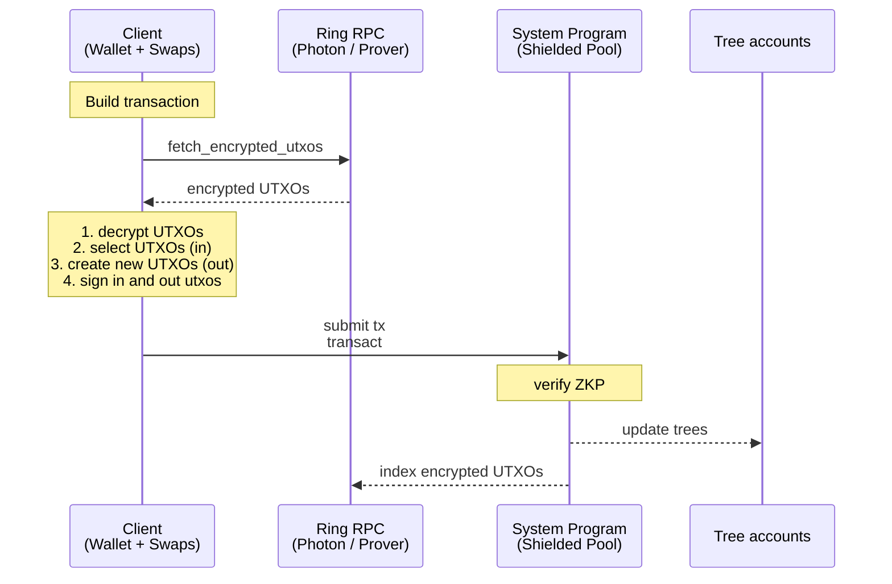
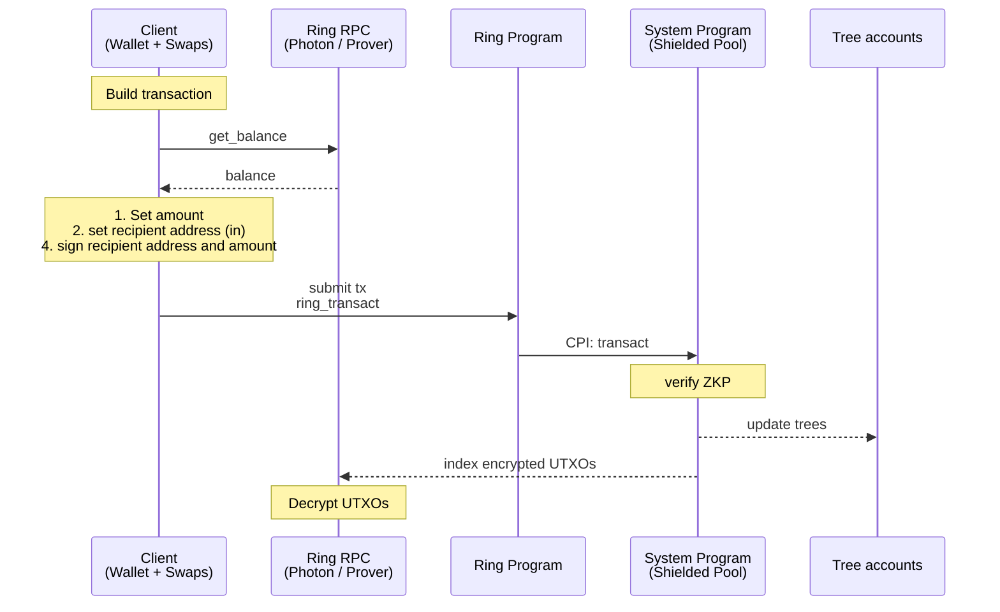
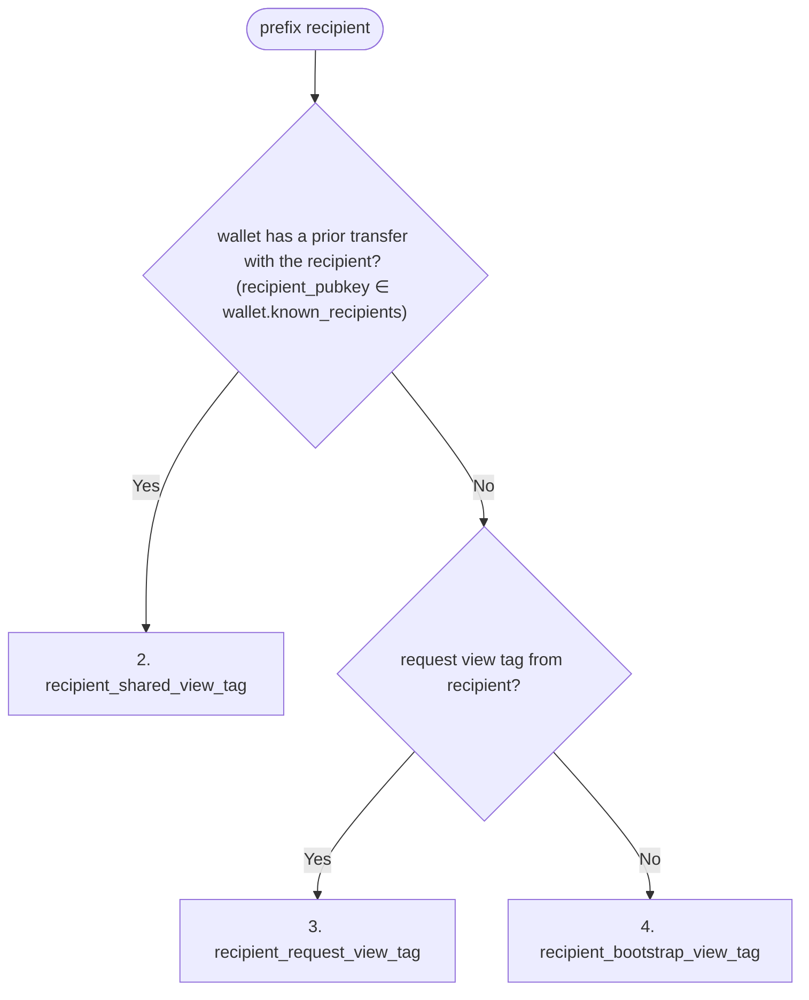
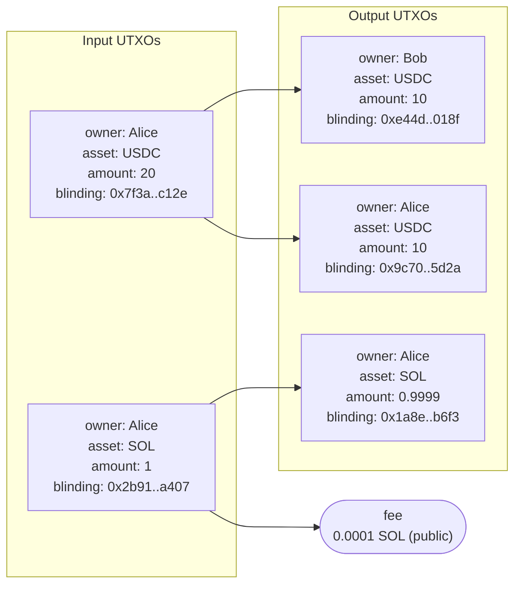
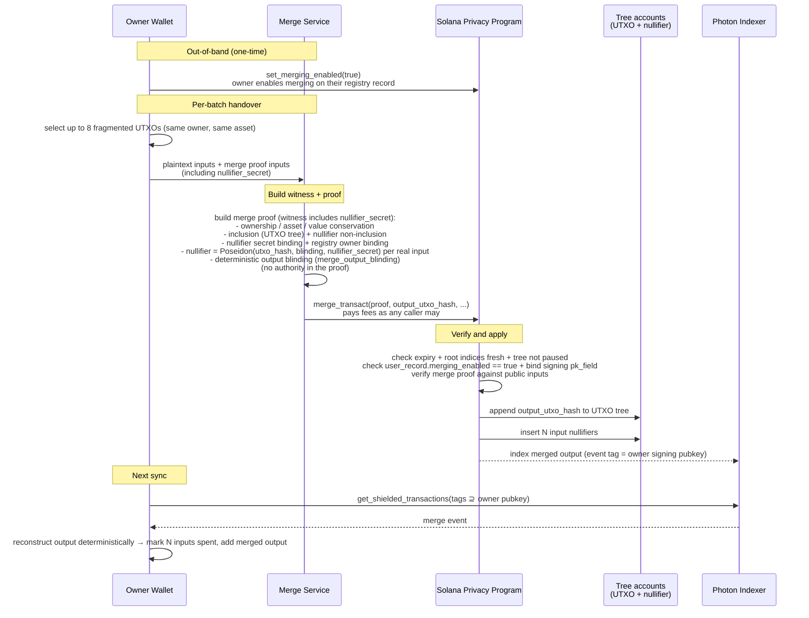

# Spec

## Table of Contents

- [Abstract](#abstract)
- [Architecture](#architecture)
  - [Operations](#operations)
    - [User](#user)
    - [Protocol](#protocol)
    - [Ring Creator](#ring-creator)
    - [Merge Service](#merge-service)
  - [Concurrency & Balance Fragmentation](#concurrency--balance-fragmentation)
  - [Default Ring](#default-ring)
  - [Policy Rings](#policy-rings)
- [Glossary](#glossary)
- [Shielded Address](#shielded-address)
- [Shielded Keypair](#shielded-keypair)
  - [Signing Key](#signing-key)
  - [Nullifier Key](#nullifier-key)
  - [ViewingKey](#viewingkey)
    - [Derived secrets](#derived-secrets)
    - [Transaction Viewing Key](#transaction-viewing-key)
    - [View Tags](#view-tags)
      - [Sender View Tag](#sender-view-tag)
      - [Recipient view tag](#recipient-view-tag)
      - [Merge view tag](#merge-view-tag)
      - [View Tag Selection](#view-tag-selection)
    - [Methods](#methods)
  - [Derivation seed](#derivation-seed)
  - [Solana wallet](#solana-wallet)
  - [Local P-256](#local-p-256)
  - [HSM](#hsm)
  - [Seed phrase](#seed-phrase)
  - [PDA](#pda)
- [UTXO](#utxo)
  - [UTXO Hash](#utxo-hash)
  - [Nullifier](#nullifier)
- [Output UTXO Serialization](#output-utxo-serialization)
  - [UTXO Data](#utxo-data)
  - [Transfer](#transfer-2)
    - [Plaintext Layout](#plaintext-layout)
    - [Instruction Data Layout](#instruction-data-layout)
  - [Plaintext Transfer](#plaintext-transfer)
  - [UTXO Split](#utxo-split)
    - [Plaintext Layout](#plaintext-layout-1)
    - [Instruction Data Layout](#instruction-data-layout-1)
  - [Merge](#merge)
    - [Plaintext Layout](#plaintext-layout-2)
    - [Instruction Data Layout](#instruction-data-layout-2)
- [SPP Proof - Solana Privacy ZK Proof](#spp-proof---solana-privacy-zk-proof)
- [Merge Proof - Merge ZK Proof](#merge-proof---merge-zk-proof)
- [SPP - Solana Privacy Program](#spp---solana-privacy-program)
  - [Accounts](#accounts)
    - [Authority Governance](#authority-governance)
    - [Ring Accounts](#ring-accounts)
  - [Instructions](#instructions)
    - [transact](#transact)
    - [deposit](#deposit)
    - [ring_deposit](#ring_deposit)
    - [merge_transact](#merge_transact)
    - [merge_ring](#merge_ring)
- [Ring Program Interface](#ring-program-interface)
- [ZK Program Interface](#zk-program-interface)
- [RPC](#rpc)
  - [Indexer](#indexer)
    - [getEncryptedUtxosByTags](#getencryptedutxosbytags)
    - [getShieldedTransactionsByTags](#getshieldedtransactionsbytags)
    - [subscribeToShieldedTransactionsByTags](#subscribetoshieldedtransactionsbytags)
    - [getMerkleProofs](#getmerkleproofs)
    - [getNonInclusionProofs](#getnoninclusionproofs)
  - [Prover](#prover)
  - [Relayer](#relayer)
  - [Ring RPC](#ring-rpc)
    - [get_decrypted_utxos_by_owner](#get_decrypted_utxos_by_owner)
    - [get_decrypted_transactions_by_owner](#get_decrypted_transactions_by_owner)
    - [subscribe_to_decrypted_transactions_by_owner](#subscribe_to_decrypted_transactions_by_owner)
  - [Merge Service](#merge-service-1)
  - [Registry](#registry)
    - [Record](#record)
    - [Operations](#operations-1)
      - [`get_record`](#get_record)
      - [`register`](#register)
      - [`set_merging_enabled`](#set_merging_enabled)
- [User Flows](#user-flows)
  - [First Time Sync Wallet](#first-time-sync-wallet)
  - [Merge Flow](#merge-flow)
  - [Transfer User Flows](#transfer-user-flows)
    - [Privacy Guarantee Matrix](#privacy-guarantee-matrix)

## Abstract

The solana privacy protocol (TSPP) enables programmable, UTXO-based confidential transfers that execute directly on Solana, and supports private DeFi and institutional compliance. UTXO balances are backed by SPL and Token-2022 tokens, viewing keys provide selective disclosure, and owner tagging enables wallet sync at Solana speed. Policy rings add anonymity.

Confidential transfers are performed by a minimal Solana Privacy Program (SPP) that enforces UTXO state transitions with a zero knowledge proof (ZKP). To enable private DeFi, third-party programs run custom private logic in a separate ZKP over user-owned UTXOs that hold arbitrary `utxo_data`, authorized by the owner's signature. For tailored compliance, institutions can implement rings with custom ring programs, for example with configurable auditors, authorities, freeze authority, co-signer, permanent delegate, and anonymity.

For wallet sync at Solana RPC speed, the owner pubkey prefixes every encrypted UTXO so wallets and indexers locate relevant outputs without trial decryption.

For compatibility with Solana addresses, a registry maps Solana addresses to shielded addresses, so a sender holding only a recipient's Solana address can pay them privately.

An optional merge service consolidates fragmented balances without per-merge wallet signatures once the owner enables merging on their registry record.

The document specifies the key derivation, UTXO layout, SPP accounts and instructions, the ring program interface, the ZK program interface, the ZK circuits, the indexer / prover / relayer / ring RPC / merge service / registry interfaces, and user flows.

# Architecture



Source: [`diagrams/architecture.dot`](diagrams/architecture.dot). Regenerate with `just render-diagrams`.

1. Users — own wallets, build encrypted transactions, and authorize spends with Ed25519 transaction signatures.
2. Photon Indexer — indexes trees + encrypted UTXOs; default-ring users fetch ciphertexts here.
3. Ring RPC (with auditor) — RPC with auditor keys; decrypts and serves UTXOs to policy-ring users.
4. Prover — generates Groth16 proofs. Users can generate client side proofs as well.
5. Relayer (optional) — fee-payer that submits a transaction on a user's behalf; by default users invoke the programs directly. Targets SPP (default ring), the ZK Swap program, or a Ring program (policy ring).
6. Forester — processes the nullifier queue into the nullifier tree and closes reclaimable nullifier PDAs.
7. SPP (Solana Privacy Program) — verifies proofs, updates trees, moves SPL to and from the vaults.
8. ZK Swap Program — enforces swap logic in a zk proof and settles the swap with a shielded transfer by CPI into a Ring program or directly into SPP.
9. Ring Programs (1..N) — config programs; verify policy proofs and CPI into SPP.
10. SPL interface — per-mint SPL / Token-22 holding all shielded tokens.
11. Tree accounts — co-located UTXO tree, nullifier tree, and nullifier queue.

Per-flow sequence diagrams are in the [User Flows](#user-flows) section below.


## Operations

### User

Operations 1-4 run against the default ring via [`transact`](#transact) (or [`deposit`](#deposit)), or against a policy ring via the ring program's CPI into `ring_transact` (or [`ring_deposit`](#ring_deposit) for proofless deposits).

| # | Name | Description | Privacy |
| --- | --- | --- | --- |
| 1 | deposit | Deposit SPL tokens into the shielded pool; existing UTXOs can be merged in the same transaction. | sender + amount visible; recipient visible |
| 2 | deposit | Public deposit without a proof. Allows depositing dynamic amounts, for example for the flow withdraw, swap, deposit. | sender + amount visible; recipient `owner` visible |
| 3 | withdraw | Withdraw SPL tokens from the shielded pool to a public account. | sender visible (or hidden via an optional relayer); recipient + amount visible |
| 4 | shielded transfer | Transfer value between shielded balances. | confidential: amount hidden; sender + recipient visible (anonymous in a policy ring) |

### Protocol

| # | Name | Description |
| --- | --- | --- |
| 1 | create_spl_interface | Initialize SPL/Token-22 pool escrow per token mint |
| 2 | create_tree | Create and initialize a new Tree PDA (nullifier tree + queue and UTXO tree, co-located) |
| 3 | create_protocol_config | Initialize protocol config (role authorities, permissionless flags) |
| 4 | update_protocol_config | Rotate the protocol config authority and the role authorities |
| 5 | pause_tree | Freeze writes to a Tree account |
| 6 | set_tree_fees | Set a tree's fee schedule (insertion fee, append and close reimbursements) |
| 7 | claim_tree_lamports | Claim a tree's lamports above its rent, fee balance, and nullifier PDA working capital |

### Ring Creator

Operations performed by the owner of a policy ring's config.

| # | Name | Description |
| --- | --- | --- |
| 1 | create_ring_config | Create a new active ring config PDA; sets `owner` and `ring_authority_transact_is_enabled` |
| 2 | update_ring_config | Set `ring_authority_transact_is_enabled` and `paused`. A paused ring cannot authorize any ring operation; the owner can still update or rotate the config |
| 3 | update_ring_config_owner | Transfer ring config ownership |
| 4 | ring_authority_transact | Prove correctness of a state transition by a ring authority (freeze, thaw, permanent-delegate transfer) |

### Merge Service

Operations performed by a merge service for a user who has enabled merging (`merging_enabled = true`) on their [registry record](#registry). See [Merge Service](#merge-service-1) for the operator's responsibilities.

| # | Name | Description |
| --- | --- | --- |
| 1 | merge_transact | Consolidate N input UTXOs of the same owner and asset into one default-ring output UTXO |
| 2 | merge_ring | Policy-ring analog of `merge_transact`; called via CPI from a ring program. Inputs and output share `ring_program_id` |


## Concurrency & Balance Fragmentation

UTXOs are inherently concurrent. Every transaction to a user will fragment the users balance since the transaction amount is a new UTXO.

1. The balance of a keypair can be used concurrently when it is split up between a number of utxos.
2. To keep the balance spendable in one transaction we split it in up to X utxos.
3. Optionally, fragmented balances can be reconsolidated without user interaction by a trust minimized [merge service](#merge_transact) once the user has enabled merging on their registry record.


## Default Ring

The default ring is confidential and has no policy: amounts and assets are private, owners are public. Each output is tagged by its Ed25519 owner pubkey and bound to the output UTXO in the SPP proof, so wallets sync by querying the indexer for their own pubkey.
Users invoke the SPP directly.
An optional merge service can be used to improve UX.

### Transfer


```mermaid
sequenceDiagram
    participant Client as Client<br>(Wallet + Swaps)
    participant RingRPC as Ring RPC<br>(Photon / Prover)
    participant System as System Program<br>(Shielded Pool)
    participant Trees as Tree accounts

    Note over Client: Build transaction
    Client->>RingRPC: fetch_encrypted_utxos
    RingRPC-->>Client: encrypted UTXOs
    Note over Client: 1. decrypt UTXOs <br> 2. select UTXOs (in) <br> 3. create new UTXOs (out) <br> 4. sign in and out utxos
    Client->>System: submit tx<br>transact

    Note over System: verify ZKP
    System-->>Trees: update trees
    System-->>RingRPC: index encrypted UTXOs
```

## Policy Rings

**Properties:**
1. Fully programmable: the ring creator deploys a ring program that implements custom logic enforcing encryption to auditors, authorities, freeze authority, co-signer, and permanent delegate.
2. Enter Ring: a ring is entered by a deposit from an SPL token account, the standard shielded pool, or another ring via a shielded transfer.
3. Exit Ring: a ring is exited by a withdraw to an SPL token account, the standard shielded pool, or another ring via a shielded transfer.
4. Transfers: users invoke the ring program, which CPIs into the SPP program.


### Transfer


```mermaid
sequenceDiagram
    participant Client as Client<br>(Wallet + Swaps)
    participant RingRPC as Ring RPC<br>(Photon / Prover)
    participant Ring as Ring Program
    participant System as System Program<br>(Shielded Pool)
    participant Trees as Tree accounts

    Note over Client: Build transaction
    Client->>RingRPC: get_balance
    RingRPC-->>Client: balance
    Note over Client: 1. Set amount <br> 2. set recipient address (in) <br> 4. sign recipient address and amount
	  Client->>Ring: submit tx<br>ring_transact
    Ring->>System: CPI: transact

    Note over System: verify ZKP
    System-->>Trees: update trees
    System-->>RingRPC: index encrypted UTXOs
    Note over RingRPC: Decrypt UTXOs
```


# Glossary

Type aliases used in the `struct` definitions throughout this spec. Each is defined once here and referenced by name elsewhere.

| Type | Definition | Description |
| --- | --- | --- |
| `PublicKey` | `[u8; 34]` | 1-byte scheme prefix + 33-byte body. Prefix `0x00`: P256, SEC1-compressed point; `0x01`: Ed25519, 32-byte key then one zero byte; `0x02`: PDA, 32-byte Solana address then one zero byte (off-curve, cannot sign). The protocol's scheme-tagged key, used wherever the scheme varies — UTXO owners (`signing_pk` / `owner_pubkey`). |
| `P256Pubkey` | `[u8; 33]` | P256 public key, SEC1-compressed. No scheme prefix; used where the key is P256 by construction — viewing / ECDH keys (`tx_viewing_pk`, registry `viewing_pk`). |
| `P256Keypair` | — | A P256 `(secret, public)` keypair; its public half is a `P256Pubkey`. |
| `Signature` | `[u8; 64]` | A Solana (Ed25519) transaction signature. |
| `ECDSASignature` | `[u8; 64]` | A P256 ECDSA signature (`r‖s`); authenticates an RPC request under the signer's key. |
| `SPPProof` | `[u8; 128]` | Vanilla compressed Groth16 proof. |
| `TransactProof` | struct | A 128-byte vanilla Groth16 proof (`a`, `b`, `c`). |
| `CircuitId` | enum | Selects the circuit family and fixed shape: `ConfidentialEddsa`, `RingEddsa`, or `RingAuthority`, each carrying `(n_inputs, n_outputs, n_public_asset_slots)`. Unknown values are rejected at deserialization. |

Raw fixed-size byte arrays keep their literal types where no alias adds clarity:

- `[u8; 32]` — a 32-byte value: a Poseidon or SHA-256 digest, a BN254 field element, an owner pubkey, or a view tag.
- `[u8; 31]` — a blinding factor (held below the BN254 field modulus).

Hashing conventions:

- `Sha256BE` — SHA-256 over the byte preimage, then `digest[0] = 0`, interpreted as a BN254 field element. Zeroing the most-significant byte holds the result below the BN254 field modulus.
- `hash_bytes_N` — a fixed-length byte commitment. Split the `N` bytes into consecutive 31-byte big-endian chunks, right-align each chunk in a 32-byte BN254 field representation, set `acc = chunk_0`, then fold each remaining chunk as `acc = Poseidon(acc, chunk_i)`. `hash_bytes_0([]) = 0`; a value of at most 31 bytes is its packed field value and invokes no Poseidon permutation. The length is fixed by the calling protocol type and is not encoded or domain-separated. A generic variable-length byte-hash API is forbidden.

# Shielded Address

A shielded address consists of the signing public key, signs to spend UTXOs, the nullifier public key, ties the nullifier to a spent UTXO, and the viewing public key, encrypts the UTXO.
In compressed form the signing and nullifier public keys are compressed in an owner poseidon hash.

`ShieldedAddress = (signing_pk, nullifier_pk, viewing_pk)`

`CompressedShieldedAddress = (owner_hash, viewing_pk)`

## Fixed-byte proof-input encoding

Raw fixed-size values use `hash_bytes_N` everywhere they enter a field-level
commitment. Structured hashes over values that are already field elements keep
their stated Poseidon preimages.

```
Solana owner (Ed25519 pubkey or PDA address, 32 B):
  owner_proof_input_hash(pk) := hash_bytes_32(pk)

P256 owner (33 B SEC1):
  owner_proof_input_hash(pk) := hash_bytes_32(pk.x)

P256 viewing key (33 B SEC1, retained for viewing/ECDH):
  viewing_proof_input_hash(pk) := hash_bytes_33(pk)
```

## Owner Hash

```
owner_hash := Poseidon(owner_proof_input_hash(signing_pk), nullifier_pk)
```

SPP derives the Solana owner proof input from the verified signer account — an
Ed25519 signer or a PDA signing via `invoke_signed`. The circuit relies on the
SVM's signature verification, so the two are equivalent in the proof. The
`RingP256` rail instead proves one shared P256 signature and derives the owner
proof input from the point's x-coordinate in-circuit.

# Shielded Keypair

The client-side triple behind a [Shielded Address](#shielded-address): a
[Signing Key](#signing-key), a [Nullifier Key](#nullifier-key), and a
[ViewingKey](#viewingkey).

**Curves** (the `PublicKey` scheme prefix, [Glossary](#glossary)):

- `Ed25519` — Solana signer, authorized by SPP's signer-account check.
- `P256` — `RingP256` rail, one shared P256 signature proven in-circuit.
- `Pda` — off the Ed25519 curve and cannot sign; the owning program authorizes via `invoke_signed`.

**Interface**:

- `signing_pubkey` — the [Signing Key](#signing-key) public key (`PublicKey`).
- `viewing_pubkey` — [ViewingKey](#viewingkey) public key (`P256Pubkey`).
- `curve` — the signing scheme identifier: the `PublicKey` scheme prefix ([Glossary](#glossary)).
- `sign_message(msg)` — message signature in the scheme's native form ([Signing Key](#signing-key) methods).
- `sign_hash(hash)` — signature over a caller-supplied digest, for the proof path ([Signing Key](#signing-key) methods).
- `nullifier_key` — the host-side [Nullifier Key](#nullifier-key), used to build spendable inputs.
- `nullifier(utxo)` — the UTXO's [nullifier](#nullifier).
- `nullifier_pk` — the published half of the nullifier role ([Nullifier Key](#nullifier-key)).
- `owner_hash` — the [Owner Hash](#owner-hash) of the signing and nullifier public keys.
- `shielded_address` — the three public keys as a [Shielded Address](#shielded-address).
- `compressed_address` — its compressed form: `owner_hash` and `viewing_pubkey`.

## Signing Key

`(signing_sk, signing_pk)` — the spend-authorizing keypair.

**Methods:**

- `pubkey() -> PublicKey` — the scheme-tagged public key ([Glossary](#glossary)).
- `sign_message(msg) -> Result<Signature>` — the scheme's native message signature: Ed25519 over the raw bytes (RFC 8032, delegated to the host Solana wallet), P256 as ECDSA over `SHA-256(msg)` normalized to low-S, matching Solana's secp256r1 precompile. PDA: error.
- `sign_hash(hash: [u8; 32]) -> Result<Signature>` — P256 ECDSA over a caller-supplied digest; the proof verifies it against `SHA-256(private_tx_hash)`. Ed25519 owners sign digest bytes with `sign_message`; PDA: error.

## Nullifier Key

Symmetric 31-byte key to derive nullifiers. The `nullifier_secret` is
wallet-side material: it is a private proof input on every spend path, so it
cannot be hardware-resident. It is required to spend but does not authorize a
spend: authorization is the owner signature, checked by the proof
(`RingP256`) or by SPP's signer-account check (Ed25519, PDA).

`nullifier_pk := Poseidon(nullifier_secret)`

**Methods:**

- `nullifier_pk() -> [u8; 32]` — returns `nullifier_pk` (defined above).
- `nullifier(utxo) -> [u8; 32]` — the UTXO's [nullifier](#nullifier).

## ViewingKey

`(viewing_sk, viewing_pk)` — P-256 keypair, used for HPKE encryption and to
derive view-tag secrets. Viewing keys can rotate. Each scenario defines how
`viewing_sk` is produced.

### Derived secrets

Secrets derive from `view_root`, an ECDH-derived root, so the viewing key can stay in an HSM (one `CKM_ECDH1_DERIVE`).

- `P_const   := hash_to_curve_P256(DST="TSPP/view_root/P_const/v1")` — RFC 9380 `P256_XMD:SHA-256_SSWU_RO_`; fixed generator, unknown discrete log relative to `G` (else `ECDH(viewing_sk, P_const) = p·viewing_pk` would be public).
- `view_root := HKDF-Extract(salt=∅, IKM=ECDH(viewing_sk, P_const))` — `ECDH` is the shared point's 32-byte big-endian x-coordinate.
- `sender_view_tag_secret    := HKDF-Expand(view_root, "TSPP/sender_view_tag",    L=32)`
- `recipient_view_tag_secret := HKDF-Expand(view_root, "TSPP/recipient_view_tag", L=32)`
- `tx_viewing_secret         := HKDF-Expand(view_root, "TSPP/tx_viewing",         L=32)` — seeds the transaction viewing keys.

### Transaction Viewing Key

The transaction viewing key is a single use keypair (ephemeral key) that is deterministically derived for every private transaction.
Every ciphertext in a transaction is encrypted with HPKE between the transaction viewing key and the ciphertext owner's viewing key.
This way the transaction viewing key can decrypt both the sender's change and recipient UTXOs of the transaction.

**Properties**

- **Scope**: one transaction.
- **Read-only**: viewing keys grant decryption only.
- **Derivable on demand**:
  ```
  first_nullifier := nullifier_key.nullifier(inputs[0])              // see [Nullifier](#nullifier)
  (tx_viewing_sk, tx_viewing_pk) := HKDF-SHA256(salt=first_nullifier, IKM=tx_viewing_secret, info="TSPP/tx_viewing")
  ```
  `tx_viewing_secret` is defined in [Derived secrets](#derived-secrets). Binding the HKDF salt to `first_nullifier` makes the keypair unique per Solana transaction (nullifier tree uniqueness implies `tx_viewing_pk` uniqueness).

### View Tags

The view-tag types in this section (`sender_view_tag`, `recipient_shared_view_tag`, `recipient_request_view_tag`, `recipient_bootstrap_view_tag`) apply to **anonymous policy rings only**. In the confidential [default ring](#default-ring) every output — sender change, recipients, and the [`merge_transact`](#merge_transact) output — is tagged by its Ed25519 owner pubkey, so a wallet syncs by querying the indexer for its own owner pubkey.

Policy rings hide the recipient, so a wallet cannot find its outputs by owner pubkey as in the [default ring](#default-ring). Instead a view tag, a 32-byte value attached to a ciphertext, lets wallets sync by querying the indexer for exact view-tag matches and decrypt only their own transactions. Derivation splits into two cases — tags the sender derives for themselves to discover their own change UTXOs, and tags the sender derives for the recipient to discover incoming transfers.

A recipients wallet cannot pre-derive shared tags for every possible sender. Therefore the wallet needs to know which senders to derive view tags for. The first transfer between a new sender-recipient pair uses a tag the recipient can find without prior knowledge of the sender: either `recipient_request_view_tag` (recipient minted, shared out-of-band) or `recipient_bootstrap_view_tag = recipient.viewing_pk` (no coordination required). This first transfer establishes the pair: on decryption the recipient reads `sender_pubkey` from the ciphertext and derives the shared ECDH key, and subsequent transfers from this sender use a shared tag (`recipient_shared_view_tag`) to find transaction. `sender → recipient` and `recipient → sender` produce disjoint tags.

**Uniqueness.** View tags should not be reused. The indexer must handle the case that these may be used multiple times erroneously and return all ciphertexts matching a single tag value.

**Encoding.**  all view tags are constant length 32 bytes. Shorter view tags are prefixed with 0s.

#### Sender View Tag

1. **`sender_view_tag`**
  - Derived by: the sender, to index her change utxos.
  - Tx sent by: the sender
  - Indexed by: the sender
  - Derivation: `HKDF-SHA256(salt=∅, IKM=sender_view_tag_secret, info="TSPP/sender_view_tag/" || u64_be(tx_count), L=31)`.

#### Recipient view tag

2. **`recipient_shared_view_tag`**
    - Derived by: the sender and recipient independently. Sender via `get_send_shared_view_tag` to send the tx, the recipient via `get_recipient_shared_view_tag` to index the tx.
    - Tx sent by: the sender.
    - Indexed by: the recipient.
    - Derivation: two chained HKDFs over the ECDH shared secret.

      ```
      shared := ECDH(self.viewing_sk, counterparty_pubkey)
      domain := HKDF-SHA256(salt = ∅, IKM = shared,
                           info = "TSPP/pair-domain/" || R_pubkey, L = 32)
      return    HKDF-SHA256(salt = ∅, IKM = domain,
                           info = "TSPP/pair-hint/"   || u64_be(i), L = 31)
      ```

      `R_pubkey` is the recipient of the direction: `counterparty_pubkey` on the sender side (`get_send_shared_view_tag`), `self.viewing_pk` on the recipient side (`get_recipient_shared_view_tag`). ECDH symmetry plus the matched direction label produces the same byte value across the pair.
3. **`recipient_request_view_tag`**
    - Derived by: the recipient. The recipient shares the tag with the sender out-of-band as a `PaymentRequest`.
    - Tx sent by: the sender.
    - Indexed by: the recipient. Once the recipient decrypts this transfer, subsequent transfers from the same sender can be indexed by `recipient_shared_view_tag`.
    - Derivation: `HKDF-SHA256(salt=∅, IKM=recipient_view_tag_secret, info="TSPP/recipient_request_view_tag/" || u64_be(request_count), L=31)`.
4. **`recipient_bootstrap_view_tag`**
    - Derived by: anyone — `recipient.viewing_pk` 32-byte X-coordinate of the SEC1-compressed encoding (the 33-byte form with its 1-byte sign prefix dropped).
    - Tx sent by: the sender.
    - Indexed by: the recipient. Once the recipient decrypts this transfer, subsequent transfers from the same sender can be indexed by `recipient_shared_view_tag`.
    - [Plaintext Transfer](#plaintext-transfer): sender bundles and recipient slots are indexed by the 32-byte owner tag in place of `viewing_pk`. The slot contains no `sender_pubkey`, so `known_senders` / `known_recipients` are not updated and the next encrypted transfer between the pair is again a first transfer.


#### Merge output indexing (removed merge view tag)

The single-use `merge_view_tag` stream — `merge_view_tag_secret`, a per-user `merge_count`, the HKDF tag derivation, and SPP's nullifier-tree insertion of the tag — was removed. `merge_transact` tags the merged output with the owner signing pubkey like every confidential default-ring output; [`merge_ring`](#merge_ring) indexes the output by the **first input's published nullifier**; neither instruction takes a supplied tag. The output blinding and the padding-slot nullifiers are derived deterministically from the owner's nullifier secret and that first nullifier (`merge_output_blinding` / `merge_dummy_nullifier`, domain-separated Poseidon — see [Methods](#methods)), and replay protection comes from the proof-bound input nullifiers themselves.

#### View Tag Selection

In the [default ring](#default-ring) every output is tagged by its recipient owner pubkey, so the selection below applies only to anonymous policy rings. `merge_transact` outputs are tagged by the owner signing pubkey like every other default-ring output; `merge_ring` outputs are indexed by the first input's published nullifier, not by a view tag. Wallets select recipient tags as follows:


```mermaid
flowchart TD
    Start([prefix recipient]) --> Q1{"wallet has a prior transfer with the recipient? (recipient_pubkey ∈ wallet.known_recipients)"}
    Q1 -->|Yes| Case22[2. recipient_shared_view_tag]
    Q1 -->|No| Q2{"request view tag from recipient?"}
    Q2 -->|Yes| Case211[3. recipient_request_view_tag]
    Q2 -->|No| Case212[4. recipient_bootstrap_view_tag]
```

### Methods

1. `decrypt(ciphertext, tx_viewing_pk) -> Result<Plaintext>` — AES-CTR decryption with key `KDF(ECDH(viewing_sk, tx_viewing_pk))`.
2. `get_sender_view_tag(tx_count)` — policy-ring anonymous transfers only; tags the sender's own change UTXOs. The default ring tags change by the sender's owner pubkey.
3. `get_recipient_request_view_tag(request_count)` — used by the recipient to create a view tag for a `PaymentRequest` shared with the sender out-of-band.
4. `get_send_shared_view_tag(counterparty_pubkey, i)` — sender-side `recipient_shared_view_tag`; used for transfers to a recipient the sender has already paired with.
5. `get_recipient_shared_view_tag(counterparty_pubkey, i)` — recipient-side `recipient_shared_view_tag`; used during sync to scan transfers from each known sender.
6. `merge_output_blinding(first_nullifier)` / `merge_dummy_nullifier(first_nullifier, slot_index)` — deterministic merge derivations from the owner's nullifier secret (domain-separated Poseidon); used by the merge prover when building [`merge_transact`](#merge_transact) / [`merge_ring`](#merge_ring) and by the owner during sync to reconstruct merged outputs. Replaces the removed `get_merge_view_tag(merge_count)`.
7. `get_transaction_viewing_key(first_nullifier: [u8; 32]) -> P256Keypair` — per-transaction P-256 keypair for ECDH encryption to recipients.

## Derivation seed

The root secret both role keys expand from in the local-key scenarios
([Solana wallet](#solana-wallet), [Local P-256](#local-p-256)). Obtaining it
consumes only a signing operation (`ECDH` or a deterministic signature).

Role expansion, shared by both scenarios:

- `prk := HKDF-Extract(salt=∅, IKM=derivation_seed)`
- `nullifier_secret := HKDF-Expand(prk, nf_info, L=31)`
- `viewing_sk := HKDF-Expand(prk, view_info, L=48)` reduced to a P-256 scalar (RFC 9380 hash-to-field)

The two scenarios define `derivation_seed`, `nf_info`, and `view_info`.

**Derivation-input guard.** Signing rejects any message whose payload (bare or
off-chain encoded) starts with `"TSPP/derive/"`; generic ECDH rejects the
committed derivation points (`P_derive`, `P_pda` — see [PDA](#pda)).

## Solana wallet

Sign: the wallet's Ed25519 key, checked by SPP as the signer account.

- `derivation_seed := Ed25519_sign(signing_sk, derivation_message)` — deterministic (RFC 8032), so any wallet that signs off-chain messages reconstructs the keypair and the Ed25519 secret never leaves the wallet. The 64-byte seed is itself secret material: whoever holds it derives both role keys.
- `derivation_message` — the Solana off-chain message v0 encoding of the payload `"TSPP/derive/v1"`: `"\xffsolana offchain" || version=0 || application_domain || format=0 || signer_count=1 || signing_pk || u16_le(payload_len) || payload`, with `application_domain := SHA-256("TSPP/derive/v1")`.
- `nf_info = "TSPP/nf_key/ed25519/v1"`, `view_info = "TSPP/view_key/ed25519/v1"`.

## P-256 wallet

Sign: ECDSA with a locally held key (`RingP256` rail).

- `derivation_seed := ECDH(signing_sk, P_derive)` — the shared point's 32-byte big-endian x-coordinate (one `CKM_ECDH1_DERIVE`).
- `P_derive := hash_to_curve_P256(DST="TSPP/nullifier/P_nullifier/v1")` — same RFC 9380 construction as [`P_const`](#derived-secrets), distinct point; unknown discrete log, so only the signing-key holder can compute the shared x-coordinate.
- `nf_info = "TSPP/nf_key/ecdh/v1"`, `view_info = "TSPP/view_key/ecdh/v1"`.

## HSM

Sign: on the device. Device signing keys cannot run key agreement, so the
[derivation seed](#derivation-seed) is unavailable: the nullifier and viewing
roles root in separate device keys (three-key custody) and are supplied at
construction. The `nullifier_secret` stays host-side
([Nullifier Key](#nullifier-key)).

## Seed phrase

All three parts derive from one BIP-39 mnemonic: the signing key on Solana's
derivation path, the role keys on TSPP paths. Every path segment is hardened;
`node(path)` is the 32-byte SLIP-0010 Ed25519 node key at `path` (HMAC-SHA512
tree over the seed), `node_p256(path)` the 32-byte SLIP-0010 nist256p1 node
key (master key from HMAC-SHA512 with key `"Nist256p1 seed"`; invalid
candidates are handled inside SLIP-0010's derivation). `TSPP_COIN =
1392955331` (`be_u32(SHA-256("luminous.TSPP.v1")[0..4]) & 0x7FFF_FFFF`).

- `seed := BIP-39(mnemonic, passphrase)` — PBKDF2-HMAC-SHA512, 64 bytes; `passphrase = ""` unless the wallet sets one.
- `signing_sk := node(m/44'/501'/account'/0')` — Ed25519 secret on Solana's path: importing the mnemonic into a Solana wallet yields the same key.
- `p256_signing_sk := node_p256(m/44'/TSPP_COIN'/account'/0'/0')` — a valid P-256 scalar by construction.
- `nullifier_secret := node(m/44'/TSPP_COIN'/account'/1'/0')[1..32]` — the node key with its first byte dropped (31 bytes).
- `viewing_sk := node_p256(m/44'/TSPP_COIN'/account'/2'/0')` — a valid P-256 scalar by construction.
- Both identities use the same `nullifier_secret` and `viewing_sk`. Wherever both publish the shared `viewing_pk` — registry records, bootstrap view tags, shielded addresses — the two owners are linkable.
- `account'` — each account index is an independent shielded keypair.

Shares the signing key with the [Solana wallet](#solana-wallet) scenario but
not the role keys; the two keypairs coexist, and a seed-phrase wallet also
derives the Solana-wallet keypair to sync both.

## PDA

No signing key: the owning program authorizes with `invoke_signed`. Both role
keys expand from one viewing-key ECDH shared secret, with the PDA address in
each info tag so a holder does not reuse one identity across PDAs.

- `shared := ECDH(holder_viewing_sk, counterparty_viewing_pk)` — either participant derives the identity from its own viewing key and the counterparty's viewing pubkey. A sole holder uses `ECDH(holder_viewing_sk, P_pda)` with `P_pda := hash_to_curve_P256(DST="TSPP/pda_root/P_pda/v1")`.
- `prk := HKDF-Extract(salt=∅, IKM=shared)`
- `nullifier_secret := HKDF-Expand(prk, "TSPP/pda_nf/v1" || pda, L=31)`
- `viewing_sk := HKDF-Expand(prk, "TSPP/pda_view/v1" || pda, L=48)` reduced to a P-256 scalar (RFC 9380 hash-to-field)

# UTXO

A UTXO (unspent transaction output) represents an amount of an asset in the shielded pool that its owner can spend.
UTXO hashes are appended to the UTXO Merkle tree at creation and nullifiers are inserted into the Nullifier tree when a UTXO is spent to prevent double spending. A nullifier can only be inserted once into the nullifier tree.

Example: Alice transfers 10 USDC to Bob. Alice's starting balance is one 20 USDC UTXO and one 1 SOL UTXO. Fee is 0.0001 SOL.


```mermaid
flowchart LR
    subgraph inputs["Input UTXOs"]
        AU["owner: Alice<br/>asset: USDC<br/>amount: 20<br/>blinding: 0x7f3a..c12e"]
        AS["owner: Alice<br/>asset: SOL<br/>amount: 1<br/>blinding: 0x2b91..a407"]
    end
    subgraph outputs["Output UTXOs"]
        BU["owner: Bob<br/>asset: USDC<br/>amount: 10<br/>blinding: 0xe44d..018f"]
        CU["owner: Alice<br/>asset: USDC<br/>amount: 10<br/>blinding: 0x9c70..5d2a"]
        CS["owner: Alice<br/>asset: SOL<br/>amount: 0.9999<br/>blinding: 0x1a8e..b6f3"]
    end
    AU --> BU
    AU --> CU
    AS --> CS
    AS --> RF(["fee<br/>0.0001 SOL (public)"])
```

```rust
struct Utxo {
    /// Constant separating UTXOs from other Poseidon-hashed records.
    domain: u16,
    /// The recipient's `owner_hash` from their
    /// [Shielded Address](#shielded-address). Senders write this 32-byte value
    /// directly.
    owner: [u8; 32],
    /// Asset mint. SOL is Address::default().
    asset: Address,
    /// Amount in the smallest unit of `asset`.
    amount: u64,
    /// Random bytes ensuring distinct UTXO hashes for equal
    /// `(owner, asset, amount)` triples.
    blinding: [u8; 31],
    /// Arbitrary data committed via `data_hash`; the application circuit/SDK
    /// interprets it.
    utxo_data: Option<Vec<u8>>,
    /// Arbitrary ring data.
    ring_data: Option<Vec<u8>>,
    /// The ring program that authorizes spends of this UTXO.
    ring_program_id: Option<Address>,
}
```

## UTXO Hash

```
utxo_hash = Poseidon(domain, asset, amount,
                     data_hash, ring_hash, owner_utxo_hash)

ring_hash       = Poseidon(ring_data_hash, pk_field(ring_program_id))
owner_utxo_hash = Poseidon(owner, blinding)
```

The SPP proof commits to `utxo_hash` for every input and output. `owner` is the `owner_hash` from [Shielded Address](#shielded-address). `asset` is Poseidon-encoded as `Poseidon(low, high)` before hashing; `ring_program_id` uses `pk_field` (see [Shielded Address](#shielded-address)). An absent `ring_program_id` is `0` (not `pk_field(0)`), so a UTXO without one keeps `ring_hash` over a `0` program field. `data_hash` enters `utxo_hash` directly and is `0` when absent.

`owner` is a user `owner_hash`; there is no program ownership. A UTXO may hold `utxo_data`: `data_hash` is committed into `utxo_hash` unchecked, and the application circuit/SDK interprets it. `ring_hash` pairs `ring_data_hash` with the authorizing ring program, and a non-zero `ring_data_hash` requires a non-zero `ring_program_id`. `owner_utxo_hash` nests `owner` and `blinding`: it keeps the owner private on the `transact` rails, where the components stay in the proof and ciphertext. A `deposit` instead sends `owner` and `blinding` in the clear and the program recomputes `owner_utxo_hash`, so that rail does not hide the recipient.

## Nullifier

A nullifier deterministically derives from a UTXO and the recipient's [NullifierKey](#nullifierkey). Insertion into the nullifier tree must succeed only once.

```
nullifier    := Poseidon(utxo_hash, utxo_blinding, nullifier_secret)
```

nullifier_secret - must be committed in the owner hash, which enters `utxo_hash` via `owner_utxo_hash`.
utxo_blinding - must be committed as the `blinding` in `owner_utxo_hash`.

## Empty UTXO

Fixed-size circuits pad unused output slots with empty UTXOs, most often a
sender's absent SPL or SOL change. Every field is zero except `blinding`:

```
owner = asset = amount = 0
utxo_data = ring_data = ring_program_id = None
blinding = Sha256BE(blinding_seed || u8(position))
```

`owner = 0` leaves the output permanently unspendable: spending it later requires
keys whose `owner_hash` is 0, which no one holds. The per-position `blinding` keeps
each empty change output reconstructible by the owner from the sender bundle's
`blinding_seed` and gives it a distinct `utxo_hash`, so it looks like a real output.
The sender ciphertext also stays fixed-size (amounts are fixed-width), so neither
the output hash nor the ciphertext reveals whether the sender kept change.

`owner = 0` is exactly the dummy-output condition, so an empty change output is a
dummy: it contributes `0` to the output hash chain. Padding slots beyond the
sender's change and recipients are dummies too; they hold no value, so their
`blinding` is freshly random rather than position-derived.

The confidential default ring reveals recipients but dummy utxos also carry cipher texts so that these are indistinguishable from real outputs.

`split` pads with owner-bound zero-value outputs, not empty UTXOs.

# Output UTXO Serialization

Output UTXO serialization is the per-output ciphertext layout for shielded
transactions. Each output's ciphertext lives in its own
[`TransactOutput.data`](#transact) slot; SPP does not parse `data`. Serialization is
a default-ring convention; policy rings can define their own.
UTXOs are encrypted with ECDH AES-256-CTR, except in the Plaintext Transfer scheme.
The shared `tx_viewing_pk` and `salt` are transaction-level fields of the
[transact](#transact) instruction, not part of any per-output payload. Each output
is tagged by its owner pubkey (the `owner_tag` value).

Schemes:

1. Transfer — one sender and `0<=` recipient ciphertexts.
2. UTXO Split — one ciphertext for M equal-amount outputs under the same owner.
3. Merge — no ciphertext (removed): the merged output is derived deterministically from the owner's nullifier secret and the first input nullifier, so there is nothing to encrypt (see [Merge output indexing](#merge-output-indexing-removed-merge-view-tag)).
4. Plaintext Transfer — the Transfer layout with unencrypted payloads.

## AES Key derivation

AES-CTR reuses a `(key, nonce)` pair if the same viewing key is derived twice (e.g. a failed transaction rebuilt with the same first nullifier). The `salt` prevents this. Key and nonce both derive from the single-use transaction viewing key, a per-transaction 16-byte CSPRNG `salt`, and the slot index.

Per ciphertext slot `i` — the ciphertext ordinal: the number of `data = Some` outputs
preceding this one (`0` = sender bundle, `1 + j` = recipient `j` in the Transfer
layout); `messages` continue the numbering after the last output ordinal:

```
ikm        = ECDH_x(tx_viewing_sk, recipient_viewing_pk) || tx_viewing_pk || recipient_viewing_pk
okm        = HKDF-SHA256(salt = ∅, IKM = ikm,
                         info = "TSPP/hpke/" || "TSPP/tx" || salt || u32_be(i), L = 44)
key        = okm[0..32]
nonce      = okm[32..44]                                    // 12 B, the AES-CTR nonce
ciphertext = AES-256-CTR(key, nonce, plaintext)
```

Integrity is verified by recomputing the UTXO hash from the decrypted plaintext fields and comparing against the covered output's `utxo_hash`. Those hashes are proof-verified on-chain commitments, so a mismatch — from a wrong decryption key or a corrupted ciphertext — is detected with overwhelming probability.


## UTXO Data

Each plaintext stores ring- and application-specific bytes in a `data` field of type `Data`: a record count followed by type-length-value records.

```
Data   = count: u8 || records[count]
record = tag: u8 || len: u16_le || bytes: [u8; len]
```

An empty `data` field is the single byte `count = 0`. Each populated record adds `3 + len` bytes to its plaintext and the same to the ciphertext.

| Tag | Record | UTXO field | Description |
| --- | --- | --- | --- |
| `0x01` | `ring_data` | `ring_data` | store ring utxo data |
| `0x02` | `utxo_data` | `utxo_data` | store application utxo data |

## Transfer

One ciphertext for the sender's SOL and SPL change UTXOs, and one ciphertext for each recipient UTXO. Variables used below: `R ≥ 0` = recipient UTXO count, `N` = input UTXO count.

### Plaintext Layout

Fields packed in declaration order. Byte vectors are prefixed with a `u16_le` length, every other vector with a `u8` count.

#### Recipient

```rust
/// 48 B plaintext for confidential transfers with an empty `data` field.
/// Anonymous transfers additionally carry `owner_pubkey: PublicKey` (34 B) and
/// `sender_pubkey: P256Pubkey` (33 B) before `asset_id`. Each populated data
/// record adds `3 + len` bytes. See [UTXO Data](#utxo-data).
struct TransferRecipientPlaintext {
    /// `1` for SOL; SPL via per-mint Asset registry (`asset_id ≥ 2`).
    asset_id: u64,
    /// In units of `asset_id`.
    amount: u64,
    /// Random blinding for the single output.
    blinding: [u8; 31],
    /// Ring and program records for the output UTXO. The wallet parses
    /// `ring_data` if it supports the ring; `utxo_data` is parsed by the
    /// application program's client SDK. See [UTXO Data](#utxo-data).
    data: Data,
}
```

#### Sender

The sender change bundle encodes two outputs (SPL change + SOL change). Per-output blindings derive from a single seed:

```
blinding_i = Sha256BE(blinding_seed || u8(position_i))
```

with `position = 0` for the SPL output and `position = 1` for the SOL output.

```rust
/// 57 B plaintext for confidential transfers with both `data` fields empty
/// (fixed, independent of recipient count). Anonymous transfers additionally
/// carry `owner_pubkey: PublicKey` (34 B) before `spl_asset_id` and
/// `recipient_viewing_pks: Vec<P256Pubkey>` (1 + 33·R B) after `blinding_seed`.
/// Each populated data record adds `3 + len` bytes. See [UTXO Data](#utxo-data).
struct TransferSenderPlaintext {
    /// Per-mint Asset registry; `0` if no SPL change.
    spl_asset_id: u64,
    /// `0` if no SPL change.
    spl_amount: u64,
    /// `0` if no SOL change.
    sol_amount: u64,
    /// Seed for the two per-output blindings (formula above).
    blinding_seed: [u8; 31],
    /// Records for the SPL change UTXO (position 0): `ring_data` hashed via
    /// the ring program's scheme into the `ring_data_hash` slot of
    /// `utxo_hash`, `utxo_data` via the app program's scheme into the
    /// `data_hash` slot. See [UTXO Data](#utxo-data).
    spl_data: Data,
    /// Records for the SOL change UTXO (position 1), same scheme as
    /// `spl_data`.
    sol_data: Data,
}
```

### Instruction Data Layout

The sender serializes a `TransferEncryptedUtxos` bundle, then spreads its
ciphertexts across the [transact](#transact) instruction's per-output `data`
slots. `tx_viewing_pk` and `salt` are transaction-level fields of `TransactIxData`,
shared by every slot. Fields are packed in declaration order; byte vectors are
prefixed with a `u16_le` length, every other vector with a `u8` count.

```rust
/// `sender_ciphertext` is a 57-byte plaintext for confidential transfers (when
/// `data` fields are empty). Each populated data record grows its ciphertext by
/// `3 + len` bytes. See [UTXO Data](#utxo-data).
struct TransferEncryptedUtxos {
    /// Discriminator (TRANSFER).
    type_prefix: u8,
    tx_viewing_pk: P256Pubkey,
    /// Per-transaction CSPRNG salt.
    salt: [u8; 16],
    /// Sender change bundle ciphertext. Tagged by the sender's `owner` pubkey
    /// in the transact instruction data.
    sender_ciphertext: Vec<u8>,
    /// One per recipient.
    recipient_slots: Vec<RecipientSlot>,
}
```

#### Recipient slot

```rust
/// `ciphertext` is a 48-byte recipient plaintext for confidential transfers
/// (plus `3 + len` per populated data record).
struct RecipientSlot {
    /// Recipient's signing pubkey — the indexing tag. The confidential proof
    /// binds it to the output UTXO; the anonymous proof leaves it free (a view tag).
    owner: [u8; 32],
    ciphertext: Vec<u8>,
}
```

#### Output slot mapping

Each output is one [`TransactOutput`](#transact): `utxo_hash`, `owner_tag`, and
optional `data` ciphertext, in tree-append order (`0` SPL change, `1` SOL change,
`2 + i` recipient `i`/dummy).

**Coverage convention** (a default-ring serialization rule, not program-enforced): an
output with `data = Some` covers itself plus the immediately following `data = None`
positions. The Transfer scheme puts the sender change bundle at `outputs[0].data`
(covering both change positions) and each real recipient ciphertext at its own
position; a dummy position carries `Inline(random tag)` and random bytes of
recipient-ciphertext length, indistinguishable from a real recipient. The SPP allows
`outputs[0].data = None`; which positions bear a ciphertext is a wallet concern.

The logged [`GeneralEvent`](#general-event) keeps one entry per output, 1:1 with
`outputs`; a covered position publishes an empty `data` under the covering output's
owner tag.

#### Sizes

`R` = number of recipient slots (real recipients and dummies; a dummy slot holds
random bytes of the same length), so an encrypted transfer's on-instruction size
grows with `R`. The table below gives the size as a function of the slot count `R`.

Total: `110 + 82·R` bytes. Example with a single recipient slot: `R = 1`, total `192`.

Blob size by slot count:

| R | Bytes |
| --- | --- |
| 1 | 192 |
| 2 | 274 |
| 4 | 438 |
| 8 | 766 |

Sizes assume confidential transfers with every `data` field empty (`count = 0`). Each populated record adds `3 + len` bytes (u8 tag + u16_le len + payload) to its plaintext and the same to the ciphertext.

## Plaintext Transfer

The [Transfer](#transfer-2) layout without encryption: `tx_viewing_pk`, `salt`, and the AES-CTR ciphertext wrapper are absent. Output blindings derive from `blinding_seed` (formula in [Sender](#sender)): position `0` SPL change, `1` SOL change, recipient slot `i` position `2 + i`. The sender bundle and each recipient slot are indexed by their `owner_pubkey`, like the encrypted [Transfer](#transfer-2).

A plaintext transfer differs from the encrypted transfer only in that amounts and asset are public; both reveal recipients. Payloads are public, so dummy slots hide nothing: only the sender bundle and real recipient outputs carry `data`.

```rust
/// Total size: `96 + 51·R` bytes with both change outputs and every `data`
/// field empty; each populated data record adds `3 + len` bytes. See
/// [UTXO Data](#utxo-data).
struct TransferPlaintextUtxos {
    /// Discriminator (TRANSFER_PLAINTEXT).
    type_prefix: u8,
    blinding_seed: [u8; 31],
    sender: Option<TransferPlaintextSender>,
    recipient_slots: Vec<TransferPlaintextRecipient>,
}

struct TransferPlaintextSender {
    owner_pubkey: PublicKey,
    /// SPL change `(amount, asset_id)`.
    spl: Option<(u64, u64)>,
    sol_amount: Option<u64>,
    spl_data: Data,
    sol_data: Data,
}

struct TransferPlaintextRecipient {
    owner_pubkey: PublicKey,
    asset_id: u64,
    amount: u64,
    data: Data,
}
```

## UTXO Split

Requires a plain input; produces plain outputs (no attached data).

A split commits eight owner-bound outputs. Slots `0..M` have the requested amount;
slots `M..8` have amount zero. All share owner, asset, and owner tag. The wallet
tracks slots `0..M`.

The ciphertext encodes owner, asset, amount, `M`, and blinding seed. Each output derives:

```
blinding_i = Sha256BE(blinding_seed || u8(i))
```

for `i = 0 .. 7`.

### Plaintext Layout

```rust
/// 83 B plaintext → 83 B ciphertext (no tag) with an empty
/// `data` field. See [UTXO Data](#utxo-data) for the growth per
/// populated record.
struct SplitBundlePlaintext {
    /// Shared owner.
    owner_pubkey: PublicKey,
    /// M — number of equal-amount outputs.
    num_outputs: u8,
    /// `1` for SOL; SPL via per-mint Asset registry (`asset_id ≥ 2`).
    asset_id: u64,
    /// Shared across all M outputs.
    asset_amount: u64,
    /// Seed for the M per-output blindings (formula above).
    blinding_seed: [u8; 31],
    /// Empty (plain outputs).
    data: Data,
}
```

### Instruction Data Layout

```rust
/// 135 bytes total when the plaintext `data` field is empty; populated
/// records grow the ciphertext by `3 + len` bytes each. Packed; the
/// ciphertext is prefixed with a `u16_le` length.
/// Tagged by the sender's `owner` pubkey in the transact instruction data
/// (all M outputs share the sender as owner).
struct SplitEncryptedUtxos {
    /// Discriminator (SPLIT).
    type_prefix: u8,
    tx_viewing_pk: P256Pubkey,
    /// Per-transaction CSPRNG salt.
    salt: [u8; 16],
    /// 83-byte plaintext (no tag).
    ciphertext: Vec<u8>,
}
```

The bundle ciphertext sits at `outputs[0].data`; every other output sets
`data = None`. All eight `owner_tag` values resolve to the same owner. The proof
and `private_tx_hash` cover all eight commitments.

## Merge

The merged output carries no ciphertext: its `data` slot is empty. The output
blinding is `merge_output_blinding(nullifier_secret, first_nullifier)` (see
[Methods](#methods)), derived in-circuit from the owner's nullifier secret and
the first input's single-use nullifier, and padding slots publish
`merge_dummy_nullifier(nullifier_secret, first_nullifier, slot)`. On sync the
wallet recognizes a merge whose first published nullifier belongs to one of its
own UTXOs, skips the deterministic dummy nullifiers, sums the matched inputs,
recomputes the blinding, and checks the recomputed UTXO hash against the
on-chain output commitment — no decryption key is involved. On the default rail
(`merge_transact`) the emitted event's `view_tag` is the owner signing pubkey
(the P256 x-coordinate or the full ed25519 key, rail-selected like the
`pk_field`), so the wallet's owner-pubkey scan finds it; `merge_ring` instead
indexes the output by the first input's published nullifier, and a ring merge's
output `data` payload is the output `ring_data_hash` (see [Merge output
indexing](#merge-output-indexing-removed-merge-view-tag)).

# SPP Proof - Solana Privacy ZK Proof

**Public Inputs**

| Input | Source |
| --- | --- |
| nullifiers | derived by the proof from spent input UTXOs |
| output_utxo_hashes | instruction data (`outputs[i].utxo_hash`) |
| utxo_tree_roots (one per input UTXO) | resolved from `utxo_tree_root_index[i]` against the root cache of the input's UTXO tree |
| nullifier_tree_roots (one per input UTXO) | resolved from `nullifier_tree_root_index[i]` against the root cache of the input's nullifier tree |
| private_tx_hash | instruction data |
| external_data_hash | instruction data. SPP recomputes it from the instruction and checks it matches this public input. It is its own public input, not just an input to `private_tx_hash`, because SPP cannot recompute `private_tx_hash`: that hash covers the input UTXO hashes, which are private. Without it a proof could be reused with a different instruction (different encrypted outputs, settlement accounts, or public-leg amounts). |
| public_assets (`N_PUBLIC_SLOTS = 3`) | Public proof slots are uniform `(asset, amount)` pairs, entering the public-input hash interleaved as `asset_0, amount_0, asset_1, amount_1, asset_2, amount_2`. The SDK derives and SPP recomputes the slots: resolve every settlement leg's asset, add deposits and subtract withdrawals in `i128`, drop zero-net groups, and emit the remaining distinct assets in first-appearance order. SOL uses `hash_bytes_32(Address::default())`; SPL uses `hash_bytes_32(mint)` derived from the validated vault. Unused slots are `(0, 0)`. |
| public_amounts (`N_PUBLIC_SLOTS = 3`) | Signed-field encodings of the three aggregated proof movements. Each net magnitude must fit `u64`; deposits encode the magnitude directly and withdrawals encode its negation in the BN254 field. |
| ring_program_id | single `pk_field` of the policy ring authorizing the transaction's UTXOs; `0` (non-ring / default transact) — instruction data |
| payer_pubkey_hash | `Sha256BE(payer)` derived by SPP from the `payer` account |
| signer_pk_hashes | Payer first, then first-occurrence-deduplicated Ed25519 owner signers, then zero padding to `N_inputs + 1`; folded as a fixed-width right hash chain. |
| P256 message and default-owner hashes (`RingP256` only) | Immediately after `private_tx_hash`: `hash_bytes_32(SHA-256(private_tx_hash))`, followed by `default_p256_owner_pk_hash`. The latter is `hash_bytes_32(p256_x)` iff a real P256 UTXO/address has `ring_program_id = 0`, otherwise `0`. SPP derives it from `CircuitId::RingP256.default_owner_tag`; the circuit conditionally binds it to the shared P256 key. |
| published output owner hash chain (owner-signed variants) | Fixed-width per-output vector folded into a final hash-chain field. `ConfidentialEddsa` publishes every resolved owner tag. `RingEddsa` and `RingP256` publish `hash_bytes_32(fetch_tag)` only where the output ciphertext is structurally `OutputDataEncoding::Encrypted` with confidential scheme byte `3`; other slots contribute `0`. `RingAuthority` omits this field. |

The rows are in preimage order: every variant shares the rows through
`payer_pubkey_hash`, and the ones a variant does not publish are omitted from the
tail rather than zeroed.

See [UTXO Hash](#utxo-hash) and [Nullifier](#nullifier).

**Private Inputs (per input UTXO)**

| Input | Description |
| --- | --- |
| owner proof input | Private per-slot identity. Ed25519 identities must occur in the public signer vector. On `RingP256`, zero selects the shared P256 owner while non-zero selects an Ed25519 signer. A real default-ring P256 input/address additionally forces the conditional public owner hash described above. |
| `nullifier_secret` | the input owner's secret (see [Nullifier Key](#nullifier-key)); recomputes the input's `nullifier_pk` and [nullifier](#nullifier) |
| `blinding`, `asset`, `amount`, `data_hash`, `ring_data_hash`, `ring_program_id` | UTXO body fields used to recompute `utxo_hash`; `blinding` combines with the recomputed `owner_hash` into `owner_utxo_hash`, and also feeds the nullifier formula |
| `utxo_merkle_path` | path proving `utxo_hash` is a leaf of the input's UTXO tree at the corresponding `utxo_tree_root` |

**Private Inputs (per output UTXO)**

| Input | Description |
| --- | --- |
| `owner` | Recipient's `owner_hash`; combined with `blinding` into `owner_utxo_hash`. Owner-signed circuits witness the actual owner identity and nullifier pubkey and recompute `owner_hash`. A real default-ring output must equal its published per-slot owner hash; a real policy-ring output must publish zero. A dummy may publish zero, or may publish a real participant identity to camouflage a confidential slot. |
| `asset`, `amount`, `blinding`, `data_hash`, `ring_data_hash`, `ring_program_id` | UTXO body fields used to recompute `output_utxo_hashes[i]` |

**external_data_hash**

Hash over the proof-bound region of the invoking SPP instruction and the Solana accounts the proof must commit to. Included in `private_tx_hash` so the owner's signature covers the entire transaction and commits the proof to the specific SPP instruction being invoked (`transact`, `ring_transact`, `ring_authority_transact`, …). A proof built for one instruction cannot be replayed against another even when every other field matches.

```
external_data_hash := Sha256BE(
    u8(spp_instruction_discriminator) || bound_region || address_digest
)

address_digest := fold over bound_addresses, seeded [0; 32]:
                      digest = Sha256BE(digest || address)
```

`bound_region` is the contiguous run of [`transact`](#transact) instruction data from `expiry_unix_ts` through `messages`, hashed as encoded there. The instruction is `[discriminator][bound region][tail]`, and SPP measures the region by parsing it rather than from a declared length, so the hashed bytes are the bytes it acts on.

`bound_addresses` follow in protocol order: per entry of `interface_transfers`, the user account for a SOL leg or the user token account then the per-mint interface vault for an SPL leg; then the resolved owner of every output whose [`OwnerTag`](#transact) names an account, in `outputs` order. The mint is bound through the interface vault's PDA derivation.

Every field of the encoding is fixed width or prefixed by its count or length, and the strict `{0, 1}` presence byte keeps `None` distinct from `Some(&[])`, so `bound_region` is recoverable from the preimage and the number of appended addresses follows from it. The preimage is injective: reordering legs, an account group, or outputs changes the hash.

The hash covers the owner tag encoding, not only the resolved tag: an output tagged `Inline(x)` and one tagged `Account(i)` where account `i` holds `x` produce different digests, so a relayer cannot rewrite one form into the other.

Proof-slot aggregation does not alter this preimage: all ordered settlement
legs remain present, including legs in an asset group whose net movement is zero.
Thus different recipients or funding accounts cannot cancel out of
`external_data_hash`.

`spp_instruction_discriminator` is the SPP discriminator byte of the instruction whose handler runs the proof verification (see [Instructions](#instructions)). SPP recomputes this value from the dispatched instruction and checks the proof's `external_data_hash` against it.

The transaction-level `data_hash` and `ring_data_hash` sit in the tail and no public input binds them, so a relayer may set them freely; a consumer that relies on them must move them into the bound region or have the ring program check them before its CPI. They are distinct from the per-UTXO `data_hash` / `ring_data_hash` in [`utxo_hash`](#utxo-hash), which the proof does bind.

`tx_viewing_pk` and `salt` sit in the bound region, so they bind the transaction-level decryption context to the encrypted output and message bytes and an intermediary cannot replace either value while reusing the proof.

**Checks**

| Check | Description |
| --- | --- |
| Owner hash binding (per input) | The recomputed `owner_hash` (see [Shielded Address](#shielded-address)) must equal the input's `owner`, the value hashed into `utxo_hash` for the inclusion check. |
| UTXO Ownership | Each spent input UTXO binds to an Ed25519 owner-key hash from the signer run. SPP folds the payer-first, first-occurrence-deduplicated owner-signer accounts into a fixed-width public-input chain, and the circuit binds each input owner to a chain element. See [UTXO Ownership Check](#utxo-ownership-check). |
| Inclusion | Each spent input UTXO must be a leaf of the UTXO tree at its corresponding `utxo_tree_roots[i]`. |
| Nullifier secret binding (per input) | The input's `nullifier_pk` (see [Nullifier Key](#nullifier-key)) is recomputed from its `nullifier_secret` witness and enters the input's recomputed [owner hash](#shielded-address). |
| Nullifiers | Public nullifier per input equals the input's [nullifier](#nullifier). |
| Nullifier non-inclusion | Each input nullifier must NOT exist in the nullifier tree at its corresponding `nullifier_tree_roots[i]` before the transaction. |
| Output UTXOs | Output UTXO hashes must be well formed and match `output_utxo_hashes[i]`. The proof hashes output `owner` into `output_utxo_hashes[i]` without unpacking it. |
| Output owner tag | `ConfidentialEddsa` binds every output tag. Owner-signed ring circuits use the ciphertext scheme as a public marker: confidential-encrypted slots contribute the resolved tag hash, all other encodings contribute zero. The circuit requires every real default-ring output to be marked and bound to its actual owner, and every real policy-ring output to be unmarked. Dummy outputs may use zero; a non-zero dummy marker must identify a real signer or real output owner. `RingAuthority` publishes no output-owner chain. |
| Balance Conservation | For each active asset, inputs plus public deposits must equal outputs plus public withdrawals. Public proof slots are the checked, non-zero net amounts aggregated from settlement legs by resolved asset. An idle slot has amount and asset pinned to `0`; the circuit retains its pairwise-distinct-asset constraint over active slots. |
| Private transaction hash | `private_tx_hash = Poseidon(input utxo hash chain, output utxo hash chain, address utxo hash chain, external data hash)`. Dummy inputs and outputs contribute `0` to the input and output chains, so the hash covers only real state; their real hashes still enter the public `output_utxo_hashes` and nullifier inputs. The address chain contains each address slot's `utxo_hash` (`0` elsewhere). The Ed25519 account signatures and the circuit's owner bindings jointly authorize this value. SPP, policy, and third-party proofs all take `private_tx_hash` as a public input, so every circuit proves statements about the same transaction data. |
| UTXO data | There is no program ownership: every real input takes the owner-signature path. `utxo_data` may sit on any UTXO; `data_hash` enters `utxo_hash` unchecked, so the owner signature over `private_tx_hash` authorizes any output that sets it. Ring programs additionally authorize spends of their ring (`ring_program_id`) via a PDA signer; policy proofs are checked by the ring program before CPI into SPP. |
| Dummy input or output | ZK circuits are fixed size; dummy UTXOs allow a transaction to use fewer real inputs or outputs. A dummy has `owner = 0` (an input's owner key, an output's `owner_hash`): permanently unspendable, so a real spend never has it. Ownership, inclusion, nullifier-secret-binding, nullifier, and balance checks are skipped for dummy UTXOs. The fixed shape is public — SPP inserts every input nullifier into the nullifier tree and appends every output hash to the UTXO tree — so a dummy's nullifier and `utxo_hash` must be indistinguishable from a real UTXO's and pairwise distinct, hiding the real input and output counts. A dummy output is an [empty UTXO](#empty-utxo); its output entry carries a random tag and random recipient-length `data` (see [Output slot mapping](#output-slot-mapping)). A dummy input derives its [nullifier](#nullifier) over a random `blinding` with `nullifier_secret = 0`, the blinding being its sole source of unpredictability.<br>The proof carries one boolean public-input-hash component, `allow_dummy_inputs`, for the whole proof. SPP derives it from the pre-transaction tree state as `nullifier_leaves_remaining >= state_leaves_remaining`, counting nullifiers already reserved in the queue. Every dummy **input** is constrained by this boolean; outputs are unaffected. Equality permits dummy inputs, while strictly fewer remaining nullifier leaves disables every dummy input slot. Clients assume `true` for the height-40 nullifier tree; SPP's derived value is authoritative at verification.<br>An input dummy with a non-zero `data_hash` is instead an **address slot**: an owner-signed account whose nullifier is its address. It sets `owner = owner_hash` rather than `0`, pins `amount` and the non-seed fields to `0`, and derives and constrains its nullifier (over the owner's `nullifier_secret`) like a real spend; SPP inserts it, so the nullifier tree enforces uniqueness. Unlike a padding dummy, it contributes its `utxo_hash` to the `private_tx_hash` address chain, so the owner signature covers it.<br>A padding dummy input's public `nullifier` and `utxo_tree_root` / `nullifier_tree_root` are **not** covered by the owner signature: the checks above are skipped and it contributes `0` to `private_tx_hash`, so the signed digest `SHA-256(private_tx_hash)` excludes them. The sender fixes them when signing; they are part of the signed transaction, and SPP still inserts the nullifier and reads each root by index. This holds because the sender builds the whole proof witness; no untrusted party sits between signing and proving. A re-prover can at most swap one random dummy nullifier for another (every real input, output, amount, and recipient stays signed); the worst case is a self-reverting duplicate-nullifier insertion, which cannot change real state. |

<a id="utxo-ownership-check"></a>
**Utxo Ownership Check:**
1. Ed25519 Solana signers checked by SPP. Authorization comes from the accounts array, not instruction data: the payer occupies signer slot 0, followed by the owner-signer accounts in first-occurrence order (a repeated account signs once). Every owner-signer account must be a transaction signer, and the unique run must fit `MAX_UNIQUE_SIGNERS` (8), a bound on distinct signers rather than on the input count.
2. SPP folds the run — `hash_bytes` of each signer address, zero-padded to `n_inputs + 1` — into a right-folded public-input chain. The circuit binds each spent UTXO owner to a chain element. The nullifier-secret binding is still checked by the proof.

<a id="circuit-variants"></a>
**Circuit Combinations**

`CircuitId` selects the Ed25519 default (`ConfidentialEddsa`), Ed25519 ring
(`RingEddsa`), shared-P256 ring (`RingP256`), or ring-authority
(`RingAuthority`) circuit and its fixed shape. `RingP256` carries the BSB22
commitment/PoK and an optional raw P256 x-coordinate owner tag. The tag is
present exactly when the transaction contains a real default-ring P256
UTXO/address; SPP hashes it into the public-input preimage.
It is a selector only — not a public input and never hashed into
`private_tx_hash` or `external_data_hash`. SPP validates it fail-closed: its
family must match the dispatched instruction and its dimensions must match the
input/output vectors and a generated verifying key. `RingP256` uses the
committed Groth16/BSB22 proof payload; the other variants use vanilla Groth16.

A third axis selects a ring-capable instantiation, fixed by the dispatched
instruction. The non-ring variant pins every UTXO's ring fields to `0`. The
ring variant binds each non-dummy input and output whose `ring_program_id` is
non-zero to the public ring; a default-ring UTXO (`ring_program_id = 0`) is
exempt. Owner-signed ring circuits therefore support mixed transactions:
default-ring input/output owners are public through the signer/default-P256
and confidential-marker bindings above, while policy-ring owners remain
anonymous.

**Transfer-key rotation.** Expanding the transfer circuit to
`N_PUBLIC_SLOTS = 3` changes its constraint system. Every transfer proving key
and embedded verifying key, across every shape and
EdDSA/default-ring/policy-ring/P256/ring-authority variant, MUST be regenerated
from that same circuit revision.
The transfer circuit fingerprints and proving-key lock file MUST identify those
new artifacts. A deployment MUST activate the matching program and published
proving keys together; an old proving key and new verifying key, or the reverse,
are incompatible. Merge and proofless-deposit artifacts do not rotate unless
their own circuits change.

| Circuit | Use | Shape | Variants |
| --- | --- | --- | --- |
| 1 in 1 out | Re-randomize a single UTXO | 1 input UTXO, 1 output UTXO of the same owner, asset, and amount with fresh blinding; transaction fees are paid by the payer | Ed25519
| 1 in 2 out | Single-input transfer | 1 sender input UTXO, 1 recipient output, 1 change output; transaction fees are paid by the payer | Ed25519
| 2 in 2 out | Deposit with merge | 1 SOL fee UTXO + 1 existing SPL UTXO in; 1 SPL output (existing balance + new deposit), 1 SOL change output | Ed25519
| 2 in 3 out | Single-input transfer with fee UTXO (currently the only implemented shape) | 1 SOL fee UTXO, 1 sender input UTXO, 1 recipient output, 1 SPL change output, 1 SOL change output | Ed25519
| 3 in 3 out | Standard transfer | 1 SOL fee UTXO, 2 sender input UTXOs, 1 recipient output, 1 SPL change output, 1 SOL change output | Ed25519
| 4 in 3 out | Multi-input transfer | 1 SOL fee UTXO, 3 sender input UTXOs, 1 recipient output, 1 SPL change output, 1 SOL change output | Ed25519
| 4 in 4 out | Multi-input transfer, two recipients | 1 SOL fee UTXO, 3 sender input UTXOs, 2 recipient outputs, 1 SPL change output, 1 SOL change output | Ed25519
| 5 in 3 out | Higher concurrency | 1 SOL fee UTXO, 4 sender input UTXOs, 1 recipient output, 1 SPL change output, 1 SOL change output | Ed25519
| 5 in 4 out | Higher concurrency, two recipients | 1 SOL fee UTXO, 4 sender input UTXOs, 2 recipient outputs, 1 SPL change output, 1 SOL change output | Ed25519
| 1 in 8 out | Split UTXO | Split 1 UTXO into up to 8 equal parts; equal parts reduce encrypted data | Ed25519
| 36 in 2 out | Consolidation | Sweep many small UTXOs into one recipient plus change. Only reachable in a [transaction v1](#transaction-size) message, and only when a caller declares it: automatic shape selection never picks it, so a small transfer is not routed to a circuit twenty times its size | Ed25519

**Ring-authority instantiation.** A separate instantiation proves no owner authorization at all: it is the Solana-only ring variant (no P256 gadget, no in-circuit signature) and keeps every input owner `pk_field` private (omitted from the public input hash). Each input owner is an opaque field element hashed into `owner_hash` exactly like the merge circuit, so both P256- and Ed25519-owned UTXOs can be spent — the prover supplies the owner `pk_field` directly and the proof never checks ownership. The only in-circuit binding is `nullifier_secret` knowledge through `owner_hash`; authorization is the `ring_config` PDA signer plus the ring program's own policy, requiring `ring_authority_transact_is_enabled` set (instruction `ring_authority_transact`). It pairs only with the anonymous owner-tag variant. Because owners do not authorize the spend, value cannot leave the ring here: the public `ring_program_id` is pinned non-zero and **every** non-dummy input *and* output `ring_program_id` must equal it (strict binding, no zero exemption). A default-ring UTXO can neither be spent nor created, so the authority cannot move funds out of the policy ring without an owner-signed path. Supported shapes:

| Circuit | Use | Shape |
| --- | --- | --- |
| 1 in 1 out | Re-randomize a UTXO | 1 input, 1 output of the same owner, asset, and amount with fresh blinding |
| 2 in 2 out | Ring-authority transact | 2 inputs, 2 outputs |
| 3 in 3 out | Ring-authority transact | 3 inputs, 3 outputs |
| 4 in 4 out | Ring-authority transact | 4 inputs, 4 outputs |


# Merge Proof - Merge ZK Proof

ZK proof for [`merge_transact`](#merge_transact) and [`merge_ring`](#merge_ring). Consolidates `N` input UTXOs of a single owner and single asset into one output of the same owner, asset, and total amount. Two variants share one skeleton (`prover/server/circuits/spp_merge/shared/transaction.go`): the default merge (verified against `merge_<N>_1`) additionally binds the owner's identity from the user registry record; the policy-ring merge (verified against `merge_ring_<N>_1`) binds the calling ring's `program_id` and the output `ring_data_hash` the ring program selected. The default rail checks the registry record's `merging_enabled == true` (see [`merge_transact`](#merge_transact)); the ring rail is authorized by the ring program.

The proof is a 128-byte vanilla Groth16 `a || b || c` over a single public signal (`public_input_hash`). The merged output is ciphertext-free: its blinding is derived deterministically in-circuit from the owner's nullifier secret and the first input's single-use nullifier (`merge_output_blinding`), and padding slots publish deterministic dummy nullifiers (`merge_dummy_nullifier`), so the owner reconstructs the output on sync without any decryption (see [Merge output indexing](#merge-output-indexing-removed-merge-view-tag)).

**Requirement.** No signing or viewing secret witness. `nullifier_secret` is required.

**Public Inputs**

The single public signal is `public_input_hash`, a Poseidon hash chain over a shared 7-element prefix plus a variant tail (`programs/shielded-pool/src/instructions/merge/verify.rs` `fn public_input_hash`, mirrored by `CommonPublicInputs.Prefix` in the circuits):

| Element | Source |
| --- | --- |
| `HashChain(nullifiers)` | per-slot nullifiers, derived by the proof (real slots) and by `merge_dummy_nullifier` (padding slots); published in instruction data |
| `output_utxo_hash` | instruction data |
| `HashChain(utxo_tree_roots)` | one per input slot, resolved by SPP from `utxo_tree_root_index[i]` against the input tree's root cache |
| `HashChain(nullifier_tree_roots)` | one per input slot, resolved by SPP from `nullifier_tree_root_index[i]` |
| `private_tx_hash` | instruction data; covers every input hash, the output hash, and the external-data hash |
| `external_data_hash` | instruction data, recomputed by SPP from the instruction and matched against this public input |
| `allow_dummy_inputs` | one boolean for the whole proof, derived by SPP from the tree (`nullifier_leaves_remaining >= state_leaves_remaining`); when false every slot must be real |
| variant tail — default merge: `pk_field(user_signing_pk)` | owner identity, derived by SPP from the registry record by the rail `eddsa_owner` selects: `pk_field(owner_p256)` for a P256 owner, `solana_pk_hash(owner)` of the registry account's ed25519 owner for a Solana owner. The circuit asserts it equals its witnessed `owner_pk_hash`, so a proof built against another owner's record fails verification. |
| variant tail — policy-ring merge: `output_ring_data_hash`, `ring_program_id` | `ring_program_id` comes from the signing `ring_config` account; `output_ring_data_hash` is the ring data the calling ring program selected. The circuit asserts it against the output UTXO's `ring_data_hash`. |

**Private Inputs (per input slot)**

| Input | Description |
| --- | --- |
| slot `domain` | `UtxoDomain` (real) or `DummyDomain` (padding); slot 0 must be real |
| `amount`, `blinding`, `ring_data_hash` | UTXO body fields; feeds `utxo_hash` and the nullifier formula |
| `utxo_merkle_path`, `state_path_index` | inclusion proof of the input UTXO hash at `utxo_tree_roots[i]` (checked for real slots) |
| `nullifier_low_value`, `nullifier_next_value`, `nullifier_low_path`, `nullifier_low_path_index` | non-inclusion proof bracketing the slot's nullifier at `nullifier_tree_roots[i]` (checked for every slot) |

**Private Inputs (shared across inputs)**

| Input | Description |
| --- | --- |
| `owner_pk_hash` | the rail-selected owner hash witness: a Solana (ed25519) owner supplies the precomputed `solana_pk_hash(owner)`; a P256 owner the compressed-key `owner_proof_input_hash`. The default circuit asserts it equals the public `pk_field(user_signing_pk)`; the ring circuit carries no registry binding. Merge verifies no signature on either rail; ownership rests on the shared `nullifier_secret` and the owner-preserving output. |
| `user_nullifier_pk` | shared owner's nullifier commitment; constrained to `Poseidon(nullifier_secret)` |
| `nullifier_secret` | wallet's symmetric nullifier secret; supplied with the merge proof inputs. Also seeds `merge_output_blinding` and `merge_dummy_nullifier`, so only the owner can run those derivations. |
| `asset` | the single merged asset, shared by every real input and the output |

**Checks**

| Check | Description |
| --- | --- |
| Nullifier secret binding | `Poseidon(nullifier_secret) == user_nullifier_pk`, pinning `nullifier_secret` to the owner commitment. |
| Dummy policy | `allow_dummy_inputs` is boolean; when `false`, no slot may carry `DummyDomain` (the on-chain capacity gate, INV-TRANSACT-33 / INV-MERGE-17). |
| Slot zero is real | `inputs[0].domain == UtxoDomain`, so its genuine single-use nullifier can seed the output blinding and the dummy nullifiers. |
| Ownership uniformity | every real input's `owner` equals `userOwnerHash = Poseidon(owner_pk_hash, user_nullifier_pk)`. |
| Asset uniformity | every real input's `asset` equals the output's `asset`. |
| Value conservation | `sum(inputs.amount) == output.amount`. |
| Inclusion | each real input UTXO hash is a leaf of the UTXO tree at its `utxo_tree_roots[i]`. |
| Nullifiers | each real slot's public nullifier equals `Poseidon(utxo_hash, blinding, nullifier_secret)`; each padding slot's equals `merge_dummy_nullifier(nullifier_secret, first_nullifier, slot)`. |
| Nullifier non-inclusion | every slot's nullifier is strictly bracketed by its low leaf at `nullifier_tree_roots[i]`. |
| Nullifier distinctness | all slot nullifiers differ, real and dummy alike. |
| Input cleanliness — `data_hash` | for each non-dummy input: `data_hash = 0`. UTXOs with `utxo_data` set are not mergeable. Applies to both rails. |
| Input/output ring fields | for `merge_transact`: real inputs and the output carry `ring_program_id = 0` and `ring_data_hash = 0`. For `merge_ring`: `ring_program_id != 0`, every real input shares it with the CPI caller, and the output's `ring_data_hash` equals the instruction's `output_ring_data_hash`. |
| Deterministic output | the output blinding is `merge_output_blinding(nullifier_secret, first_nullifier)`; the recomputed output hash equals the public `output_utxo_hash`, with `owner = userOwnerHash` and `data_hash = 0`. No ciphertext exists to bind. |
| Private transaction hash | `private_tx_hash` covers every input hash, the output hash, and the external-data hash, so the proof cannot be replayed with different state. |
| Owner binding (default rail) | `user_signing_pk_hash == owner_pk_hash`, so the proof verifies only against the registry-record owner identity SPP folds in. |

**Circuit shape**

| Circuit | Use | Shape |
| --- | --- | --- |
| 8 in 1 out (merge) | Reconsolidate fragmented balance | Exactly 8 input slots of the same owner/asset, 1 combined output. Fewer-than-8 real inputs pad with dummy slots (ownership, inclusion, and nullifier derivation skipped; the deterministic dummy nullifier and the zeroed input-hash contribution keep padding indistinguishable). `merge_transact` verifies against `merge_8_1`, `merge_ring` against `merge_ring_8_1`. |
| 36 in 1 out (merge) | Consolidate a heavily fragmented balance in one transaction | Identical statement at 36 input slots, padding the same way. `merge_transact` verifies against `merge_36_1`, `merge_ring` against `merge_ring_36_1`. |

Merge instruction data carries no circuit selector: the shape is the declared
nullifier count, and the three per-input vectors must agree on it. The supported
counts are 8 and 36, and a count outside that set is rejected at decode. 36 is
the largest round count that fits the tightest merge path -- `merge_ring` under a
custom ring with a second signer, whose transaction v1 ceiling is 42 inputs --
with headroom for a heavier ring.

# SPP - Solana Privacy Program

## Accounts

| Account | Description |
| --- | --- |
| Tree account | PDA `[b"tree", tree_id]`, `tree_id: u16` from `protocol_config.next_tree_id`. Contains the nullifier tree (`zolana-tree`, H=40), nullifier queue, and UTXO tree (sparse Merkle tree, H=32). The header also holds the fee schedule (`TreeFeeSchedule`), `fee_balance` (insertion fees not yet paid out), and `close_before_index` (queue watermark below which nullifier PDAs may be closed). Lamports above `rent_minimum + fee_balance` fund nullifier PDAs. |
| Nullifier PDA | `[b"nullifier", tree, nullifier]`, 10 bytes `{ queue_index: u64, tree_id: u16 }`. `queue_index` is the nullifier's leaf index in the nullifier tree and starts at 1 (leaf 0 is the init sentinel), so a zero record is rejected. Created and funded from the tree by the inserting instruction, which rejects a second insertion of a pending nullifier. Closed by `close_nullifier_pdas` once `queue_index < close_before_index`, returning rent to the tree. See [`nullifier_tree_spec.md`](../program-libs/tree/nullifier_tree_spec.md). |
| SPL interface vault | Per-mint SPL / Token-22 vault holding all shielded SPL tokens. |
| Asset registry | PDA derived from the mint, set at `create_spl_interface` time. Stores the `asset_id: u64` assigned to that mint (used as the compact asset identifier inside UTXOs and ciphertexts). `asset_id = 1` is reserved for native SOL and has no `Asset registry` entry; SPL mints get `asset_id ≥ 2`. |
| Asset counter | One global account per program, holding the monotonic `next_asset_id: u64`. Initialized to `2` (since `1` is reserved for SOL) and incremented on each `create_spl_interface`. |
| Protocol config | One global account per program; holds the role authorities and permissionless flags (see struct below). |
| `ring_config` | SPP-owned account at the ring's `ring_auth` PDA (`[b"ring_auth"]` derived under the ring program), one per ring program. Holds `authority`, the ring `program_id`, `ring_authority_transact_is_enabled`, and `paused`. The ring program signs for it; SPP authorizes ring instructions by its signature plus owner, discriminator, and active-state checks, never re-deriving the address. See [Ring Accounts](#ring-accounts). |

**Protocol config**

```rust
struct ProtocolConfig {
    /// Permitted to call `update_protocol_config` and `pause_tree`; rotates every authority.
    protocol_authority: Address,
    /// Permitted to call `create_tree` unless `tree_creation_is_permissionless`.
    tree_creation_authority: Address,
    tree_creation_is_permissionless: bool,
    /// Permitted to call `batch_update_nullifier_tree` (forester maintenance).
    forester_authority: Address,
    /// Permitted to call `create_ring_config` unless `ring_creation_is_permissionless`.
    ring_creation_authority: Address,
    /// Permitted to call `set_tree_fees` and `claim_tree_lamports`.
    fee_authority: Address,
    ring_creation_is_permissionless: bool,
    /// When set, any signer may call `create_spl_interface`; otherwise it is
    /// gated by `protocol_authority`.
    spl_interface_creation_is_permissionless: bool,
    /// `tree_id` the next `create_tree` must use.
    next_tree_id: u16,
}
```

When a `*_is_permissionless` flag is set, any signer may call the corresponding
creation instruction; otherwise the transaction signer must equal the matching
creation authority.

### Authority Governance

All five authority fields store vault PDAs of [Squads smart accounts](https://github.com/Squads-Protocol/smart-account-program) (program `SMRTzfY6DfH5ik3TKiyLFfXexV8uSG3d2UksSCYdunG`). SPP checks only that the address is a signer; threshold and key membership are validated by the smart account program.

**Hierarchy**

| Config field | Smart account | Kind | Threshold | `settings_authority` |
| --- | --- | --- | --- | --- |
| `protocol_authority` | Protocol authority | autonomous | 2-of-5 | — |
| `forester_authority` | Forester | controlled | 1-of-N | Protocol authority vault |
| `tree_creation_authority` | Tree creation | controlled | 1-of-N | Protocol authority vault |
| `ring_creation_authority` | Ring creation | controlled | 1-of-N | Protocol authority vault |
| `fee_authority` | Protocol authority | autonomous | 2-of-5 | — |

**Key management**

Signer changes on any smart account in the hierarchy require a 2-of-5 protocol authority transaction.

**Sync execution**

Operators submit `execute_transaction_sync_v2` with a single key (`threshold = 1`, `time_lock = 0`). The smart account program validates the key and CPIs into SPP with the vault PDA as signer.

### Ring Accounts

A ring program hosts exactly one ring, tied to SPP by a single account.

**`ring_config`** — the ring's `ring_auth` PDA: an SPP-owned account at `[b"ring_auth"]` derived under the ring program, so the ring program (and only it) can sign for it via `invoke_signed(["ring_auth", bump])`. SPP authorizes a ring instruction (`ring_transact`, `ring_authority_transact`, `merge_ring`, `ring_deposit`) by requiring `ring_config` to sign, loading it by owner + discriminator, and requiring it to be unpaused; it does not re-derive the address or take a bump from instruction data. The `program_id` field is the ring program, read as the UTXO `ring_program_id`.

```rust
struct RingConfig {
    discriminator: u8,
    /// Permitted to call `update_ring_config` and `update_ring_config_owner`.
    /// Set to `Address::default()` to burn the authority.
    authority: Address,
    /// The ring program; read as the UTXO `ring_program_id`.
    program_id: Address,
    /// When false, SPP rejects `ring_authority_transact` for this ring.
    ring_authority_transact_is_enabled: bool,
    /// When true, SPP rejects every operational ring instruction.
    paused: bool,
    bump: u8,
}
```

The `[b"ring_auth"]` derivation is checked once, at `create_ring_config` (canonical `find_program_address`, storing `bump`); later ring instructions identify it by owner + discriminator only. Security relies on the ring program being the signer.

Usage by instruction:

| Instruction | Behavior |
| --- | --- |
| `ring_transact`, `merge_ring`, `ring_deposit` | `ring_config` must sign and be unpaused. `ring_authority_transact_is_enabled` is not read. |
| `ring_authority_transact` | `ring_config` must sign, be unpaused, and have `ring_authority_transact_is_enabled == true`; pause failure takes precedence over the enabled check. |
| `create_ring_config` | `ring_config` (the `ring_auth` PDA) must sign its own creation; the derivation is checked here. Initializes `authority`, `program_id`, and `ring_authority_transact_is_enabled`, and initializes `paused` to false. |
| `update_ring_config`, `update_ring_config_owner` | Signer must equal `ring_config.authority`. Both remain available while paused so the ring can be unpaused or its authority rotated. |

## Instructions

Tags 0–9 cover administration and maintenance, tag 10 is the internal event
hook, tags 11–13 are default-ring operations, tags 14–17 are policy-ring
operations, and tags 18–20 are nullifier PDA cleanup and tree fee administration.

| Instruction | Description |
| --- | --- |
| create_protocol_config | Tag 0; the transaction signer must equal the `protocol_authority` it writes; on an upgradeable loader-v3 deployment the signer must also be the program's deploy upgrade authority (read from the loader-v3 `ProgramData` account), so initialization cannot be front-run. The instruction takes the program account and its `ProgramData` account as trailing read-only inputs; non-upgradeable deployments and an unset or zeroed upgrade authority skip the binding. |
| update_protocol_config | Tag 1; gated by `protocol_config.protocol_authority`; updates exactly one authority or flag per call; rotating `protocol_authority` requires the incoming authority to co-sign |
| create_tree | Tag 2; gated by `protocol_config.tree_creation_authority` unless `tree_creation_is_permissionless`; called once per 10 KiB allocation step in one transaction; the first step takes `tree_id == protocol_config.next_tree_id` and increments it, the last initializes the shared Tree account (nullifier tree + queue, UTXO tree) with the submitted `TreeFeeSchedule` and `fee_balance = 0`. |
| pause_tree | Tag 3; gated by `protocol_config.protocol_authority`; can pause and unpause trees |
| batch_update_nullifier_tree | Tag 4; gated by `protocol_config.forester_authority`; inserts queued nullifiers into the nullifier tree via a batch ZKP and emits the batch address-append event; advances `close_before_index` when a queue batch becomes reclaimable, releasing that batch's nullifier PDAs; pays `min(append_reimbursement * num_update, fee_balance)` to `reimbursement_recipient` (must not be program-owned), and a shortfall does not fail the update. |
| create_asset_counter | Tag 5; gated by `protocol_config.protocol_authority`; creates the singleton `Asset counter` PDA with `next_asset_id = 2`. |
| create_spl_interface | Tag 6; gated by `protocol_config.protocol_authority` unless `spl_interface_creation_is_permissionless`; reads + bumps the `Asset counter`, creates the per-mint SPL interface vault and writes the assigned `asset_id` into the per-mint `Asset registry` PDA. |
| create_ring_config | Tag 7; creates the ring's `ring_config` (the `ring_auth` PDA), which must sign its own creation; the payer must equal `protocol_config.ring_creation_authority` unless `ring_creation_is_permissionless`. See [Ring Accounts](#ring-accounts). |
| update_ring_config | Tag 8; sets `ring_config.ring_authority_transact_is_enabled` and `ring_config.paused`. Signer must equal current `authority`; the instruction remains available while paused. |
| update_ring_config_owner | Tag 9; rotates `ring_config.authority`. Signer must equal current `authority`; the new authority co-signs and is read only from that signer account (the instruction carries no payload). |
| emit_event | Tag 10; no-op carrying event bytes in instruction data; SPP self-CPI only. |
| deposit | Tag 11; public deposit without a proof; the recipient `owner` and `blinding` are sent in the clear. See [`deposit`](#deposit). |
| transact | Tag 12; implements deposit/withdraw/shielded transfer; verifies proofs, updates trees |
| merge_transact | Tag 13; consolidates the input slots of a supported merge shape, 8 or 36 (same owner, same asset; dummy slots pad a shorter merge), into one output UTXO. Permitted whenever the owner's registry record has `merging_enabled == true`; any caller may submit it, and the merge proof binds the output to the owner's registered signing / viewing keys. Input and output UTXOs are default-ring; extension slots are zero. |
| ring_deposit | Tag 14; policy-ring analog of `deposit`; public deposit creating a ring-owned UTXO, authorized by an active, signing `ring_config`. See [`ring_deposit`](#ring_deposit). |
| ring_transact | Tag 15; implements deposit/withdraw/shielded transfer; verifies proofs, updates trees; checks that the encrypted UTXOs decrypt under the ring auditor key and the recipient keys named in the policy proof |
| merge_ring | Tag 16; CPI from an active ring program; consolidates the input slots of a supported merge shape (same owner, same asset, same `ring_program_id`) into one output UTXO that preserves `ring_program_id`. Mirrors `merge_transact` for policy-ring UTXOs. The ring program runs its own authorization before CPI; the merge proof enforces `data_hash = 0` on inputs and output. |
| ring_authority_transact | Tag 17; checks the ring config is active and signed, then checks the state transition only includes ring-program-owned UTXOs. UTXO owners do not sign; the ring has full control subject to its policy. |
| close_nullifier_pdas | Tag 18; gated by `protocol_config.forester_authority`; rejected while the tree is paused; closes nullifier PDAs whose `tree_id` matches and `queue_index < close_before_index`, returning their rent to the tree, then pays `min(close_reimbursement * n, fee_balance)` to `reimbursement_recipient` (must not be program-owned). |
| set_tree_fees | Tag 19; gated by `protocol_config.fee_authority`; overwrites the tree's `TreeFeeSchedule`; works on paused trees. |
| claim_tree_lamports | Tag 20; gated by `protocol_config.fee_authority`; works on paused trees; moves every lamport above `rent_minimum + fee_balance + working_capital` to `recipient` (must not be program-owned), with `working_capital = (NUM_BATCHES + 1) * input_queue_batch_size * nullifier_pda_rent` at the current rent; fails with `NoClaimableTreeLamports` when nothing is above the reserve. |

### `transact`

**Discriminator:** 12

**Description.** Implements deposit, withdraw, or shielded transfer. Verifies the proof, nullifies input UTXOs by inserting nullifiers into the nullifier queue, and appends output UTXOs to the UTXO tree.

**Accounts**

The fixed prefix is `payer`, `input_tree`, `output_tree`, the SPP program
account (for the event self-CPI), and the canonical system program, followed by
one writable nullifier PDA per input in `inputs` order (after `ring_config` in
the ring variants). The **owner-signer run** follows: the ed25519 owners of the
spent inputs in first-occurrence order, each read-only and signing (the payer
already occupies signer slot 0, so an owner equal to the payer does not
repeat). Public
settlement groups come last, in `interface_transfers` order. A SOL group is
`(sol_interface, recipient)`. An SPL deposit group is `(mint, spl_interface,
token_authority, user_token_account, token_program)`, where `token_authority`
MUST sign; an SPL withdrawal group is `(cpi_authority, mint, spl_interface,
user_token_account, token_program)` and does not require the recipient
authority to sign. The instruction-data leg count and tags determine the group
layout; extra, missing, or reordered groups are rejected.

The instruction encodes the ordered settlement-operation count as a `u8`, so
255 is the encoding ceiling; Solana transaction size and account limits impose
a much lower practical bound. `N_PUBLIC_SLOTS = 3` bounds distinct,
non-zero-net assets in the proof. Multiple legs for one asset may use different
recipients, funding accounts, or vault account groups; they remain separate
settlement and hash entries even though their direction-tagged `u64` amounts
aggregate into one proof slot.

| # | Name | W | S | Description |
| --- | --- | --- | --- | --- |
| 1 | payer |   | x | user, or an optional relayer (transfer/withdraw); signer-run slot 0 |
| 2 | input_tree | x |   | supplies historical roots and receives input nullifiers |
| 3 | output_tree | x |   | receives output UTXO commitments; may equal `input_tree` |
| 4 | program |   |   | SPP, for the [`emit_event`](#instructions) self-CPI |
| 5 | system_program |   |   | canonical System Program |
| .. | nullifier_pdas | x |   | one per `inputs[i]`, in order: `[b"nullifier", input_tree, nullifier_hash]`, System-owned and empty; an initialized PDA means the nullifier is already pending (`NullifierAlreadyQueued`) |
| .. | owner_signers |   | x | first-occurrence ed25519 input owners (read-only), at most `MAX_UNIQUE_SIGNERS - 1` |
| .. | public-leg groups |   |   | one group per `u8`-counted entry in `interface_transfers`, in order, using the layouts above |

**Instruction data**

`M` = number of output UTXOs, `N` = number of spent inputs.

```rust
struct InputUtxo {
    /// Nullifier of the spent input; inserted into the nullifier queue.
    nullifier_hash: [u8;32],
    /// Index into the root cache of the input's nullifier tree.
    nullifier_tree_root_index: u16,
    /// Index into the root cache of the input's UTXO tree.
    utxo_tree_root_index: u16,
}
// Spend authorization is not a per-input field: it comes from the
// owner-signer run in the accounts array (see UTXO Ownership Check).

/// Owner of an output as a 32-byte value. `fetch_tag(owner_tag)` is that value,
/// carried inline or read from the named account: the published fetch tag and
/// the preimage of the output's owner public input `hash_bytes_32(fetch_tag)`.
enum OwnerTag {
    /// The 32-byte value inline: a recipient/dummy signing pubkey or ring HKDF tag.
    Inline([u8; 32]),
    /// Index into the instruction's account list; the value is that account's
    /// address.
    Account(u8),
}

struct TransactOutput {
    utxo_hash: [u8; 32],
    owner_tag: OwnerTag,
    /// Not parsed by the program. Layout per Output UTXO Serialization; `None`
    /// = covered by a preceding `Some` (see [Output slot
    /// mapping](#output-slot-mapping)).
    data: Option<Vec<u8>>,
}

/// A ciphertext with no output position (see `TransactIxData::messages`).
struct MessageData {
    /// Indexing tag; copied into the event.
    view_tag: [u8; 32],
    data: Vec<u8>,
}

/// One public settlement leg. Zero amounts are invalid. Order defines account
/// groups, external-data-hash entries, settlement, and event movements; each
/// resolved asset's first appearance defines its aggregated proof-slot order.
/// The SPL variants carry the canonical bump of the per-mint `spl_interface`
/// PDA so the program need not re-derive it.
enum InterfaceTransfer {
    SolDeposit { amount: u64 },
    SolWithdrawal { amount: u64 },
    SplDeposit { amount: u64, spl_interface_bump: u8 },
    SplWithdrawal { amount: u64, spl_interface_bump: u8 },
}

struct TransactIxData {
    /// Encoded in listing order; exactly the bytes
    /// [`external_data_hash`](#external_data_hash) covers.
    bound: TransactIxBound,
    tail: TransactIxTail,
}

struct TransactIxBound {
    /// Unix timestamp in seconds.
    expiry_unix_ts: u64,
    /// Shared `tx_viewing_pk` for every output ciphertext. Copied verbatim into
    /// the logged `GeneralEvent` so an indexer need not parse the per-output
    /// `data`. Always present.
    tx_viewing_pk: P256Pubkey,
    /// Shared AES `salt` for every output ciphertext (see [AES Nonce
    /// derivation](#aes-nonce-derivation)). Stored at the transaction level
    /// alongside `tx_viewing_pk` and copied verbatim into the logged
    /// `GeneralEvent`, so a wallet derives the per-slot key/nonce without
    /// parsing the per-output `data`. Always present.
    salt: [u8; 16],
    /// Zero or more settlement legs, with a u8 count. Legs for the same
    /// resolved asset aggregate into one proof slot; a leg netting an asset to
    /// zero is invalid.
    interface_transfers: Vec<InterfaceTransfer>,
    /// All `M` outputs in tree-append order (SPL change, SOL change, then
    /// recipients / dummies). Each `utxo_hash` is appended to the UTXO tree and
    /// enters the proof's output hash chain; dummies carry a real-looking hash,
    /// so the vector does not reveal the recipient count. The `data` slots follow
    /// the [Output slot mapping](#output-slot-mapping) coverage convention.
    outputs: Vec<TransactOutput>,
    /// Ciphertexts with no output position, republished verbatim in the
    /// [`GeneralEvent`](#general-event).
    messages: Vec<MessageData>,
}

struct TransactIxTail {
    /// Circuit selector; picks the verifying key. Not a public input — see
    /// [Circuit Combinations](#circuit-variants).
    circuit: CircuitId,
    proof: TransactProof,
    /// Always present. The SPP and any zk co-proof take it as a public input.
    /// SPP cannot recompute it (it covers the private input UTXO hashes), so it
    /// is supplied directly rather than derived on-chain.
    private_tx_hash: [u8; 32],
    inputs: Vec<InputUtxo>,
    /// `None` for default-ring `transact`; a ring or co-proof may set a tx-level
    /// digest of its inputs. No public input binds them (see
    /// [external_data_hash](#external_data_hash)), and they are not the per-UTXO
    /// fields of the same name in [`utxo_hash`](#utxo-hash).
    data_hash: Option<[u8; 32]>,
    ring_data_hash: Option<[u8; 32]>,
}
```

Total transaction size by circuit shape. Computed by `cargo run -p xtask -- tx-size`. Assumes confidential transfers with every `data` field empty (`count = 0`). Each populated record adds `3 + len` bytes to its plaintext and the same to the ciphertext.

| Circuit | N | M | ix data (B) | transfer, no ALT (B) | transfer, ALT (B) | deposit / withdraw, no ALT (B) | deposit / withdraw, ALT (B) |
| --- | --- | --- | --- | --- | --- | --- | --- |
| 2 in 2 out | 2 | 2 | 433 | — | — | 781 | 724 |
| 1 in 2 out | 1 | 2 | 396 | — | — | 744 | 687 |
| 3 in 3 out | 3 | 3 | 586 | 792 | 797 | 934 | 877 |
| 5 in 3 out | 5 | 3 | 660 | 866 | 871 | 1008 | 951 |
| 1 in 8 out | 1 | 8 | 1092\* | 1298\* | 1303\* | 1440\* | 1383\* |

"no ALT" = Solana legacy transaction (all accounts inline). "ALT" = Solana v0
transaction with one ALT loaded before the transaction containing the tree
account (writable), and for deposit additionally `vault` and `recipient`
(writable). These measurements pass the same pubkey for `input_tree` and
`output_tree`; using a distinct output tree adds one 32-byte account key to a
legacy message. The program account (`program_id`) is always inline because
Solana requires instruction program IDs in the static account list. A pure
same-tree transfer with only one writable key moved to the ALT gains 32 B but
pays 37 B (1 B v0 version prefix + 36 B ALT section), so v0+ALT is 5 B larger
than legacy for transfers. Deposit moves three writable accounts and gains 57 B
net (3 × 32 B saved − 39 B ALT overhead). — = shape has no recipient slots
(R = M − 2 = 0) and is used only for deposit / merge, not transfer.

\* The 1-in-8-out row uses [UTXO Split](#utxo-split), which has a distinct ciphertext layout. The sizes shown use the standard transfer ciphertext structure with R = 6 recipients and do not reflect the actual UTXO Split encoding.

Public legs add both instruction data and settlement account groups. For a
3-in/3-out transaction containing repeated withdrawals of one SPL asset:

| Public legs | ix data (B) | transaction (B) |
| --- | --- | --- |
| 0 | 586 | 792 |
| 1 | 596 | 967 |
| 5 | 636 | 1283 |

Five legs in this table are a transaction-size datapoint, not a protocol
maximum. Every transaction still has to fit Solana's 1232-byte packet limit.
Consequently, the five-leg example above cannot be submitted as one transaction
with that circuit shape and account layout; clients must choose a smaller proof
shape, use fewer legs, or split the operation. Aggregating repeated legs into
one proof slot does not remove their individual account metas.

**Checks**

1. `current_unix_ts <= expiry_unix_ts` (Solana `Clock.unix_timestamp`)
2. `interface_transfers.len()` fits the wire-format `u8` count; every amount is
   non-zero (`ZeroInterfaceTransferAmount`) and no asset's legs net to zero
   (`ZeroNetInterfaceTransferAmount`). Duplicate settlement-leg assets are valid.
3. Parse exactly one settlement account group per leg, in order, and validate its kind, custody account, mint, authority, and token program. Reordering a group changes `external_data_hash`.
4. Aggregate each resolved asset in `i128`, adding deposits and subtracting withdrawals while preserving first-appearance order. Reject a final net magnitude above `u64::MAX`. Drop zero-net groups; reject more than `N_PUBLIC_SLOTS` remaining distinct assets. Pad the remaining pairwise-distinct `(asset, net_amount)` proof slots with `(0, 0)`.
5. Each input's `utxo_tree_root_index` and `nullifier_tree_root_index` reference a non-stale root in `input_tree`.
6. Both tree accounts permit their respective writes: nullifier insertion in `input_tree` and UTXO append in `output_tree`.
7. Proof verifies against the three aggregated public slots.
8. Append each `outputs[i].utxo_hash` (in order) to `output_tree`'s UTXO sparse Merkle tree.
9. Insert each input's `nullifier_hash` into `input_tree`'s nullifier queue and create its nullifier PDA, funded from `input_tree` (`InsufficientNullifierPdaRent` if the tree would fall below `rent_minimum + fee_balance`).
10. The sender bundle needs no nullifier-tree insertion: input nullifiers already prevent replay. SPP does not check the `data` of any `OutputCiphertext`; a wallet that writes an inconsistent blob only harms itself (sync will fail to decrypt). SPP does not constrain `output_ciphertexts.len()`.
11. Settle every original leg independently using its full `u64` amount: `is_deposit = true` moves SOL/SPL from the public account into custody, while `false` moves value from custody to the named public account. Aggregation affects proof inputs only; account resolution, settlement, the external-data hash, and event movements retain leg order.
12. Emit a [`GeneralEvent`](#general-event) via [`emit_event`](#instructions) self-CPI.
13. `utxo_data` needs no special authorization: the transaction owner signature over `private_tx_hash` covers any output that sets it, and spending an input that holds it uses the normal owner-signed path. SPP enforces no program ownership.

**Event**

The event carries **only what execution assigns**. Everything else an indexer
needs is already in the instruction that emitted it, so it is reconstructed
rather than logged; the body is a fixed 16 bytes however many inputs and outputs
the shape has.

```rust
TransactEvent {
    /// Queue index of `inputs[0]`. Later inputs are at `first + i`.
    first_input_queue_seq: u64,
    /// Leaf index of `outputs[0]`. Later outputs are at `first + i`.
    first_output_leaf_index: u64,
}
```

Both are safe to extend by position because each counter is monotone and
incremented once per insert, and a transact writes one input tree and one output
tree in instruction-data order.

An indexer rebuilds the rest from the parent instruction and its account list:

| Field | Source |
| --- | --- |
| `nullifier` per input | `inputs[i].nullifier_hash` |
| `tree` per input | the instruction's `input_tree` account |
| `input_queue_seq` per input | `first_input_queue_seq + i` |
| `utxo_hash`, `data` per output | `outputs[i]` |
| `view_tag` per output | [`fetch_tag`](#transact) over `outputs[i].owner_tag`, resolving `Account` through the instruction's account list |
| `output_tree` | the instruction's `output_tree` account |
| `messages`, `tx_viewing_pk`, `salt` | instruction data, verbatim |
| public legs | `interface_transfers[i]` paired with its settlement account group |

The settlement groups need no signer information to locate: the program refuses
any account after the last group, so the settlement region is the tail of the
account list, and each leg's group size is a function of its kind. The
owner-signer run in between is skipped.

`merge` shrinks the same way, to `MergeEvent`, which additionally retains
`output_view_tag`: `merge_transact` reads that tag from the `user_record`
account rather than from instruction data, so an indexer cannot recover it at
the historical slot. `ring_merge_transact` takes its tag from `nullifiers[0]`
instead and leaves the field zero.

`deposit` still logs a whole [`GeneralEvent`](#general-event): its output
commitments are Poseidon-hashed on chain and its payloads re-encoded rather than
republished, so instruction data alone does not determine them.

### `deposit`

**Discriminator:** 11

**Description.** Public deposit without a proof; deposits dynamic amounts and assets, e.g. the output of a swap. The depositor sends the recipient `owner` (its `owner_hash` from [Shielded Address](#shielded-address)) and a fresh `blinding` in the clear, and the program recomputes `owner_utxo_hash` (see [UTXO Hash](#utxo-hash)). The depositor needs only the recipient's public [Shielded Address](#shielded-address), so a third party can deposit to a recipient it shares no secret with; the recipient is not hidden on this rail.

One instruction is a batch: it carries a list of entries, each appending one output UTXO, and a list of settlement groups (`assets`) naming the assets those entries deposit — at most `MAX_DEPOSIT_ASSETS` (5). Entries naming the same asset are summed, so each asset settles with exactly one transfer regardless of how many outputs it funds, and the whole batch emits a single [`GeneralEvent`](#general-event). A single deposit is a batch of one.

**Accounts**

Settlement groups follow `payer` in the order `assets` declares them: a `Sol` group reads two accounts, an `Spl` group four. The instruction data declares the layout, so the program never infers it from the account count.

| # | Name | W | S | Description |
| --- | --- | --- | --- | --- |
| 1 | tree_account | x |   | UTXO tree |
| 2 | payer |   | x | depositor; signer authorizes any attached `utxo_data` |
| .. | settlement groups |   |   | per `assets` entry: `Sol` = (`system_program`, `sol_interface`); `Spl` = (`token_program`, `user_spl_token_account`, `spl_token_interface`, `spl_asset_registry`) |
| n | program |   |   | SPP, for the [`emit_event`](#instructions) self-CPI |

**Instruction data**

```rust
/// Application data committed into the deposited UTXO's `data_hash`;
/// authorized by the `payer` signer.
struct UtxoData {
    data_hash: [u8; 32],
    /// Preimage of `data_hash`.
    data: Vec<u8>,
}

struct DepositIxData {
    /// Settlement groups in account order; `DepositEntry::asset_index` indexes
    /// this. At most MAX_DEPOSIT_ASSETS (5) entries, pairwise-distinct assets.
    assets: Vec<DepositAssetKind>,
    /// One entry per output UTXO; at least one.
    deposits: Vec<DepositEntry>,
}

enum DepositAssetKind {
    Sol,
    Spl,
}

struct DepositEntry {
    /// Index into `DepositIxData::assets`: the asset this entry deposits and the
    /// settlement group that funds it.
    asset_index: u8,
    /// Recipient's 32-byte Ed25519 signing pubkey; the indexing tag for this
    /// output slot.
    view_tag: [u8; 32],
    /// Recipient `owner_hash`; nested with `blinding` into the UTXO's
    /// `owner_utxo_hash` (see [UTXO Hash](#utxo-hash)).
    owner: [u8; 32],
    /// Fresh CSPRNG per deposit, sent in the clear; the recipient spends it
    /// directly.
    blinding: [u8; 31],
    /// Deposited amount of the asset `asset_index` selects.
    amount: u64,
    /// Data hash; authorized by the `payer` signer.
    data_hash: Option<[u8; 32]>,
    /// Preimage of `data_hash`.
    utxo_data: Option<Vec<u8>>,
}
```

The settlement accounts follow `tree_account` and `payer`. SOL rail:
`system_program`, `sol_interface` (writable, the canonical
`[b"sol_interface", [0]]` PDA), `user_sol` (writable, must equal `payer`), and
the SPP program account. SPL rail: `user_token` (writable, its token owner must
equal `payer`), `vault` (writable, the canonical `[b"spl_asset_vault", mint]`
PDA owned by the SPP CPI authority), the mint's `Asset registry`, the token
program, and the SPP program account. The rail is selected by the account
count; surplus accounts are rejected.

<a id="blinding-derivation"></a>
**Blinding.** `blinding` is a fresh 31-byte CSPRNG value the depositor sends in
the instruction data. It is not derived; the recipient reads it back from the
[`GeneralEvent`](#general-event) to spend the note.

**Checks**

1. `tree_account` is not paused.
2. `deposits` is non-empty and `assets` holds 1..=`MAX_DEPOSIT_ASSETS` entries.
3. Read the accounts each `assets` entry names, validating each group as its kind requires. Two groups must not name the same asset: that would split one asset's settlement across two transfers and let an entry pick either.
4. Every `asset_index` is within `assets`, and every declared asset is named by at least one entry; an unfunded group would otherwise pass validation without settling.
5. `data_hash` and `utxo_data` are either both set or both absent; when set, the `payer` signer authorizes them. SPP commits the hash unchecked.
6. Per entry, compute `owner_utxo_hash = Poseidon(owner, blinding)`, then the [UTXO hash](#utxo-hash): `asset` from the entry's settlement group (the mint pubkey, SOL: `Address::default()`) and `amount` from the entry, `data_hash` from instruction data or `0`, `ring_program_id` is `0`, `ring_data_hash` is `0`. Append each hash to the UTXO tree in entry order.
7. Sum each asset's entry amounts; the sum must not overflow.
8. Transfer each asset's total once: SOL `payer → sol interface account`, or CPI the token program `user_spl_token_account → spl_token_interface`.
9. Emit one [`GeneralEvent`](#general-event) via [`emit_event`](#instructions) self-CPI, carrying every output.

**Event**

The event lets an indexer index the created UTXOs: their hashes and mints do not
exist in instruction data. One event covers the whole batch: `outputs` holds one
slot per entry in entry order, and `movements` one record per settled asset.
Proofless deposit amounts remain `u64` throughout aggregation, settlement, and
event encoding, so SPL amounts above `i64::MAX` remain supported on this rail.
For a proofless deposit the [`GeneralEvent`](#general-event) is populated
as (shown for a single entry):

```rust
GeneralEvent {
    // No UTXOs are spent.
    inputs: vec![],
    // One slot per batch entry, in entry order.
    outputs: vec![OutputUtxo {
        // The recipient's signing pubkey; lets them index the deposit by their
        // own pubkey.
        view_tag,
        utxo_hash,
        // owner and blinding are public; the recipient spends from them directly.
        // ring_data_hash and ring_data only set by ring_deposit.
        data: serialize(OutputData::Proofless(ProoflessOutput {
            owner,
            blinding,
            asset,
            amount,
            data_hash,
            utxo_data,
            ring_program_id,
            ring_data_hash,
            ring_data,
            memo,
        })),
    }],
    // No ciphertext: owner and blinding travel in the clear.
    tx_viewing_pk: [0; 33],
    salt: [0; 16],
    first_output_leaf_index,
    output_tree: tree_account,
    // One record per settled asset, carrying that asset's summed amount.
    // asset is Some(mint) for SPL and None for SOL.
    movements: vec![Movement { is_deposit: true, amount, asset }],
}
```

`data_hash` and `utxo_data` are set when the payer attaches them,
else `None`. `ring_program_id`, `ring_data_hash`, and `ring_data` are set only by
[`ring_deposit`](#ring_deposit). SPP does not interpret
`utxo_data`; it copies the hash and preimage from instruction data into the event
unchecked.


### General Event

The event emitted via [`emit_event`](#instructions) self-CPI by state-changing
instructions. It records the queue sequence numbers and leaf indices assigned at
execution, which are absent from instruction data, so an indexer can reconstruct
nullifier insertions and UTXO appends.

```rust
struct GeneralEvent {
    inputs: Vec<Input>,
    outputs: Vec<OutputUtxo>,
    /// Ciphertexts with no output, republished verbatim from
    /// `TransactIxData::messages`. Empty except on `transact`.
    messages: Vec<MessageData>,
    /// Shared `tx_viewing_pk` for every output ciphertext, so an indexer can
    /// decrypt without parsing the per-output `data`. Zeroed for a proofless
    /// deposit, which has nothing to decrypt.
    tx_viewing_pk: P256Pubkey,
    /// Shared AES `salt` for every output ciphertext, copied from the transact
    /// instruction. Zeroed for a proofless deposit.
    salt: [u8; 16],
    /// Leaf index of `outputs[0]`; later outputs append sequentially.
    first_output_leaf_index: u64,
    output_tree: Pubkey,
    /// Ordered public movements. `transact` emits one entry per public leg; a
    /// batched proofless deposit emits one entry per settled asset.
    movements: Vec<Movement>,
}

/// One spent input. Inputs may originate from different trees.
struct Input {
    tree: Pubkey,
    input_queue_seq: u64,
    nullifier: [u8; 32],
}

struct OutputUtxo {
    /// Fetch tag: the recipient's `owner` pubkey (a policy-ring view tag in an
    /// anonymous ring).
    view_tag: [u8; 32],
    utxo_hash: [u8; 32],
    /// Serialized `OutputDataEncoding`. Proofless deposit: SPP serializes
    /// `Plaintext(0x00 || borsh(ProoflessOutput))`; otherwise the client
    /// serializes.
    data: Vec<u8>,
}

/// Output payload wrapper. SPP does not parse it except for proofless deposit.
enum OutputDataEncoding {
    /// Unencrypted payload; proofless deposits use this variant.
    Plaintext(Vec<u8>),
    /// Opaque to SPP: a client-serialized [encrypted transfer](#transfer-2) or
    /// [plaintext transfer](#plaintext-transfer) blob.
    Encrypted(Vec<u8>),
    /// Verifiably-encrypted payload: ciphertext whose well-formedness is
    /// proven in-circuit. No current instruction emits this variant (the
    /// merge is ciphertext-free, see [`merge_transact`](#merge_transact));
    /// it is reserved for upcoming auditor encryption flows (custom rings
    /// with auditor), where the output must be provably decryptable by the
    /// auditor.
    VerifiablyEncrypted(Vec<u8>),
}

/// Proofless output. Carries the recipient `owner` and `blinding` in the
/// clear; the recipient spends from them directly.
struct ProoflessOutput {
    /// Recipient `owner_hash`; see [UTXO Hash](#utxo-hash).
    owner: [u8; 32],
    blinding: [u8; 31],
    /// Deposited mint; SOL is `Address::default()`.
    asset: [u8; 32],
    /// Deposited amount.
    amount: u64,
    /// Set when the payer attaches data.
    data_hash: Option<[u8; 32]>,
    utxo_data: Option<Vec<u8>>,
    /// `ring_*` set only by [`ring_deposit`](#ring_deposit).
    ring_program_id: Option<Address>,
    ring_data_hash: Option<[u8; 32]>,
    ring_data: Option<Vec<u8>>,
    /// Optional free-form memo, emitted in the clear. Not committed into any
    /// hash, so it is informational only.
    memo: Option<Vec<u8>>,
}

/// Public token movement accompanying the transaction.
struct Movement {
    is_deposit: bool,
    amount: u64,
    /// `None` = native SOL, `Some` = SPL mint.
    asset: Option<Address>,
}
```

### `ring_deposit`

**Discriminator:** 14

**Description.** Batched policy-ring analog of [`deposit`](#deposit): a public
deposit without a proof that creates UTXOs owned by the calling ring program.
The ring program CPIs into SPP with its [`ring_config`](#ring-accounts) signer.
Every output carries the program's `ring_program_id` (read from `ring_config`)
and its own policy/UTXO data. As with `deposit`, entries may share settlement
groups and may span at most `MAX_DEPOSIT_ASSETS` assets.

**Accounts**

| # | Name | W | S | Description |
| --- | --- | --- | --- | --- |
| 1 | tree_account | x |   | UTXO tree |
| 2 | payer |   | x | depositor |
| 3 | ring_config |   | x | the ring's `ring_auth` PDA; signs. See [Ring Accounts](#ring-accounts) |

**Instruction data**

```rust
struct RingDepositIxData {
    /// Settlement groups in account order, as in `deposit`.
    assets: Vec<DepositAssetKind>,
    deposits: Vec<RingDepositEntry>,
}

struct RingDepositEntry {
    /// Common output fields, including the settlement-group asset index.
    deposit: DepositEntry,
    /// Ring-defined hash committed into this output's ring hash.
    ring_data_hash: [u8; 32],
    /// Ring-defined preimage emitted with this output.
    ring_data: Vec<u8>,
}
```

Every entry's `blinding` is a fresh CSPRNG value sent in the clear, as in
[`deposit`](#blinding-derivation).

**Checks**

1. `tree_account` is not paused.
2. The batch and settlement groups satisfy the same non-empty, index,
   uniqueness, reference, asset-count, and amount-overflow checks as `deposit`.
3. The `ring_config` account must sign and be unpaused; SPP loads it by owner + discriminator
   (see [Ring Accounts](#ring-accounts)).
4. Per entry, compute the [UTXO hash](#utxo-hash) from its selected asset,
   amount, owner, blinding, UTXO data hash, its own `ring_data_hash`, and
   `ring_config.program_id`.
5. Append every hash to the UTXO tree in one batch.
6. Sum and settle each asset once, as in `deposit`.
7. Emit one [`GeneralEvent`](#general-event) carrying every output in entry order,
   including each output's `ring_program_id`, `ring_data_hash`, `ring_data`,
   UTXO data, and memo.

### `merge_transact`

**Discriminator:** 13

**Description.** Consolidates the input slots of a supported merge shape, 8 or 36 -- all of a single owner and a single asset, with dummy slots (distinct in-window nullifiers) padding a shorter merge -- into one output UTXO of the same owner, asset, and total amount. Permitted whenever the owner's registry record has `merging_enabled == true`; any account may run the merge (there is no per-user authority and no signer check beyond paying fees). SPP nullifies the inputs and appends the output to the UTXO tree. The output carries no ciphertext: its blinding is derived deterministically from the owner's nullifier secret and the first input nullifier (`merge_output_blinding`), and the emitted event tags the output with the owner signing pubkey like every confidential default-ring output — see [Merge output indexing](#merge-output-indexing-removed-merge-view-tag). The wallet reconstructs the merged output on sync without decryption.

**Accounts**

| # | Name | W | S | Description |
| --- | --- | --- | --- | --- |
| 1 | input_tree | x |   | supplies historical roots and receives the input nullifiers |
| 2 | output_tree | x |   | receives the merged output commitment; may equal `input_tree` |
| 3 | payer |   | x | fee payer; any account may run the merge |
| 4 | user_record |   |   | read-only; the owner's [registry](#registry) record. SPP checks `merging_enabled == true` and binds the proof's owner `pk_field(user_signing_pk)` to it (rail-selected by `eddsa_owner`) |
| 5 | system_program |   |   | canonical System Program |
| 6 | program |   |   | SPP, for the [`emit_event`](#instructions) self-CPI |
| .. | nullifier_pdas | x |   | eight, one per `nullifiers[i]` in order, as in [`transact`](#transact) |

**Instruction data**

```rust
struct MergeTransactIxData {
    /// Unix timestamp in seconds.
    expiry_unix_ts: u64,
    /// Vanilla Groth16 proof: `a(32) || b(64) || c(32)` — 128 bytes on the
    /// wire (compressed points, G1 -> 32 bytes, G2 -> 64 bytes). The merge
    /// circuit carries no P256 gadget, so there is no BSB22 commitment.
    proof: MergeProof,
    /// One output UTXO hash; appended to the UTXO tree.
    output_utxo_hash: [u8; 32],
    /// When true the owner identity (`pk_field(user_signing_pk)`) is derived
    /// from the registry account's ed25519 `owner` instead of its P256
    /// `owner_p256`.
    eddsa_owner: bool,
    /// Public input to the merge proof; defined under
    /// [Merge Proof](#merge-proof---merge-zk-proof).
    private_tx_hash: [u8; 32],
    /// Input nullifiers. Inserted into the nullifier queue and part of the
    /// public input hash. `u8` length prefix; the length is the declared merge
    /// shape, 8 or 36, and is what selects the verifying key.
    nullifiers: Vec<[u8; 32]>,
    /// Refs into the UTXO-tree root cache, one per input. `u8` length prefix;
    /// same length as `nullifiers`.
    utxo_tree_root_index: Vec<u16>,
    /// Refs into the nullifier-tree root cache, one per input. `u8` length
    /// prefix; same length as `nullifiers`.
    nullifier_tree_root_index: Vec<u16>,
}
```

**Checks**

1. `current_unix_ts <= expiry_unix_ts`.
2. Each `utxo_tree_root_index[i]` references a non-stale UTXO-tree root, and each `nullifier_tree_root_index[i]` references a non-stale nullifier-tree root.
3. Both tree accounts permit their respective writes.
4. The owner's registry record has `merging_enabled == true` (else `MergeDisabled`).
5. SPP loads `user_record` (registry-owned, valid `UserRecord`) and derives the owner identity `pk_field(user_signing_pk)` by the `eddsa_owner` rail — from `owner_p256` (P256) or from the registry account `owner` (ed25519) — and folds it into the proof's public-input hash as the owner binding, so the proof verifies only for the registered owner. No viewing key is involved: the merge checks no encryption. The emitted [`GeneralEvent`](#general-event) tags the output with the owner signing pubkey — the confidential [default-ring](#default-ring) owner-pubkey tag, the P256 x-coordinate or the full ed25519 key, rail-selected like the `pk_field` — and the wallet reconstructs the output deterministically on sync (see [Merge output indexing](#merge-output-indexing-removed-merge-view-tag)).
6. Proof verifies against public inputs: a 128-byte vanilla Groth16 proof over the public-input hash (nullifiers, `output_utxo_hash`, tree roots, `private_tx_hash`, `external_data_hash`, `allow_dummy_inputs`, owner `pk_field`). There is no `ciphertext_hash`.
7. Append `output_utxo_hash` to `output_tree`'s UTXO sparse Merkle tree.
8. Insert each input nullifier into `input_tree`'s nullifier queue and create its nullifier PDA as in [`transact`](#transact) — exactly the proof-bound nullifiers, including the deterministic dummy-slot nullifiers (`merge_dummy_nullifier`). Duplicates are rejected, so an input cannot be merged twice; this is the replay protection, in place of the removed single-use `merge_view_tag`. The output carries no ciphertext: its blinding is `merge_output_blinding(nullifiers[0])` under the owner's nullifier secret, so the owner reconstructs it on sync without decryption.

Serialized body: `204 + 36·N` bytes (`128`-byte proof, no ciphertext).
With discriminator, `N = 8`: `493 B`; with `~206 B` transaction overhead: `~699 B`.

### `merge_ring`

**Discriminator:** 16

**Description.** Policy-ring analog of [`merge_transact`](#merge_transact), invoked via CPI from a ring program. The relationship to `merge_transact` parallels how [`ring_authority_transact`](#ring_authority_transact) relates to [`transact`](#transact). Consolidates `N` input UTXOs sharing the same owner, asset, and `ring_program_id` (matching `ring_config.program_id`) into one output UTXO that preserves `ring_program_id`. The ring program runs its own authorization, including any rules over the input `ring_data_hash` values and its explicitly selected output `ring_data_hash`, before CPI. SPP verifies the merge proof, nullifies inputs, and appends the output. Authorization is delegated to the ring program (the `ring_config` signer); SPP does **not** check the registry `merging_enabled` flag for `merge_ring`.

There is no ciphertext; the ring program selects the output `ring_data_hash`, the merge proof binds it against the output's `ring_data_hash` (folding it with `ring_program_id` into the public-input hash), and the emitted event publishes it as the output's `data` payload.

**Accounts**

| # | Name | W | S | Description |
| --- | --- | --- | --- | --- |
| 1 | input_tree | x |   | supplies historical roots and receives the input nullifiers |
| 2 | output_tree | x |   | receives the merged output commitment; may equal `input_tree` |
| 3 | ring_config |   | x | the ring's `ring_auth` PDA; signs. SPP reads its `program_id` and checks inputs/output `ring_program_id` against it. See [Ring Accounts](#ring-accounts) |
| 4 | payer |   | x | fee payer |
| 5 | system_program |   |   | canonical System Program |
| 6 | program |   |   | SPP, for the [`emit_event`](#instructions) self-CPI |
| .. | nullifier_pdas | x |   | eight, one per `nullifiers[i]` in order, as in [`merge_transact`](#merge_transact) |

**Instruction data**

[`MergeTransactIxData`](#merge_transact) plus an `output_ring_data_hash: [u8; 32]`
field: the ring data the calling ring program selected for the output. The merge
proof asserts it against the output's `ring_data_hash` and folds it into the
public-input hash; the wallet reads it from the emitted event to reconstruct the
merged ring output. `merge_ring` indexes the output by the first input's
published nullifier — there is no instruction-supplied tag. The ring program
authorizes the merge, so there is no `user_record` account or registry check; the
owner identity comes from the witnessed signing key as bound by the input UTXOs.
The merge proof's circuit branch enforces the policy-ring variant of the
cleanliness and output-well-formed rules.

**Checks**

1. The `ring_config` account (account #3) must sign and be unpaused; SPP loads it by owner + discriminator and reads its `program_id`.
2. `current_unix_ts <= expiry_unix_ts`; each root index is non-stale in `input_tree`; both tree accounts permit their respective writes (`merge_transact` checks 1–3). Authorization is the ring program's responsibility; SPP does not check the registry `merging_enabled` flag here.
3. Proof verifies against public inputs (the policy-ring variant: inputs share `ring_program_id` = `ring_config.program_id`; output preserves it; `data_hash = 0` on every non-dummy input and on the output).
4. Append `output_utxo_hash` to `output_tree`'s UTXO sparse Merkle tree.
5. Insert each input nullifier into `input_tree`'s nullifier queue and create its nullifier PDA as in [`transact`](#transact) — exactly the proof-bound nullifiers, including the deterministic dummy-slot nullifiers (`merge_dummy_nullifier`). Duplicates are rejected, so an input cannot be merged twice; this is the replay protection, in place of the removed single-use `merge_view_tag`.

# Ring Program Interface

**Accounts**

Accounts can be Solana or compressed accounts.

| # | Name | Description |
| --- | --- | --- |
| 1 | Ring config | Configures authorities and features of a ring |
| 2 | User config | Configures a shared viewing key |

**Instructions**

A ring program is free to implement the following instructions, a subset or superset. SPP instructions that are not exposed via the ring program are not accessible to ring users — e.g. if `merge_transact` is not exposed, merge services cannot merge ring UTXOs. Tags are local to each ring program.

| Instruction | Description |
| --- | --- |
| transact | Tag 0; verify policy proof, CPI SPP `ring_transact` |
| deposit | Tag 1; public deposit; no encryption; CPI SPP `ring_deposit` |
| merge_transact | Tag 2; run policy authorization, CPI SPP `ring_merge_transact` to consolidate the user's ring UTXOs |
| authority_transact | Tag 3; proves correctness of a state transition by a ring authority (freeze, thaw, transaction with permanent delegate, ...). Merge UTXOs on behalf of the user. Ring authority has full access to all UTXOs owned by the ring. The access is constrained by the ring program implementation. CPI SPP `ring_authority_transact` |
| create_ring_config | Tag 4; admin: creates account for a ring; the config is public, sets auditor P256 key, ring authority, freeze authority, permanent authority, co-signer |
| update_ring_config | Tag 5; admin: ring authority updates the ring config |

**Permanent authority.** For a permanent-delegate transfer through `authority_transact`, the ring proof must check that the nullifier secret key spending each input is known to the authority, otherwise the authority can authorize a transfer it cannot nullify. The ring defines how: derive the nullifier secret from a blinding the authority holds, or store it encrypted to the authority in an account the proof reads.

**Policy data.**

UTXOs can include a `ring_data` field interpreted by the ring program, hashed into the `ring_data_hash` slot of [UTXO Hash](#utxo-hash). The ring program defines the schema and the hashing scheme.

# ZK Program Interface

A ZK program is a third-party Solana program that runs a custom ZK circuit over user-owned UTXOs that hold `utxo_data` and CPIs SPP to settle the state transition. Circuit logic is program-defined; the protocol requires only that the proof commits to the SPP transaction via `private_tx_hash`. Authorization is the UTXO owner's signature over `private_tx_hash`; non-ring programs use no PDA signer (ring programs keep their `ring_config` signer).

# RPC

All RPC services can be run independently. RPC providers can offer the endpoints of the services in a bundled API.

## Indexer

Indexes the SPP program instructions to parse encrypted UTXOs, utxo hashes, nullifiers and private transactions.

**Privacy.** Endpoints that take tags as input (default-ring owner pubkeys, or policy-ring view tags), [`getEncryptedUtxosByTags`](#getencryptedutxosbytags), [`getShieldedTransactionsByTags`](#getshieldedtransactionsbytags), [`subscribeToShieldedTransactionsByTags`](#subscribetoshieldedtransactionsbytags), can run inside a TEE (Trusted Execution Environment) to add partial RPC-level privacy. A client's tag set identifies which transactions it cares about; an operator that sees the plaintext request links the client to those UTXOs. A TEE hides the tag set and ciphertext stream from the operator.

Every response is wrapped in a `Context` struct so the client knows the slot the response was assembled at.

```rust
struct Context {
    /// Solana slot at which the indexer assembled this response.
    slot: u64,
}

struct MerkleContext {
    /// Tree kind: UTXO tree, nullifier tree, merge authority tree, etc.
    tree_type: u16,
    /// On-chain tree account.
    tree: Address,
}
```

### `getEncryptedUtxosByTags`

Returns encrypted UTXO ciphertexts whose tag matches any of the given values.

```rust
struct GetEncryptedUtxosByTagsRequest {
    tags: Vec<[u8; 32]>,
    cursor: Option<Vec<u8>>,
    limit: Option<u32>,
}

struct GetEncryptedUtxosByTagsResponse {
    context: Context,
    matches: Vec<EncryptedUtxoMatch>,
    next_cursor: Option<Vec<u8>>,
}

struct EncryptedUtxoMatch {
    slot: u64,
    tx_signature: Signature,
    tag: [u8; 32],
    /// `None` when there is nothing to decrypt; see `ShieldedTransaction`.
    tx_viewing_pk: Option<P256Pubkey>,
    /// Plaintext payload bytes when `tx_viewing_pk` is `None`.
    ciphertext: Vec<u8>,
}
```

### `getShieldedTransactionsByTags`

Returns full shielded transactions where any output's tag matches. Includes all sibling output slots and the transaction's nullifier set.

```rust
struct GetShieldedTransactionsByTagsRequest {
    tags: Vec<[u8; 32]>,
    cursor: Option<Vec<u8>>,
    limit: Option<u32>,
}

struct GetShieldedTransactionsByTagsResponse {
    context: Context,
    transactions: Vec<ShieldedTransaction>,
    next_cursor: Option<Vec<u8>>,
}

struct ShieldedTransaction {
    slot: u64,
    tx_signature: Signature,
    /// `None` when there is nothing to decrypt: `proofless`, or a
    /// [Plaintext Transfer](#plaintext-transfer) blob.
    tx_viewing_pk: Option<P256Pubkey>,
    /// Output slots in UTXO-tree-append order. For `deposit`,
    /// each slot's `payload` is the serialized [`ProoflessOutput`](#general-event)
    /// from the emitted [`GeneralEvent`](#general-event); for
    /// [Plaintext Transfer](#plaintext-transfer), the plaintext bytes.
    output_slots: Vec<OutputSlot>,
    /// Public nullifiers consumed by this transaction.
    nullifiers: Vec<[u8; 32]>,
}

struct OutputSlot {
    tag: [u8; 32],
    hash: [u8;32],
    payload: Vec<u8>,
}
```

### `subscribeToShieldedTransactionsByTags`

Streaming subscription. Pushes new matches whose tag is in the subscribed set as transactions land. Long-lived connection (WebSocket / gRPC stream).

```rust
struct SubscribeToTagsRequest {
    tags: Vec<[u8; 32]>,
}

/// Yields one [`ShieldedTransaction`](#getshieldedtransactionsbytags) per
/// matching transaction (same shape as `getShieldedTransactionsByTags`).
```

### `getMerkleProofs`

Returns inclusion proofs for leaves against the given tree (UTXO tree, merge authority tree, etc.), plus the root + `root_seq` needed by the consuming instruction.

```rust
struct GetMerkleProofsRequest {
    tree_account: Address,
    leaves: Vec<[u8; 32]>,
}

struct GetMerkleProofsResponse {
    context: Context,
    proofs: Vec<MerkleProof>,
}

struct MerkleProof {
    leaf: [u8; 32],
    merkle_context: MerkleContext,
    /// Sibling hashes; length matches the tree's height.
    path: Vec<[u8; 32]>,
    leaf_index: u64,
    root: [u8; 32],
    /// Monotonic sequence number of the root. API-only — exposed so the client
    /// can reason about freshness and ordering across requests.
    root_seq: u64,
    /// Position of the root in the circular root cache. Copy this
    /// directly into the corresponding `*_root_index` field on the consuming
    /// instruction.
    root_index: u16,
}
```

### `getNonInclusionProofs`

Returns non-inclusion proofs for leaves against the given tree (nullifier tree, merge authority tree, etc.), plus the root + `root_seq` for the consuming instruction.

```rust
struct GetNonInclusionProofsRequest {
    tree_account: Address,
    leaves: Vec<[u8; 32]>,
}

struct GetNonInclusionProofsResponse {
    context: Context,
    proofs: Vec<NonInclusionProof>,
}

struct NonInclusionProof {
    leaf: [u8; 32],
    merkle_context: MerkleContext,
    /// Sibling hashes; length matches the tree's height.
    path: Vec<[u8; 32]>,
    /// Indexed-Merkle-tree adjacency witness: the existing leaf whose value
    /// is the largest less than `leaf`.
    low_element: [u8; 32],
    low_element_index: u64,
    /// Upper bound of the exclusion range (`low_element.next_value`), so the
    /// client can verify non-inclusion without rederiving it.
    high_element: [u8; 32],
    high_element_index: u64,
    root: [u8; 32],
    /// Monotonic sequence number of the root. API-only — exposed so the client
    /// can reason about freshness and ordering across requests.
    root_seq: u64,
    /// Position of the root in the circular root cache. Copy this
    /// directly into the corresponding `*_root_index` field on the consuming
    /// instruction.
    root_index: u16,
}
```

## Prover

Generates SPP proofs server-side for clients that opt into server-side proving instead of building proofs locally.

### `generateSppProof`

Builds an [SPP proof](#spp-proof---solana-privacy-zk-proof) from proof inputs; returns the compressed Groth16 proof for the [`transact`](#transact) or [`ring_transact`](#ring_transact) instruction.

```rust
struct GenerateSppProofRequest {
    proof_inputs: SppProofInputs,
}

struct GenerateSppProofResponse {
    proof: SPPProof,
    public_inputs: Vec<[u8; 32]>,
    circuit_id: u16,
}
```

## Relayer

Optional service; by default users submit transactions directly. When used, it
signs and submits a Solana transaction on behalf of a user and pays the Solana
transaction fee on the payer slot. Reimbursement is modeled without a dedicated
fee field: the signed transaction includes two withdrawal-direction SOL
[`InterfaceTransfer`](#transact) entries, one withdrawing the user's proceeds to the user
and one withdrawing the agreed payment to the relayer. Each leg resolves to its
own recipient account and is covered by `external_data_hash`, while circuit
conservation receives their checked sum as one SOL proof slot. Both settlement
legs still execute and emit movements independently. The relayer cannot change
either recipient or amount without invalidating the proof. The relayer never
sees plaintext UTXOs; it only signs as the Solana payer.

### `submit_transaction`

Submits a client-built instruction. The relayer assembles it into a Solana transaction (recent blockhash, fee payer slot), signs as Solana payer, sends the transaction, and returns the transaction signature so the client can poll for confirmation via standard Solana RPC.

```rust
struct SubmitTransactionRequest {
    instruction: Instruction,
    address_lookup_tables: Vec<Address>,
}

struct SubmitTransactionResponse {
    context: Context,
    signature: Signature,
}
```

## Ring RPC

A Ring RPC holds the ring's auditor key, if configured, and serves decrypted analogues of the indexer's ciphertext endpoints. Lookup is by `signing_pk` (recovered from `owner_pubkey` on decryption).

**Authentication.** Every request includes `signing_pk` and a `signature` by that key over the serialized request body. `bound_slot` pins the signature to a slot; the RPC rejects requests where `current_slot > bound_slot + 150`.

### `get_decrypted_utxos_by_owner`

Decrypted analogue of [`getEncryptedUtxosByTags`](#getencryptedutxosbytags). Filters spent UTXOs unless `include_spent`.

```rust
struct GetDecryptedUtxosByOwnerRequest {
    signing_pk: PublicKey,
    bound_slot: u64,
    signature: ECDSASignature,
    include_spent: bool,
    cursor: Option<Vec<u8>>,
    limit: Option<u32>,
}

struct GetDecryptedUtxosByOwnerResponse {
    context: Context,
    utxos: Vec<DecryptedUtxoEntry>,
    next_cursor: Option<Vec<u8>>,
}

struct DecryptedUtxoEntry {
    slot: u64,
    tx_signature: Signature,
    utxo: Utxo,
    /// Nullifier observed in the nullifier tree.
    spent: bool,
}
```

### `get_decrypted_transactions_by_owner`

Decrypted analogue of [`getShieldedTransactionsByTags`](#getshieldedtransactionsbytags).

```rust
struct GetDecryptedTransactionsByOwnerRequest {
    signing_pk: PublicKey,
    bound_slot: u64,
    signature: ECDSASignature,
    cursor: Option<Vec<u8>>,
    limit: Option<u32>,
}

struct GetDecryptedTransactionsByOwnerResponse {
    context: Context,
    transactions: Vec<DecryptedTransaction>,
    next_cursor: Option<Vec<u8>>,
}

struct DecryptedTransaction {
    slot: u64,
    tx_signature: Signature,
    output_utxos: Vec<Utxo>,
    nullifiers: Vec<[u8; 32]>,
}
```

### `subscribe_to_decrypted_transactions_by_owner`

Streaming analogue of [`subscribeToShieldedTransactionsByTags`](#subscribetoshieldedtransactionsbytags). The RPC closes the stream when `current_slot > bound_slot + 150`; the client re-subscribes with a fresh signature.

```rust
struct SubscribeToDecryptedTransactionsByOwnerRequest {
    signing_pk: PublicKey,
    bound_slot: u64,
    signature: ECDSASignature,
}

/// Yields one [`DecryptedTransaction`](#get_decrypted_transactions_by_owner) per matching transaction.
```

## Merge Service

A merge service consolidates a user's fragmented UTXOs into fewer larger ones by submitting [`merge_transact`](#merge_transact) instructions on the user's behalf. The user does not sign merge service transactions.

**Identity.** A merge service is a Solana account (Ed25519). It signs its own `merge_transact` transactions as the fee payer, so the Solana runtime verifies the signature; SPP does not check the signer against any registered authority.

**Authorization.** There is no per-user merge authority. The owner enables merging by setting `merging_enabled = true` on their [registry record](#registry). Once enabled, any caller may submit `merge_transact` for that owner; SPP only checks `merging_enabled == true` (else `MergeDisabled`) and binds the merge to the registry record's rail-selected signing `pk_field` (`owner_p256`, or the ed25519 `owner` when `eddsa_owner` is set) through the proof. In a policy ring, [`merge_ring`](#merge_ring) applies instead: the ring program authorizes the merge (no registry check) and the output is indexed by the first input's published nullifier rather than the owner pubkey tag.

**Scope.** The merge service consolidates UTXOs in both default and policy rings if the ring program exposes a merge instruction. In policy rings the ring program authorizes the merge (see [`merge_ring`](#merge_ring)); the registry `merging_enabled` flag applies only to default-ring `merge_transact`.
UTXOs with `utxo_data` set (non-zero `data_hash`) cannot be merged since they are subject to program logic.

**Lifecycle.** The owner enables merging on their [registry record](#registry) (`merging_enabled = true`); to stop, the owner disables it (`merging_enabled = false`).

1. The user hands the service decrypted UTXOs and the merge proof inputs (see Merging UTXOs below). The merged output is indexed by the owner pubkey, so no view tag is pre-derived for `merge_transact`.
2. The service builds and submits [`merge_transact`](#merge_transact), paying fees as any caller may.
3. To stop, the owner disables merging (set `merging_enabled = false`) via [`set_merging_enabled`](#set_merging_enabled) or stops sharing inputs.

**Merging UTXOs.** A merge service needs decrypted UTXOs but does not hold encryption keys. Therefore the wallet must trigger the merge service and supply the merge proof inputs.

**Sync.** After each `merge_transact`, the emitted event tags the merged output with the owner signing pubkey, so it surfaces in the wallet's default-ring owner-pubkey scan. The wallet recognizes the merge by its first published nullifier (one of its own spent inputs') and reconstructs the output deterministically — no ciphertext is fetched or decrypted (see [First Time Sync Wallet](#first-time-sync-wallet)).

**Threat model.** The merge service cannot change ownership, encrypt incorrectly, or destroy value; it can leak private information out-of-protocol or refuse to process a transaction. There is no encryption to get wrong: the output is derived deterministically from the owner's nullifier secret and the proof binds the owner identity to the registry record's rail-selected signing `pk_field` (see Checks). A merge is value-preserving: it only reconsolidates the user's own same-owner, same-asset UTXOs into one output owned by that same user. Even though any caller may submit `merge_transact` once the owner has enabled merging, a caller cannot build the merge proof without the user's decrypted input UTXOs and `nullifier_secret`, which only the user provides. A caller the user never feeds therefore cannot act on that user's UTXOs, so safety does not depend on an explicit per-service authorization.

## Registry

Out-of-protocol service. For each user's Solana pubkey, the registry publishes their [ShieldedAddress](#shielded-address) and merge opt-in. Can be implemented as a Solana program or server.

### Record

```rust
struct Record {
    /// The user's Solana pubkey.
    owner: Address,
    /// Static. The P256 signing pk.
    /// `None` for Solana-only signing keys.
    owner_p256: Option<P256Pubkey>,
    nullifier_pk: [u8; 32],
    /// The wallet's ECDH viewing pubkey (see [ViewingKey](#viewingkey)).
    viewing_pk: P256Pubkey,
    /// Opt-in for [`merge_transact`](#merge_transact); default `false`. When `true`,
    /// any caller may run the merge for this owner. SPP binds the merge to the
    /// rail-selected signing `pk_field` (`owner_p256`, or `owner` when
    /// `eddsa_owner` is set), so the merged output is bound to the owner's
    /// registered key.
    merging_enabled: bool,
}
```

Invariants:

- `nullifier_pk` is wallet-wide and does not rotate. There is no operation to replace it; rotation requires creating a new Record.
- Once created, a record account is permanent: there is no close or delete operation. Rent remains locked for the lifetime of the account.

The sender-facing `ShieldedAddress = (owner_hash, viewing_pk)` projects directly from the record.

### Operations

Writes must be authenticated by the named signer. Reads are unauthenticated.

#### `get_record`

Reads the record for a Solana pubkey. Unauthenticated.

```rust
struct GetRecordRequest {
    owner: Address,
}

struct GetRecordResponse {
    record: Option<Record>,
}
```

#### `register`

Creates a record with the given owner P-256 pubkey (optional), nullifier pubkey, and viewing pubkey. Fails if a record for `owner` already exists. Registry rejects non-canonical `nullifier_pk` values (`>= Fr`).

Authorized signer: `owner`.

```rust
struct RegisterRequest {
    /// Omit for Solana-only users whose signing key is the Ed25519 key
    /// encoded by `owner`.
    owner_p256: Option<P256Pubkey>,
    nullifier_pk: [u8; 32],
    viewing_pk: P256Pubkey,
}
```

#### `set_merging_enabled`

Sets the record's `merging_enabled` flag. `true` enables [`merge_transact`](#merge_transact) for this owner (any caller may then run it); `false` disables merging. Only the record `owner` may call it.

Authorized signer: `owner`.

```rust
struct SetMergingEnabledRequest {
    merging_enabled: bool,
}
```

# User Flows

## First Time Sync Wallet

Restores a fresh wallet including fetching and decrypting all user UTXOs from a BIP-39 mnemonic.
The flow is executed by the user's wallet.
The same flow can be used to resync a wallet or poll.

**Wallet State**
```
ViewingKeyEntry {
    key:                ViewingKey,
    created_at:         i64,
    tx_count:           u64,
    request_count:      u64,
    known_senders:      map<sender_pubkey    → u64>,
    known_recipients:   map<recipient_pubkey → u64>,
}

Wallet {
    signing_key:        SigningKey,
    viewing_history:    Vec<ViewingKeyEntry>,   // locally retained keys, oldest first
    known_rings:        map<ring_program_id → ring_rpc_url>,
    Utxos:              Vec<Utxo>,
    last_synced:        Timestamp,
}
```

`viewing_entry` denotes `viewing_history.last()` throughout this section.

1. **Initialize the wallet.**
    1. Restore the signing and viewing keys from the wallet mnemonic.
    2. Append the wallet's [`ViewingKey`](#viewingkey) to `viewing_history`.

2. **Default-ring sync, anonymous-ring sync, and merge sync run as independent parallel branches.**

    1. **Default-ring sync (confidential).** One call: `indexer.getShieldedTransactionsByTags` with the wallet's `owner_pubkey` tag; matches the wallet's encrypted change bundles, encrypted recipient slots, and [plaintext transfer](#plaintext-transfer) slots. Try the locally retained viewing keys against each encrypted ciphertext (plaintext slots need none); store the UTXOs with each transaction's `nullifiers`. The tag derives from the signing key, so discovery does not depend on the viewing key.

    2. **Anonymous-ring sync — for each anonymous ring in `known_rings`, for each viewing key `k` in parallel:**
        1. **Phase 1 — scan own view tags (concurrent within `k`).**
            1. **Fetch loop**, scoped to `k`'s `[created_at, next.created_at)` window. Three parallel streams, each calling `indexer.getShieldedTransactionsByTags(tags)` in batches of 10 000 tags until its first empty batch:
                - `wallet.get_sender_view_tag(n)` under `k` for `n in [i, i+10_000)`,
                - `wallet.get_recipient_request_view_tag(n)` under `k` for `n in [i, i+10_000)`,
                - the single `recipient_bootstrap_view_tag` for `k` (one call, not a range).
            2. For each `ring_program_id` in `known_rings`, fetch ciphertexts or decrypted UTXOs from that ring's RPC.
            3. **Decrypt and store.** Decrypt each ciphertext via the `k`-th viewing key. Store the UTXOs along with the transaction's `nullifiers` array. Track `max(observed index)` per stream.
        2. **Phase 2 — scan `known_senders` and `known_recipients` view tags.** Depends on Phase 1 (the maps are populated from decrypted ciphertexts there).
            1. **Fetch loop** in batches of 10 000 until first empty batch:
                1. for each known sender `s`, derive `wallet.get_recipient_shared_view_tag(s, n)` for `n in [i, i+10_000)`; fetch matching ciphertexts.
                2. for each known recipient `r`, derive `wallet.get_send_shared_view_tag(r, n)` for `n in [i, i+10_000)`; fetch matching ciphertexts.
            2. **Decrypt and store.** Decrypt and store UTXOs.

    3. **Merge reconstruction.** Merged outputs carry no ciphertext; on the default rail the event tags the output with the owner signing pubkey (so merge candidates surface in the owner-pubkey fetch above), and `merge_ring` indexes the output by the first input's published nullifier. For each fetched transaction whose first nullifier matches one of the wallet's own UTXOs, reconstruct the merge: skip slots whose nullifier equals `merge_dummy_nullifier(nullifier_key, first_nullifier, i)`, sum the matched inputs, recompute the output blinding via `merge_output_blinding(nullifier_key, first_nullifier)`, and check the recomputed UTXO hash against the on-chain output commitment. A ring merge's slot payload is the output `ring_data_hash`. Store the reconstructed UTXO with the transaction's `nullifiers`.

3. **Merge** UTXOs, observed transaction nullifier sets, `known_senders`, `known_recipients` across viewing keys.

4. **Mark spent utxos.** For each owned UTXO, compute `nullifier = nullifier_key.nullifier(utxo)` using the wallet-wide [NullifierKey](#nullifierkey) (the call uses `utxo.hash` and `utxo.blinding`), and build the local map `nullifier → utxo`. For every observed transaction nullifier from step 2, look it up; mark matches as spent. One sweep across all decrypted UTXOs.

5. **Set wallet state**: `Utxos`, `known_senders`, `known_recipients`, per-key counters `tx_count`, `request_count` (= `max(observed index) + 1`) from step 2, `last_synced = current_timestamp()`.

**Sync Time Estimates**

Assumptions:

1. Indexer request size: `10 000` view tags per `view_tag IN (...)` query.
2. Indexer RTT: 100 ms.
3. ECDH P-256 per ciphertext: 100 μs.
4. Per-key scans run concurrently. Within a key, Phase 1 (`sender_view_tag`, `recipient_request_view_tag`, `recipient_bootstrap_view_tag`) runs concurrently, and Phase 2 per-sender / per-recipient scans run concurrently.
5. Each known sender has < 10 000 incoming transfers per key; each known recipient has < 10 000 outgoing transfers per key.

Figures below are per locally retained viewing key.

| Tx history | Known senders | Phase 1 RTTs | Phase 2 RTTs | Total RTTs | Decrypt (sequential) | Total (sequential) | Total (parallel, ≥10 threads) |
| --- | --- | --- | --- | --- | --- | --- | --- |
| 10 | 1 | 2 | 2 | 4 | < 1 ms | ~400 ms | ~400 ms |
| 1 000 | 100 | 2 | 2 | 4 | ~100 ms | ~500 ms | ~400 ms |
| 10 000 | 1 000 | 2 | 2 | 4 | ~1 s | ~1.4 s | ~500 ms |
| 100 000 | 10 000 | 11 | 2 | 13 | ~10 s | ~11 s | ~1.5 s |
| 1 000 000 | 100 000 | 101 | 2 | 103 | ~100 s | ~110 s | ~12 s |

## Merge Flow

The merge service consolidates the owner's fragmented UTXOs. The owner first enables merging on their [registry record](#registry), which pins the keys the merge is bound to; any caller may then run the merge. The diagram below shows the per-batch flow.


```mermaid
sequenceDiagram
    participant Wallet as Owner Wallet
    participant Merge as Merge Service
    participant SPP as Solana Privacy Program
    participant Trees as Tree accounts<br/>(UTXO + nullifier)
    participant Indexer as Photon Indexer

    Note over Merge,Wallet: Out-of-band (one-time)
    Wallet->>SPP: set_merging_enabled(true)<br/>owner enables merging on their registry record

    Note over Wallet,Merge: Per-batch handover
    Wallet->>Wallet: select up to 8 fragmented UTXOs (same owner, same asset)
    Wallet->>Merge: plaintext inputs + merge proof inputs<br/>(including nullifier_secret)

    Note over Merge: Build witness + proof
    Merge->>Merge: build merge proof (witness includes nullifier_secret):<br/>- ownership / asset / value conservation<br/>- inclusion (UTXO tree) + nullifier non-inclusion<br/>- nullifier secret binding + registry owner binding<br/>- nullifier = Poseidon(utxo_hash, blinding, nullifier_secret) per real input<br/>- deterministic output blinding (merge_output_blinding)<br/>(no authority in the proof)
    Merge->>SPP: merge_transact(proof, output_utxo_hash, ...)<br/>pays fees as any caller may

    Note over SPP: Verify and apply
    SPP->>SPP: check expiry + root indices fresh + tree not paused<br/>check user_record.merging_enabled == true + bind signing pk_field<br/>verify merge proof against public inputs
    SPP->>Trees: append output_utxo_hash to UTXO tree
    SPP->>Trees: insert N input nullifiers
    SPP-->>Indexer: index merged output (event tag = owner signing pubkey)

    Note over Wallet: Next sync
    Wallet->>Indexer: get_shielded_transactions(tags ⊇ owner pubkey)
    Indexer-->>Wallet: merge event
    Wallet->>Wallet: reconstruct output deterministically → mark N inputs spent, add merged output
```

To stop a service, the user stops handing it inputs; no Solana transaction is required. The owner can also disable merging (set `merging_enabled = false`) via [`set_merging_enabled`](#set_merging_enabled), after which `merge_transact` transactions for this owner are rejected.

## Transfer User Flows

Scenario X from the single and advanced flows maps to the respective scenario in the privacy guarantee matrix.

**Terminology:**

**Single player** cover user flows that are backwards compatible with any Solana wallets.
**Advanced** cover ideal user flows between private wallets.
**Registry** maps Solana public keys to a shielded pubkey.
**ShieldedAddress**(signing P256 Pubkey, viewing P256 Pubkey) the signing key and the viewing key can be the same key, for example for a cypherpunk user. A user who has a shared key with an auditor would use different keys, a user owned signing key and a shared viewing key.

**Single Player flows:**

1. **Recipient:**
    1. shares Solana address
2. **Sender:**
    1. wallet doesn’t support shielded transfers
        1. SPL transfer **(Scenario 1)**
    2. wallet supports shielded transfers
        1. lookup recipient ShieldedAddress from registry
        2. lookup success:
            1. Sender has shielded funds
                1. confidential shielded transfer
                (sender & recipient public, amount & asset private) **(Scenario 2)**;
                for anonymity, transfer via a policy ring **(Scenario 3)**
            2. Sender doesn’t have shielded funds
                1. proofless deposit to recipient **(Scenario 4)**
        3. lookup negative:
            1. Sender has shielded funds:
                1. withdraw **(Scenario 5)**
            2. Sender doesn’t have shielded funds
                1. SPL transfer **(Scenario 6)**

**Advanced flows:**

Sender and recipient wallets both support shielded transfers.

1. **Recipient:**
    1. shares ShieldedAddress + handshake decryption hint
2. **Sender:**
    1. Sender has shielded funds
        1. confidential shielded transfer, or anonymous via a policy ring **(Scenario 7)**
    2. Sender doesn’t have shielded funds
        1. deposit to recipient (with proof) **(Scenario 8)**

### Privacy Guarantee Matrix

| # | Scenario | Resulting transfer | Sender identity | Recipient identity | Amount | Asset | Sender ↔ recipient linkable? |
| --- | --- | --- | --- | --- | --- | --- | --- |
| 1 | **Single player** · sender wallet doesn't support shielded | SPL transfer | Public | Public | Public | Public | Yes |
| 2 | **Single player** · sender supports shielded · registry hit · sender has shielded funds | Confidential shielded transfer | Public | Public | Private | Private | Yes |
| 3 | **Single player** · sender supports shielded · registry hit · sender has shielded funds · transfers via a policy ring | Anonymous shielded transfer | Private | Private | Private | Private | No |
| 4 | **Single player** · sender supports shielded · registry hit · sender has no shielded funds | Proofless deposit to recipient | Public | Public | Public | Public | Yes |
| 5 | **Single player** · sender supports shielded · registry miss · sender has shielded funds | Withdraw to recipient | Private | Public | Public | Public | Partial — recipient visible exiting pool |
| 6 | **Single player** · sender supports shielded · registry miss · sender has no shielded funds | SPL transfer | Public | Public | Public | Public | Yes |
| 7 | **Advanced** · both wallets shielded · sender has shielded funds · transfers via a policy ring | Anonymous shielded transfer | Private | Private | Private | Private | No |
| 8 | **Advanced** · both wallets shielded · sender has no shielded funds | Deposit to recipient (with proof) | Public | Private | Public | Public | Partial — sender visible entering pool |


### Privacy

**General Properties:**
1. unlinkability of UTXOs - Public nullifiers do not reveal a deterministic link to the UTXO commitments they spend.
2. Confidentiality - for eddsa signers in the default and custom ring.
3. Anonymity - for p256 signers in custom rings with a relayer.

**Default:**
1. Deposit (`deposit`) - Public: SOL/SPL account, amount, asset, and recipient.
2. Deposit with proof (`transact`) - Public: SOL/SPL account, deposited amount, asset, and recipient. Private: shielded input amounts and change, if present.
3. Transfer - Public: sender and recipient. Private: amount, asset, shielded input amounts, and change.
4. Withdrawal - Public: sender, recipient, withdrawn amount, and asset. Private: shielded input amounts and change.

**Ring:**

The ring program and transaction accounts are public.

1. Deposit (`ring_deposit`) - Public: SOL/SPL account, amount, asset. Private: ring recipient.
2. Deposit with proof (`ring_transact`) - Public: SOL/SPL account, amount, asset. Private: relayed P256 sender, ring recipient, shielded balance.
3. Transfer - Public: EdDSA sender or relayer. Private: relayed P256 sender, ring recipient, amount, asset.
4. Withdrawal - Public: EdDSA sender or relayer, amount, asset, recipient. Private: relayed P256 sender, shielded balance.
5. Default to ring - Public: default-ring sender. Private: ring recipient, amount, asset.
6. Ring to default - Public: EdDSA sender or relayer, default-ring recipient. Private: relayed P256 sender, amount, asset.
