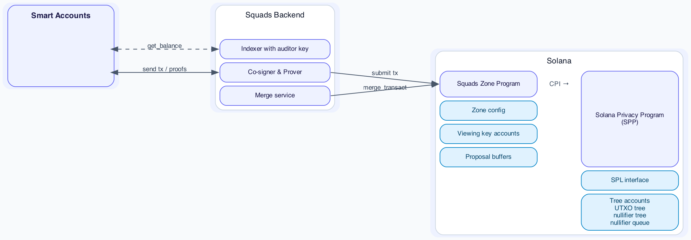

# Squads Zone Program

The Squads Zone Program configures a zone on The Solana Privacy Protocol (TSPP), which provides private transfers in a single Solana transaction. The zone adds compliance features, a co-signer, and smart-account support.
TODO: lookup requirements again and tick all boxes in the intro.

For compliance, the zone program configures an auditor encryption key and verifies a zk proof in every transfer instruction. The zone zk proof shows that all balance updates are encrypted to an auditor-readable key, so the auditor can decrypt and index all balances.

For smart accounts, the program supports asynchronous execution and user accounts with shared encryption keys. Asynchronous execution uses a proposal buffer that a co-signer or relayer executes after approval. User accounts store encryption keys shared between the auditor and one or more smart account holders. The auditor and recovery keys can be rotated by proving the new shared key is encrypted to every key holder.

Balances are stored in unspent transaction outputs (UTXOs). For an account-like experience, the Squads backend consolidates UTXO balances so users can spend their full balance in one transfer. The squads zone depends on its backend and co-signer for liveness. To ensure that users can withdraw funds without the Squads backend, users can sync their wallets from RPC data alone, decrypt locally, and withdraw without a co-signer.

This document specifies how the zone program fits into the TSPP architecture, shared viewing keys between smart account holders and auditors, the program's accounts, its zone proof, its instructions, its zone-specific encrypted UTXO serialization, and transaction sizes.


## Table of Contents

- [Glossary](#glossary)
- [Architecture](#architecture)
- [Operations](#operations)
  - [User](#user)
  - [Squads](#squads)
- [Shared Viewing Keys](#shared-viewing-keys)
- [Asynchronous Transfers](#asynchronous-transfers)
- [Concurrency](#concurrency)
- [UTXO Balance Consolidation without User Interaction](#utxo-balance-consolidation-without-user-interaction)
- [Auditor](#auditor)
- [Squads Backend](#squads-backend)
  - [Backend API](#backend-api)
    - [`getBalances`](#getbalances)
    - [`getProposals`](#getproposals)
    - [`requestCreateViewingKeyAccount`](#requestcreateviewingkeyaccount)
    - [`requestTransact`](#requesttransact)
- [Squads Zone Program](#squads-zone-program)
  - [Accounts](#accounts)
    - [Viewing Key Account](#viewing-key-account)
    - [Proposal](#proposal)
    - [Key Update Proposal](#key-update-proposal)
    - [Zone Config](#zone-config)
  - [Zone ZK Proofs](#zone-zk-proofs)
    - [Zone Proof](#zone-proof)
    - [Key Encryption Proof](#key-encryption-proof)
  - [Instructions](#instructions)
    - Synchronous transfers
      - [`transact`](#transact)
      - [`deposit`](#deposit)
    - Asynchronous transfers
      - [`create_proposal`](#create_proposal)
      - [`cancel_proposal`](#cancel_proposal)
      - [`execute_proposal`](#execute_proposal)
    - Viewing key accounts
      - [`create_viewing_key_account`](#create_viewing_key_account)
      - [`update_viewing_key_account`](#update_viewing_key_account)
      - [`fill_key_update`](#fill_key_update)
      - [`execute_key_update`](#execute_key_update)
      - [`cancel_key_update`](#cancel_key_update)
      - [`close_viewing_key_account`](#close_viewing_key_account)
    - Permissionless exit
      - [`toggle_viewing_key_account`](#toggle_viewing_key_account)
      - [`full_withdrawal`](#full_withdrawal)
    - Admin (zone config)
      - [`create_zone_config`](#create_zone_config)
      - [`update_zone_config`](#update_zone_config)
      - [`merge_transact`](#merge_transact)

## Glossary

Types used in this document.

| Type | Encoding | Definition |
| --- | --- | --- |
| `Address` | `[u8; 32]` | Solana account address. |
| `Signature` | `[u8; 64]` | Ed25519 Solana transaction signature. |
| `Instruction` | — | Solana SDK instruction. |
| `P256Pubkey` | `[u8; 33]` | SEC1-compressed P-256 public key: 1-byte parity prefix + 32-byte x-coordinate. |
| `asset_id` | `u64` | Asset identifier in UTXOs and ciphertexts. `1` is SOL; each SPL mint gets a distinct `asset_id ≥ 2`, set in a per-mint PDA at SPL interface creation. |
| `Spp` | — | Solana privacy program. |
| `ZoneProof` | `[u8; 192]` | Compressed Groth16 zone proof with commitment. |
| `SppProof` | `[u8; 192]` | Compressed Groth16 SPP proof with commitment; verified in SPP. |
| `MergeProof` | `[u8; 192]` | Compressed Groth16 merge proof with commitment. Proves a single owner's input UTXOs consolidate into one output UTXO of the same owner and total value, verifiably encrypted to the owner's shared viewing key. |
| `SharedKeyCiphertext` | `[u8; 81]` | HPKE-encrypted shared viewing private key: 33-byte ephemeral P-256 key + 32-byte AES-GCM ciphertext + 16-byte GCM tag. |
| `ProposalCiphertext` | `[u8; 88]` | Operation amount and blinding encrypted to the shared viewing key: 33-byte ephemeral P-256 key + 39-byte AES-GCM ciphertext (8-byte amount + 31-byte blinding) + 16-byte GCM tag. |
| `SenderCiphertext` | `[u8; 32]` | Sender change ciphertext: 16-byte plaintext (`amount`, `asset_id`) + 16-byte GCM tag. |
| `RecipientCiphertext` | `[u8; 63]` | Recipient output ciphertext: 47-byte plaintext (`amount`, `asset_id`, 31-byte `blinding`) + 16-byte GCM tag. |
| `Shielded Address` | — | UTXO owner identity `(signing_pk, nullifier_pk, viewing_pk)`: the spend-authorizing key, the nullifier commitment, and the viewing key. See [Shielded Address](spec.md#shielded-address). |
| `Shielded Keypair` | — | The wallet-held secrets behind a `Shielded Address`: `signing_sk`, the derived `nullifier_secret`, and the viewing secret key. See [Signing Key](spec.md#signing-key). |
| `nullifier_pubkey` | `[u8; 32]` | Nullifier commitment `Poseidon(nullifier_secret)`; UTXOs to the owner commit to it in their owner hash. A smart-account [viewing key account](#viewing-key-account) holds a per-account random value that rotates with the shared key, since it has no `signing_sk` to derive one from. |
| `nullifier_secret` | `[u8; 31]` | Secret behind `nullifier_pubkey`; together with a UTXO's blinding it produces the UTXO's nullifier. In a viewing key account it is encrypted to the shared viewing key so each recovery key and the auditor can recover it. |


## Architecture



Source: [`diagrams/squads_policy_program.dot`](diagrams/squads_policy_program.dot). Regenerate with `just render-diagrams`.

The squads program builds on top of the Solana Privacy Program (SPP). The backend (indexer, prover, relayer, and auditor) is operated as a single service by Squads; it builds balances and proofs; the user signs; the squads program verifies the [zone proof](#zone-proof) and CPIs SPP. Execution is either synchronous ([transact](#transact)) or asynchronous with a [proposal](#asynchronous-transfers) user flow.
The squads policy program has full control over the features exposed from the SPP and balances of zone users. The SPP ensures correct state transitions, that all UTXOs are fully backed by SPL tokens and only the owner of the balance can spend it.

## Operations

### User

A user is anyone using the zone. Every user has a [viewing key account](#viewing-key-account).

| # | Name | Description | Privacy |
| --- | --- | --- | --- |
| 1 | deposit | Public deposit into a new UTXO; no proof, no co-signer, no backend. | fully public |
| 2 | withdraw | Exit the zone to a public account. | sender visible, withdrawn asset and amount public, remaining account amount private |
| 3 | transfer | Transfer between zone balances. | sender + recipient public, asset + amount private |
| 4 | full_withdrawal | Escape-hatch exit without a co-signer or the backend. | amount + sender + recipient public |
| 5 | create_viewing_key_account | Create an account that registers a shared viewing key, published encrypted to the auditor. | public |
| 6 | update_viewing_key_account | Propose recovery-key changes or a shared-key rotation; sizes the proposal buffer for the executor to fill. | public |
| 7 | toggle_viewing_key_account | Block or unblock transfers and key updates. While blocked, only full_withdrawal is possible. | public |
| 8 | close_viewing_key_account | Close the viewing key account and reclaim rent. | public |
| 9 | create_proposal | Create a proposal account to queue a withdraw or transfer operation for later execution. | public |
| 10 | cancel_proposal | Cancel a queued operation for later execution. | public |
| 11 | cancel_key_update | Cancel a queued key update proposal before execution and reclaim rent. | public |

### Squads

Roles operated by Squads: the auditor, the merge service, the zone creator, and the relayer/co-signer.

| # | Name | Description |
| --- | --- | --- |
| 1 | create_zone_config | Create the zone — set the auditor key and co-signer. |
| 2 | update_zone_config | Rotate the auditor key, co-signer, or authority; burning the authority freezes the config. |
| 3 | execute_proposal | Relayer/co-signer settles an approved proposal. |
| 4 | merge_transact | Merge service consolidates a user's zone UTXOs. |
| 5 | index (audit) | Auditor decrypts every zone UTXO via each user's shared viewing secret; cannot sign or spend. |
| 6 | migrate auditor | Co-signer rotates a viewing key account to the new zone auditor via `update_viewing_key_account`, when the stored auditor differs from `zone_config`. |
| 7 | fill_key_update | Executor fills a key update proposal buffer with the new shared-key ciphertexts. |
| 8 | execute_key_update | Backend settles an approved key update proposal with the key encryption proof. |


## Shared Viewing Keys

An auditor and a smart account with multiple keys need a shared viewing key so every key holder can view its UTXOs.

Viewing key accounts create, distribute, and store shared viewing keys. At creation several viewing keys are declared, one per smart account key holder plus the auditor(s). The account stores the shared key's public key and its private key encrypted separately to each declared viewing key. At account creation and with any key rotations a zero knowledge proof proves that the encrypted private keys are correctly encrypted to all individual encryption keys. Each key holder and the auditor can then recover the shared private key independently.

UTXOs transferred to and from the account are encrypted to the shared key, so any eligible viewer can decrypt them. Verifiable encryption proves each UTXO is encrypted to the shared key. A viewing key account is required for sender and recipient of any operation in the squads zone.

## Asynchronous Transfers

Smart accounts controlled by several keys with an approval threshold need to collecting signatures over multiple transactions for a proposal. The proposal cannot contain a SPP zk proof because SPP proofs reference a recent Merkle tree root which are only valid for a short time. To address this issue the Squads policy program implements a proposal user flow. 

A key holder creates a proposal that commits to a single operation (withdrawal or transfer) and encrypts the amount to the shared viewing key. The remaining signers approve the proposal through the smart account.

Once the threshold is met, a co-signer or relayer holding the shared viewing key decrypts the proposal, builds the proof, and executes the transaction. The proposer can cancel a proposal before it executes, and a proposal expires at a set Unix timestamp.

The zone program does not verify the smart-account threshold itself. Approval is enforced by the smart account program that votes on the `create_proposal` instruction. The zone program treats an existing `Proposal` account as an approved operation; `execute_proposal` checks only the co-signer and the proof.

## Concurrency

A private balance consists out of one or multiple UTXOs. Every UTXO can be spent independently or multiple UTXOs can be spent in the same transaction.

**Incoming transactions** are parallel without limit. Each transfer creates a new UTXO for the recipient, so transfers to a user run in parallel without limit. at the cost of fragmentation: the balance spreads across many UTXOs. The backend merges incoming UTXOs on demand so the user can spend their full balance in one transfer.

**Outgoing transactions** are limited by the number of UTXOs the user balance is composed of. The default is for every account to only hold one UTXO of every asset. To send multiple transfers in parallel from one keypair, a user splits their balance into several UTXOs in one transaction, then spends each in separate parallel transactions.

## UTXO Balance Consolidation

Incoming transfers and deposits create new UTXOs. In a standard private transfer we spend two UTXOs.
To achieve user experience similar to accounts the user balances should be a single or few UTXOs per asset so that the complete balance can be spent in a single Solana transaction.

Whitelisted authorities can consolidate user balances in a specialized merge circuit which does not require the user to sign and merges UTXOs of a single user into one. Merge transactions cannot destroy, transfer value or encrypt UTXOs in an invalid way.
Merge authorities do not necesarily hold encryption keys thus cannot perform any actions without the backend or user revealing UTXOs to merge.
The merge feature is native to the SPP, the squads program has complete control to configure or disable this feature.


## Auditor 

A P256 public key stored in `ZoneConfig.auditor_keys` (one for now). The auditor key is held by the backend.

1. **Keys held** — P-256 encryption keypair.
2. **Can do** — Decrypt every zone UTXO via the shared viewing secret in each [viewing key account](#viewing-key-account).
3. **Cannot do** — Sign, spend, block transfers.
4. **Key rotation** — Rotates with `update_zone_config`; existing viewing key accounts are then migrated by the co-signer via `update_viewing_key_account`.

## Squads Backend

The Squads backend indexes decrypted UTXOs, provides balances to users, runs the prover and merges users' UTXOs.

1. **Keys held** — `zone_authority` (Solana keypair) and `auditor` (P256 encryption) keypairs.
2. **Can do** — Decrypt every zone UTXO via the shared viewing secret in each [viewing key account](#viewing-key-account); censor users, order transactions. Merge user UTXOs.
3. **Cannot do** — Transfer user tokens without their signature, change user transactions.

### Backend API

JSON-RPC. The backend decrypts a user's UTXOs and proposals with the shared viewing key, generates the zk proofs, and builds and sends the Solana transaction. The shielded payload — `encrypted_utxos` and the input/output selection — is built client-side, since building it needs wallet secrets. Instructions without a proof — `deposit`, `create_proposal`, and `update_viewing_key_account` — are built client-side and need no endpoint; `deposit` involves neither the backend nor a co-signer (the co-signer builds the auditor-update variant of `update_viewing_key_account`).

Any request that returns decrypted data (`getBalances`, `getProposals`) includes a `signature` by the viewing key account owner (or a smart account key holder); the backend rejects reads of another user's data.

A `request*` call returns the built instruction for a smart account to wrap and submit; for a keypair owner the backend sends the transaction and sets `signature`.

#### `getBalances`

Returns the user's balance per asset, decrypted with the shared viewing key: one `AssetBalance` per asset, with its total `amount` and the UTXOs that sum to it. `skip_utxos` leaves each `utxos` empty; `amount` is still returned.

```rust
struct GetBalancesRequest {
    viewing_key_account: Address,
    /// When true, each AssetBalance.utxos is empty.
    skip_utxos: bool,
    signature: [u8; 64],
}

struct GetBalancesResponse {
    balances: Vec<AssetBalance>,
}

struct AssetBalance {
    asset_id: u64,
    /// SPL mint; Address::default() for SOL.
    mint: Address,
    /// Total across the asset's UTXOs.
    amount: u64,
    /// The asset's UTXOs; empty when skip_utxos.
    utxos: Vec<DecryptedUtxo>,
}

struct DecryptedUtxo {
    utxo_hash: [u8; 32],
    asset_id: u64,
    amount: u64,
    blinding: [u8; 31],
}
```

#### `getProposals`

Returns the pending proposals for a viewing key account, decrypted.

```rust
struct GetProposalsRequest {
    viewing_key_account: Address,
    signature: [u8; 64],
}

struct GetProposalsResponse {
    proposals: Vec<DecryptedProposal>,
}

struct DecryptedProposal {
    pda: Address,
    /// withdraw | transfer
    op: u8,
    asset_id: u64,
    amount: u64,
    recipient: Address,
    expiry: i64,
    proposal_hash: [u8; 32],
}
```

#### `requestCreateViewingKeyAccount`

Builds the [key encryption proof](#key-encryption-proof) and the `create_viewing_key_account` instruction. Without `owner_signature`, the created account is only encrypted to the auditor key.

```rust
struct RequestCreateViewingKeyAccountRequest {
    owner: Address,
    recovery_keys: Vec<P256Pubkey>,
    owner_signature: Option<[u8; 64]>,
}

enum RequestCreateViewingKeyAccountResponse {
    /// Smart account: wrap and submit.
    Instruction { viewing_key_account: Address, instruction: Instruction },
    /// Keypair: the backend sent the transaction.
    Signature { viewing_key_account: Address, signature: Signature },
}
```

#### `requestTransact`

Sync smart account transfers and withdrawals return an instruction, sync keypair transactions return a solana signature.
Builds the zone proof, the SPP proof, and the [`transact`](#transact) instruction for a withdrawal or transfer, selected by `transaction_type`. `owner_signature` signs `transaction_type` and `intent` together. (Deposits are public and self-serve — see [`deposit`](#deposit) — so they have no endpoint here.)

```rust
struct RequestTransactRequest {
    /// Transfer, Withdrawal
    transaction_type: TransactionType,
    intent: PrivateTransactionIntent,
    /// None for smart accounts, Some for P256 owners
    owner_signature: Option<[u8; 64]>,
}

enum RequestTransactResponse {
    /// Smart account: wrap, partial-sign, co-signer co-signs, submit.
    Instruction(Instruction),
    /// Keypair: backend co-signed and sent the transaction.
    Signature(Signature),
}

enum TransactionType {
    Transfer { recipient_viewing_key_account: Address },
    Withdraw { sol: Option<PublicSol>, spl: Option<PublicSpl> },
}

struct PublicSol {
    public_amount: u64,
    user_sol_account: Address,
}

struct PublicSpl {
    public_amount: u64,
    user_spl_token_account: Address,
    spl_token_interface: Address,
}

struct OutputUtxo {
    owner: Address,
    asset_id: u64,
    amount: u64,
    blinding: [u8; 31],
}

struct PrivateTransactionIntent {
    sender_viewing_key_account: Address,
    inputs: Vec<DecryptedUtxo>,
    outputs: Vec<OutputUtxo>,
    encrypted_utxos: EncryptedUtxos,
    expiry: i64,
}
```


## Squads Zone Program

### Accounts
Layouts of accounts owned by the squads zone program. Which instructions create, read, write and close the accounts.

#### Viewing Key Account

Stores the user's shared viewing key and the ciphertexts that let each recovery key and the auditor recover the shared private key. It also holds the `nullifier_pubkey` commitment and the nullifier secret encrypted to the shared viewing key, so each recovery key and the auditor can recover it to derive spend nullifiers. The nullifier secret is a per-account random value. One account per zone user.

Derivation seed: `[b"viewing_key_account", owner]`.

Created by `create_viewing_key_account`. `update_viewing_key_account` updates recovery keys, rotates the shared key, or migrates the auditor; `toggle_viewing_key_account` sets `state`; `close_viewing_key_account` reclaims rent.

```rust
struct ViewingKeyAccount {
    /// Account type tag.
    discriminator: u8,
    /// Solana account or smart account PDA that owns this record and authorizes its updates.
    owner: Address,
    /// Active, or transfers blocked (see toggle_viewing_key_account).
    state: u8,
    /// Encryption scheme for the shared key and UTXO ciphertexts. P256_AES = 1.
    encryption_scheme: u8,
    /// Public shared viewing key. UTXOs to and from `owner`
    /// are encrypted to it.
    shared_viewing_key: P256Pubkey,
    /// Incremented on each rotation; orders key updates.
    key_nonce: u64,
    /// Nullifier commitment for `owner`'s UTXOs; replaced on each rotation.
    nullifier_pubkey: [u8; 32],
    /// Nullifier secret encrypted to the shared viewing key, letting each recovery
    /// key and the auditor recover it to derive spend nullifiers. Rotated to a
    /// fresh random value on execute_key_update.
    encrypted_nullifier_secret: SharedKeyCiphertext,
    /// One recovery key per smart account key holder.
    recovery_keys: Vec<P256Pubkey>,
    /// Shared private key encrypted to each `recovery_keys[i]`.
    recovery_key_ciphertexts: Vec<SharedKeyCiphertext>,
    /// One key per auditor declared for the zone.
    auditor_keys: Vec<P256Pubkey>,
    /// Shared private key encrypted to each `auditor_keys[i]`.
    auditor_key_ciphertexts: Vec<SharedKeyCiphertext>,
}
```

ViewingKeyAccount size is `205 + 114·(R + A)` bytes, for `R` recovery keys and `A` auditors (the 32-byte `nullifier_pubkey` and 81-byte `encrypted_nullifier_secret` are in the fixed part; four 4-byte `Vec` length prefixes, borsh-packed):

| Recovery keys (R) | Auditors (A) | Size (bytes) |
| --- | --- | --- |
| 1 | 1 | 433 |
| 2 | 1 | 547 |
| 3 | 1 | 661 |
| 5 | 1 | 889 |
| 10 | 1 | 1459 |


#### Proposal

The proposal account holds the parameters of a queued withdrawal or transfer. The `proposal_hash` is a public input to the [zone proof](#zone-proof) so that the executor who creates the proof when sending the transaction cannot change the operation between approval and execution.

Derivation seed: `[b"proposal", owner, cipher_text[0..33]]`. The ciphertext prefix is the ephemeral P-256 key, fresh per encryption, so each proposal derives a distinct PDA.

Created by `create_proposal`. `execute_proposal` settles the operation and closes the proposal; `cancel_proposal` closes it before execution. Either close returns the rent to `rent_payer`. A proposal expires once the cluster Unix time passes `expiry`.

```rust
struct Proposal {
    /// Account type tag.
    discriminator: u8,
    /// Viewing key account whose UTXOs the operation spends.
    owner: Address,
    /// Recipient owner for a transfer, SPL account for a withdrawal.
    recipient: Address,
    /// Asset mint. SOL is Address::default().
    asset: Address,
    /// Poseidon commitment over the operation parameters; public input to the
    /// zone proof at execution.
    proposal_hash: [u8; 32],
    /// Amount and blinding encrypted to the shared viewing key.
    cipher_text: ProposalCiphertext,
    /// Unix timestamp after which execution fails.
    expiry: i64,
    /// Account that paid the rent; receives it back when the proposal closes.
    rent_payer: Address,
}
```

Size: `257` bytes (`1 + 32 + 32 + 32 + 32 + 88 + 8 + 32`, borsh-packed).

#### Key Update Proposal

Queues an async update to a viewing key account's recovery keys and buffers the new shared-key ciphertexts. The account is sized at creation for `K = R' + A` ciphertexts, where `R'` is the resulting recovery-key count (the target [viewing key account](#viewing-key-account)'s count after applying the proposal's `operations`) and `A` the auditor count. The `executor` fills the buffer via [fill_key_update](#fill_key_update) (in chunks if it exceeds one transaction); `execute_key_update` copies it into the viewing key account and supplies only the proof.

Derivation seed: `[b"key_update_proposal", target, domain]`

A smart account holder proposes the update through `update_viewing_key_account`; once the smart account approves, the backend settles it with `execute_key_update` and closes the proposal. `cancel_key_update` closes it before execution. Either close returns the rent to `rent_payer`. The proposal also expires once the cluster Unix time passes `expiry`.

```rust
struct KeyUpdateProposal {
    /// Account type tag.
    discriminator: u8,
    /// Domain separation for pda derivation.
    domain: u16,
    /// Viewing key account to update.
    target: Address,
    /// Recovery-key changes applied in array order, or a single auditor update.
    operations: Vec<KeyOperation>,
    /// New shared private key encrypted to each resulting recovery key, then the auditor.
    /// Filled by the executor and copied into the viewing key account at execution.
    new_key_ciphertexts: Vec<SharedKeyCiphertext>,
    /// Unix timestamp after which execution fails.
    expiry: i64,
    /// Executor fills new_key_ciphertexts and executes the update transaction.
    executor: Address,
    /// Account that paid the rent; receives it back when the proposal closes.
    rent_payer: Address,
}

struct KeyOperation {
    /// Add, remove, or replace a recovery key, or update the auditor.
    op: u8,
    /// Recovery-key slot the op applies to, in the list as it stands at this step
    /// (remove and replace); ignored for add (appends) and auditor update.
    index: u8,
    /// New recovery key for add and replace; ignored for remove and auditor update
    /// (the auditor is read from `zone_config`).
    key: P256Pubkey,
}
```

`operations` apply in array order to the target's `recovery_keys`; the resulting count is `R'`. A proposal holds either a batch of recovery-key ops (smart-account approval) or a single auditor-update op; the two are not mixed. The auditor-update op is valid only when `zone_config.auditor_keys` differs from the stored auditor keys, is signed by the co-signer, and triggers a full rotation like the recovery-key ops.

Size is `115 + 35·O + 81·K` bytes for `O` operations and `K = R' + A` buffered ciphertexts (fixed part `1 + 2 + 32 + 8 + 32 + 32 = 107` plus two 4-byte `Vec` length prefixes; each `KeyOperation` is 35 and each `SharedKeyCiphertext` 81).

#### Zone Config

The zone's config account, one per program, contains the auditor keys that must be part of every shared viewing key, the optional co-signer, the bound on proposal lifetime, and the authorities allowed to run [merge_transact](#merge_transact). `auditor_keys` is a vec, but `create_zone_config` and `update_zone_config` enforce exactly one key for now.

Derivation seed: `[b"zone_config"]`.

Created by `create_zone_config`. `update_zone_config` rotates the auditor key or co-signer, or transfers `authority`; setting `authority` to the default freezes the config against further updates.

```rust
struct ZoneConfig {
    /// Account type tag.
    discriminator: u8,
    /// Authority that can update the zone. The default value freezes it.
    authority: Address,
    /// Solana key that must co-sign every spend. The default value disables co-signing.
    co_signer: Address,
    /// Upper bound on a proposal's `expiry`, in seconds from creation.
    max_proposal_lifetime: i64,
    /// Zone auditor keys; exactly one for now. Every output UTXO is encrypted to them.
    auditor_keys: Vec<P256Pubkey>,
    /// Authorities allowed to run merge_transact.
    merge_authorities: Vec<Address>,
}
```

Size: `81 + 33·A + 32·M` bytes for `A` auditor keys and `M` merge authorities (fixed part `1 + 32 + 32 + 8 = 73` plus two 4-byte `Vec` length prefixes; each auditor key 33, each authority 32).


### Zone ZK Proofs

The zone verifies its own ZK proof (Groth16), separate from the SPP proof which proves the UTXO transfer. The SPP proof settles the UTXO state transition; the zone proof enforces the verifiable encryption. Both proofs pass the `private_tx_hash` as public input to constrain them to the same transaction.

#### Zone Proof

Verified by `transact` and `execute_proposal`. One circuit covers both spend flows, withdrawal and transfer; a withdrawal's single output is the sender change. It enforces the verifiable encryption of every output to its recipient's auditor-shared viewing key, and the canonical derivation of the sender's change blinding.

**Public Inputs**

| Input | Source |
| --- | --- |
| `private_tx_hash` | instruction data; shared with the SPP proof |
| `recipient_viewing_keys` | recipient ViewingKeyAccount(s) |
| `sender_viewing_key` | sender ViewingKeyAccount's `shared_viewing_key`; the change output is encrypted to it (transfer and withdrawal) |
| `output_utxo_ciphertexts` | instruction data; includes `tx_viewing_pk` |
| `output_utxo_hashes` | instruction data; the same output commitments the SPP proof commits in `private_tx_hash` |
| `public_amount` | instruction data (withdrawal; `0` for transfer) |
| `proposal_hash` | Proposal account (async only); `0` for sync `transact`, where the owner's signature over `private_tx_hash` already covers the outputs |
| `first_nullifier` | equals the SPP proof's first nullifier; seeds per-transaction uniqueness of `tx_viewing_sk` |

**Private Inputs**

| Input | Description |
| --- | --- |
| `viewing_sk` | shared viewing secret behind `sender_viewing_key`; supplied by the wallet or auditor |
| output plaintexts | per output: `amount`, `asset`, `blinding`; the body fields encrypted into `output_utxo_ciphertexts` and recomputed into `output_utxo_hashes[i]` |

**Checks**

| Check | Description |
| --- | --- |
| Output encryption | Every output UTXO is encrypted to its named recipient viewing key. |
| Output binding | Each output's `(owner, amount, asset, blinding)` recomputes to its `output_utxo_hashes[i]`, so the ciphertext describes the UTXOs the SPP proof settles via `private_tx_hash`. |
| Amount binding | The encrypted output amounts match the committed operation (`public_amount` / `proposal_hash`). |
| Shared key binding | `viewing_sk · G == sender_viewing_key`, pinning the witnessed secret to the sender account. |
| Keypair consistency | `tx_viewing_pk == tx_viewing_sk · G`, against the `tx_viewing_pk` in `output_utxo_ciphertexts`. |
| Change blinding | The change output's `blinding` equals the derivation below (its `output_utxo_hashes[i]` then follows from Output binding). |

**Change-blinding derivation: Poseidon KDF chain.** All steps are checked by the zone proof; the auditor reruns the chain on the shared viewing key to recompute the blinding. P-256 scalars are absorbed as hi/lo limbs, since Poseidon runs over the BN254 field.

```
view_root         = PoseidonKDF(viewing_sk)
tx_viewing_secret = PoseidonKDF(view_root, "TSPP/tx_viewing")
tx_viewing_sk     = PoseidonKDF(tx_viewing_secret, first_nullifier)
blinding          = PoseidonKDF(tx_viewing_sk, "blinding")
```

#### Key Encryption Proof

Verified by `create_viewing_key_account` and `execute_key_update`. Proves the inserted ciphertexts encrypt the shared viewing private key to every recovery and auditor key, and that `encrypted_nullifier_secret` encrypts the nullifier secret for `nullifier_pubkey = Poseidon(nullifier_secret)`. `old_state_hash` is the account's prior keys-and-ciphertexts hash for an update (including the prior `nullifier_pubkey` and `encrypted_nullifier_secret`), and `0` at creation. Under `execute_key_update` every update is a full rotation: the new shared private key is re-encrypted to all `R'` resulting recovery keys and the auditor.

**Public inputs**

1. `old_state_hash` — `0` at creation; the account's current keys-and-ciphertexts hash for an update.
2. `shared_viewing_key` (`new_shared_viewing_key` for an update) — instruction data.
3. recovery and auditor keys — recovery from instruction data and auditor from ZoneConfig at creation; for an update, recovery is the target's `recovery_keys` with the proposal's `operations` applied, and auditor from ZoneConfig.
4. recovery and auditor ciphertexts — instruction data at creation; KeyUpdateProposal buffer for `execute_key_update`.
5. `nullifier_pubkey` (`new_nullifier_pubkey` for an update) — instruction data.
6. `encrypted_nullifier_secret` — instruction data at creation; re-encrypted to the new shared viewing key for an update.

### Instructions

**Synchronous transfers**

| # | Instruction | Tag | Description | Co-Signer | Accounts Read | Accounts Modified | Access Control |
|---|------------|-----|-------------|:---------:|---------------|-------------------|----------------|
| 1 | [transact](#transact) | 0 | Withdrawal or transfer; verifies the zone proof and CPIs SPP. | ✓ | ZoneConfig, sender + recipient ViewingKeyAccount | SPP trees (CPI), SPL interface account | zk proof that owner signed; co-signer signed |
| 2 | [deposit](#deposit) | 1 | Public deposit into a new UTXO; no proof or co-signer. | — | recipient ViewingKeyAccount | SPP UTXO tree (CPI), SPL interface account | Depositor signs |

**Asynchronous transfers**

| # | Instruction | Tag | Description | Co-Signer | Accounts Read | Accounts Modified | Access Control |
|---|------------|-----|-------------|:---------:|---------------|-------------------|----------------|
| 1 | [create_proposal](#create_proposal) | 11 | Queue a withdrawal or transfer for async execution. | — | ViewingKeyAccount | Proposal (create) | Proposer signs (smart account) |
| 2 | [cancel_proposal](#cancel_proposal) | 12 | Cancel a queued proposal before execution. | — | — | Proposal (close) | Proposer / owner signs |
| 3 | [execute_proposal](#execute_proposal) | 13 | Relayer/co-signer settles an approved proposal with the proof. | ✓ | Proposal, ZoneConfig, sender + recipient ViewingKeyAccount | SPP trees (CPI), Proposal (close) | Co-signer / relayer signs |

**Viewing key accounts**

| # | Instruction | Tag | Description | Co-Signer | Accounts Read | Accounts Modified | Access Control |
|---|------------|-----|-------------|:---------:|---------------|-------------------|----------------|
| 1 | [create_viewing_key_account](#create_viewing_key_account) | 5 | Register a shared viewing key with recovery and auditor ciphertexts, the initial `nullifier_pubkey`, and the nullifier secret encrypted to the shared viewing key. | — | ZoneConfig | ViewingKeyAccount (create) | Owner signs to register recovery keys; without the owner signature the account is created auditor-only (no recovery keys) |
| 2 | [update_viewing_key_account](#update_viewing_key_account) | 6 | Propose recovery-key changes, a shared-key rotation, or an auditor update. | — | ViewingKeyAccount, ZoneConfig | KeyUpdateProposal (create) | Smart account approval (recovery); co-signer (auditor update) |
| 3 | [fill_key_update](#fill_key_update) | 7 | Executor appends new shared-key ciphertexts to a key update proposal buffer. | — | — | KeyUpdateProposal (buffer) | Proposal `executor` signs |
| 4 | [execute_key_update](#execute_key_update) | 14 | Backend settles an approved key update proposal with the key encryption proof. | ✓ | KeyUpdateProposal, ZoneConfig | ViewingKeyAccount, KeyUpdateProposal (close) | Proposal `executor` signs (proof); co-signer signs |
| 5 | [cancel_key_update](#cancel_key_update) | 15 | Cancel a queued key update proposal before execution and reclaim rent. | — | — | KeyUpdateProposal (close) | Proposer / owner signs (smart account) |
| 6 | [close_viewing_key_account](#close_viewing_key_account) | 8 | Close the viewing key account and reclaim rent. | — | — | ViewingKeyAccount (close) | Owner signs |

**Permissionless exit**

| # | Instruction | Tag | Description | Co-Signer | Accounts Read | Accounts Modified | Access Control |
|---|------------|-----|-------------|:---------:|---------------|-------------------|----------------|
| 1 | [toggle_viewing_key_account](#toggle_viewing_key_account) | 9 | Block or unblock transfers; while blocked, only full_withdrawal remains available. | — | — | ViewingKeyAccount (state) | Owner signs |
| 2 | [full_withdrawal](#full_withdrawal) | 10 | Escape-hatch exit without the co-signer or backend. | — | ViewingKeyAccount | SPP trees (CPI), SPL interface account | Owner signs |

**Admin (zone config)**

| # | Instruction | Tag | Description | Co-Signer | Accounts Read | Accounts Modified | Access Control |
|---|------------|-----|-------------|:---------:|---------------|-------------------|----------------|
| 1 | [create_zone_config](#create_zone_config) | 3 | Create the zone; set the auditor key and co-signer. | — | — | ZoneConfig (create) | Zone creator signs |
| 2 | [update_zone_config](#update_zone_config) | 4 | Rotate the auditor key, co-signer, or authority; burning the authority freezes the config. | — | — | ZoneConfig | `authority` signs |
| 3 | [merge_transact](#merge_transact) | 2 | Merge service consolidates a user's zone UTXOs. | ✓ | ZoneConfig, owner ViewingKeyAccount | SPP trees (CPI) | Whitelisted merge authority (proof); co-signer |

#### transact

Verifies the zone proof, then CPIs SPP `zone_transact`, which verifies the SPP proof and settles the UTXO state transition. It's a single instruction which handles withdrawal and transfer; `public_amount` implicitly selects the operation per call.

**Accounts**

1. `payer` — fee payer (relayer for transfer/withdrawal); signer, writable.
2. `co_signer` — zone co-signer; signer.
3. `zone_config` — read.
4. `sender_viewing_key_account` — read.
5. `recipient_viewing_key_account` — read (transfer only).
6. `zone_auth` — zone PDA; signs the SPP CPI.
7. `spp_program` — SPP program (CPI target).
8. `tree_account` — SPP nullifier + UTXO trees; writable. TODO: allow multiple trees

**Instruction data**

`M` = output UTXOs, `N` = spent inputs.

```rust
struct TransactIxData {
    /// Compressed Groth16 zone proof with commitment.
    zone_proof: ZoneProof,
    /// Compressed Groth16 SPP proof; forwarded to SPP.
    spp_proof: SppProof,
    /// Some for withdrawal, None for transfer.
    public_amount: Option<u64>,
    /// Public input shared with the SPP proof.
    private_tx_hash: [u8; 32],
    /// Unix timestamp after which the transaction is rejected.
    expiry: i64,
    /// One hash per output UTXO. Length M.
    output_utxo_hashes: Vec<[u8; 32]>,
    /// Per input: root-cache index in its UTXO tree. Length N.
    utxo_tree_root_index: Vec<u16>,
    /// Per input: root-cache index in its nullifier tree. Length N.
    nullifier_tree_root_index: Vec<u16>,
    /// Output ciphertexts, zone serialization. Checked by the zone proof, not parsed by SPP.
    encrypted_utxos: Vec<u8>,
}
```

**Encrypted UTXO Serialization**

The `sender_viewing_key_account` and `recipient_viewing_key_account` identify the owners and serve as view tags, so the ciphertext contains no pubkeys or tags. A transfer moves one asset with no separate SOL change, so the sender has one change output and each recipient one. The asset stays private; each ciphertext includes its own `asset_id`.

The sender change derives its blinding as a Poseidon KDF of `tx_viewing_sk` (itself derived from the shared viewing key; see [Zone Proof](#zone-proof)), so only its amount and asset are transmitted, in a separate ciphertext encrypted to the sender's shared viewing key. Each recipient output transmits amount, asset, and the sender-chosen blinding, encrypted to the recipient's shared viewing key. One ephemeral `tx_viewing_pk` is shared across all ciphertexts.

```rust
struct EncryptedUtxos {
    /// Ephemeral P-256 key; ECDH with the sender's and each recipient's shared viewing key.
    tx_viewing_pk: P256Pubkey,
    /// Sender change: amount + asset. Blinding is derived, not transmitted.
    sender_ciphertext: SenderCiphertext,
    /// One per recipient UTXO. Length R.
    recipient_ciphertexts: Vec<RecipientCiphertext>,
}

struct SenderPlaintext {
    amount: u64,
    asset_id: u64,
}

struct RecipientPlaintext {
    amount: u64,
    asset_id: u64,
    /// Random blinding chosen by the sender.
    blinding: [u8; 31],
}
```

The recipient reconstructs its UTXO from the plaintext plus `owner` (the `recipient_viewing_key_account` owner). The sender derives its change blinding from `tx_viewing_sk`.

The Squads backend is the relayer and the `payer`: it pays the Solana base fee natively, so there is no reimbursement. The zone passes `relayer_fee = 0` to the SPP CPI and omits the field from its own instruction data.

Blob size: `33 (tx_viewing_pk) + 32 (sender_ciphertext) + 4 (Vec len) + 63·R`.

| R | Blob (B) |
| --- | --- |
| 0 | 69 |
| 1 | 132 |

**Transaction Size**

Fixed-size fields: `zone_proof 192 + spp_proof 192 + private_tx_hash 32 + expiry 8 = 424`, plus `public_amount` (1 `None`, 9 `Some`). Four `Vec` fields each add a 4-byte length prefix: `output_utxo_hashes` (`32·M`), `utxo_tree_root_index` (`2·N`), `nullifier_tree_root_index` (`2·N`), and `encrypted_utxos` (`69 + 63·R`, see [Encrypted UTXO Serialization](#encrypted-utxo-serialization)). Data total for a transfer: `510 + 32·M + 4·N + 63·R`.

Each account address costs 32 bytes when written in full, or ~1 byte when referenced through an address-lookup table (ALT). The static accounts (`zone_config`, `zone_auth`, `spp_program`, `tree_account`) are referenced through the ALT; `payer`, `co_signer`, the viewing key accounts, and `zone_program_id` are written in full. The transaction total assumes one signer (65 B), the message header (3 B), a recent blockhash (32 B), and the instruction framing.

| Shape | Inputs (N) | Outputs (M) | Data (B) | Full keys | ALT keys | Tx total (B) |
| --- | --- | --- | --- | --- | --- | --- |
| transfer | 1 | 2 | 641 | 5 | 4 | 954 |

**Withdraw Transaction Size**

A withdrawal is a 1-in 1-out circuit with the withdrawn amount public (`public_amount` `Some`, 9 B). The single output is the sender's change, so it uses only the sender ciphertext (`R = 0`, `encrypted_utxos` `69` B), and there is no `recipient_viewing_key_account`.

Data, at `M = N = 1`: `424 + 9 (public_amount) + (4 + 32) + (4 + 2) + (4 + 2) + (4 + 69) = 554` B.

A withdrawal also moves SPL out of the SPL interface account: `spl_token_program` and `spl_interface` are referenced through the ALT, and `spl_recipient_account` is written in full.

| Shape | Inputs (N) | Outputs (M) | Data (B) | Full keys | ALT keys | Tx total (B) |
| --- | --- | --- | --- | --- | --- | --- |
| withdraw | 1 | 1 | 554 | 5 | 6 | 871 |

#### deposit

Deposits SPL or SOL into the zone. Amount, asset, and recipient are public. The UTXO hash is computed in the SPP program.

**Accounts**

1. `depositor` — owner of the SPL source; signs to authorize the SPL transfer; writable.
2. `recipient_viewing_key_account` — read; owns the new UTXO.
3. `zone_auth` — zone PDA; signs the SPP CPI.
4. `spp_program` — SPP program (CPI target).
5. `tree_account` — SPP UTXO tree; writable.
6. `spl_source` — the depositor's token account; writable.
7. `spl_interface` — the SPL interface account; the `asset_id` is read from it.
8. `spl_token_program` — token program for the transfer.

**Instruction data**

```rust
struct DepositIxData {
    /// Public deposit amount moved into the SPL interface account.
    amount: u64,
}
```

#### create_proposal

Queues one withdrawal or transfer for asynchronous execution by creating a [proposal](#proposal) account that commits to the operation via `proposal_hash`. The smart account votes on this instruction; the zone program treats the resulting account as approved (see [Asynchronous Transfers](#asynchronous-transfers)). [execute_proposal](#instructions) later settles it.

**Accounts**

1. `fee_payer` — pays rent; signer, writable.
2. `proposal` — the [proposal](#proposal) account, created at its derived PDA; writable.
3. `viewing_key_account` — the [viewing key account](#viewing-key-account) whose UTXOs the operation spends; read.
4. `system_program` — read.
5. `owner` — the smart account vault, signing through the approving Squads CPI; signer. Must equal `viewing_key_account.owner`.

**Instruction data**

```rust
struct CreateProposalIxData {
    /// Recipient owner for a transfer, SPL account for a withdrawal.
    recipient: Address,
    /// Asset mint. SOL is Address::default().
    asset: Address,
    /// Operation commitment; a public input to the zone proof at execution.
    proposal_hash: [u8; 32],
    /// Amount and blinding encrypted to the shared viewing key.
    cipher_text: ProposalCiphertext,
    /// Unix timestamp after which execution fails.
    expiry: i64,
}
```

The program sets `discriminator`, `owner` (= `viewing_key_account`), and `rent_payer` (= `fee_payer`), then copies the remaining fields into the [proposal](#proposal).

#### cancel_proposal

Closes a queued [proposal](#proposal) before execution and reclaims its rent. Takes no instruction data.

**Accounts**

1. `owner` — the smart account vault; signer. Must equal `viewing_key_account.owner`.
2. `viewing_key_account` — the proposal's `owner`; read.
3. `proposal` — closed; writable. Its `owner` must equal `viewing_key_account`.
4. `rent_recipient` — must equal the proposal's `rent_payer`; receives the reclaimed rent; writable.

#### execute_proposal

Settles an approved [proposal](#proposal). Like [transact](#transact), it verifies the [zone proof](#zone-proof) and CPIs SPP to settle the withdrawal or transfer, but reads `proposal_hash` from the proposal as the zone proof public input rather than from instruction data. After settlement it closes the proposal and returns the rent to `rent_payer`. Execution fails once the cluster Unix time passes the proposal's `expiry`.

**Accounts**

1. `payer` — fee payer (relayer); signer, writable.
2. `co_signer` — zone co-signer; signer.
3. `zone_config` — read.
4. `proposal` — read for the operation, then closed; writable.
5. `sender_viewing_key_account` — the proposal's `owner`; read.
6. `recipient_viewing_key_account` — read (transfer only).
7. `rent_recipient` — must equal the proposal's `rent_payer`; receives the reclaimed rent; writable.
8. `zone_auth` — zone PDA; signs the SPP CPI.
9. `spp_program` — SPP program (CPI target).
10. `tree_account` — SPP nullifier + UTXO trees; writable.

**Instruction data**

Matches [transact](#transact)'s `TransactIxData` without `expiry`; the proposal supplies `proposal_hash` (the zone proof public input), `recipient`, and `asset`.

#### create_viewing_key_account

Creates the [viewing key account](#viewing-key-account) for `owner` at its derived PDA and verifies the [key encryption proof](#key-encryption-proof) (`old_state_hash = 0`): the ciphertexts encrypt the shared viewing private key to every recovery key and the auditor, and `encrypted_nullifier_secret` commits to `nullifier_pubkey`. The auditor key is read from `zone_config`. When `owner` signs, the supplied `recovery_keys` are registered; without the owner signature the account is auditor-only (empty `recovery_keys`), and the owner adds recovery keys later through [update_viewing_key_account](#update_viewing_key_account). The program sets `key_nonce` to `0` and `state` to active.

**Accounts**

1. `fee_payer` — pays rent; signer, writable.
2. `owner` — account owner and PDA seed; signs only to register `recovery_keys`.
3. `viewing_key_account` — created at its derived PDA; writable.
4. `zone_config` — read; supplies the auditor key.
5. `system_program` — read.

**Instruction data**

```rust
struct CreateViewingKeyAccountIxData {
    /// Compressed Groth16 key encryption proof with commitment.
    key_encryption_proof: [u8; 192],
    /// Encryption scheme for the shared key and UTXO ciphertexts.
    encryption_scheme: u8,
    /// Public shared viewing key.
    shared_viewing_key: P256Pubkey,
    /// Nullifier commitment.
    nullifier_pubkey: [u8; 32],
    /// Nullifier secret encrypted to the shared viewing key.
    encrypted_nullifier_secret: SharedKeyCiphertext,
    /// Smart account holder keys; empty for an auditor-only account.
    recovery_keys: Vec<P256Pubkey>,
    /// Shared private key encrypted to each recovery key, then the auditor.
    key_ciphertexts: Vec<SharedKeyCiphertext>,
}
```

#### update_viewing_key_account

Creates a [key update proposal](#key-update-proposal) for one or more recovery-key changes (with a shared-key rotation) or an auditor update, allocating its buffer for `K = R' + A` ciphertexts from the target's resulting recovery-key count `R'` (after applying `operations`) and auditor count `A`. The proposer names the `executor` that fills and settles it. Recovery-key ops need smart-account approval; an auditor update is signed by the co-signer and allowed only when `zone_config.auditor_keys` differs from the stored auditor keys. Batching adds lets an auditor-only account register all holder keys in one approved transaction, so an account can hold more recovery keys than fit a single `create_viewing_key_account`.

**Accounts**

1. `proposer` — smart account key holder (recovery/shared-key op) or the co-signer (auditor update); signer, writable (fee payer).
2. `target` — viewing key account to update; read (recovery and auditor counts).
3. `key_update_proposal` — created and sized to `K`; writable.
4. `system_program` — read.
5. `zone_config` — read; checks the co-signer and supplies the new auditor key.

**Instruction data**

```rust
struct UpdateViewingKeyAccountIxData {
    /// Domain separation for the proposal PDA.
    domain: u16,
    /// Signer allowed to fill the buffer and settle the update.
    executor: Address,
    /// Recovery-key changes applied in order, or a single auditor update.
    operations: Vec<KeyOperation>,
    /// Unix timestamp after which execution fails.
    expiry: i64,
}
```

The program sets the proposal's `rent_payer` to `proposer`.

#### fill_key_update

The `executor` appends a chunk of new shared-key ciphertexts to the proposal buffer.

**Accounts**

1. `executor` — must equal the proposal's `executor`; signer, writable (fee payer).
2. `key_update_proposal` — appended to; writable.

**Instruction data**

```rust
struct FillKeyUpdateIxData {
    /// Ciphertexts to append.
    ciphertexts: Vec<SharedKeyCiphertext>,
}
```

#### execute_key_update

Settles an approved [key update proposal](#key-update-proposal): verifies the [key encryption proof](#key-encryption-proof), applies the proposal's `operations` to the target's `recovery_keys` (or `auditor_keys` for an auditor update), copies the new recovery and auditor ciphertexts from the proposal buffer into the [viewing key account](#viewing-key-account), writes the new `shared_viewing_key`, `nullifier_pubkey`, and re-encrypted `encrypted_nullifier_secret`, increments `key_nonce`, and closes the proposal. Before overwriting them, it records the complete pre-rotation viewing key account as a self-CPI event (the program invokes itself with the account as instruction data), so indexers retain the old keys for decrypting balances from before the rotation. Buffering the ciphertexts in the proposal keeps them out of this instruction, so its size is constant in the key count. Requires the buffer fully filled (`new_key_ciphertexts.len() == K`), the signer to equal the proposal's `executor`, and the zone co-signer to sign.

**Accounts**

1. `executor` — must equal the proposal's `executor`; signer, writable (fee payer).
2. `co_signer` — zone co-signer; signer.
3. `viewing_key_account` — target; writable (keys, ciphertexts, `key_nonce`).
4. `zone_config` — read (co-signer and auditor key for the proof).
5. `key_update_proposal` — read, closed; writable.
6. `rent_recipient` — must equal the proposal's `rent_payer`; receives the proposal rent; writable.
7. `system_program` — read.

**Instruction data**

```rust
struct ExecuteKeyUpdateIxData {
    /// Compressed Groth16 key encryption proof with commitment.
    rotation_proof: [u8; 192],
    /// New public shared viewing key.
    new_shared_viewing_key: P256Pubkey,
    /// Fresh nullifier commitment for this rotation.
    new_nullifier_pubkey: [u8; 32],
    /// New random nullifier secret encrypted to the new shared viewing key.
    new_encrypted_nullifier_secret: SharedKeyCiphertext,
}
```

#### cancel_key_update

Closes a queued [key update proposal](#key-update-proposal) before execution and reclaims its rent. Takes no instruction data.

**Accounts**

1. `owner` — the smart account vault; signer. Must equal `target.owner`.
2. `target` — the proposal's target [viewing key account](#viewing-key-account); read.
3. `key_update_proposal` — closed; writable. Its `target` must equal `target`.
4. `rent_recipient` — must equal the proposal's `rent_payer`; receives the reclaimed rent; writable.

#### close_viewing_key_account

Closes the [viewing key account](#viewing-key-account) and reclaims its rent; takes no instruction data. Before clearing it, the program records the complete account as a self-CPI event, so the owner's prior balances stay decryptable after the account is gone.

**Accounts**

1. `owner` — must equal `viewing_key_account.owner`; signer.
2. `viewing_key_account` — closed; writable.
3. `rent_recipient` — receives the reclaimed rent; writable.

#### toggle_viewing_key_account

Sets the [viewing key account](#viewing-key-account)'s `state` to block or unblock transfers and key updates. While blocked, only [full_withdrawal](#full_withdrawal) remains available.

**Accounts**

1. `owner` — must equal `viewing_key_account.owner`; signer.
2. `viewing_key_account` — `state` updated; writable.

**Instruction data**

```rust
struct ToggleViewingKeyAccountIxData {
    /// New account state: active or transfers blocked.
    state: u8,
}
```

#### full_withdrawal

Lets the owner withdraw their balance to a public account without the co-signer or backend. The owner spends their UTXOs and moves the full value out as public SPL or SOL. Every output is public, so there is no private change and no [zone proof](#zone-proof); the owner requests the SPP proof from the Helius RPC and signs. Available even when the account is blocked (see [toggle_viewing_key_account](#toggle_viewing_key_account)).

**Accounts**

1. `owner` — must equal `viewing_key_account.owner`; signer, writable (fee payer).
2. `viewing_key_account` — read; the spent UTXOs' owner.
3. `zone_auth` — zone PDA; signs the SPP CPI.
4. `spp_program` — SPP program (CPI target).
5. `tree_account` — SPP nullifier + UTXO trees; writable.
6. `spl_interface` — SPL interface account; writable.
7. `spl_recipient_account` — public withdrawal destination; writable.
8. `spl_token_program` — token program for the transfer.

**Instruction data**

```rust
struct FullWithdrawalIxData {
    /// Compressed Groth16 SPP proof; forwarded to SPP.
    spp_proof: SppProof,
    /// Public withdrawn amount; the full value of the spent inputs.
    public_amount: u64,
    /// Per input: root-cache index in its UTXO tree. Length N.
    utxo_tree_root_index: Vec<u16>,
    /// Per input: root-cache index in its nullifier tree. Length N.
    nullifier_tree_root_index: Vec<u16>,
}
```

#### create_zone_config

Creates the zone's single [zone config](#zone-config) account at its derived PDA from the supplied values.

**Accounts**

1. `creator` — pays rent; signer, writable.
2. `zone_config` — created at its derived PDA; writable.
3. `system_program` — read.

**Instruction data**

```rust
struct CreateZoneConfigIxData {
    /// Authority that can update the zone; the default freezes it.
    authority: Address,
    /// Co-signer required on every spend; the default disables co-signing.
    co_signer: Address,
    /// Upper bound on a proposal's `expiry`, in seconds from creation.
    max_proposal_lifetime: i64,
    /// Zone auditor keys; must contain exactly one for now.
    auditor_keys: Vec<P256Pubkey>,
    /// Authorities allowed to run merge_transact.
    merge_authorities: Vec<Address>,
}
```

The program sets `discriminator` and copies these into the [zone config](#zone-config). `auditor_keys` must contain exactly one key.

#### update_zone_config

Overwrites the [zone config](#zone-config)'s mutable fields with the supplied values. Setting `authority` to the default freezes the config against further updates. The current `authority` signs.

**Accounts**

1. `authority` — must equal `zone_config.authority`; signer.
2. `zone_config` — updated; writable.

**Instruction data**

```rust
struct UpdateZoneConfigIxData {
    /// New update authority; the default freezes the config.
    authority: Address,
    /// New co-signer; the default disables co-signing.
    co_signer: Address,
    /// New upper bound on a proposal's `expiry`, in seconds from creation.
    max_proposal_lifetime: i64,
    /// New zone auditor keys; must contain exactly one for now.
    auditor_keys: Vec<P256Pubkey>,
    /// New authorities allowed to run merge_transact.
    merge_authorities: Vec<Address>,
}
```

`auditor_keys` must contain exactly one key.

#### merge_transact

Lets a merge authority consolidate one owner's UTXOs into a single UTXO of the same owner and total value, without the owner signing (see [UTXO Balance Consolidation](#utxo-balance-consolidation-without-user-interaction)). It verifies the `MergeProof`, then CPIs SPP's native merge. The signer must be in `zone_config.merge_authorities`; the co-signer signs.

**Accounts**

1. `merge_authority` — must be in `zone_config.merge_authorities`; signer, writable (fee payer).
2. `co_signer` — zone co-signer; signer.
3. `zone_config` — read (merge authorities, co-signer).
4. `owner_viewing_key_account` — read; the owner whose UTXOs are merged.
5. `zone_auth` — zone PDA; signs the SPP CPI.
6. `spp_program` — SPP program (CPI target).
7. `tree_account` — SPP nullifier + UTXO trees; writable.

**Instruction data**

```rust
struct MergeTransactIxData {
    /// Verifiable-encryption merge proof.
    merge_proof: MergeProof,
    /// Compressed Groth16 SPP merge proof; forwarded to SPP.
    spp_proof: SppProof,
    /// Public input shared with the SPP proof.
    private_tx_hash: [u8; 32],
    /// Hash of the consolidated output UTXO.
    output_utxo_hash: [u8; 32],
    /// Per input: root-cache index in its UTXO tree. Length N.
    utxo_tree_root_index: Vec<u16>,
    /// Per input: root-cache index in its nullifier tree. Length N.
    nullifier_tree_root_index: Vec<u16>,
    /// Consolidated output encrypted to the owner's shared viewing key; checked by the merge proof.
    encrypted_utxo: Vec<u8>,
}
```


# TODO:
1. check whether we can use an instruction data eddsa signature with smart accounts then we could eliminate the round trip for the sync smart account user flow

# Notes:
1. Viewing key accounts are compatible with multiple auditors. `ZoneConfig.auditor_keys` is a vec, but create/update enforce length 1 for now. Open: when we allow more than one, should every viewing key account be encrypted to all auditors or only one? (we could let the co-signer enforce this dynamically or assign based on slots.)
2. Relayer fee is hardcoded to 0 since the squads backend pays the fees.
3. No limit on the number of smart account holders and recovery keys, we should cap it, where?
4. For a complete balance history decryption we need the rotated shared viewing keys, blindings, and nullifier secrets. [execute_key_update](#execute_key_update) and [close_viewing_key_account](#close_viewing_key_account) record the complete prior account as a self-CPI event, so indexers can recover them.
