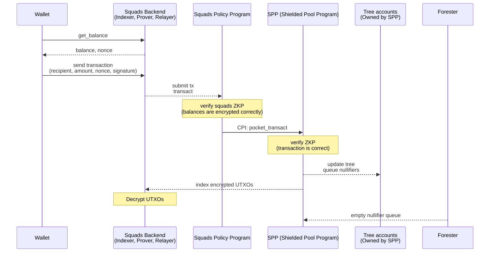
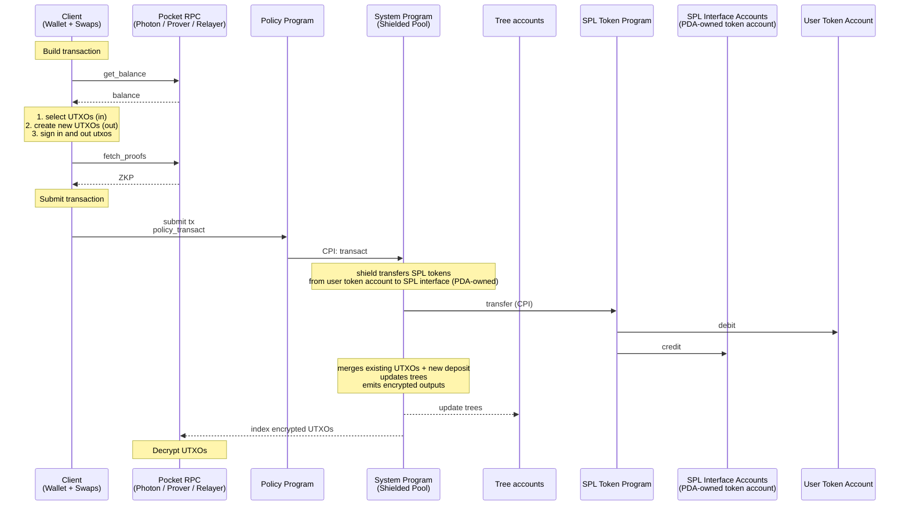
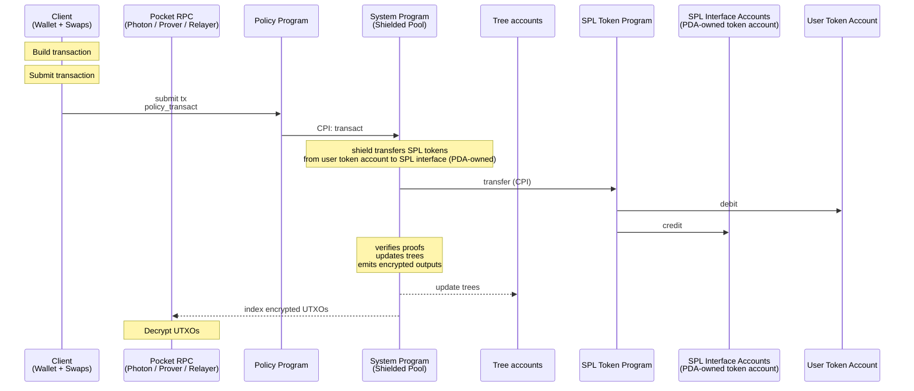
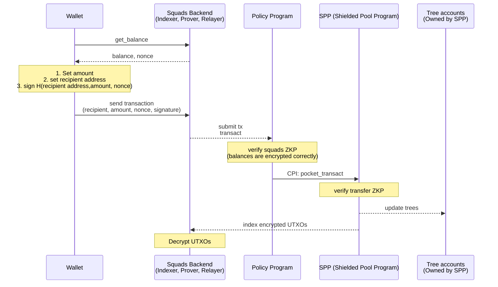
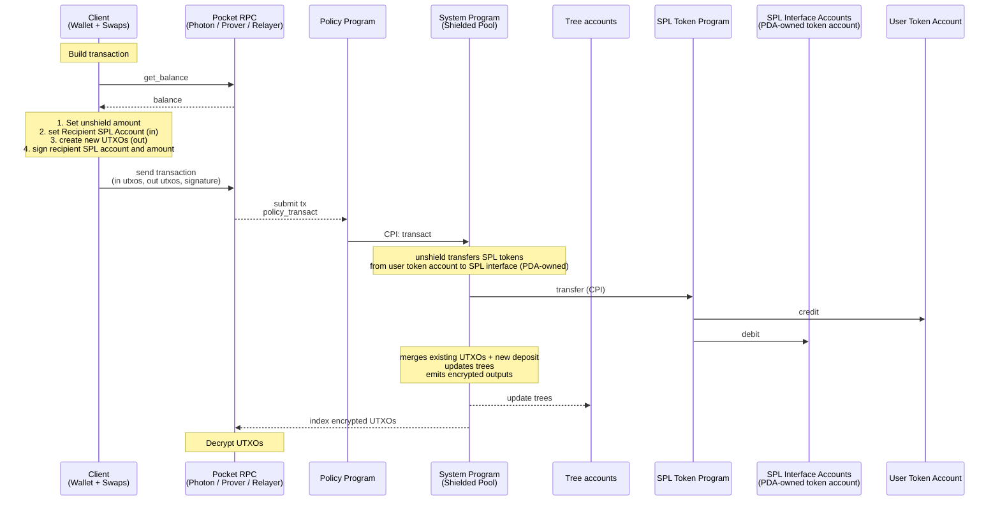

# Squads Policy Program Spec

A policy solana program with verifiable encryption and co-signers.

### TLDR on Design

1. config accounts (live in your own config program)
2. sync and async execution flows
3. protocol config pda - co-signer etc
4. privacy program that has the core logic.
5. 2 proofs instead of 1
6. entering the protocol privately or publicly

**Benefits of this design:**

1. part of the protocol anonymity set
2. interoperable with protocol ecosystem wallets, private swaps etc.
3. we will do more of the backend work if you like
4. you can increase privacy guarantees with a program update if you like.

### Differences to existing squads design

**Concurrency:**

Utxos are inherently concurrent. You have the opposite problem from accounts. The backend will merge utxos based on the account config.

1. async 

**Privacy:**

1. confidentiality with config account pdas
2. anonymity with config accounts stored in Merkle tree

## Glossary

### Actors

| # | Name | Description |
| --- | --- | --- |
| 1 | User | End-user; owns the Wallet and authorizes transactions |
| 2 | Protocol authority | Signs admin instructions (pause, create_*, rotate config) |
| 3 | Backend | Indexer for trees and encrypted UTXO records, computes zk proofs,Fee-payer for unshield and transfer |
| 6 | Forester | Updates the nullifier tree from the nullifier queue (queue and tree are in the same Solana account) |

### Solana Accounts

| # | Name | Description |
| --- | --- | --- |
| 7 | Nullifier tree | Batched address tree (`light-batched-merkle-tree`, H=40) of spent nullifiers, account includes the nullifier queue |
| 8 | UTXO tree | Append-only Merkle tree (H=26); leaves are UTXO hashes |
| 9 | SPL interface | Per-mint SPL / Token-22 vault holding all shielded SPL tokens |
| 10 | Protocol config | Singleton account; pause authority and protocol-wide settings |

### SPP (Shielded Pool Program) Instructions

| # | Name | Description |
| --- | --- | --- |
| 1 | transact | Tag 0; carries shield/unshield/shielded transfer; verifies proofs, updates trees |
| 2 | proofless_shield | Tag 1; public deposit; hashes UTXO and inserts into UTXO tree |
| 3 | pocket_transact | Tag 2; carries shield/unshield/shielded transfer; verifies proofs, updates trees; verifies encrypted UTXOs are properly encrypted to pocket auditor + recipients |
| 4 | pocket_authority_transact | Tag 3; proves correctness of a state transition by a pocket authority (freeze, thaw, transaction with permanent delegate, ...) |
| 5 | create_spl_interface | Tag 6; admin |
| 7 | create_tree | Tag 8; admin |
| 8 | create_protocol_config | Tag 9; admin |
| 9 | update_protocol_config | Tag 10; admin |
| 10 | pause_tree | Tag 11; admin can pause and unpause trees |
| 11 | create_pocket_config | Tag 12; creates a new pocket config, fields: owner, pocket_authority_transact_is_enabled, |
| 12 | update_pocket_config_owner |  |
| 13 | update_pocket_config | switch whether pocket_authority_transact_is_enabled is enabled or not. If is not enabled and config owner is burned the policy program cannot rug the user. → no permanent delegate. |

### Squads Program Instructions

A policy program is free to implement the following instructions and more.

| # | Name | Description |
| --- | --- | --- |
| 1 | transact | Tag 0;
verify policy proof,
cpi SPP pocket_transact |
| 2 | proofless_shield | Tag 1;
public deposit;
  • no encryption
cpi SPP proofless_shield |
| 3 | authority_transact | Tag 3; merge utxos
cpi SPP pocket_authority_transact |
| 4 | create_pocket_config | Tag 4; admin: creates account for a pocket; the config is public, sets auditor P256 key, pocket authority, freeze authority, permanent authority, co-signer |
| 5 | update_pocket_config | Tag 5; admin: pocket authority updates the pocket config |
| 6 |  create_config_account | Create a config PDA storing shared encryption key, recovery keys, and auditor ciphertexts; verifies encryption proof.
Every Solana account can create one config account, enforced by derivation path. This Solana account is the owner of the config.
**Account type:**
  1. Solana account
     (transfers are confidential)
  2. Compressed Account (transfers are anonymous)
 |
| 7 | update_config_account | Only the owner can update the config.
The owner cannot be changed. |
| 8 | migrate_config_account | Migrate a config account's encryption keys with a migration proof up on rotation of the auditor key. |
| 9 | close_config_account |  |
| 10 | toggle config account |  |
| 11 | Clear-Text Withdrawal | Withdraw all funds from a UTXO by computing the UTXO hash in the program. |
| 12 | Create Proposal | Create a proposal buffer PDA containing transfer metadata, recipient, and encrypted ciphertext for deferred execution. |
| 13 | Cancel Proposal | Cancel a proposal. |
| 14 | Execute Proposal | closes proposal,
verify policy proof,
cpi SPP pocket_transact |

**Notes:**

1. If the recipient does not have a config account the output utxo is encrypted to the auditor.

### Policy Program Accounts

Accounts can be Solana or compressed accounts.

| # | Name | Description |
| --- | --- | --- |
|  | Pocket config | Configures authorities and features of a pocket |
|  | User config | Configures a shared encryption key  |

### Protocol

| # | Name | Description |
| --- | --- | --- |
| 24 | Wallet | P256 keypair; signs transactions and decrypts UTXOs |
| 25 | UTXO | Unspent Transaction Output; records how many shielded tokens a keypair owns, one utxo can hold an amount of one SPL token and sol |
| 26 | Encrypted UTXO | Transactions create new UTXOs (outputs); encrypted by the user and stored in the ledger by the transact instruction (shield, unshield, shielded transfer) |
| 27 | Encryption | ECDH + AES-GCM; one ephemeral key per transaction, shared across outputs; in pockets the ephemeral key is also encrypted to the Auditor key (#34) |
| 28 | FMD clue | Fuzzy Message Detection tag for efficient encrypted UTXO discovery; prefixed to each encrypted UTXO |
| 29 | UtxoProof | Groth16 proof: proves ownership + balance conservation |
| 30 | TreeProof | Groth16 proof: proves that UTXOs exist in a UTXO tree and nullifiers don't exist yet in a Nullifier tree |
| 31 | Nullifier | Per-UTXO spend marker; inserted at spend time to prevent double-spend |
| 32 | Transaction viewing key | ephemeral_sk + sender/recipient public keys: decrypt all transaction outputs; nullifier keys: enable nullifier derivation to link input UTXOs; discloses a single transaction to a 3rd party |
| 33 | RPC | Server that indexes trees + encrypted UTXOs; generates proofs on demand |
| 34 | Auditor key | P256 keypair held by the Auditor RPC; per-transaction ephemeral key is encrypted to it (in addition to sender + recipient); enables decryption of every UTXO |
| 35 | Auditor RPC | RPC variant holding the auditor key; decrypts UTXOs, serves them to owners, generates proofs |

### User Operations

| # | Name | Description |
| --- | --- | --- |
| 36 | shield | Transfers SPL/SOL from user to pool, creates UTXO with deposit amount; transact instruction, client signs |
| 37 | unshield | Transfers SPL/SOL from pool to user, spends UTXO with withdraw amount; transact instruction, relayer signs; Privacy: sender hidden (relayer), recipient + amount visible |
| 38 | shielded transfer | Internal shielded transfer: UTXO in, UTXO out; transact instruction, relayer signs; Privacy: fully shielded (sender, recipient, amount) |
| 39 | proofless_shield | Proof-less public deposit (tag 1); emits a UTXO with `blinding = 0` |

### Admin Operations

| # | Name | Description |
| --- | --- | --- |
| 43 | create_policy_config | Initialize policy config |
| 44 | update_policy_config | Update Policy config |

---

---

### Properties

| # | Name | Description |
| --- | --- | --- |
| 1 | Non-Custodial | Pockets are non-custodial. Control remains with user; auditor reads all UTXOs but cannot sign or spend |
| 2 |  |  |
| 3 |  |  |
| 4 |  |  |
| 5 |  |  |
|  |  |  |

## Architecture

### Encryption Data Layouts

1. deposit/withdrawal layout, Total: **40 bytes**
    
    
    | Offset | Size | Field | Type |
    | --- | --- | --- | --- |
    | 0 | 8 | sender.asset_amount | u64 |
    | 8 | 8 | sender.asset_id | u64 |
    | 16 | 8 | sender.nonce | u64 |
    | 32 | 16 | gmc tag | [u8;16] |
    | 40 |  |  |  |
2. transfer layout, Total: **95 bytes**
    
    
    | Offset | Size | Field | Type |
    | --- | --- | --- | --- |
    | 0 | 8 | sender.asset_amount | u64 |
    | 8 | 8 | sender.asset_id | u64 |
    | 16 | 8 | sender.nonce | u64 |
    | 32 | 16 | gmc tag | [u8;16] |
    | 40 | 8 | recipient.asset_amount | u64 |
    | 48 | 31 | recipient.blinding | `[u8; 31]` |
    | 79 | 16 | gmc | [u8;16] |
    | 95 |  |  |  |

### Transaction Size

**Total transaction size — Sync Transfer**:

| Section | Size (bytes) | Notes |
| --- | --- | --- |
| Signature | 64 | 1 signer |
| Message header | 3 | num_signers / readonly_signed / readonly |
| ALT reference | 37 | 1 ALT pubkey (32) + 1 writable index (tree) + 2 readonly indices (shielded_pool_program, cpi signer) |
| Program ID | 32 |  |
| Recent blockhash | 32 |  |
| Instruction overhead | ~13 | program_id_index + account_indices + data_len_varint |
| Instruction data | 449 | output_commitments (64) + 
nullifiers (64) + nullifier_root_index (2) + squads_proof (128) + transfer_proof (128) + encrypted balances (63) |
| **Total (with ALT)** | **≈ 630** | max 1232 |
| **Total (without ALT)** | **≈ 564** |  |

**Total transaction size — Shield / Unshield** (N=2, M=2):

| Section | Size (bytes) | Notes |
| --- | --- | --- |
| Signature | 64 | relayer for unshield; user for shield |
| Message header | 3 | num_signers / readonly_signed / readonly |
| Account addresses (per-tx) | 128 | 4 × 32 — payer, vault_spl_token_account, recipient_spl_token_account, user_spl_token_account |
| ALT reference | 38 | 1 ALT pubkey + 2 writable + 2 readonly indices + compact-u16 counts |
| Recent blockhash | 32 |  |
| Instruction overhead | ~13 | program_id_index + account_indices + data_len_varint |
| Instruction data | 317 | common (301) + public_sol_amount (8) + public_spl_amount (8) |
| Encrypted UTXOs | 152 | combined ciphertext for all 3 outputs |
| **Total (with ALT)** | **≈ 747** |  |
| **Total (without ALT)** | **≈ 837** |  |

### Concurrency

1. A balance can be used concurrently when it is split up between a number of utxos.
2. To keep the balance spendable in one transaction we split it in up to X utxos

### User Funds Recovery without Indexer

1. get_signatures_for_account(user_config_account)
2.  

## User Flows

1. policy pocket
    1. shield
    2. enter from default pocket
    3. exit to default pocket
    4. unshield
2. Backend
3. Wallet

#### **Enter and exit Pocket**

1. Enter, shield or transfer from default pocket
2. Exit, unshield or transfer from policy pocket

#### Shield with Proof

#### Shield without Proof

#### Transfer

#### Unshield

#### Backend

The squads backend provides balances, generates zk proofs, merges utxos on behalf of the user, builds transactions for deposit, sends withdrawal and transfers transactions.

**Methods:**

1. get_encrypted_utxos
2. get_proof
3. get_decrypted_utxos
4. get_balance
5. get_instruction (for deposit the user must sign directly)
6. get_proposal_accounts
7. send_transaction (same as RPC)

#### **Merge Service:**

The shielded pool program has merge service registry accounts. Users can whitelist one or more merge service accounts (opt-in).

**Enable merge service,** a user creates a nullifier H(user_pubkey, merge_service_pda) in a dedicated merge service tree.

**Merge UTXOs,** a merge service proves that a nullifier exists and that the user utxos are merged and encrypted correctly.

**Disable merge service**, user removes nullifier from merge service tree.
