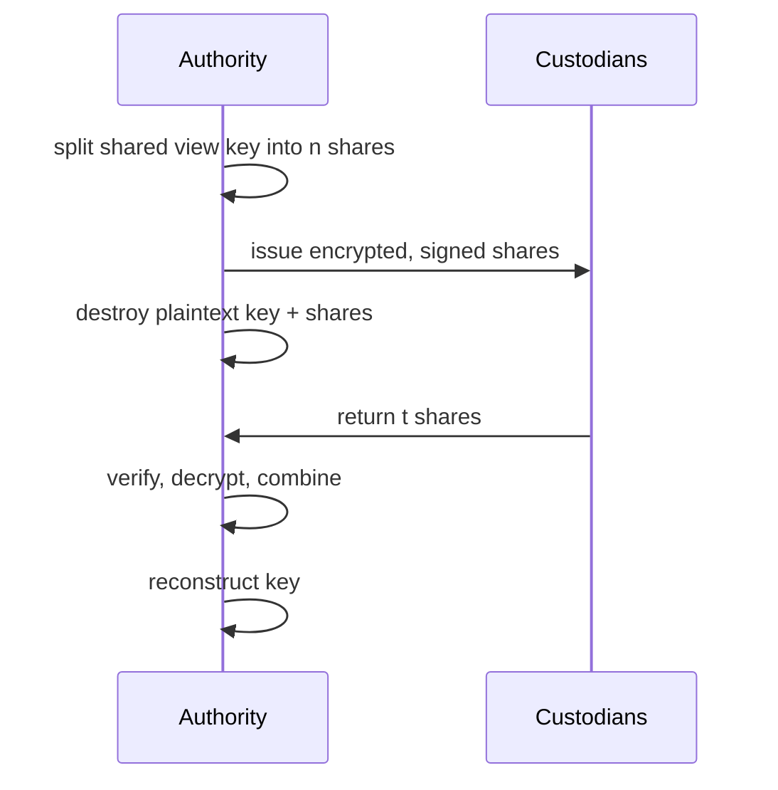
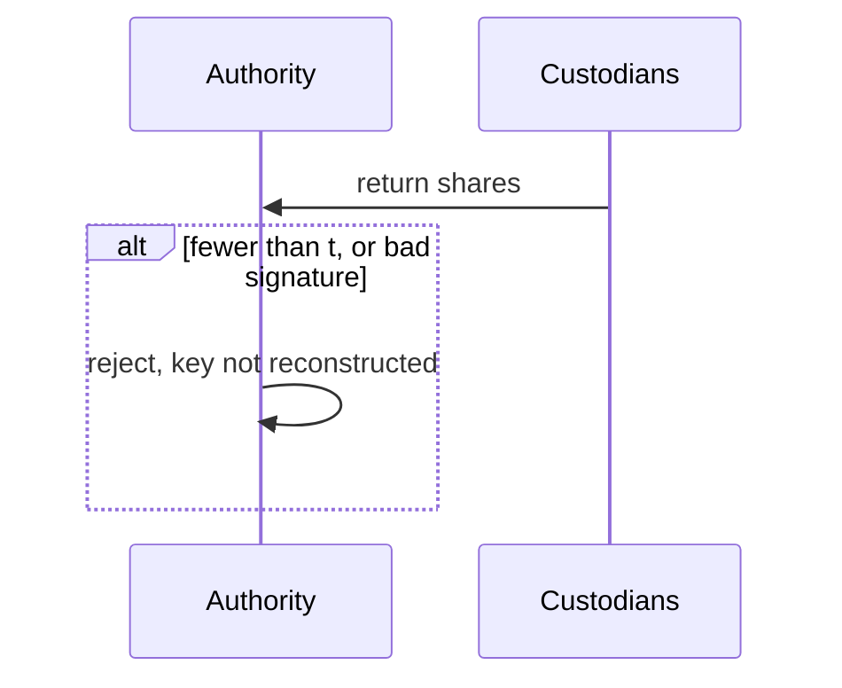

# Global Shared View Key

This doc proposes an extension to the TSPP spec with a distributed global shared viewing key.

**Idea:**
1. shared viewing key can decrypt all transactions in case of a court order for up to 5 years
2. shared viewing key is distributed to custodians which only can decrypt transactions together eg 3 out of 3
3. custodians key shares can be split up themselves for redundancy
4. include the shared viewing key in the root of the viewing key derivation so that the shared viewing key can derive all view tags and decrypt user balances efficiently.
5. Revealed utxos are moved into an authority zone, funds in this zone are either frozen in escrow or can be withdrawn to an spl token account by the owner.

**Implementation Scope:**
1. Key generation and distribution in TEE -> returns encrypted key shares to key custodians; at every rotation the same ceremony re-wraps the account creation nullifier-secret archive to the new epoch key (see [Account Creation](#account-creation))
2. Key recovery and transaction scanning in TEE -> return decrypted user transactions
3. Account creation SPP instructions (create account tree, create account [verifies the account creation proof], update viewing key, close) -> every tx sender must have an account so that we can enforce verifiable encryption (see [Account Creation](#account-creation))
4. Add verifiable encryption to all circuits (we already have an implementation for squads)
5. Viewing Key derivation crate must include shared viewing key (minor implementation detail)
6. authority zone assignment instruction -> revealed utxos are moved to the authority zone which freezes funds in spl token accounts (one account per user per asset) or forces withdrawal of utxos

**Tradeoffs:**
1. a global back door is potential security liability
2. proving time 3x increase 360ms to 1s for a standard transfer (m5 pro) linear increase for more recipients 
3. additional instruction data:
    1. transfer & unshield none
    2. shield 65 bytes (encrypted owner)
    3. proofless shield none but must reveal the owner of the utxo
4. We cannot decentralize the protocol
5. If zones are excempt from the encryption to the shared authority key we cannot make creation permissionless, or we add a permissioned whitelist of zones that are exempt and make zone creation permissionless
6. Users must create an account before spending funds but not to receive funds.

**Open Questions:**
1. Should we implement this as a zone itself?
2. What do we do with revealed UTXOs? (freeze or force withdrawal)
3. Should the distributed key shares be encrypted to the TEE or the key share holder? (key holder is more robust but key holders could bypass the TEE, we can change this with every key rotation)

## Table of Contents

- [Glossary](#glossary)
- [Roles](#roles)
- [Key Splitting](#key-splitting)
- [Hierarchical Key Distribution](#hierarchical-key-distribution)
- [Share Encryption](#share-encryption)
- [User Flow](#user-flow)
- [Shamir FFI](#shamir-ffi)
- [Constants](#constants)
- [Test Cases](#test-cases)
- [Account Creation](#account-creation)
- [Verifiable Encryption Circuit](#verifiable-encryption-circuit)
- [Benchmarks](#benchmarks)
- [Transaction Sizes](#transaction-sizes)
- [Tracing User Flows](#tracing-user-flows)
- [Open Questions](#open-questions)

## Glossary

| Term | Encoding | Definition |
| --- | --- | --- |
| Authority | — | Trusted process (TEE) that splits and reconstructs the shared view key. |
| Custodian | — | Holder of one encrypted share; returns it to authorize reconstruction. |
| Entity | — | A custodian of one outer share; may further distribute it to sub-holders. |
| Sub-holder | — | Holds one inner share or replica of an entity's outer share. |
| Inner Policy | `t_i`-of-`m_i` | Per-entity distribution of its outer share; `t_i = 1` replicates it. |
| Shared View Key | P-256 keypair | Payloads are ECIES-encrypted to it; its 32-byte secret is split. |
| Share | `[u8; 33]` | One GF(256) Shamir share: 32-byte value + 1-byte x tag. |
| Encrypted Share | bytes | A share ECIES-encrypted to the authority and signed by it. |
| Quorum | `t`-of-`n` | The `t` returned shares that reconstruct the shared view key. |
| `P256Pubkey` | `[u8; 65]` | SEC1-uncompressed P-256 public key. |
| ECIES | — | Encryption to a P-256 public key: ephemeral ECDH + HKDF + AES-GCM. |

## Roles

**Authority (TEE)**
1. Holds — its P-256 ECIES keypair and ECDSA signing key, and transiently the shared view key.
2. Can do — split, encrypt, sign, reconstruct, decrypt.
3. Cannot do — reconstruct without `t` returned shares.

**Custodian**
1. Holds — one encrypted share.
2. Can do — return or withhold its share.
3. Cannot do — read the share or the shared view key.

## Key Splitting

The 32-byte shared view key secret is split into `n` GF(256) Shamir shares with threshold `t`. Any `t` shares reconstruct the secret; fewer than `t` reveal nothing. The deployed outer configurations are 2-of-3, 3-of-3, and 5-of-5. The purpose is to require `t` independent entities to cooperate: 2-of-3 also tolerates one missing entity, while 3-of-3 and 5-of-5 require every entity. GF(256) caps `n` at 255 and provides no verifiable secret sharing.

## Hierarchical Key Distribution

The split is two levels:

- Outer: the shared view key secret is split `T`-of-`N` across `N` entities, one outer share each.
- Inner: each entity independently configures an inner policy `t_i`-of-`m_i` for its own sub-holders. `t_i = 1` replicates the outer share, so any one sub-holder returns it. `t_i >= 2` is a genuine Shamir split, so no single sub-holder holds the outer share. A typical policy is 2-of-5: it keeps the share off any single sub-holder and tolerates losing up to three.

To contribute, an entity recovers its outer share from any `t_i` of its sub-holders. Reconstruction needs `T` entities to contribute, and each contributing entity needs `t_i` of its sub-holders. The same Shamir FFI runs at both levels.

Every share and sub-share is encrypted to the authority, so sub-holders hold ciphertexts regardless of `t_i`. The inner policy controls availability and how many sub-holders must cooperate within an entity, not confidentiality from the authority.

## Share Encryption

Each share is ECIES-encrypted (ephemeral P-256 ECDH + HKDF + AES-GCM) to the authority's public key, then signed with the authority's ECDSA key over the ciphertext. The authority verifies the signature and decrypts a returned share with its secret key. AES-GCM detects tampering; the signature proves the authority issued the share, so a custodian cannot substitute a forged-but-valid ciphertext. Payloads are ECIES-encrypted to the shared view key's public key, without a signature.

## User Flow

**Setup** (inside the authority)
1. Generate the shared view key; split its secret into `n` shares.
2. Generate the authority's P-256 ECIES keypair and ECDSA signing key.
3. Encrypt and sign each share; hand each blob to a custodian.
4. Destroy the plaintext shared view key and shares.
5. Persist the shared view key public key and the authority's secret keys.

**Reconstruction** (inside the authority)
1. Collect `(blob, sig)` from custodians; take the first `t`.
2. Verify each share's signature, then decrypt it.
3. Combine the shares and validate the reconstructed scalar.
4. Reload the shared view key.





Where the shares are encrypted — to the authority, to the holders themselves, or to a shared authority-holder key — is an [open question](#open-questions).

## Shamir FFI

Go exposes two functions over the C ABI, operating on flat fixed-width byte buffers (no `[][]byte` across the boundary):

- `shamir_split` — split a secret into `n` contiguous shares; return code signals success or error.
- `shamir_combine` — combine `k` shares into the secret; return code signals success or error.

The fixed-width record layout keeps the `unsafe` wrappers sound; callers MUST NOT pass attacker-controlled sizes. `go.mod` requires `github.com/hashicorp/vault` for the `shamir` package.

## Constants

| Name | Value | Purpose |
| --- | --- | --- |
| Outer config | 2-of-3, 3-of-3, 5-of-5 | `T`-of-`N` across entities; reconstruction needs `T`. |
| Inner policy | per entity `t_i`-of-`m_i`, e.g. 2-of-5 | Each entity configures its own; `t_i = 1` replicates. |
| Shared view key secret | 32 bytes | The split P-256 scalar. |
| Share | 33 bytes | 32-byte value + 1-byte GF(256) x tag. |
| `P256Pubkey` | 65 bytes | SEC1-uncompressed P-256 public key. |
| Signature | 64 bytes | P-256 ECDSA signature. |

Constraints: `1 <= T <= N <= 255` at the outer level, and `1 <= t_i <= m_i <= 255` for each entity's inner policy.

## Test Cases

| Config | Shares returned | Expected |
| --- | --- | --- |
| 3-of-3 outer, all 2-of-5 inner | every entity via 2 of its 5 sub-holders | reconstructs the key |
| 3-of-3 outer, all 2-of-5 inner | one entity returns only 1 sub-holder | that entity cannot contribute; fails |
| 3-of-3 outer, all 2-of-5 inner | one entity returns 0 sub-holders | reconstruction fails |
| 3-of-3 outer, mixed inner (2-of-5, 1-of-3, 2-of-5) | each entity meets its `t_i` | reconstructs the key |
| 2-of-3 outer, all 2-of-5 inner | one entity returns 0 sub-holders | reconstructs; tolerates the missing entity |

## Notes on publishing a new Shared viewing key

- all share holders need to sign as a single authority key
- implemented as nested squads multisig, the outer multisig is the single authority key, the key holders are multigsigs themselves

## Account Creation

Also called the registry. Every transaction sender MUST hold an active account before spending; receiving requires none. An account maps the signing identity `pk_field(signing_pk)` to its `viewing_pk`, `nullifier_pk`, registration epoch, and `Enc(shared_view_pk[reg_epoch], nullifier_secret)`. The [Verifiable Encryption Circuit](#verifiable-encryption-circuit)'s Account Exists check proves this mapping for the sender of every encrypted output: encrypted ⟹ registered ⟹ traceable.

### Append-Only Account Tree

The account tree is append-only: creation inserts an account leaf, and closing inserts a nullifier into the existing SPP nullifier tree (the account-side analog of the merge authority tree's enable/revoke commitments). Each registration cycle of an identity gets a monotonically increasing public counter `number`, so close and re-create are both insertions.

```rust
pub struct Account {
    pub signing_pk_field: [u8; 32],
    pub viewing_pk: [u8; 33],
    pub nullifier_pk: [u8; 32],
    pub ciphertext: Vec<u8>,
    pub reg_epoch: u32,
    pub number: u64,
}

impl Account {
    pub fn hash(&self) -> [u8; 32] {
        Poseidon(
            ACCOUNT_TAG,
            self.signing_pk_field,
            self.viewing_pk,
            self.nullifier_pk,
            self.reg_epoch,
            self.number,
        )
    }

    pub fn nullifier(&self) -> [u8; 32] {
        Poseidon(CLOSE_TAG, self.hash())
    }
}
```

`Account::hash()` is the account tree's only leaf type, written `account_leaf(number)` below. `Account::nullifier()` enters the nullifier tree the same way as UTXO nullifiers and `sender_view_tag`; it is deterministic per leaf, so the nullifier tree's duplicate rejection enforces close-once per cycle.

An identity is active iff `account_leaf(number)` is included at `registration_root` and `Account::nullifier()` is absent from the nullifier tree. Unlike the merge authority commitments, nothing here is hiding: leaf preimages and the ciphertext are published in instruction data so the indexer serves them and the authority resolves any decrypted `owner_pubkey` to its account data by computing `pk_field(owner_pubkey)` directly. SPP rejects a duplicate `(pk_field, number)` insertion, enforcing one account per identity and cycle.

| Operation | Insertions | Notes |
| --- | --- | --- |
| create | `account_leaf(0)` (or next free `number` after a close) | verifies the [account creation proof](#account-creation-proof) |
| update viewing key | `Account::nullifier()` of cycle `n` + `account_leaf(n+1)` | atomic; `nullifier_pk` unchanged; new ciphertext encrypts the same `nullifier_secret` to the current epoch's `shared_view_pk` |
| close | `Account::nullifier()` of cycle `n` | owner-authorized |
| re-create | `account_leaf(n+1)` after a close | MAY rotate `nullifier_pk` (for nullifier-key compromise); UTXOs under the old `owner_hash` become unspendable, so the user must spend or withdraw them first |

The tree height is fixed at creation and there is no rollover; the height must cover lifetime capacity (open question below).

### Accounts

| Account | Description |
| --- | --- |
| Account tree | A state tree account with the same account layout as the main spec's Tree accounts, holding a different tree type: an append-only Merkle tree over `account_leaf` entries instead of a UTXO tree. Written only by the account creation instructions. |
| Root history | A separate account holding the tree's root cache -- the 200 most recent roots -- in the same layout as the existing tree root caches. Written by every account creation instruction, read by `transact`. |

Splitting the root cache into its own account keeps the `transact` account footprint small: it resolves the `registration_root` public input from `roots[index]` with a read-only lock on the root history account, takes no write lock on registry accounts, and therefore parallelizes. A proof's validity window is 200 registry writes (create/update/close), not 200 slots, since only the account creation instructions advance the cache.

### Instructions

| # | Instruction | Description |
| --- | --- | --- |
| 1 | create_account_tree | Initialize the account tree and the root history account; seed `roots[0]` with the empty-tree root at `seq = 0`. |
| 2 | create_account | Verify the account creation proof, insert `account_leaf`, push the new root. For Ed25519 owners the program checks the transaction signer and computes `pk_field(signing_pk)` itself; the in-proof signature is skipped. |
| 3 | update_viewing_key | Insert the old cycle's `Account::nullifier()` into the nullifier tree and `account_leaf(n+1)` into the account tree atomically; verifies a fresh account creation proof for the new leaf and that `nullifier_pk` is unchanged. |
| 4 | close_account | Insert `Account::nullifier()` into the nullifier tree; owner-authorized (Ed25519 signer or P256 signature). |

### Account Creation Proof

The registration analog of the main spec's Enable Proof, verified by `create_account` (and `update_viewing_key` for the replacement leaf).

**Public Inputs**

| Input | Source |
| --- | --- |
| `account_leaf` | instruction data |
| `shared_view_pk` | `ProtocolConfig.shared_view_pk[reg_epoch]` |
| `reg_epoch` | instruction data |
| `ciphertext` | instruction data; `Enc(shared_view_pk[reg_epoch], nullifier_secret)` |

**Checks**

| Check | Description |
| --- | --- |
| Leaf well-formed | `account_leaf` recomputes from the witnessed fields. The ciphertext is excluded from the hash: `nullifier_pk` already commits to the `nullifier_secret`, and the verifiable encryption check ties the public ciphertext to `nullifier_pk` at insertion time. |
| Verifiable encryption | `ciphertext` encrypts the preimage of `nullifier_pk` (the `nullifier_secret`) to `shared_view_pk[reg_epoch]`, so decrypting a nullifier secret requires the same custodian quorum as any trace. |
| Ownership (P256) | P256 signature by `signing_pk` over the canonical leaf preimage. Without this check anyone could register an arbitrary identity with garbage keys and lock it out of spending -- same rationale as the Enable Proof's user signature. Ed25519 owners prove ownership via the transaction signer instead. |

### Spend-Side Enforcement

The [Verifiable Encryption Circuit](#verifiable-encryption-circuit)'s Account Exists check witnesses `number` privately and proves:

1. inclusion of `account_leaf(number)` with the sender's `(viewing_pk, nullifier_pk)` at `registration_root`,
2. non-inclusion of `Account::nullifier()` in the nullifier tree.

Closes are ordinary nullifier insertions, so a close that lands after a sender cached its nullifier root is caught by the same SPP queue bloom-filter check that catches late UTXO nullifiers.

### Key Rotation Backup

Account ciphertexts are re-encrypted in the TEE, not by an SPP instruction. Keeping old registrations decryptable is part of [Implementation Scope](#global-shared-view-key) item 1: at each key rotation the TEE ceremony reconstructs the outgoing epoch key from the custodian quorum, decrypts the account ciphertexts created under it, re-wraps the resulting nullifier-secret archive to `shared_view_pk[new_epoch]`, and zeroizes the plaintext. The archive is encrypted to the current epoch key, so it can be replicated to the custodians alongside their shares. At genesis the archive step is a no-op.

`reg_epoch` in the leaf is metadata selecting the archive generation that holds the user's secret; old epoch keys need not stay reconstructible, which makes a last-2-epochs destruction policy ([Open Questions](#open-questions) #2) viable. Losing the archive breaks tracing through pre-rotation registrants; their funds stay spendable, since the spend proof does not read the ciphertext.

### Open Questions (Account Creation)

1. Tree height: lifetime capacity vs Merkle path length in the spend proof (the account inclusion path and the nullifier non-inclusion path each cost height Poseidons).
2. Canonical encoding of the ownership-signature preimage.

## Verifiable Encryption Circuit

This circuit specifies the extension of the utxo circuit verified by the transact instruction.
The transact verifiable encryption circuit proves that every encrypted output of a shared-view-zone transaction is decryptable by the authority. It re-derives the sender's `view_root` from the witnessed `viewing_sk` and the epoch's public `shared_view_pk` (replacing the hardcoded `P_const`), checks the sender view tag and the transaction viewing key derive from that root, and checks each output ciphertext is encrypted with the transaction viewing key. Enforcement is its own zone, not part of the default zone, and the checks below are folded into the shared-view zone's transact circuit -- one proof per transaction, not a separate VE proof. Encrypted ⟹ registered ⟹ traceable: this proof path is the only way to produce an encrypted output; proofless shields are cleartext.

**Public Inputs**

| Input | Source |
| --- | --- |
| `shared_view_pk` | `ProtocolConfig.shared_view_pk[epoch]` |
| `epoch` | instruction data; selects the shared view key entry in `ProtocolConfig` |
| `registration_root` | resolved as `roots[index]` against the account-tree root history account ([Account Creation](#account-creation)) |
| `sender_view_tag` | instruction data; inserted into the nullifier tree (single-use) |
| `tx_viewing_pk` | instruction data; unverified, enters each slot KDF as DHKEM context only |
| `ciphertexts` (one per output slot) | instruction data |
| `output_utxo_hashes` | instruction data; the transact circuit's own output hashes |
| `first_nullifier` | `nullifiers[0]` of the transaction. With real inputs uniqueness is enforced by the nullifier tree. For input-less transactions (fresh-user proof shields) the first dummy input MUST derive its `blinding` randomly per transaction (the `blinding_seed` rule for empty UTXOs, not a hardcoded constant), so the published dummy nullifier, the salt of `tx_viewing_sk`, stays statistically unique. A sender who reuses the value reuses its own `tx_viewing_sk`; authority and recipient decryption are unaffected. |
| `salt` | instruction data; per-transaction CSPRNG salt |
| `eph_pk` | instruction data; shield only (public deposit amount > 0) |
| `identity_ciphertext` | instruction data; shield only |

**Private Inputs (shared)**

| Input | Description |
| --- | --- |
| `viewing_sk` | sender's P-256 viewing scalar |
| owner signing key witness | P256 owners witness the canonical point `(x, y)` and compressed-key parity to recompute `pk_field(signing_pk)`; Ed25519 owners use the public program-derived `pk_field`, as in the zone proof |
| registration account witness | `account.viewing_pk`, `account.nullifier_pk`, the cycle counter `number`, the inclusion path of `account_leaf(number)` at `registration_root`, and the non-inclusion path of `Account::nullifier()` in the nullifier tree ([Account Creation](#account-creation)) |
| `tx_count` | sender view tag counter |
| `last_tx_count` | index of an existing on-chain sender tag; anchor for the counter-gap bound |
| `tx_viewing_sk` | P-256 scalar used in every slot ECDH; constrained to the in-circuit derivation (see Tx viewing derivation), not a free witness |
| `eph_sk` | ephemeral P-256 scalar for the identity escrow; shield only |

**Private Inputs (per output slot)**

| Input | Description |
| --- | --- |
| `plaintext` | the slot's constant-size fields only: recipient slots `TransferRecipientPlaintext` without the TLV records (114 B), the sender slot `TransferSenderPlaintext` without the TLV records (`89 + 33·R` B); layouts in the main spec |
| `viewing_pk_i` | slot recipient's P-256 viewing pubkey; the sender slot uses the sender's registered `viewing_pk` |

**Checks**

| Check | Description |
| --- | --- |
| Account Exists | `account_leaf(number)` for `pk_field(signing_pk)` with fields `(viewing_pk, nullifier_pk)` is included at `registration_root`, and `Account::nullifier()` is absent from the nullifier tree ([Account Creation](#account-creation)). The identity is the pubkey field encoding itself, so the authority resolves any decrypted `owner_pubkey` to its account data by computing `pk_field(owner_pubkey)` directly -- no scan over registered users. Ed25519 owners MUST register too: `pk_field` of the Solana pubkey keys the account; `viewing_pk` and `nullifier_pk` stay P-256/Poseidon. |
| Viewing key ownership | `viewing_pk == viewing_sk · G_P256` and equals `account.viewing_pk`, so only the registered key can produce the proof. |
| Owner binding | The sender's `owner_hash = poseidon(pk_field(signing_pk), account.nullifier_pk)` equals the spent inputs' owner (same circuit, same witnesses), so the spender can only use its own registered keys. |
| View root | `view_root = PoseidonKDF("view_root", ECDH(viewing_sk, shared_view_pk).x, epoch)`. Replaces the hardcoded `P_const`, so the authority re-derives the same root from `shared_view_sk[epoch]` and the registered `viewing_pk`. Rotating `shared_view_pk` rotates the root, tags, and tx keys per epoch. |
| Sender tag | `sender_view_tag = PoseidonKDF("sender_view_tag", view_root, tx_count)` with `PoseidonKDF("sender_view_tag", view_root, last_tx_count)` proven included in the nullifier tree (`tx_count <= 100` for a key with no prior tag) and the counter-gap bound `tx_count - last_tx_count <= 100`. A scanner finds every new tag within 100 indices of the highest it has observed for that key. |
| Tx viewing derivation | `tx_viewing_sk = reduce_P256(PoseidonKDF("tx_viewing", view_root, first_nullifier))`. `first_nullifier` is public, so the authority derives the same scalar. |
| Keypair consistency | NOT enforced. The published `tx_viewing_pk` enters every slot KDF as DHKEM context and is bound by the proof, but `tx_viewing_pk == tx_viewing_sk · G_P256` is not checked: the authority decrypts with the derived `tx_viewing_sk` alone, so a false point only breaks the sender's own recipients' decryption (the recipient-tag policy). Contrast the identity escrow, whose `eph_pk == eph_sk · G_P256` check stays because there the authority decrypts against the published point. Dropping the check saves one fixed-base scalar mul (~64k constraints measured). |
| Plaintext binding (per slot) | `Poseidon(plaintext_i) == output_utxo_hashes[i]`. |
| Verifiable encryption (per slot) | `ciphertexts[i] = AES-256-CTR(aes_key_i, nonce_i, plaintext_i)` where `(aes_key_i, nonce_i)` derive from `ECDH(tx_viewing_sk, viewing_pk_i)` via the Poseidon KDF below. No GHASH/authentication tag: the ciphertexts are public inputs, so the proof binds them to the hash-bound plaintexts and tampering breaks proof verification; decryptors check that binding instead of an AEAD tag. Dropping GHASH halves the circuit (measured ~340k of ~570k constraints per 8-block GCM slot were GHASH). Covers the constant-size fields only; `zone_data`/`program_data` TLV records are encrypted separately by wallet convention, outside the proof. |
| Sender slot key | The sender slot's `viewing_pk` equals `account.viewing_pk`, the registered key, so the authority decrypts the sender slot with one ECDH. |
| Recipient key escrow | The `recipient_viewing_pks` in the sender bundle equal the `viewing_pk_i` used in each recipient slot's KDF, so decrypting the sender slot yields the keys for every recipient slot. The field already exists in the transfer layout; this zone's proof checks it. |
| Output cleanliness | Each output's `zone_program_id` equals the shared-view zone and enters the `output_utxo_hashes[i]` recomputation, so encrypted outputs stay under the zone's VE enforcement. `program_data_hash` and `policy_data_hash` are witnessed fields of the hash; their TLV bytes are not verifiably encrypted. |
| Identity escrow (shield only) | For public deposits: `eph_pk == eph_sk · G_P256` and `identity_ciphertext = AES-256-CTR(id_key, id_nonce, pk_field(signing_pk))` with `(id_key, id_nonce) = PoseidonKDF("identity", ECDH(eph_sk, shared_view_pk).x, eph_pk, shared_view_pk)`. The authority decrypts with `shared_view_sk[epoch]` alone, identifying the depositor without scanning user tag streams. A fresh `eph_sk` keeps shields unlinkable to outside observers; `tx_viewing_pk` cannot be the escrow key: deriving it requires knowing the user. |
| Recipient tags | NOT enforced; correctness only affects the recipient's own sync. The authority catches every transaction sender-side, and `tx_viewing_sk` decrypts change and every recipient slot. |

**Derivations**

```
// 1. View root (replaces the hardcoded P_const root)
view_root            = PoseidonKDF("view_root", ECDH(viewing_sk, shared_view_pk).x, epoch)

// 2. Sender view tag
sender_view_tag      = PoseidonKDF("sender_view_tag", view_root, tx_count)

// 3. Transaction viewing key
tx_viewing_sk        = reduce_P256(PoseidonKDF("tx_viewing", view_root, first_nullifier))
tx_viewing_pk        = tx_viewing_sk · G_P256   // computed and published by the sender; not circuit-checked

// 4. Per-slot key + nonce (DHKEM; includes both pubkeys and salt)
(aes_key_i, nonce_i) = PoseidonKDF("slot", ECDH(tx_viewing_sk, viewing_pk_i).x,
                                   tx_viewing_pk, viewing_pk_i, salt)

// 5. Encrypt (CTR keystream, no authentication tag; ciphertexts are bound as public inputs)
ciphertexts[i]       = AES-256-CTR(aes_key_i, nonce_i, plaintext_i)

// 6. Identity escrow (shield only)
(id_key, id_nonce)   = PoseidonKDF("identity", ECDH(eph_sk, shared_view_pk).x,
                                   eph_pk, shared_view_pk)
identity_ciphertext  = AES-256-CTR(id_key, id_nonce, pk_field(signing_pk))
```

`PoseidonKDF(domain, inputs...)` is a domain-separated Poseidon chain. Its concrete layout is fixed by the benchmark circuit (see [Benchmarks](#benchmarks)): `shared_secret = Poseidon(dom_sep, dh.x, compress(tx_viewing_pk), compress(viewing_pk_i))` followed by the merge proof's silo/key/nonce key-schedule chain with the 16-byte `salt` as info. `AES-256-CTR` uses the GCM counter layout (`J0 = nonce || 1`, block `i` keyed at counter `2 + i`), so the key schedule and honest-sender format match the existing DHKEM(P-256) + Poseidon KDF pattern with the GHASH tag removed.

Verifiably encrypted bytes per slot: recipient 114 B (8 AES blocks), sender `89 + 33·R` B (8 blocks at `R = 1`, 10 at `R = 2`); sizes from the transfer plaintext layouts in the main spec. The identity escrow encrypts one field element (32 B, 2 blocks). Variable-length data (`zone_data`, `program_data` TLV records) is encrypted separately by wallet convention: ZK circuits are fixed-size, so verifiably encrypting variable-length plaintexts would need a circuit per length.

The authority reconstructs `shared_view_sk[epoch]`, derives `view_root = PoseidonKDF("view_root", ECDH(shared_view_sk, account.viewing_pk).x, epoch)` per user on demand, and scans a user's sender view tags at most 100 counters ahead of the last seen tag. Per transaction it derives `tx_viewing_sk` from the public `first_nullifier`, decrypts the sender slot with the sender's registered `viewing_pk`, reads the recipient viewing pubkeys from it, and decrypts every recipient slot. For shields it skips tag scanning: decrypting `identity_ciphertext` with `shared_view_sk[epoch]` yields the depositor's `pk_field(signing_pk)`, the registration account address.

## Benchmarks

Measured with the benchmark circuit (`circuits/verifiableencryptionctr` in confidential-transfers): gnark Groth16 over BN254, one sender slot plus the listed recipient slots, no identity escrow, one P-256 ECDSA signature verification (the message is prehashed outside the circuit, as with the transact circuit's `private_tx_hash`), and tree/transaction hashing mocked as 225 Poseidon(2) + 3 Poseidon(3) + 4 Poseidon(8) (~56k constraints, modeling a 2-in/2-out transact proof extended with the registration, last-tag, and owner-binding work). Host: Apple M5 Pro, 18 threads. The mock-baseline row (`circuits/mockbaseline`) measures the same ECDSA verification and mock hashing budget with the verifiable encryption removed; the hash-chain inputs the full circuit derives from VE values are free witnesses there, which leaves the Poseidon cost unchanged. Since the VE checks fold into the transact circuit, the VE increment on the existing circuit is the measured total minus the measured baseline: 645,150 constraints at 1 recipient (856,944 - 211,794), ~290k per additional recipient. This is lower than the naive sum-of-parts estimate (~682k from subtracting the 119k in-context signature cost and the 56k mock budget) because the standalone baseline carries ~37k of emulated-arithmetic range-check/lookup-table infrastructure that any circuit with one P-256 operation already pays -- the transact circuit included -- so the measured difference is the honest marginal cost. The transact circuit's balance and range-check work comes on top of these numbers.

| Variant | Recipient slots | Constraints | Prove | Key load |
| --- | --- | --- | --- | --- |
| Mock baseline (no VE) | - | 211,794 | 0.36 s | 1.84 s |
| AES-256-CTR | 1 | 856,944 | 1.05 s | 6.72 s |
| AES-256-CTR | 2 | 1,146,643 | 1.57 s | 9.04 s |
| AES-256-CTR | 3 | 1,436,319 | 1.70 s | 10.85 s |
| AES-256-CTR | 4 | 1,726,422 | 1.82 s | 12.51 s |
| AES-256-CTR | 5 | 2,016,128 | 1.93 s | 14.16 s |
| AES-256-CTR | 6 | 2,305,834 | 2.90 s | 17.25 s |
| AES-256-CTR | 7 | 2,595,491 | 2.94 s | 18.94 s |
| AES-256-CTR | 8 | 2,931,209 | 3.02 s | 20.83 s |

Cost drivers at 1 recipient slot: ~54% emulated P-256 (1 fixed-base mul for `viewing_pk`, 3 variable-base ECDHs, 1 ECDSA verify at 119k), ~39% AES-CTR keystream (~22k constraints per block), ~7% Poseidon (KDF, bindings, mock budget). GHASH alone was ~340k constraints per 8-block slot, which is why dropping the GCM tag halves the circuit. Measured marginal cost per extra recipient slot: ~290k constraints (8 recipient CTR blocks ~178k + ECDH ~79k + KDF ~3k + 2 extra sender-bundle blocks ~30k; the 7-to-8 step is ~336k because the `89 + 33·R` sender bundle crosses from 20 into 24 blocks). Slot sizes per the byte-count paragraph above: sender `89 + 33·R` B padded to a 32-byte multiple, recipients 114 B padded to 128 B.

## Transaction Sizes

| Addition | Bytes |
| --- | --- |
| `epoch` (u32) | +4 |
| Registration-tree root-cache index (u16; the last-tag inclusion reuses the existing nullifier-tree root index) | +2 |
| Registration tree account (in the lookup table: 1 ALT index + 1 instruction account index) | +2 |
| GCM tags dropped (CTR, no tag; sender + `R` recipient slots) | -16 x (R + 1) |
| Identity escrow, proof shields only (`eph_pk` 33 + 32 B ciphertext) | +65 |

Net transfer delta: `+8 - 16 x (R + 1)` -- negative for every shape, the dropped GCM tags outweigh the additions. Solana transaction size is 1232 bytes.

| Circuit | R | Transfer (B) | Headroom | Proof shield (B) | Headroom |
| --- | --- | --- | --- | --- | --- |
| 2 in 2 out | 0 | -- | -- | 787 -> 844 | 388 |
| 1 in 2 out | 1 | 899 -> 875 | 357 | 981 -> 1022 | 210 |
| 3 in 3 out | 2 | 935 -> 895 | 337 | 1017 -> 1042 | 190 |
| 5 in 3 out | 2 | 939 -> 899 | 333 | 1021 -> 1046 | 186 |
| 1 in 8 out (split) | -- | 883 -> 875 | 357 | -- | -- |


## Tracing User Flows

Traces run inside the authority (TEE) after a quorum-authorized key reconstruction; the reconstructed keys are scoped to the trace and zeroized afterwards. One subsection per trigger.

### Trace Shielded Funds

Funds entered the zone through a shield (a flagged source address or a reported incident) and must be followed to their current holders. The trace is reactive: the authority reconstructs `shared_view_sk` for the epochs in the trace window from the custodian quorum, identifies the depositor directly from the shield, and walks the funds forward hop by hop until they rest in a UTXO or exit to a public account. Proofless shields are cleartext; proof shields include an identity escrow decryptable with `shared_view_sk[epoch]` (see [Verifiable Encryption Circuit](#verifiable-encryption-circuit)), so the authority derives keys only for the users on the trace path instead of scanning every user's tags.

**Authority State**
```
RegisteredUser {
    signing_pk_field: [u8; 32],                // pk_field(signing_pk), the registration account address; P256 or Ed25519
    viewing_pk:       P256Pubkey,
    nullifier_pk:     [u8; 32],
    nullifier_secret: [u8; 32],                // decrypted from the registration account when the user enters the path
    view_roots:       map<epoch → [u8; 32]>,   // PoseidonKDF("view_root", ECDH(shared_view_sk[epoch], viewing_pk).x, epoch)
}

Authority {
    shared_view_sk:   map<epoch → P256Scalar>, // reconstructed from the custodian quorum, trace-scoped
    users:            map<signing_pk_field → RegisteredUser>, // loaded lazily, on-path users only
    frontier:         Vec<TracedUtxo>,         // UTXOs queued for the forward walk
    report:           Vec<TerminalHolding>,    // resting UTXOs and public exits
}
```

1. **Reconstruct the shared view keys.** Collect `t` shares from the custodians for each epoch in the trace window (or the last-2-epochs policy, [Open Questions](#open-questions) #2), verify, decrypt, combine — see [User Flow](#user-flow). The keys exist only for the duration of the trace.

2. **Identify the depositor** (the dichotomy of [Open Questions](#open-questions) #5.2.2):
    1. **Proofless shield.** The UTXO body (`owner_pubkey`, `asset`, `amount`) is cleartext; read it directly, load the user at `pk_field(owner_pubkey)` (step 3.4), and enqueue the UTXO on `frontier`.
    2. **Proof shield.** Decrypt the shield's `identity_ciphertext` with `shared_view_sk[epoch]` (one ECDH against the public `eph_pk`) to obtain the depositor's `pk_field(signing_pk)`, the registration account address. Fetch the account and load the user (step 3.4). Derive the shield transaction's `tx_viewing_sk = reduce_P256(PoseidonKDF("tx_viewing", view_root, first_nullifier))` from its public first nullifier, decrypt the sender slot with the depositor's registered `viewing_pk`, read the recipient viewing pubkeys from it, decrypt the remaining slots, and enqueue the output UTXOs.

3. **Forward walk.** Repeat for each UTXO on `frontier` until the frontier is empty:
    1. **Compute the nullifier**: `nullifier = poseidon(utxo_hash, blinding, users[signing_pk_field].nullifier_secret)`. `utxo_hash` is read from the creating transaction's public inputs, `blinding` is known from decryption (or cleartext), `nullifier_secret` from registration. Look it up in the nullifier tree.
    2. **Not present** — terminal: the funds rest here; append `(signing_pk_field, utxo)` to `report`.
    3. **Present** — fetch the spending transaction by its public nullifier. The spender is the traced UTXO's owner, already loaded; derive that transaction's `tx_viewing_sk` from its first nullifier, decrypt the sender slot with the spender's registered `viewing_pk`, read the recipient viewing pubkeys from it, and decrypt every recipient slot.
    4. **Resolve recipients.** Attribution is report-all: every output of the spending transaction is traced, including outputs funded by co-spent clean inputs. Every decrypted slot contains the output's full `owner_pubkey`, and the VE proof's plaintext binding makes it authentic, so the registration account address is computed directly: `pk_field(owner_pubkey)` (for P-256 owners two Poseidon hashes over the point encoding). Fetch the account; if not yet in `users`, load it: decrypt `Enc(shared_view_pk[reg_epoch], nullifier_secret)` with the reconstructed `shared_view_sk[reg_epoch]` (the account records its registration epoch) and derive `view_roots[epoch]` (one ECDH per epoch); enqueue the output on `frontier`. Public withdrawal — terminal: record the destination Solana account in `report`. No scan over registered users is ever needed.
    5. **Merged outputs** stay decryptable: the merge proof derives `merge_view_tag` and `tx_viewing` from the same owner `view_root` ([Open Questions](#open-questions) #5.3), so the authority decrypts them with the keys it already holds.

4. **Report.** The trace result is `report`: resting UTXOs with their registered identities, and exited funds with their public destination accounts. The response to a traced holding (freeze, forced withdrawal, escrow) is [Open Questions](#open-questions) #3. Zeroize the reconstructed keys.

**Trace Cost Estimates**

Assumptions:

1. `H` hops on the trace path; `U` distinct users on the path; `E` epochs in the trace window.
2. P-256 ECDH: 100 μs; Poseidon: ~5 μs; indexer RTT: 100 ms.
3. At most 8 ciphertexts decrypted per hop of the forward walk.

| Per on-path user | Per hop | Trace total (`H` = 20, `U` ≤ 20, `E` = 2) |
| --- | --- | --- |
| < 1 ms compute + 1 account fetch (batched into the hop that discovers the user) | ~200 ms = 2 dependent indexer RTTs (nullifier lookup, then transaction fetch); ~1 ms compute | ~4 s = `H` x 2 RTTs |

### Trace a Reported Signing Pubkey

A reported signing pubkey is traced with the mechanisms already specified; P-256 and Ed25519 follow the same flow, since `pk_field(signing_pk)` keys the registration account for both.

1. **Load the user.** Reconstruct `shared_view_sk` ([Trace Shielded Funds](#trace-shielded-funds) step 1), fetch the registration account at `pk_field(reported_pk)`, decrypt `nullifier_secret`, derive `view_roots[epoch]`.
2. **Scan the sender-tag stream.** Per epoch, derive sender tags in 100-counter windows and match against the on-chain tag index until a window has no hits; the counter-gap bound `<= 100` makes the scan exhaustive. Each hit is a sent transaction: derive `tx_viewing_sk` from its `first_nullifier`, decrypt every slot, enqueue the outputs. ~10 ms compute for 10,000 sent transactions, one index RTT per window.
3. **Scan shields.** Proofless: filter cleartext owners. Proof shields: one ECDH per `identity_ciphertext`, keep those yielding `pk_field(reported_pk)`.
4. **Forward walk + report** as in [Trace Shielded Funds](#trace-shielded-funds) steps 3-4.


## Open Questions

**1. Where are the key shares encrypted?** All three reconstruct from the same quorum; they differ in who can read a share at rest.

- **To the authority (TEE) — current.** Only the authority can read shares; holders hold ciphertexts and need no keys. The authority is the single point of compromise.
- **To the holders.** Each holder can read its own share; the authority cannot read at rest. Needs holder keys in `setup`, lets `t` colluding holders reconstruct offline, and adds a re-encrypt step on return.
- **To a shared authority-holder key.** Both read it: the holder verifies locally, the authority decrypts on return with no re-encrypt. Needs per-holder key agreement; `t` colluding holders can still reconstruct offline.
2. How do we rotate keys? (we do need to keep old keys around since the encrypted values on the blockchain doesn't change, or can we just introduce a policy that we can only decrypt the last 2 epochs (eg 1 epoch = 2 weeks))
3. What do we do if we decrypt? (should we freeze, force to withdraw, withdraw to a frozen account, withdraw to an escrow account owned by a separate escrow program)
4. Should we implement this as its own zone or 
5. How do we create shared tx viewing keys between users and the shared viewing key and enable efficient shared decryption? (circuit enforcement: see [Verifiable Encryption Circuit](#verifiable-encryption-circuit))
  - requirement: do not send more data than the current layout, do not require active user key rotation for the user as recipient, 
  1. inject the shared viewing key instead of the hardcoded point to the derive the view root, this way 
  2. how do we know the users encryption Pubkey?
     1. registration account: a compressed account at address `poseidon(signing_pk)` (one per signing identity) storing `viewing_pk`, `nullifier_pk`, the registration epoch, and `Enc(shared_view_pk[reg_epoch], nullifier_secret)`. Key derivation stays as is; the account publishes the nullifier secret encrypted to the shared view key of the registration epoch, so nullifier secrets get the same quorum protection as viewing material -- no static authority key exists, and decrypting a nullifier secret requires the same custodian quorum as any trace. A one-time registration proof checks the ciphertext encrypts the preimage of `nullifier_pk` to `shared_view_pk[reg_epoch]`. Consequence for rotation (#2): traces must reconstruct `shared_view_sk[reg_epoch]` for on-path users, so registration-epoch keys must stay reconstructible (or accounts re-encrypt on the user's next transaction after a rotation); a strict last-2-epochs destruction policy would orphan older registrations. The spend proof checks inclusion of the account, ownership of `viewing_pk`, and that the input's `owner_hash` is `poseidon(signing_pk, account.nullifier_pk)`, so the spender can only use its own registered keys. The authority decrypts once per user and computes nullifiers to link spends; spending still needs `signing_sk`. Keying by `signing_pk` keeps the account and addresses stable across epochs (#6). We force that the gap between an existing sender tag and the current sender viewing tag is at most 100 so that an attacker cannot use incredibly high salts; do we enforce correctness of recipient tags? maybe its not necessary (see #5)
     2. shield is a clean dichotomy with no third option:
        - proof shield (`transact` with public amount): runs through the zone proof, which already checks the output uses a re-rooted `view_root` + sender tag + VE, so the depositor must hold an included viewing key and the shielded output is traced via its sender tag exactly like a transfer
        - proofless shield: no proof, so nothing is enforceable and the UTXO body (owner, asset, amount) must be cleartext, trivially visible
        - rule: encrypted ⟹ registered ⟹ traceable; unregistered ⟹ proofless ⟹ cleartext. No bespoke owner-encryption step, since the only way to produce an encrypted output is the proof path, which is already traceable
  3. merge: derive the merge's tx_viewing from the owner's view_root; the merge proof checks both the merge_view_tag and tx_viewing derivations from that view_root (same rule as the sender tag), so the authority finds and decrypts merged outputs
  4. zones: policy zones use their own encryption/auditor conventions and are excluded; this shared-view-key enforcement should be its own zone, not baked into the default zone
  5. recipient tags: not enforced (correctness only affects the recipient's own sync). The authority catches every transaction sender-side, and the sender's `tx_viewing_sk` decrypts the whole transaction — change and every recipient slot. Senderless paths (proofless, merge) are covered separately
  6. epochs / rotation: `shared_view_pk` is epoch-versioned in `ProtocolConfig`; the zone proof takes the current epoch's `shared_view_pk` and `epoch` id as public inputs, so `view_root = f(viewing_sk, shared_view_pk[epoch])` rotates with it — fresh tags and tx-keys per epoch (the existing per-key reset at zone scale). The authority keeps each epoch's `shared_view_sk` (or the 2-epoch policy from #2); the bound `epoch` selects the key. `viewing_pk` is static, so accounts are never re-created. Rotate `shared_view_pk` rarely — each rotation re-keys every user
  7. What if recipient view tags don't follow the protocol, do we need to enforce the protocol as well to make sure that we can efficiently fetch the complete user balance?
  8. user viewing key for receiving transfers doesnt change
