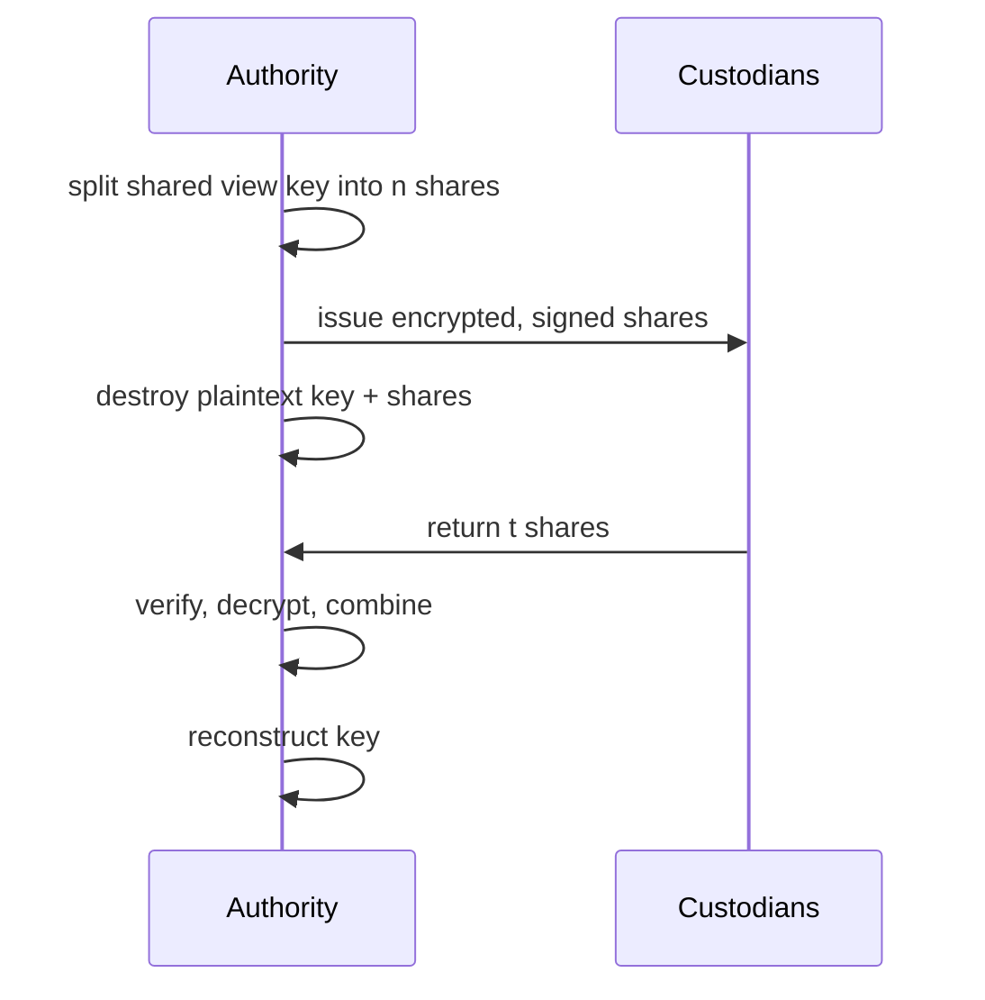

# Global Shared View Key Splitting

An authority generates a P-256 shared view key, Shamir-splits its 32-byte secret across `n` custodians, and reconstructs it from any `t` returned shares to decrypt payloads encrypted to the shared view key.

The authority is a trusted process (eg TEE). It sees the full shared view key at split and at reconstruction, so it is a single point of failure. Splitting the key distributes the authorization to reconstruct across `t` independent custodians: a quorum MUST cooperate, so no single entity reconstructs the key alone.

This document covers the trust model, roles, the split/encrypt/reconstruct flow, and the Go FFI boundary for this proof of concept.

## Table of Contents

- [Glossary](#glossary)
- [Roles](#roles)
- [Key Splitting](#key-splitting)
- [Hierarchical Key Distribution](#hierarchical-key-distribution)
- [Share Encryption](#share-encryption)
- [User Flow](#user-flow)
- [Shamir FFI](#shamir-ffi)
- [Constants](#constants)
- [Test Cases](#test-cases)
- [Security Considerations](#security-considerations)
- [Open Questions](#open-questions)

## Glossary

| Term | Encoding | Definition |
| --- | --- | --- |
| Authority | — | Trusted process (TEE) that splits and reconstructs the shared view key. |
| Custodian | — | Holder of one encrypted share; returns it to authorize reconstruction. |
| Entity | — | A custodian of one outer share; may further distribute it to sub-holders. |
| Sub-holder | — | Holds one inner share or replica of an entity's outer share. |
| Inner Policy | `t_i`-of-`m_i` | Per-entity distribution of its outer share; `t_i = 1` replicates it. |
| Shared View Key | P-256 keypair | Payloads are ECIES-encrypted to it; its 32-byte secret is split. |
| Share | `[u8; 33]` | One GF(256) Shamir share: 32-byte value + 1-byte x tag. |
| Encrypted Share | bytes | A share ECIES-encrypted to the authority and signed by it. |
| Quorum | `t`-of-`n` | The `t` returned shares that reconstruct the shared view key. |
| `P256Pubkey` | `[u8; 65]` | SEC1-uncompressed P-256 public key. |
| ECIES | — | Encryption to a P-256 public key: ephemeral ECDH + HKDF + AES-GCM. |

## Roles

**Authority (TEE)**
1. Holds — its P-256 ECIES keypair and ECDSA signing key, and transiently the shared view key.
2. Can do — split, encrypt, sign, reconstruct, decrypt.
3. Cannot do — reconstruct without `t` returned shares.

**Custodian**
1. Holds — one encrypted share.
2. Can do — return or withhold its share.
3. Cannot do — read the share or the shared view key.

## Key Splitting

The 32-byte shared view key secret is split into `n` GF(256) Shamir shares with threshold `t`. Any `t` shares reconstruct the secret; fewer than `t` reveal nothing. The deployed outer configurations are 2-of-3, 3-of-3, and 5-of-5. The purpose is to require `t` independent entities to cooperate: 2-of-3 also tolerates one missing entity, while 3-of-3 and 5-of-5 require every entity. GF(256) caps `n` at 255 and provides no verifiable secret sharing.

## Hierarchical Key Distribution

The split is two levels:

- Outer: the shared view key secret is split `T`-of-`N` across `N` entities, one outer share each.
- Inner: each entity independently configures an inner policy `t_i`-of-`m_i` for its own sub-holders. `t_i = 1` replicates the outer share, so any one sub-holder returns it. `t_i >= 2` is a genuine Shamir split, so no single sub-holder holds the outer share. A typical policy is 2-of-5: it keeps the share off any single sub-holder and tolerates losing up to three.

To contribute, an entity recovers its outer share from any `t_i` of its sub-holders. Reconstruction needs `T` entities to contribute, and each contributing entity needs `t_i` of its sub-holders. The same Shamir FFI runs at both levels.

Every share and sub-share is encrypted to the authority, so sub-holders hold ciphertexts regardless of `t_i`. The inner policy controls availability and how many sub-holders must cooperate within an entity, not confidentiality from the authority.

## Share Encryption

Each share is ECIES-encrypted (ephemeral P-256 ECDH + HKDF + AES-GCM) to the authority's public key, then signed with the authority's ECDSA key over the ciphertext. The authority verifies the signature and decrypts a returned share with its secret key. AES-GCM detects tampering; the signature proves the authority issued the share, so a custodian cannot substitute a forged-but-valid ciphertext. Payloads are ECIES-encrypted to the shared view key's public key, without a signature.

## User Flow

**Setup** (inside the authority)
1. Generate the shared view key; split its secret into `n` shares.
2. Generate the authority's P-256 ECIES keypair and ECDSA signing key.
3. Encrypt and sign each share; hand each blob to a custodian.
4. Destroy the plaintext shared view key and shares.
5. Persist the shared view key public key and the authority's secret keys.

**Reconstruction** (inside the authority)
1. Collect `(blob, sig)` from custodians; take the first `t`.
2. Verify each share's signature, then decrypt it.
3. Combine the shares and validate the reconstructed scalar.
4. Reload the shared view key.



```mermaid
sequenceDiagram
    participant A as Authority
    participant C as Custodians
    C->>A: return shares
    alt fewer than t, or bad signature
        A->>A: reject; key not reconstructed
    end
```

Where the shares are encrypted — to the authority, to the holders themselves, or to a shared authority-holder key — is an [open question](#open-questions).

## Shamir FFI

Go exposes two functions over the C ABI, operating on flat fixed-width byte buffers (no `[][]byte` across the boundary):

- `shamir_split` — split a secret into `n` contiguous shares; return code signals success or error.
- `shamir_combine` — combine `k` shares into the secret; return code signals success or error.

The fixed-width record layout keeps the `unsafe` wrappers sound; callers MUST NOT pass attacker-controlled sizes. `go.mod` requires `github.com/hashicorp/vault` for the `shamir` package.

## Constants

| Name | Value | Purpose |
| --- | --- | --- |
| Outer config | 2-of-3, 3-of-3, 5-of-5 | `T`-of-`N` across entities; reconstruction needs `T`. |
| Inner policy | per entity `t_i`-of-`m_i`, e.g. 2-of-5 | Each entity configures its own; `t_i = 1` replicates. |
| Shared view key secret | 32 bytes | The split P-256 scalar. |
| Share | 33 bytes | 32-byte value + 1-byte GF(256) x tag. |
| `P256Pubkey` | 65 bytes | SEC1-uncompressed P-256 public key. |
| Signature | 64 bytes | P-256 ECDSA signature. |

Constraints: `1 <= T <= N <= 255` at the outer level, and `1 <= t_i <= m_i <= 255` for each entity's inner policy.

## Test Cases

| Config | Shares returned | Expected |
| --- | --- | --- |
| 3-of-3 outer, all 2-of-5 inner | every entity via 2 of its 5 sub-holders | reconstructs the key |
| 3-of-3 outer, all 2-of-5 inner | one entity returns only 1 sub-holder | that entity cannot contribute; fails |
| 3-of-3 outer, all 2-of-5 inner | one entity returns 0 sub-holders | reconstruction fails |
| 3-of-3 outer, mixed inner (2-of-5, 1-of-3, 2-of-5) | each entity meets its `t_i` | reconstructs the key |
| 2-of-3 outer, all 2-of-5 inner | one entity returns 0 sub-holders | reconstructs; tolerates the missing entity |

## Security Considerations

- Zeroize the reconstructed key, shares, and FFI buffers; pre-size buffers to avoid `Vec` realloc copies.
- Validate the reconstructed scalar is a valid P-256 secret key (non-zero and in range).
- The signature covers the share ciphertext; a deployment SHOULD also include a session or epoch and custodian identity in the signed message to prevent replay and mix-and-match.
- If the authority keeps the shared view key after split, the split provides nothing, so destruction MUST be provable.
- A retained authority share lowers the effective threshold by one.
- Encrypt-to-authority means losing the authority key is permanent loss of the shared view key.

## Notes on publishing a new Shared viewing key

## Open Questions

**1. Where are the key shares encrypted?** All three reconstruct from the same quorum; they differ in who can read a share at rest.

- **To the authority (TEE) — current.** Only the authority can read shares; holders hold ciphertexts and need no keys. The authority is the single point of compromise.
- **To the holders.** Each holder can read its own share; the authority cannot read at rest. Needs holder keys in `setup`, lets `t` colluding holders reconstruct offline, and adds a re-encrypt step on return.
- **To a shared authority-holder key.** Both read it: the holder verifies locally, the authority decrypts on return with no re-encrypt. Needs per-holder key agreement; `t` colluding holders can still reconstruct offline.
2. How do we rotate keys? (we do need to keep old keys around since the encrypted values on the blockchain doesn't change, or can we just introduce a policy that we can only decrypt the last 2 epochs (eg 1 epoch = 2 weeks))
3. What do we do if we decrypt? (should we freeze, force to withdraw, withdraw to a frozen account, withdraw to an escrow account owned by a separate escrow program)
4. How do we create shared tx viewing keys between users and the shared viewing key and enable efficient shared decryption?
  1. inject the shared viewing key instead of the hardcoded point to the derive the view root, this way 
  2. how do we know the users encryption Pubkey?
     1. (we could force the user to create an compressed account with shielded pubkey in a UTXO tree, we prove inclusion of the account, we force that the gap between an existing sender tag and the current sender viewing tag to be at most 100 so that an attacker cannot use incredibly high salts, do we enforce correctness of recipient tags? maybe its not necessary)
     2. shield is a clean dichotomy with no third option:
        - proof shield (`transact` with public amount): runs through the zone proof, which already checks the output uses a re-rooted `view_root` + sender tag + VE, so the depositor must hold an included viewing key and the shielded output is traced via its sender tag exactly like a transfer
        - proofless shield: no proof, so nothing is enforceable and the UTXO body (owner, asset, amount) must be cleartext, trivially visible
        - rule: encrypted ⟹ registered ⟹ traceable; unregistered ⟹ proofless ⟹ cleartext. No bespoke owner-encryption step, since the only way to produce an encrypted output is the proof path, which is already traceable
  3. merge: derive the merge's tx_viewing from the owner's view_root; the merge proof checks both the merge_view_tag and tx_viewing derivations from that view_root (same rule as the sender tag), so the authority finds and decrypts merged outputs
  4. nullifier secret: derive `nullifier_secret` from `view_root` (not `signing_sk`), so the authority reconstructs it and can compute nullifiers to link spends (flow-tracing, not just balances); spending still needs `signing_sk`, so disclosure enables linking, not theft
  5. zones: policy zones use their own encryption/auditor conventions and are excluded; this shared-view-key enforcement should be its own zone, not baked into the default zone
  6. recipient tags: not enforced (correctness only affects the recipient's own sync). The authority catches every transaction sender-side, and the sender's `tx_viewing_sk` decrypts the whole transaction — change and every recipient slot. Senderless paths (proofless, merge) are covered separately
  7. epochs / rotation: `shared_view_pk` is epoch-versioned in `ProtocolConfig`; the zone proof takes the current epoch's `shared_view_pk` and `epoch` id as public inputs, so `view_root = f(viewing_sk, shared_view_pk[epoch])` rotates with it — fresh tags and tx-keys per epoch (the existing per-key reset at zone scale). The authority keeps each epoch's `shared_view_sk` (or the 2-epoch policy from #2); the bound `epoch` selects the key. `viewing_pk` is static, so accounts are never re-created. Rotate `shared_view_pk` rarely — each rotation re-keys every user
