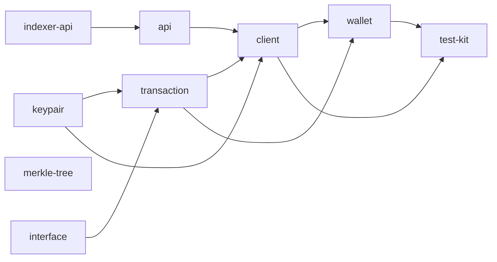

# TypeScript SDK port audit  -  2026-07-24

## Executive verdict

**Current evidence does not support a package-level or full-SDK parity claim.**

The branch ships a substantial, largely coherent TypeScript workspace with strong
fixture coverage for default-zone keypair crypto, confidential transfer/merge
proof assembly, Merkle paths, and many packaging gates. Offline and full-stack
checks on this machine mostly **passed**. That is necessary but not sufficient:
multiple **DIVERGENT** and **MISSING** behaviors remain, inventory targets are
stale, zone rails are largely absent, P14/P15 are incomplete, and several E2E
suites can pass with stubs.

Highest-severity correctness issue: confidential transfer **view tags** published
by `LocalWalletAuthority.encryptConfidentialTransfer` use the recipient
**viewing** public key x-coordinate instead of the owner **signing**
`confidentialViewTag()`, contradicting `docs/spec.md` and Rust
`encode_confidential_slots`. Indexer sync by owner signing tag will miss those
outputs.

---

## 1. Review scope and baseline

| Item | Value |
| --- | --- |
| Branch | `ts-sdk-port` |
| Merge-base / fixture freeze | `43fde8e45d3b1d78aa4c7517a07d6a9675d9bf9f` |
| Audited HEAD | `1614ceb2bd86b948f8e01f6f305e7d0e783961b0` |
| Commits `origin/main..HEAD` | **38** (plan assumed 37; includes `1614ceb2` packed API export check) |
| Cumulative changed paths | **296** (0 commit-only/reverted extras) |
| Inventory rows | **182** (`sdk-libs/ts/reports/inventory.json`) |
| Fixture files (committed) | **55** (`sdk-libs/ts/fixtures/manifest.json`) |
| Rust SDK drift since freeze | **None** under audited `sdk-libs/*` / `program-libs/interface` |
| Scope | Public API **and** internals; full `@zolana/test-kit` parity |
| Authority order | `docs/spec.md` → `program-libs/interface` → Rust SDK → Rust tests → fixtures → TS → planning/inventory |
| Methodology | [`.cursor/skills/review-ts/SKILL.md`](../../.cursor/skills/review-ts/SKILL.md) + code-review + code-simplifier (findings only) |

### Worktree note (environment finding)

During this read-only audit, unrelated concurrent edits appeared in the worktree
(not authored by the audit):

- Modified: `xtask/src/bin/ts-fixtures.rs`, `sdk-libs/ts/fixtures/manifest.json`,
  `sdk-libs/ts/api/test/vectors.test.ts`, `sdk-libs/ts/reports/packets/P00.json`,
  `P08.json`
- Untracked: `xtask/src/ts_fixtures_api.rs`, `sdk-libs/ts/fixtures/api/transport-v1.json`,
  `sdk-libs/ts/api/test/fixture.ts`, `.cursor/`

**No audit process reverted these.** Verdicts below are against **committed HEAD**
unless noted. Concurrent dirty generator/fixture work suggests an in-flight API
oracle landing; treat committed P08 evidence as incomplete until that lands and
is re-checked.

---

## 2. Severity-ordered findings

### Critical

1. **Confidential transfer view-tag divergence (indexing break)**  
   - **Where:** [`sdk-libs/ts/wallet/src/wallet-authority.ts`](../../sdk-libs/ts/wallet/src/wallet-authority.ts) `LocalWalletAuthority.encryptConfidentialTransfer` sets `viewTag: output.ownerAddress.viewingPublicKey.x()`.  
   - **Rust/spec:** [`sdk-libs/transaction/src/instructions/transact/slots.rs`](../../sdk-libs/transaction/src/instructions/transact/slots.rs) `confidential_ciphertext` tags with `address.signing_pubkey.confidential_view_tag()`; spec default-zone section requires owner signing pubkey tags.  
   - **Impact:** Outputs indexed under the wrong tag; wallet sync querying signing `confidentialViewTag()` will miss confidential receipts. Decrypt-only tests still pass.  
   - **Remediation:** Use `output.ownerAddress.confidentialViewTag()` (or `signingPublicKey.confidentialViewTag()`). Add a vector asserting published tag == signing confidential tag ≠ viewing `x()` on P256.  
   - **Test gap:** Authority/E2E tests assert decryptability, not tag equality vs Rust/fixture.

### High

2. **Zone proving / prepare rails MISSING**  
   - **Where:** TS `sdk-libs/ts/client/src/prover/types.ts` `ProverInputs` (`transfer` \| `transferP256` only); `sdk-libs/ts/transaction/src/instructions/builders.ts` `validateMergeZoneInputs` / `prepareZoneAuthority`; no TS type for Rust `sdk-libs/transaction/src/instructions/merge_zone.rs` `PreparedMergeZone` or `sdk-libs/client/src/prover/{merge_zone,zone_authority,transact/zone_*}.rs`.  
   - **Evidence:** Inventory rows for those Rust paths still say `disposition: port`; package exports and prover circuit union omit zone circuits.  
   - **Impact:** Policy-zone transfer, zone-authority, and merge-zone workflows cannot match Rust.  
   - **Remediation:** Port transaction prepare types first, then client JSON/prove paths; retarget inventory from `port` to `MISSING` until done.

3. **`PublicKey::zeroed` / `isZero` missing**  
   - **Where:** Rust `sdk-libs/keypair/src/pubkey.rs` `PublicKey::zeroed` / `is_zero`; TS gap in `sdk-libs/ts/keypair/src/public-key.ts`; TS `sdk-libs/ts/transaction/src/utxo.ts` `ProofInputUtxo.dummy()` uses a random `SigningKey` + `WeakSet` (transaction **DIVERGENT** dummy path).  
   - **Evidence:** Rust exposes zero sentinels for dummy owners; TS `ProofInputUtxo.dummy` uses `SigningKey.generate()` + `WeakSet`, not a zero owner; no `zeroed`/`isZero` on `ShieldedPublicKey`.  
   - **Impact:** Dummy/padding owners are non-reconstructible and diverge from Rust sentinels.  
   - **Remediation:** Add `ShieldedPublicKey.zeroed()`/`isZero()` to `@zolana/keypair` (and allowlist); make dummy UTXOs reconstructible.

4. **Protocol hash helpers duplicated / not package-exported**  
   - **Where:** Rust `zolana-transaction` imports `zolana_keypair::hash::{sha256_be, hash_field, ...}`; TS `sdk-libs/ts/transaction/src/internal.ts` and `sdk-libs/ts/client/src/internal.ts` reimplement `hashField`/`sha256Be`; `sdk-libs/ts/keypair/package.json` exports omit hash.  
   - **Evidence:** `hashField`/`sha256Be` defined in both transaction and client `internal.ts`; keypair `package.json` `exports` has `.` and `./merge` only (no `./hash`).  
   - **Impact:** Drift risk; pack consumers cannot import canonical helpers.  
   - **Remediation:** Export `@zolana/keypair/hash` (or root) and delete duplicates.

5. **Inventory target drift + fixture responsibility fiction**  
   - **Where:** `sdk-libs/ts/reports/inventory.json` targets such as `prover/field.ts`, `traits/*.ts`, per-feature test files, `fixtures/client/merge.json`; `fixtures/api/prover-request-v1.json` is a prover vector, not `@zolana/api` transport.  
   - **Evidence:** Those inventory `target` paths are absent on disk; `fixtures:check` and `test:inventory` still PASS; committed `fixtures/api/` holds prover-request, not transport.  
   - **Impact:** `npm run test:inventory` passes structural checks while misleading implementers/reviewers.  
   - **Remediation:** Retarget each stale inventory row to its consolidated file; add real transport oracles or change dispositions.

6. **P14 / P15 incomplete**  
   - **Where:** Missing `sdk-libs/ts/api-reports/**`, `sdk-libs/ts/reports/packets/P14.json`, `P15.json`; no GitHub workflow job for `npm run check` / TS E2E.  
   - **Evidence:** `reports/packets/` stops at `P13.json`; no `api-reports` directory; `.github/workflows` has no TS npm check/E2E job.  
   - **Impact:** Release/sign-off gates from `work-packets.md` / `security-and-release.md` unmet.  
   - **Remediation:** Land P14 API reports + CI job; then `P15.json` after Critical/High findings are cleared.

7. **`proveMerge` / `finishMergeSubmissionUnsigned` allowlist drift**  
   - **Where:** `sdk-libs/ts/client/src/client.ts` implements both; `planning/typescript-sdk-port/public-exports.md` `@zolana/client` block omits them; P12 `sdk-libs/ts/e2e/actions/actions.test.ts` and `sdk-libs/ts/wallet/test/submit.test.ts` stub `proveMerge`.  
   - **Evidence:** Methods exist on `ZolanaClient`; `public-exports.md` client block has no `proveMerge` matches; action E2E / submit tests inject stubs.  
   - **Impact:** Public ledger disagrees with shipped API; wrong merge proving can still pass acceptance.  
   - **Remediation:** Allowlist both symbols (or remove from the public class) and un-stub P12 merge proving.

8. **Merge prover JSON omits `zoneProgramId` (client DIVERGENT)**  
   - **Where:** TS `sdk-libs/ts/client/src/prover/client.ts` `mergeProverRequest` (no top-level `zoneProgramId`); Rust `sdk-libs/client/src/prover/json.rs` `to_json_merge` / `MergeParametersJson`.  
   - **Evidence:** Frozen merge request object omits top-level `zoneProgramId`; Rust `to_json_merge` always emits it (including `0` for default-zone merge).  
   - **Impact:** Merge prove requests can diverge from the Rust prover client contract.  
   - **Remediation:** Align `mergeProverRequest` with Rust `to_json_merge` and add a fixture assertion.

9. **Wallet sync incomplete vs `wallet_sync.rs`**  
   - **Where:** Rust `sdk-libs/wallet/src/wallet_sync.rs` tag windows / proofless filters / GPA backfill; TS `sdk-libs/ts/wallet/src/sync.ts` `syncWallet` / `waitForIndexer` (flag does not sleep/poll).  
   - **Evidence:** Rust builds known-sender/recipient plus `tx_count`/`request_count` windows; TS mainly queries signing confidential tag plus bootstrap/sender/request tags over `tagWindow`; `waitForIndexer` only `continue`/`break` on collection growth.  
   - **Impact:** Combined with Critical #1, discovery is unreliable vs Rust wallet sync.  
   - **Remediation:** Fix Critical #1 first; then port known-sender/recipient + count windows + real indexer wait.

### Medium

10. **Interface package: few exact-byte fixtures**  -  only deposit default path has a frozen byte/meta oracle; transact/merge/zone builders lack Rust-oracle vectors despite P02 bar.  
11. **Stricter TS bool decode**  -  Pod `u8` flags accept any nonzero in Rust; TS `Reader.bool` requires `0|1`.  
12. **Confirmation stricter than Rust**  -  TS requires each extracted tag present on the indexed tx; Rust signature match can suffice.  
13. **Keypair error taxonomy lossy**  -  `ZeroScalar`/`NotEd25519`/`Hkdf` collapsed or remapped.  
14. **Merkle sparse/unpopulated leaf proofs**  -  Rust returns zero paths; TS throws (**PARTIAL**/borderline DIVERGENT).  
15. **Smart-account overflow**  -  TS rejects overflows Rust silently truncates (stricter; document or align).  
16. **Registry/public surface thinning**  -  many Rust helpers omitted vs thinner allowlist (may be intentional).  
17. **E2E trustworthiness**  -  P13 largely re-encodes fixture bytes; merge proving stubbed in P12.  
18. **Base58 reimplemented per package** (simplifier)  -  divergent algorithms/checks.  
19. **xtask oracle duplication** (simplifier)  -  N near-copy compile/run blocks; amplifies dirty generator drift.

### Low

20. **`createTestWallet` unsafe cast** of `solanaAddress` to `Address`.  
21. **Nested ternaries** in output-data encode/decode (simplifier).  
22. **Duplicate `MergeMaterialInput` type** in client (simplifier).  
23. **No dedicated capability-separation tests** (viewing cannot sign / nullifier cannot decrypt) beyond type system.

---

## 3. Package progress and verdict summary

Approximate per-file verdicts from parallel audits (consolidated layouts counted once per Rust source / inventory responsibility):

| Package pair | Progress (reviewed/total) | Dominant verdicts | Parity supportable? |
| --- | --- | --- | --- |
| Oracle/workspace (P00/P01) | 16/16 config scripts + 6/6 xtask fixture sources + 15/15 reports | Scaffolding PARITY; inventory STALE | No (inventory/P14/P15) |
| `@zolana/interface` | 40/40 Rust sources in interface audit | Mostly PARTIAL; tags PARITY | No |
| `@zolana/smart-account-client` | 2/2 + oracle | Mostly PARITY | Conditional (overflow policy) |
| `@zolana/keypair` | 12/12 ordered sources | 2 PARITY, 10 PARTIAL | No (exports/zeroed) |
| `@zolana/merkle-tree` | 5/5 | Mostly PARITY; sparse PARTIAL | Near for hashed surface |
| `@zolana/indexer-api` | 2/2 | PARTIAL (evidence gap) | No |
| `@zolana/api` | 2/2 | PARTIAL (no transport oracle) | No |
| `@zolana/transaction` | ~24 / P05 responsibilities | PARTIAL; dummy DIVERGENT; MergeZone MISSING | No |
| `@zolana/client` | 22/22 src files | 4 PARITY, 13 PARTIAL, 4 MISSING, 1 DIVERGENT | No |
| `@zolana/wallet` | 10/10 P10 inventory sources | DIVERGENT authority tags; sync PARTIAL | No |
| `@zolana/test-kit` | 12/12 P11 rows | PARTIAL as LiteSVM twin; OK as private Node kit | No full twin claim |
| P12/P13 E2E | 4/4 suite files + workflow fixtures | Pass mechanically; trustworthiness MEDIUM | Supporting only |

**Overall extracted verdict mix (agent reports):** ~23 PARITY · ~96 PARTIAL · ~7 MISSING · ~3 DIVERGENT · ~6 NOT_APPLICABLE (plus many inventory test rows PARTIAL due to consolidation).

---

## 4. Selected per-file verdict blocks

Highest-signal committed-path findings are below. Detailed lane notes from this
session were ephemeral under `/tmp/zolana-audit-findings/` and are summarized
here rather than checked in; package completion treats summarized verdicts as
the durable record.

### [sdk-libs/keypair/src/encryption.rs]

- TS counterpart: `sdk-libs/ts/keypair/src/encryption.ts`
- Inventory row: P04 `internal`
- Role: internal ECDH / HKDF / AES-CTR
- Verdict: **PARITY**
- Rust behavior: IKM = dh‖eph‖recipient; info = HPKE‖transfer‖salt‖u32be(slot); CTR starts at nonce‖2
- Evidence: `fixtures/keypair/encryption.json`; property/security tests; no Rust drift
- Gaps: none material
- Required action: none
- Questions: none

### [sdk-libs/keypair/src/pubkey.rs]

- TS counterpart: `sdk-libs/ts/keypair/src/public-key.ts` (inventory path stale)
- Inventory row: P04 `port`
- Role: public keys, owner fields, confidential view tags, zero sentinel
- Verdict: **PARTIAL**
- Rust behavior: includes `zeroed`/`is_zero` for dummy owners
- Evidence: `pubkey.json`; TS lacks zero API
- Gaps: missing `zeroed`/`isZero`; branded length `Bytes33` vs 34-byte keys
- Required action: add sentinel API + fixture; fix inventory target
- Questions: should public-exports allowlist include `zeroed`?

### [sdk-libs/transaction/src/instructions/transact/slots.rs]

- TS counterpart: split across `transaction` serialization + `wallet` `LocalWalletAuthority`
- Inventory row: P05 (transact slots)
- Role: confidential ciphertext + owner view tags
- Verdict: **DIVERGENT** (via wallet encrypt path)
- Rust behavior: tag = signing `confidential_view_tag`
- Evidence: `slots.rs:38`; TS `wallet-authority.ts:115` uses viewing `x()`
- Gaps: published indexer tags wrong for confidential transfers
- Required action: Critical #1
- Questions: none  -  spec is explicit

### [sdk-libs/transaction/src/instructions/merge_zone.rs]

- TS counterpart: only `validateMergeZoneInputs` in `builders.ts`
- Inventory row: P05 `port`
- Role: `MergeZone` / `PreparedMergeZone`
- Verdict: **MISSING**
- Rust behavior: prepare/pad/`input_utxo_hashes` for zone merge
- Evidence: no TS class/type; zone fixture covers mismatch only
- Gaps: cannot build merge-zone proofs
- Required action: port prepare API then client prove path
- Questions: priority vs zone-transfer?

### [sdk-libs/client/src/prover/proof.rs]

- TS counterpart: `sdk-libs/ts/client/src/prover/proof.ts`
- Inventory row: P09
- Role: parse/compress Groth16 (+ BSB22 commitment)
- Verdict: **PARITY** (default rails)
- Rust behavior: negate G1 `a` on parse; compress; optional commitment
- Evidence: `proof-result-compression-v1.json`; TS negates `y` at parse (`BN254_BASE_MODULUS - y`)
- Gaps: none for confidential rails
- Required action: none
- Questions: none

### [sdk-libs/client/src/prover/merge_zone.rs] / zone_* 

- TS counterpart: none
- Inventory row: P09 still `port`
- Role: zone/merge-zone proving
- Verdict: **MISSING**
- Required action: retarget inventory; implement after transaction prepare types
- Questions: see High #2

### [sdk-libs/wallet/src/wallet_authority.rs]

- TS counterpart: `sdk-libs/ts/wallet/src/wallet-authority.ts`
- Inventory row: P10
- Role: custody boundary + encrypt helpers
- Verdict: **DIVERGENT**
- Rust behavior: thin re-export; encrypt uses signing confidential tags
- Evidence: Critical #1
- Gaps: wrong view tags; custody of secrets vs client is otherwise OK
- Required action: fix tags; add tag-equality tests
- Questions: none

### [sdk-libs/program-test/src/lib.rs] (+ P11 set)

- TS counterpart: `@zolana/test-kit` (private)
- Inventory rows: 12 P11
- Role: local harness
- Verdict: **PARTIAL** (not a LiteSVM twin); private boundary **PARITY**
- Evidence: pack check excludes test-kit from production graphs; live registry test passed with `ZOLANA_TEST_LIVE=1`
- Gaps: many SVM send/index paths are instruction-construction only
- Required action: document as Node support kit; fix inventory overclaims
- Questions: is full LiteSVM parity required?

---

## 5. Commit ledger (`origin/main..HEAD`)

| # | Commit | Packet / role |
| --- | --- | --- |
| 1 | `488164b2` | Planning contract |
| 2 | `07b5000e` | P00 fixtures + xtask |
| 3 | `c754cc44` | P01 workspace scaffold |
| 4 | `02b1c930` | P03 smart-account |
| 5 | `641fdbdc` | P02 interface |
| 6 | `73feddc8` | P01 tooling |
| 7 | `c1963518` | P06 merkle fixtures |
| 8 | `b4490eb3` | P07 indexer-api |
| 9 | `f07f3c11` | P06 hasher admission |
| 10 | `5716bc08` | P04 keypair |
| 11 | `d7c7fb5c` | P06 merkle-tree |
| 12 | `63dc7755` | P08 cross gates |
| 13 | `f83dd876` | P08 api transport |
| 14 | `f3a1759f` | docs crypto/proof contracts |
| 15-17 | `2d663d81` `1d795a11` `d91b777e` | keypair/merkle fixture fixes |
| 18 | `a4fcd25f` | P05 transaction fixtures |
| 19-20 | `f704365c` `3e0fe0b5` | interface/fixed-byte fixes |
| 21 | `35377f4b` | P05 transaction |
| 22-23 | `76e4ca62` `66334c3d` | client gates / mixed ownership |
| 24 | `323dadd6` | P09 client fixtures |
| 25 | `13cb30ec` | P09 client+prover |
| 26-28 | `edc37f88` `8e7f47c4` `8df87a8b` | wallet gates / keys / merge prove |
| 29 | `f55cbb1b` | P10 wallet fixtures |
| 30 | `48da6682` | P10 wallet |
| 31-32 | `0df26c4c` `e20d0469` | P11 test-kit + merge opt-in |
| 33 | `dfe3549c` | E2E routing |
| 34-35 | `887675f7` `9886e7bb` | P12 action fixtures/E2E |
| 36-37 | `83efeec4` `9905e992` | P13 instruction fixtures/E2E |
| 38 | `1614ceb2` | packed API export verification |

The 296 cumulative paths are `A` (add) relative to `origin/main`. Categories: planning 14, fixtures 56, reports 15, config 16, e2e 4, xtask 6, root tooling 7, remainder package src/test/meta.

Generated vs handwritten:

| Generated / evidence | Handwritten review surface |
| --- | --- |
| `sdk-libs/ts/fixtures/**`, `manifest.json` | `sdk-libs/ts/*/src/**`, `*/test/**`, `e2e/**` |
| `reports/inventory.json`, `reports/packets/P00-P13.json` | `sdk-libs/ts/config/**`, root npm/eslint/prettier/vitest |
| lockfiles | `xtask/src/ts_fixtures_*.rs`, `xtask/src/bin/ts-fixtures.rs` |

Missing planned artifacts: `api-reports/**`, `P14.json`, `P15.json`.

---

## 6. Cross-package synthesis

Critical cross-cutting defects:

1. **Tag contract broken at wallet encrypt** while transaction prepare often uses correct `confidentialViewTag()` for owner tags in proof outputs  -  ciphertext slot tags and proof owner tags can disagree.
2. **Zone chain blocked** at transaction prepare → client prove → wallet/test-kit.
3. **Hash duplication** across keypair/transaction/client undermines “one canonical math” rule.
4. **Allowlist vs implementation** drift (`proveMerge`) plus E2E stubs hide merge regressions.
5. **Inventory** claims overstate completeness (zone rows `port`, nonexistent targets).

Deposit `viewTag: viewingPublicKey.x()` and registry `ResolvedAddress.viewTag = viewing.x()` match Rust `recipient_bootstrap_view_tag` / `resolved_address_from_record` (viewing-key x-coordinate) and are not the confidential-transfer signing-tag bug.

---

## 7. Verification evidence

Commands run from `/Users/tilohelius/Workspace/zolana` (PATH included `~/.cargo/bin`). Tracked dirty files were **not** reverted.

| Tier | Command | Result |
| --- | --- | --- |
| V0 | `git status --short` (start) | Only `?? .cursor/` initially |
| V1 | `node_modules` present | OK |
| V2 | `npm run fixtures:check` | **PASS**  -  55 fixtures, 182 inventory rows |
| V2 | `npm run check` | **PASS** (build, typecheck, lint, format:check, 310 unit tests, inventory/exports/deps/api) |
| V2 | `npm run test:vectors` | **PASS** |
| V2 | `npm run test:property` | **PASS** |
| V2 | `npm run test:cross` | **PASS** |
| V2 | `npm run test:prover` | **PASS** |
| V2 | `npm run test:browser` | **PASS** |
| V2 | `npm run pack:check` | **PASS** |
| V2 | `just test-sdk-libs` | **PASS** (after fixing PATH) |
| V3 | `just build-programs` | **PASS** |
| V3 | `just build-photon` | **PASS** |
| V3 | `just build-prover-server` | **PASS** |
| V4 | `ZOLANA_PORT_OFFSET=300 npm run test:e2e:actions` | **PASS** 9 tests |
| V4 | `ZOLANA_PORT_OFFSET=400 npm run test:e2e:instructions` | **PASS** 7 tests |
| V4 | `ZOLANA_PORT_OFFSET=500 ZOLANA_TEST_LIVE=1` test-kit live registry | **PASS** 1 test |
| V5 | Final `git status` | Extra dirty/untracked API-fixture files (concurrent; not audit edits) |

**Passing tests do not establish parity.** Several suites would still pass with Critical #1 and stubbed merge proving.

---

## 8. Code-simplifier concerns (behavior-preserving)

See session extract `simplifier.md`. Highest maintainability items:

1. **High:** Deduplicate xtask oracle compile/run blocks + shared `hex`/`error` helpers.  
2. **Medium:** Single Base58/address codec owned by `@zolana/interface`.  
3. **Medium:** One `MergeMaterialInput` type.  
4. **Medium:** Replace nested ternaries in output-data codecs with switch/maps.  
5. Keep: branded byte lengths, `ClientError`/`TransactionError` codes+details, frozen objects, defensive copies in key material.

Do not “simplify away” zeroization attempts or explicit length checks.

---

## 9. Decisions requiring human input

1. Fix confidential view tags immediately (recommended) vs treat as known defect with docs warning?  
2. Add `proveMerge` / `finishMergeSubmissionUnsigned` to `public-exports.md`, or remove from public class?  
3. Is TS’s stricter confirmation tag-binding desired?  
4. Priority order for zone rails: merge-zone vs zone-transfer vs zone-authority?  
5. Export keypair hash/constants subpaths, or formally own hashes in `@zolana/transaction`?  
6. Is `@zolana/test-kit` required to be a LiteSVM behavioral twin, or a private Node harness?  
7. How to reconcile concurrent dirty API-fixture work with this audit’s committed baseline?

---

## 10. Ordered remediation plan (smallest first)

1. **Fix Critical #1** view tags in `LocalWalletAuthority.encryptConfidentialTransfer`; add failing-then-passing vector vs Rust/signing tag.  
2. Align dummy UTXOs with `zeroed`/`isZero` (keypair + transaction).  
3. Export canonical hash helpers; delete transaction/client duplicates.  
4. Document or add `proveMerge*` to public-exports; un-stub P12 merge proving.  
5. Fix merge prover JSON `zoneProgramId`; add fixture.  
6. Retarget inventory rows to real TS paths; mark zone rows `MISSING`; remove fixture fiction.  
7. Expand interface/transact exact-byte fixtures.  
8. Port `PreparedMergeZone` / zone prepare → client zone prove JSON → wallet/test coverage.  
9. Complete wallet sync discovery windows + indexer wait semantics.  
10. Land P14 API reports + CI; P15 sign-off after Critical/High cleared.  
11. Optional: Base58/xtask dedupe (simplifier).

---

## 11. Package / full-SDK completion checklist

### Package completion (aggregate)

- [x] Canonical Rust sources reviewed with verdicts for the scoped packages  
- [ ] Full public Rust export set has accurate TS dispositions (allowlist drift remains)  
- [ ] Each TS export traces to Rust or a documented adaptation (`proveMerge` gap)  
- [ ] Inventory claims independently verified (many **failed** verification)  
- [x] Rust changes since fixture freeze reviewed (none)  
- [x] Deterministic bytes match for covered fixtures (`fixtures:check` PASS)  
- [ ] Non-deterministic paths covered (sync/poll/live gaps)  
- [ ] Rust rejection/tamper scenarios mirrored for keypair/transaction covered paths (PARTIAL elsewhere)  
- [ ] Error `code`/`details` aligned with Rust variants (keypair collapses `ZeroScalar` / `NotEd25519`)  
- [x] Browser/Node gates pass for current packages  
- [ ] Feature-gated / each proof rail disposed (zone **MISSING**)  
- [x] Relevant package checks pass  
- [x] Remaining gaps name paths/symbols (this document)

### Full SDK completion

- [ ] Each scoped package complete  
- [ ] Cross-package workflows match Rust (view-tag break)  
- [ ] Deposit/transfer/split/withdraw/merge/registration/sync/submit covered without stubs  
- [x] Instruction bytes exercise same-revision programs in E2E (mechanical PASS)  
- [x] Prover inputs work for covered confidential rails  
- [ ] Indexer HTTP JSON-RPC request/response bytes pinned by a Rust-generated transport fixture  
- [ ] EdDSA and P256 **and zone** rails full shape set  
- [ ] Zone transfer / zone authority / merge-zone named coverage  
- [ ] Fixture provenance equals reviewed revision **and** covers failing cases  
- [ ] Public-export ledger has no unexplained differences  
- [ ] No PARTIAL/MISSING/DIVERGENT/STALE/BLOCKED remains  -  **FAIL**

---

## 12. End-of-session summary

1. **Files reviewed:** The ten TS packages plus oracle/xtask/config plus P12/P13; 182 inventory rows dispositioned at package level; 38 commits / 296 paths ledgered.  
2. **New gaps:** Critical confidential view-tag bug; zone MISSING; zeroed/dummy DIVERGENT; hash duplication; inventory fiction; merge JSON; sync incompleteness; P14/P15 absent; E2E stub trustworthiness; concurrent dirty API-fixture worktree.  
3. **Human decisions:** §9.  
4. **Exact next Rust file to fix/port:** start with wallet encrypt path (TS) driven by Rust `slots.rs` / `confidential_ciphertext`; then `sdk-libs/keypair/src/pubkey.rs` zero sentinel; then `sdk-libs/transaction/src/instructions/merge_zone.rs`.  
5. **Progress:** foundational + dependent packages reviewed; parity claim **unsupported**.  
6. **Evidence supports parity?** **No.**

---

*Audit mode: read-only except this planning report. No SDK, fixture, inventory, or spec source fixes were applied by the auditor.*
