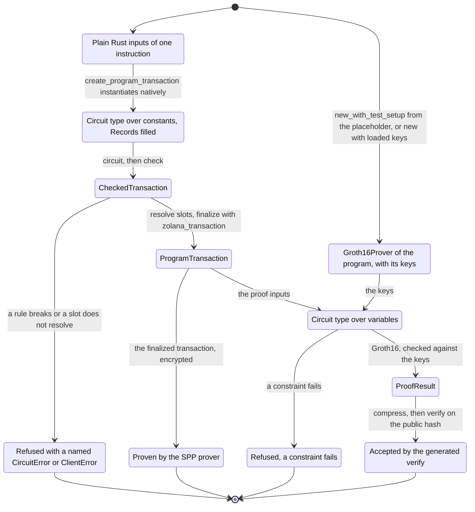
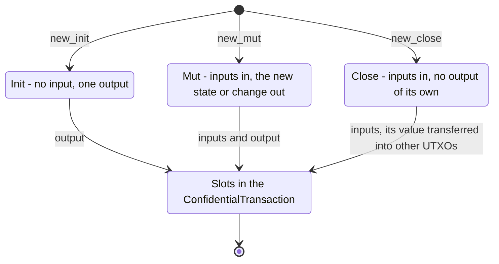

# zolana-program

The SDK for Solana programs built on the shielded pool (SPP). It has three parts:

- **Instructions.** The crate re-exports [`zolana-instruction`](../instruction): the SPP
  instruction builders, the `transact` CPI (feature `cpi`), and the on-chain SPP derivations.
  Without features the crate is `no_std` and builds for SBF.
- **Compressed accounts.** `compression` keeps a pinocchio program's state as SPP UTXOs that
  one of its PDAs owns, and creates, updates and reads them through a `transact` CPI.
- **ZK programs.** A program with its own Groth16 circuit, whose proof is bound to the SPP
  transaction it CPIs. A `circuit` fn written in the DSL of `zolana_program::circuit` runs
  twice:
  - natively on the client, where it builds the SPP transaction's inputs and outputs;
  - as R1CS in the prover, where it checks the constraints and the public hash.

  The circuits are arkworks 0.6 R1CS over BN254. The derives come from
  [`zolana-macros`](../macros).

The ZK program part implements [`spec.md`](spec.md); [`invariants/`](invariants) states what
each builtin guarantees and which tests cover it.

A developer writes plain Rust input types, and the client, the tests and the prover all take
them. `CircuitVar` appears only in the `circuit` impls.

## Features

No feature is on by default.

| Feature | Contents |
| --- | --- |
| none | `no_std`: the `zolana-instruction` re-export and `CompressedProof`. |
| `cpi` | The SPP `transact` instruction as a signed CPI from a pinocchio program. |
| `compression` | Compressed accounts for pinocchio programs (implies `cpi`). |
| `protocol-instructions` | Builders for protocol operations: authority administration, tree creation, ring activation and nullifier tree maintenance. |
| `circuit` | The DSL, `conversion`, `hasher`, the input and UTXO types, `ConfidentialTransaction` and R1CS synthesis. Needs `std`. |
| `client` | The native run, the SPP transaction, loading proving keys, proving and verifying. |
| `encrypt` | `ZkProgram::create_proof_inputs_and_encrypt` and `create_proof_inputs_and_encrypt_with_keys`. |
| `setup` | The test setup, writing proving keys and exporting the verifying key. |
| `r1cs-export` | `client` and `setup`, for exporting a circuit's `.r1cs`. |
| `parallel` | Proving on a rayon thread pool. |
| `serde`, `tsify` | Serde and TypeScript types for the client types. |
| `wasm`, `wasm-prover`, `wasm-threads`, `wasm-verify` | The wasm bindings, the wasm prover, its thread pool and a wasm verifier. |
| `external-tools` | Test only: the unit suite's cross-checks that spawn circom and snarkjs. |

An on-chain program depends on the crate with `compression` or `cpi`. Its client enables
`client`, and a key setup needs `setup` as well.

## Building a ZK program

1. Declare each instruction's inputs as a plain struct with `#[derive(ProofInput)]`, a
   program state with `#[derive(CircuitType)]`, and the public inputs with
   `#[derive(PublicInputs)]`.
2. Implement `Circuit` on the derived circuit type.
3. `zolana build-zk-program -p <crate>` writes each circuit's `.r1cs`, test keys and verifying
   key to `<target>/zk/<crate>`, builds the wasm module and runs `cargo build-sbf`.
   `zolana zk compile | setup | import | export-verifier` run the steps one at a time.
4. In the program, `pub mod zk { zolana_macros::include_zk_programs!(); }` generates one
   module per program, `zk::<program>`, with its public inputs and a `verify` over the
   verifying key in the target dir.
5. On the client, `create_program_transaction` builds the SPP transaction and the proof
   inputs, and `Groth16Prover::prove` proves them.

## Layout

zolana-program groups its modules by the phase that uses them:

| Module | Phase |
| --- | --- |
| `circuit/` | The DSL a `circuit` fn is written in: the builtins, the UTXO types, the transaction and the `Circuit` trait. `builtins/` holds the values, operations and gadgets, `protocol/` the UTXOs and the transaction. |
| `conversion/` | Between client and circuit values: `ProofInput`, `FromCircuit`, `Allocator`, `Records`, and bytes to fields and back. |
| `client/` | The plain Rust side: `TxContext`, `Owner`, `ProgramOwner`, `DataUtxo`, and with feature `client`, `ZkProgram`, `ProgramTransaction` and `ZkCircuit`. |
| `prover/` | `Groth16Prover`, the Groth16 types, zkeys and the R1CS synthesis behind them. |
| `hasher/` | The data hashes and discriminators that on-chain code and circuits share. |
| `compression/` | Compressed accounts for pinocchio programs. |
| `wasm/` | The wasm bindings. |

The phases have equivalent files: `utxo.rs` and `transaction.rs` hold one concept in
`circuit/`, `conversion/` and `client/`.

The public paths follow the same split. The crate root holds what the client and the prover
use, `zolana_program::circuit` the DSL, and `zolana_program::conversion` what lies between.

## Abstractions

### `zolana_program`: client and prover

| Name | What it is good for |
| --- | --- |
| `TxContext` | The transaction settings: the blinding seed, from the OS RNG in `new`, and the output tree, `Some(0)` by default and the first spent input's `latest_tree_id` when `None`. The first nullifier comes from the first spent input and the sender from the keys. |
| `Owner` | An owner preimage: the tag (`S` for Ed25519 and PDA keys, `P` for P256), the key bytes and the nullifier key. From a `ShieldedAddress`, or a signing key and nullifier key. |
| `Bytes<N>` | A byte string the circuit sees byte by byte. |
| `ProgramOwner` | A program PDA as a UTXO owner: its public key, owner hash and `ShieldedAddress` under the fixed zero nullifier key. `input` turns an output the program's transaction created into a spendable `WalletUtxo`. `decrypt_data_utxos::<T>` decrypts the PDA's outputs in indexer transactions with a viewing key and keeps the data UTXOs whose hash commits a `T`, minus those the same transactions spend. |
| `DataUtxo<T>` | A decrypted UTXO and the program state its data holds. `TryFrom<WalletUtxo>` decodes `T` from the UTXO data, checks that the UTXO hash commits its `DataHasher` hash, and sets `data_hash`, so the UTXO can be spent. |
| `ZkProgram` | Feature `client`. Implemented for every input that implements `ProofInput` with a `Circuit` and `Placeholder`. `create_program_transaction` runs `circuit` natively, resolves the slots against the records and returns a `ProgramTransaction`. `create_finalized_transaction` returns only the SPP transaction. With feature `encrypt`, `create_proof_inputs_and_encrypt_with_keys` encrypts it with the sender's `ShieldedKeys` into `SppProofInputs`, after checking their `padding_independent_private_tx_hash` against the circuit's. `check_constraints` runs the circuit natively and in R1CS without proving, and also synthesizes the placeholder the keys come from: it names a value read of a variable, a shape that differs from the placeholder's and the first constraint that does, and an unsatisfied row by its rule and line. `export_r1cs` (feature `setup`) writes the circuit's constraints in the iden3 `.r1cs` format for a snarkjs ceremony, and `export_assignment` writes an input's full variable assignment as a snarkjs `.wtns` file. |
| `ProgramTransaction` | Feature `client`. What `create_program_transaction` returns: the SPP `FinalizedTransaction`, the program's `ProofInputs` and the public hash, so one call feeds both proofs. |
| `ZkCircuit` | Feature `client`. A circuit with no transaction and no public input, for testing a builtin on its own. Implemented for every input that implements `Placeholder` and whose circuit type implements `Constraints`. `check_constraints` runs the constraints natively and in R1CS and compares the proof's synthesis with the placeholder's, as `ZkProgram`'s does. `export_r1cs` (feature `setup`) and `export_assignment` write the iden3 `.r1cs` and `.wtns` files, with 0 public inputs. There is no Groth16 prover for one yet; snarkjs proves one from those files. |
| `Groth16Prover<P>` | Feature `client`. The Groth16 keys of program `P`. `new_with_test_setup` (feature `setup`) sets them up from `P`'s placeholder with a fixed seed, and `new` takes loaded keys and refuses keys of another circuit. Setup and proving both use the snarkjs QAP reduction, so keys from the local setup and from a zkey have the same shape. `prove` borrows the inputs and returns a `ProofResult`; `verify` checks one in its compressed form, as a program does. |
| `ProofResult` | Feature `client`. A proof and the public hash it is valid for. |
| `SolanaProof` | Feature `client`. A proof in the groth16-solana layout, from an arkworks `Proof`. |
| `CompressedProof` | No feature, so programs and `compression` use it on chain. The 128-byte form an instruction contains, with a wincode layout. Feature `client` adds `CompressedProof::try_from(&proof)` from a `SolanaProof` and `CompressedProof::verify`, which decompresses and verifies it. |
| `CircuitError` | What circuit code returns: a broken rule, a value out of range, a wrong length, a bounded `Vec` with too many or too few items (`TooManyItems`, `TooFewItems`, naming the field) or a bad owner or UTXO. `broken_rule()` names the rule and `location()` the `file:line:column` of the program's line that broke it. |
| `ClientError` | What building a transaction returns: a circuit error, a slot that does not resolve or a transaction the SPP builder refuses. |
| `ProverError` | What `check_constraints`, the keys and `Groth16Prover` return. A failing constraint carries its row, the rule of the check that made it and the circuit's `file:line`, which `location()` returns. |
| `SourceLocation`, `SlotKind` | The `file:line:column` of an error, and the kind of slot a slot error names. |
| `ProvingKey`, `VerifyingKey`, `Proof` | Features `client` or `setup`. The arkworks Groth16 types over BN254, without the curve parameter. |

**Setup** (feature `setup`)

| Name | What it is good for |
| --- | --- |
| `Groth16Keys` | A proving key and its verifying key, from an arkworks `ProvingKey` or `Groth16Prover::keys`. `save` and `load` write and read the proving key. `load_zkey::<P>` (feature `client`) reads a snarkjs Groth16 zkey. It checks every point, refuses an identity in the verifying key and a zkey without a phase-2 contribution, and checks that the shape and the A and B rows match `P`'s circuit. `export_verifying_key` writes the program constant. |
| `VerifyingKeyExport` | Where `export_verifying_key` writes: the proving key to hash, the output file, the constant's name and the `SetupKind`. The file comes from groth16-solana's generator. Keys from the local setup are `InsecureTest`. A ceremony zkey is `Production`, and its digest is the zkey's sha256. |
| `SolanaVerifyingKey` | The verifying key in the groth16-solana layout, from an arkworks `VerifyingKey`. It converts into the `Groth16Verifyingkey` that `verify_groth16` takes. |

### `zolana_program::circuit`: the DSL

**Values and hashing**

| Name | What it is good for |
| --- | --- |
| `Field` | A native element of the BN254 scalar field that UTXO hashes and the public hash live in. It is a newtype over arkworks' `Fr`, with `From` for `u8` to `u128`, `bool` and `Fr`, `Fr::from(field)` back, and `+`, `-`, `*` and negation on native values. `is_zero`, `inverse`, `sqrt`, `pow` and `u64::try_from` / `u128::try_from` are available when preparing input values. |
| `CircuitVar` | The value type inside `circuit`: a field element, a constant in the native run and a variable in R1CS. `+`, `-`, `*`, unary `-`, `+=`, `-=` and `*=` are field arithmetic that wraps around the modulus: a sum and a product by a constant are free, and a product of two variables costs one constraint. `inverse`, `div` and `pow` (by a constant exponent) are methods in the field; `inverse` and `div` refuse a zero divisor. `/`, `%`, `==` and `<` do not compile: the `/` and `%` errors point to `Uint::div_rem` and `CircuitVar::div`, and the `==` and `<` errors name the rules `UseAssertEqual` and `UseUintComparison`, for `assert_equal` or `is_equal` and the `Uint` comparisons. `CircuitVar::from` takes a `Bool` or a `Uint<BITS>`, and `Bool::try_from(&var)` and `Uint::try_from(&var)` check one back. `assert_product(other, product, rule)` constrains `self * other = product` in one row. |
| `CircuitSystem`, `ConstraintSystem` | The constraint system R1CS instantiation allocates into. `ConstraintSystem::new_ref()` makes one. |
| `constant`, `zero`, `value` | Build a constant `CircuitVar`, or read a constant's value. Native execution represents proof inputs as constants, so `value` can read them. In R1CS, proof inputs are variables: reading one fails with `ReadsVariableValue` at the read's source location during setup or proving. A successful native run alone does not establish that a circuit can be proved; use `check_constraints`. |
| `Assert` | Equality with a named rule on `CircuitVar`, `Uint<BITS>`, `Bool`, `Bytes<N>`, `Asset`, `OwnerKey`, `Owner` and arrays: `assert_equal`, `assert_not_equal`, `assert_equal_if(condition)`, and `is_equal`, which returns a `Bool`. A zero check on a `CircuitVar` compares it with `zero()`: `is_equal(&zero())`, `assert_equal(&zero(), rule)` or `assert_not_equal(&zero(), rule)`. |
| `Uint<BITS>` | A value below `2^BITS`, 1 to 253 bits, with the aliases `U8`, `U16`, `U32`, `U64` and `U128`. `add`, `mul` and `sum` return a wider type at no cost. `From` widens between the aliases and turns a `Bool` into a `Uint`; `TryFrom` narrows between the aliases and range-checks a `CircuitVar` into a `Uint`. `checked_add`, `checked_mul`, `checked_sub`, the `assert_less_*` comparisons, `assert_in_range(low, high)` (inclusive), `assert_equal`, `assert_not_zero` and `div_rem` check a named rule; the `is_less_*` comparisons return a `Bool`, and `min` and `max` select by one. Range checks and comparisons decompose through arkworks' `to_bits_le_with_top_bits_zero`; ordering works on at most 252 bits, so a difference cannot wrap around the field. Widths are checked when the circuit is built: a sum or product that could wrap does not compile. |
| `Bits` | `check_bits(bits)`, `check_is_bool`, and `to_bits_le::<N>()`, which returns the bits as `Bool`s. `from_bits_le` recomposes them. |
| `Bool` | A 0 or 1 value, from a `bool` input, `Bool::try_from(&var)`, `is_equal` or a comparison: `select(if_true, if_false)` for any `Select` type, `not`, `and`, `or`, `xor`, `nand`, `implies`, `Bool::all`, `Bool::any`, `assert_true`, `assert_false` and `assert_true_if(condition)`. `Uint::from(flag)` and `CircuitVar::from(flag)` turn one into a value, for arithmetic or hashing. A circuit needs no arkworks import to branch on one. |
| `Select` | Selection by a `Bool`, for `CircuitVar`, `Uint<BITS>`, `Bool`, `Bytes<N>`, `Asset`, `OwnerKey`, `Owner` and arrays. `one_hot::<N>(index)` and `select_index(&items, index)` index an array by a variable and refuse an index outside it. |
| `is_in`, `assert_in` | Membership of a value in a set of `CircuitVar`s. |
| `poseidon` | The circom Poseidon that zolana hashes with natively, built from light-poseidon's parameters. |
| `nonzero_hash_chain` | The chain `private_tx_hash` folds input and output hashes with. It skips zeros, so dummies do not enter it. |
| `Bytes<N>::hash_bytes()` | A fixed-width commitment over checked bytes: 31-byte big-endian chunks folded with Poseidon. Use one `N` per protocol hash domain; leading zeroes are valid. |
| `Bytes<N>` | `N` byte variables, each range-checked to 8 bits when allocated. `Bytes::<N>::try_from(&var)` splits a variable into big-endian bytes and `CircuitVar::try_from(&bytes)` packs them back, for `N` up to 31. |

**UTXOs**

| Name | What it is good for |
| --- | --- |
| `Asset` | A mint as bytes. `hash()` is the asset hash; `Asset::sol()` and `Asset::constant(&mint)` are constants. |
| `OwnerKey` | The tag and key bytes. `identity()` is `hash_bytes(tag \|\| key)`, the value the program sees as `owner_identity`. |
| `Owner` | An `OwnerKey` and the nullifier key. `hash()` is the owner hash. Owners compare by their packed preimage. |
| `Utxo` | The circuit form of a spent UTXO, with its `Owner` and `Asset`. Its amount is crate-private: the SPP proof range-checks it, and a circuit reads it through `UtxoTrait`. `Utxo::dummy()` pads a `TokenUtxos`. A dummy carries no nullifier key. |
| `UtxoMeta` | The spent UTXO's nullifier and latest tree, not part of the commitment; the SPP proof constrains them, this circuit carries them. |
| `DataHash` | The hash of a state: Poseidon over its fields, each contributing its own `hash`. |
| `UtxoData` | Names a state's client form. The borsh bytes of that form are the data a new data UTXO contains. |
| `DataUtxo<S>` | The `LightAccount` counterpart: a UTXO with state `S`, from `new_init(owner, asset)`, `new_mut` or `new_close`. It moves value through `UtxoTrait` like a token UTXO; what is left is its output, a real UTXO even at a zero balance because it carries state, or must be zero once closed. |
| `UniqueDataUtxo<S>` | A `DataUtxo` with an address the circuit derives from its owner, so one address holds the state. `new_init` creates the address, `new_mut` spends and replaces the state, `new_close` leaves the address closed and `new_burn` leaves nothing. The client does not create addresses yet: a transaction that creates one fails with `UnsupportedAddressCreation`. |
| `TokenUtxos` | Plain UTXOs of one owner and asset: none from `new_init(owner, asset)`, or `N` from `new_mut` or `new_close`, with dummies after the first. It moves value through `UtxoTrait`, and its lifecycle decides whether what is left becomes an output. An output whose balance is zero at proof time, and that only empty outputs follow, is an empty UTXO: it keeps its slot and derived blinding, enters `private_tx_hash` as 0, and leaves no zero-amount UTXO. Dummies must come after every real output, so add change that may reach zero last. The circuit decides this from the balances, so a prover cannot choose it. `new_close` asserts that nothing is left and takes no slot. |
| `UtxoTrait` | The value operations the UTXO types share: `owner`, `asset`, `amount`, `transfer` and `transfer_all` into a destination UTXO of any type, `deposit`, `withdraw` and `withdraw_all`. Amounts are `Uint<64>`. A transfer refuses a closed destination and constrains the destination to hold the source's asset, at no cost when the destination was built from the source's `asset()`. `transfer` and `withdraw` check that what remains fits in 64 bits: a named error natively, a range check in R1CS. A public transfer of zero is refused by a constraint. `amount` is a `Uint<64>`, range-checked only when the balance could exceed 64 bits, as for a token with several inputs. They are default methods over a crate-private `Balance`. |

**Transaction and circuit**

| Name | What it is good for |
| --- | --- |
| `TxContext` | The transaction settings in circuit form, the output tree as a `Uint<16>`. `check` derives the output blindings and `private_tx_blinding` from them and the first spent input's nullifier, and selects the output tree. |
| `PublicInputs` | Hashes a circuit's public fields, then `private_tx_hash`, into the public hash. |
| `ConfidentialTransaction<P>` | The transaction's inputs and outputs, in call order of `with_token_utxos` and `with_data_utxo`, with no SPP shape. `check` refuses value that a transfer moved into or out of a UTXO the transaction does not contain, blinds and hashes the outputs, a trailing `TokenUtxos` output of zero as an empty UTXO, and computes `private_tx_hash` and the public hash. The client places each empty output in its slot with `zolana_transaction`'s `add_empty_output_utxo`. |
| `CheckedTransaction` | What `check` returns: the public hash, `private_tx_hash` and the slots. |
| `Circuit` | The `circuit` method of a circuit type. |
| `Constraints` | The `constraints` method of a circuit type that only asserts rules, with no transaction and no public hash. `ZkCircuit` runs it. |

**Diagnostics**

| Name | What it is good for |
| --- | --- |
| `CircuitLabel`, `LabelKind`, `VariableRole` | What a synthesis records: the rows of each check and scope and the private variables of each allocation, with the rule and the circuit's `file:line`. |
| `FailedConstraint` | The first failing row and its innermost label. |
| `CircuitSize` | Constraints and public and private variables, for comparing a proof's synthesis with the placeholder's. |

### `zolana_program::testing` (feature `client`)

| Name | What it is good for |
| --- | --- |
| `constraint_labels` | The labels of a proof input's synthesis. |
| `check_tampered`, `Tamper` | Changes the public hash or one private variable and reports the labelled row that refuses it. A `ZkCircuit` has no public hash, so `Tamper::PublicHash` on one is `WrongPublicInputCount`. |
| `check_private_variables`, `PrivateVariableReport`, `FreeVariable` | Perturbs each private variable in turn and lists the ones no constraint refuses. A free variable is an under-constrained circuit, except equality hints (`Multiplier`) and the unused inputs' nullifier and latest tree, which the SPP proof constrains (`Carried`). The scenario suites run it on every proof. |

### Writing a gadget

A gadget is an ordinary function over declared `CircuitVar` inputs or typed
builtins such as `U32` and `U64`. Use `#[track_caller]` for caller locations.
Arithmetic and assertions generate constraints directly. Linear combinations and
`assert_product` can express any R1CS row.

The caller computes any additional values, declares them in its `ProofInput`,
and passes their circuit variables to the gadget. For example, a field square
root is supplied as an input and constrained by its square:

```rust
use zolana_program::{circuit::CircuitVar, CircuitError};

#[track_caller]
fn assert_square_root(
    value: &CircuitVar,
    root: &CircuitVar,
) -> Result<(), CircuitError> {
    root.assert_product(root, value, "root squared equals value")
}
```

Existing operations allocate their own intermediate values internally.
External gadgets compose those operations and add all required equations,
range checks and bounds over their inputs. Native computation by the caller
is not a constraint on the supplied values.

Test gadgets as standalone `ZkCircuit`s with `check_constraints` and
`check_private_variables`. Test incorrect supplied values directly in R1CS too:
instantiate with `Allocator::R1cs`, generate the gadget's constraints and check
`ConstraintSystem::is_satisfied`. This avoids mistaking native rejection for
constraint rejection. [`tests/external_gadget`](tests/external_gadget)
contains integer and field square roots, arbitrary linear combinations, and a
program that proves and verifies with Groth16 using a declared root input.

### Implementing a derived circuit

`#[derive(ProofInput)]` generates the circuit form of a client type. Implement
`Circuit` on its associated type with ordinary Rust:

```rust,ignore
impl Circuit for <Transfer as ProofInput>::Circuit {
    fn circuit(&self) -> Result<CheckedTransaction, CircuitError> {
        // Build and check the transaction using self's circuit fields.
    }
}
```

`ZkProgram` requires `ProofInput<Circuit: Circuit> + Placeholder`, so its associated
type must implement `Circuit`. Input fields and state types only need `CircuitType`.
Use the generated name for inherent impls (`impl TransferCircuit`) and for generic
impls such as `impl<const N: usize> Circuit for TransferCircuit<N>`.

A circuit spends a fixed number of UTXOs, but a client rarely holds exactly that many. A
`Vec` field takes the UTXOs the client has, up to a bound the input type sets:

```rust,ignore
#[derive(Clone, ProofInput)]
pub struct Transfer {
    pub tx_context: TxContext,
    #[max_len(MAX_INPUTS)]
    pub token_utxos: Vec<WalletUtxo>,
    pub amount: u64,
}
```

- `#[max_len(N)]` is required on every `Vec` field and `#[min_len(M)]` is optional, with a
  default of 1, since a `TokenUtxos` needs a real first input. `#[min_len(0)]` allows an
  empty `Vec`, for UTXOs a circuit may not spend. `M <= N` is checked when the program
  compiles.
- The circuit field is `[T::Circuit; N]`, so `TokenUtxos::new_mut(&self.token_utxos)` is
  unchanged. Instantiating fills the unused slots with `Dummy::dummy(first)`: dummies in the
  first UTXO's tree, or in tree 0 when the `Vec` is empty. A dummy's tree enters only its
  own hash, which a `TokenUtxos` replaces with zero. The placeholder fills all `N` slots, so
  the circuit and its keys are those of a `[WalletUtxo; N]` field.
- More than `N` or fewer than `M` items is a `TooManyItems` or `TooFewItems` error that
  names the field.
- The item type implements `Dummy`; today that is `WalletUtxo`. A padded `u64` has no
  empty marker, so `Vec<u64>` does not compile.
- `CircuitType` and `PublicInputs` refuse bounded fields: a state and a public input have a
  fixed layout.

Set `#![deny(unused_must_use, unused_variables, unused_assignments)]`,
`#![forbid(unsafe_code)]`, and `#![deny(clippy::let_underscore_must_use)]` on circuit
crates or modules. Use `#[deny(clippy::disallowed_types)]` on circuit impls and
gadgets to apply the collection restrictions in [`clippy.toml`](clippy.toml).

### `zolana_program::conversion`: between the two

Everything the derives generate goes through these, and each can be written by hand.

| Name | What it is good for |
| --- | --- |
| `ProofInput` | Turns a client value into its circuit type. Plain Rust types implement it: `u64`, `u32` and `u16` become range-checked `Uint<64>`, `Uint<32>` and `Uint<16>`; `bool`, `[u8; 32]`, `Bytes<N>`, `Owner`, `ShieldedAddress`, `Mint`, `WalletUtxo`, and arrays. `Field` is an unchecked private value. A derived struct's bounded `Vec` field becomes an array of its `#[max_len]`. |
| `FromCircuit` | The way back in the native run, with the same range checks: `u64`, `u32`, `u16`, `bool`, `[u8; 32]`, `Bytes<N>`, `Owner`, arrays, and a state's client form. |
| `Placeholder` | A value of the type that instantiates, so setup synthesizes the circuit from the type alone. The SDK types above implement it; a program implements it field by field. |
| `Dummy` | An item that fills an unused slot of a bounded `Vec`, built from the first item, or from nothing when the `Vec` is empty. `WalletUtxo` implements it with `WalletUtxo::dummy_with_blinding`: a zero blinding in the first UTXO's tree, or tree 0, so the proof inputs depend only on the real items. The padding never reaches the SPP proof, which pads with its own random dummies. |
| `instantiate_padded`, `placeholders` | What the derive calls for a bounded `Vec` field, for a hand-written `ProofInput`: `instantiate_padded::<T, MIN, MAX>(items, field, allocator)` checks the length, pads with dummies and instantiates `[T::Circuit; MAX]`, and `placeholders::<T, MAX>()` builds the field's placeholder. |
| `Allocator` | Chooses the run. `Native` keeps constants and fills `Records`, and `R1cs` allocates variables, each labelled with what it is. Allocation stays inside the SDK: a hand-written `ProofInput` builds on the SDK's implementations. |
| `Records` | What a `CircuitVar` cannot hold, keyed by hash: addresses, `Mint`s and spent UTXOs. |
| `field`, `var`, `field_bytes`, `to_bytes` | SDK bytes to circuit values and back. |

### `zolana_program::hasher` (feature `circuit`)

| Name | What it is good for |
| --- | --- |
| `DataHasher` | The hash of a state that its data UTXO commits to. `#[derive(CircuitType)]` implements it to match the circuit's `DataHash`. |
| `Discriminator`, `state_discriminator` | An 8-byte state type tag: the first bytes of `sha256("account:" \|\| type_name)`. |
| `data_hash`, `unique_data_hash`, `closed_data_hash` | A data UTXO's data hash under the `DATA`, `UNIQ` and `CLSD` domains: a state, an addressed state, and the address of a closed one. |
| `ToByteArray` | A value as the 32 bytes a hash takes. |

### `zolana_program::compression` (feature `compression`)

A compressed account is a UTXO a program PDA owns whose data hash commits to the program's
plaintext state. The PDA's nullifier key is zero, so the program recomputes the UTXO hash
and the nullifier from the state instead of trusting instruction data.

| Name | What it is good for |
| --- | --- |
| `PdaOwner` | A program PDA as the owner of its accounts: its identity and owner hash under `ZERO_NULLIFIER_PUBKEY`. |
| `AddressSeed`, `NewAddress` | The address an account is created at, derived from the owner and a seed in an address tree. Only create derives it; update and read take it from the state. |
| `CompressedAccountData` | A program state: its data hash, and the address and blinding it stores. |
| `CompressedAccountMeta` | What a client sends about an account's current UTXO besides its state: the address, the blinding and the root indexes it is proven against. Wrong values give a UTXO hash or nullifier no proof matches. |
| `CompressedAccount` | A write to one account, which derefs to its state: `new_init` creates the account at a `NewAddress`, `new_mut` spends the current state. |
| `SppTransactCpi` | Puts the accounts an instruction writes into one SPP transaction and invokes it, signed by the owning PDAs. It derives everything but the proof on chain: the blindings, the output UTXO hashes, the external data hash and the private transaction hash. |
| `ReadRoots`, `load_tree_id` | Read an account without spending it: the program verifies its own proof of state-tree inclusion and nullifier-tree non-inclusion under the roots `ReadRoots::load` reads from the tree account, and `assert_unspent` checks that the nullifier PDA does not exist. |
| `DataUtxo`, `UtxoKey`, `NO_RING_HASH` | An account's UTXO preimage, its hash and nullifier, and the ring hash of a UTXO outside any ring. |
| `CompressedAccountError` | The errors, with their program error codes. |

Rules a program keeps:

- Only a UTXO with a non-zero data hash is program state. Anyone can send a PDA a UTXO with
  a zero data hash; a non-zero one needs the owner's signature in the transact circuit, and
  only the program signs for its PDA.
- A program that signs with a state-owning PDA builds every output that PDA owns itself. It
  never signs transact data a client built.
- The data hash commits to a type tag and to the account's address.

### `zolana_program::wasm` (feature `wasm`)

The bindings a ZK program's wasm module exports to JavaScript, which `zolana zk compile`
builds with wasm-pack: `ProgramTransaction`, `FinalizedTransaction`, `DataUtxo` and the proof
types as TypeScript types, a prover per program from a proving key or a zkey (feature
`wasm-prover`), `verifyProof` (feature `wasm-verify`), and `initProverThreads`, which starts
a thread pool sized to the core count (feature `wasm-threads`). The TypeScript SDK's
`decodeProgramTransaction` turns the transaction the module returns into SDK inputs and
outputs.

## Flow



*Figure 1: One set of inputs feeds both proofs.*

`create_program_transaction` instantiates the inputs natively, which runs the range checks and
fills the records. It then runs `circuit`, resolves each slot of the `CheckedTransaction`
against the records and converts the amounts. `zolana_transaction` finalizes the SPP
transaction, which pads to the smallest SPP shape that fits and is encrypted before the SPP
proof, and its `padding_independent_private_tx_hash` must equal the circuit's. A broken rule
or a slot without a record stops it with a named `CircuitError` or `ClientError`.

The proof inputs go to a `Groth16Prover` of the program. Its keys come from
`new_with_test_setup`, which synthesizes the circuit from the program's `Placeholder`, or from
`new` with loaded keys. `prove` proves and checks the proof against the keys. `verify` and the
program's generated `zk::<program>::verify` accept the compressed proof for that public hash.



*Figure 2: The lifecycles shared by `DataUtxo` and `TokenUtxos`, the counterparts of `LightAccount`.*

A UTXO starts in `Init`, `Mut` or `Close`. `Init` adds only an output: the new state for a
`DataUtxo`, the value transferred into it for a `TokenUtxos`. `Mut` adds its inputs and that
output, the change for a `TokenUtxos`. A `TokenUtxos` output that ends at zero is an empty
UTXO in its slot. `Close` adds only its inputs, and its transfers must move out its whole
value. Every UTXO but a closed one can receive a transfer: an `Init` UTXO holds the asset it
was built with, the others their inputs' asset.

## Tests

```bash
just test-zolana-program-unit       # the unit suite
just test-zolana-program-release    # the scenario suites and the macro tests, in release
just test-zolana-program-external   # the unit suite with the circom, snarkjs and Picus checks
just check-wasm                     # the wasm32 builds
just test-zk-program-wasm           # the wasm module in Chromium
```

- `tests/unit` covers each builtin natively and in R1CS: Poseidon and `nonzero_hash_chain`
  parity, the integer and boolean rules, the plain input types, the records and
  `FromCircuit`, the lifecycles and the slot order, the transfer rules and the conservation
  check, `ZkProgram` resolution, dropped dummies, empty output padding, owner tags and errors,
  and Groth16 with saving, loading and exporting keys.
- `tests/scenarios` proves and verifies whole programs, and runs `check_private_variables` on
  every proof.
- `tests/external_gadget` proves a program with a hand-written gadget.
- `tests/compression*` cover the compressed account CPI and the read.
- `tests/wasm` holds a test program and its Playwright suite, which prove in the browser and
  compare against the native fixtures and snarkjs (`just bench-zk-program-wasm` measures it).

## Keys for a deployment

`new_with_test_setup` and the keys `zolana build-zk-program` writes come from a single-party
setup with a fixed seed, for tests only. A deployment needs a ceremony and its exported
verifying key in the program. The ceremony runs on snarkjs over a published,
phase-2-prepared ptau:

```bash
zolana zk compile -p <crate> --skip-keys --skip-wasm --r1cs-out keys
snarkjs groth16 setup keys/<circuit>.r1cs powersOfTau28_hez_final_14.ptau keys/<circuit>_0000.zkey
snarkjs zkey contribute keys/<circuit>_0000.zkey keys/<circuit>_0001.zkey --name="contributor 1"
snarkjs zkey beacon keys/<circuit>_0001.zkey keys/<circuit>_final.zkey <beacon hex> 10 -n="final beacon"
snarkjs zkey verify keys/<circuit>.r1cs powersOfTau28_hez_final_14.ptau keys/<circuit>_final.zkey
```

`zolana zk import keys/<circuit>_final.zkey --r1cs keys/<circuit>.r1cs -p <crate>` then checks
the zkey against the r1cs and writes `target/zk/<crate>/<circuit>.pk`, and
`zolana zk export-verifier --setup production -p <crate>` writes the `<circuit>.vk.rs` the
program includes. `build-zk-program` keeps a production key instead of replacing it with a
test key. The circuit is frozen from the `groth16 setup` on.
