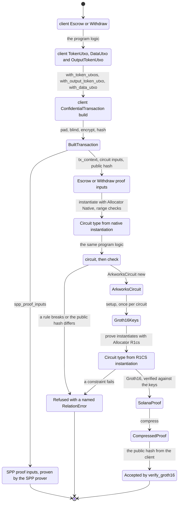

# Timelock escrow on arkworks

The timelock escrow circuits written in Rust with arkworks 0.5 R1CS, implementing
[`spec.md`](spec.md). The program does not change and still verifies its gnark keys. The tests
here build every instruction through the client, prove it with the Rust circuit, and check the
proof with the program's own `verify_groth16`. They also produce the SPP proof inputs for the
same transaction, but they do not prove them.

The circuits assume the protocol change described in [`spec.md`](spec.md#protocol-assumption):
`private_tx_hash` no longer includes `external_data_hash`.

- [`circuit-lib/`](circuit-lib) (crate `circuit-lib`) holds everything that is not specific to
  the escrow, and its `client` counterpart.
- [`src/`](src) (crate `timelock-escrow-arkworks`) holds the escrow: its state, its two circuits,
  and their `client` counterparts.

## Abstractions

### circuit-lib

**Values**

| Name | What it is good for |
| --- | --- |
| `Field` | The BN254 scalar field that every UTXO hash and public input lives in. |
| `CircuitVar` | The one value type inside a circuit: a constant in the native run, a variable in R1CS. |
| `CircuitSystem` | The constraint system an `Allocator` allocates into. |
| `constant`, `zero` | Lift a number into a `CircuitVar` constant. |
| `value` | Read the concrete value of a `CircuitVar`. |
| `rand` | The RNG `setup` and `prove` take, re-exported so a program needs no arkworks dependency. |

**Proof inputs**

| Name | What it is good for |
| --- | --- |
| `ProofInput` | Turns a proof input into its `Circuit` type. Every proof input and state implements it. |
| `Allocator` | Chooses the run: `Native` keeps constants, `R1cs` allocates variables. |
| `RangeCheck` | The check instantiation runs on an input type. It is a no-op for a plain `CircuitVar`. |
| `Uint<BITS>`, `U64`, `U32`, `U16` | Integer inputs, range-checked to `BITS` bits when instantiated. |
| `Bool` | A 0-or-1 input. |
| `PublicHash` | The circuit's one public input; it instantiates as the proof's instance variable. |
| `Assert` | Named rules on `CircuitVar`: `assert_equal`, `assert_not_equal`, `check_bits`, `check_is_bool`. |

**Hashing**

| Name | What it is good for |
| --- | --- |
| `poseidon` | The circom Poseidon zolana hashes with natively, built from light-poseidon's parameters. |
| `hash_chain4` | The four-ary hash chain the SPP folds input and output hash lists with. |

**UTXOs**

| Name | What it is good for |
| --- | --- |
| `Utxo` | The preimage of a spent UTXO, as the SDK's `ProofInputUtxo` holds it. `Utxo::dummy()` pads a `TokenUtxo`. |
| `DataHash` | The hash of a program state: Poseidon over its fields, each contributing its own `hash`. |
| `DataUtxo<S>` | The `LightAccount` counterpart: a UTXO with state `S`, from `new_init`, `from_output_utxo`, `new_mut` or `new_burn`. A burned one can `transfer` its value. |
| `TokenUtxo<N>` | `N` plain UTXOs of one owner and asset (dummies after the first), with `transfer`, `deposit` and `withdraw`. The change follows from its lifecycle: `new_init`, `new_mut`, `new_burn`. |
| `OutputTokenUtxo` | The output a transfer creates for its recipient, or the value of a new data UTXO. |

**Transaction and circuit**

| Name | What it is good for |
| --- | --- |
| `TxContext` | The transaction values the circuit cannot compute: first nullifier, blinding seed, output tree. |
| `PublicInputs` | Hashes a circuit's public fields and then `private_tx_hash` into the public hash. |
| `ConfidentialTransaction<IN, OUT>` | The SPP transaction's slots, filled in call order by `with_token_utxos`, `with_output_token_utxo` and `with_data_utxo`. `check` blinds and hashes the outputs, computes `private_tx_hash` and returns the public hash. |
| `Circuit` | The `circuit` method of a `Circuit` type, and its `public_hash`. |
| `ArkworksCircuit<P>` | Runs a proof input natively (`new` checks the public hash), in R1CS (`check_constraints`), and proves it (`setup`, `prove`). |

**Proving**

| Name | What it is good for |
| --- | --- |
| `Groth16Keys` | A proving key and its `SolanaVerifyingKey` from a circuit-specific setup. |
| `SolanaVerifyingKey` | The verifying key in the groth16-solana layout. `groth16_verifyingkey` is what `verify_groth16` takes. |
| `SolanaProof` | A proof in the groth16-solana layout (uncompressed, A negated). `prove` already verifies it against its keys. |
| `CompressedProof` | The 128-byte proof an instruction carries. |
| `RelationError` | Names the broken rule, the misused slot, the value out of range or the unsatisfied constraint. |
| `convert` | SDK bytes to circuit values (`field`, `var`, `utxo`, `tx_context`) and back (`field_bytes`, `to_bytes`). |

**Client** (`circuit_lib::client`, the same names with real Rust types)

| Name | What it is good for |
| --- | --- |
| `client::State` | A client state: `circuit_state` gives the circuit state, so the data hash is never written by hand, and `utxo_data` gives the bytes the next spender decodes. |
| `client::TokenUtxo<N>` | Spends `SppProofInputUtxo`s of one owner with checked arithmetic and produces the circuit's `Utxo` inputs. |
| `client::DataUtxo<S>` | The client side of a data UTXO, with the same lifecycles. |
| `client::OutputTokenUtxo` | A transfer's output to a `ShieldedAddress`. |
| `client::TxContext` | The transaction values as bytes. `circuit` converts them. |
| `client::PublicInputs` | The public hash over bytes, the same formula as the circuit's. |
| `client::ConfidentialTransaction<IN, OUT>` | The same builder. `build` pads the slots, derives the blindings, encrypts the outputs and produces the SPP proof inputs. |
| `client::BuiltTransaction` | `SppProofInputs`, `tx_context`, the slot hashes, `private_tx_hash` and the public hash. |

### The timelock escrow (`src/`)

| Name | What it is good for |
| --- | --- |
| `EscrowTerms` | The escrow UTXO's state: its creator and its unlock time. |
| `Escrow`, `EscrowCircuit` | Spends the creator's token UTXOs, locks `amount` in a new escrow data UTXO for the escrow authority, and returns the change. Public hash: `Poseidon(escrow_owner_hash, private_tx_hash)`. |
| `Withdraw`, `WithdrawCircuit` | Burns the escrow UTXO and transfers its whole amount to the creator, whose identity the signer proves. Public hash: `Poseidon(unlock, owner_identity, private_tx_hash)`. |
| `client::Escrow`, `client::Withdraw` | Build each instruction's proof inputs and SPP proof inputs from real values. |
| `client::escrow_input` | Turns the escrow output the escrow instruction created into the withdraw's input. |

## Flow



*Figure 1: One build feeds both proofs.*

The client runs the program logic with real types. `client::ConfidentialTransaction::build`
pads the slots, derives the blindings, encrypts the outputs, and returns a `BuiltTransaction`.
That result holds the SPP proof inputs and everything the circuit's proof inputs need.

`ArkworksCircuit::new` instantiates the proof inputs natively, which runs the range checks, then
runs `circuit` and compares its public hash with the client's. A broken rule stops here with a
named `RelationError`. `prove` instantiates the same proof inputs in R1CS, proves, and checks the
proof against its keys. The program's `verify_groth16` accepts the compressed proof for the
client's public hash.

```mermaid
stateDiagram-v2
    accTitle: The DataUtxo and TokenUtxo lifecycles
    accDescr: Both UTXO types start as Init, Mut or Burn. Init adds an output, Mut an input and an output, Burn an input. A burned data UTXO transfers its value; a token adds a change output unless it is burned.

    state "Init - no input, one output" as Init
    state "Mut - inputs in, the new state or change out" as Mut
    state "Burn - inputs in, no output of its own" as Burn
    state "Slots in the ConfidentialTransaction" as Slots

    [*] --> Init : new_init or from_output_utxo
    [*] --> Mut : new_mut
    [*] --> Burn : new_burn
    Init --> Slots : output
    Mut --> Slots : inputs and output
    Burn --> Slots : inputs, and a transfer as OutputTokenUtxo
    Slots --> [*]
```



*Figure 2: The lifecycles shared by `DataUtxo` and `TokenUtxo`, the counterparts of `LightAccount`.*

A UTXO starts in `Init`, `Mut` or `Burn`. `Init` adds only an output: the new state for a
`DataUtxo`, the change for a `TokenUtxo`. `Mut` adds its inputs and that output. `Burn` adds only
its inputs; a burned `DataUtxo` pays out its value with `transfer`.

## Running it

```bash
cargo test -p circuit-lib
cargo test -p timelock-escrow-arkworks
cargo run -p timelock-escrow-arkworks --example constraints
```

- `tests/proofs.rs` covers both instructions:
  - it builds each one through the client and proves it with the Rust circuit;
  - it verifies the proof with the program's `verify_groth16` and refuses a tampered public hash;
  - it checks that the SPP proof inputs hold the client's input and output hashes.
- `tests/rules.rs` checks every broken rule, both as a named error in the native run and as a
  refusal in R1CS. It also checks the client's own refusals.
- circuit-lib's tests cover each abstraction:
  - Poseidon and `hash_chain4` parity;
  - range checks;
  - the lifecycles;
  - the slot order of `private_tx_hash`;
  - the client-to-circuit drift;
  - a Groth16 round trip.

| Circuit | Constraints |
| --- | --- |
| escrow | 5,553 |
| withdraw | 3,389 |

The escrow spends two token inputs, and each `U64` input costs 65 constraints for its range check.

`setup` with an RNG is a single-party setup, suitable for tests only. A deployment would need its
own setup, its verifying key in the program, and the protocol change.
