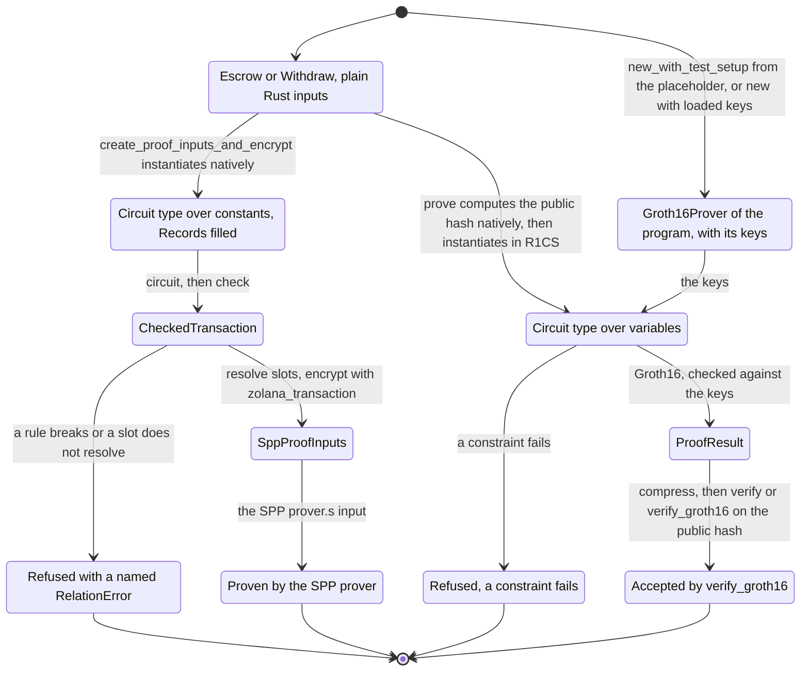
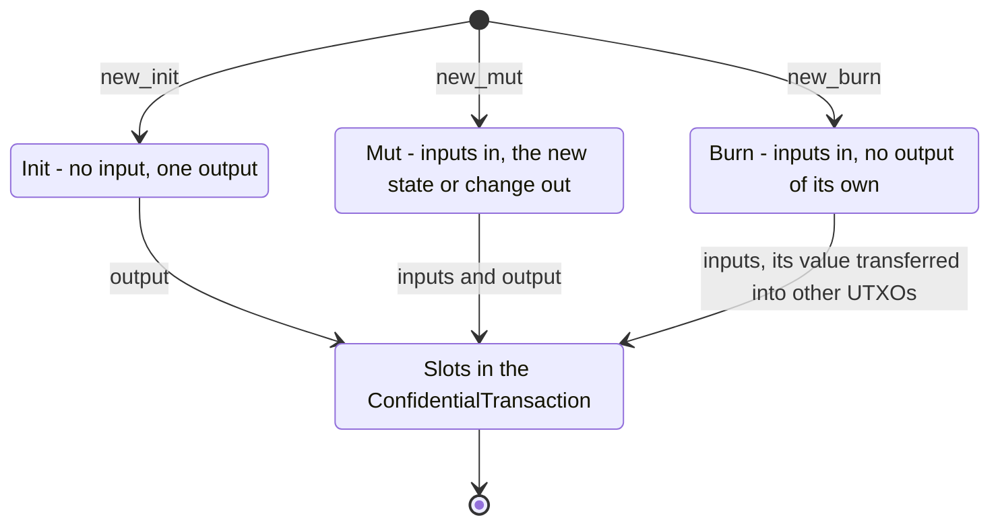

# Timelock escrow on arkworks

The timelock escrow circuits written in Rust with arkworks 0.5 R1CS, implementing
[`spec.md`](spec.md). One `circuit` fn per instruction runs twice:
- natively on the client, where it builds the output UTXOs and the SPP proof inputs;
- as R1CS in the prover, where it checks the constraints and the public hash.

The program does not change. The tests prove each instruction with the Rust circuit and check
the proof with the program's `verify_groth16`. They produce the SPP proof inputs for the same
transaction but do not prove them.

The circuits assume the protocol change in [`spec.md`](spec.md#protocol-assumption): a
`private_tx_hash` that skips padding and leaves out `external_data_hash`, so one logic proof
pairs with every SPP shape its real UTXOs fit.

- [`zk-program-sdk/`](zk-program-sdk) (crate `zk-program-sdk`) holds everything that is not
  specific to the escrow.
- [`src/`](src) (crate `timelock-escrow-arkworks`) holds the escrow. Its inputs are the crate's
  root types, and its state and two circuits are in the `circuit` module under the same names.

A Solana developer writes the plain input types first, and the client, the tests and the
prover all take them. `CircuitVar` appears only in the `circuit` modules.

## Layout

zk-program-sdk groups its modules by the phase that uses them:

| Module | Phase |
| --- | --- |
| `circuit/` | The DSL a `circuit` fn is written in: values, UTXO types, the transaction and the `Circuit` trait. |
| `conversion/` | Between client and circuit values: `ProofInput`, `FromCircuit`, `Allocator`, `Records`, and bytes to fields and back. |
| `client/` | The plain Rust side: `TxContext`, and with feature `client`, `ZkProgram`, the slot resolution and the hand-off to `zolana_transaction`. |
| `circuit_lib/` | The gadgets the DSL is built on: `poseidon`, `hash_bytes` and `nonzero_hash_chain`. |
| `prover/` | `Groth16Prover`, the Groth16 types, and the R1CS synthesis behind them. |

The phases have equivalent files. `utxo.rs` and `transaction.rs` hold one concept in
`circuit/`, `conversion/` and `client/`, and `var.rs` in `circuit/` and `conversion/`.

The public paths follow the same split. The crate root holds what the client and the prover
use, `zk_program_sdk::circuit` the DSL, and `zk_program_sdk::conversion` what lies between.
The example crate mirrors it: `escrow.rs`, `withdraw.rs` and `state.rs` at the root hold the
inputs, and the files of the same names in `circuit/` hold the circuits.

## Abstractions

### `zk_program_sdk`: client and prover

| Name | What it is good for |
| --- | --- |
| `TxContext` | The transaction settings: the blinding seed, from the OS RNG in `new`, and the output tree, `Some(0)` by default and the first spent input's `latest_tree_id` when `None`. The first nullifier comes from the first spent input and the sender from the keys. |
| `Owner` | An owner preimage: the tag (`S` for Ed25519 and PDA keys, `P` for P256), the key bytes and the nullifier key. From a `ShieldedAddress`, or a signing key and nullifier key. |
| `Bytes<N>` | A byte string the circuit sees byte by byte. |
| `ZkProgram` | Feature `client`. Implemented with an empty `impl` on inputs that implement `Placeholder`. Its `create_proof_inputs_and_encrypt` borrows the inputs, runs `circuit` natively, resolves the slots against the records, and encrypts through `zolana_transaction::ConfidentialTransaction` with the sender's `ShieldedKeys`. It picks the smallest SPP shape the real inputs and outputs fit and returns the `SppProofInputs`, after checking their `padding_independent_private_tx_hash` against the circuit's. `check_constraints` runs the circuit natively and in R1CS without proving. `export_r1cs` (feature `setup`) writes the circuit's constraints in the iden3 `.r1cs` format for a snarkjs ceremony, and `export_assignment` writes an input's full variable assignment as a snarkjs `.wtns` file. |
| `Groth16Prover<P>` | Feature `client`. The Groth16 keys of program `P`. `new_with_test_setup` (feature `setup`) sets them up from `P`'s placeholder with a fixed seed, and `new` takes loaded keys and refuses keys of another circuit. Setup and proving both use the snarkjs QAP reduction, so keys from the local setup and from a zkey have the same shape. `prove` borrows the inputs and returns a `ProofResult`; `verify` checks one in its compressed form, as a program does. |
| `ProofResult` | Feature `client`. A proof and the public hash it is valid for. |
| `SolanaProof`, `CompressedProof` | Feature `client`. A proof in the groth16-solana layout, from an arkworks `Proof`, and the 128-byte form an instruction contains, from `CompressedProof::try_from(&proof)`. `CompressedProof::verify` decompresses and verifies it. |
| `RelationError` | Names the broken rule, the misused slot, the value out of range or the failed resolution. |
| `ProvingKey`, `VerifyingKey`, `Proof` | Features `client` or `setup`. The arkworks Groth16 types over BN254, without the curve parameter. |

**Setup** (feature `setup`)

| Name | What it is good for |
| --- | --- |
| `Groth16Keys` | A proving key and its verifying key, from an arkworks `ProvingKey` or `Groth16Prover::keys`. `save` and `load` write and read the proving key. `load_zkey::<P>` (feature `client`) reads a snarkjs Groth16 zkey. It checks every point, refuses an identity in the verifying key and a zkey without a phase-2 contribution, and checks that the shape and the A and B rows match `P`'s circuit. `export_verifying_key` writes the program constant. |
| `VerifyingKeyExport` | Where `export_verifying_key` writes: the proving key to hash, the output file, the constant's name and the `SetupKind`. The file comes from groth16-solana's generator. Keys from the local setup are `InsecureTest`. A ceremony zkey is `Production`, and its digest is the zkey's sha256. |
| `SolanaVerifyingKey` | The verifying key in the groth16-solana layout, from an arkworks `VerifyingKey`. It converts into the `Groth16Verifyingkey` that `verify_groth16` takes. |

### `zk_program_sdk::circuit`: the DSL

**Values and hashing**

| Name | What it is good for |
| --- | --- |
| `Field` | The BN254 scalar field that UTXO hashes and the public hash live in. |
| `CircuitVar` | The value type inside `circuit`: a constant in the native run, a variable in R1CS. |
| `CircuitSystem`, `ConstraintSystem` | The constraint system R1CS instantiation allocates into. `ConstraintSystem::new_ref()` makes one. |
| `constant`, `zero`, `value` | Build a constant `CircuitVar`, or read a `CircuitVar`'s value. |
| `Assert` | Equality with a named rule on `CircuitVar`, `Bool`, `Bytes<N>`, `Asset`, `OwnerKey`, `Owner` and arrays: `assert_equal`, `assert_not_equal`, `assert_equal_if(condition)`, and `is_equal`, which returns a `Bool`. |
| `Bits` | `check_bits(bits)`, `check_is_bool`, and `to_bits_le::<N>()`, which returns the bits as `Bool`s. `from_bits_le` recomposes them. |
| `Compare` | `is_zero`, `assert_zero`, `assert_nonzero`; `is_less_than`, `is_less_or_equal`, `is_greater_than`, `is_greater_or_equal` and their `assert_*` forms over `bits`-wide unsigned integers; `assert_in_range(low, high)` (inclusive), `min`, `max`. The `is_*` forms range-check both operands; the asserts check the smaller operand and the gap, which is enough for the integer relation to hold. |
| `Arithmetic` | `checked_add`, `checked_sub` and `checked_mul` over `bits`-wide integers, refusing overflow and underflow; `div_rem` up to 126 bits; `inverse`, `div` and `pow` in the field, refusing a zero divisor. |
| `Bool` | A 0 or 1 value, from a `bool` input, `Bool::from_var` or a comparison: `select(if_true, if_false)` for any `Select` type, `not`, `and`, `or`, `xor`, `nand`, `implies`, `Bool::all`, `Bool::any`, `assert_true`, `assert_false`, `assert_true_if(condition)`, and `var` for hashing. A circuit needs no arkworks import to branch on one. |
| `Select` | Selection by a `Bool`, for `CircuitVar`, `Bool`, `Bytes<N>`, `Asset`, `OwnerKey`, `Owner` and arrays. `one_hot::<N>(index)` and `select_index(&items, index)` index an array by a variable and refuse an index outside it. |
| `is_in`, `assert_in` | Membership of a value in a set of `CircuitVar`s. |
| `poseidon` | The circom Poseidon that zolana hashes with natively, built from light-poseidon's parameters. |
| `nonzero_hash_chain` | The chain `private_tx_hash` folds input and output hashes with. It skips zeros, so dummies do not enter it. |
| `hash_bytes` | The zolana `hash_bytes` over byte variables: 31-byte big-endian chunks folded with Poseidon. |
| `Bytes<N>` | `N` byte variables, each range-checked to 8 bits when allocated. `Bytes::from_var` splits a variable into big-endian bytes and `to_var` packs them back, for `N` up to 31. |

**UTXOs**

| Name | What it is good for |
| --- | --- |
| `Asset` | A mint as bytes. `hash()` is the asset hash; `Asset::sol()` and `Asset::constant(&mint)` are constants. |
| `OwnerKey` | The tag and key bytes. `identity()` is `hash_bytes(tag \|\| key)`, the value the program sees as `owner_identity`. |
| `Owner` | An `OwnerKey` and the nullifier key. `hash()` is the owner hash. Owners compare by their packed preimage. |
| `Utxo` | The circuit form of a spent UTXO, with its `Owner` and `Asset`. `Utxo::dummy()` pads a `TokenUtxo`. |
| `DataHash` | The hash of a state: Poseidon over its fields, each contributing its own `hash`. |
| `UtxoData` | Names a state's client form. The borsh bytes of that form are the data a new data UTXO contains. |
| `DataUtxo<S>` | The `LightAccount` counterpart: a UTXO with state `S`, from `new_init(owner, asset)`, `new_mut` or `new_burn`. It moves value through `Balance` like a token UTXO; what is left is its output, or must be zero once burned. |
| `TokenUtxo` | Plain UTXOs of one owner and asset: none from `new_init(owner, asset)`, or `N` from `new_mut` or `new_burn`, with dummies after the first. It moves value through `Balance`, and its lifecycle decides whether what is left becomes an output. |
| `Balance` | The value operations both UTXO types share: `owner`, `asset`, `balance`, `transfer` and `transfer_all` into a destination UTXO of either type, `deposit`, `withdraw` and `withdraw_all`. A transfer refuses a burned destination and constrains the destination to hold the source's asset, at no cost when the destination was built from the source's `asset()`. `transfer` checks that its amount fits in 64 bits, and `transfer` and `withdraw` that what remains does: a named error natively, a range check in R1CS. A public transfer of zero is refused. They are default methods over a crate-private `Ledger`. |

**Transaction and circuit**

| Name | What it is good for |
| --- | --- |
| `TxContext` | The transaction settings as `CircuitVar`s. `check` derives the output blindings and `private_tx_blinding` from them and the first spent input's nullifier, and selects the output tree. |
| `PublicInputs` | Hashes a circuit's public fields, then `private_tx_hash`, into the public hash. |
| `ConfidentialTransaction<P>` | The transaction's inputs and outputs, in call order of `with_token_utxos` and `with_data_utxo`, with no SPP shape. `check` refuses value that a transfer moved into or out of a UTXO the transaction does not contain, blinds and hashes the outputs, and computes `private_tx_hash` and the public hash. |
| `CheckedTransaction` | What `check` returns: the public hash, `private_tx_hash` and the slots. |
| `Circuit` | The `circuit` method of a circuit type. |

### `zk_program_sdk::conversion`: between the two

Everything a future macro derives goes through these, and each can be written by hand.

| Name | What it is good for |
| --- | --- |
| `ProofInput` | Turns a client value into its circuit type. Plain Rust types implement it: `u64`, `u32`, `u16`, `bool`, `[u8; 32]`, `Bytes<N>`, `Owner`, `ShieldedAddress`, `Mint`, `WalletUtxo`, and arrays. |
| `FromCircuit` | The way back in the native run, with the same range checks: `u64`, `u32`, `u16`, `bool`, `[u8; 32]`, `Bytes<N>`, `Owner`, arrays, and a state's client form. |
| `Placeholder` | A value of the type that instantiates, so setup synthesizes the circuit from the type alone. The SDK types above implement it; a program implements it field by field. |
| `Allocator` | Chooses the run. `Native` keeps constants and fills `Records`, and `R1cs` allocates variables. |
| `Records` | What a `CircuitVar` cannot hold, keyed by hash: addresses, `Mint`s and spent UTXOs. |
| `field`, `var`, `field_bytes`, `to_bytes` | SDK bytes to circuit values and back. |

### The timelock escrow (`src/`)

| Name | What it is good for |
| --- | --- |
| `Escrow`, `Withdraw` | Each instruction's inputs as plain Rust types, with `ZkProgram` implemented. |
| `EscrowTerms` | The escrow UTXO's state: the creator as an `Owner`, and the unlock time. Its borsh bytes are the escrow UTXO's data. |
| `escrow_input` | Turns the escrow output the escrow instruction created into the withdraw's input. |
| `circuit::Escrow` | Spends the creator's token UTXOs, locks `amount` in a new escrow data UTXO for the escrow authority, and returns the change. Public hash: `Poseidon(escrow_owner, private_tx_hash)`. |
| `circuit::Withdraw` | Burns the escrow UTXO and transfers its amount to the creator, whose key identity must equal the signer's `owner_identity`. Public hash: `Poseidon(unlock, owner_identity, private_tx_hash)`. |
| `circuit::EscrowTerms` | The state in the circuit, with `DataHash` and `UtxoData`. |

## Flow



*Figure 1: One set of inputs feeds both proofs.*

`create_proof_inputs_and_encrypt` instantiates the inputs natively, which runs the range
checks and fills the records. It then runs `circuit`, resolves each slot of the
`CheckedTransaction` against the records and converts the amounts. `zolana_transaction`'s
`ConfidentialTransaction` then pads to the smallest SPP shape that fits and encrypts the
outputs, and the result's `padding_independent_private_tx_hash` must equal the circuit's. A broken rule or a slot
without a record stops it with a named `RelationError`.

The same inputs go to a `Groth16Prover` of the program. Its keys come from
`new_with_test_setup`, which synthesizes the circuit from the program's `Placeholder`, or from
`new` with loaded keys. `prove` computes the public hash natively, instantiates the inputs in
R1CS, proves, and checks the proof against the keys. `verify` and the program's
`verify_groth16` accept the compressed proof for that public hash.



*Figure 2: The lifecycles shared by `DataUtxo` and `TokenUtxo`, the counterparts of `LightAccount`.*

A UTXO starts in `Init`, `Mut` or `Burn`. `Init` adds only an output: the new state for a
`DataUtxo`, the value transferred into it for a `TokenUtxo`. `Mut` adds its inputs and that
output, the change for a `TokenUtxo`. `Burn` adds only its inputs, and its transfers must move
out its whole value. Every UTXO but a burned one can receive a transfer: an `Init` UTXO holds
the asset it was built with, the others their inputs' asset.

## Running it

```bash
cargo test -p zk-program-sdk
cargo test -p timelock-escrow-arkworks
cargo run -p timelock-escrow-arkworks --example constraints
cargo run -p timelock-escrow-arkworks --example export_r1cs -- <dir>
just test-arkworks-snarkjs
```

- `tests/functional.rs` runs the escrow, then withdraws the escrow UTXO it created, with the
  terms read back from the UTXO data. Each instruction is proven and accepted by
  `verify_groth16`, with nothing tampered.
- `tests/proofs.rs` builds each instruction's inputs inline, creates the SPP transaction, and
  proves with the Rust circuit. It checks:
  - the public hash recomputed from the SPP side;
  - `verify_groth16`;
  - the SPP outputs.
- `tests/rules.rs` checks every broken rule and every resolution failure, natively and in R1CS.
- `tests/r1cs.rs` decodes the exported `.r1cs` and `.wtns` files, checks their headers and
  that the assignment satisfies every constraint, and pins each r1cs's sha256. A change to a
  circuit, a gadget or arkworks changes the digest and invalidates any zkey made from it.
- `tests/snarkjs.rs` (feature `snarkjs`, needs `snarkjs` on PATH) runs a throwaway ceremony
  on both circuits: a power-14 ptau, `groth16 setup`, one contribution, a beacon and
  `zkey verify`. The ptau and zkeys are cached under `target/tmp/snarkjs`. It then checks:
  - a Rust proof from the zkey, verified by groth16-solana and by `snarkjs groth16 verify`;
  - `snarkjs wtns check` on the Rust assignment, and a snarkjs proof from it verified in Rust;
  - a proof with arkworks' default `LibsnarkReduction` is rejected under the zkey;
  - `load_zkey` refuses another circuit's zkey, a zkey without a contribution, an identity
    `delta`, a point off the curve, a G2 point outside the subgroup, a changed coefficient
    and a truncated file;
  - the final zkey exports as `Production`, with the zkey's sha256 as its digest.
- zk-program-sdk's tests cover:
  - Poseidon and `nonzero_hash_chain` parity;
  - the plain input types, the records and `FromCircuit`;
  - the lifecycles and the slot order;
  - the transfer rules and the conservation check, natively and in R1CS;
  - `ZkProgram` resolution, dropped dummies, empty output padding, owner tags and errors;
  - Groth16, and saving, loading and exporting keys.

| Circuit | Constraints |
| --- | --- |
| escrow | 13,838 |
| withdraw | 5,786 |

`setup` with an RNG is a single-party setup, suitable for tests only. A deployment needs a
ceremony, the exported verifying key in the program, and the protocol change. The ceremony
runs on snarkjs over a published, phase-2-prepared ptau:

```bash
cargo run -p timelock-escrow-arkworks --example export_r1cs -- keys
snarkjs groth16 setup keys/escrow.r1cs powersOfTau28_hez_final_14.ptau keys/escrow_0000.zkey
snarkjs zkey contribute keys/escrow_0000.zkey keys/escrow_0001.zkey --name="contributor 1"
snarkjs zkey beacon keys/escrow_0001.zkey keys/escrow_final.zkey <beacon hex> 10 -n="final beacon"
snarkjs zkey verify keys/escrow.r1cs powersOfTau28_hez_final_14.ptau keys/escrow_final.zkey
```

`Groth16Keys::load_zkey::<Escrow>` then loads `escrow_final.zkey`, and `export_verifying_key`
with `SetupKind::Production` writes the program constant. The circuit is frozen from the
`groth16 setup` on.
