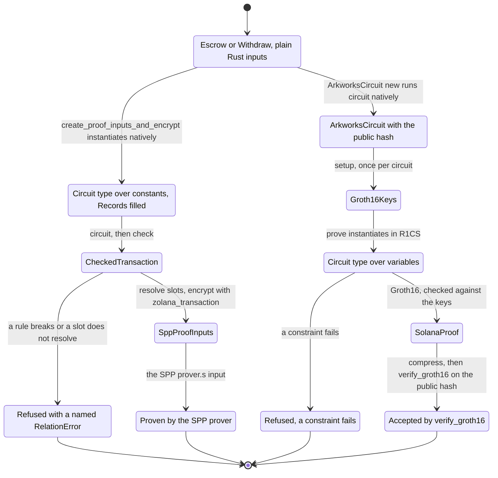

# Timelock escrow on arkworks

The timelock escrow circuits written in Rust with arkworks 0.5 R1CS, implementing
[`spec.md`](spec.md). One `circuit` fn per instruction runs twice:
- natively on the client, where it builds the output UTXOs and the SPP proof inputs;
- as R1CS in the prover, where it checks the constraints and the public hash.

The program does not change. The tests prove each instruction with the Rust circuit and check
the proof with the program's `verify_groth16`. They produce the SPP proof inputs for the same
transaction but do not prove them.

The circuits assume the protocol change in [`spec.md`](spec.md#protocol-assumption):
`private_tx_hash` without `external_data_hash`.

- [`zk-program-sdk/`](zk-program-sdk) (crate `zk-program-sdk`) holds everything that is not
  specific to the escrow.
- [`src/`](src) (crate `timelock-escrow-arkworks`) holds the escrow. Its inputs are the crate's
  root types, and its state and two circuits are in the `circuit` module under the same names.

A Solana developer writes the plain input types first, and the client, the tests and the
prover all take them. `CircuitVar` appears only in the `circuit` modules.

## Layout

zk-program-sdk groups its modules by the phase that uses them:

| Module | Phase |
| --- | --- |
| `circuit/` | The DSL a `circuit` fn is written in: values, UTXO types, the transaction and the `Circuit` trait. |
| `conversion/` | Between client and circuit values: `ProofInput`, `FromCircuit`, `Allocator`, `Records`, and bytes to fields and back. |
| `client/` | The plain Rust side: `TxContext`, and with feature `client`, `ZkProgram`, the slot resolution and the hand-off to `zolana_transaction`. |
| `circuit_lib/` | The gadgets the DSL is built on: `poseidon` and `hash_chain4`. |
| `prover/` | `ArkworksCircuit` and Groth16. |

The phases have equivalent files. `utxo.rs` and `transaction.rs` hold one concept in
`circuit/`, `conversion/` and `client/`, and `var.rs` in `circuit/` and `conversion/`.

The public paths follow the same split. The crate root holds what the client and the prover
use, `zk_program_sdk::circuit` the DSL, and `zk_program_sdk::conversion` what lies between.
The example crate mirrors it: `escrow.rs`, `withdraw.rs` and `state.rs` at the root hold the
inputs, and the files of the same names in `circuit/` hold the circuits.

## Abstractions

### `zk_program_sdk`: client and prover

| Name | What it is good for |
| --- | --- |
| `TxContext` | The transaction values as bytes: first nullifier, blinding seed, output tree and sender. `new` picks the seed. |
| `ZkProgram` | Feature `client`. Implemented with an empty `impl`. Its `create_proof_inputs_and_encrypt` runs `circuit` natively, resolves the slots against the records, and encrypts through `zolana_transaction::ConfidentialTransaction` with the sender's `ShieldedKeys`. It returns the inputs with the `SppProofInputs`, after checking their `private_tx_hash_without_external_data` against the circuit's. |
| `ArkworksCircuit<P>` | Computes the public hash natively (`new`), checks the R1CS (`check_constraints`), and proves (`setup`, `prove`). |
| `SolanaProof`, `CompressedProof` | Feature `client`. A proof in the groth16-solana layout, from an arkworks `Proof`, and the 128-byte form an instruction contains, from `CompressedProof::try_from(&proof)`. |
| `RelationError` | Names the broken rule, the misused slot, the value out of range or the failed resolution. |
| `ProvingKey`, `VerifyingKey`, `Proof` | Features `client` or `setup`. The arkworks Groth16 types over BN254, without the curve parameter. |
| `rand` | The RNG `setup` and `prove` take, re-exported so a program needs no arkworks dependency. |

**Setup** (feature `setup`)

| Name | What it is good for |
| --- | --- |
| `Groth16Keys` | A proving key and its verifying key, from an arkworks `ProvingKey`. `save` and `load` write and read the proving key. `export_verifying_key` writes the program constant. |
| `VerifyingKeyExport` | Where `export_verifying_key` writes: the proving key to hash, the output file and the constant's name. The file comes from groth16-solana's generator and is marked `InsecureTest`. |
| `SolanaVerifyingKey` | The verifying key in the groth16-solana layout, from an arkworks `VerifyingKey`. It converts into the `Groth16Verifyingkey` that `verify_groth16` takes. |

### `zk_program_sdk::circuit`: the DSL

**Values and hashing**

| Name | What it is good for |
| --- | --- |
| `Field` | The BN254 scalar field that UTXO hashes and the public hash live in. |
| `CircuitVar` | The value type inside `circuit`: a constant in the native run, a variable in R1CS. |
| `CircuitSystem`, `ConstraintSystem` | The constraint system R1CS instantiation allocates into. `ConstraintSystem::new_ref()` makes one. |
| `constant`, `zero`, `value` | Build a constant `CircuitVar`, or read a `CircuitVar`'s value. |
| `Assert` | Named rules on `CircuitVar`: `assert_equal`, `assert_not_equal`, `check_bits`, `check_is_bool`. |
| `poseidon` | The circom Poseidon that zolana hashes with natively, built from light-poseidon's parameters. |
| `hash_chain4` | The four-ary hash chain the SPP folds input and output hash lists with. |

**UTXOs**

| Name | What it is good for |
| --- | --- |
| `Utxo` | The circuit form of a spent UTXO. `Utxo::dummy()` pads a `TokenUtxo`. |
| `DataHash` | The hash of a state: Poseidon over its fields, each contributing its own `hash`. |
| `UtxoData` | Names a state's client form. The borsh bytes of that form are the data a new data UTXO contains. |
| `DataUtxo<S>` | The `LightAccount` counterpart: a UTXO with state `S`, from `new_init`, `from_output_utxo`, `new_mut` or `new_burn`. A burned one pays out its value with `transfer`. |
| `TokenUtxo<N>` | `N` plain UTXOs of one owner and asset, with dummies after the first. It has `transfer`, `deposit` and `withdraw`, and its lifecycle (`new_init`, `new_mut`, `new_burn`) decides the change. |
| `OutputTokenUtxo` | The output a transfer creates, or the value of a new data UTXO. |

**Transaction and circuit**

| Name | What it is good for |
| --- | --- |
| `TxContext` | The transaction values as `CircuitVar`s. `check` fills unused output slots with zero-SOL outputs to its `sender`. |
| `PublicInputs` | Hashes a circuit's public fields, then `private_tx_hash`, into the public hash. |
| `ConfidentialTransaction<P, IN, OUT>` | The SPP transaction's slots, filled in call order by `with_token_utxos`, `with_output_token_utxo` and `with_data_utxo`. `check` blinds and hashes the outputs and computes `private_tx_hash` and the public hash. |
| `CheckedTransaction` | What `check` returns: the public hash, `private_tx_hash` and the slots. |
| `Circuit` | The `circuit` method of a circuit type. |

### `zk_program_sdk::conversion`: between the two

Everything a future macro derives goes through these, and each can be written by hand.

| Name | What it is good for |
| --- | --- |
| `ProofInput` | Turns a client value into its circuit type. Plain Rust types implement it: `u64`, `u32`, `u16`, `bool`, `[u8; 32]`, `ShieldedAddress`, `Mint`, `WalletUtxo`, and arrays. |
| `FromCircuit` | The way back in the native run, with the same range checks: `u64`, `u32`, `u16`, `bool`, `[u8; 32]`, arrays, and a state's client form. |
| `Allocator` | Chooses the run. `Native` keeps constants and fills `Records`, and `R1cs` allocates variables. |
| `Records` | What a `CircuitVar` cannot hold, keyed by hash: addresses, `Mint`s and spent UTXOs. |
| `field`, `var`, `field_bytes`, `to_bytes` | SDK bytes to circuit values and back. |
| `Utxo::try_from(&ProofInputUtxo)` | The circuit form of the SPP prover's UTXO fields. A `WalletUtxo` goes through it when instantiated. |

### The timelock escrow (`src/`)

| Name | What it is good for |
| --- | --- |
| `Escrow`, `Withdraw` | Each instruction's inputs as plain Rust types, with `ZkProgram` implemented. |
| `EscrowTerms` | The escrow UTXO's state (creator, unlock). Its borsh bytes are the escrow UTXO's data. |
| `escrow_input` | Turns the escrow output the escrow instruction created into the withdraw's input. |
| `circuit::Escrow` | Spends the creator's token UTXOs, locks `amount` in a new escrow data UTXO for the escrow authority, and returns the change. Public hash: `Poseidon(escrow_owner, private_tx_hash)`. |
| `circuit::Withdraw` | Burns the escrow UTXO and transfers its amount to the creator, whose identity the signer proves. Public hash: `Poseidon(unlock, owner_identity, private_tx_hash)`. |
| `circuit::EscrowTerms` | The state in the circuit, with `DataHash` and `UtxoData`. |

## Flow



*Figure 1: One set of inputs feeds both proofs.*

`create_proof_inputs_and_encrypt` instantiates the inputs natively, which runs the range
checks and fills the records. It then runs `circuit`, resolves each slot of the
`CheckedTransaction` against the records and converts the amounts. `zolana_transaction`'s
`ConfidentialTransaction` then encrypts the outputs, and the result's
`private_tx_hash_without_external_data` must equal the circuit's. A broken rule or a slot
without a record stops it with a named `RelationError`.

The same inputs go to `ArkworksCircuit`. `new` computes the public hash natively. `prove`
instantiates the inputs in R1CS, proves, and checks the proof against its keys. The program's
`verify_groth16` accepts the compressed proof for that public hash.



```mermaid
stateDiagram-v2
    accTitle: The DataUtxo and TokenUtxo lifecycles
    accDescr: Both UTXO types start as Init, Mut or Burn. Init adds an output, Mut an input and an output, Burn an input. A burned data UTXO transfers its value; a token adds a change output unless it is burned.

    state "Init - no input, one output" as Init
    state "Mut - inputs in, the new state or change out" as Mut
    state "Burn - inputs in, no output of its own" as Burn
    state "Slots in the ConfidentialTransaction" as Slots

    [*] --> Init : new_init or from_output_utxo
    [*] --> Mut : new_mut
    [*] --> Burn : new_burn
    Init --> Slots : output
    Mut --> Slots : inputs and output
    Burn --> Slots : inputs, and a transfer as OutputTokenUtxo
    Slots --> [*]
```

*Figure 2: The lifecycles shared by `DataUtxo` and `TokenUtxo`, the counterparts of `LightAccount`.*

A UTXO starts in `Init`, `Mut` or `Burn`. `Init` adds only an output: the new state for a
`DataUtxo`, the change for a `TokenUtxo`. `Mut` adds its inputs and that output. `Burn` adds only
its inputs, and its transfers must pay out its whole value.

## Running it

```bash
cargo test -p zk-program-sdk
cargo test -p timelock-escrow-arkworks
cargo run -p timelock-escrow-arkworks --example constraints
```

- `tests/functional.rs` runs the escrow, then withdraws the escrow UTXO it created, with the
  terms read back from the UTXO data. Each instruction is proven and accepted by
  `verify_groth16`, with nothing tampered.
- `tests/proofs.rs` builds each instruction's inputs inline, creates the SPP transaction, and
  proves with the Rust circuit. It checks:
  - the public hash recomputed from the SPP side;
  - `verify_groth16`;
  - the SPP outputs.
- `tests/rules.rs` checks every broken rule and every resolution failure, natively and in R1CS.
- zk-program-sdk's tests cover:
  - Poseidon and `hash_chain4` parity;
  - the plain input types, the records and `FromCircuit`;
  - the lifecycles and the slot order;
  - `ZkProgram` resolution, dummies, padding to the sender, owner tags and errors;
  - Groth16, and saving, loading and exporting keys.

| Circuit | Constraints |
| --- | --- |
| escrow | 5,570 |
| withdraw | 3,471 |

`setup` with an RNG is a single-party setup, suitable for tests only. A deployment needs its own
setup, the exported verifying key in the program, and the protocol change.
