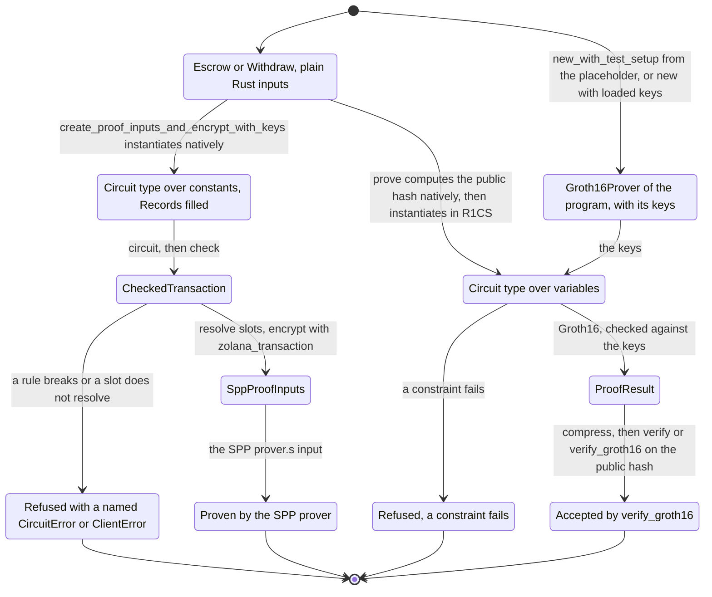
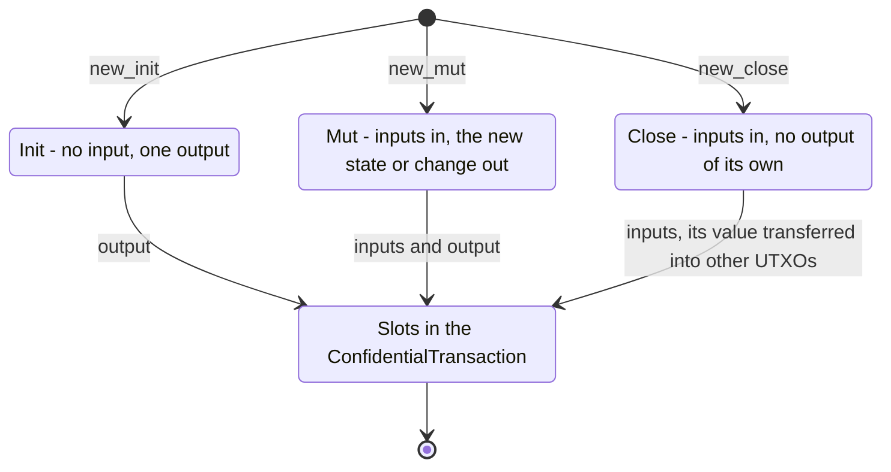

# Timelock escrow on arkworks

The timelock escrow circuits written in Rust with arkworks 0.5 R1CS, implementing
[`spec.md`](spec.md). One `circuit` fn per instruction runs twice:
- natively on the client, where it builds the output UTXOs and the SPP proof inputs;
- as R1CS in the prover, where it checks the constraints and the public hash.

The program does not change. The tests prove each instruction with the Rust circuit and check
the proof with the program's `verify_groth16`. They produce the SPP proof inputs for the same
transaction but do not prove them.

The circuits assume the protocol change in [`spec.md`](spec.md#protocol-assumption): a
`private_tx_hash` that skips padding and leaves out `external_data_hash`, so one logic proof
pairs with every SPP shape its real UTXOs fit.

- [`zk-program-sdk/`](zk-program-sdk) (crate `zk-program-sdk`) holds everything that is not
  specific to the escrow.
- [`src/`](src) (crate `timelock-escrow-arkworks`) holds the escrow. Its inputs are the crate's
  root types, and its state and two circuits are in the `circuit` module under the same names.

A Solana developer writes the plain input types first, and the client, the tests and the
prover all take them. `CircuitVar` appears only in the `circuit` modules.

## Layout

zk-program-sdk groups its modules by the phase that uses them:

| Module | Phase |
| --- | --- |
| `circuit/` | The DSL a `circuit` fn is written in: values, UTXO types, the transaction and the `Circuit` trait. |
| `conversion/` | Between client and circuit values: `ProofInput`, `FromCircuit`, `Allocator`, `Records`, and bytes to fields and back. |
| `client/` | The plain Rust side: `TxContext`, and with feature `client`, `ZkProgram`, the slot resolution and the hand-off to `zolana_transaction`. |
| `circuit_lib/` | The gadgets the DSL is built on: `poseidon`, `hash_bytes` and `nonzero_hash_chain`. |
| `prover/` | `Groth16Prover`, the Groth16 types, and the R1CS synthesis behind them. |

The phases have equivalent files. `utxo.rs` and `transaction.rs` hold one concept in
`circuit/`, `conversion/` and `client/`, and `var.rs` in `circuit/` and `conversion/`.

The public paths follow the same split. The crate root holds what the client and the prover
use, `zk_program_sdk::circuit` the DSL, and `zk_program_sdk::conversion` what lies between.
The example crate mirrors it: `escrow.rs`, `withdraw.rs` and `state.rs` at the root hold the
inputs, and the files of the same names in `circuit/` hold the circuits.

## Abstractions

### `zk_program_sdk`: client and prover

| Name | What it is good for |
| --- | --- |
| `TxContext` | The transaction settings: the blinding seed, from the OS RNG in `new`, and the output tree, `Some(0)` by default and the first spent input's `latest_tree_id` when `None`. The first nullifier comes from the first spent input and the sender from the keys. |
| `Owner` | An owner preimage: the tag (`S` for Ed25519 and PDA keys, `P` for P256), the key bytes and the nullifier key. From a `ShieldedAddress`, or a signing key and nullifier key. |
| `Bytes<N>` | A byte string the circuit sees byte by byte. |
| `ZkProgram` | Feature `client`. Implemented with an empty `impl` on inputs that implement `Placeholder`. Its `create_proof_inputs_and_encrypt_with_keys` borrows the inputs, runs `circuit` natively, resolves the slots against the records, and encrypts through `zolana_transaction::ConfidentialTransaction` with the sender's `ShieldedKeys`. It picks the smallest SPP shape the real inputs and outputs fit and returns the `SppProofInputs`, after checking their `padding_independent_private_tx_hash` against the circuit's. `check_constraints` runs the circuit natively and in R1CS without proving, and also synthesizes the placeholder the keys come from: it names a value read of a variable, a shape that differs from the placeholder's and the first constraint that does, and an unsatisfied row by its rule and line. `export_r1cs` (feature `setup`) writes the circuit's constraints in the iden3 `.r1cs` format for a snarkjs ceremony, and `export_assignment` writes an input's full variable assignment as a snarkjs `.wtns` file. |
| `ZkCircuit` | Feature `client`. A circuit with no transaction and no public input, for testing a builtin on its own. Implemented for every input that implements `Placeholder` and whose circuit type implements `Constraints`. `check_constraints` runs the constraints natively and in R1CS and compares the proof's synthesis with the placeholder's, as `ZkProgram`'s does. `export_r1cs` (feature `setup`) and `export_assignment` write the iden3 `.r1cs` and `.wtns` files, with 0 public inputs. There is no Groth16 prover for one yet; snarkjs proves one from those files. |
| `Groth16Prover<P>` | Feature `client`. The Groth16 keys of program `P`. `new_with_test_setup` (feature `setup`) sets them up from `P`'s placeholder with a fixed seed, and `new` takes loaded keys and refuses keys of another circuit. Setup and proving both use the snarkjs QAP reduction, so keys from the local setup and from a zkey have the same shape. `prove` borrows the inputs and returns a `ProofResult`; `verify` checks one in its compressed form, as a program does. |
| `ProofResult` | Feature `client`. A proof and the public hash it is valid for. |
| `SolanaProof`, `CompressedProof` | Feature `client`. A proof in the groth16-solana layout, from an arkworks `Proof`, and the 128-byte form an instruction contains, from `CompressedProof::try_from(&proof)`. `CompressedProof::verify` decompresses and verifies it. |
| `CircuitError` | What circuit code returns: a broken rule, a value out of range, a wrong length or a bad owner or UTXO. `broken_rule()` names the rule and `location()` the `file:line:column` of the program's line that broke it. |
| `ClientError` | What building a transaction returns: a circuit error, a slot that does not resolve or a transaction the SPP builder refuses. |
| `ProverError` | What `check_constraints`, the keys and `Groth16Prover` return. A failing constraint carries its row, the rule of the check that made it and the circuit's `file:line`, which `location()` returns. |
| `SourceLocation`, `SlotKind` | The `file:line:column` of an error, and the kind of slot a slot error names. |
| `ProvingKey`, `VerifyingKey`, `Proof` | Features `client` or `setup`. The arkworks Groth16 types over BN254, without the curve parameter. |

**Setup** (feature `setup`)

| Name | What it is good for |
| --- | --- |
| `Groth16Keys` | A proving key and its verifying key, from an arkworks `ProvingKey` or `Groth16Prover::keys`. `save` and `load` write and read the proving key. `load_zkey::<P>` (feature `client`) reads a snarkjs Groth16 zkey. It checks every point, refuses an identity in the verifying key and a zkey without a phase-2 contribution, and checks that the shape and the A and B rows match `P`'s circuit. `export_verifying_key` writes the program constant. |
| `VerifyingKeyExport` | Where `export_verifying_key` writes: the proving key to hash, the output file, the constant's name and the `SetupKind`. The file comes from groth16-solana's generator. Keys from the local setup are `InsecureTest`. A ceremony zkey is `Production`, and its digest is the zkey's sha256. |
| `SolanaVerifyingKey` | The verifying key in the groth16-solana layout, from an arkworks `VerifyingKey`. It converts into the `Groth16Verifyingkey` that `verify_groth16` takes. |

### `zk_program_sdk::circuit`: the DSL

**Values and hashing**

| Name | What it is good for |
| --- | --- |
| `Field` | A native element of the BN254 scalar field that UTXO hashes and the public hash live in. It is a newtype over arkworks' `Fr`, with `From` for `u8` to `u128`, `bool` and `Fr`, `Fr::from(field)` back, and `+`, `-`, `*` and negation on native values. `is_zero`, `inverse`, `sqrt`, `pow` and `u64::try_from` / `u128::try_from` are available when preparing input values. |
| `CircuitVar` | The value type inside `circuit`: a field element, a constant in the native run and a variable in R1CS. `+`, `-`, `*`, unary `-`, `+=`, `-=` and `*=` are field arithmetic that wraps around the modulus: a sum and a product by a constant are free, and a product of two variables costs one constraint. `inverse`, `div` and `pow` (by a constant exponent) are methods in the field; `inverse` and `div` refuse a zero divisor. `/`, `%`, `==` and `<` do not compile: the `/` and `%` errors point to `Uint::div_rem` and `CircuitVar::div`, and the `==` and `<` errors name the rules `UseAssertEqual` and `UseUintComparison`, for `assert_equal` or `is_equal` and the `Uint` comparisons. `CircuitVar::from` takes a `Bool` or a `Uint<BITS>`, and `Bool::try_from(&var)` and `Uint::try_from(&var)` check one back. `assert_product(other, product, rule)` constrains `self * other = product` in one row. |
| `CircuitSystem`, `ConstraintSystem` | The constraint system R1CS instantiation allocates into. `ConstraintSystem::new_ref()` makes one. |
| `constant`, `zero`, `value` | Build a constant `CircuitVar`, or read a constant's value. Native execution represents proof inputs as constants, so `value` can read them. In R1CS, proof inputs are variables: reading one fails with `ReadsVariableValue` at the read's source location during setup or proving. A successful native run alone does not establish that a circuit can be proved; use `check_constraints`. |
| `Assert` | Equality with a named rule on `CircuitVar`, `Uint<BITS>`, `Bool`, `Bytes<N>`, `Asset`, `OwnerKey`, `Owner` and arrays: `assert_equal`, `assert_not_equal`, `assert_equal_if(condition)`, and `is_equal`, which returns a `Bool`. A zero check on a `CircuitVar` compares it with `zero()`: `is_equal(&zero())`, `assert_equal(&zero(), rule)` or `assert_not_equal(&zero(), rule)`. |
| `Uint<BITS>` | A value below `2^BITS`, 1 to 253 bits, with the aliases `U8`, `U16`, `U32`, `U64` and `U128`. `add`, `mul` and `sum` return a wider type at no cost. `From` widens between the aliases and turns a `Bool` into a `Uint`; `TryFrom` narrows between the aliases and range-checks a `CircuitVar` into a `Uint`. `checked_add`, `checked_mul`, `checked_sub`, the `assert_less_*` comparisons, `assert_in_range(low, high)` (inclusive), `assert_equal`, `assert_not_zero` and `div_rem` check a named rule; the `is_less_*` comparisons return a `Bool`, and `min` and `max` select by one. Range checks and comparisons decompose through arkworks' `to_bits_le_with_top_bits_zero`; ordering works on at most 252 bits, so a difference cannot wrap around the field. Widths are checked when the circuit is built: a sum or product that could wrap does not compile. |
| `Bits` | `check_bits(bits)`, `check_is_bool`, and `to_bits_le::<N>()`, which returns the bits as `Bool`s. `from_bits_le` recomposes them. |
| `Bool` | A 0 or 1 value, from a `bool` input, `Bool::try_from(&var)`, `is_equal` or a comparison: `select(if_true, if_false)` for any `Select` type, `not`, `and`, `or`, `xor`, `nand`, `implies`, `Bool::all`, `Bool::any`, `assert_true`, `assert_false` and `assert_true_if(condition)`. `Uint::from(flag)` and `CircuitVar::from(flag)` turn one into a value, for arithmetic or hashing. A circuit needs no arkworks import to branch on one. |
| `Select` | Selection by a `Bool`, for `CircuitVar`, `Uint<BITS>`, `Bool`, `Bytes<N>`, `Asset`, `OwnerKey`, `Owner` and arrays. `one_hot::<N>(index)` and `select_index(&items, index)` index an array by a variable and refuse an index outside it. |
| `is_in`, `assert_in` | Membership of a value in a set of `CircuitVar`s. |
| `poseidon` | The circom Poseidon that zolana hashes with natively, built from light-poseidon's parameters. |
| `nonzero_hash_chain` | The chain `private_tx_hash` folds input and output hashes with. It skips zeros, so dummies do not enter it. |
| `Bytes<N>::hash_bytes()` | A fixed-width commitment over checked bytes: 31-byte big-endian chunks folded with Poseidon. Use one `N` per protocol hash domain; leading zeroes are valid. |
| `Bytes<N>` | `N` byte variables, each range-checked to 8 bits when allocated. `Bytes::<N>::try_from(&var)` splits a variable into big-endian bytes and `CircuitVar::try_from(&bytes)` packs them back, for `N` up to 31. |

**UTXOs**

| Name | What it is good for |
| --- | --- |
| `Asset` | A mint as bytes. `hash()` is the asset hash; `Asset::sol()` and `Asset::constant(&mint)` are constants. |
| `OwnerKey` | The tag and key bytes. `identity()` is `hash_bytes(tag \|\| key)`, the value the program sees as `owner_identity`. |
| `Owner` | An `OwnerKey` and the nullifier key. `hash()` is the owner hash. Owners compare by their packed preimage. |
| `Utxo` | The circuit form of a spent UTXO, with its `Owner` and `Asset`. Its amount is crate-private: the SPP proof range-checks it, and a circuit reads it through `UtxoTrait`. `Utxo::dummy()` pads a `TokenUtxos`. A dummy carries no nullifier key. |
| `UtxoMeta` | The spent UTXO's nullifier and latest tree, not part of the commitment; the SPP proof constrains them, this circuit carries them. |
| `DataHash` | The hash of a state: Poseidon over its fields, each contributing its own `hash`. |
| `UtxoData` | Names a state's client form. The borsh bytes of that form are the data a new data UTXO contains. |
| `DataUtxo<S>` | The `LightAccount` counterpart: a UTXO with state `S`, from `new_init(owner, asset)`, `new_mut` or `new_close`. It moves value through `UtxoTrait` like a token UTXO; what is left is its output, a real UTXO even at a zero balance because it carries state, or must be zero once closed. |
| `TokenUtxos` | Plain UTXOs of one owner and asset: none from `new_init(owner, asset)`, or `N` from `new_mut` or `new_close`, with dummies after the first. It moves value through `UtxoTrait`, and its lifecycle decides whether what is left becomes an output. An output whose balance is zero at proof time is an empty UTXO: it keeps its slot and derived blinding, enters `private_tx_hash` as 0, and leaves no zero-amount UTXO. The circuit decides this from the balance, so a prover cannot choose it. `new_close` asserts that nothing is left and takes no slot. |
| `UtxoTrait` | The value operations both UTXO types share: `owner`, `asset`, `amount`, `transfer` and `transfer_all` into a destination UTXO of either type, `deposit`, `withdraw` and `withdraw_all`. Amounts are `Uint<64>`. A transfer refuses a closed destination and constrains the destination to hold the source's asset, at no cost when the destination was built from the source's `asset()`. `transfer` and `withdraw` check that what remains fits in 64 bits: a named error natively, a range check in R1CS. A public transfer of zero is refused by a constraint. `amount` is a `Uint<64>`, range-checked only when the balance could exceed 64 bits, as for a token with several inputs. They are default methods over a crate-private `Balance`. |

**Transaction and circuit**

| Name | What it is good for |
| --- | --- |
| `TxContext` | The transaction settings in circuit form, the output tree as a `Uint<16>`. `check` derives the output blindings and `private_tx_blinding` from them and the first spent input's nullifier, and selects the output tree. |
| `PublicInputs` | Hashes a circuit's public fields, then `private_tx_hash`, into the public hash. |
| `ConfidentialTransaction<P>` | The transaction's inputs and outputs, in call order of `with_token_utxos` and `with_data_utxo`, with no SPP shape. `check` refuses value that a transfer moved into or out of a UTXO the transaction does not contain, blinds and hashes the outputs, a `TokenUtxos` output of zero as an empty UTXO, and computes `private_tx_hash` and the public hash. The client places each empty output in its slot with `zolana_transaction`'s `add_empty_output_utxo`. |
| `CheckedTransaction` | What `check` returns: the public hash, `private_tx_hash` and the slots. |
| `Circuit` | The `circuit` method of a circuit type. |
| `Constraints` | The `constraints` method of a circuit type that only asserts rules, with no transaction and no public hash. `ZkCircuit` runs it. |

**Diagnostics**

| Name | What it is good for |
| --- | --- |
| `CircuitLabel`, `LabelKind`, `VariableRole` | What a synthesis records: the rows of each check and scope and the private variables of each allocation, with the rule and the circuit's `file:line`. |
| `FailedConstraint` | The first failing row and its innermost label. |
| `CircuitSize` | Constraints and public and private variables, for comparing a proof's synthesis with the placeholder's. |

### `zk_program_sdk::testing` (feature `client`)

| Name | What it is good for |
| --- | --- |
| `constraint_labels` | The labels of a proof input's synthesis. |
| `check_tampered`, `Tamper` | Changes the public hash or one private variable and reports the labelled row that refuses it. A `ZkCircuit` has no public hash, so `Tamper::PublicHash` on one is `WrongPublicInputCount`. |
| `check_private_variables`, `PrivateVariableReport`, `FreeVariable` | Perturbs each private variable in turn and lists the ones no constraint refuses. A free variable is an under-constrained circuit, except equality hints (`Multiplier`) and the unused inputs' nullifier and latest tree, which the SPP proof constrains (`Carried`). Both scenario suites and the escrow run it on every proof. |

### Writing a gadget

A gadget is an ordinary function over declared `CircuitVar` inputs or typed
builtins such as `U32` and `U64`. Use `#[track_caller]` for caller locations.
Arithmetic and assertions generate constraints directly. Linear combinations and
`assert_product` can express any R1CS row.

The caller computes any additional values, declares them in its `ProofInput`,
and passes their circuit variables to the gadget. For example, a field square
root is supplied as an input and constrained by its square:

```rust
use zk_program_sdk::{circuit::CircuitVar, CircuitError};

#[track_caller]
fn assert_square_root(
    value: &CircuitVar,
    root: &CircuitVar,
) -> Result<(), CircuitError> {
    root.assert_product(root, value, "root squared equals value")
}
```

Existing operations allocate their own intermediate witnesses internally.
External gadgets compose those operations and add all required equations,
range checks and bounds over their inputs. Native computation by the caller
is not a constraint on the supplied values.

Test gadgets as standalone `ZkCircuit`s with `check_constraints` and
`check_private_variables`. Test incorrect supplied values directly in R1CS too:
instantiate with `Allocator::R1cs`, generate the gadget's constraints and check
`ConstraintSystem::is_satisfied`. This avoids mistaking native rejection for
constraint rejection. [`zk-program-sdk/tests/external_gadget`](zk-program-sdk/tests/external_gadget)
contains integer and field square roots, arbitrary linear combinations, and a
program that proves and verifies with Groth16 using a declared root input.

### Implementing a derived circuit

`#[derive(ProofInput)]` generates the circuit form of a client type. Implement
`Circuit` on its associated type with ordinary Rust:

```rust,ignore
impl Circuit for <Escrow as ProofInput>::Circuit {
    fn circuit(&self) -> Result<CheckedTransaction, CircuitError> {
        // Build and check the transaction using self's circuit fields.
    }
}
```

`ZkProgram` requires `ProofInput<Circuit: Circuit> + Placeholder`, so its associated
type must implement `Circuit`. Input fields and state types only need `CircuitType`.
Use the generated name for inherent impls (`impl EscrowCircuit`) and for generic
impls such as `impl<const N: usize> Circuit for EscrowCircuit<N>`.

Set `#![deny(unused_must_use, unused_variables, unused_assignments)]`,
`#![forbid(unsafe_code)]`, and `#![deny(clippy::let_underscore_must_use)]` on circuit
crates or modules. Use `#[deny(clippy::disallowed_types)]` on circuit impls and
gadgets to apply the collection restrictions in `clippy.toml`.

### `zk_program_sdk::conversion`: between the two

Everything a future macro derives goes through these, and each can be written by hand.

| Name | What it is good for |
| --- | --- |
| `ProofInput` | Turns a client value into its circuit type. Plain Rust types implement it: `u64`, `u32` and `u16` become range-checked `Uint<64>`, `Uint<32>` and `Uint<16>`; `bool`, `[u8; 32]`, `Bytes<N>`, `Owner`, `ShieldedAddress`, `Mint`, `WalletUtxo`, and arrays. `Field` is an unchecked private value. |
| `FromCircuit` | The way back in the native run, with the same range checks: `u64`, `u32`, `u16`, `bool`, `[u8; 32]`, `Bytes<N>`, `Owner`, arrays, and a state's client form. |
| `Placeholder` | A value of the type that instantiates, so setup synthesizes the circuit from the type alone. The SDK types above implement it; a program implements it field by field. |
| `Allocator` | Chooses the run. `Native` keeps constants and fills `Records`, and `R1cs` allocates variables, each labelled with what it is. Allocation stays inside the SDK: a hand-written `ProofInput` builds on the SDK's implementations. |
| `Records` | What a `CircuitVar` cannot hold, keyed by hash: addresses, `Mint`s and spent UTXOs. |
| `field`, `var`, `field_bytes`, `to_bytes` | SDK bytes to circuit values and back. |

### The timelock escrow (`src/`)

| Name | What it is good for |
| --- | --- |
| `Escrow`, `Withdraw` | Each instruction's inputs as plain Rust types, with `ZkProgram` implemented. |
| `EscrowTerms` | The escrow UTXO's state: the creator as an `Owner`, and the unlock time. Its borsh bytes are the escrow UTXO's data. |
| `escrow_input` | Turns the escrow output the escrow instruction created into the withdraw's input. |
| `circuit::Escrow` | Spends the creator's token UTXOs, locks `amount` in a new escrow data UTXO for the escrow authority, and returns the change. Public hash: `Poseidon(escrow_owner, private_tx_hash)`. |
| `circuit::Withdraw` | Closes the escrow UTXO and transfers its amount to the creator, whose key identity must equal the signer's `owner_identity`. Public hash: `Poseidon(unlock, owner_identity, private_tx_hash)`. |
| `circuit::EscrowTerms` | The state in the circuit, with `DataHash` and `UtxoData`. |

## Flow


```mermaid
stateDiagram-v2
    accTitle: How an instruction goes from its inputs to the program verifier
    accDescr: The client runs the circuit natively to build the SPP transaction. The prover runs the same circuit in R1CS against the public hash. The program verifies the compressed proof.

    state "Escrow or Withdraw, plain Rust inputs" as Inputs
    state "Circuit type over constants, Records filled" as Native
    state "CheckedTransaction" as Checked
    state "SppProofInputs" as Spp
    state "Proven by the SPP prover" as SppProver
    state "Groth16Prover of the program, with its keys" as Prover
    state "Circuit type over variables" as R1cs
    state "ProofResult" as Proof
    state "Accepted by verify_groth16" as Accepted
    state "Refused with a named CircuitError or ClientError" as Refused
    state "Refused, a constraint fails" as Unsatisfied

    [*] --> Inputs
    Inputs --> Native : create_proof_inputs_and_encrypt_with_keys instantiates natively
    Native --> Checked : circuit, then check
    Checked --> Refused : a rule breaks or a slot does not resolve
    Checked --> Spp : resolve slots, encrypt with zolana_transaction
    Spp --> SppProver : the SPP prover.s input
    [*] --> Prover : new_with_test_setup from the placeholder, or new with loaded keys
    Inputs --> R1cs : prove computes the public hash natively, then instantiates in R1CS
    Prover --> R1cs : the keys
    R1cs --> Unsatisfied : a constraint fails
    R1cs --> Proof : Groth16, checked against the keys
    Proof --> Accepted : compress, then verify or verify_groth16 on the public hash
    SppProver --> [*]
    Accepted --> [*]
    Refused --> [*]
    Unsatisfied --> [*]
```

*Figure 1: One set of inputs feeds both proofs.*

`create_proof_inputs_and_encrypt_with_keys` instantiates the inputs natively, which runs the range
checks and fills the records. It then runs `circuit`, resolves each slot of the
`CheckedTransaction` against the records and converts the amounts. `zolana_transaction`'s
`ConfidentialTransaction` then pads to the smallest SPP shape that fits and encrypts the
outputs, and the result's `padding_independent_private_tx_hash` must equal the circuit's. A broken rule or a slot
without a record stops it with a named `CircuitError` or `ClientError`.

The same inputs go to a `Groth16Prover` of the program. Its keys come from
`new_with_test_setup`, which synthesizes the circuit from the program's `Placeholder`, or from
`new` with loaded keys. `prove` computes the public hash natively, instantiates the inputs in
R1CS, proves, and checks the proof against the keys. `verify` and the program's
`verify_groth16` accept the compressed proof for that public hash.


```mermaid
stateDiagram-v2
    accTitle: The DataUtxo and TokenUtxos lifecycles
    accDescr: Both UTXO types start as Init, Mut or Close. Init adds an output, Mut inputs and an output, Close inputs. A closed UTXO transfers its value into other UTXOs and has no output.

    state "Init - no input, one output" as Init
    state "Mut - inputs in, the new state or change out" as Mut
    state "Close - inputs in, no output of its own" as Close
    state "Slots in the ConfidentialTransaction" as Slots

    [*] --> Init : new_init
    [*] --> Mut : new_mut
    [*] --> Close : new_close
    Init --> Slots : output
    Mut --> Slots : inputs and output
    Close --> Slots : inputs, its value transferred into other UTXOs
    Slots --> [*]
```

*Figure 2: The lifecycles shared by `DataUtxo` and `TokenUtxos`, the counterparts of `LightAccount`.*

A UTXO starts in `Init`, `Mut` or `Close`. `Init` adds only an output: the new state for a
`DataUtxo`, the value transferred into it for a `TokenUtxos`. `Mut` adds its inputs and that
output, the change for a `TokenUtxos`. A `TokenUtxos` output that ends at zero is an empty
UTXO in its slot. `Close` adds only its inputs, and its transfers must move out its whole
value. Every UTXO but a closed one can receive a transfer: an `Init` UTXO holds the asset it
was built with, the others their inputs' asset.

## Running it

```bash
cargo test -p zk-program-sdk
cargo test -p timelock-escrow-arkworks
cargo run -p timelock-escrow-arkworks --example constraints
cargo run -p timelock-escrow-arkworks --example export_r1cs -- <dir>
just test-arkworks-snarkjs
```

- `tests/functional.rs` runs the escrow, then withdraws the escrow UTXO it created, with the
  terms read back from the UTXO data. Each instruction is proven and accepted by
  `verify_groth16`, with nothing tampered.
- `tests/proofs.rs` builds each instruction's inputs inline, creates the SPP transaction, and
  proves with the Rust circuit. It checks:
  - the public hash recomputed from the SPP side;
  - `verify_groth16`;
  - the SPP outputs.
- `tests/rules.rs` checks every broken rule and every resolution failure, natively and in R1CS.
- `tests/r1cs.rs` decodes the exported `.r1cs` and `.wtns` files, checks their headers and
  that the assignment satisfies every constraint, and pins each r1cs's sha256. A change to a
  circuit, a gadget or arkworks changes the digest and invalidates any zkey made from it.
- `tests/snarkjs.rs` (feature `snarkjs`, needs `snarkjs` on PATH) runs a throwaway ceremony
  on both circuits: a power-14 ptau, `groth16 setup`, one contribution, a beacon and
  `zkey verify`. The ptau and zkeys are cached under `target/tmp/snarkjs`. It then checks:
  - a Rust proof from the zkey, verified by groth16-solana and by `snarkjs groth16 verify`;
  - `snarkjs wtns check` on the Rust assignment, and a snarkjs proof from it verified in Rust;
  - a proof with arkworks' default `LibsnarkReduction` is rejected under the zkey;
  - `load_zkey` refuses another circuit's zkey, a zkey without a contribution, an identity
    `delta`, a point off the curve, a G2 point outside the subgroup, a changed coefficient
    and a truncated file;
  - the final zkey exports as `Production`, with the zkey's sha256 as its digest.
- zk-program-sdk's tests cover:
  - Poseidon and `nonzero_hash_chain` parity;
  - the plain input types, the records and `FromCircuit`;
  - the lifecycles and the slot order;
  - the transfer rules and the conservation check, natively and in R1CS;
  - `ZkProgram` resolution, dropped dummies, empty output padding, owner tags and errors;
  - Groth16, and saving, loading and exporting keys.

| Circuit | Constraints |
| --- | --- |
| escrow | 13,838 |
| withdraw | 5,786 |

`setup` with an RNG is a single-party setup, suitable for tests only. A deployment needs a
ceremony, the exported verifying key in the program, and the protocol change. The ceremony
runs on snarkjs over a published, phase-2-prepared ptau:

```bash
cargo run -p timelock-escrow-arkworks --example export_r1cs -- keys
snarkjs groth16 setup keys/escrow.r1cs powersOfTau28_hez_final_14.ptau keys/escrow_0000.zkey
snarkjs zkey contribute keys/escrow_0000.zkey keys/escrow_0001.zkey --name="contributor 1"
snarkjs zkey beacon keys/escrow_0001.zkey keys/escrow_final.zkey <beacon hex> 10 -n="final beacon"
snarkjs zkey verify keys/escrow.r1cs powersOfTau28_hez_final_14.ptau keys/escrow_final.zkey
```

`Groth16Keys::load_zkey::<Escrow>` then loads `escrow_final.zkey`, and `export_verifying_key`
with `SetupKind::Production` writes the program constant. The circuit is frozen from the
`groth16 setup` on.
