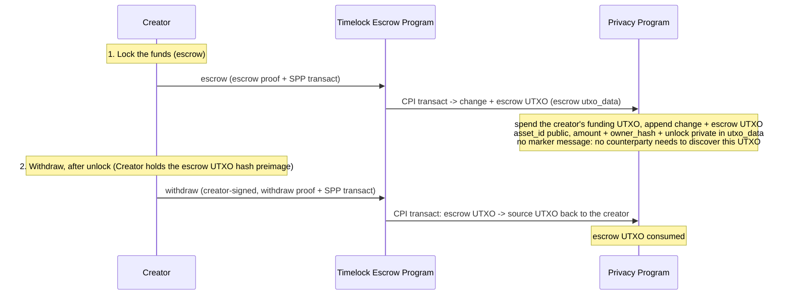

# Timelock Escrow Program

The timelock escrow program lets a creator lock funds as a shielded UTXO in the Solana Privacy
Program (SPP) with a chosen unlock timestamp, and reclaim them itself once that timestamp has
passed. The same creator that locks the funds is the only party that can withdraw them.

The timelock escrow program is an SPP ZK program: it verifies a small proof of its own escrow rules
and delegates the confidential transfer to SPP. It stores no state and owns no accounts.

This document specifies the escrow's privacy model, the escrow terms, the program's instructions,
and its circuits.

## Flow



## Table of Contents

- [Glossary](#glossary)
- [Privacy Model](#privacy-model)
- [Accounts](#accounts)
- [Escrow Terms](#escrow-terms)
- [Instructions](#instructions)
  - [escrow](#escrow)
  - [withdraw](#withdraw)
- [Circuits](#circuits)
  - [Escrow circuit](#escrow-circuit)
  - [Withdraw circuit](#withdraw-circuit)

## Glossary

Types used in this document. Shared SPP types are defined in [spec.md](../../docs/spec.md#glossary).

| Type | Encoding | Definition |
| --- | --- | --- |
| `Address` | `[u8; 32]` | Solana account address. |
| `asset_id` | `u64` | Asset identifier in UTXOs; `1` is SOL, each SPL mint `≥ 2`. The mint→`asset_id` map is the SPP `Asset registry` PDA. See [spec.md](../../docs/spec.md#glossary). |
| `CompressedShieldedAddress` | `[u8; 65]` | `(owner_hash [u8;32], viewing_pk P256Pubkey[33])`. See [spec.md](../../docs/spec.md#shielded-address). |
| `escrow UTXO` | — | The SPP [UTXO](../../docs/spec.md#utxo) holding the locked funds: `asset = asset_id`, `amount = amount`, `owner = escrow-authority PDA` (seeds `[b"escrow_authority"]`), nullifier secret `= 0`, `data_hash = Poseidon(escrow terms)`. Spendable only by the timelock escrow program. See [Escrow Terms](#escrow-terms). |
| `Escrow terms` | — | `owner_hash` and `unlock`, committed in the escrow UTXO `utxo_hash` via `data_hash`. The encrypted output carries `unlock` as its `utxo_data` record (tag `0x02`), and the creator knows its own `owner_hash`, so the creator can rebuild the terms. See [Escrow Terms](#escrow-terms). |
| `private_tx_hash` | `[u8; 32]` | Commitment to the SPP `transact` an escrow proof authorizes: the link between an escrow proof and the SPP transaction. See [spec.md](../../docs/spec.md#zk-program-interface). |
| `EscrowProof` / `WithdrawProof` | `[u8; 128]` | Groth16 proofs verified by the timelock escrow program, each committing the transaction via `private_tx_hash`. Both are standard Groth16: neither circuit does P256 elliptic-curve arithmetic (the creator authorizes with its own Solana transaction signature, checked by the runtime, not by the proof), so neither needs the extra commitment the P256 gadget requires. |
| `TransactIxData` | — | SPP `transact` instruction data: the SPP proof, input nullifiers, output UTXO hashes, ciphertexts, and routing. See [spec.md](../../docs/spec.md#transact). |
| `solana_owner_identity` | fn | The owner identity of a Solana key: `hash_bytes` of the key tagged as a Solana owner, the value an owner hash commits to. Used here to turn the creator signer's pubkey into a single value the proof can compare against the committed `owner_hash`. |

## Privacy Model

What is public and what is private. The confidentiality is inherited from the SPP confidential
ring; the timelock escrow program does not try to hide which action ran.

- **Public:**
  - which escrow instruction ran;
  - `asset_id` at escrow and again at withdraw (`asset_id`s are SPP public inputs);
  - the escrow UTXO hash at escrow;
  - the escrow `unlock` timestamp, revealed at withdraw so the program can check it against the
    Clock;
  - each transaction's SPP output UTXO hashes, ciphertexts and owner tags;
  - the creator's Solana signer pubkey, at both instructions.

  Under `ConfidentialEddsa` every real output's owner tag is its owner's identity. The escrow's
  change and the withdraw's source output are tagged with the creator, and the escrow UTXO with
  the escrow-authority PDA.
- **Private:** `amount`, the locked value, and the aggregate volume per asset. These live only
  inside confidential UTXOs and their ciphertexts.
- **Linkable:** the creator's identity appears at both `escrow` and `withdraw`, so an observer can
  pair them.

## Accounts

The timelock escrow program owns no accounts: the locked funds live in the escrow UTXO, a leaf in
the SPP trees, moved by CPI. There is no rent-paying account to create or close, and no counterparty
compensation (unlike the swap program's taker spread) since the same creator both locks and later
reclaims the funds.

## Escrow Terms

The escrow UTXO holds the escrow terms and funds. SPP commits the terms into the escrow UTXO
`utxo_hash` through `data_hash` (committed unchecked, interpreted by the escrow circuit, see
[spec.md](../../docs/spec.md#utxo)). The escrow UTXO's ciphertext, encrypted to the creator,
carries `unlock` as its `utxo_data` record (tag `0x02`, 8 bytes little-endian). The creator
rebuilds the terms from it and its own `owner_hash`
(`EscrowTerms::from_utxo_data`):

```text
escrow_terms = (
    owner_hash,   // the creator's shielded owner hash: receives change at escrow and the withdrawal at withdraw
    unlock,       // unix seconds; revealed at withdraw and checked against the Clock by the program
)
data_hash = Poseidon(escrow_terms)        // enters the escrow UTXO utxo_hash directly
```

`asset_id`, `amount`, and `owner = escrow-authority PDA` are the escrow UTXO's own SPP fields,
already committed in `utxo_hash`. The escrow UTXO's owner is the escrow-authority PDA (seeds
`[b"escrow_authority"]`) and its nullifier secret is hardcoded to 0, so:

```text
escrow_utxo_owner_hash = Poseidon(solana_owner_identity(escrow_authority_pda), Poseidon(0))   // ESCROW_OWNER_HASH, a program constant
nullifier               = Poseidon(utxo_hash, blinding, 0)                          // recomputed from the preimage
```

Knowledge of the escrow UTXO hash preimage, the escrow terms plus the escrow UTXO `blinding`, is
the complete spend capability: the nullifier includes the `blinding` and the circuits need it to
recompute the escrow UTXO `utxo_hash`. There is no marker message and no discovery step: unlike the
swap program, there is no counterparty that needs to learn of this UTXO's existence, so the creator
fetches its own escrow note directly from the indexer later, using the escrow-authority PDA
or the known `utxo_hash` as the lookup tag.

Moving the escrow UTXO also requires the program. SPP spends a PDA-owned UTXO only when the
timelock escrow program produces the escrow-authority signer via `invoke_signed`. The program signs
in both instructions, so the circuits decide what a signed transaction may spend:

- **`escrow`** spends only the signing creator's funding UTXO (see **Funding** below). A locked
  escrow UTXO carries its terms hash, not a funding hash, so `escrow` can never spend it.
- **`withdraw`** spends only an escrow UTXO whose terms name the signing creator, after `unlock`.
- **The escrow circuit creates the escrow UTXO itself.** Its owner is `ESCROW_OWNER_HASH`, the PDA
  with nullifier secret 0, which the program feeds into the proof's public input. The owner tag the
  program assigns to that slot makes SPP require the PDA identity as well.

The program derives the PDA via `find_program_address`, checks it is present among the forwarded
SPP accounts, and flips it to a signer inside the SPP CPI to authorize the escrow UTXO spend; the
PDA is a bare address and signs only inside the CPI.

**Funding.** The escrow's source is a funding UTXO. The creator makes one with a proofless deposit
owned by the escrow-authority PDA and carrying the program state `Funding { owner_hash }`, where
`data_hash = Poseidon(owner_hash)` (`NewProgramUtxo::deposit`).

- **Why a PDA-owned source.** The client SDK (`zolana-transaction` / `zolana-client`) derives the
  SPP owner signers from the input owners only. The escrow UTXO is a data-bearing output owned by
  the PDA, so the PDA must be an owner signer, and today that is only possible with a PDA-owned
  input.
- **Why it carries an owner.** A proofless deposit publishes its opening, so a plain PDA-owned
  deposit could be escrowed by anyone. The escrow circuit accepts only a funding source whose
  `owner_hash` equals the escrow terms' `owner_hash`. That `owner_hash` also owns the change, which
  the program tags with the signing `creator`, and `ConfidentialEddsa` requires the tag to be the
  owner's identity. So only the creator a funding UTXO names can escrow it; anyone else's proof
  fails at SPP.
- **What it rules out.** A locked escrow UTXO carries `Poseidon(owner_hash, unlock)`, not a
  funding hash, so it cannot be a funding source either.

Once the SDK can add the PDA as an explicit owner signer, the source can instead be the creator's
own plain UTXO.

`owner_hash` is the committed destination for both the change output at `escrow` and the refund at
`withdraw`. Both circuits create these outputs themselves, with blindings derived from the
transaction's first nullifier and blinding seed. `withdraw` requires the creator: it signs the
withdraw transaction, and the withdraw proof checks `solana_owner_identity` of the signer's pubkey
against the escrow's `owner_hash`. The refund can only land at `owner_hash`.

`unlock` is a unix-seconds value the proof reveals as a public input and the timelock escrow
program checks against the Clock sysvar: `withdraw` requires `now > unlock`. `escrow` does not
check `unlock` against the Clock — an escrow created with an already-past unlock timestamp
only harms the creator. The proof's public `unlock` must equal the committed escrow term, so the
withdrawer cannot shift the window.

## Instructions

| # | Instruction | Tag | Description | Accounts Read | Accounts Modified | Access control |
|---|-------------|-----|-------------|---------------|-------------------|----------------|
| 1 | [escrow](#escrow) | 0 | Verify the escrow proof and CPI SPP `transact` to lock the source funds into the escrow UTXO. | — | SPP trees (CPI) | Creator signs (fee payer) |
| 2 | [withdraw](#withdraw) | 1 | Verify the withdraw proof and CPI SPP `transact`: after unlock, spend the escrow UTXO back to `owner_hash`. | escrow_authority | SPP trees (CPI) | Creator signs; the proof checks the signer against the committed `owner_hash`; the program's escrow-authority PDA authorizes the escrow UTXO spend |

---

### escrow

Locks funds. The timelock escrow program verifies the [escrow proof](#escrow-circuit), then CPIs
SPP [`transact`](../../docs/spec.md#transact) to spend the creator's `asset_id` funding UTXO and append the
escrow UTXO, a UTXO of `amount` `asset_id` owned by the escrow-authority PDA (seeds
`[b"escrow_authority"]`), with the [escrow terms](#escrow-terms) in its `utxo_data` (which, with
the PDA owner, makes SPP spend it only through an escrow circuit). The transact is 1-in/2-out (the
creator's funding UTXO in; a change UTXO to the creator and the escrow UTXO out).

The proof checks the escrow UTXO output against the escrow rules (see the [escrow
circuit](#escrow-circuit)) without revealing the terms, and commits the transaction via
`private_tx_hash`, its sole public input. The amount and `unlock` are private at the escrow layer
(the transact's own `asset_id` public inputs still reveal `asset_id` at the SPP layer).

The program builds the SPP `transact` instruction data itself from `EscrowIxData::transact` with
`ProvenTransact::into_ix_data`. It sets the circuit (`ConfidentialEddsa(2, 2, N_PUBLIC_SLOTS)`),
no interface transfers, data hashes or messages, and the owner tag of each output slot:

| Slot | Output | Owner tag |
| --- | --- | --- |
| 0 | change | the `creator` signer account |
| 1 | escrow UTXO | the escrow-authority PDA |

`ConfidentialEddsa` requires every real output's tag to equal its owner identity, so these tags
make SPP reject any escrow whose change is not owned by the signing creator or whose escrow UTXO is
not owned by the PDA.

**Accounts**

1. `creator`: creator and fee payer; signer, writable. Consumed by the program, which assigns it as
   the change owner tag. Everything after it is the SPP `transact` account list.
2. `payer`: the SPP fee payer (the creator again); signer, writable.
3. `output_tree`: `pda::tree(output_tree_id)`; writable.
4. `spp_program`: the SPP program (CPI target). The program checks it.
5. `system_program`.
6. `input_tree`: the tree the source is spent from; writable.
7. `nullifier_pdas`: one per input slot (source and padding); writable.
8. `escrow_authority`: the escrow-authority PDA; read-only, non-signer. The program signs for it
   inside the CPI.

**Instruction data**

```rust
struct EscrowIxData {
    /// The escrow proof, verified against `transact.private_tx_hash` as its sole public input.
    proof: EscrowProof,
    /// What only the client can produce for the 2-in/2-out transact: the SPP proof, the
    /// private tx hash, expiry, encryption key and salt, the input nullifiers and root indexes,
    /// and the hash and ciphertext of each output slot.
    transact: ProvenTransact<2, 2>,
}
```

---

### withdraw

After unlock, the escrow UTXO is reclaimed to the committed `owner_hash`. The timelock escrow
program verifies the [withdraw proof](#withdraw-circuit), then CPIs SPP
[`transact`](../../docs/spec.md#transact). The transact is 1-in/1-out: the escrow UTXO in, an
`amount` `asset_id` UTXO to `owner_hash` out. The creator signs as a dedicated readonly signer; the
program includes `solana_owner_identity` of its pubkey in the proof's public input and the circuit
checks it against the committed `owner_hash`, so only the creator can withdraw. The refund's
blinding is derived from the withdraw transaction, which the creator builds. The timelock escrow
program supplies the escrow-authority PDA signer via
`invoke_signed` and reads the escrow `unlock` from the dedicated `unlock_timestamp` instruction-data
field and checks it against the Clock sysvar (`now > unlock`); the withdraw proof takes that same
value as a public input.

The program builds the SPP `transact` instruction data from `WithdrawIxData::transact`. It sets
the circuit (`ConfidentialEddsa(1, 1, N_PUBLIC_SLOTS)`) and the owner tag of output slot 0, the
source output, to the `creator` signer account.

**Accounts**

1. `caller`: fee payer; signer, writable. Consumed by the program. `now` is read from the Clock
   sysvar via syscall.
2. `creator`: the creator's Solana signer; read-only, signer. Consumed by the program, which
   includes `solana_owner_identity(creator)` in the withdraw proof's public input and assigns it as the source
   output owner tag. Everything after it is the SPP `transact` account list.
3. `payer`: the SPP fee payer; signer, writable.
4. `output_tree`: `pda::tree(output_tree_id)`; writable.
5. `spp_program`: the SPP program (CPI target). The program checks it.
6. `system_program`.
7. `input_tree`: the tree the escrow UTXO is spent from; writable.
8. `nullifier_pda`: the escrow UTXO's nullifier PDA; writable.
9. `escrow_authority`: the escrow-authority PDA (seeds `[b"escrow_authority"]`); read-only,
   non-signer. The program flips it to a signer inside the SPP CPI to authorize the escrow UTXO
   spend (see [Escrow Terms](#escrow-terms)).

**Instruction data**

```rust
struct WithdrawIxData {
    /// The withdraw proof; verified by the timelock escrow program.
    proof: WithdrawProof,
    /// The committed escrow unlock timestamp, checked against the Clock (now > unlock) and a
    /// proof public input.
    unlock_timestamp: u64,
    /// What only the client can produce for the 1-in/1-out transact: escrow UTXO in, source
    /// output to the creator out.
    transact: ProvenTransact<1, 1>,
}
```

## Circuits

The timelock escrow program runs two circuits, each with its own verifying key, distinct from the
SPP value proof inside `transact`. A circuit takes only three things:

- the input UTXOs, as hash preimages;
- the old state of a program UTXO it spends;
- the new state it cannot compute from them.

It builds every output UTXO itself (`zkprogram.Slots.Create`), the way a Light program builds its
output accounts with `LightAccount`. Each field comes from the circuit:

- the domain and the default ring;
- the owner, asset, amount and data hash, from the rules below;
- the blinding, derived for the output's slot from the transaction's first nullifier and blinding
  seed;
- the output tree id.

It also derives the private-tx blinding, so the client cannot choose any output field. Each
circuit commits the transaction through `private_tx_hash` inside its single public input hash.

SPP proves the input UTXOs are in the tree and conserves value; the escrow circuits rely on that
rather than proving membership themselves. Both circuits are standard Groth16: neither does P256
elliptic-curve arithmetic, so neither needs the extra commitment that gadget would require. The
input and output slot counts are fixed per instruction (`N_INPUTS`, `N_OUTPUTS` and `slot` in the
program crate, mirrored by the circuit constants) and must match the SPP `transact` shapes the
instructions use. The circuits are small and proven in-process through a gnark→Rust FFI binding;
the SPP transfer proof still comes from the existing SPP prover.

### Escrow circuit

Proves the escrow UTXO output commits the escrow terms. Matches the 1-in/2-out transact (source
UTXO in; change + escrow UTXO out), padded to the SPP `(2, 2)` proving shape.

- **Public inputs:** `Poseidon(private_tx_hash, escrow_owner_hash)`.
  - `private_tx_hash` comes from `EscrowIxData::transact`.
  - `escrow_owner_hash` is the escrow-authority PDA's owner hash with nullifier secret 0. The
    program uses the constant `ESCROW_OWNER_HASH`. A test pins it to what
    `zolana_program::compression::PdaOwner` derives, the same function the client uses.
- **Private inputs:**
  - the funding source as a `zkprogram.ProgramUtxo[Funding]`: its hash preimage plus its
    `owner_hash` as old state;
  - the new state: the escrow terms (`owner_hash`, `unlock`) and the amount to lock;
  - the transaction values: `external_data_hash`, `first_nullifier`, `blinding_seed` and
    `output_tree_id`.
- **Constraints:**
  - The source is a funding UTXO (`ProgramUtxo[Funding].Hash`): default ring and
    `data_hash = Poseidon(funding owner_hash)`.
    - A locked escrow UTXO carries `Poseidon(owner_hash, unlock)` instead, so `escrow` cannot
      spend it before its unlock, even though the program signs for the PDA that owns it.
  - The funding `owner_hash` equals the terms' `owner_hash`.
    - The change goes to that owner, and the program tags it with the signing creator.
    - Only the creator named by the funding can therefore escrow it.
  - The amount is nonzero.
  - The circuit creates output slot 1, the escrow UTXO: owner `escrow_owner_hash`, the source's
    asset, the amount, `data_hash = Poseidon(escrow terms)`, the default ring (see
    [default, non-ring](../../docs/spec.md#default-ring)).
  - The circuit creates output slot 0, the change: owner `owner_hash`, the source's asset, the
    source amount minus the amount, no data.
  - The `private_tx_hash` recomputation (`zkprogram.Slots(2, 2)`) mirrors the padded transact
    exactly (see [private_tx_hash](../../docs/spec.md#spp-proof---solana-privacy-zk-proof)):
    - the input hash chain covers `[source, 0]`, where the padding slot is 0;
    - the output hash chain covers `[change, escrow_utxo]`;
    - the address hash chain covers `[0, 0]`.

### Withdraw circuit

Reclaims the escrow UTXO to the committed `owner_hash` after unlock. Matches the 1-in/1-out
transact (escrow UTXO in; source-to-owner out). The program enforces `now > unlock` against the
Clock; the circuit only reveals `unlock` and checks it equals the committed term.

- **Public inputs:** `Poseidon(private_tx_hash, unlock, owner_pk_field)`, where `owner_pk_field` is
  `solana_owner_identity` of the creator signer's pubkey, fed by the program.
- **Private inputs:**
  - the escrow UTXO input as a `zkprogram.ProgramUtxo[EscrowTerms]`: its hash preimage, plus the
    escrow terms as its old state;
  - the creator's `(owner_pk_field, nullifier_pk)`, the preimage of the committed `owner_hash`;
  - the transaction values: `external_data_hash`, `first_nullifier`, `blinding_seed` and
    `output_tree_id`.

  There is no new state: the source output follows from the old state.
- **Constraints:**
  - The public `unlock` equals the committed escrow `unlock`.
  - `Poseidon(owner_pk_field, nullifier_pk)` equals the committed `owner_hash`, so the proof
    verifies only with the creator signer the program supplies.
  - The circuit creates output slot 0, the source output: owner `owner_hash`, the escrow UTXO's
    asset and amount, no data.
  - The `private_tx_hash` recomputation (`zkprogram.Slots(1, 1)`) covers the escrow input and the
    created source output.
