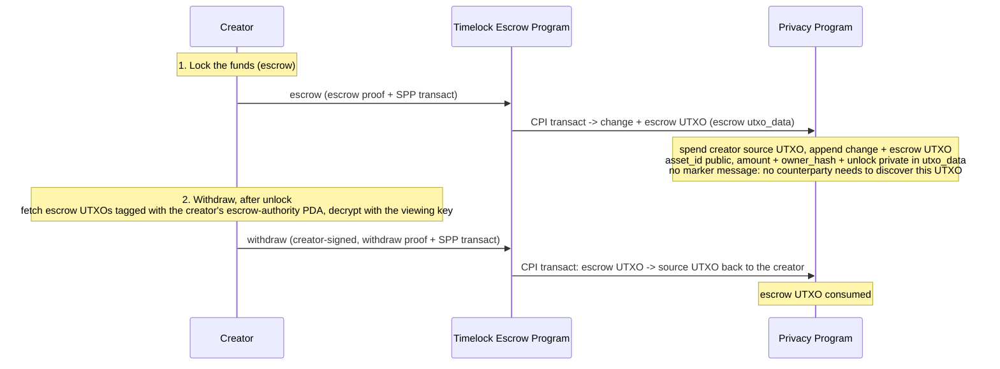

# Timelock Escrow Program

The timelock escrow program lets a creator lock funds as a shielded UTXO in the Solana Privacy
Program (SPP) with a chosen unlock timestamp, and reclaim them itself once that timestamp has
passed. The same creator that locks the funds is the only party that can withdraw them. Each
creator's escrows are owned by that creator's escrow-authority PDA, so the creator finds them
by querying the indexer for that PDA.

The timelock escrow program is an SPP ZK program: it verifies a small proof of its own escrow rules
and delegates the confidential transfer to SPP. It stores no state and owns no accounts.

This document specifies the escrow's privacy model, the escrow terms, the program's instructions,
and its circuits.

## Flow


```mermaid
sequenceDiagram
    participant Creator
    participant Escrow as Timelock Escrow Program
    participant SPP as Privacy Program

    Note over Creator: 1. Lock the funds (escrow)
    Creator->>Escrow: escrow (escrow proof + SPP transact)
    Escrow->>SPP: CPI transact -> change + escrow UTXO (escrow utxo_data)
    Note over SPP: spend creator source UTXO, append change + escrow UTXO <br> asset_id public, amount + owner_hash + unlock private in utxo_data <br> no marker message: no counterparty needs to discover this UTXO

    Note over Creator: 2. Withdraw, after unlock <br> fetch escrow UTXOs tagged with the creator's escrow-authority PDA, decrypt with the viewing key
    Creator->>Escrow: withdraw (creator-signed, withdraw proof + SPP transact)
    Escrow->>SPP: CPI transact: escrow UTXO -> source UTXO back to the creator
    Note over SPP: escrow UTXO consumed
```

## Table of Contents

- [Glossary](#glossary)
- [Privacy Model](#privacy-model)
- [Accounts](#accounts)
- [Escrow Terms](#escrow-terms)
- [Instructions](#instructions)
  - [escrow](#escrow)
  - [withdraw](#withdraw)
- [Circuits](#circuits)
  - [Escrow circuit](#escrow-circuit)
  - [Withdraw circuit](#withdraw-circuit)

## Glossary

Types used in this document. Shared SPP types are defined in [spec.md](../../docs/spec.md#glossary).

| Type | Encoding | Definition |
| --- | --- | --- |
| `Address` | `[u8; 32]` | Solana account address. |
| `asset_id` | `u64` | Asset identifier in UTXOs; `1` is SOL, each SPL mint `≥ 2`. The mint→`asset_id` map is the SPP `Asset registry` PDA. See [spec.md](../../docs/spec.md#glossary). |
| `CompressedShieldedAddress` | `[u8; 65]` | `(owner_hash [u8;32], viewing_pk P256Pubkey[33])`. See [spec.md](../../docs/spec.md#shielded-address). |
| `escrow UTXO` | — | The SPP [UTXO](../../docs/spec.md#utxo) holding the locked funds: `asset = asset_id`, `amount = amount`, `owner = the creator's escrow-authority PDA` (seeds `[b"escrow_authority", creator]`), nullifier secret `= 0`, `utxo_data = escrow terms`. Spendable only by the timelock escrow program, and only in a withdraw the creator signs. See [Escrow Terms](#escrow-terms). |
| `Escrow terms` | — | The fields committed in the escrow UTXO's `utxo_data` (record tag `0x02`), hashed into the escrow UTXO `utxo_hash` via `data_hash`: `owner_hash`, `unlock`. See [Escrow Terms](#escrow-terms). |
| `private_tx_hash` | `[u8; 32]` | Commitment to the SPP `transact` an escrow proof authorizes: the link between an escrow proof and the SPP transaction. See [spec.md](../../docs/spec.md#zk-program-interface). |
| `CompressedProof` | `[u8; 128]` | The escrow and withdraw Groth16 proofs (`zolana_program::CompressedProof`), verified by the timelock escrow program, each committing the transaction via `private_tx_hash`. Both are standard Groth16: neither circuit does P256 elliptic-curve arithmetic (the creator authorizes with its own Solana transaction signature, checked by the runtime, not by the proof), so neither needs the extra commitment the P256 gadget requires. |
| `TransactIxData` | — | SPP `transact` instruction data: the SPP proof, input nullifiers, output UTXO hashes, ciphertexts, and routing. See [spec.md](../../docs/spec.md#transact). |
| `hash_bytes` | fn | `Poseidon` hash of a 32-byte value, folded into the field the circuits check over; used here to turn a Solana pubkey into a single value the proof can compare against a committed hash. |

## Privacy Model

What is public and what is private. The confidentiality is inherited from the SPP confidential
ring; the timelock escrow program does not try to hide which action ran.

- **Public:** which escrow instruction ran; `asset_id` at escrow and again at withdraw (`asset_id`s
  are SPP public inputs); the escrow UTXO hash at escrow; the escrow `unlock` timestamp, revealed at
  withdraw so the program can check it against the Clock; each transaction's SPP output UTXO hashes
  and ciphertexts; the creator's Solana signer pubkey, which signs both instructions; the creator's
  escrow-authority PDA, which is the escrow UTXO's owner tag and an account of both instructions.
  Anyone who knows the creator's pubkey can derive that PDA and see when the creator opens and
  closes escrows. The confidential ring publishes the creator in both transactions (the change and
  payout outputs are tagged with the creator's pubkey), so the PDA reveals nothing new.
- **Private:** `amount`, the locked value, and the aggregate volume per asset. These live only
  inside confidential UTXOs and the escrow UTXO `utxo_data`.
- **Unlinkable:** SPP hides the link between a created UTXO and its later spend, so when a creator
  has several open escrows, an observer cannot tell which of them a `withdraw` spends.

## Accounts

The timelock escrow program owns no accounts: the locked funds live in the escrow UTXO, a leaf in
the SPP trees, moved by CPI. There is no rent-paying account to create or close, and no counterparty
compensation (unlike the swap program's taker spread) since the same creator both locks and later
reclaims the funds.

## Escrow Terms

The escrow UTXO holds the escrow terms and funds. `escrow` writes the escrow terms into the escrow
UTXO's `utxo_data` (record tag `0x02`), and SPP commits them into the escrow UTXO `utxo_hash`
through `data_hash` (committed unchecked, interpreted by the escrow circuit — see
[spec.md](../../docs/spec.md#utxo)):

```text
escrow_terms = (
    owner_hash,   // the creator's shielded owner hash: receives change at escrow and the withdrawal at withdraw
    unlock,       // unix seconds; revealed at withdraw and checked against the Clock by the program
)
data_hash = Poseidon(escrow_terms)        // enters the escrow UTXO utxo_hash directly
```

`asset_id`, `amount`, and `owner = escrow-authority PDA` are the escrow UTXO's own SPP fields,
already committed in `utxo_hash`. The escrow UTXO's owner is the creator's escrow-authority PDA
(seeds `[b"escrow_authority", creator]`, where `creator` is the creator's Solana pubkey) and its
nullifier secret is hardcoded to 0, so:

```text
escrow_authority_pda   = find_program_address([b"escrow_authority", creator], timelock_escrow_program_id)
escrow_utxo_owner_hash = Poseidon(solana_owner_identity(escrow_authority_pda), Poseidon(0))   // one per creator
nullifier              = Poseidon(utxo_hash, blinding, 0)                                      // recomputed from the preimage
```

Knowledge of the escrow UTXO hash preimage, the escrow terms plus the escrow UTXO `blinding`, is
the complete spend capability: the nullifier includes the `blinding` and the circuits need it to
recompute the escrow UTXO `utxo_hash`. There is no marker message: unlike the swap program, there
is no counterparty that needs to learn of this UTXO's existence. The escrow UTXO is encrypted to the
creator's viewing key, and SPP tags it with its owner, the creator's escrow-authority PDA. To find
its escrows, the creator queries the indexer for that one tag, which matches only its own escrows,
and decrypts the results with its viewing key. It then recomputes each escrow UTXO `utxo_hash` from
the decrypted terms and skips escrows whose nullifier has already been published.

Moving the escrow UTXO also requires the program: SPP spends a PDA-owned UTXO only when the
timelock escrow program produces the escrow-authority signer via `invoke_signed`, and `withdraw` is
the only instruction that spends with it (after unlock, creator-signed, to `owner_hash`). SPP enforces the PDA ownership
at spend time, when the escrow UTXO input's owner must match the escrow-authority signer. Both
instructions derive the PDA with `find_program_address` from their `creator` signer, check it is
present among the forwarded SPP accounts, and flip it to a signer inside the SPP CPI. At `escrow`
this authorizes the new escrow UTXO and its `utxo_data`; at `withdraw` it authorizes spending the
escrow UTXO. The PDA is a bare address and signs only inside the CPI. Since a creator's `withdraw`
signs only for that creator's PDA, it can spend only escrows owned by that PDA.

The escrow circuit makes the terms name the PDA's creator: the program passes
`solana_owner_identity(creator)` as a public input, and the circuit checks it against the key of
the tokens' owner, which it commits as the escrow's `creator`. An escrow owned by one creator's PDA
therefore names that same creator, so the withdraw circuit's check against the signer can pass.

`owner_hash` is the committed destination for both the change output at `escrow` and the refund at
`withdraw`: the creator recovers both from the escrow UTXO blinding it already holds. `withdraw`
requires the creator: it signs the withdraw transaction, and the withdraw proof checks `hash_bytes`
of the signer's pubkey against the escrow's `owner_hash`. The refund can only land at `owner_hash`.

`unlock` is a unix-seconds value the proof reveals as a public input and the timelock escrow
program checks against the Clock sysvar: `withdraw` requires `now > unlock`. `escrow` does not
check `unlock` against the Clock — an escrow created with an already-past unlock timestamp
only harms the creator. The proof's public `unlock` must equal the committed escrow term, so the
withdrawer cannot shift the window.

## Instructions

| # | Instruction | Tag | Description | Accounts Read | Accounts Modified | Access control |
|---|-------------|-----|-------------|---------------|-------------------|----------------|
| 1 | [escrow](#escrow) | 0 | Verify the escrow proof and CPI SPP `transact` to lock the source funds into the escrow UTXO (escrow `utxo_data`). | creator, escrow_authority | SPP trees (CPI) | Creator signs; the proof checks the signer against the tokens' owner; the creator's escrow-authority PDA authorizes the escrow UTXO |
| 2 | [withdraw](#withdraw) | 1 | Verify the withdraw proof and CPI SPP `transact`: after unlock, spend the escrow UTXO back to `owner_hash`. | creator, escrow_authority | SPP trees (CPI) | Creator signs; the proof checks the signer against the committed `owner_hash`; the creator's escrow-authority PDA authorizes the escrow UTXO spend |

---

### escrow

Locks funds. The timelock escrow program verifies the [escrow proof](#escrow-circuit), then CPIs
SPP [`transact`](../../docs/spec.md#transact) to spend the creator's `asset_id` UTXO and append the
escrow UTXO, a UTXO of `amount` `asset_id` owned by the creator's escrow-authority PDA (seeds
`[b"escrow_authority", creator]`), with the [escrow terms](#escrow-terms) in its `utxo_data` (which, with
the PDA owner, makes SPP spend it only through an escrow circuit). The transact is 1-in/2-out (the
creator's source UTXO in; a change UTXO to the creator and the escrow UTXO out).

The proof checks the escrow UTXO output against the escrow rules (see the [escrow
circuit](#escrow-circuit)) without revealing the terms, and commits the transaction through its
public input `Poseidon(escrow_owner_hash, creator_identity, private_tx_hash)`. The amount and
`unlock` are private at the escrow layer (the transact's own `asset_id` public inputs still reveal
`asset_id` at the SPP layer).

**Accounts**

1. `creator` — the creator's Solana signer, the owner of the source UTXOs; read-only, signer.
   Consumed by the program, which derives the creator's escrow-authority PDA from it and passes
   that PDA's owner hash and `solana_owner_identity(creator)` to the escrow proof; everything after
   it is forwarded verbatim to the SPP `transact` CPI.
2. `payer` — the SPP fee payer; signer, writable.
3. `tree_accounts` — SPP trees the transact touches; writable.
4. `escrow_authority` — the creator's escrow-authority PDA (seeds `[b"escrow_authority", creator]`);
   read-only, non-signer. The program flips it to a signer inside the SPP CPI, because SPP requires
   an output with a nonzero `data_hash` to be owned by a signer.
5. `spp_program` — SPP program (CPI target).

**Instruction data**

```rust
struct EscrowIxData {
    /// The escrow proof; verified by the timelock escrow program against
    /// Poseidon(escrow_owner_hash(creator), solana_owner_identity(creator), private_tx_hash).
    proof: CompressedProof,
    /// The client's SPP transact as `TransactIxData` bytes: the creator's source UTXOs in, the
    /// change and the escrow UTXO out. The program reads `private_tx_hash` through
    /// `TransactIxDataRef` and forwards the bytes to the SPP `transact` CPI unchanged.
    transact: [u8],
}
```

---

### withdraw

After unlock, the escrow UTXO is reclaimed to the committed `owner_hash`. The timelock escrow
program verifies the [withdraw proof](#withdraw-circuit), then CPIs SPP
[`transact`](../../docs/spec.md#transact). The transact is 1-in/1-out: the escrow UTXO in, an
`amount` `asset_id` UTXO to `owner_hash` out. The creator signs as a dedicated readonly signer; the
program includes `hash_bytes` of its pubkey in the proof's public input and the circuit checks it
against the committed `owner_hash`, so only the creator can withdraw, and the creator knows the
refund blinding it chose. The timelock escrow program supplies the escrow-authority PDA signer via
`invoke_signed` and reads the escrow `unlock` from the dedicated `unlock_timestamp` instruction-data
field and checks it against the Clock sysvar (`now > unlock`); the withdraw proof takes that same
value as a public input.

**Accounts**

1. `caller` — fee payer; signer, writable. Consumed by the program. `now` is read from the Clock
   sysvar via syscall.
2. `creator` — the creator's Solana signer; read-only, signer. Consumed by the program, which
   includes `solana_owner_identity(creator)` in the withdraw proof's public input and derives the
   creator's escrow-authority PDA from it; everything after it is forwarded verbatim to the SPP
   `transact` CPI.
3. `payer` — the SPP fee payer; signer, writable.
4. `tree_accounts` — SPP trees the transact touches; writable.
5. `escrow_authority` — the creator's escrow-authority PDA (seeds `[b"escrow_authority", creator]`);
   read-only, non-signer. The program flips it to a signer inside the SPP CPI to authorize the
   escrow UTXO spend (see [Escrow Terms](#escrow-terms)).
6. `spp_program` — SPP program (CPI target); must be the last account (the program checks this).

**Instruction data**

```rust
struct WithdrawIxData {
    /// The withdraw proof; verified by the timelock escrow program.
    proof: CompressedProof,
    /// The committed escrow unlock timestamp, checked against the Clock (now > unlock) and a
    /// proof public input.
    unlock_timestamp: u64,
    /// The client's SPP transact as `TransactIxData` bytes: the escrow UTXO in, the creator's
    /// payout out. The proof is verified against
    /// Poseidon(unlock_timestamp, solana_owner_identity(creator), private_tx_hash), and the
    /// program forwards the bytes to the SPP `transact` CPI unchanged.
    transact: [u8],
}
```

## Circuits

The two circuits are written with the arkworks ZK program SDK
([`sdk-libs/program`](../../sdk-libs/program/README.md)) in
[`program/src/circuits/`](program/src/circuits), the program crate's `circuits` feature. Each
circuit spends and builds the SPP transaction's UTXOs itself, so the `private_tx_hash` it computes
is the one the SPP transfer proof commits to. Its one public input is Poseidon of its public fields
followed by `private_tx_hash`. SPP proves the inputs are in the tree and conserves value; the
circuits rely on that rather than proving membership themselves.

Both are plain Groth16 proofs. The program verifies them through `zk::escrow::verify` and
`zk::withdraw::verify`, which `include_zk_programs!()` generates from the circuits' public inputs
and the verifying keys in `target/zk/timelock-escrow-program`: insecure test keys from the SDK's
deterministic test setup that `just build-escrow-program` writes (UNSAFE for production). The
program's tests check that the included keys are that setup's and that both circuits' proofs
verify through the generated verifier and public-input hashes. The SPP transfer proof comes from
the SPP prover. `just build-escrow-wasm` builds both circuits for the browser into
`target/zk/timelock-escrow-program/wasm`.

### Escrow circuit

Locks `amount` of the creator's asset in an escrow UTXO owned by the creator's escrow-authority
PDA.

- **Public input:** `Poseidon(escrow_owner_hash, creator_identity, private_tx_hash)`; the program
  supplies `escrow_owner_hash`, the owner hash of the creator signer's escrow-authority PDA, and
  `creator_identity`, `solana_owner_identity` of that signer.
- **Private inputs:** the transaction context (blinding seed and output tree), up to five of the
  creator's token UTXOs (dummies after the first), `unlock` and `amount`.
- **Constraints:**
  - `amount` is nonzero, and the token UTXOs move exactly `amount` into a new escrow data UTXO
    owned by the escrow owner, in the tokens' asset.
  - The tokens' owner key identity equals `creator_identity`, so the PDA that owns the escrow is
    derived from the same creator the terms name.
  - The escrow UTXO's `data_hash` commits the [escrow terms](#escrow-terms): the creator (the
    tokens' owner) and `unlock`.
  - What is left returns to the creator as change; `private_tx_hash` covers the real inputs, the
    change and the escrow UTXO.

### Withdraw circuit

Reclaims the escrow UTXO to its creator after unlock. The program enforces `now > unlock` against
the Clock; the circuit only reveals `unlock` and checks it equals the committed term.

- **Public input:** `Poseidon(unlock, creator_identity, private_tx_hash)`, where
  `creator_identity` is `solana_owner_identity` of the creator signer the program passes.
- **Private inputs:** the transaction context, the escrow UTXO and its terms.
- **Constraints:**
  - The escrow input commits the terms and holds a nonzero amount.
  - The public `unlock` equals the committed `unlock`, and `creator_identity` equals the committed
    creator's key identity, so the proof verifies only for the creator signer the program passes.
  - The escrow UTXO closes and moves its whole balance into a new token UTXO of the creator.
