# ZK Program SDK: Client, Circuit and Program Abstractions, Implemented in the Timelock Escrow

2026-09-24 21:12 WEST. Branch `t3code/21b6e9fb`, stacked on PR #328 (`jorrit/compression-read`, `46ad10ef7`).

## IMPORTANT

User instructions and requirements for this work:

- Split the task into todos, work through them one by one, and do not batch them (section 7).
  Test each todo as soon as its code exists.
- Use subagents where it makes sense. If stuck or starting to do random things, research with a
  subagent.
- Modify only `sdk-tests/timelock-escrow`. `Cargo.lock` changes only if a dependency changes.
- The new abstractions live in the example's crates (the sdk for the client side), written
  generally so the other examples (zk-program-swap, dynamic-swap, rfq, compression) could adopt
  them unchanged. Generic modules carry no escrow types.
- Model the developer experience on Light Protocol's `LightAccount` / `LightSystemProgramCpi`,
  with builder patterns and helper structs.
- No `PackedAccounts`. What ZK compression does in the program (rehashing account state from
  plaintext) happens in the program's circuit here, so the `LightAccount` equivalent lives on the
  client, where proof inputs are built.
- Add in-circuit abstractions too, and give each one a client-side counterpart that builds its
  proof inputs.
- Replace forwarding the complete client-built SPP `TransactIxData` through the program with the
  few values only the client can produce, sent transparently.

---

## 1. Light Protocol abstractions

Source: `~/dev/light-protocol` at `a67a427e6`. Light splits the work so that the client sends
pointers, the proof and plaintext state, and the program rebuilds every hash, the owner and the
address. A wrong pointer or wrong plaintext makes proof verification fail; it never produces a
bad state.

### 1.1 Program side

1. **`LightAccount<A>`** (`sdk-libs/sdk/src/account.rs:202`). A typed compressed account. It
   derefs to the state `A` and has one constructor per lifecycle transition: `new_init(owner,
   address, output_tree_index)`, `new_mut(owner, &meta, state)`, `new_close`, `new_empty`,
   `new_burn`, `new_read_only`. It hashes the input from the plaintext the client sends and the
   output from the mutated state, exactly once, in `to_account_info()`.
2. **`CompressedAccountInfo { address, input: Option<InAccountInfo>, output: Option<OutAccountInfo> }`**
   (`with_account_info.rs:338`). The optional input and output encode every transition in one
   struct.
3. **`LightSystemProgramCpi`** (`sdk-libs/sdk/src/cpi/v2/mod.rs:142`), used as
   `new_cpi(signer, proof).with_light_account(acc)?.with_new_addresses(..).invoke(cpi_accounts)`.
   A consuming builder that assembles the system program's instruction data on chain.
4. **`CpiAccounts`** (`sdk-types/src/cpi_accounts/v2.rs:34`). Resolves packed u8 indices into
   tree accounts with bounds-checked `Result`s.
5. **`CpiSigner` and `derive_light_cpi_signer!`**. The program's CPI authority PDA, computed at
   compile time.

### 1.2 Client side

6. **`PackedAccounts`** (`sdk-types/src/pack_accounts.rs:24`). A deduplicating account list: it
   maps pubkeys to u8 indices and emits `[pre][system][packed]` metas. (Not needed here, see
   section 3.)
7. **`SystemAccountMetaConfig`** (`sdk/src/instruction/system_accounts.rs:67`). The system
   accounts a CPI needs, emitted in a fixed order.
8. **`Indexer::get_validity_proof(hashes, new_addresses)`** returning
   **`ValidityProofWithContext`** (`client/src/indexer/types/proof.rs:70`). One call returns the
   proof and the tree context of every account and address.
9. **`ValidityProofWithContext::pack_tree_infos`** (`proof.rs:192`). Turns tree pubkeys into u8
   indices and root indices.
10. **`TreeInfo::pack_output_tree_index`** (`client/src/indexer/types/tree.rs:69`). Chooses the
    output tree, including rollover.
11. **`pack_proof` / `get_create_accounts_proof`** (`client/src/interface/`). One-shot helpers
    returning one struct to paste into instruction data.

### 1.3 Shared (the same Rust type compiled into client and program)

12. **`ValidityProof` / `CompressedProof`**. The 128-byte proof.
13. **`CompressedAccountMeta`** (`sdk-types/src/instruction/account_meta.rs:82`),
    `{ tree_info, address, output_state_tree_index }`: everything the client says about an
    account besides its state.
14. **`PackedStateTreeInfo` / `PackedAddressTreeInfo`**. Indices plus root index.
15. **`derive_address`**. The same function on both sides.
16. **The program's own instruction-data and state structs.** The client imports the program
    crate.

### 1.4 Compressed-account lifecycle in Light

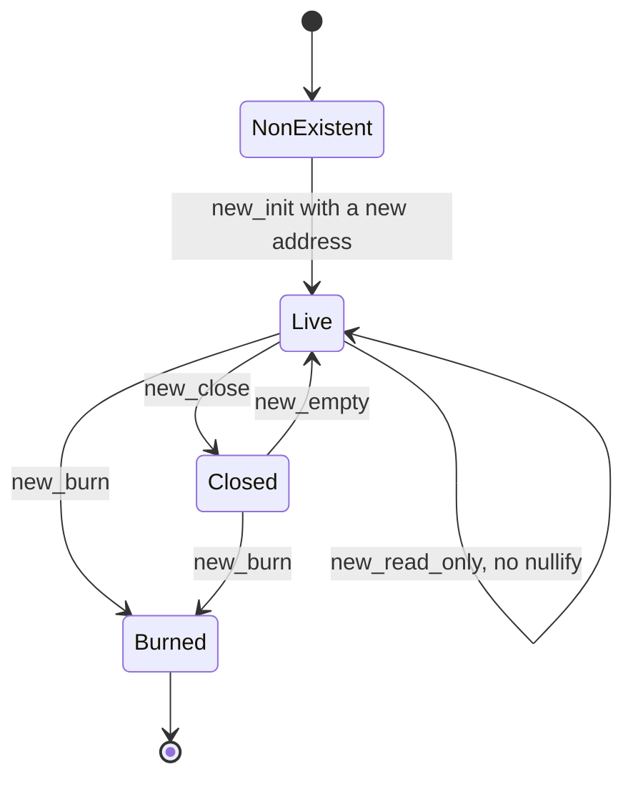

*Figure 1: Light compressed-account lifecycle.* An account starts `NonExistent`. `new_init`
reserves its address and creates it `Live`. `new_mut` replaces the live version with the next one,
and `new_read_only` proves it without nullifying it. `new_close` leaves an empty account at the
address that `new_empty` can reinitialize, and `new_burn` removes the account for good. For every
transition the client fetches the account and a validity proof, packs tree infos, and sends meta,
plaintext and proof; the program recomputes the hashes.

### 1.5 Light client build flow

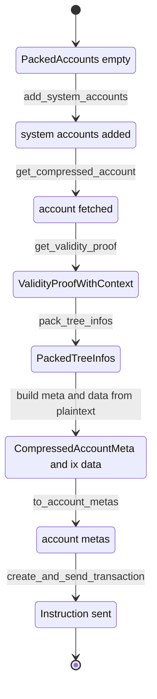

*Figure 2: Light client build flow.* The only ordering constraint Light does not enforce is that
`to_account_metas` runs after the last index insertion. A typestate builder would catch that at
compile time; our builder uses fixed-size slot arrays instead of indices.

---

## 2. Zolana ZK programs today

### 2.1 The SPP transact client pipeline every example rebuilds by hand

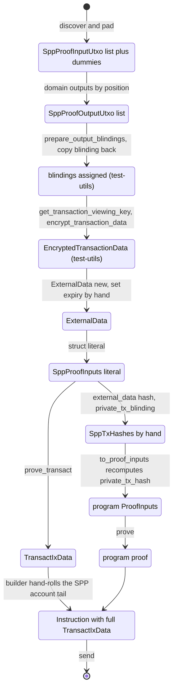

*Figure 3: current pipeline.* Blinding assignment, encryption and the transaction viewing key come
from `zolana_test_utils`, which SDK crates must not depend on. `private_tx_hash` is computed twice:
by the SPP prover inside `prove_transact`, and by each example's `to_proof_inputs` over a
hand-written slot list. The two are never compared, so any drift surfaces on chain as an opaque
`ProofVerificationFailed`.

### 2.2 Two program models

- **Forwarding** (zk-program-swap, timelock-escrow, dynamic-swap). The instruction data embeds a
  complete client-built `TransactIxData`. The program verifies its own proof against
  `transact.private_tx_hash`, re-serializes the data and signs the CPI as its PDA.
- **Rebuilding** (compression, PR #328). The client sends state values, `CompressedAccountMeta`
  and the SPP proof. The program builds the whole `TransactIxData` with `SppTransactCpi`, because
  its state is plaintext and it can derive every output.

Private programs cannot use the rebuilding model: their outputs carry encrypted amounts that only
the client knows. The design below is a third model. The client sends the proven values in named,
fixed-size fields, and the program assembles the transaction, deciding every value it can: circuit
id, owner tags, and the absence of transfers, messages and data hashes.

### 2.3 Example state machines

**zk-program-swap.**

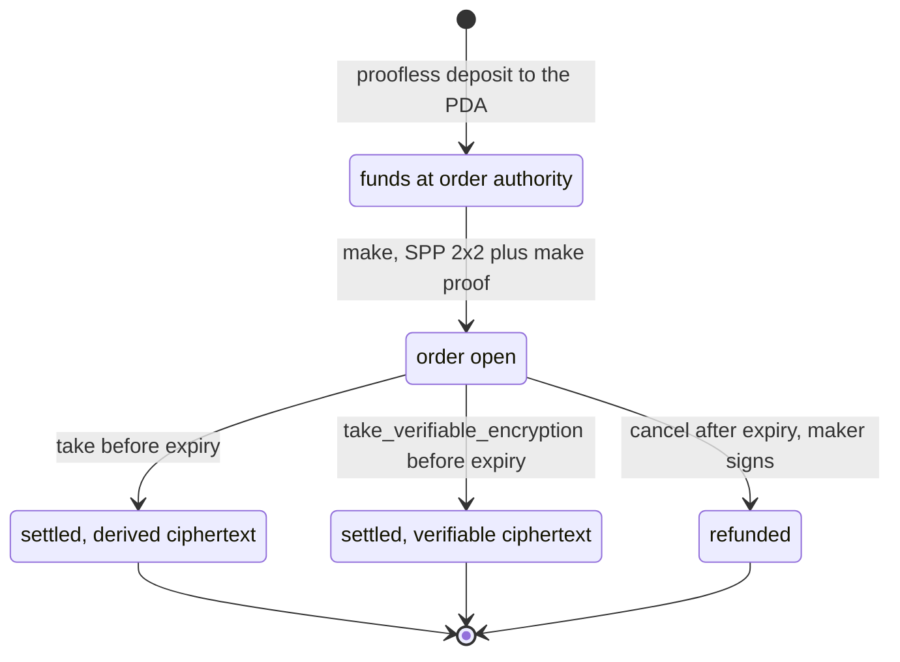

*Figure 4: zk-program-swap.*
- `make` spends the source (input 0) and creates change (output 0) and the order (output 1). The
  program writes the marker message.
- `take` spends the order at input 0, which is the first nullifier, plus the taker's funds at
  input 1. It pays both parties.
- `cancel` spends the order back to the maker.

**timelock-escrow.**

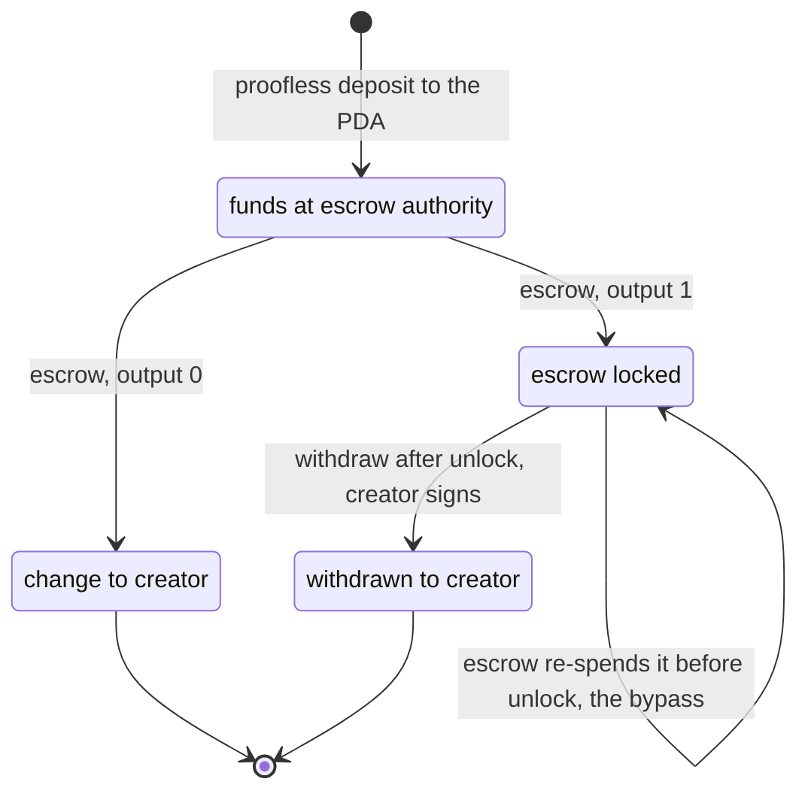

*Figure 5: timelock-escrow.*
- `escrow` is SPP 2x2: input 0 is the source, input 1 a dummy; output 0 is change, output 1 the
  escrow UTXO.
- `withdraw` is SPP 1x1, turning the escrow UTXO into the creator's funds.
- The self-loop is a bug in the current code. The escrow circuit leaves the source input as a free
  hash, and the program signs for the PDA over client-built data. So `escrow` can spend a locked
  escrow UTXO (PDA-owned, zero nullifier secret) before its unlock. Section 5.2 closes it.

**dynamic-swap.**

```mermaid
stateDiagram-v2
    accTitle: dynamic-swap escrow lifecycle
    accDescr: A pair is created and priced; an escrow opens from taker and maker funds and settles or refunds depending on the execution price.
    %% Section 2.3 of zk_program_sdk.md
    state "pair" as Pair
    state "escrow open" as Open
    state "settled" as Settled
    state "refunded" as Refunded
    state outcome <<choice>>
    [*] --> Pair: create_pair
    Pair --> Pair: update_price
    Pair --> Open: create_escrow, SPP 2x3 plus open proof
    Open --> outcome: settle, SPP 2x3 plus settle proof
    outcome --> Settled: price within the taker limit
    outcome --> Refunded: price above the taker limit
    Settled --> [*]
    Refunded --> [*]
```

*Figure 6: dynamic-swap.*
- `create_escrow` outputs the order (0), the reservation (1, ciphertext dropped) and maker change
  (2). The order's data embeds the reservation blinding, so blindings must be derivable before the
  outputs are final.
- `settle` spends the order (input 0, the first nullifier) and the reservation, with a
  program-defined blinding seed.

**rfq.**

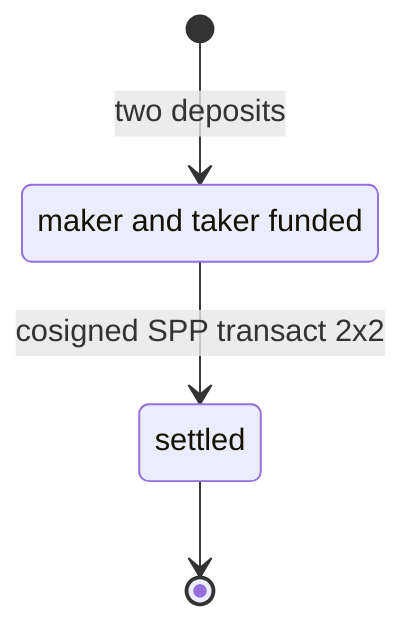

*Figure 7: rfq.* There is no program: maker and taker sign one SPP transact. Only the SPP half of
the client builder applies.

**compression (PR #328).**

```mermaid
stateDiagram-v2
    accTitle: compression example account lifecycle
    accDescr: An address is reserved at create; the account is updated to new versions and read without spending.
    %% Section 2.3 of zk_program_sdk.md
    state "unreserved" as Unreserved
    state "live version" as Live
    [*] --> Unreserved
    Unreserved --> Live: create, spends the address slot
    Live --> Live: update, next version, may move tree
    Live --> Live: read, proves current without spending
```

*Figure 8: compression.* This is the rebuilding model: the program derives every output. The
client uses the same `SppTransactCpi` host-side, then patches root indexes after proving.

### 2.4 Client-side abstractions the examples define today

Timelock escrow (all of these are replaced or rebuilt on the generic layer):

1. `escrow_authority_pda()`: `sdk/src/lib.rs`.
2. `EscrowTerms`, `DataHash`, `EscrowUtxo { terms, blinding, asset, amount }` with `output_utxo`,
   `to_input_utxo`, `source_output`: `sdk/src/state/escrow.rs`. A PDA-owned UTXO opening,
   duplicated in every example (D9 in the research).
3. `SppTxHashes`: `sdk/src/instructions/escrow/proof.rs`, byte-identical to zk-program-swap's.
4. `EscrowProofInputParams` and `WithdrawProofInputParams`: they recompute `private_tx_hash` over
   hand-listed slots.
5. `Escrow` and `Withdraw` instruction builders: they hand-roll the SPP account tail.
6. `input_sum` and `check_output_utxo`: `sdk/src/shared.rs`.
7. `EscrowProverClient`: a pass-through.
8. Prover crate: `EscrowProofInputs` and `WithdrawProofInputs` with stringly-typed `witness()`
   maps.

The other examples repeat the same shapes (research report sections 2-6): an order, escrow or
account UTXO opening; a proof-input params struct; a builder with the account tail; a copy of
`SppTxHashes` or a hand `PrivateTxHash::new`.

### 2.5 Error-prone patterns this design removes

- **E1:** `private_tx_hash` is computed twice and never compared.
- **E3:** positional slot conventions (for example "the order is output 1") are private to the
  program.
- **E4:** circuits hard-code the shape and the dummy position (`[SourceInputHash, 0]`).
- **E5:** `expiry_unix_ts` is set by hand on `ExternalData`.
- **E6:** the payer and owner signers are implicit in the account tail.
- **E7:** `tree` and `tree_id` are passed separately and never cross-checked.
- **E9:** three parallel vectors (`outputs`, `resolved_owner_tags`, `output_utxos`) are edited by
  hand.
- **E10:** blindings are copied back after `prepare_output_blindings`.
- **E13:** witness keys are strings.

---

## 3. Equivalence map

| Concern | Light Protocol | Zolana ZK program (this design) |
| --- | --- | --- |
| Where state is rehashed from plaintext | Program: `LightAccount::new_mut` | Program circuit: `zkprogram.ProgramUtxo[S].Hash` |
| Who creates output accounts | Program: `LightAccount::new_init` / `new_mut` output, owner = the program | Program circuit: `zkprogram.Slots.Create` with `ProgramOutput` / `Payment`; blinding, domain, ring and tree are derived, the PDA owner hash comes from the program |
| Where the transaction commitment is assembled | Program: `LightSystemProgramCpi` | Circuit: `zkprogram.Slots.PrivateTxHash`, mirrored by the client `ProgramTransaction` |
| Typed account with lifecycle constructors | Program: `LightAccount::new_init`, `new_mut` | Client: `NewProgramUtxo` (create), `ProgramUtxo` (created, spendable) |
| Account data trait | `DataHasher` / `LightDiscriminator` | Client: `ProgramState` (data hash and proof inputs); circuit: `zkprogram.State` |
| Proof inputs | Indexer `get_validity_proof`, packed tree infos | Client builder output: `BuiltTransaction` (SPP proof inputs, slot hashes, shared values) plus Rust mirrors of the circuit gadgets |
| Instruction data | `CompressedAccountMeta`, `PackedTreeInfo`, proof, plaintext | `ProvenTransact<IN, OUT>`: SPP proof, `private_tx_hash`, nullifiers, root indexes, output hashes and ciphertexts; plus the program proof and domain values |
| Values the program decides | Owner (invoking program), address, data hash | Circuit id, owner tag per output slot, no interface transfers, messages or data hashes |
| Account list | `PackedAccounts`, `SystemAccountMetaConfig` | Not needed: the SPP tail is fixed and derived from the proven transaction (`ProvenTransaction::spp_accounts`) |
| Shared client/program types | `light-sdk-types`, the program crate | The example program crate: `ProvenTransact`, slot constants, owner-tag rule, public-input hashes |

---

## 4. Proposed abstractions

Four generic modules, one per crate, each shaped so it could later move into the matching
`sdk-libs` crate unchanged:

| Module | Crate | Future home |
| --- | --- | --- |
| `spp` | example program | `zolana-program` |
| `zkprogram` (Go) | example prover circuits | `gnark-sdk` |
| `proof_inputs` + `zk_program` | example prover | `zolana-gnark-ffi-prover` |
| `zk_program` | example sdk | `zolana-transaction` / `zolana-client` |

### 4.1 Program: `program/src/spp.rs`

17. **`ProvenOutput { utxo_hash, data: Option<Vec<u8>> }`**. One output as the client proves it.
    The owner tag is not in it: the program assigns it.
18. **`ProvenTransact<const IN: usize, const OUT: usize>`**. The fields are `{ proof:
    TransactProof, private_tx_hash, expiry_unix_ts, tx_viewing_pk, salt, inputs: [InputUtxo; IN],
    tree_contexts: Vec<TreeContext>, outputs: [ProvenOutput; OUT] }`. The shape is in the type.
19. **`ProvenTransact::into_ix_data(self, owner_tags: [[u8; 32]; OUT]) -> TransactIxData`**. It
    sets:
    - `circuit = ConfidentialEddsa(IN, OUT, N_PUBLIC_SLOTS)`
    - `OwnerTag::Inline` from the program's owner tags
    - no interface transfers, data hashes or messages

    It is the program-side counterpart of `SppTransactCpi::into_ix_data` for private programs.

Per instruction, in the program crate and shared with the client:

- **Slot constants and the shape.** For example `escrow::slot::{SOURCE, CHANGE, ESCROW}` and
  `type EscrowTransact = ProvenTransact<2, 2>`.
- **The owner-tag rule.** For example `escrow::owner_tags(creator, escrow_authority)`: output 0 is
  the creator signer, output 1 the escrow-authority PDA. Because `ConfidentialEddsa` requires each
  real output's tag to equal its owner identity, this rule also forces the escrow UTXO to be owned
  by the PDA and the change to go to the signing creator.

### 4.2 Circuit: Go package `prover/circuits/zkprogram`

The rule: a circuit takes only the input UTXOs, the old state of the program UTXOs it spends, and
the new state it cannot compute from them. It builds every output UTXO itself, as a Light program
builds its outputs with `LightAccount`.

20. **`Transaction { ExternalDataHash, FirstNullifier, BlindingSeed, OutputTreeID }`**. The
    transaction values a program circuit shares with the SPP transact proof. The private-tx
    blinding and every output blinding are derived from them in-circuit, with the SPP circuit's own
    derivation functions.
21. **`Transaction.Slots(nIn, nOut) *Slots`**, with three methods:
    - `Input(slot, hash)`
    - `Create(api, slot, Output)`: builds the whole output UTXO. The domain, default ring, slot
      blinding and output tree come from the transaction; owner, asset, amount and data hash come
      from the `Output`. Returns its hash.
    - `PrivateTxHash(api)`

    Unset input slots are padding and contribute 0, matching the client's dummies. An output slot
    that is not created, or a slot used twice, panics at compile time. There is no way to pass an
    output hash or preimage in from outside.
22. **`Output { Owner, Asset, Amount, DataHash }`**, **`Payment(owner, asset, amount)`** (a plain
    output) and **`ProgramOutput(api, owner, state, asset, amount)`** (an output committing to
    program state). This is the in-circuit `LightAccount::new_init`.
23. **`State` interface `{ DataHash(api) }`** and **`ProgramUtxo[S State] { Utxo gnarksdk.Utxo;
    State S }`**, for a spent program UTXO. `Hash(api)` asserts the default ring and
    `DataHash == State.DataHash` and returns the input hash. This is the in-circuit
    `LightAccount::new_mut` input side: the old state is bound to the UTXO being spent.
24. **`PlainHash(api, utxo)`**. Asserts an input carries no program state (zero data hash, default
    ring) and returns its hash.

### 4.3 Proof inputs: prover crate `proof_inputs.rs` and `zk_program.rs`

25. **`trait ProofInputs { fn write(&self, writer: &mut ProofInputWriter) }`** and
    **`ProofInputWriter`** (`field`, `nested`), producing the `_`-joined keys the Go bridge
    reflects. Proof-input structs nest like their Go structs, instead of each crate writing flat
    string tables.
26. **`ProofInputs for ProofInputUtxo`**. The nine `gnarksdk.Utxo` fields.
27. **`TransactionProofInputs { external_data_hash, first_nullifier, blinding_seed,
    output_tree_id }`**. Mirrors 20.
28. **`ProgramUtxoProofInputs<S> { utxo: ProofInputUtxo, state: S }`**. Mirrors 23.

Created outputs have no proof inputs: the circuit builds them. A circuit's own proof inputs name
only its new state, for example `EscrowProofInputs { public, tx, source, terms, amount }`.

### 4.4 Client: sdk crate `zk_program`

29. **`ProgramOwner`**. The client twin of `PdaOwner`: a PDA with the zero nullifier secret. It
    provides the owner `PublicKey`, the `NullifierKey`, its `ShieldedAddress` for a given viewer,
    and the owner tag.
30. **`trait ProgramState { type ProofInputs: ProofInputs; fn data_hash(&self);
    fn proof_inputs(&self) }`**. The state a program UTXO commits to.
31. **`NewProgramUtxo<S>`** (`new(owner, state, asset, amount, viewer)`). A program UTXO the
    transaction will create; its blinding does not exist yet. This is the create-side `LightAccount`
    constructor.
32. **`ProgramUtxo<S>`**. A created program UTXO: owner, state, value, blinding and tree. Methods:
    - `hash()`
    - `input(leaf_index) -> SppProofInputUtxo`: the spend-side constructor
    - `proof_inputs() -> ProgramUtxoProofInputs<S::ProofInputs>`
    - `state()`
33. **`ProgramTransaction<const IN, const OUT>`**. The builder, the client-side counterpart of
    `LightSystemProgramCpi`.
    - Setup and slots: `new(payer, output_tree_id)`, `with_expiry`, `with_blinding_seed`,
      `with_input(slot, SppProofInputUtxo)`, `with_output(slot, SppProofOutputUtxo)`,
      `with_program_output(slot, &NewProgramUtxo<S>)`, `with_output_encoding(slot,
      OutputEncoding)`.
    - `build(&impl ViewingKeyTrait)`:
      - pads unset input slots with dummies in the last input tree;
      - derives every output blinding by slot;
      - derives the transaction viewing key and encrypts every output to its owner;
      - builds `ExternalData` with the expiry;
      - computes the slot hashes, `external_data_hash`, `private_tx_blinding` and
        `private_tx_hash`;
      - checks the result against `SppProofInputs::message_hash` and `check_shape`.
34. **`BuiltTransaction<IN, OUT>`**. What proving needs:
    - `spp_proof_inputs()` and `private_tx_hash()`
    - `transaction_proof_inputs()`
    - `input(slot)`, `output(slot)`, `input_proof_inputs(slot)`, `output_proof_inputs(slot)`
    - `created(slot, NewProgramUtxo) -> ProgramUtxo`, which checks the slot really holds that UTXO
    - `accept(TransactIxData) -> ProvenTransaction`, which checks the proven data matches the
      build: `private_tx_hash`, output hashes and the first nullifier
35. **`ProvenTransaction<IN, OUT>`**. Two methods:
    - `transact(owner_tags) -> ProvenTransact<IN, OUT>` checks every value the program will set
      and names the one that differs. Round trip: `into_ix_data(owner_tags)` equals the proven
      `TransactIxData`.
    - `spp_accounts(program_signers)` emits the SPP account tail: the payer, the output tree and
      input trees from their tree ids, and the nullifier PDAs per input tree. The program signers
      are read-only and not signers; the program signs for them in the CPI.
36. **`program_instruction(program_id, tag, &data, accounts)`**. The tag byte plus the wincode
    data.

### 4.5 Developer flow

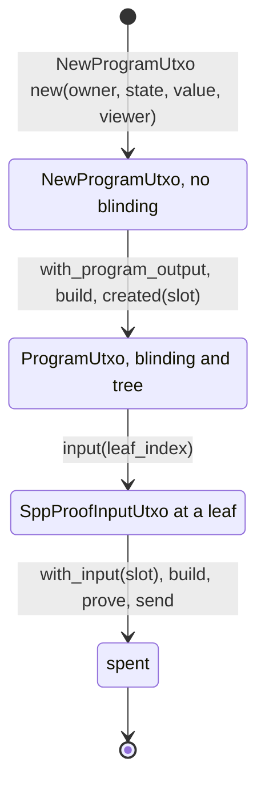

*Figure 9: program UTXO on the client.* A `NewProgramUtxo` has no blinding. It gets one only when
a transaction places it in an output slot. `BuiltTransaction::created` returns the `ProgramUtxo`,
the only type that can be spent (`input`) or fed to a circuit (`proof_inputs`). The same
`ProgramUtxo` produces the SPP input and the circuit's `ProgramUtxo[S]` inputs, so the two cannot
drift.

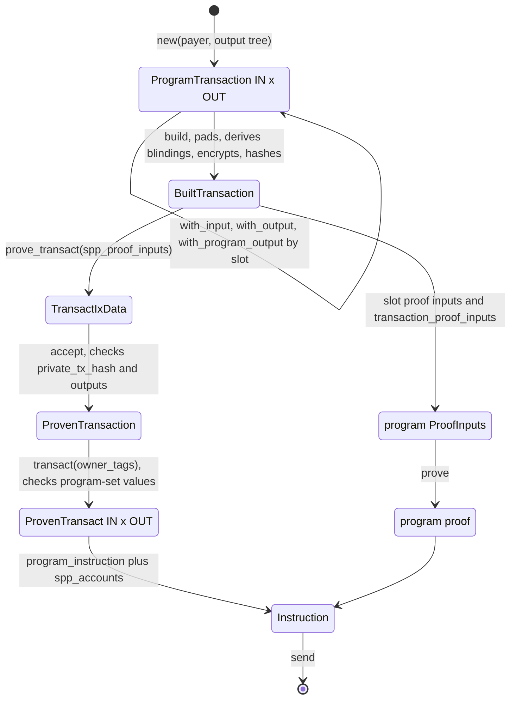

*Figure 10: new client build flow.* `build` is the single point that assigns blindings, encrypts
and computes `private_tx_hash`. Both proofs read their shared values from the `BuiltTransaction`.
`accept` compares the SPP prover's `private_tx_hash` with the builder's, and `transact` compares
every value the program will set with the proven data. A client mistake therefore fails before
sending, with a named field, instead of as an opaque on-chain proof failure.

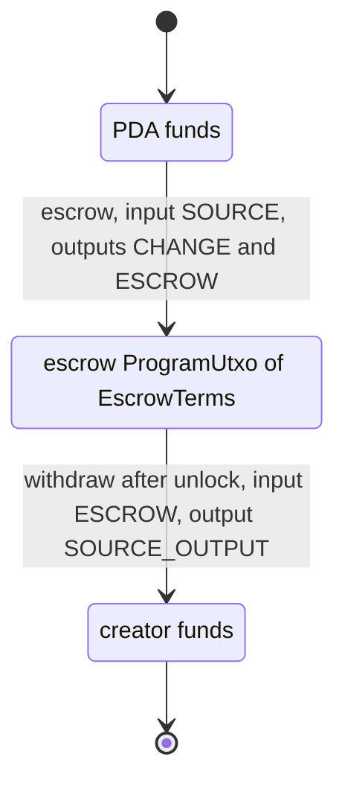

*Figure 11: timelock escrow on the new layer.*
- `escrow` sends `EscrowIxData { proof, transact: ProvenTransact<2, 2> }`. The program verifies
  the escrow proof against `transact.private_tx_hash` and assigns owner tags `[creator, escrow
  authority]`.
- `withdraw` sends `WithdrawIxData { proof, unlock_timestamp, transact: ProvenTransact<1, 1> }`.
  The program assigns the owner tag `[creator]`.

### 4.6 How the other examples map onto the generic layer

- **zk-program-swap:**
  - `OrderUtxo` becomes `ProgramUtxo<OrderTerms>`.
  - `take` uses `with_blinding_seed(take_blinding_seed)`.
  - `take_verifiable_encryption` needs an output encoding carrying raw bytes (a new
    `OutputEncoding` variant).
  - `make`'s marker message becomes a program-assigned message, the same rule as owner tags.
- **dynamic-swap:**
  - `EscrowUtxo` and `Reservation` become program UTXOs.
  - The dropped reservation ciphertext is `OutputEncoding::HashOnly`.
  - The order and reservation commit to each other, so the builder needs to expose a slot's
    blinding before build. The blinding depends only on the first nullifier, the seed and the
    slot, so that is a small extension.
- **compression:** it keeps the rebuilding model, since its state is plaintext.
  `ProgramOwner` / `ProgramState` / `ProgramUtxo` replace its hand-built `pda_shielded_address` and
  `AccountUtxo`.
- **rfq:** can use `ProgramTransaction`, `build` and `accept`. Not `spp_accounts` yet: it emits
  program signers as non-signer accounts, while rfq's cosigner has to sign itself. That needs a
  variant that marks user owner signers as signers.

---

## 5. Timelock escrow changes

### 5.1 Instruction data

Before:

```rust
struct EscrowIxData { proof: EscrowProof, transact: TransactIxData }
struct WithdrawIxData { proof: WithdrawProof, unlock_timestamp: u64, transact: TransactIxData }
```

After:

```rust
struct EscrowIxData { proof: EscrowProof, transact: ProvenTransact<2, 2> }
struct WithdrawIxData { proof: WithdrawProof, unlock_timestamp: u64, transact: ProvenTransact<1, 1> }
```

The program builds `TransactIxData` with `into_ix_data`. The owner tags come from the `creator`
signer account and the PDA it derives. No part of the instruction data is forwarded blindly.

### 5.2 Circuits

- **escrow.** The inputs are only the funding source (`ProgramUtxo[Funding]`, preimage plus its
  `owner_hash` as old state), the new state (`Terms`, `Amount`) and the transaction values.
  - The source must be a funding UTXO whose `owner_hash` equals the terms' `owner_hash`.
    - A locked escrow UTXO carries a terms hash instead, so `escrow` can no longer spend it before
      its unlock (the bypass in Figure 5).
    - Because the program tags the change with the signing creator, only the creator a funding UTXO
      names can escrow it. The funding is a proofless deposit from `NewProgramUtxo::deposit`.
  - The circuit creates the escrow UTXO with `ProgramOutput(escrow_owner_hash, terms, source
    asset, amount)`.
  - It creates the change with `Payment(terms.owner_hash, source asset, source amount - amount)`.
  - The public input becomes `Poseidon(private_tx_hash, escrow_owner_hash)`. The program passes
    the constant `ESCROW_OWNER_HASH`, which a test pins to `PdaOwner`'s derivation. That pins the
    escrow UTXO to the PDA with nullifier secret 0, without an on-chain hash per call.
- **withdraw.** The inputs are only the escrow input (`ProgramUtxo[EscrowTerms]`, preimage plus old
  state), the creator's authorization preimage and the transaction values.
  - The circuit creates the source output with `Payment(terms.owner_hash, escrow asset, escrow
    amount)`.
  - The public-input hash is unchanged.

The circuits change, so the example's insecure deterministic test keys are regenerated with
`just regen-escrow-keys`. That rewrites `program/src/verifying_keys/{escrow,withdraw}.rs` and
`timelock-escrow-keys.CHECKSUM`.

### 5.3 Test flow after

```rust
let escrow = EscrowProofInputParams { creator, source: creator_input, asset: Mint::SOL,
    amount: LOCK_AMOUNT, unlock_timestamp, output_tree_id }.build(&creator.keypair)?;
let spp_proof = indexer.prove_transact(escrow.spp_proof_inputs(), &ProgramOwner::nullifier_key())?;
let escrow_proof = EscrowProverClient::new().prove_escrow(&escrow.to_proof_inputs()?)?;
let escrow_utxo = escrow.escrow_utxo().clone();
let ix = Escrow { transaction: escrow, spp_proof, escrow_proof: escrow_proof.into() }.instruction()?;
```

The test no longer calls `prepare_output_blindings`, `get_transaction_viewing_key`,
`encrypt_transaction_data`, `ExternalData::new` or `SppTxHashes`, and it builds no `SppProofInputs`
literal.

---

## 6. Out of scope: findings in sdk-libs and other examples (report, do not fix)

1. `SppProofInputs::owner_signer_pubkeys` derives signers only from input owners.
   - A PDA can only authorize a data-bearing output through a PDA-owned input, which is why the
     escrow test funds the PDA first.
   - A proofless deposit publishes its owner and blinding. With a plain PDA-held source, anyone
     could therefore escrow it with themselves as creator, and withdraw it.
   - The example closes this inside itself: the source is a funding UTXO carrying
     `Funding { owner_hash }`, and only the signing creator it names can escrow it (see
     `timelock_escrow.md`, Funding).
   - The general fix is explicit extra owner signers in `zolana-transaction` / `zolana-client`.
     Then the source can be the creator's own plain UTXO.
5. The generic modules live in the example crates, so they depend on them:
   - the sdk `zk_program` module uses `timelock_escrow_program::spp` and the prover crate's
     `ProofInputs` types, and that crate links the escrow Go archive;
   - another example adopting them today would depend on the escrow crates.

   Extracting each module to its `sdk-libs` home (section 4) removes this.
2. zk-program-swap `make` has the same free-source-input shape as the escrow bypass.
3. `WitnessReader` fetches padding non-inclusion proofs from the first input tree, while
   `pad_input_utxos` pads in the last tree. A two-tree padded spend likely fails.
4. `ZolanaIndexer::prove_transact` ignores the configured prover URL.

---

## 7. Todos (one at a time, each verified before the next)

1. Program: add `spp.rs` (`ProvenOutput`, `ProvenTransact`, `into_ix_data`) with host unit tests
   for `into_ix_data`. Verify: `cargo test -p timelock-escrow-program`.
2. Program: slot constants, shapes and owner-tag rules in `escrow.rs` and `withdraw.rs`; switch
   both processors to `ProvenTransact`; refactor the PDA signing helper to take the transact data
   and the derived authority. Verify: `cargo test -p timelock-escrow-program`, `cargo build-sbf`
   for the program.
3. Go: add the `zkprogram` package (Transaction, Slots with Create, Output, Payment, ProgramOutput,
   State, ProgramUtxo, PlainHash) with Go unit tests. Verify: `go test`, scoped to the escrow
   circuits module (the `just example-circuits-go` recipe runs over every example).
4. Go: rewrite the escrow and withdraw circuits on `zkprogram`. The circuit takes only the input
   UTXOs, the old state and the new state it cannot derive, builds every output itself, and
   rejects a source with program state. Verify: `go vet` and `go build`.
5. Prover: add `proof_inputs.rs` and `zk_program.rs`; move `EscrowProofInputs`,
   `WithdrawProofInputs` and `EscrowTermsProofInput` to `ProofInputs` with nested fields; update
   the key-set tests. Verify: `cargo test -p timelock-escrow-prover`.
6. Keys: `just regen-escrow-keys`. Verify: `just ensure-escrow-keys` is clean.
7. SDK: add the `zk_program` module (`ProgramOwner`, `ProgramState`, `NewProgramUtxo`,
   `ProgramUtxo`, output encryption, `ProgramTransaction`, `BuiltTransaction`,
   `ProvenTransaction`, `spp_accounts`, `program_instruction`) with unit tests that need no
   localnet. Verify: `cargo test -p timelock-escrow-sdk --lib`.
8. SDK: rebuild the escrow layer on it: `EscrowTerms` as `ProgramState`, the escrow and withdraw
   params, transactions and instruction builders. Remove `SppTxHashes`, `EscrowUtxo`,
   `check_output_utxo` and `input_sum`. Verify: `cargo test -p timelock-escrow-sdk`, including
   the circuit prove/verify tests rewritten onto the builder.
9. Test: migrate `test/tests/escrow.rs` to the new flow. Rejection cases live where they need no
   localnet:
   - `sdk/tests/escrow_circuit.rs`: a locked escrow UTXO as the source, a zero amount and another
     blinding seed fail to prove.
   - `sdk/tests/withdraw_circuit.rs`: a withdraw paying another owner fails to prove.
   - `sdk/tests/zk_program.rs`: a foreign owner tag, a proof of another transaction and misplaced
     slots fail before sending.

   Verify: `just test-escrow-validator`.
10. Bench: migrate `test/tests/bench_cu.rs` and regenerate `BENCHMARK.md` with `just bench-escrow`.
    The replay warps mollusk to the tree fixture's last update slot; without the warp, SPP rejects
    the append as `InvalidUpdateSlot`.
11. Docs: update `timelock_escrow.md` (instruction data, accounts, circuits, the bypass fix).
12. Lint and format: `cargo fmt`, `cargo clippy` for the example crates, `gofmt` for the circuits.
13. Review: self-review the diff against this plan, then a subagent review.

## 8. Acceptance criteria

1. No file outside `sdk-tests/timelock-escrow` changes, except `Cargo.lock` if a dependency
   changes.
2. The generic modules (`program/src/spp.rs`, `prover/circuits/zkprogram`,
   `prover/src/{proof_inputs,zk_program}.rs`, `sdk/src/zk_program`) contain no escrow types or
   constants.
3. The escrow program no longer deserializes a `TransactIxData` from its instruction data. It
   builds it with `ProvenTransact::into_ix_data` and program-assigned owner tags.
4. Neither the sdk nor the test depends on `zolana_test_utils` for blindings, encryption or the
   transaction viewing key.
5. `private_tx_hash` is computed once on the client and checked against the SPP prover's output
   before an instruction is built.
6. The escrow circuit accepts only the signing creator's funding UTXO as its source, so neither
   a locked escrow UTXO nor someone else's deposit can be escrowed.
7. The circuits build every output UTXO themselves. A circuit's inputs are the input UTXOs, the
   old state of spent program UTXOs, and only the new state it cannot derive.
8. `cargo test` passes for the program, prover and sdk crates. The escrow localnet test passes.
   Keys verify with `just ensure-escrow-keys`. The CU bench runs.

---

## 9. Arkworks R1CS variant

2026-09-24. A parallel crate, `sdk-tests/timelock-escrow/arkworks` (`timelock-escrow-arkworks`,
arkworks 0.5 to match the workspace). The program keeps its gnark verifying keys; this crate
shows the same abstractions with circuits written in Rust.

The point is the property `LightAccount` gets from sharing code between program and client: one
definition. Every state (`EscrowTerms`, `Funding`), the UTXO hash, `ConfidentialTransaction` with
in-circuit `create`, and the escrow and withdraw relations are written once, over one concrete
type, `CircuitVar` (`FpVar<Fr>`). Developers never see an arkworks generic:

- **Constants run natively.** Proof inputs built from the SDK are `CircuitVar` constants, and
  every operation on constants folds to a constant. The client computes the output hashes,
  `private_tx_hash` and the public input with the exact code the circuit enforces, and a broken
  rule fails with a named `RelationError` instead of an unsatisfied constraint.
- **Allocated variables are the R1CS circuit.** `ProofInput::allocate` turns the same values into
  private variables, and `ArkworksCircuit` runs the same relation over them. Poseidon is built
  from light-poseidon's own parameters, the source `zolana_hasher` uses natively.

Layout:

- `arkworks/circuit-lib` (`circuit-lib`): everything not specific to the escrow. `CircuitVar`,
  `ProofInput`, `Assert`, `poseidon`, `Utxo`, `DataHash`, `DataUtxo` (the `LightAccount`
  counterpart: `new_init` / `from_output_utxo` / `new_mut` / `new_burn`), `TokenUtxo` (several
  UTXOs of one owner and asset, with `transfer` and automatic change),
  `ConfidentialTransaction` (input and output slots, `private_tx_hash`),
  `TransactionProofInputs`, `Circuit` / `ArkworksCircuit`, Groth16 and groth16-solana helpers,
  and `convert` from SDK bytes.
- `arkworks` (`timelock-escrow-arkworks`): only the escrow. The `EscrowTerms` and `Funding`
  states, the `Escrow` and `Withdraw` circuits, and their construction from the SDK's
  `EscrowProofInputs` / `WithdrawProofInputs`, the same proof inputs the gnark prover takes.
- `arkworks/README.md`: every name with what it is good for, and the flow diagrams.

Slot constants come straight from the program crate. The proof inputs are built from the SDK's
typed objects, with no key strings and no Go.

Todos (one at a time, each verified before the next):

1. Crate skeleton and root workspace member lines. Done.
2. `CircuitVar`, `ProofInput`, `Assert`, Poseidon over constants and allocated variables. Verify:
   Poseidon equals `zolana_hasher` for arities 1 to 7. Done.
3. circuit-lib: `Utxo`, `DataHash`, `InputHash`, `Output`, `payment`, `plain_hash`, `DataUtxo`,
   `TokenUtxo`, `TransactionProofInputs`, `ConfidentialTransaction`, `hash_chain4`, blinding
   derivations. Verify: native results equal `ProofInputUtxo::hash`, `PrivateTxHash` and
   `zolana_program::derivation`, and the R1CS run is satisfied with the same hash. Done.
4. `Circuit` / `ArkworksCircuit` in circuit-lib; the escrow and withdraw circuits in the example
   crate, with proof inputs built from the SDK transactions. Verify: the native public input
   equals the program's `EscrowPublicInput` / `WithdrawPublicInput` over the builder's
   `private_tx_hash`, and the constraint system is satisfied. Done.
5. Groth16 setup, prove and verify helpers in circuit-lib, plus conversion of arkworks keys and
   proofs to the groth16-solana byte layout and verification with `groth16-solana`, the verifier
   the program uses. Rejection cases: a locked escrow UTXO or another creator's funding as the
   source, a zero amount, another blinding seed, a withdraw to another signer. Done.
6. Compare constraint counts with the gnark circuits, lint, format and review. Counts: escrow
   4,782 (gnark 4,784), withdraw 3,346 (gnark 3,347).
7. `arkworks/README.md`: every trait and abstraction name with one sentence on what it is good
   for, and a state machine diagram of how the abstractions fit into the overall flow, from the
   SDK transaction through proof inputs, the native run, the R1CS run and Groth16 to the
   program. Done.

## 10. Implement `arkworks/spec.md`

2026-09-25. Implement [`arkworks/spec.md`](arkworks/spec.md) in circuit-lib and the example
crate, adapting the existing Rust circuits. Requirements from the user:

- Do not modify the program, send Solana transactions or generate SPP proofs.
- Add a new test file that, for every instruction (escrow, withdraw), builds the proof inputs
  through the client, generates the Groth16 proof from the Rust circuit, and produces the SPP
  proof inputs.
- Todos one at a time, each tested before the next.

Decisions made while implementing, recorded in the spec:

- The withdraw needs the spec's open item. A burned `DataUtxo` gets
  `transfer(recipient, amount) -> OutputTokenUtxo`, like a `TokenUtxo`, with no change.
- The program is unchanged, so its public input hash still follows the current protocol. The new
  proofs verify with the program's `verify_groth16` against the spec's public hash.

Todos:

1. Types and instantiation: `Uint<BITS>` / `U64` / `U32` / `U16`, `Bool`, `RangeCheck`,
   `check_bits` / `check_is_bool`, `ProofInput` with an associated `Circuit` type and
   instantiation (native or R1CS). Verify: named error natively and an unsatisfied constraint
   system in R1CS for an out-of-range value. Done.
2. UTXO types: `Utxo` with dummies, `DataHash`, `OutputTokenUtxo`, `DataUtxo<S>` (`new_init`,
   `from_output_utxo`, `new_mut`, `new_burn`, `transfer` when burned), `TokenUtxo<N>` (`Init` /
   `Mut` / `Burn`, dummies, `transfer`, `deposit`, `withdraw`).
   Verify natively and in R1CS. Done.
3. `TxContext`, `PublicInputs`, `ConfidentialTransaction<IN, OUT>` builder and `check`, with
   `private_tx_hash` without `external_data_hash`. Verify against an independent computation
   with `zolana_hasher`. Done.
4. `Circuit` trait and `ArkworksCircuit` (public hash as the only instance variable),
   `check_constraints`, Groth16 setup, prove and verify. Done.
5. circuit-lib `client` module: `TxContext`, `TokenUtxo`, `OutputTokenUtxo`, `DataUtxo`,
   `ConfidentialTransaction` with real Rust types, producing `SppProofInputs`, the circuit's
   proof inputs and the public hash. Done.
6. Example crate: `EscrowTerms`, the escrow and withdraw circuits and their `client`
   counterparts. Remove the old circuits and tests. Done.
7. New test file: for escrow and withdraw, client build, drift check (native circuit run equals
   the client's public hash), Groth16 proof verified by `verify_groth16`, SPP proof inputs with a
   valid shape and output hashes equal to the client's. Done: `arkworks/tests/proofs.rs`,
   plus `tests/rules.rs` for the broken rules.
8. fmt, clippy, README, and a review. Done: the review's burn-balance, dummy-domain, owner-hash
   and test findings are fixed.

Acceptance criteria:

- `cargo test -p circuit-lib -p timelock-escrow-arkworks` passes.
- `cargo clippy -p circuit-lib -p timelock-escrow-arkworks --all-targets -- -D warnings` is clean.
- No change under `sdk-tests/timelock-escrow/program`.

## 11. One `circuit` fn for client and prover

2026-09-25. Implement the updated [`arkworks/spec.md`](arkworks/spec.md): plain Rust proof inputs,
records from the native run, `ZkProgram::create_proof_inputs_and_encrypt`, and the `client` /
`setup` features. Starting point: commit `997691713`. Todos one at a time, each tested before
the next. The program stays unchanged.

Decisions made while planning:

- `SppTransaction` holds `spp_proof_inputs` and `private_tx_hash`, without `output(slot)`.
- A spent UTXO has no viewing key, so every output owner, change included, comes from a
  `ShieldedAddress` input.
- `TxContext::new(first_nullifier, output_tree_id)` picks the blinding seed.
  `create_proof_inputs_and_encrypt` takes the inputs by value and returns them with the
  `SppTransaction`.
- `setup` writes the arkworks verifying key in gnark's raw layout and exports it with
  groth16-solana's `generate_bsb22_vk_file`, the generator the program's keys come from.

Todos:

1. Plain Rust proof inputs: `ProofInput` for `u64`, `u32`, `u16`, `bool`, `[u8; 32]`,
   `ShieldedAddress`, `Mint`, `SppProofInputUtxo`. `Allocator::Native` keeps the records. Remove
   `Uint` / `Bool` / `PublicHash`. Verify: named errors natively, unsatisfied R1CS, records filled.
   Done.
2. `TxContext` (bytes) and `TxContextCircuit`. `check` returns `CheckedTransaction` with the
   public hash and the slots. `Circuit::circuit` returns it. `ArkworksCircuit` allocates the
   public hash itself. `UtxoData` on states. Verify with the transaction tests. Done.
3. `ZkProgram` and `SppTransaction` behind `client`: resolve the slots, check the first
   nullifier, convert amounts, encrypt, build `SppProofInputs`. Remove the client copies. Verify:
   SPP hashes equal the circuit's, and every resolution failure has a named error. Done.
4. `setup` feature: proving key write and read, verifying key export. Verify: the exported file
   defines `VERIFYINGKEY` with the insecure test marker, and a proof verifies against it.
   Done.
5. Example crate on the new API. Verify with `tests/proofs.rs` and `tests/rules.rs`, inputs
   inline. Done.
6. README, fmt, clippy, review. Review fixes: refusal tests compare against the circuit's own
   R1CS public hash, a valueless data UTXO resolves to SOL, dummy inputs take the nearest earlier
   real input's tree, the test circuits have no flags, and `tests/functional.rs` runs escrow then
   withdraw without tampering. Done.

## 12. zk-program-sdk layout

2026-09-25. `arkworks/circuit-lib` becomes `arkworks/zk-program-sdk` (crate `zk-program-sdk`),
with its modules grouped by the phase that uses them. No behavior changes.

- `circuit/`: the DSL. `var.rs`, `utxo.rs`, `transaction.rs`, and the `Circuit` trait in
  `mod.rs`.
- `conversion/`: client values to circuit values. `ProofInput`, `Allocator` and `Records` in
  `mod.rs`; the `ProofInput` impls in `var.rs`, `utxo.rs` and `transaction.rs`. Replaces
  `convert`.
- `client/`: `TxContext` in `mod.rs`; `ZkProgram` and `SppTransaction` in `transaction.rs` and
  the SPP resolution in `utxo.rs`, both behind feature `client`.
- `circuit_lib/`: `poseidon` and `hash_chain4`.
- `prover/`: `ArkworksCircuit` and `groth16.rs`.

Todos:

1. Rename the directory, package and imports. Verify: tests pass. Done.
2. Split the modules into the phase directories. Verify: tests, clippy on every feature set,
   fmt. Done.
3. README layout section, spec and plan. Done.

## 13. Client types first

2026-09-25. A Solana developer writes and uses the plain types. The circuit types move into a
`circuit` module under the same names, as the updated [`arkworks/spec.md`](arkworks/spec.md)
describes. Todos one at a time, each tested before the next.

Decisions:

- Module path, not suffix: `EscrowCircuit` becomes `circuit::Escrow`, `TxContextCircuit`
  becomes `circuit::TxContext`.
- A state's UTXO data is the borsh encoding of its client form. The escrow data grows from 8
  bytes to 40 (`creator || unlock`). Nothing in the arkworks example or the program reads the
  old format.
- `conversion` stays public: everything a future macro derives can be written by hand.

Todos:

1. SDK paths: the root holds the client and prover surface; `pub mod circuit` holds the DSL;
   `ProofInput`, `Allocator` and `Records` only under `conversion`; no `client::` path. Verify:
   tests. Done.
2. SDK `FromCircuit` for `u64`, `u32`, `u16`, `bool`, `[u8; 32]`, and `UtxoData { type Client }`.
   `with_data_utxo` stores the borsh bytes of the converted state. The SDK test circuits follow
   the same split. Verify: tests, including a `FromCircuit` range error. Done.
3. Example crate: client types at the root, circuit types in `circuit`, borsh on
   `EscrowTerms`. `tests/functional.rs` reads the withdraw's terms back from the escrow data.
   Verify: tests. Done.
4. README, fmt, clippy on every feature set. Done.

## 14. Encrypt through the transaction crate

2026-09-25. `create_proof_inputs_and_encrypt` builds `zolana_transaction::ConfidentialTransaction`
from the resolved slots and encrypts with it, as the updated
[`arkworks/spec.md`](arkworks/spec.md) describes. The transaction crate gains the protocol
assumption's hash. Todos one at a time, each tested before the next.

Decisions:

- The transaction crate changes are additive. `PrivateTxHash` and `message_hash` keep the
  current protocol, because the shielded-pool tests prove against the real SPP.
- Spent UTXOs are `WalletUtxo`s, so the client holds what `ConfidentialTransaction::new` takes.
- The circuit pads unused output slots with zero-SOL outputs to `tx_context.sender`, as the
  transaction crate does, so no slot is left without a ciphertext.
- `SppTransaction` goes: the transaction crate recomputes `private_tx_hash` from the
  `SppProofInputs`.

Todos:

1. Transaction crate: `ConfidentialTransaction::with_blinding_seed`, `WalletUtxo::dummy`,
   `SppProofInputs::private_tx_hash_without_external_data`. Verify: `cargo test -p
   zolana-transaction`, with tests for the three additions. Done.
2. Circuit: `TxContext` gains `sender`, and `check` pads unused output slots to it. Verify:
   zk-program-sdk tests. Done.
3. Conversion and client: `ProofInput for WalletUtxo` replaces the `SppProofInputUtxo` one,
   records hold `WalletUtxo`s, and `create_proof_inputs_and_encrypt` takes `ShieldedKeys` and
   encrypts through `ConfidentialTransaction`. Our own ciphertext and external data code goes.
   Verify: zk-program-sdk tests, including the hash cross-check. Done.
4. Example crate: `WalletUtxo` inputs and `escrow_input`. Verify: example tests. Done.
5. README, fmt, clippy on every feature set, and `cargo check --workspace --all-targets`. Done.

## 15. Owner and asset preimages

2026-09-25. Implement [`arkworks/docs/circuit_preimage_types.md`](arkworks/docs/circuit_preimage_types.md):
circuits always work on owner and asset preimages and hash them in the circuit. Todos one at a
time, each tested before the next.

Decisions:

- Always preimages, no hash-only variant.
- The SPP proof checks dummies. A dummy slot contributes 0 to the input chain and skips every
  constraint except hashing, so a dummy preimage is all zeros. Only the owner tag check is
  gated on the slot being real: zero bytes already pass the byte range checks.
- `Owner`, `OwnerKey` and `Asset` compute their hashes once, lazily, and reuse them.
- `TokenUtxo<N>` keeps up to `N` real inputs, with the dummy flag read from the domain.

Todos:

1. Preimage types: `circuit::Bytes<N>`, the `hash_bytes` gadget, `circuit::Asset`,
   `circuit::OwnerKey`, `circuit::Owner`; client `Bytes<N>` and `Owner`; `ProofInput` and
   `FromCircuit` for `u8`, `Bytes<N>` and `Owner`. Existing code unchanged. Verify: parity with
   `hash_bytes<32>`, `hash_bytes<33>` and `owner_hash` for Ed25519, PDA and P256; a byte of 256
   or more and a tag outside {S, P} are unsatisfied; a gated all-zero owner is satisfied. Done:
   `ProofInput`/`FromCircuit` for `u8` would overlap the `[u8; 32]` field impl, so the tag is
   allocated directly; the gated all-zero owner is tested with todo 2.
2. Switch the SDK: `circuit::Utxo`, `TokenUtxo`, `DataUtxo`, `OutputTokenUtxo`, `Output` and
   `TxContext.sender` carry `Owner` and `Asset`; `ShieldedAddress`, `Mint` and `WalletUtxo`
   instantiate to preimages; `TryFrom<&ProofInputUtxo> for Utxo` goes. Verify: zk-program-sdk
   tests, with fixtures built from keypairs and mints. Done.
3. Example: `EscrowTerms.creator` is an `Owner`; withdraw checks the creator's identity against
   `owner_identity`; the unread `creator` inputs and `creator_nullifier_pk` go. Verify: example
   tests. Done: escrow 9,710 constraints (was 5,570), withdraw 5,591 (was 3,471).
4. Spec, README, preimage doc, fmt, clippy on every feature set, constraint counts. Done.

## 16. Later token inputs reuse the first input's owner and asset

2026-09-25. From the review of section 15: `TokenUtxo` hashes every input after the first with
the first input's owner and asset hashes instead of hashing each input's own preimages.

Decisions:

- Later inputs are compared with the first on their packed preimage chunks (two for the key,
  one for the nullifier key, two for the asset) in both runs, instead of on their hashes. The
  R1CS keeps refusing another owner or asset, and equal chunks make the first input's hashes
  exact for the later input.

Todos:

1. `Utxo::hash_with(owner_hash, asset_hash)`, `Owner`/`Asset::assert_same_unless` over packed
   chunks; `TokenUtxo::spend` uses both. Verify: zk-program-sdk and example tests. Done:
   escrow 8,993 constraints (was 9,710).
2. Spec, preimage doc, README constraint counts. Done.

## 17. Padding-independent `private_tx_hash`

2026-09-25. The logic circuit no longer has an SPP shape. It assumes the protocol change in
[`docs/padding_independent_private_tx_hash.md`](../../docs/padding_independent_private_tx_hash.md):
`private_tx_hash` chains only nonzero entries and padding outputs are empty UTXOs.

Decisions:

- `ConfidentialTransaction<P>` drops `IN` and `OUT` and adds no padding. `check` chains the
  inputs and outputs with `nonzero_hash_chain`; the address chain of a transaction without
  addresses is 0.
- The client drops the circuit's dummies, picks the smallest shape with `canonical_shape`, and
  pads with `pad_utxos_with_empty_outputs`.
- An empty output carries the tag of a real output owner, the sender when it owns one, and a
  zero-SOL ciphertext encrypted for that owner, the bytes an owner-bound padding output
  publishes today. `add_output_utxo` refuses an ownerless output, so only padding is empty.
- The escrow program keeps its fixed `ProvenTransact` shapes; making it shape-generic is a
  separate change.

Todos:

1. `docs/padding_independent_private_tx_hash.md`. Done.
2. `zolana-transaction`: `padding_independent_private_tx_hash` (replaces
   `private_tx_hash_without_external_data`), `pad_utxos_with_empty_outputs`, empty output
   encryption. Verify: `cargo test -p zolana-transaction`. Done.
3. zk-program-sdk: `nonzero_hash_chain`, shape-free `ConfidentialTransaction`, client shape
   selection; example circuits without `N_INPUTS`/`N_OUTPUTS`. Verify: zk-program-sdk and
   example tests. Done.
4. Spec, README, preimage doc, constraint counts. Done: escrow 9,377 (was 8,993), withdraw 6,071 (was 5,591), one width-3 Poseidon per real UTXO. With `ESCROW_TOKEN_INPUTS = 5`, the most any auto-selected SPP shape with two outputs takes, the escrow has 14,468.

